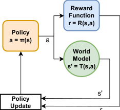
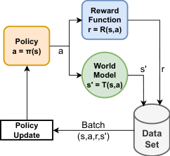
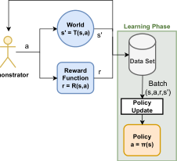
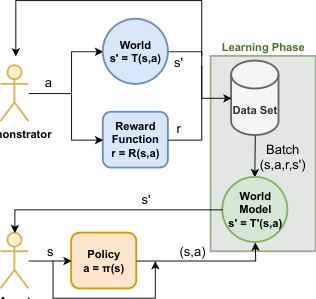
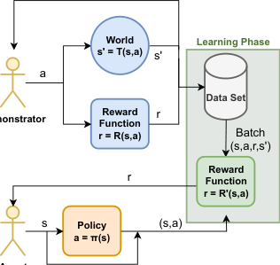

## A SURVEY OF DEMONSTRATION LEARNING


**André Correia**

NOVA LINCS

Universidade da Beira Interior
Covilhã, Portugal
```
 andre.correia@ubi.pt

```


**Luís A. Alexandre**

NOVA LINCS

Universidade da Beira Interior
Covilhã, Portugal
```
 luis.alexandre@ubi.pt

```


**ABSTRACT**


With the fast improvement of machine learning, reinforcement learning (RL) has been used to automate human tasks in different areas. However, training such agents is difficult and restricted to
expert users. Moreover, it is mostly limited to simulation environments due to the high cost and
safety concerns of interactions in the real world. Demonstration Learning is a paradigm in which
an agent learns to perform a task by imitating the behavior of an expert shown in demonstrations.
It is a relatively recent area in machine learning, but it is gaining significant traction due to having
tremendous potential for learning complex behaviors from demonstrations. Learning from demonstration accelerates the learning process by improving sample efficiency, while also reducing the
effort of the programmer. Due to learning without interacting with the environment, demonstration
learning would allow the automation of a wide range of real world applications such as robotics and
healthcare. This paper provides a survey of demonstration learning, where we formally introduce the
demonstration problem along with its main challenges and provide a comprehensive overview of the
process of learning from demonstrations from the creation of the demonstration data set, to learning
methods from demonstrations, and optimization by combining demonstration learning with different
machine learning methods. We also review the existing benchmarks and identify their strengths and
limitations. Additionally, we discuss the advantages and disadvantages of the paradigm as well as its
main applications. Lastly, we discuss our perspective on open problems and research directions for
this rapidly growing field.


_**Keywords**_ Machine Learning, Demonstration Learning, Imitation Learning


**1** **Introduction**


The need for intelligent systems that mimic human behavior has increased. Future directions in artificial intelligence
focus on replacing humans with machines that replicate the desired behavior more consistently. Such examples include
self-driving vehicles [176] and surgical robots [79]. This push results in continuous advancements in the area of artificial
intelligence, where increasingly more difficult problems are solved each year. Traditional machine learning methods
focus on learning to perform the task while disregarding how the task is accomplished. Copying human behavior implies
replicating a sequence of actions that the human would take in different situations. The human behavior can be recorded
in the form of demonstration data sets. These data sets can then be used to train a method that replicates the human
behavior, by choosing the correct action given the current state of the agent and the environment. The solution to this
problem involves learning the correct mapping between the states of the environment and the actions of the agent.


This mapping is known in computer science as a policy, a function that selects an action based on the current state.
Traditional programming approaches specify the action for every possible state. Moreover, a different algorithm is
required for each task and environment. Furthermore, such algorithms do not scale to high-dimensional environments
or continuous action spaces, because specifying the ideal action for all possible state conditions can be tedious or
computationally impractical. Hence, these approaches require expertise in the specific area in addition to programming
knowledge, which are expensive. Because of this, machine learning techniques offer a solution to learn the policies
automatically from data. The common method to learn a policy is through reinforcement learning. In this family of
methods, the agent learns the policy through trial-and-error interactions with the environment. After each interaction,


A Survey of Demonstration Learning CLFD


the agent receives feedback and adjusts its policy accordingly. The agent often learns super-human policies [7], reaching
the task’s goal by performing sets of impossible or unlikely actions for a human to perform. This behavior can be
advantageous if the goal is maximum performance or disadvantageous if the agent’s goal is to behave naturally. The
clear disadvantage of reinforcement learning approaches is that they require a large number of interactions. Even though
deep RL has seen immense progress and has tremendous potential it is mostly limited to video games and simulations.
Because the agent learns from failure and tries random actions, the agent and everything in its proximity are potentially
unsafe during the agent’s learning process if learning is to take place in a real world environment. This fact prevents its
application to the real world such as robotics, and healthcare. Furthermore, reinforcement learning is extremely data
inefficient requiring many interactions to converge due to the need for exploration. Hence, using prior data fastens the

process.


Because of these reasons, learning from demonstrations is an appealing alternative to reinforcement learning. In [143],
the authors proposed an off-policy RL algorithm that can learn to play Atari games from image data. Two years later,
AlphaGo [63] trained the first computer agent capable of beating a professional Go player. Here, the agent has access to
a data set of interactions with the environment performed by an expert teacher. The agent learns the policy from the
demonstrated state-action pairs present in the data set. The goal of demonstration learning is to learn complex function
approximators like RL, from recorded data, like in supervised learning. Providing examples of the actions that result in
success avoids the need to try incorrect actions during an exploration phase. Hence, the agent remains safe during the
learning process because it does not have to interact with the environment. Additionally, the demonstrations ensure that
the agent learns the desired behavior exhibited in the data set, avoiding falling into a local minimum, and converges
faster than reinforcement learning. In [7], an agent is pre-trained on demonstration data such that the convergence and
its online interactions are safer. Later, [144] proposed an algorithm to learn solely from demonstrations, causing the
field to gain traction. Alternatively, the demonstrations can be used to learn a dynamics model, which allows the agent
to collect new transitions and learn through online RL without having to interact with the environment. Additionally,
through Inverse Reinforcement Learning (IRL) the demonstrations can be used to learn a reward function and avoid
designing it, which is difficult in high-dimensional domains.


However, the agent is completely reliant on the demonstrations for learning. The demonstrations must cover the state
space for the agent to learn the task. Depending on the task, this can be difficult and expensive due to the size of
the state and action spaces. Demonstration learning methods attempt to generalize to unseen states. However, unlike
supervised learning, the data is not i.i.d, which makes generalization difficult. Then, if the agent encounters states
outside the distribution of the data set it likely fails and such a failure has serious consequences in the real world.
Because of this, the demonstration learning methods try to mitigate the distributional shift, which is still an open
problem. Furthermore, recording demonstrations performed by a human requires finding a way to record the state-action
pairs in the demonstrations, showing good behavior, and covering various settings. The demonstrations can suffer from
noise in the sensors used to capture the demonstrations, inaccuracies, or inconsistencies of the demonstrator. Therefore,
demonstration learning approaches avoid the direct copy of the demonstrated behavior and attempt to generalize to
non-demonstrated trajectories. The usage of demonstration data sets is the primary source of differentiation between
demonstration learning methods. The usage of demonstrations reduces the programming overhead, opening the doors
for non-experts. Consequently, this area has seen an exponential increase in interest due to its tremendous potential.
After learning the policy from demonstrations, it can be refined with online interactions through RL, with the benefit
that the initial policy is safer than an initial random RL policy.


The paradigm was created in the eighties and has since been viewed as the future of robotics [1, 2]. Since then, it has
been applied to teach a plethora of tasks and to a variety of robots. Such applications include aerial and grounded
navigation [6], video games [7], and controlling different kinds of robots ranging from manipulators [8] to humanoids

[9]. Due to deep learning, research interest in teaching robots through demonstrations has grown exponentially over
the past two decades, resulting in significant growth in the number of publications. This fast growth resulted in the
creation of various surveys. The first surveys review the beginning of the history of the paradigm and early attempts to
teach robots from demonstrations. One presented an overview of demonstration learning and defined the problem using
four core questions for the field: how, what, when, and whom to imitate [10]. In a following survey, [5], the authors
address different design choices and propose a categorization for the field. Later, [11] focuses on reviewing artificial
intelligence methods which are used to estimate the policies. [13] reviews recent research and development in the
field with the main focus being how to demonstrate behaviors to assembly robots, and how to extract the manipulation
features. [213] provides a survey of inverse reinforcement learning. In [14], the authors provide an overview of the
collection of machine-learning methods and show their respective advantages and disadvantages. Next, [188] and later

[212], provide a review of offline reinforcement learning methods. The timeline of published surveys is represented in
Fig. 1.


Even though the surveys mentioned above aimed at restricting the terminology, it remains diverse in papers published
in recent years. Demonstration learning, imitation learning, behavioral cloning, and offline reinforcement learning are


2


A Survey of Demonstration Learning CLFD


1996 - Schaal Learning from demonstration [7]


1999 Schaal - Future Prospects [8]


2009 Argall et. al. - Survey of Demonstration Learning [13]


2017 Hussein et. al. - Survey of Demonstration Learning [14]
2018 Zhu et. al. - Survey for Robotic Assembly [15]


2019 Fang et. al. - Survey for Robotic Manipulation [23]


2020 Levine et. al. - Survey of Offline RL [18] 2020 Ravichandar et. al. - Survey of Demonstration Learning for Robots [17]


2021 Arora et. al. - Survey of Inverse RL [16]


2022 Prudencio et. al. - Survey of Offline RL [19]


**2023 This Survey**


Rysunek 1: Timeline of surveys. General demonstration learning surveys are presented on the right side, while surveys
specific to a sub-area or application are presented on the left side.


popular terms used to describe the same paradigm. For consistency, this survey uses demonstration learning to refer to
the paradigm.


Due to the rapid growth of the field, there is a need for a new survey. This survey provides an overview of the steps
required to learn from demonstrations and the different methods employed by researchers in each step. The reviewed
literature covers a variety of applications. The survey explains each step in a general way such that it can be applied
to most tasks. The following section 2 presents a formal definition of the demonstration learning problem. Section
3, discusses the methods for collecting demonstration data and creating the data sets. Next, in section 4, the learning
methods available from the demonstration data are explained. Then, we present the available benchmarks in section
6. Next, in section 7 the main applications of demonstration learning are listed, followed by the advantages and
disadvantages of the paradigm in section 8. Lastly, in section 9 the future directions that demonstration learning research
should tackle are discussed, ending with a conclusion in section 10.


**2** **Problem Definition**


This section explains the demonstration learning problem and several relevant concepts. The overall sequence of steps
in demonstration learning is represented in figure 2.


An agent is an entity that autonomously interacts within an environment toward achieving or optimizing a goal [66]. It
receives information from the environment through its sensors and interacts with the environment using its actuators,
based on its policy.


Demonstration learning is a mixture of supervised learning and reinforcement learning. In supervised learning, the agent
receives the labeled training data and learns an approximation to the function that produced the data. In reinforcement
learning, the agent must collect interaction data to learn from, by interacting with the environment through trial and
error. In demonstration learning, the training data is a set of environment interactions collected beforehand by a teacher
executing a task. The goal of demonstration learning is to have an agent perform a task by learning from interactions
demonstrated by an expert demonstrator and recorded in a data set.


Demonstration learning expands from the reinforcement learning paradigm commonly defined as a Markov Decision
Process (MDP), formulated by the tuple _< S, A, P,_ ∆0 _, R, λ >_ [15]. An MDP is a mathematical formulation that
enables the creation of theoretical statements and proofs in RL, where _S_ is the set of the possible environment states,
_s ∈_ _S_, and ∆0 denotes the initial state distribution. At each state, the agent can choose an action _a ∈_ _A_ from the set of
possible actions. Acting changes the state of the environment. The mapping between states through the actions is defined
by the state transition function _P_ ( _st_ +1 _| st, at_ ) : _S × A →_ _S_ . The Markov property determines that the transition
function completely defines the dynamics of the environment. That is, the probability of state _st_ +1, only depends on
the current state _st_ and selected action _at_, regardless of past transitions. The policy _π_ : _S →_ _A_ is a function that
selects an action given a state of the environment. A more common definition is to formulate the policy as a probability
distribution _π_ ( _at | st_ ), where the policy returns the probability of taking action _at_ given the agent is at the current state
_st_ . The correct selection of the action for any given state is what allows the agent to perform the task. After interacting
with the environment, the agent receives a reward _rt_ = _R_ ( _st, at, st_ +1), which indicates the quality of the interaction. In


3


A Survey of Demonstration Learning CLFD

|ChoosetheDemonstrator|Col2|Col3|Col4|Col5|Col6|Col7|Col8|
|---|---|---|---|---|---|---|---|
|**Agent**|**Agent**|**Teacher**|**Teacher**|**Teacher**|**Teacher**|**Other**|**Other**|
|||||||||
|**Choosethe Demonstration Technique**|**Choosethe Demonstration Technique**|**Choosethe Demonstration Technique**|**Choosethe Demonstration Technique**|**Choosethe Demonstration Technique**|**Choosethe Demonstration Technique**|**Choosethe Demonstration Technique**|**Choosethe Demonstration Technique**|
|**Direct**|**Direct**|**Direct**|**Direct**|**Indirect**|**Indirect**|**Indirect**|**Indirect**|
|Kinesthetic<br>Teleoperation<br>Shadowing<br>Observation<br>Sensors on Teacher|Kinesthetic<br>Teleoperation<br>Shadowing<br>Observation<br>Sensors on Teacher|Kinesthetic<br>Teleoperation<br>Shadowing<br>Observation<br>Sensors on Teacher|Kinesthetic<br>Teleoperation<br>Shadowing<br>Observation<br>Sensors on Teacher|Kinesthetic<br>Teleoperation<br>Shadowing<br>Observation<br>Sensors on Teacher|Kinesthetic<br>Teleoperation<br>Shadowing<br>Observation<br>Sensors on Teacher|Kinesthetic<br>Teleoperation<br>Shadowing<br>Observation<br>Sensors on Teacher|Kinesthetic<br>Teleoperation<br>Shadowing<br>Observation<br>Sensors on Teacher|
|||||||||
|**Data Representation**|**Data Representation**|**Data Representation**|**Data Representation**|**Data Representation**|**Data Representation**|**Data Representation**|**Data Representation**|
|**Raw Features**|**Raw Features**|**Designed Features**|**Designed Features**|**Designed Features**|**Designed Features**|**Extracted Features**|**Extracted Features**|
|||||||||
|**Learning Methods**|**Learning Methods**|**Learning Methods**|**Learning Methods**|**Learning Methods**|**Learning Methods**|**Learning Methods**|**Learning Methods**|
|**Policy**|**Policy**|**Inverse RL**|**Inverse RL**|**Inverse RL**|**Inverse RL**|**Model**|**Model**|
|**Apprenticeship**|**Apprenticeship**|**GAIL**|**GAIL**|**GAIL**|**GAIL**|**Sequence Models**|**Sequence Models**|
|||||||||
|**Optimization**|**Optimization**|**Optimization**|**Optimization**|**Optimization**|**Optimization**|**Optimization**|**Optimization**|
|**Online RL**|**Evolutionary**|**Evolutionary**|**Transfer**|**Transfer**|**Adaptive**|**Adaptive**|**Active**|
|||||||||
|**Evaluation**|**Evaluation**|**Evaluation**|**Evaluation**|**Evaluation**|**Evaluation**|**Evaluation**|**Evaluation**|
|**Quantitative**|**Quantitative**|**Quantitative**|**Quantitative**|**Qualitative**|**Qualitative**|**Qualitative**|**Qualitative**|


Rysunek 2: Demonstration learning flowchart.


reinforcement learning, the policy is optimized to maximize the expected future rewards E[ [�] _[∞]_ _t_ =0 _[λR]_ [(] _[s][t][, a][t][, s][t]_ [+1][)]][. A]
trajectory is a sequence of _H_ + 1 states and _H_ actions and rewards _τ_ = ( _s_ 0 _, a_ 0 _, r_ 0 _, ..., sH_ ), where _H_ is the episode’s
horizon, which may be infinite in the case of non-episodic environments. With these definitions, the probability density
function for a given trajectory _τ_ under the policy _π_ is _ρπ_ ( _τ_ ) = ∆0( _s_ 0) [�] _[H]_ _t_ =0 _[−]_ [1] _[π]_ [(] _[a][t][ |][ s][t]_ [)] _[P]_ [(] _[s][t]_ [+1] _[ |][ s][t][, a][t]_ [)][. Lastly,] _[ λ]_ [ is]
the discount factor.


In some settings, we do not have access to the full state information of the environment and have to work
with observations _ot ∈_ _O_ . This formulation is named partially-observable MDP (POMDP), defined by the tuple
_< S, A, O, P,_ ∆0 _, E, R, λ >_, where _O_ is the set of observations and _E_ ( _ot | st_ ) is the function that maps states to
observations. To counter the limitations of learning from observations, methods combine consecutive past observations
to provide the policy with time-varying information such as velocity and direction.


One of the main reasons behind the success of machine learning methods is the usage of large data sets. However, in RL
the data set is collected during training and can be expensive and unsafe to collect in the real-world.


In demonstration learning, the agent has access to a data set of _N_ demonstrations _Ddemo_ = _{τi, i ∈_ [0 _, N_ [ _}_ . Each
demonstration is the sequence of visited states and the respective actions chosen by the expert demonstrator _τi_ =
( _st, at, st_ +1 _, t ∈_ [0 _, L_ [), where _L_ is the length of the sequence. The policy is estimated from the behaviors shown in the


4


A Survey of Demonstration Learning CLFD


demonstration data set. The agent learns by increasingly better imitating the behavior of the teacher represented in the
demonstrations. Therefore, the behavior of the agent should converge to a working and intended behavior.


Behavior cloning is the family of methods where the policy is trained to output the demonstrated action for a given state.
Hence, the problem becomes a classification problem for discrete action spaces or a regression problem for continuous
action spaces. However, the quality of the learned behavior is limited to the ones present in the demonstrations.
Because of this, demonstrations can be used to formulate a reward function. This family of methods is called inverse
reinforcement learning. Here, the agent is rewarded for how similar the action is to the one in the data set for a given
state. Alternatively, the demonstrations can include the environment rewards in addition to the states and actions:
_τi_ = ( _st, at, rt, st_ +1 _, t ∈_ [0 _, L_ [). This family of methods is named offline reinforcement learning because the agent has
access to the interaction data in an offline manner. Here the ideal policy _π∗_ is estimated by maximizing the expected
accumulated reward for all trajectories _τ_ : _π∗_ = arg max _π_ E _τ_ _∼ρπ_ ( _._ )[ _Rτ_ ], where _Rτ_ = [�] _[N]_ _t_ =0 _[−]_ [1] _[γ][t][r][t]_ [ is the discounted]
accumulated reward of trajectory _τ_ with _N_ transitions. Most methods estimate a state-value function to optimize the
policy: _V_ _[π]_ ( _st_ ) = E _τ_ _∼ρπ_ ( _.|st_ )[ _Rτ_ ], which maps a state to the expected return when starting from that state. Similarly,
an action-value function _Q_ _[π]_ ( _st, at_ ), maps state-action pairs to the expected return starting from state _st_, and using
action _at_ .


Under offline RL, the goal is to use the data sets to generalize instead of naive imitation learning by finding the good
parts of the demonstrated behavior. Even if the data set has bad behaviors, finding the good parts would result in an
improvement over the demonstrations. Though distinguishing bad from good behaviors is difficult, offline RL accounts
for long-term consequences of immediate actions through the value-function, unlike behavior cloning.


**3** **Demonstration Data Set**


The first step to learning from demonstrations is the creation of the demonstration data set. The data set is a set of
demonstrations made by an expert teacher, each corresponding to a sequence of state-action pairs. As stated previously,
the data set can include extra information such as the environment’s rewards for each interaction. The developer has a
plethora of design options for the system. This section presents the different options for designing the demonstration
data set, their impacts on the final design, and their advantages and disadvantages compared to the other choices.


The first step is selecting the demonstrator. The next step is selecting the demonstration technique which depends on the
type of demonstrator selected. Then, it is important to define how the data is stored. The data must be usable by the
learning agent. Ideally, the pairs in the data set map directly to state-action pairs usable by the learner. However, this is
not always possible, and conversion mechanisms may need to be applied. For example, learning from images requires
the extraction of features, which may be manually-designed or learned. The demonstrated images are captured from
the point of view of the teacher and may not be directly usable by the learning agent. Challenges that arise from the
differences between the contexts of the demonstrator and the learner are named correspondence issues by [16]. All
these steps are explored in the following sections.


**3.1** **Choosing the Demonstrator**


Two choices have to be made regarding the demonstrator: selecting who controls the demonstration and who executes
the demonstration. A human, or an agent, different from the learning agent, can demonstrate the task. In both cases, the
demonstration is controlled and executed by someone other than the learning agent. However, through teleoperation, a
human can control the agent and have it demonstrate the task. Here, a human teacher controls the demonstration while
the learning agent executes the demonstration.


The choice of the demonstrator is critical for the success of the system. It determines what algorithms can be used.
Suppose the learning agent itself performs the demonstrations, for example through teleoperation. In that case, the
learner’s state-action spaces will automatically match with the spaces in the data set. However, if the agent executing
the demonstrations is different from the learning agent, the state and action spaces represented in the demonstrations
will likely need to be mapped to the learner’s spaces.


**3.2** **Demonstrator and Learner Matching**


This subsection deals with matching the state-action pairs performed by the teacher represented in the demonstration
data set, with the learner’s state-action pairs, which allow it to perform the task. In [5], the authors defined two types
of mappings: record mapping and embodiment mapping. This notation is not actively used in the literature. However,
we choose to adapt it here as we find it useful to classify the different demonstration techniques. Record mapping
corresponds to the mapping between the teacher’s demonstrated state-action pairs and the recorded state-action pairs


5


A Survey of Demonstration Learning CLFD


Rysunek 3: Record and Embodiment Mapping as per [5].


Tabela 1: Categorization of the demonstration techniques.

|Col1|Direct|Col3|Col4|Indirect|Col6|
|---|---|---|---|---|---|
||~~Teleoperation~~|~~Kinesthetic~~|~~Shadowing~~|~~Observation~~|~~Sensors on Teacher~~|
|**Mapping required**<br>**Demonstration performer**<br>**Data recorded**|No<br>Learner<br>Learner’s internal state|No<br>Learner<br>Learner’s internal state|Record<br>Learner<br>Learner’s internal state|Embodiment and Record<br>Not the learner<br>Visual|Embodiment<br>Not the learner<br>Sensor|


in the data set ( _srecorded, arecorded_ ) = _mR_ ( _steacher, ateacher_ ). Embodiment mapping corresponds to the mapping
between the state-action pairs recorded in the data set and the state-action pairs performed by the learning agent
( _sagent, aagent_ ) = _mE_ ( _srecorded, arecorded_ ). These mappings are represented in figure 3. Each mapping corresponds
to applying a conversion function to the input to produce the output. Neither mapping changes the information of the
demonstration data set. Instead, it only changes data from the context of the teacher to the context of the agent.


Ideally, the data is recorded by the learning agent and no mapping is required. In such cases, these mappings are
equivalent to using the identity function _I_ ( _s, a_ ). However, in some scenarios, the demonstrator’s setting cannot be
directly recorded and/or directly applied to the learner. Hence, one or both conversion mappings need to be created. For
any given problem, the addition of each mapping adds a potential source of errors. Because of this, the more mappings
that are applied, the more difficult it is to translate and reproduce the teacher’s original behavior.


As an example, consider a human teacher demonstrating a task to a robot using its own body. A camera records the
demonstrations in the form of images. An implicit record mapping is applied to the information captured by the camera
to generate the images because the images do not contain the entire information of the environment. Additionally, the
actions present in the images are unknown to the robot. The robot does not know what action was performed by the
teacher that converts the information in a frame to the information in the next frame. Therefore, embodiment mapping
needs to be used to generate state-action pairs that the robot can use.


**3.3** **Choosing the Demonstration Technique**


In this section, we discuss the different techniques for acquiring demonstrations. [5] categorize demonstration techniques
into two categories, demonstration, and imitation, based on their requirement for the embodiment mapping. We adopt
a simpler categorization proposed in [189], which divides the demonstration techniques into indirect demonstration
and direct demonstration. In direct demonstration techniques, the learning agent performs the demonstration, while in
indirect, an external agent demonstrates the task.


In the direct category, there is no embodiment mapping because the demonstration is performed directly on the target
agent. Contrarily, in indirect techniques, there is an embodiment mapping because the demonstration is not performed on
the learning agent. They then further group the approaches within each of the two categories based on the requirement
of record mapping. This categorization is presented in Table 1.


The demonstration techniques involve choosing how the demonstration data is provided to the learner. The most
common approach is to have the data available beforehand and learn the policy from a data set. Contrarily, the data can
become available during training, resulting in incremental policy updates. Such approaches are usually employed in
response to the performance of the policy during training. For example in [17], the agent shows its confidence score for
the chosen action for a given state. The teacher can choose to intervene and demonstrate or accept the action.


[18] covers techniques that allow a robot to refine the existing model, mainly through interactive and active learning
approaches. Interactive task learning was proposed in [19], where the agent actively tries to learn a task through natural
interactions with a human instructor. The idea of modeling verbal and non-verbal cues that the teacher uses during
the teaching process to improve learning is explored in[20]. The idea of asking for help while learning is explored in

[21]. Here a data-driven method was created to estimate the human’s beliefs after hearing the request and create better
requests that lead people toward useful help. We provide a categorization of the available demonstration techniques in
Table 1.


6


A Survey of Demonstration Learning CLFD


**3.4** **Direct Demonstration**


Direct demonstration consists of techniques where the embodiment mapping is unnecessary because the learning agent
performed the demonstrations. Hence, there is no need to convert the state-actions from the space of the demonstrator
to the learner since it remains the same. However, there may be a need for record mapping if the state-action pairs
performed by the demonstrator cannot be directly recorded in the data set.


**3.4.1** **Teleoperation**


Teleoperation is the most direct method for transferring information about the behavior of the teacher to the learner. It is
a setting where the human teacher operates the learning agent or an agent structurally identical to the learner. This agent
can be a physical or simulated robot or a simulated agent, such as characters in video games. The state-action pairs of
the demonstration are recorded directly from the learning agent’s sensors. Because the agent that performs the task is
structurally identical to the learner and the state-action pairs are extracted directly from the agent’s sensors, there is no
need for either type of mapping.


The main advantage of teleoperation is that it can be easily used in simulation environments and video games, unlike
the other approaches. Furthermore, it facilitates data collection, which further eases the creation of new methods and
benchmarks. The downside to teleoperation is that it requires the agent to have the ability to be manually controlled.
Therefore, it cannot be applied to all problems. This control can be done through a wide range of interfaces such as
joysticks and graphical or virtual-reality user interfaces. Another disadvantage is that not all users are able to teleoperate
the agent to a degree that allows them to demonstrate the tasks, without extensive training. This requires the user to be
technically proficient, denying one of the aforementioned advantages of demonstration learning.


Demonstrations using teleoperation have been applied to a wide variety of applications. In [3] and [6] data of a robot
helicopter flight, using a joystick, was recorded and used to train an autonomous agent through reinforcement learning.
For manipulation tasks, [33] trained a robotic arm from demonstrations to change rolls on a paper roll holder. A
humanoid robot was teleoperated by a person, using Virtual Reality technology that transforms the operator’s arm
and hand motions into those of the robot, to create demonstration data and learn a manipulation policy from it [6].
Teleoperation has also been used in simulated environments. In [4], a Robosoccer robot is trained by transferring the
skills of humans playing Robosoccer to the robot through demonstration learning where the demonstrations were
captured through teleoperation. In [83], the authors teleoperated a PR2 robot to touch a red cube on top of a table to
generate demonstration data. The data was then used to train the robot to associate movements to labels and be able to
perform a sequence of trajectories from labeled data.


**3.4.2** **Kinesthetic**


Kinesthetic teaching is the alternative to teleoperation where an external mechanism to control the agent is not available.
Here the teacher physically manipulates the agent, moving the agent’s joints through the correct positions that allow
the agent to perform the task. Alternatively, the movements can be controlled through speech, where the robot is told
specifically what to do. Similarly to teleoperation, the demonstration data is also captured from the agent’s sensors, so
there is no need for any mapping. The quality of the demonstrations depends on the capabilities of the human teacher.
Even with expert demonstrators, the data obtained from kinesthetic teaching often requires the usage of post-processing
techniques.


The applications of kinesthetic demonstrations are similar to the ones of teleoperation. However, kinesthetic demonstrations are restricted to physical agents and are mostly applied to manipulation tasks. A learning method for collaborative
and assistive robots based on imitation learning using kinesthetic demonstrations was applied to a robotic arm in various
assistive scenarios [140]. To extract features from each state for kinesthetic teaching, a system that captures desired
behaviors in the joint space was created in [34]. In [214], demonstrations are captured through kinesthetic teaching to
model the reward function for manipulation tasks.


**3.4.3** **Shadowing**


Demonstrations performed through shadowing are performed by the learning agent. Since the demonstration data is
captured through the agent’s sensors, there is no need for embodiment mapping. However, the agent performs the task
by copying the movements of the teacher through some form of tracking. There is a record mapping that converts the
actions performed by the teacher to the actions of the learning agent.


Shadowing has been applied to humanoid robots and navigation. In [35], a humanoid robot learns to imitate a human
demonstrator’s arm gestures and is tested on a turn-taking gesture game. For navigation, a mobile robot learns routes
demonstrated by a teacher in [36].


7


A Survey of Demonstration Learning CLFD


**3.5** **Indirect Demonstration**


Indirect demonstration consists of techniques where an embodiment mapping is necessary. The demonstration data is
not captured directly from the learning agent’s sensors because a different agent demonstrates the task. Hence, the agent
can not directly apply the state-action pairs in the demonstration data set.


**3.5.1** **Observation**


In the case of indirect demonstration by observation, a teacher performs the task and the demonstrations are recorded
by sensors located externally from the learner. The sensor is often a camera or a set of cameras. The cameras are
sometimes reinforced by additional sensors placed on the teacher. The agent is a passive observer during this process.
The advantage of this technique is its simplicity regarding the data collection process. The downside is that both types
of mapping are required to convert the demonstrations into usable state-action pairs for the agent. Since the teacher’s
actual state-action pairs during the demonstration are not directly recorded, only image representations, there is a need
for record mapping. Similarly, because the learning agent did not perform the task, the state-action pairs required for
it to learn the task are also not available. Hence, there is also a need for embodiment mapping to map the data set’s
demonstrations into usable state-action pairs. This is often done through machine learning techniques, usually through
the extraction of features or automatic conversion of the teacher’s context to the learner.


Because this technique requires both types of mapping, even though it is the simplest form of demonstrating a task,
the other techniques should be preferred when possible. Observation is more suitable for settings with high degrees
of freedom where other demonstration techniques are more difficult to perform. Furthermore, errors linked to camera
recordings, such as occlusions, blurriness, and noise, affect the recorded data and require extra post-processing steps.


Demonstration learning through observation is the most applicable form of demonstration learning. It has been applied to
manipulation tasks where a robot learns an assembly task from demonstrations in [37], house chores both in real-world
and simulation environment in [38], or to manipulate a piece of cloth and create different shapes with it [8]. Early
works have a robotic arm learn to balance a pole from demonstrations [39]. In [40], a robot demonstrates a task and
transfers its skill through demonstration learning to a different robot. Often demonstration learning from observation is
combined with information sources other than cameras. For instance, a robot learns to grasp objects by learning from
demonstration data captured from visual observations and a force-sensing glove [41].


**3.5.2** **Sensors on Teacher**


Sensors on a teacher is a demonstration technique where the demonstrations are recorded from sensors on the teacher
such as wearable devices [190]. Therefore there is no need for record mapping. However, because the learning agent did
not perform the task, the recorded data can not be directly used by the agent. This means that an embodiment mapping
is required to convert the teacher’s state-action pairs to the context of the learning agent. Because of this requirement,
these approaches are used when the learning agent can not be controlled through the task. Otherwise, teleoperation,
kinesthetic, or shadowing techniques should be preferred. Human teachers are commonly used to demonstrate a task
using their own bodies to train a humanoid robot. However, it still requires specialized sensors, such as human-wearable
sensor suits, and the mapping mechanism to apply to the learner. The advantage of such techniques over passive
observation is the precision it provides over the collected data due to the usage of sensors, unlike observation, where the
teacher’s actions must be inferred through record mapping.


The information of sensors placed on a human is converted into the joint angles of a humanoid robot in [9] to learn to
perform reaching and drawing movements with one arm and tennis swings. The approach has also been used to teach
walking patterns to a biped robot in [42] to simulate human-like walking. In [86], a custom glove was used to capture
hand position and tactile information to record demonstration data performed directly by a human. The data was then
used to obtain object model representations and optimize the policy to perform the task.


**3.6** **Data Representation**


The demonstration data needs to be recorded in a structured way. The structure is dependent on what technique was
used for recording the demonstration and will determine which algorithms can be used to train the policy. The state
representation is called a feature vector. The feature vectors may include different information types, such as information
about the agent’s state, the environment, individual objects, etc. Particularly, the environment is often inadequate to be
represented in its entirety because of its high dimensionality. Additionally, it often contains redundant and irrelevant
information to the learning task. Hence, the selection of features needs to be adequate and efficient to convey enough
relevant information to estimate a quality policy. The actions performed by the teacher are also normally included in the
demonstrations. However, some approaches overcome the unavailability of actions in the data set and learn to infer the


8


A Survey of Demonstration Learning CLFD


action that caused a state transition [80]. Additionally, if the goal is to maximize a reward function, the rewards for each
state-action transition can also be included in the data set. Lastly, extra information can be included in the data set such
as indications of episode termination, and safety constraint violations, among others [136, 137].


**3.6.1** **Raw Features**


Raw features are features received from sensors during the demonstration and directly stored in the data set. Hence,
used in cases where there is no record mapping. The features may inherit noise from the sensors and may need to be
pre-processed. If the features contain all the information required to learning the task, they can be directly used for
training, and no further processing is necessary.


Such features can be easily obtained in virtual environments such as simulators or video games. In [7], the agent learns
to play a set of Atari games, where the state-action observations are direct screenshots of the game. However, in the real
world, these features are often unavailable and require extra sensors.


**3.6.2** **Manually Designed Features**


Manually designed features are extracted using specifically designed functions. These functions were carefully crafted
after analyzing the problem at hand. They convert the information in the raw data provided by the sensors used to
record the demonstration into a more efficient structure that can be used to train the agent. These functions convert
the information into a different structure and filter the irrelevant and redundant information, often reducing the
dimensionality.


In [44], a robot is trained to imitate human movement from observations. The authors define key points on the human
demonstrator, and the agent learns to detect motions by identifying changes in the key points’ locations. In [45], object
positions are tracked and used as features of the demonstrations. For video games, [43] obtains screenshots of the Mario
Bros game and divides them into binary cells, each signifying if the respective cell contains objects.


**3.6.3** **Extracted Features**


Extracted features that are obtained from a learned function. These functions serve the same purpose as above: to
process the raw data obtained from the sensors during the demonstration and identify relevant information from the
raw data that can be used to learn the policy. However, these functions are not handcrafted by experts after carefully
analyzing the problem. These functions are obtained through a model specifically trained for extracting features from the
raw data. The model is typically a neural network and works as a black box, extracting the features in a way unknown
to the programmer. These models are used when task-specific features can not be identified after an expert evaluation.
Therefore, automatic feature extraction models have the advantage of minimizing the task-specific knowledge required.
Additionally, these models have broader applicability and are not restricted to a specific task because they can be trained
to extract features from any task. Therefore, they allow for the creation of a more general demonstration learning
pipeline.


[46] uses deep learning to extract features for training an agent to play a set of Atari games. In [47], features are
automatically extracted from observations to train a robot to perform various manipulation tasks. In [216], an encoder
extracts features from the state observations. Here, the encoder is trained simultaneously with the policy in an off-policy
manner, improving sample efficiency.


**3.6.4** **Time as a Feature**


Here, the demonstrations consist of time-action pairs. Such features can be applied to tasks where it can be assumed that
the environment’s state depends solely on time. Hence the agent can learn the ideal action for a specific time interval,
and its behavior will always be optimal. It is assumed that there is a time loop synchronized with a fixed sequence of
environmental states. The overhead of designing such features and algorithms is reduced tremendously. Furthermore,
the efficiency of such policies will be high while the aforementioned time synchronization requirements remain the
same. The main restriction of such features is their applicability, since rarely does the state of the environment depend
solely on time.


Other limitations of time-based policies are the robustness and dependency on the task. Since the policy depends heavily
on the time, it is very susceptible to any changes in the environment that can invalidate synchronization. Moreover,
the time-action pairs are specific to the task; such restrictions are difficult to scale or adapt even to a similar task. In

[90, 57], the different demonstration sequences are synchronized. Frames from different demonstration sequences with
the same sequence index show the same behavior (represent the same point of the task). The model is then trained to


9


A Survey of Demonstration Learning CLFD


extract features from the frames. The model aims to generate similar features for frames with the same timestamp and
different features for frames with different timestamps.


**3.7** **Data set Limitations**


The behavior of the policy is directly dependent on the information provided by the demonstrations in the data set. In
this section, we discuss the many ways the limitations of the data set can hinder the performance of the agent, and
summarize important properties to take into account when designing or using a demonstration data set.


**3.7.1** **Incomplete Data**


The demonstration data set will represent a distribution that is a subset of the full MDP. The larger the distribution
sample, the easier it is to generalize and tackle the curse of dimensionality problem. Furthermore, the less likely it is
to encounter out-of-distribution states and have to deal with the problem of distributional shift. However, real-world
demonstrations are difficult to collect such that they adequately cover the MDP. Demonstrating every possible stateaction pair is challenging and, in some situations, impossible such as in continuous spaces. If a specific state is missing
from the demonstrations, the learner cannot estimate its best action during policy estimation. This section presents the
ways demonstration learning approaches tackle missing data points in the data set. Therefore, human demonstrations
likely generate narrow distributions. In such cases, it is critical to deal with the distributional shift by avoiding exiting
the data set’s distribution and encounter out-of-distribution states. Another type of incomplete data is the non-inclusion
of rewards in the data set or the inclusion of sparse rewards. The creation of a reward function is often difficult. This is
further complicated for complex state and action spaces. Hence, avoiding rewards or designing sparse rewards is easier.
However, the less the feedback the harder the problem becomes.


The simplest idea to deal with limited data is to obtain new demonstrations. In such approaches, as the learner interacts
with the system, it encounters unseen states and requests a demonstration from the teacher for that given state. In [48],
the authors introduce a confident execution approach, which focuses on learning relevant parts of the task where the
agent identifies the need to request demonstrations. The agent selects between demonstration and autonomous execution.
As the agent learns the task, it increases its autonomy, reducing both the teacher’s training time and workload. [17]
tackles this problem by having the agent show its confidence score for performing its chosen action to the teacher. The
teacher can choose to intervene and demonstrate or accept the action [122, 137].


The previous approach requires extra overhead to identify which states are missing from the data set and extra
commitment from the teacher during the learning stage. The alternative approach corresponds to generalizing using the
available data. One way to generalize is to create new data from the existing set. Data augmentation is often used in
machine learning to enlarge the data set and improve generalization to unseen data. Such techniques can be applied to
state representations to generate unseen data points. In [31, 29], different data augmentation schemes are compared
and applied to off-the-shelf RL algorithms. However, naively applying data augmentation to DL/RL can cause new
problems. The authors of [30] identify pitfalls for naively applying transformations to RL algorithms and then teach how
to properly use them. In [28], the instability problem is tackled by estimating the Q-values from an ensemble of agents.
Another approach is to perform stitching. Stitching is the process of combining portions of different unsuccessful
trajectories to solve a task.


Another approach is to use transfer learning methods and learn from data of other tasks. In [125], it is shown that in
certain conditions, the problem of learning from few demonstrations of a task can be mitigated by using demonstrations
of other tasks. If the rewards are unusable for the host task or unavailable in the data set, these can be set to zero.
Additionally, the performance can be improved by applying re-weighting methods to the transitions.


Alternatively, to generate new data without requiring extra effort from the teacher, the learner can interact with the
environment. In such approaches, the learner is pre-trained on the available demonstration data and is then fine-tuned
with reinforcement learning to collect the remaining data. The restrictions of reinforcement learning, such as safety
during exploration, are lessened because the pre-trained agent is more competent than an agent being trained from
scratch through reinforcement learning. This approach does require balancing the exploration of new data using and
exploiting the available data during policy estimation. Furthermore, it requires creating an exploration policy and a
reward function that gives feedback based on the agent’s action at a given state.


In [7], the agent is pre-trained on demonstration data before interacting with the environment. Then, the agent’s policy
is updated using both the demonstration data and the exploration data. In [27], two policies are learned simultaneously.
One executes the task, while the other ensures that the first does not violate constraints that could lead to harmful results.
Another approach is created in [26]. Here, a second agent is trained to make the learning of the main agent as difficult
as possible. By creating difficult settings during learning, the resulting policy is more robust than it otherwise would
have been.


10


A Survey of Demonstration Learning CLFD


Some methods explore the state space by maximizing the entropy of the visited state distribution [22, 23]. In [22], a
policy is trained to explore the state space while estimating the representations. The state space is clustered, and the
exploration rewarded is proportional to the distance between the visited states and the nearest cluster. In [23] a world
model is estimated in conjunction with an exploration policy. The policy is rewarded for maximizing the variance of the
predictions of an ensemble of networks. In [24, 25], safe exploration is achieved by constraining the policy on states
which respect the safe values of pre-defined restrictions.


**3.7.2** **Inadequate Data**


Most demonstration learning approaches assume that the quality of the data in the demonstration data set is optimal.
However, this often is not the case. The demonstrated behavior can be sub-optimal, which in some cases can be intended
if the goal is for the policy’s behavior to appear human. Additionally, the data can have noise inherited from the
sensors, blurriness, and occlusions. The data can also be redundant and unevenly distributed. In [120], the authors
create two algorithms for dealing with demonstrations corrupted by noise. The algorithms extract the idea of the expert
demonstrator using Instrumental Variable Regression techniques from econometrics.


Another issue is ambiguity. Data ambiguity is when there is inconsistency in the teacher’s choices, selecting different
actions for the same state in different demonstrations. The result is that a single state is mapped to multiple different
actions in the data set.


Additionally, the data may contain unsuccessful demonstrations. If these are labeled as unsuccessful, or contain the
reward information which the policy aims to maximize, the policy can be more robust by learning not to perform the
state-action pairs in such demonstrations. However, if they are treated as successful demonstrations, such as in behavior
cloning, they hinder the quality of the resulting policy. In short, the quality of the learned policy is directly affected by
the quality of the data, and many factors exist that can affect the quality.


Some approaches make the best of sub-optimal demonstrations and use them to generalize and obtain smoother
behaviors. In [51], repeated demonstrations are used to encourage such behavior and smooth the policy. In [50], data
from multiple teachers is used to difficult the training of the learning agent, resulting in a more robust policy. Some
approaches identify inadequate demonstrations and choose to remove them from the data set before training the policy.

[52] identifies the sources of inadequacy and presents ways of tackling it. In [84], the authors use both successful and
failed demonstrations. They separate the two types of data into clusters using an adapted version of Gaussian Mixture
Models. Then they use the Gaussian components from the cluster of successful demonstrations to perform regression
and generate better trajectories.


Other solutions deal with inadequate data by asking the teacher for more demonstrations, as mentioned in section
3.7.1. Reinforcement learning can be used to deal with poor-quality data, by collecting new interaction data. The
learner is pre-trained on the available data and then is fine-tuned with the data collected by exploration approaches.
The learner interacts with the environment and fine-tunes its policy based on the given feedback. This feedback can
be given through a standard reward function or by a teacher. In [53] the sub-optimal demonstrations are only used to
constraint a reinforcement learning algorithm and prevent the agent from committing errors during exploration that
would lead to harmful consequences. In [54], the authors realize that there is useful information in failed demonstrations.
They propose a method that trains a policy from failed demonstrations. Here, the agent is trained to avoid repeating
such unsuccessful behaviors. In [128], an algorithm is proposed for learning policies from partially observable state
environments. Alternatively, [215] choose to estimate the quality of demonstrations by estimating the competence of
the demonstrator and filtering the transitions based on the competence level.


**4** **Learning from Demonstrations**


In this section, we explain the different methods available in the literature for using the demonstration data set. In
general, the demonstration learning methods learn a policy or a world model. However, the demonstration data sets
have also been used to learn other types of models which we will discuss.


**4.1** **Learning Problems**


Demonstration learning relies on the data set to learn the models. As discussed in Section 3.7, collecting the perfect data
set is unfeasible for most applications and therefore it will contain some limitations which affect the learning method.
To counter the limited demonstrations, the methods should aim to generalize to regions outside the demonstrated regions
in the data set. However, if the data set does not contain transitions that correspond to high-value decisions, such as
high associated rewards, it may be impossible to discover those regions. [188] argues that there is nothing that can be
done about this challenge and that methods should assume that the data set contains enough information for a suitable


11


A Survey of Demonstration Learning CLFD








**a = π(s)Policy** a **r = R(s,a)** **a = π(s)Policy** a **r = R(s,a)** a **s' = T(s,a)World** s' **Learning Phase**

**s' = T(s,a)Model
World** **s' = T(s,a)Model
World** s' r **Demonstrator** **r = R(s,a)Function
Reward** r **Data Set** (s,a,r,s')Batch


**Policy** **Update** (s,a,r,s') **Data** **Policy**
**Update** r **Set** **a = π(s)**


Rysunek 4: Differences between on-policy reinforcement learning, off-policy reinforcement learning, and demonstration
learning.


model. To counter imperfect demonstrations, the method should filter good demonstrations from bad ones. Moreover,
the method should learn to extract the good parts of the demonstration, avoid the bad parts and potentially combine
parts from multiple demonstrations. Naive imitation in a self-supervised manner, through behavior cloning, copies bad
behaviors. Hence, methods that filter bad demonstrations, can obtain a better policy than the one represented by the data

set.


Another problem with demonstration learning is that it is in its essence a paradox. Demonstration learning combines
supervised learning with transition data of reinforcement learning. To improve upon the policy of the data set, the goal is
to answer what are the sequences of actions that generate the maximum reward. However, supervised learning methods
assume that the data is independent and identically distributed (i.i.d.). The model should obtain good performance as
long as the data it encounters comes from the same distribution as the one it was trained on. However, in demonstration
learning, the goal is often to mimic or improve upon the behavior observed in the data set.


All these problems could be alleviated by interacting with the environment and testing uncertainties that the method
may have. Hence why demonstration learning is often followed by reinforcement learning for refining the policy with
online interactions. Pure demonstration learning is difficult because the agent can not collect extra transitions and
explore new regions. Technically, any off-policy method existing for online reinforcement learning could be used to
learn a model from the demonstration data set. However, these methods were created with the assumption that the
agent could interact with the environment to perform corrections to existing errors. Demonstration learning estimates
a model to perform a task defined by the state-action distribution ∆ _task_ . Demonstration learning methods estimate
the model using the demonstration data set which contains a set of transitions. The data set also has an associated
distribution ∆ _demo ⊂_ ∆ _task_, which is a subset of the task distribution. However, during deployment, the agent will
likely encounter regions outside the distribution of the data set, ( _s, a_ ) _/∈_ ∆ _demo_ . The prediction of the model for such
regions will result in larger mistakes than for in-distribution regions. Furthermore, these mistakes will accumulate
and the agent will continue to diverge from the learned distribution. This snowball effect is called the ’distributional
shift’. Most policy learning methods through offline reinforcement learning tackle the distributional shift directly
through different manners. Some use behavior cloning to restrict the distribution to the distribution of the data set. This
heavily restricts generalization. Others propose to punish the distributional shift in the training loss by an estimation of
uncertainty. Others constrain the agent to specific regions by making conservative estimates of future rewards for the
Bellman update, by learning a lower bound estimation of the true value function. In [43], the authors proved that even
with optimal action labels, the compound errors of distributional shift accumulate to a quadratic error in the best-case
scenario. However, this error would scale linearly, if the agent was allowed to collect extra transitions. Demonstration
learning methods struggle to find a balance between generalization and avoiding the distributional shift.


**4.2** **Policy Learning**


Policy learning from demonstrations involves learning the correct mapping from states to actions from the demonstration
data set. The teacher demonstrated a policy _πteacher_ and the demonstrated state-action pairs in the data set are examples
of the correct mapping. The closer the estimated mapping function is to the original mapping in the data set, the better
the agent will reproduce the teacher’s behavior. Reinforcement learning estimates the policy by interacting with the
environment, receiving a reward, and adjusting the policy accordingly. Additionally, the agent can maintain a history
of past interactions and use them to continuously update the policy. This setting is named off-policy reinforcement
learning because the policy is being updated with data collected by a previous policy. In demonstration learning, the
agent learns from recorded data from the start, through the demonstration data set. The differences between the three
settings are summarized in Fig. 4.


12


A Survey of Demonstration Learning CLFD


**4.2.1** **Behavior Cloning**


Behavior cloning is the simplest form of obtaining a policy from a demonstration data set. Here the policy is trained to
directly imitate the teacher’s action for all the states in the data set. The problem corresponds to either a classification or
regression problem, for discrete or continuous action spaces, respectively. Formally, the policy is trained to minimize
the error between its predicted action and the ground truth action for all state-action pairs in the data set:


_πθ∗_ = arg min _θ_ ( _πθ_ ( _s_ ) _−_ _a_ ) _, ∀_ ( _s, a_ ) _∈_ _Ddemo_ .


Another approach is to maximize the likelihood of actions in the demonstration:


max E( _s,a_ ) _∼_ D _logπ_ ( _a|s_ ).


However, because behavior cloning is a naive copy of the data set, it is more reliant on the quality and size of the
demonstration data set than other alternatives. The data set corresponds to a sub-set distribution ∆ _demo_ ( _s|a_ ) of the real
distribution of states over actions for a given task ∆( _s|a_ ). Behavior cloning gives guarantees that the agent performs
so long as it only encounters states present in the demonstration data set. However, no such guarantees are present if
the agent should encounter an unseen state. In [215], the authors tackle the susceptibility of behavior cloning to the
quality of demonstrations by estimating the competence of the demonstrator and filtering the transitions based on the
competence level.


**4.2.2** **Offline Reinforcement Learning**


Sometimes, direct imitation through behavior cloning is not adequate to reproduce the behavior and solve the task
due to errors in the demonstration or poor generalization. The term offline reinforcement learning has been used to
define many methods and is sometimes used as a synonym for demonstration learning. Here, we choose to use this
nomenclature to aggregate methods that employ reinforcement learning techniques to a data set of demonstrations.


In offline reinforcement learning, the agent has access to the rewards attributed by the environment to each transition.
The policy is trained to maximize the expected accumulated reward _J_ ( _π_ ) = E[ [�] _[∞]_ _t_ =0 _[γR]_ [(] _[s][t][, a][t]_ [)]][, where] _[ γ]_ [ is the]
discount factor.


In general, all reinforcement learning algorithms follow the same basic train loop. The agent observes the current
environment state _s ∈_ _S_, then it interacts with the environment by selecting an action from its policy _at ∼_ _π_ ( _st_ ), the
interaction changes the state of the environment to _st_ +1 and the agent receives a reward _rt_ = _R_ ( _st, at_ ). This repeats for
multiple interactions. The agent stores the transitions ( _st, at, st_ +1 _, rt_ ) in its memory and uses them to update the policy.
In offline reinforcement learning, the memory is given by the demonstration data set _Ddemo_ .


Due to the limitations of behavior cloning, some approaches choose to pre-train the agent on demonstration data.
Then, optimize the agent to learn the remaining state-action space by employing online reinforcement learning [7].
However, online reinforcement learning is dangerous as some actions can lead the agent to catastrophic states which are
unrecoverable in real-world scenarios. Because of this, some approaches choose to employ pure offline reinforcement
learning and apply regulators to reduce the impacts of distributional shift [141] or prevent the agent from going out of
distribution [142].


One way to optimize the policy, parameterized by weights _θ_, for the Bellman objective is to estimate the gradient:

_∇θJ_ ( _πθ_ ) = E( _st,at,st_ +1 _,rt_ ) _∈Ddemo_ [ [�] _[H]_ _t_ =0 _[γ][t][∇][θ]_ [ log] _[ π][θ]_ [(] _[a][t][ |][ s][t]_ [)] _[Q][π]_ [(] _[s][t][, a][t]_ [)]][, where] _[ Q][π]_ [(] _[s][t][, a][t]_ [)][ is the state-action value]
function.


Alternatively, we can use dynamic programming methods by first estimating the state or state-action value functions,
and then using them to optimize the policy. The state value function _V_ _[π]_ ( _st_ ) returns the estimated expected accumulated
reward that can be obtained by starting at state _st_ : _V_ _[π]_ ( _st_ ) = E( _st,at,st_ +1 _,rt_ ) _∈Ddemo_ [ [�] _[H]_ _t_ _[′]_ = _t_ _[γ][t][′][−][t][R]_ [(] _[s][t][, a][t]_ [)]]


The state-action value function _Q_ _[p]_ _i_ ( _st, at_ ) is similar and returns an estimation of the expected accumulated reward that
can be obtained by starting at state _st_ and performing action _at_ :

_Q_ _[π]_ ( _st, at_ ) = E( _st,at,st_ +1 _,rt_ ) _∈Ddemo_ [ [�] _[H]_ _t_ _[′]_ = _t_ _[γ][t][′][−][t][R]_ [(] _[s][t][, a][t]_ [)]][.]


From these definitions, we can reformulate them into a recursive form: _Q_ _[π]_ ( _st, at_ ) = _R_ ( _st, at_ ) +
_γ_ E _st_ +1 _∼P_ ( _st_ +1 _|st,at_ ) _,at_ +1 _∼π_ ( _at_ +1 _|st_ +1)[ _Q_ _[π]_ ( _st_ +1 _, at_ +1)].


The algorithms that estimate the policy based on dynamic programming are mainly split into two families: Q-learning
and Actor-Critic methods.


13


A Survey of Demonstration Learning CLFD


In Q-learning, the policy is obtained directly by estimating the state-action value function, and selecting the action that
maximizes the expected accumulated reward: _π_ ( _at | st_ ) = arg max _at Q_ ( _st, at_ ). The Q-learning objective is defined by
_Qθ_ ( _at, st_ ) = _R_ ( _st, at_ ) + _γ_ E( _st_ +1 _|st,at_ )[max _at_ +1 _Qθ_ ( _st_ +1 _, at_ + 1)].


Actor-critic algorithms are a mixture of policy gradients and dynamic programming because they use a policy, the actor, like policy gradients, but also use a value function, the critic, like dynamic programming.
Actor-critic algorithms learn the state-action value for the current policy _πθ_ ( _st_ ): _Q_ _[π]_ ( _st, at_ ) = _R_ ( _st, at_ ) +
_γ_ E _st_ +1 _∼P_ ( _st_ +1 _|st,at_ ) _,at_ +1 _|π_ ( _st_ +1)[ _Q_ _[π]_ ( _st_ +1 _, at_ +1)].


In early research, a set of algorithms were explored to fasten and improve reinforcement learning. The authors in [62],
compared eight reinforcement learning frameworks, including pre-training with demonstration data, for performing
a task of playing a 2D game. The authors concluded that pre-training the policy on demonstration data prevents the
learner from falling in a local minimum and increases its scores. Furthermore, the improvements are more noticeable
with the increase in the difficulty of the task. For more difficult tasks, pre-training on demonstration data significantly
increases performance. Pre-training a reinforcement-learning policy using demonstrations has resulted in the creation of
an agent capable of playing the game "Go" in a way that rivals the best human players [63]. In these applications, the
initial policy’s weights are obtained from training in demonstration data. Then, the weights are updated from exploration
using reinforcement learning. In [7], the authors tackled the issue of reinforcement learning not being applicable to
real-world issues, due to learning from trial and error and errors in the real-world having serious consequences. They
pre-trained the policy on demonstration data, and the results showed higher rewards for the first learning iterations when
compared to standard reinforcement learning approaches. Therefore, pre-training on demonstration data results in safer
exploration.


Additionally, a policy trained from online interactions can then demonstrate correct interactions. These demonstrations
can then be used to transfer the knowledge to another agent. This approach does not need a human teacher because the
policy is learned from scratch using trial and error, and then the interactions are recorded as demonstrations. This can
be useful in cases where the policy updates can’t be performed in real-time [46].


**4.2.3** **Classification**


Classification, in this context, consists of attributing the action class to the input state. Such techniques are employed
when the action domain is discrete and defined as a set of finite and specific individual actions. For example, in a 2D
platform game where the agent can only walk left or right or jump, the inputs are categorized into these three actions.
The policy’s performance is evaluated by how often it attributes the correct action for any given input state.


Formally, the policy is a classifier _π_ ( _s_ ), used to predict the action class _a_ of an observation _s_ . Where _a ∈_ _A, A_ =
_{a_ 1 _, ...an}_ is a finite set of actions.


Classification methods can be applied to different levels of complexity ranging from low-level actions to complex
behaviors. Bayesian networks were used in [55] for navigating an environment and avoiding obstacles. In [56], the
authors created mapped representations of the environment and selected the robot’s actions using a k-nearest neighbors
algorithm. In [48], a Gaussian mixture model (GMM) is used for classifying actions in navigational problems. In [59],
four classifiers were tested for robot soccer cooperation tasks.


More recently, neural networks have been the go-to classifiers. This is due to their applicability because they are
universal approximators. Recurrent neural networks (RNN) are used in [60]. Here a robotic arm is trained from
demonstration data collected in a simulation environment to perform manipulation tasks. The trajectory is learned using
the RNN. The trajectories are obtained in real-time and consider the current position of the end-effector and the objects.
Classifiers are often directly applicable to video games because there is a finite number of possible actions. In [7], the
policy is represented by a neural network classifier with 18 neurons in the last layer, one per action.


Some works have proposed ways of discretizing continuous action space [135]. This allows any discrete RL algorithm
to be applied to the continuous state problem.


**4.2.4** **Regression**


Regression, in this context, consists of selecting a set of scalar values that compose the action, given an input state.
Such techniques are employed when the action domain is continuous. For example, in the control of a robotic arm, each
action can be defined by the robot’s joint angles. The policy’s performance is evaluated by comparing the estimated
action values with the ground-truth action values in the data set for the given state.


Formally, the policy is a regressor _π_ ( _s_ ) which maps a state _s ∈_ _S_ to actions _a ∈_ _A_, where each action is defined by
a finite set of continuous values _a_ = _{a_ 1 _, ..., an|ak ∈_ R _}_ . Typically, regression approaches are applied to low-level


14


A Survey of Demonstration Learning CLFD




**Policy** **a = π(s)**


**Agent**


Rysunek 5: Differences between policy learning and model learning from demonstrations.


motions and not high-level behaviors because high-level behaviors are a combination of low-level motions and are more
likely to be discretized.


A traditional regression technique is Locally Weighted Regression (LWR). It is suitable for learning trajectories, as
these are made up of sequences of continuous values. In [61], a robotic arm is trained to execute a trajectory that allows
it to perform manipulation tasks. Locally Weighted Projection Regression (LWPR) extends the previous approach to
cope and scale with the input data’s dimensionality and redundancy. [17] uses LWPR to have a robot perform basic
soccer actions.


Similarly to classification, the most common paradigm of recent works is neural networks because they can represent
any function. In [90, 57], a robotic arm is trained from demonstrations to perform manipulation tasks. The action is
given by a neural network where the number and values of the last layer’s neurons correspond to the number of joints of
the robot.


Other approaches choose to specify the type of task that the agent can perform in the network. In [58], a robotic arm is
trained to pick and place blocks. The network which outputs the action has 4 neurons. The first 2 specify the position
and rotation of the end-effector for picking a block while the other two are for placing a block. Therefore, the two
groups of neurons are used separately.


In [124], an algorithm is proposed to convert discrete actions in the demonstration data set into continuous ones. An
encoder is trained for this purpose to promote behavioral and data-distributional relations in the features. Then, an
off-the-shelf algorithm can be used to train a policy using the new data set. However, because the policy outputs
feature embeddings, the actions can’t be directly applied to the task environment. Therefore, the output of the policy is
discretized by finding the action whose embedding is closer to the output of the policy.


**4.3** **Model Learning**


Model-based methods learn the dynamics of the environment by estimating the transition function _ψ_ ( _st, at_ ) _∼_ _P_ ( _st_ +1 _|_
_st, at_ ). The estimated transition function can be used as proxies of the real environment. Hence, the agent can collect
new transitions without actually interacting with the environment, remaining safe during the learning process. In
standard RL, the agent must first interact with the environment to collect transition data that represent the dynamics. In
demonstration learning, the transition function can be estimated from the demonstration data set. These differences are
represented in Fig. 5. The functions are typically estimated through standard supervised regression using the states and
actions as inputs and the next states as the desired output: L _ψ_ ( _st, at, st_ +1) = _∥st_ +1 _−_ _ψ_ ( _st, at_ ) _∥_ . Model-based learning
methods from standard RL can be used to learn from demonstrations [150, 23]. Standard online learning algorithms can
be applied naively, with minimal modification, to train a model from demonstrated data.


However, because the policy learns from transitions simulated by the model, the performance of the policy is dependent
on the quality of the estimated model which in turn is dependent on the quality and coverage of the distribution
present in the data set. In standard RL, the models can correct mistakes in the estimations by collecting new transitions.
Similarly to policy learning, if the model is estimated solely from demonstrations, it can suffer from the distributional
shift problem. In fact, the model can suffer from distribution shift regarding the true state distribution, and the true
action distribution.


15


A Survey of Demonstration Learning CLFD




**Policy** **a = π(s)**


**Agent**


Rysunek 6: Differences between policy learning and reward learning from demonstrations.


The distributional shift can cause the model to be exploited by the policy. The policy is optimized to maximize the
expected accumulated rewards. The policy can use the model to produce out-of-distribution states. Because these states
are out-of-distribution the predicted values of the model are likely incorrect and may have an associated higher reward
than the true state in the real MDP. Hence, the policy is learning to maximize erroneous transitions which lead to a
worse performance once deployed to the real MDP.


A theoretical analysis is present in [150], where they formulate the bounds on the error between the learned policy and
the policy in the data set, due to distributional shifts in the policy and model. The methods for reducing the distributional
shift in policy learning can also be applied to model learning. The main way to reduce the distributional shift problem in
model learning is by learning an auxiliary model U( _s, a_ ) : S _×_ A _→_ R, that punishes the reward function such that the
agent avoids states outside the distribution: _R_ _[′]_ ( _s, a_ ) = _R_ ( _s, a_ ) + U( _s, a_ ). Model-learning methods usually measure the
uncertainty using an ensemble of models. In [149], the method only punishes the reward function if the disagreement of
the ensemble is above a threshold. Alternatively, [148] uses a pessimistic approach by selecting the maximum prediction
uncertainty of the ensemble. In both cases, the policy is penalized for visiting states where the model is likely to be
incorrect. Measuring uncertainty is challenging and often unreliable. In [147], the policy is learned by generating a new
data set from rollouts on each of the models of an ensemble to counter uncertainty. Another approach to reduce the
distributional shift without quantifying uncertainty is to use a regularizing term. In [146] a model-based version of the
CQL [141] algorithm is proposed.


Instead of learning the policy inside the model, the learned model can be used to provide an evaluation of the learned
policy without interacting with the environment. In [151, 152, 153] the model provides an estimate of the expected
return of the trajectories produced by the policy. In [217], a model is learned from demonstrations to estimate a task
from images, which due to their high dimensionality, is especially difficult.


**4.4** **Inverse Reinforcement Learning**


Reward functions map a state transition to a reward value based on the quality of the interaction: _R_ ( _s, a_ ) : _S × A →_ R.
Reward functions determine what is desired from the agent in the task. Hence, they are used to guide the learning
process of the agent, by estimating parameters that maximize the expected accumulated reward. Usually, the reward
functions are handcrafted by the programmer. This requires creating a function to map each state-action pair to a
reward value. However, covering the entire state space is difficult for high-dimensional domains. Because of this,
these functions tend to result in sparse rewards. Transitions where the agent receives no feedback, through a reward of
zero, hinder the convergence of the policy to an optimal one and sometimes may prevent convergence altogether. The
requirement to create a reward function that covers the entire task, limits the applicability of learning algorithms to
problems where a reward function can be easily specified.


An alternative is inverse reinforcement learning IRL [145], also named reward shaping. Here, the demonstration data
set is used to create a reward function. Then, a policy is estimated with off-the-shelf online reinforcement learning
methods to maximize the expected accumulated reward defined by this function. Hence, IRL offers a way to broaden the
applicability of task learning models and reduce the manual work required by the programmers when demonstrations of
the task are available. The differences between policy learning and reward learning from demonstrations are represented
in Fig. 6. [66] points out that the reward function is more transferable than a policy. Even minor changes to the task


16


A Survey of Demonstration Learning CLFD


likely render the policy useless. Such changes do not impact the reward function nearly as much. Often, the learned
reward function simply needs to be extended to new states.


Demonstration learning assumes that the teacher follows a policy _πteacher_ which is maximizing a reward function
_Rteacher_ ( _s, a_ ) when demonstrating a skill. The idea of inverse reinforcement learning is to estimate the underlying
reward function from the demonstrations. Formally, we have an MDP without the reward function, _MDP_ _\R_, and a
demonstration data set with _N_ demonstrated trajectories _Ddemo_ = _{τi}_ _[N]_, where each trajectory is a sequence of _L_
state-action pairs _τi_ = _{_ ( _sj, aj_ ) _}_ _[L]_ . The goal is to create an estimate _R_ [ˆ] the reward function that best describes the
demonstrated behavior. Hence, IRL inverts the RL problem. Instead of learning an optimal policy from demonstrations,
potentially using the logged reward ( _s, a, r_ ), IRL seeks to explain the demonstrated behavior by estimating the
corresponding reward function.


IRL should estimate a reward function that generalizes from the demonstrated behavior. Hence, like other demonstration
learning methods, aims at answering the question: what happens if the agent were to perform a trajectory different from
the ones seen in the data set? This is important because if we want the learning agent to improve upon the behavior seen
in the data set, the agent must execute a trajectory that is different than the ones in the data set. However, most machine
learning algorithms assume that the data is independent and identically distributed (i.i.d.). Answering this question is
difficult due to the problem of distributional shift.


Additionally, there can be many solutions to the reward function that describe the same behavior resulting in ambiguity.
Moreover, some of these solutions can describe the problem while being unusable such as a function that always returns
the same reward. Due to this ambiguity, it is important to determine how to measure the performance of the estimated
reward function. If the true reward function is available, then we can measure the errors of the reward predictions for
each demonstrated state-action pair with the ground truth reward. Alternatively, we can estimate a value function from
the learned reward function and compare it to the real value function. However, the true reward function is often not
available, and this unavailability is the reason to use IRL. A more general way of measuring performance is to estimate
a policy from the learned reward function and then measure the performance of the policy using the demonstration
data set. The limitation of this method is the problem of how to evaluate the policy. Interacting with the environment is
not possible because the true reward function is not available. Hence the only policy evaluation metric is to compare
the policy predictions with the actions of the demonstrator for every state in the data set. However, this comparison is
limited because even if the policy is only wrong in a single state, it can still result in compound errors at deployment.
No single metric in IRL gives a satisfying evaluation of performance. Additionally, the base structure of the function for
which its parameters are estimated is non-trivial. Choosing too many parameters can lead to overfitting and prevent
generalization. On the other hand, using too few parameters may prevent the policy from converging.


To obtain a unique reward function, IRL methods define additional optimization goals, most commonly, maximum
margin and maximum entropy. In the maximum margin setting, the reward function is the one that maximizes the
difference between the best policy and all other policies. [69] uses maximum-margin-based IRL to find a policy for
performing navigation on rough terrain. Contrarily, maximum-entropy finds a distribution of policies that maximizes
the entropy with respect to specific constraints, such as feature matching, which ensures that the goal of the task is
reached. [67] uses maximum entropy to learn a reward function for a driving task where there are multiple routes for
the same goal in the demonstrations. The approach is later expanded to use deep learning in [68] in a table tennis task.


For discrete action spaces, IRL may be formulated as a classification problem, where for each state-action pair, the
action is seen as the label for the state. The direct way to obtain a reward function is by estimating the action-value
function which we explain in Section 2. This approach was used by [194] and later by [195]. However, such an approach
relies on the principle that the demonstrated pairs are optimal.


Another approach to estimate the reward function is to associate states encountered in the demonstrations, or similar
states, with higher rewards than the states not found in the data set. In [214], demonstrations are used to estimate a
Hidden-Markov-Model which determines the associated reward for each state. In [39] this approach is used in balancing
a pole using a robotic arm. In [82], the authors experimented with three variants of reward function parameterizations
from demonstrations and applied them to reaching, picking, and placing tasks. In [90, 57], the reward is proportional
to how close the images captured by the learning agent at a certain timestamp are to the respective frame of the
demonstration video.


Some approaches choose to adopt an actor-critic algorithm, where the reward function is defined by a third-party critic
who gives feedback based on the actions of the agent (actor). In [27], a critic’s policy is trained simultaneously with the
agent’s. Its goal is to prevent the actor from violating constraints pre-defined (engineered) beforehand that would lead
to serious consequences. As the number of learning iterations grows, the actor becomes more competent, and the power
of selecting the action increasingly shifts from the critic to the actor.


17


A Survey of Demonstration Learning CLFD


Such reward functions can encourage sub-goals or milestones during the task execution that are represented in the
demonstrations. In [64, 65], the authors investigated the intersection between reinforcement learning and demonstration
learning. Results show that the approach based on reward-shaping can be more sample-efficient and more robust against
sub-optimal and inconsistent demonstrations in two simulated domains than transfer learning algorithms.


**4.5** **Other Learning Methods**


In this section, we discuss methods that complement or refine the previous learning methods to be more accurate,
general, or robust. Learning from demonstrations may not be enough to learn the task for all scenarios due to the
limitations of the data set discussed in Section 3.7. Interacting with the environment allows the agent to collect extra
data that it may use to refine the model.


The data set likely does not include a demonstration for all the possible environment states, this is especially true
in high-dimensional spaces such as real-world tasks. Hence, the agent should aim to generalize during the learning
process when using the data set. However, the agent may still not be able to generalize due to either limitation of the
data set or the learning method. Generalizing in demonstration learning is especially hard because the demonstrations
are sequences of interactions. Because each interaction depends on the history of previous interactions, it violates the
i.i.d. assumption of supervised learning to generalize [122]. During demonstration learning, the agent learned a sub-set
distribution of the real task distribution. At inference time, if the agent encounters out-of-distribution states, it may not
know what to do and the predicted action can be dangerous. As discussed previously, some methods try to reduce this
issue by explicitly reducing the distributional shift. However, constraining the agent to states inside the distribution of
the data set may limit the performance of the agent. Because of this, methods that refine the agent’s model by interacting
with the environment, allow the agent to learn missing information. Such an agent is safer than a random agent with no
task knowledge performing random interactions.


**4.5.1** **Reinforcement Learning**


RL models the problem as an MDP, as does demonstration learning. Instead of the agent learning from a data
set of previous environment interactions, the agent will interact with the environment using its current policy and
obtain the interaction rewards. RL starts with a random policy and tunes its parameters toward maximizing the
expected accumulated rewards. However, the same idea can be used to refine the parameters of a policy learned from
demonstrations. The agent initialized with a policy learned from demonstrations is safer than one with a random policy.
Furthermore, the agent initialized with a policy learned from demonstrations converges much faster and avoids the
risk of converging to a local minimum. These benefits were shown in learning atari games in [7]. The agent performs
exploration and learns unseen regions of the state space which increases its generalization capabilities and robustness.
However, if the agent encounters unknown state regions, it may not know the correct action and will likely make a
mistake. Even though it learns from the mistakes, in the real-world, the mistakes can have catastrophic consequences.
Hence, such algorithms should be equipped with safety mechanisms. Reinforcement learning can also be used to train a
policy from scratch in an online manner. This policy can then be used to generate the demonstration data set to train and
evaluate the demonstration learning methods. This approach is limited to environments where online RL is possible. It
is also mainly used to automatically generate demonstrations to evaluate the performance of demonstration learning
methods. Because if online RL is possible and available there is no need to train a second policy with demonstration
learning. However, in certain cases training a second policy can be advantageous if the RL agent does not act in real-time

[46].


Perhaps the most well-known application was training an agent to learn to play ’Go’ to the extent of beating human
experts [63]. Here the agent is trained using demonstrations and then refined using RL. In [192], recurrent neural
networks are used to deal with POMDPs by incorporating past information to guide decision-making. The agent is
trained with RL while the demonstrations are used to decide which memories to store.


**4.5.2** **Evolutionary Algorithms**


Like reinforcement learning, optimization algorithms can be used to learn or optimize a policy to replicate a behavior.
Evolutionary algorithms (EA) are popular optimization methods, inspired by natural animal behaviors, used to find
solutions to various problems.


EAs can be used to generate trajectories. The most common are Particle Swarm Optimization (PSO) [209] and Ant
Colony Optimization (ACO) [210]. The algorithms are inspired by the behavior of animals in this case, birds and
ants, respectively, to find an optimal solution in the search space. They have been extended with demonstrations for
improving the learning process. In [4], EAs are used for optimizing agents trained in a soccer simulation. The possible
solutions are represented by chromosomes and are a set of if-then rules. These were obtained from demonstration data.


18


A Survey of Demonstration Learning CLFD


Then, the different solutions are evaluated by a function that measures their performance. The best-performing solutions
survive to the next generation. In [70], PSO is used for finding the optimal behavior. The demonstrations define the
initial behavior. Each particle modifies its behavior by observing better-performing particles. The performance of a
particle is defined by a fitness function. In [191], Preference based Policy Learning (PPL) is used to teach a robot to
navigate.


**4.5.3** **Transfer Learning**


Transfer Learning (TL) is a paradigm used to apply the knowledge acquired from training a task to learn a second
task. Instead of training the second task from scratch, the knowledge of another task can be used as a starting point,
optimization, or, in rare cases, to perform the task completely. Formally, given a task _Ts_ learned in the MDP domain
_Ds_, the idea is to improve the learning of the goal task _Tg_ in the MDP domain _Dg_ using the knowledge of the previous
task. Transfer learning is beneficial for reducing the need to gather new samples because they can either be directly
used by the new task, or the knowledge gained from training a policy on the data can then be used to train the new task.


In demonstration learning, the demonstrations recorded for one task can be used to learn a second task. [72] use transfer
learning to extend reward shaping. Reward shaping relies on prior knowledge. Therefore, transfer learning can use the
knowledge of a policy learned for one task to perform reward shaping for a similar task. [73] found that even if the
agent overfits on the previous task, it can still adjust its weights enough to recover and converge to the ideal weights of
the second task. Their approach is based on using graphs for identifying previously encountered games and using the
relevant knowledge on the current game.


Alternatively, policies learned for a task can advise a learner on another task that shares similarities. The knowledge can
be in the form of useful feature representations and specific parameter values. Additionally, a policy can be used as a
starting point to learn a new policy for a different task. In [71], transfer learning is used to learn a new soccer skill after
having learned a different one in a simulation. Experiments show that transfer learning reduces the convergence time
and achieves a better performance.


**4.5.4** **Adaptive Learning**


Demonstration learning algorithms must take into account that the demonstration data set is likely incomplete and
missing many regions of the state space. The most common way to tackle such problems is to use pessimistic or
conservative methods, which keep the policy close to the regions of the data set and avoid behaviors that are too different.
However, such approaches can recover sub-optimal estimations due to the strong restrictions. Additionally, agents can
get stuck in certain states and repeat the same action over and over. In such cases, policies should be able to adapt to
bad choices by applying corrections. In [131], the authors train uncertainty-adaptive policies that receive a belief as
an extra parameter. This belief is estimated from the history of interactions using an ensemble of networks. After a
failed interaction, the history changes, causing the belief value to change accordingly. Therefore, a different belief value
should cause the agent to choose a different action, preventing the agent from getting stuck in states.


**4.5.5** **Active Learning**


Active learning is a paradigm where the learning agent can query an expert for guidance. It is particularly useful for
demonstration learning when the demonstration data set is limited. If the agent is faced with a state that was not present
in the demonstration data set, it will not choose the correct action. An incorrect choice may be unsafe. Active learning
allows the agent to ask the teacher for an extra demonstration of the correct course of action.


The approach to update the policy using both demonstration data and the teacher responses requires selecting which
option to choose from at any given state. This can be done through a confidence score in [17]. If the confidence for a
given state-action pair is low, the learning agent will query the teacher for the answer. The learning agent increasingly
increases its confidence scores while obtaining a generalized policy. Hence the need for querying the teacher decreases
over time. This approach’s biggest downside is the requirement of extra investment from the teacher, which in some
cases may be unfeasible. In [74], the authors use active learning in human-robot cooperative tasks. For successful
cooperation, the robot must be able to adapt its behavior to the human counterpart. Active learning is used after each
round of interactions. The expert’s feedback is provided by a graphical interface, recorded, and added to a database. This
database is then used to update the robot’s policy. Results show that the policy of the robot converged more smoothly
using this method on standing-up and assisted walking tasks.


**4.5.6** **Generative Adversarial Imitation Learning (GAIL)**


The authors of [80] introduced a model-free demonstration learning method called Generative Adversarial Imitation
Learning (GAIL). These models are inspired by the Generative Adversarial Networks (GAN) and applied to the


19


A Survey of Demonstration Learning CLFD


demonstration learning paradigm. In GAILs, the reward function is learned from the demonstration data and then
used in RL for learning the policy. GANs are composed of two neural networks: a generator and a discriminator.
The generator creates new data points and the discriminator has to distinguish generated data points from real data
points. The discriminator receives both data points created by the generator and real data points from the data set. The
discriminator must correctly classify the data point as real or generated. The accuracy of its prediction will determine
how the weights of both networks are adjusted. The goal of the generator is to fool the discriminator and is rewarded
when successful. Alternatively, the goal of the discriminator is to avoid being fooled and is rewarded for correctly
distinguishing real from fake data.


In GAILs, the learned policy _π_ performs the role of the generator. The discriminator _Dφ_ tries to assert whether the
state-action pair it received originates from the demonstration data set or from _π_ . Contrarily, _π_ aims to improve its
behavior by increasingly approximating it to the one in the demonstration data set, such that its generated trajectories
can fool the discriminator into believing they originated from the data set. Therefore, _Dφ_ is trained as a binary classifier
to predict whether the received state-action pair is real or generated. The generator _π_ is trained by being rewarded for
successfully confusing _Dφ_, and treating this reward as if it were an external analytically-unknown reward from the
environment through RL.


[127] create two algorithms for offline GAIL and online GAIL that improve upon state-of-the-art. In [132], a discriminator is trained to distinguish between two data sets with significant differences in quality. The discriminator is then used
as a filter for the policy to avoid learning from sub-optimal data. In [116], a policy is trained to perform multiple small
skills, where each skill is represented by a discriminator, a replay buffer, and a demonstration buffer. Each discriminator
learns to differentiate between descriptors built from a pair of consecutive states sampled from either the replay or
demonstration buffer. The reward is higher when the policy fools the discriminator into thinking the consecutive states
were demonstrated.


Similarly to GANS, GAILs suffer from severe sample inefficiency. Being sample-inefficient means that the agent can’t
learn from limited interactions with the environment. This limitation was addressed in later articles such as [81]. In [87]
and [85], a discriminator is used to distinguish between generated and demonstration state-action pairs to learn multiple
similar tasks at once. It is then used to generalize to even more contextually-similar tasks.


Similar to GAILs, in [139], a zero-sum game is proposed, where a second player plays the role of an antagonist and
perturbs the transition probabilities of the protagonist. The antagonist has a perturbation budget which allows for the
optimization of the policy for the worst alpha percentile transitions, giving safety guarantees. Recently, [218] proposes
to use adversaries in place of the critic in actor-critic algorithms to improve sample efficiency.


**4.5.7** **Embedding Space**


Learning from visual states requires applying a function _f_ ( _s_ ) that extracts a set of _N_ values, known as features, from the
observations: _f_ ( _s_ ) : _S →_ R _[N]_ . Where _N_ is the dimension of the embedding space. With deep learning, these features,
and the corresponding embedding space, are typically estimated by applying a set of convolutions and subsampling
operations to the input images. In demonstration learning, the states present in the demonstration can be used to
explicitly learn an embedding space to extract features with specific characteristics.


Contrastive learning compares different images sharing a common signal to learn representations in a self-supervised
fashion. It has been applied to multiple machine learning fields, most notably image classification [94], where the
embedding space is robustly obtained in a self-supervised manner by bringing images from the same class closer in the
space. A linear classifier [103] is then trained on top of the embedding space for a few epochs to determine the class
from the features. [220] applied this approach to demonstration learning, where demonstrations captured from multiple
camera view points are used to estimate a view point invariant embedding space. Then, a view point invariant policy
can be obtained, improving the robustness of the policy to changes to the position of the camera.


In [118], the representation learning part is decoupled from policy estimation, where the embedding space is estimated
by contrasting images that appear close to each other in a sequence of frames. In [117], the different views are obtained
through transformations applied to the original image. Alternatively, in [111] the representations are obtained by
contrasting the similarity between the sequence of actions required to reach each contrasting state. In [90, 57], an
embedding space for view-invariant features is estimated from a multi-view data set through triplet learning. Similarly,
in [108] the authors train an encoder to estimate similar features for concurrent frames of multi-view synchronized
videos. However, the criterion here is cycle consistency, where for two views, a data point is cycle-consistent if the
nearest neighbor of its nearest neighbor is the point itself.


Siamese networks [107, 103] have been paired with contrastive learning where each network outputs the features of a
different view. In [107], the different views are obtained through data augmentation and applied to motion simulation
tasks. Other forms of obtaining different views from a single image are by using different image channels. In[106], the


20


A Survey of Demonstration Learning CLFD


images are converted into the Lab color space, where the L and ab components are treated as two views of the image.
Then contrastive loss is applied to learn an embedding space. Additionally, they show that increasing the number of
views leads to better features.


In [133] and in [22] exploration is performed to estimate an embedding space without task-specific returns. The embedding space is then fine-tuned for a specific task using its rewards. The embeddings are encouraged to represent skills by
maximizing the mutual information between state transitions and the associated embedding. This encouragement is
done through an estimation of the lower bound of this mutual information through the means of a contrastive loss. To
explore the agent is trained to maximize accumulated rewards which are proportional to the entropy of state transitions.


In [119], the authors use bisimulation to generate an embedding space where functionally identical states from different
tasks are mapped to the same embedding. Using this embedding space, the learning agent is trained to adapt to different
tasks that are functionally identical to previously learned tasks.


**4.5.8** **Sequence models**


Sequence models learn from a set of transitions instead of a single transition. Because the model has access to the
history of past transitions it has more information to make the correct decision. This means that a sequence modeling
objective is less prone to deviate from the distribution by selecting out-of-distribution actions and hence less prone to
distributional shift. In sequence models, the objective is to optimize the model over entire trajectories _π_ ( _τ_ ), and find the
best distribution of actions over trajectories.


Transformer networks have revolutionized language processing tasks since their introduction [105]. They were first
applied to demonstration learning methods in [95], where the GPT-3 network processes the sequences of states, actions,
and rewards to predict the next action. Later in [109], the authors fine-tune the original decision transformer on online
data. In [102], it is shown that pre-training the decision transformer on a large corpus of language data increases the
performance in DL/RL tasks, even though the two have nothing in common at first glance. Recently, [221] proposed
a hierarchical dual-transformer architecture to remove the need for user interaction and improve the performance of
sequence models in long horizon tasks. The high-level transformer identifies sub-goal states from demonstrations. The
low-level transformer is conditioned on each sub-goal until it completes the task.


**4.6** **Multi Agent**


Cooperation between agents is useful for robotic tasks and has been explored in reinforcement learning. However, it has
not received the same attention in demonstration learning. Most multi-agent research is focused on transferring the skill
from one agent to another by having the learner observe the behavior of the teacher. Multi-agent learning increases the
complexity of the problem.


The state space must be expanded to include the status of all agents, as the decisions of an agent, are dependent on the
status of the others. The reward function will likely depend on the status of all agents. The reward function can be used
in a cooperative setting where the agents aim to maximize the cumulative reward or in a competitive setting where one
agent aims to maximize its own reward while minimizing the rewards of others.


In [4], the team of robots collaborates to keep the ball from the other team in a soccer game. Here all the robots share
the same policy that is updated after an action from any agent. Hence, the algorithm is the same as single-agent learning.
Alternatively, in [59] each of the agents learns different roles separately that in the end complement each other. However,
true multi-agent cooperative learning remains an open problem.


**4.7** **Learning Modifications**


In this section, we will discuss modifications that have been employed by demonstration learning algorithms to learning
methods as ways to tackle the problems that plague them.


Constraints are loss terms that are used to restrict the learned model to have specific characteristics. These terms are
either distribution constraints or action constraints. Most commonly, both types of constraints are used to restrict the
model to remain inside the distribution of the data set, to reduce the distributional shift and its consequences. Constraint
methods can be grouped into direct or indirect. Direct methods estimate the policy of the data set through behavior
cloning _πdemo_ and use it to constrain the learned policy _πθ_, such that the divergence between the distributions of the
two policies is below a threshold _ϵ_ : _|_ ∆ _πθ −_ ∆ _πdemo| < ϵ_ . The problem with such constraints is the requirement of
the behavior policy. Estimating the behavior policy is difficult due to its reliance on the quality of the demonstration
data set. Then, an incorrect behavior policy can cause methods that use it to constrain the learning process to fail. For
example, a behavior policy that was learned from sub-optimal or incorrect demonstrations will constrain the policy


21


A Survey of Demonstration Learning CLFD


learning method on such states, causing the policy to be too pessimistic which is undesirable. Furthermore, if more
demonstrations become available, direct constraints require re-estimating the behavior policy. In [144], the algorithm
estimates the behavior policy using a parametric generative model and constrains the learning policy to make sure it
only chooses actions that the behavior policy would choose. Later in [202], the authors argue that since constraining the
distribution does not take into account the quality of the actions, action constraining is superior. In [201], the authors
applied a value penalty in the state-value function to improve performance.


Contrarily, indirect methods do not estimate the behavior policy and instead modify the learning objective and use
samples from the demonstration data set. The most common way is to minimize the Kullback-Leibler (KL) divergence
between the distribution of the learned model and the distribution of the demonstration data set. In [198, 199], the
algorithms estimate advantage functions to constrain the policy to reduce variance and increase sample efficiency. In

[200], the authors add a regularizer based on behavior cloning by penalizing the difference between actions from the
learned policy and the data set.


Alternatively, instead of imposing constraints, other methods can incentivize the model to have specific behaviors
independent of the demonstrated data set. If the regularization term is T, the learning objective changes to incorporate
the regularization term: _J_ _[′]_ ( _π_ ) = _J_ ( _π_ ) + T. Examples of regularization terms include penalizing the weights of the
networks [7], and state entropy [22], to avoid over-fitting. In [197], an entropy regularization term is proposed to control
the stochasticity of the policy and promote exploration. Adding entropy, prevents premature convergence, improving
robustness and stability. In [141], the method learns a lower bound of the true Q-function by adding a regularization
term in its estimation.


Next, we can relax the constraints and regularization based on how much we trust the model. For example, if we estimate
the uncertainty of the model, we can reduce safety constraints in low-uncertainty state regions: _J_ _[′]_ ( _π_ ) = _J_ ( _π_ ) + _σ_ T,
where _σ_ is a function which weights how much to emphasize the regularizing term. A similar weight can be applied for
constraints. Entropy estimation methods can be applied as regularization terms such as clustering the state space in [22]
or ensembles of models [196].


**5** **Evaluation**


Like other machine learning paradigms, demonstration learning methods need to be evaluated using a set of metrics.
The evaluation metrics are split into quantitative and qualitative, and the distinctions between the two are summarized
in Table 3. Demonstration learning inherits the metrics from reinforcement and supervised learning. The most common
performance metrics are the success rate, accumulated reward, and classification or regression error on a demonstration
test set. However, some applications prioritize human-like behavior. Additionally, demonstration learning suffers from
the problem of specifying the values of hyper-parameters.


It is common that experiments are conducted on specific robots or simulators designed for the method. Due to the
limited number of benchmarks, it can be difficult to perform evaluations. Demonstration learning can use reinforcement
learning benchmark simulation environments. Some include demonstration data sets. However, even if this is not the
case, one can train a policy through reinforcement learning to learn the simulation task, and then use the policy to
generate demonstration data sets. Furthermore, bench-marking in the real world is still complicated. Because of the
required hardware, different backgrounds, and safety concerns, usually a custom task environment and corresponding
demonstration data sets need to be created for each individual method. However, some real-world demonstration data
sets exist. This section elaborates on the topics of evaluation in demonstration learning.


**5.1** **Quantitative**


The quantitative evaluation metrics are specific to tasks where the performance of a policy can be measured directly. The
quantitative evaluation approaches are split into two categories: online and off-policy evaluation. Online evaluation is the
most common of the two. After training the policy, a set of _N_ online rollouts _τ_ 1 _, ..., τN_ are performed on the environment
and a metric is used on such rollouts. A rollout is the sequence of transitions generated by selecting the action from
the current policy and obtaining the next state and reward from the transition and reward functions, respectively:
_τi_ = ( _s_ 0 _, a_ 0 _, r_ 0) _, ...,_ ( _sH_ _, aH_ _, rH_ ), where _H_ is the length of the trajectory. The most common measurement of online


performance is the average success rate of the policy at performing the task _J_ ( _π_ ) =


� _Ni_ =0 [G][(] _[τ][i]_ [)]


performance is the average success rate of the policy at performing the task _J_ ( _π_ ) = _i_ =0 _N_ _[i]_, where G is 1 if the

trajectory completed the task and 0 otherwise. For example in [61], the success depends on if the ball falls inside the
cup or outside.


If a reward function is available, the performance of the model can be measured by the accumulated rewards of a rollout

[7]: _J_ ( _π_ ) = [�] _[H]_ _t_ =0 _[R]_ [(] _[s][t][, a][t][, s][t]_ [+1][)][. Similarly, we can measure the average or the maximum accumulated rewards over]


22


A Survey of Demonstration Learning CLFD


Tabela 2: Categorization of Demonstration Learning papers.

**Name** **Year** **DemonstrationTechnique** **DataRepresentation** **LearnedGoal** **Classification/Regression** **Evaluation Metrics** **Benchmark** **Application**

Abeel et al. 2004 [157] 2004 Teleoperation Raw Data IRL Regression Acc. Reward Grid World Car Driving Simulation Simulated Tasks
ABPS [138] 2021 N/A N/A Policy Learning Classification Acc. Reward Custom Grid World Simulated Tasks
Align-RUDDER [113] 2022 N/A Raw Data Policy Learning + IRL Regression Succ. Rate Minecraft Simulated Tasks
AOG [190] 2017 Sensors on Teacher Sensor data + Image Classification Classification Succ. Rate Water bottle opening Baxter
APE-V [131] 2022 Teleoperation Raw Data Policy Learning Regression Acc. Reward, Succ. Rate D4RL, Procgen Mazes Simulated Tasks
APID [53] 2013 Teleoperation Raw Data Policy Learning Regression Time, Acc. Reward Path Finding Simulated, Real Robot
AQuaDem [135] 2021 Teleoperation Raw Data Policy Learning Classification Acc. Reward, Succ. Rate D4RL Simulated Tasks
ARC [111] 2018 N/A Image Policy Learning + IRL Regression Acc. Reward Navigation, Robot Pushing Simulated Tasks
ATAC [218] 2022 Teleoperation Raw Data Policy Learning Regression Acc. Reward D4RL Simulated Tasks
ATC [118] 2021 Observation Image Policy Learning Regression Acc. Reward, Train Time DM control, Atari, DM Lab Simulated Tasks
AT-Net [57] 2020 Teleoperation Image Policy Learning Regression Alignment Error, Accuracy, Succ. Rate Manipulation Simulated Robot
AWAC [199] 2020 Teleoperation Raw Data Policy Learning Regression Acc. Reward + Succ. Rate Simulated + Real Robot Manipulation Sawyer Robot
AWR [198] 2019 Teleoperation Raw Data Policy Learning Regression Acc. Reward OpenAI Gym, Simulated Robot Simulated Tasks
BCQ [144] 2019 Teleoperation Raw Data Policy Learning Regression Acc. Reward OpenAI Gym MuJoCo tasks Simulated Tasks
BEAR [202] 2019 Teleoperation Raw Data Policy Learning Regression Acc. Reward OpenAI Gym MuJoCo Simulated Tasks
BRAC [201] 2019 Teleoperation Raw Data Policy Learning Regression Acc. Reward OpenAI Gym MuJoCo Simulated Tasks
BREMEN [147] 2020 Teleoperation Raw Data Model-Based Policy Learning Regression Acc. Reward, KL Divergence OpenAI Gym MuJoCo Simulated Tasks
CDS [134] 2021 Teleoperation Raw Data Policy Learning Regression Acc. Reward, KL Divergence MuJoCo, Meta-world Simulated Tasks
ChauffeurNet [177] 2018 Teleoperation Sensor data Policy Learning Regression Distance Error CARLA driving simulator Simulated Tasks
CIC [133] 2022 N/A N/A Policy Learning Regression Acc. Reward Mujoco, Simulated Jaco Robot Manipulation Simulated Tasks
CLfD [220] 2022 Observation Image Policy Learning Regression Alignment Error, Success Rate, Acc. Reward Simulated Panda Manipulation Simulated Tasks
Coarse-to-Fine IL [91] 2021 Observation Image Policy Learning Regression Error, Succ. Rate Target Reaching Sawyer
Codevilla et al., 2018 [176] 2018 Teleoperation Sensor data Policy Learning Regression Succ. Rate, #Missed turns, #Interventions, #Infractions Real Truck Driving Real Truck
Confidence-Based LfD [48] 2007 Teleoperation Raw Data GMM Classification Accuracy, Collision Rate Custom Simulation Simulated Tasks
Context-Aware Translation [38] 2018 Observation Image Policy Learning,IRL Regression Error, Succ. Rate MuJoCo Manipulation Simulated Tasks
COPO [126] 2022 Teleoperation Raw Data Policy Learning Regression Acc. Reward, Cost, #Violations Walk-Around-Grid, Bipedal Walker Simulated Tasks
COMBO [146] 2021 Teleoperation Raw Data Model-Based Policy Learning Regression Acc. Reward, Model Error D4RL Simulated Tasks
CORRO [130] 2022 Teleoperation Raw Data Policy Learning Regression Acc. Reward Mujoco Simulated Tasks
CQL [141] 2020 Teleoperation Raw Data Policy Learning Regression Acc. Reward, Value Error D4RL Simulated Tasks
Cross-Context IL [58] 2020 Observation Image Policy Learning Regression Distance, Succ. Rate Manipulation UR5
CSI [195] 2013 Teleoperation Raw Data IRL Both Acc. Reward Mountain Car, Driving Simulator Simulated Tasks
CVaR [139] 2022 N/A N/A Policy Learning Regression Acc. Reward Custom Grid World Simulated Tasks
CVPO [136] 2022 N/A N/A Policy Learning Regression Cost, Acc. Reward Custom Simulation Tasks Simulated Tasks
DAgger [43] 2011 Teleoperation Raw Data Policy Learning Classification #Falls, Distance Traveled Super Tux Kart, Super Mario Bros. Simulated Tasks
Dalal et al., 2018 [24] 2018 Teleoperation Raw Data Policy Learning regression Acc. Reward, #Violations Custom MuJoCo tasks Simulated Tasks
DIS [64] 2016 Teleoperation Raw Data Policy Learning, IRL Regression Acc. Reward Maze, Mario AI Simulated Tasks
DQfD [7] 2018 Teleoperation Image Policy Learning Classification Acc. Reward ALE Simulated Tasks
DQN [143] 2015 N/A N/A Policy Learning Classification Acc. Reward Atari Simulated Tasks
Dogged Learning [17] 2007 Teleoperation Raw Data, Image Other Predictive Learning Either or Student visual inspection, Error Ball seeking, head mirroring tail Sony Aibo robot
DoubIL/ResiduIL [120] 2022 Teleoperation Raw Data Policy Learning Regression Loss OpenAI Gym Simulated Tasks
DT [95] 2021 Teleoperation Raw Data Sequence Model Regression Acc. Reward Atari, OpenAI Gym Simulated Tasks
DWBC [132] 2022 Teleoperation Raw Data Policy Learning Regression Acc. Reward, Discriminator Accuracy D4RL Simulated Tasks
EnsembleDAgger [49] 2019 N/A N/A Policy Learning Regression Acc. Reward OpenAI Gym Simulated Tasks
ExORL [154] 2022 Teleoperation Raw Data Policy Learning Regression Acc. Reward DeepMind control suite Simulated Tasks
GAIL [80] 2016 Teleoperation Raw Data GAIL Regression Acc. Reward MuJoCo Simulated Tasks
GCB [119] 2022 Observation Image Policy Learning Regression Succ. Rate Pybullet Simulated Tasks
Gradient-Based IRL [82] 2021 Observation Image Model Learning, IRL Regression Train Time, Distance Teaching KUKA
GTI [100] 2021 Teleoperation Raw Data Policy Learning Regression Succ. Rate, Generalization Manipulation Panda
Guo et al., 2022 [128] 2022 Observation Image Policy Learning Regression N/A N/A N/A
HAMMER [45] 2005 Observation Image Bayesian Belief Regression N/A N/A N/A
Hayes et al., 2014 [37] 2014 Observation Image Active learning Regression Execution Paths Lego Montage Manipulator
HDT [221] 2022 Teleoperation Raw Data Sequence Model Regression Acc. Reward UR3 Reaching, D4RL UR3
IRIS [98] 2020 Teleoperation Raw Data Policy Learning Regression Succ. Rate, Acc. Reward, Traj. Length Graph Reach, RoboTurk, Robosuite Simulated Tasks
Ijspeert et al., 2002 [9] 2002 Sensors on Teacher Sensor Data LWR Regression Error Tennis Swings Humanoid Robot
ILEED [215] 2022 Teleoperation Raw Data Policy Learning Regression Acc. Reward Simulated Minigrid tasks Simulated Tasks
LazyDAgger [92] 2021 N/A N/A Policy Learning Regression Acc. Reward, #Interventions MuJoCo Simulated Tasks
Levine et al., 2016 [47] 2016 N/A Image Policy Learning Regression Distance, Succ. Rate, Error Manipulation PR2
Levine et al. 2018 [164] 2018 Observation Image Policy Learning Regression Failure Rate Manipulation Task KUKA arms
LDM [142] 2022 Teleoperation Raw Data Policy Learning Regression Acc. Reward, Succ. Rate OpenAI Gym MuJoCo, SimGlucose Simulated Tasks
LTSD [101] 2019 Teleoperation Raw Data Policy Learning, IRL Regression Acc. Reward BiMGame, AntTarget, AntMaze Simulated Tasks
LfMD [8] 2015 Teleoperation Point Cloud Other N/A Succ. Rate Pick Place, Towel Folding PR2 robot
Maeda et al., 2017 [140] 2017 Kinesthetic Sensor Data Policy Learning Regression Distance Error Manipulation Tasks KUKA
MAGIC [152] 2016 N/A N/A Policy Learning (OPE) Regression Reg. Error ModelFail,ModelWin,Maze, Mountain Car, Cart Pole Simulated Tasks
Max. Ent. IRL [67] 2008 Sensors GPS Data IRL N/A Matching Path Following Mobile Robot
MBPO [150] 2019 N/A N/A Policy Learning (OPE) Regression Acc. Reward, Reg. Error MuJoCo Simulated Tasks
MERLION [124] 2021 Teleoperation Raw Data Policy Learning Classification Acc. Reward Maze, Dialogue, Recommendation Simulated Tasks
MIR [88] 2021 Observation Image Policy Learning Regression Succ. Rate MuJoCo, Manipulation Sawyer
MOPO [148] 2020 Teleoperation Raw Data Model-Based Policy Learning Regression Acc. Reward D4RL Simulated Tasks
MOReL [149] 2020 Teleoperation Raw Data Model-Based Policy Learning Regression Acc. Reward OpenAI Gym MuJoCo Simulated Tasks
Motion2Vec [104] 2021 Kinesthetic+Observation Robot Data+Image HMM Regression Loss, Segmentation Accuracy, Noise Pick-and-Place, Suturing Baxter
MRDR [151] 2018 N/A N/A Policy Learning (OPE) Regression Reg. Error ModelFail,ModelWin,Maze, Mountain Car, Cart Pole Simulated Tasks
Mülling et al., 2013 [68] 2013 Kinesthetic Raw Data LWR Regression Cost, Succ. Rate, Acc. Reward Tennis Swings Robot Arm
Multi-AMP [116] 2022 Observation Image Policy Learning Regression Stand Duration 4 Legged Robot Movements Real Quadruped Robot
MVP [115] 2022 Observation Image Policy Learning Regression Succ. Rate PixMC Simulated KUKA, Franka
ODT [109] 2022 N/A Raw Data Policy Learning Regression Acc. Reward D4RL Simulated Tasks
Pan et al., 2017 [175] 2017 Teleoperation Sensor data + Image Policy Learning Regression Speed, Succ. rate AutoRally AutoRally
PC-GMM [84] 2020 Teleoperation Raw Data GMM, GMR, RL Regression Succ. Rate, Error Peg-in-Hole UR5
PEMIRL [87] 2019 Teleoperation Raw Data IRL Regression Acc. Reward MuJoCo Simulated Tasks
PI2-ES-Cov [214] 2020 Kinesthetic features from point cloud Policy Learning Regression Succ. Rate Simulated + Real Robot Manipulation Franka Emika Panda
Pinto et al., 2016 [163] 2016 Observation Image Policy Learning Regression Accuracy Manipulation Task Baxter
PTS [72] 2015 N/A N/A IRL Regression Score Mounting Car 3d, Cart Pole, Mario Simulated Tasks
Recovery RL [112] 2021 Teleoperation Raw Data Policy Learning Regression Succ. Rate, #Violations Simulated task, Real Robot Simulated, Real Robot
REPaIR [155] 2020 Teleoperation Raw Data Policy Learning Regression Acc. Reward, AUC, Accuracy Robot Reaching Kinova Jaco
Rhinehart et al., 2018 [178] 2018 Teleoperation Raw Data Model-Based Policy Learning Regression Succ. Rate, Classification Metrics CARLA driving simulator Simulated Tasks
RLfD [65] 2015 Teleoperation Raw Data Policy Learning, IRL Regression Acc. Reward Mario AI, Cart Pole Simulated Tasks
RIS [110] 2021 N/A N/A Policy Learning Regression Acc. Reward, Distance, Succ. Rate Navigation, Manipulation Simulated Tasks
RPL [97] 2019 Teleoperation Raw Data Policy Learning Regression Succ. Rate MuJoCo Simulated Tasks
RUDDER [114] 2019 N/A Raw Data Policy Learning + IRL Regression Acc. Reward Atari Simulated Tasks
Ruppel et al., 2020 [86] 2020 Sensors on Teacher Sensor Data Sequence Model Regression Succ. Rate, Error Manipulation UR10e, UR10, KUKA
S4RL [31] 2022 Teleoperation Image Policy Learning regression Acc. Reward D4RL, MetaWorld, RoboSuite Simulated Tasks
SafeDAgger [121] 2017 Teleoperation Raw Data Policy Learning Regression Score, Safety, loss TORCS Driving Car Simulated Tasks
SAILR [137] 2021 N/A N/A Policy Learning Regression Acc. Reward, Constraints Point Robot, OpenAI Gym MuJoCo Simulated Tasks
SAM [81] 2019 Teleoperation Raw Data GAIL Regression Acc. Reward MuJoCo Simulated Tasks
SCIRL [194] 2012 Teleoperation Raw Data IRL Classification Acc. Reward Highway Simulated Tasks
Sepsis Treatment [168] 2017 N/A N/A Policy Learning Classification Mortality MIMIC-3. N/A
Silver et al., 2010 [69] 2010 Kinesthetic Raw Data LWR Regression Cost, Loss, Distance, Speed Navigation Mobile Robot
SMILe [122] 2010 Teleoperation Raw Data Policy Learning Regression #Falls, Distance Mario Bros Simulated Tasks
SPiRL [99] 2020 Teleoperation Raw Data Policy Learning Regression Succ. Rate D4RL Simulated Tasks
SQUIRL [85] 2020 Observation Image Policy Learning, IRL Regression Succ. Rate Pick-Carry-Drop, Pick-Place UR5
SRL-RNN [171] 2018 N/A N/A Sequence Model Both Estimated Mortality MIMIC-3. Simulated Tasks
SWIRL [96] 2019 Teleoperation Raw Data Policy Learning Regression Acc. Reward RCCar, Acrobot Simulated Tasks
SWITCH [153] 2017 N/A N/A Policy Learning (OPE) Regression Reg. Error UCI data sets Simulated Tasks
TCC [108] 2019 Observation Image Representation Learning N/A Classification Accuracy, Kendall’s Tau Pouring and Penn action data sets N/A
TCN [90] 2018 Observation Image Policy Learning Regression Alignment Error, Classification Error, Acc. Reward Pouring KUKA
TD3+BC [200] 2021 Teleoperation Raw Data Policy Learning Regression Acc. Reward D4RL Simulated Tasks
TPIL [93] 2021 Observation Image Policy Learning Regression Alignment Error, Loss PyBullet, Minecraft Panda
UCT [46] 2014 Teleoperation Image Regressor/Classifier Both Score ALE Simulated Tasks
UDS [125] 2022 Teleoperation Raw Data Policy Learning Regression Acc. Reward D4RL Simulated Tasks
visual MPC [165] 2018 Observation Image Model-Based policy learning Regression Reg. Error, Succ. Rate, Manipulation Task Robot Arm
Weak Label LfD [83] 2020 Teleoperation Sensor Data + Image Classifier Classification Effort Manipulation PR2
Yang et al., 2022 [129] 2022 Teleoperation Raw Data Policy Learning + GAN Regression Acc. Reward D4RL Simulated Tasks


Tabela 3: Distinction between evaluation methods.

**Quantitative** **Qualitative**
**Goal** Performance Believability
**Judgement** Objective Subjective
**Metric** Distance to goal Subjective Analysis


multiple rollouts. A similar metric, mostly used in video games, is obtaining the score directly from the environment
and using it as a metric. In [43], the performance can be evaluated by the distance traveled.


23


A Survey of Demonstration Learning CLFD


Alternatively, if the goal is to imitate the teacher as closely as possible, the measurement could be the distance between
the agent and the teacher’s actions [32], through a classification or regression error, for discrete or continuous action
spaces, respectively: _J_ ( _π_ ) = [�] ( _si,ai_ ) _∈Ddemo_ _[||][π]_ [(] _[s][i]_ [)] _[ −]_ _[a][i][||]_ [.]


Time can be used as an evaluation metric. For example, the time of execution of the task or the time of convergence
during learning, such as the number of training steps. In [71] they simulated RoboCup soccer agents where the goal of
the task is to keep the ball from the enemy team. Therefore, the duration that the ball is kept from the enemy team can
be used as a performance metric.


Lastly, another way of evaluating the policy’s performance online can be by measuring the safety of the method. Safety
metrics include the length of the episode (the number of transitions), or defining a set of safety constraints and counting
the number of times the agent violated the constraints. This can be done, for example, by associating certain states with
violation occurrences or by defining the violations separately from the state space and after the agent executes an action
checking if any violation occurred. In [27], an advisor agent aims to prevent the main agent from violating constraints
that could cause damage to itself while learning. The problem with online evaluation is that it relies on interactions with
the environment which can be dangerous. This fact prevents evaluating a policy while learning it because it might be
too dangerous to deploy.


Demonstration learning inherits problems from machine learning, specifically, determining the ideal values of the
hyper-parameters. Determining the ideal values before training or without completing the training saves time and
computing resources due to having to run the experiment multiple times varying the set of values. Additionally, the
values may avoid dangerous interactions after deployment.


Off-policy evaluation (OPE) is the process of evaluating a policy using past experience. This past experience can be the
demonstration data set, a memory of online interactions, or a combination of both. In [179], a review of different OPE
methods for the selection of hyper-parameter values. Most demonstration learning methods do not use OPE and evaluate
performance on a set of hyper-parameters. The decision behind the choice of parameters, in this case, is often from the
state-of-the-art, similar past methods or random. Others train the model for multiple sets of hyper-parameter values.


OPE methods depend on a data set of past interactions, _Ddemo_, and an optimization objective, _J_ ( _π_ ). Some OPE methods
use the transition function _P_ ( _st_ +1 _| st, at_ ) and the reward function _R_ ( _st, at, st_ +1) to evaluate the policy. If these are not
available for the current problem, model-based methods estimate dynamics model _ψ_ ( _st, at_ ) _∼_ _P_ ( _st_ +1 _| st, at_ ) and a reward function through IRL _R_ [ˆ] ( _st, at, st_ +1). Using the transition function, reward function, and the actions selected using
the current policy _π_, we can calculate the expected return: _J_ ( _π_ ) = E _at∼π_ ( _st_ ) _,st_ +1 _∼P_ ( _st,at_ )[ [�] _[H]_ _t_ =0 _[γ][t][R]_ [(] _[s][t][, a][t][, s][t]_ [+1][)]][.]


Alternatively, instead of using a transition and reward function, we can estimate a state-action value function _Q_ ( _s, a_ )
by minimizing the Bellman error using the data set _Ddemo_ and current policy _π_ . The OPE objective is the expected
accumulated rewards by the state-value function: _J_ ( _π_ ) = E( _s,a_ ) _∼Ddemo_ [ _Q_ ( _s, a_ )].


An expansion from this evaluation method is to weight the importance of each reward differently, using importance
sampling [211]. The weights are obtained by first estimating a policy from the demonstration data set through behavior
cloning _piBC_ . A form weighting is the product of importance: _w_ = � _HHt_ =0 _[π]_ [(] _[a][t][|][s][t]_ [)]

~~�~~ _t_ =0 _[π][BC]_ [(] _[a][t][|][s][t]_ [)] [. The weights can be used to]

regulate the previous objective as such: _J_ ( _π_ ) = E _at∼π_ ( _st_ ) _,st_ +1 _∼P_ ( _st,at_ )[ _w_ [�] _[H]_ _t_ =0 _[γ][t][R]_ [(] _[s][t][, a][t][, s][t]_ [+1][)]][.]


**5.2** **Qualitative**


Qualitative metrics are specific for tasks where the behavior of the agent is more important than what it achieves. As
aforementioned, some applications require the agent to simulate how a human would behave. However, it is not easy to
objectively quantify the believability of the model. One way of evaluating it is to use multiple judges, each providing
their own analysis, and scoring the agent from them.


The authors in [77] tested different methods for generating controllers that best-represented human behavior. The
methods were evaluated on "Super Mario Bros" game but could be applied to other tasks. The evaluation was done
qualitatively. Users are presented with pairs of game-play, one performed by a trained controller and another by a
human, and must identify which one corresponds to human game-play, for each pair.


**6** **Benchmarks**


Often the demonstration data set is obtained from rollouts of a policy previously trained using an online RL algorithm.
Alternatively, a human demonstrator can interact with the environment and generate demonstrations. Hence, online RL


24


A Survey of Demonstration Learning CLFD


Tabela 4: Summary of the available benchmarks for demonstration learning methods.
**Benchmark** **Data Set** **Action Space** **State Space** **Dynamics** **Observability** **Type**
AI Habitat Included Discrete Continuous Deterministic Full Simulation

Adroit D4RL Continuous Continuous Deterministic Full Simulation

ALE No Discrete Visual/Continuous Stochastic Full Simulation
Atari RL Unplugged Discrete Visual/Continuous Stochastic Full Simulation
BSuite No Discrete Continuous Deterministic Full Simulation
DM Control RL Unplugged Continuous Continuous Both Full Simulation
DM Lab No Continuous Visual/Continuous Deterministic Partial Simulation
DM Locomotion RL Unplugged Continuous Visual Deterministic Both Simulation
Google Research Footbal No Discrete Continuous Deterministic Full Simulation
Gym-MuJoCo D4RL Continuous Continuous Deterministic Full Simulation
Gym-Retro No Discrete Visual/Continuous Stochastic Full Simulation
Meta-World No Continuous Continuous Stochastic Full Simulation

Mine-RL Included Both Visual Deterministic Partial Simulation
Real-World Reinforcement Learning No Continuous Continuous Deterministic Full Simulation
RoboTurk Included Continuous Continuous Stochastic Both Real Robot + Simulation


benchmarks can be employed for demonstration learning in these cases. We summarize the available benchmarks in
Table 4.


AI Habitat is a simulation platform for the research and development of embodied agents in an efficient 3D simulator,
before transferring the learned skills to reality. Another benchmark is BSuite [206], which provides a set of experiments
that evaluate the capabilities of a learning method. The library automates the evaluation of an agent in 9 varied
environments. DeepMind’s control suite [185] is a benchmark providing a set of Reinforcement Learning environments,
built on top of the MuJoCo simulator. The tasks include controlling a variety of agents: Acrobot, Ball-in-cup, Cart-pole,
Cheetah, Finger, Fish, Hopper, Humanoid, Manipulator, Pendulum, Point-mass, Reacher, Swimmer, and Walker. The
state spaces are non-visual. DeepMind Lab [205] is a 3D learning environment built on the Quake III Arena game. The
agents should learn from visual observations, challenging 3D navigation, and puzzle-solving tasks. The most widely
used visual benchmark is OpenAI’s Gym benchmark. It includes teaching an agent to walk, such as a Humanoid agent,
similar to DeepMind’s control suite, using MuJoCo. It additionally provides environments for classic Atari games. Gym
Retro expands from OpenAI Gym, providing environments for over 1000 classic games. Google Research Football

[207] is a novel RL environment providing a physics-based 3D football simulation. The agents can control either a
single player or the entire team. Hence it can be used for multi-agent and multi-task learning methods.


Meta-World [204] is a benchmark for meta-reinforcement learning and multi-task learning consisting of 50 distinct
robotic manipulation tasks. Meta-learning algorithms can acquire new skills more quickly, by leveraging prior experience
to learn how to learn. The Real-World Reinforcement Learning (RWRL) Suite [187] identifies nine challenges that
prevent Reinforcement Learning (RL) agents from being applied to the real world. It also describes a framework and a
set of environments to evaluate the method’s potential applicability to the real world.


In practical applications, such as the real world, we do not have access to a policy. In such scenarios, the data might
come from non-Markovian agents such as humans. Hence, the data sets generated by the online RL policies are not
representative of practical applications. There is a continuous growth of available benchmarks in the field, with varying
properties. The demonstration data sets should take into account the properties explained in Section 3. The environment
should also take into account certain characteristics. Continuous action and state spaces are often more challenging than
discrete ones since it is unfeasible to visit every state and perform every action. Hence, an agent that learns in such
domains is obligated to generalize beyond the visited data. Furthermore, visual observations are considered just more
challenging than non-visual observations. A further complication that is common in the real world is the occlusion of
the state representation. In such cases, the states are partially observable, and the problem becomes a POMDP. This
problem is much harder and closer to the real world where it is difficult to capture all the information that defines a
state. Lastly, stochastic transition functions are more common in the real world. Hence, a stochastic environment is
more desirable than a deterministic one for evaluating methods.


The D4RL [182] benchmark provides demonstration data sets for OpenAI Gym’s MuJoCo tasks. These data sets
come from human demonstrations and vary in quality for example random, medium, and expert. The RL Unplugged

[183] benchmark provides demonstration data set for four different suites: Arcade Learning Environment (ALE) [184],
DeepMind Control Suite [185], DeepMind Locomotion [186], and Real-World Reinforcement Learning Suite [187].
The disadvantage is that the data sets of RL Unplugged are obtained from online RL policies. This means they do not
include the desirable non-Markovian properties which arise from human demonstrations.


The Deep Off-Policy Evaluation [181] (DOPE) benchmark provides a standardized framework for comparing OPE
algorithms. The benchmark provides six OPE methods and is divided into two suites: DOPE RL Unplugged and DOPE
D4RL. DOPE allows the selection of different learning objectives, such as ensuring the estimated value of a policy is as


25


A Survey of Demonstration Learning CLFD


**Agents**


**Mobile**
**Humanoid** **Manipulators**
**Agents**


**Areas**


**Assembly**

**Industry**


**Autonomous**

**Healthcare**
**Navigation**


**Simulated**


**Agents**


**Video Games**


Rysunek 7: Agents and areas demonstration learning methods can be applied to.


close as possible to the true value, selecting the best possible policy from a set of policies, and hyper-parameter tuning
with early stopping.


MineRL [203] is a benchmark built on top of the game Minecraft. The benchmark includes many tasks such as finding
a cave, creating a pen, making a waterfall, building a house, and finding a diamond. Because the tasks are a sequence of
steps, the benchmark requires some of the hardest problems for learning methods, such as sparse rewards, and long
horizons. The benchmark provides a large imitation learning data set with over 60 million frames of recorded human
player data.


For real robots, RoboTurk [208] provides the largest collection of demonstration data sets of a variety of real world
robots performing different manipulation tasks. The data set is increased through crowd-sourcing. It also provides a
framework for generating demonstrations for a personal robot controlled by a phone through teleoperation.


**7** **Applications**


Demonstration learning approaches have been applied to a variety of areas as summarized in Fig. 7. This section is
dedicated to their exposition, complemented by a few relevant examples. The primary applications are robots and
simulation environments. RL can learn complex skills but at the cost of interaction with the environment which can
be dangerous or expensive in real world scenarios. Moreover, the sample inefficiency of RL requires millions of
interactions even for simple tasks in the real world. For this reason, demonstration learning can be critical for applying
policy learning algorithms to real world settings.


**7.1** **Assistive Robots**


Demonstration learning can be applied to assistive robots which aim to help humans in their daily tasks. This is
particularly difficult because the robot must adapt to all possible scenarios that the untrained human may require. In

[74], the authors adapt the training process to account for the changing behavior of the human. Robots may be used to
interact with humans [137] or help with social or mental problems [158]. Assistive robots likely have to imitate how a
human would assist, which is something that demonstration learning can provide over reinforcement learning.


**7.2** **Autonomous Navigation**


The idea of a self-driving car has been one of the main focuses of machine learning in recent years. The goal is to
use the information captured from a wide range of sensors to control the vehicle safely. Due to the dimensionality of
the problem, reinforcement learning represents a viable solution by learning from interactions. However, the unsafe
characteristics of reinforcement learning represent an obstacle, as the consequences of unsafe driving are catastrophic.
Learning from demonstrations avoids this problem since the agent does not have to interact with the environment to
learn.


Early research in [156] proposes a method for learning to fly an aircraft from demonstrations recorded via teleoperation
using IRL. Demonstration learning has also been applied successfully to autonomous aerial navigation such as drones


26


A Survey of Demonstration Learning CLFD


for their potential for the delivery of goods, and helicopters. In [3] and in [6], data of a robot helicopter flight,
using a joystick, was recorded and used to train an autonomous helicopter agent through reinforcement learning and
apprenticeship learning, respectively. With advances in sensors for capturing data, demonstration learning has been
increasingly used to learn control policies. Demonstration learning has also been employed for the locomotion of
bipedal and quadrupedal robots. The demonstrations for training such robots are obtained either by teleoperation or
observation. Some works have applied demonstration learning to driving tasks [157, 122, 67]. In [166], a demonstration
data set for navigation tasks is collected by a camera mounted on top of a robot. In [48], the authors test their active
learning based on demonstrations method on both simulation and real robot navigation. In [56], a mobile robot is used
to capture information about its surroundings and choose the correct algorithm in its database to use in each situation.
Full autonomous control of a vehicle in the real world is such a complex problem that it likely can not be solved using a
single field of machine learning. Nonetheless, demonstration learning offers tremendous potential to learn skills from
data without having to interact with the dangerous environment of driving in the real world.


RobotCar [172] and BDD100K [173] are large data sets containing real-life driving demonstrations in the form of
videos. Demonstrations have been used towards autonomous driving in [174, 175, 176, 177]. The safety learning from
demonstrations can be used to employ RL in autonomous driving where the agent can not violate safety constraints
learned from demonstrations [178, 136, 24].


**7.3** **Manipulators**


Demonstration learning has been applied to manipulators in manufacturing applications since the 1980s. Training the
manipulator using demonstrations, usually through kinesthetic teaching, is easier than hard-coding the behavior. A
common application is assisting and healthcare robotics. These are robots designed to help humans with tasks. Machine
learning methods are used for such tasks because the robot must perform in any environment. Training a policy to
generalize to new environments is easier than hard coding all the scenarios. Besides, assistive robots are expected
to operate near humans. This increases the requirement for safety, which is increased with convergence and stability
guarantees of the learned policy compared to hard-coded behaviors. Furthermore, effective collaboration requires
the desired robotic movements to be similar to those of humans. Therefore demonstration learning is a good fit for
generating such behaviors in the policies.


Several works have used demonstrations for learning robotic grasping [163, 164]. Some examples of demonstration
learning methods applied to such robots include handing over objects to humans in [78]. The authors codify the
coordination, represented in demonstration data, that allows humans to transfer the control of a specific object to other
entities. A model-based algorithm [165] learns a variety of manipulation skills.


The policies for learning manipulation tasks can replace humans in healthcare. However, this poses major concerns in
safety where any exploration required by RL is impractical [167]. In [79], the authors train multiple robotic arms to
perform surgical tasks, where the trajectories were learned from demonstrations. Later, [169] applies a model-based
method for the treatment of lung cancer. The MIMIC-III dataset [170] provides 60 thousand ICU records and has been
used for drug recommendations [168] and to treat sepsis [171] by leveraging treatment processes demonstrated in the
data set. The automation of healthcare through demonstration learning can optimize the procedures and improve results.


**7.4** **Humanoid Robots**


Humanoid robots are perhaps the most obvious application of demonstration learning. These are robots with a structure
similar to humans whose goal is to perform a task instead of humans. Since the required tasks are already performed by
humans, the concept of learning from demonstrations is suitable. Here the demonstrations can be captured through a
sensor suit and converted into the values of the robot’s joints. The tasks range from only using part of the robot [160] to
the entire humanoid body [161, 162].


In [9], a humanoid robot was trained from human demonstrations captured from sensors placed directly on the human’s
body to perform reaching and drawing movements with one arm, and tennis swings. In [35] a humanoid robot learns to
imitate the arm gestures of a human demonstrator and is tested on a turn-taking gesture game. A human teleoperated a
humanoid robot in [6]. Using Virtual Reality technology to convert the operator’s arm and hand motions into those of
the robot, demonstration data was obtained to learn a manipulation policy. In [90], an embedding space was learned
from demonstrations. The human demonstrations are projected into the embedding space, from which a humanoid robot
is able to replicate the human movements. In human-robot interaction, other than learning task control, the robot should
learn where to focus its attention.


27


A Survey of Demonstration Learning CLFD


Tabela 5: Summary of the advantages and disadvantages of demonstration learning methods.

**Advantages** **Disadvantages**
Diverse and flexible: can be combined with other paradigms. Creation of the data set: difficult to create large numbers of high quality demonstrations.
Data efficiency: faster convergence from fewer data over reinforcement learning. Distributional shift: generalize from the data set or remain inside its distribution.
Performance guarantees: the method will at least be as good as the demonstrations. Quality of the data set: performance relies heavily on the demonstrated behavior.
Reduction of programming load: no need to program the model’s decision for every case.
Safety: the agent learns without interacting with the environment.
Simplification: demonstrate the task and estimate a policy with a SOA method.


**7.5** **Video Games**


Machine learning methods, mainly reinforcement learning, have been applied to video games successfully. Creating
an agent for learning to play and beat the game or generating a controller for non-playable characters are the main
applications of such approaches. However, video games often suffer from sparse rewards, and some may have relatively
high dimensional spaces. This hinders the convergence of the policy during exploration. Furthermore, the behavior of
non-playable characters often needs to appear human-like [159]. Therefore, demonstration learning serves as a bridge
to reach these goals that reinforcement learning struggles to achieve.


Demonstration learning has been applied to racing games such as Mario Bros in [77] and [43]. The Atari Learning
Environment [184] provides an environment for bench-marking algorithms on Atari games. Approaches such as [7]
have used this environment for evaluating their method and comparing it to other state-of-the-art methods for Atari
games. These examples are relatively simple problems, with small state and action spaces. However, they show a
starting potential that can be extended to more complex games in the future.


The variety of genres and the continuous growth of the dimension of video game domains constitute difficult problems
getting ever closer to the difficulty of the real-world. Methods often rely on simulation to validate their correctness, due
to safety concerns of deploying the method in the real world. However, creating a simulator is difficult and often returns
inconclusive results because the real world is still more difficult. Video games offer a diverse range of problems that
demonstration learning methods can try to solve. Solving increasingly more difficult problems in video games will
allow for a validation closer to the real world.


**8** **Advantages and Disadvantages of Demonstration Learning**


Different demonstration learning algorithms bring different advantages and disadvantages. These are summarized in
Table 5. This section focuses on the general advantages and disadvantages of demonstration learning methods.


**8.1** **Advantages**


The clearest advantage of demonstration learning over other paradigms is the idea of not requiring an expert programmer.
Even though the field has not reached this point, the goal is to train an agent to perform a task solely by providing
demonstrations. The paradigm enhances adaptability, by allowing an agent to learn the behavior from demonstrations
rather than being programmed with static instructions. It is much easier to demonstrate how to perform manipulation
than to describe all the steps a robot has to do to perform it. The field allows agents to learn from external and different
sources such as humans or other agents with different types of hardware.


Additionally, the paradigm is very data efficient, especially compared to reinforcement learning which is severely datainefficient. Several approaches use a small number of demonstrations. Reinforcement-learning methods learn through
trial-and-error interactions to learn optimal policies. These errors are, for the most part, failed attempts. Demonstration
learning allows the agent to learn the task by providing the correct choices for the input states. This property allows the
paradigm to solve high-dimensionality problems and effectively addresses the curse of dimensionality machine learning
problems suffer from. Furthermore, in reinforcement learning, the agent’s policy can converge to a local minimum
whose respective performance may be lower than required. In demonstration learning, the agent learns the behavior
present in the demonstrations, meaning there are policy performance guarantees with this paradigm. Demonstration
learning can then be paired with other machine learning fields, such as reinforcement learning that can improve the
learned method.


Lastly, one of the main restrictions of reinforcement learning is that it is difficult to apply it to real-world problems. The
agent learns from trial and error interactions, making it a perfect fit for simulation environments. However, in the real
world, errors may have serious consequences. A collision may severely damage a robot, hindering or preventing learning
altogether. Demonstration learning is extremely valuable in applications where interaction is impractical, expensive,
or dangerous. Demonstration learning provides the interaction data in the demonstration data set and the agent does
not interact with the environment while learning. Therefore, the agent learns in a much safer way, allowing it to be


28


A Survey of Demonstration Learning CLFD


applied to real-world problems. Even if interacting with the environment is safe, using demonstrations can speed up
convergence and improve generalization in complex domains. After learning a policy from demonstrations, the policy
can still be improved with online interactions, with the benefit that because the policy has task knowledge, it is safer to
interact with the environment than a random policy in RL.


**8.2** **Disadvantages**


While learning from demonstrations is appealing and solves the issues of RL, it makes it challenging to learn from
limited data. Technically, any off-policy RL algorithm can be applied to learn from the demonstration data set. However,
these algorithms were designed for online RL where the agent can interact with the environment and correct its mistakes.
Hence, these methods often fail when using limited data.


The disadvantages of demonstration learning are related to the data set and were mentioned in section 3.7. The quality of
the policy is directly related to the quality of the demonstrations in the data set. Sub-optimal or incorrect demonstrations
may hinder or prevent the policy from converging into adequate behavior. Existing solutions identify and filter these
sub-optimal demonstrations.


Additionally, demonstrations are expensive to collect and the data set may be insufficient, meaning that not all possible
state actions are demonstrated. Creating the environment with the sensors, demonstrating, collecting the data, and
creating adequate embodiment and record mappings for the data set, are all non-trivial steps. Then, the distributional
shift discussed in previous sections can severely hinder the performance of the model. The demonstration data set has a
distribution that is a subset of the real MDP. Unless the data set is optimal the agent can not generalize to cover the entire
problem. Hence, when queried in out-of-distribution states, it will likely fail. Restricting the agent to in-distribution
states to avoid being queried for actions that the agent was incapable of generalizing to while learning from the limited
data, is difficult and most methods directly address this issue explicitly.


**9** **Future Directions**


**9.1** **Bench-marking**


The goal of demonstration learning is to teach a real-world agent a task from demonstrations. However, most methods
are evaluated in simulation environments. Since demonstration learning is a recent area, there are not many standardized
bench-marking environments and data sets, especially for real-world environments. Any research area can benefit from
such standardization because it eases the comparison of different methods for the same problem, and demonstration
learning is no exception. A real-world demonstration learning benchmark is an open problem in the field that is limiting
its progression and applicability to real tasks.


Current demonstration learning research methods are often evaluated using a limited range of reinforcement learning
environments and often create their own demonstration data set. The method should be able to generalize to other
environments and perform the task with high repeatably. The method should also be computationally efficient, and
some cases require the behavior to appear human.


Although some environments provide a respective demonstration data set, methods that use their own create uncertainty
about the quality of the method. The number of demonstrations in the data set affects the performance of the method.
Demonstrations are not easy to collect in real-world scenarios, hence the demonstration data sets do not tend to be large.
However, some methods do use a large number of demonstrations. A larger number of demonstrations corresponds
to a larger coverage of the state-action space and is a clear advantage over methods that use a smaller data set. The
quality of the demonstrations is difficult to measure and compare between data sets. However, it is safe to assume two
different data sets will have different quality levels. The performance of the method is proportional to the quality of the
demonstrations.


Existing stochastic environments are very limited. Additionally, non-stationary environments, which are very common in
the real world, are also very limited with the only exception being the Real-World RL suite. Lastly, from our knowledge,
multi-agent environments and data sets are not available. Because of these reasons, future works should create more
standardized environments, demonstration data sets, and metrics and encourage their usage.


**9.2** **Context Problem**


The context is the set of characteristics that define the environment. Background objects, illumination, and camera
positioning are examples of such characteristics. Most demonstration learning methods focus on learning a policy in a
single context. Changing any of these elements results in a different context. Then, because the context is not the same


29


A Survey of Demonstration Learning CLFD


as the one where the policy was trained to perform, the policy will likely not be able to perform the task in this new
context, rendering it and all the work that went into its estimation, useless. This problem is usually swept under the
rug because the evaluation of the methods is done in simulation or controlled real-world environments, allowing for
the context to remain unchanged from training and the policy to successfully perform the task. This problem severely
impacts the scalability of the policy in real applications where the context changes can be drastic.


**9.3** **Goal Specification**


Demonstration learning methods focus on learning one specific task at a time. Pick-and-place tasks, for example, involve
picking up an object from one location and placing it somewhere else. Picking a different type of object and/or placing
the object in a different location is usually treated in the literature as a different task from the original [85], even though
it is still a pick-and-place task. Learning a new task every time the goal changes means that the work required to have
the agent perform all the required tasks scales linearly with the number of goals. Since these are technically the same
task with different goals, there’s redundancy and shared information between the policies. Future directions should train
policies to scale and adapt to different goals specified in the input in addition to the state, instead of training a policy for
each goal.


**9.4** **General Demonstration Learning Framework**


Demonstration learning’s end goal is to allow the training of an agent without expert programming knowledge. An
intelligent agent is trained solely by demonstrating a task. However, current approaches still require the design of
algorithms for feature extraction, reward specification reliant on the type of agent and task, and policy derivation
algorithm. A learning framework that could be applied to any task would allow a teacher to train an agent solely by
demonstrating the task.


**9.5** **General Feature Extraction**


All demonstration learning approaches depend on the data set. The most practical form of representing a highdimensional environment is through images. Learning from images requires the extraction of quality features that
currently depend on the task. Creating a general feature extractor framework would eliminate the need for engineered
feature extraction frameworks for each task. This is one of the open problems preventing the creation of a general
demonstration learning algorithm.


**9.6** **Generalization**


The policies should be able to select the correct action for any possible state. In demonstration learning, the policies
are estimated from the demonstration data set. Hence, the policy is limited to the state-action distribution of the data
set. Generalization is the ability to predict correct decisions for unseen scenarios based on previous scenarios. Some
approaches increase the data set through techniques such as data augmentation [30, 29]. Others fine-tune the policy on
online data [91]. Alternatively, some approaches restrict the policy to in-distribution states such that it is never queried
for actions it has not learned [136].


**9.7** **Hyper-parameter Selection**


Hyper-parameters are common to most demonstration learning approaches. These parameters need to be specified
beforehand. Such examples include choosing the number of hidden layers in a neural network and the number of
neurons in each layer. Their ideal values are hard to estimate and are usually updated by trial and error. In [123], the
authors note that the results shown by most works are not sufficient to evaluate the methods because such results are
based on optimal hyper-parameters and applied to a limited range of tasks. Instead, the methods should be trained
multiple times varying the set of hyper-parameters and the resulting set of policies should be evaluated using their
proposed metric named ’Expected Validation Performance’.


Generally, it is difficult to perform policy rollouts in real-world settings, due to costs or safety concerns. This is
especially true for evaluating policies that are still being trained. Performing evaluation before the training of the policy
to determine the ideal value of hyper-parameters, would allow for changing the values of hyper-parameters and safe time
and resources, instead of training a complete policy. Hence, this is another reason restricting demonstration learning to
simulators. Off-policy methods aim at evaluating a policy from previous data, without requiring interaction with the
environment. In [180], a study is performed evaluating thirty-three different OPE methods by measuring the distance
between the estimated policy value and the true policy value. The study concluded that evaluation with the state-action


30


A Survey of Demonstration Learning CLFD


function outperforms the remaining methods. To help accelerate the development of OPE methods, [181] propose the
Deep Off-Policy Evaluation (DOPE) benchmark. The available options are using inaccurate OPE methods or training
the model for a fixed number of steps and adjusting the values based on the early results. The challenge of the selection
of hyper-parameter values is common to other machine-learning paradigms. However, demonstration learning needs to
overcome this problem if it truly wishes to reduce the requirement of expert programming. We believe that the creation
of general, accurate, and efficient OPE methods is fundamental for the growth of the field and expansion to more
real-world applications.


**9.8** **Long-Horizon Tasks**


Offline reinforcement learning relies on a reward function. The more frequent the rewards, the easier it is to estimate a
policy. However, it isn’t always trivial to create a reward function that provides a reward for every step. The problem is
exacerbated when the task is complex. Hence, demonstration learning has been restricted to simple tasks. These are
tasks that finish within a relatively small number of steps and require few interactions. Long-horizon tasks are more
applicable to real-world scenarios. These can be a composition of small interactions or a single yet long and/or complex
interaction. Because they require a larger number of steps to finish they are usually associated with a larger set of states
for the agent to visit and learn. Even though learning long-horizon tasks remains an unsolved problem, some methods
have tackled such tasks with some success.


The method in [100] detects that the demonstrations in the data set intersect at certain states with each other. With
these intersections, it can generalize new trajectories. [101, 96] show that complex tasks can be divided into sub-tasks.
The sub-tasks are learned from the demonstration data set. The agent receives a reward after reaching each sub-task.
The authors of [99] define a skill as a useful sequence of actions and propose to learn an embedding space of skills
from unstructured demonstrations. They then train a reinforcement learning policy on the embedding space using a
hierarchical model where the high-level component generates embeddings of skills which the decoder then converts
into sequences of actions. [98, 97] propose hierarchical frameworks composed of high-level and low-level policies. The
high-level policy sets sub-goal states for the low-level to try and reach. In [110] the high-level policy is encouraged to
predict intermediate states between the current state and the goal state.


RUDDER [114] redistributes the reward by identifying key steps in the demonstrations and increasing the reward of
the respective transition. However, RUDDER uses LSTMs to predict the associated reward and models require many
demonstrations to generalize well. Because of this Align-RUDDER replaces the LSTM model with a profile model
adapted from bio-informatics. This model can be estimated with very few sequences. Then, aligning a sequence with
the model generates an alignment metric for how compatible the sequence is with the model. The reward of a transition
is the difference between the alignment values of the sequence with and without the transition.


**9.9** **Multi-Agent Demonstration Learning**


Most demonstration learning research is focused on single-agent learning. However, in real-world tasks, agents would
ideally interact with each other and learn to cooperate. Even though some work has been done in multi-agent cooperation
or competition, as discussed in the respective section, the applications of the methods are limited. Hence, multi-agent
demonstration learning remains an open problem.


**9.10** **Learning from Sub-Optimal Data**


Demonstration learning is fully dependent on the quality of the demonstration data set. However, in most settings, the
data is sub-optimal due to a variety of reasons. The data captured from sensors is prone to inherit noise and sensor
errors. These increase the distributional shift between the estimated models and the demonstrated behavior. Some works
have tackled inadequate data through identification and removal [33] or correction [155]. Gathering demonstrations is
generally expensive, leading to a small number of demonstrations in the data set. To counter this, some methods choose
to use demonstrations from other tasks allowing the policy to not only generalize better to a single task than if only the
task’s data set was used, but also causing the policy to be quickly adapted to other tasks. In [130], data sets are collected
from multiple tasks sharing the same state and action spaces, but varying reward functions and dynamics. An encoder is
trained to encode trajectories into an embedding space. The policy is then conditioned on a task embedding in addition
to the state. However, using data sets from other tasks can increase the distributional shift between the data set and the
policy. Because of this, [134] proposes a method to learn policies from data sets of multiple tasks without causing the
distributional shift, by relabeling the transitions from the data sets of the other tasks.


Additionally, the estimated distribution of the policy might differ from the demonstrator’s distribution. The larger
the distributional shift, the worse the policy will generalize. In [128], the authors tackle the mismatch between the


31


A Survey of Demonstration Learning CLFD


distribution of the offline data set and the distribution of the learned policy by deriving a trackable bound of this
mismatch. This estimation is then used as an extra regulating parameter in the optimization step.


Offline RL requires reward specification which is expensive to provide in the real world. Other than IRL, a promising
direction is to use unsupervised techniques to leverage unlabeled data. In [125], a policy is learned from large sets of
unlabeled data when combined with a smaller set of labeled data. In [154], a downstream reward labeling method is
applied to unlabeled data sets.


**9.11** **Safety Concerns**


Demonstration learning algorithms learn a policy to maximize a goal. In offline RL, the goal is to maximize the expected
accumulated rewards, while in behavior cloning the goal is to maximize the correspondence of the action choices to the
ones of the demonstrator. However, these goals don’t take into account safety concerns. The demonstrator likely does
not demonstrate all the possible safety-critical scenarios and the reward function likely does not take into account safety.
Safety is a requirement for real world applications, especially in human-robot interaction settings [193, 74].


In RL, existing algorithms tackle safety by specifying constraints that the agent can’t violate during execution [25, 136,
24, 112]. However, these constraints are specific to a certain task and agent, and specifying all the constraints for each
situation is impractical. Alternatively, [137, 138] requires access to the set of safe and unsafe states to train the agent in
a safe manner. [126] starts by finding a reward-optimal policy first, this policy is then projected to the feasible set of
policies that satisfy the cost constraints.


The DAgger framework trains a student policy using an expert policy that the student can query [122]. The student
policy is trained on data generated by itself and the expert. Before each interaction with the environment, a decision
rule decides which of the two policies to use. Selecting the student’s action is unsafe early, hence SafeDAgger [121]
adds an extra criterion where the student is only allowed to act if the difference between its action and the expert’s
action is below a threshold. Later, EnsembleDAgger [49] added an extra criterion where the prediction of an ensemble
of networks must also be below a threshold for the agent to act. The downside of these algorithms is the requirement for
an expert policy.


**10** **Conclusion**


We presented a comprehensive survey on demonstration learning. Demonstration learning reduces the overhead of
programming by teaching the agent a task through demonstrations. The paradigm can be divided into two phases. The
first phase consists of collecting and building the demonstration data set. There are many design choices to account for:
choosing the demonstrator, recording the demonstrations, representing the data in the data set, and the common data set
limitations and how to counter them. The second phase consists of extracting the behavior represented in the data set
and training an agent.


The main challenge in demonstration learning is the generalization to unseen scenarios. Demonstrations only cover
a subset of the distribution. Direct imitation through behavior cloning learns this distribution. If the agent visits outof-distribution cases, not only will it not know what to do, but the consequences in the real world can be catastrophic.
Because of this, offline RL methods try to specifically reduce the distributional shift. Different ways of achieving this
and mitigating the challenges were discussed. We also discussed model learning methods that try to tackle this problem
by allowing the agent to generate new transitions without interacting with the environment. Then, methods for refining
the behavior were also explored. These range from trial and error interactions with the environment using reinforcement
learning, transferring the skill from one task to another using transfer learning, actively querying the teacher, or using
evolutionary algorithms for optimizing the behavior.


Demonstration learning is primarily applied to different types of robots and video games which can be used in different
domains such as healthcare and industry. The advantages of demonstration learning include reducing the requirement
for expert programming, it being more data-efficient than reinforcement learning and the agent remaining safe during
the learning process. However, it requires a good framework for creating the demonstration data set and estimating the
policy.


Demonstration learning is a recent area with a promising future. The main open areas for research were identified.
Specifically, benchmarks and data sets should be the primary concern for the success of the field. As noted in [188]
much of the success of deep learning is due to large data sets. Even recent applications still utilize relatively old
methods paired with improved models and large data sets. As explained in this survey, many of the problems of current
demonstration learning methods are due to inadequate data sets. Creating more, better and larger data sets or pipelines
for generating such data sets is the fundamental direction for the success of the field.


32


A Survey of Demonstration Learning CLFD


**Acknowledgements**


This work was supported by NOVA LINCS (UIDB/04516/2020) with the financial support of ’FCT - Fundação para a
Ciência e Tecnologia’ and also through the research grant ‘2022.14197.BD’.


**Literatura**


[1] Schaal, S. Learning from demonstration. _Advances In Neural Information Processing Systems_ . **9** (1996)


[2] Schaal, S. Is imitation learning the route to humanoid robots?. _Trends In Cognitive Sciences_ . **3**, 233-242 (1999)


[3] Ng, A., Coates, A., Diel, M., Ganapathi, V., Schulte, J., Tse, B., Berger, E. & Liang, E. Autonomous inverted
helicopter flight via reinforcement learning. _Experimental Robotics IX_ . pp. 363-372 (2006)


[4] Aler, R., Garcia, O. & Valls, J. Correcting and improving imitation models of humans for Robosoccer agents. _2005_
_IEEE Congress On Evolutionary Computation_ . **3** pp. 2402-2409 (2005)


[5] Argall, B., Chernova, S., Veloso, M. & Browning, B. A survey of robot learning from demonstration. _Robotics And_
_Autonomous Systems_ . **57**, 469-483 (2009)


[6] Abbeel, P., Coates, A. & Ng, A. Autonomous helicopter aerobatics through apprenticeship learning. _The Internatio-_
_nal Journal Of Robotics Research_ . **29**, 1608-1639 (2010)


[7] Hester, T., Vecerik, M., Pietquin, O., Lanctot, M., Schaul, T., Piot, B., Horgan, D., Quan, J., Sendonaris, A., Osband,
I. & Others Deep q-learning from demonstrations. _Proceedings Of The AAAI Conference On Artificial Intelligence_ .
**32** (2018)


[8] Lee, A., Gupta, A., Lu, H., Levine, S. & Abbeel, P. Learning from multiple demonstrations using trajectoryaware non-rigid registration with applications to deformable object manipulation. _2015 IEEE/RSJ International_
_Conference On Intelligent Robots And Systems (IROS)_ . pp. 5265-5272 (2015)


[9] Ijspeert, A., Nakanishi, J. & Schaal, S. Movement imitation with nonlinear dynamical systems in humanoid robots.
_Proceedings 2002 IEEE International Conference On Robotics And Automation (Cat. No. 02CH37292)_ . **2** pp.
1398-1403 (2002)


[10] Billard, A., Calinon, S., Dillmann, R. & Schaal, S. Robot programming by demonstration. _Springer Handbook Of_
_Robotics_ . pp. 1371-1394 (2008)


[11] Hussein, A., Gaber, M., Elyan, E. & Jayne, C. Imitation learning: A survey of learning methods. _ACM Computing_
_Surveys (CSUR)_ . **50**, 1-35 (2017)


[12] Osa, T., Harada, K., Sugita, N. & Mitsuishi, M. Trajectory planning under different initial conditions for surgical
task automation by learning from demonstration. _2014 IEEE International Conference On Robotics And Automation_
_(ICRA)_ . pp. 6507-6513 (2014)


[13] Zhu, Z. & Hu, H. Robot learning from demonstration in robotic assembly: A survey. _Robotics_ . **7**, 17 (2018)


[14] Ravichandar, H., Polydoros, A., Chernova, S. & Billard, A. Recent advances in robot learning from demonstration.
_Annual Review Of Control, Robotics, And Autonomous Systems_ . **3** pp. 297-330 (2020)


[15] Sutton, R. & Barto, A. Reinforcement Learning: An Introduction. (A Bradford Book,2018)


[16] Nehaniv, C. & Dautenhahn, K. The Correspondence Problem. _Imitation In Animals And Artifacts_ . pp. 41-61 (2002)


[17] Grollman, D. & Jenkins, O. Dogged learning for robots. _Proceedings 2007 IEEE International Conference On_
_Robotics And Automation_ . pp. 2483-2488 (2007)


[18] Chernova, S. & Thomaz, A. Robot learning from human teachers. _Synthesis Lectures On Artificial Intelligence_
_And Machine Learning_ . **8**, 1-121 (2014)


[19] Laird, J., Gluck, K., Anderson, J., Forbus, K., Jenkins, O., Lebiere, C., Salvucci, D., Scheutz, M., Thomaz, A.,
Trafton, G. & Others Interactive task learning. _IEEE Intelligent Systems_ . **32**, 6-21 (2017)


[20] Saran, A., Short, E., Thomaz, A. & Niekum, S. Enhancing robot learning with human social cues. _2019 14th_
_ACM/IEEE International Conference On Human-Robot Interaction (HRI)_ . pp. 745-747 (2019)


[21] Kessler Faulkner, T., Niekum, S. & Thomaz, A. Asking for help effectively via modeling of human beliefs.
_Companion Of The 2018 ACM/IEEE International Conference On Human-Robot Interaction_ . pp. 149-150 (2018)


[22] Yarats, D., Fergus, R., Lazaric, A. & Pinto, L. Reinforcement learning with prototypical representations. _Interna-_
_tional Conference On Machine Learning_ . pp. 11920-11931 (2021)


33


A Survey of Demonstration Learning CLFD


[23] Sekar, R., Rybkin, O., Daniilidis, K., Abbeel, P., Hafner, D. & Pathak, D. Planning to explore via self-supervised
world models. _International Conference On Machine Learning_ . pp. 8583-8592 (2020)


[24] Dalal, G., Dvijotham, K., Vecerik, M., Hester, T., Paduraru, C. & Tassa, Y. Safe exploration in continuous action
spaces. _[ArXiv Preprint arXiv:1801.08757](http://arxiv.org/abs/1801.08757)_ . (2018)


[25] Cheng, R., Orosz, G., Murray, R. & Burdick, J. End-to-end safe reinforcement learning through barrier functions
for safety-critical continuous control tasks. _Proceedings Of The AAAI Conference On Artificial Intelligence_ . **33**,
3387-3395 (2019)


[26] Pinto, L., Davidson, J., Sukthankar, R. & Gupta, A. Robust adversarial reinforcement learning. _International_
_Conference On Machine Learning_ . pp. 2817-2826 (2017)


[27] Zhu, L., Cui, Y. & Matsubara, T. Dynamic actor-advisor programming for scalable safe reinforcement learning.
_2020 IEEE International Conference On Robotics And Automation (ICRA)_ . pp. 10681-10687 (2020)


[28] Lee, K., Laskin, M., Srinivas, A. & Abbeel, P. Sunrise: A simple unified framework for ensemble learning in deep
reinforcement learning. _International Conference On Machine Learning_ . pp. 6131-6141 (2021)


[29] Laskin, M., Lee, K., Stooke, A., Pinto, L., Abbeel, P. & Srinivas, A. Reinforcement learning with augmented data.
_Advances In Neural Information Processing Systems_ . **33** pp. 19884-19895 (2020)


[30] Hansen, N., Su, H. & Wang, X. Stabilizing deep q-learning with convnets and vision transformers under data
augmentation. _Advances In Neural Information Processing Systems_ . **34** pp. 3680-3693 (2021)


[31] Sinha, S., Mandlekar, A. & Garg, A. S4RL: Surprisingly simple self-supervision for offline reinforcement learning
in robotics. _Conference On Robot Learning_ . pp. 907-917 (2022)


[32] Schaal, S., Ijspeert, A. & Billard, A. Computational approaches to motor learning by imitation. _Philosophical_
_Transactions Of The Royal Society Of London. Series B: Biological Sciences_ . **358**, 537-547 (2003)


[33] Chen, J. & Zelinsky, A. Programing by demonstration: Coping with suboptimal teaching actions. _The International_
_Journal Of Robotics Research_ . **22**, 299-319 (2003)


[34] Shavit, Y., Figueroa, N., Salehian, S. & Billard, A. Learning augmented joint-space task-oriented dynamical
systems: a linear parameter varying and synergetic control approach. _IEEE Robotics And Automation Letters_ . **3**,
2718-2725 (2018)


[35] Ogino, M., Toichi, H., Asada, M. & Yoshikawa, Y. Imitation faculty based on a simple visuo-motor mapping
towards interaction rule learning with a human partner. _Proceedings. The 4th International Conference On Develop-_
_ment And Learning, 2005_ . pp. 148-148 (2005)


[36] Akanyeti, O., Nehmzow, U., Weinrich, C., Kyriacou, T. & Billings, S. Programming Mobile Robots by Demonstration through System Identification.. _European Conference On Mobile Robots_ . (2007)


[37] Hayes, B. & Scassellati, B. Discovering task constraints through observation and active learning. _2014 IEEE/RSJ_
_International Conference On Intelligent Robots And Systems_ . pp. 4442-4449 (2014)


[38] Liu, Y., Gupta, A., Abbeel, P. & Levine, S. Imitation from observation: Learning to imitate behaviors from
raw video via context translation. _2018 IEEE International Conference On Robotics And Automation (ICRA)_ . pp.
1118-1125 (2018)


[39] Atkeson, C. & Schaal, S. Robot learning from demonstration. _ICML_ . **97** pp. 12-20 (1997)


[40] Dillmann, R., Kaiser, M. & Ude, A. Acquisition of Elementary Robot Skills from Human Demonstration.
_International Symposium On Intelligent Robotics Systems_ . (1995,7)


[41] Lopes, M. & Santos-Victor, J. Visual learning by imitation with motor representations. _IEEE Transactions On_
_Systems, Man, And Cybernetics, Part B (Cybernetics)_ . **35**, 438-449 (2005)


[42] Nakanishi, J., Morimoto, J., Endo, G., Cheng, G., Schaal, S. & Kawato, M. Learning from demonstration and
adaptation of biped locomotion. _Robotics And Autonomous Systems_ . **47**, 79-91 (2004)


[43] Ross, S., Gordon, G. & Bagnell, D. A reduction of imitation learning and structured prediction to no-regret online
learning. _Proceedings Of The Fourteenth International Conference On Artificial Intelligence And Statistics_ . pp.
627-635 (2011)


[44] Billard, A. & Matari´c, M. Learning human arm movements by imitation:: Evaluation of a biologically inspired
connectionist architecture. _Robotics And Autonomous Systems_ . **37**, 145-160 (2001)


[45] Demiris, Y. & Dearden, A. From motor babbling to hierarchical learning by imitation: a robot developmental
pathway. (Lund University Cognitive Studies,2005)


34


A Survey of Demonstration Learning CLFD


[46] Guo, X., Singh, S., Lee, H., Lewis, R. & Wang, X. Deep learning for real-time Atari game play using offline
Monte-Carlo tree search planning. _Advances In Neural Information Processing Systems_ . **27** (2014)


[47] Levine, S., Finn, C., Darrell, T. & Abbeel, P. End-to-end training of deep visuomotor policies. _The Journal Of_
_Machine Learning Research_ . **17**, 1334-1373 (2016)


[48] Chernova, S. & Veloso, M. Confidence-based policy learning from demonstration using gaussian mixture models.
_Proceedings Of The 6th International Joint Conference On Autonomous Agents And Multiagent Systems_ . pp. 1-8
(2007)


[49] Menda, K., Driggs-Campbell, K. & Kochenderfer, M. Ensembledagger: A bayesian approach to safe imitation
learning. _2019 IEEE/RSJ International Conference On Intelligent Robots And Systems (IROS)_ . pp. 5041-5048
(2019)


[50] Pook, P. & Ballard, D. Recognizing teleoperated manipulations. _[1993] Proceedings IEEE International Confe-_
_rence On Robotics And Automation_ . pp. 578-585 (1993)


[51] Aleotti, J. & Caselli, S. Robust trajectory learning and approximation for robot programming by demonstration.
_Robotics And Autonomous Systems_ . **54**, 409-413 (2006)


[52] Kaiser, M., Friedrich, H. & Dillmann, R. Obtaining good performance from a bad teacher. _Programming By_
_Demonstration Vs. Learning From Examples Workshop At ML_ . **95** (1995)


[53] Kim, B., Farahmand, A., Pineau, J. & Precup, D. Learning from limited demonstrations. _Advances In Neural_
_Information Processing Systems_ . **26** (2013)


[54] Grollman, D. & Billard, A. Robot learning from failed demonstrations. _International Journal Of Social Robotics_ .
**4**, 331-342 (2012)


[55] Hirochika, T. Acquisition of Probabilistic Behavior Decision Model based on the Interactive Teaching Method.
_Proceedings Of Ninth International Conference On Advanced Robotics_ . (2001)


[56] Saunders, J., Nehaniv, C. & Dautenhahn, K. Teaching robots by moulding behavior and scaffolding the environment.
_Proceedings Of The 1st ACM SIGCHI/SIGART Conference On Human-Robot Interaction_ . pp. 118-125 (2006)


[57] Ramachandruni, K., Babu, M., Majumder, A., Dutta, S. & Kumar, S. Attentive task-net: Self supervised taskattention network for imitation learning using video demonstration. _2020 IEEE International Conference On_
_Robotics And Automation (ICRA)_ . pp. 4760-4766 (2020)


[58] Yang, S., Zhang, W., Lu, W., Wang, H. & Li, Y. Cross-context visual imitation learning from demonstrations.
_2020 IEEE International Conference On Robotics And Automation (ICRA)_ . pp. 5467-5473 (2020)


[59] Raza, S., Haider, S. & Williams, M. Teaching coordinated strategies to soccer robots via imitation. _2012 IEEE_
_International Conference On Robotics And Biomimetics (ROBIO)_ . pp. 1434-1439 (2012)


[60] Rahmatizadeh, R., Abolghasemi, P. & Bölöni, L. Learning Manipulation Trajectories Using Recurrent Neural
Networks. _ArXiv_ . **abs/1603.03833** (2016)


[61] Kober, J. & Peters, J. Learning motor primitives for robotics. _2009 IEEE International Conference On Robotics_
_And Automation_ . pp. 2112-2118 (2009)


[62] Lin, L. Self-improving reactive agents based on reinforcement learning, planning and teaching. _Machine Learning_ .
**8**, 293-321 (1992)


[63] Silver, D., Huang, A., Maddison, C., Guez, A., Sifre, L., Van Den Driessche, G., Schrittwieser, J., Antonoglou, I.,
Panneershelvam, V., Lanctot, M. & Others Mastering the game of Go with deep neural networks and tree search.
_Nature_ . **529**, 484-489 (2016)


[64] Suay, H., Brys, T., Taylor, M. & Chernova, S. Learning from demonstration for shaping through inverse reinforcement learning. _Proceedings Of The 2016 International Conference On Autonomous Agents & Multiagent Systems_ .
pp. 429-437 (2016)


[65] Brys, T., Harutyunyan, A., Suay, H., Chernova, S., Taylor, M. & Nowé, A. Reinforcement learning from demonstration through shaping. _Twenty-fourth International Joint Conference On Artificial Intelligence_ . (2015)


[66] Russell, S. Learning agents for uncertain environments. _Proceedings Of The Eleventh Annual Conference On_
_Computational Learning Theory_ . pp. 101-103 (1998)


[67] Ziebart, B., Maas, A., Bagnell, J. & Dey, A. Maximum Entropy Inverse Reinforcement Learning. _Proceedings Of_
_The 23rd National Conference On Artificial Intelligence - Volume 3_ . pp. 1433-1438 (2008)


[68] Mülling, K., Kober, J., Kroemer, O. & Peters, J. Learning to select and generalize striking movements in robot
table tennis. _The International Journal Of Robotics Research_ . **32**, 263-279 (2013)


35


A Survey of Demonstration Learning CLFD


[69] Silver, D., Bagnell, J. & Stentz, A. Learning from demonstration for autonomous navigation in complex unstructured terrain. _The International Journal Of Robotics Research_ . **29**, 1565-1592 (2010)


[70] Cheng, R. & Jin, Y. A social learning particle swarm optimization algorithm for scalable optimization. _Information_
_Sciences_ . **291** pp. 43-60 (2015)


[71] Torrey, L., Walker, T., Shavlik, J. & Maclin, R. Using advice to transfer knowledge acquired in one reinforcement
learning task to another. _European Conference On Machine Learning_ . pp. 412-424 (2005)


[72] Brys, T., Harutyunyan, A., Taylor, M. & Nowé, A. Policy Transfer using Reward Shaping.. _Adaptive Agents And_
_Multi-Agent Systems_ . pp. 181-188 (2015)


[73] Kuhlmann, G. & Stone, P. Graph-based domain mapping for transfer learning in general games. _European_
_Conference On Machine Learning_ . pp. 188-200 (2007)


[74] Ikemoto, S., Amor, H., Minato, T., Jung, B. & Ishiguro, H. Physical human-robot interaction: Mutual learning and
adaptation. _IEEE Robotics & Automation Magazine_ . **19**, 24-35 (2012)


[75] Manschitz, S., Kober, J., Gienger, M. & Peters, J. Learning to sequence movement primitives from demonstrations.
_2014 IEEE/RSJ International Conference On Intelligent Robots And Systems_ . pp. 4414-4421 (2014)


[76] Konidaris, G., Kuindersma, S., Grupen, R. & Barto, A. Robot learning from demonstration by constructing skill
trees. _The International Journal Of Robotics Research_ . **31**, 360-375 (2012)


[77] Ortega, J., Shaker, N., Togelius, J. & Yannakakis, G. Imitating human playing styles in super mario bros.
_Entertainment Computing_ . **4**, 93-104 (2013)


[78] Strabala, K., Lee, M., Dragan, A., Forlizzi, J., Srinivasa, S., Cakmak, M. & Micelli, V. Toward seamless humanrobot handovers. _Journal Of Human-Robot Interaction_ . **2**, 112-132 (2013)


[79] Wang, H., Chen, J., Lau, H. & Ren, H. Motion planning based on learning from demonstration for multiplesegment flexible soft robots actuated by electroactive polymers. _IEEE Robotics And Automation Letters_ . **1**, 391-398
(2016)


[80] Ho, J. & Ermon, S. Generative adversarial imitation learning. _Advances In Neural Information Processing Systems_ .
**29** (2016)


[81] Blondé, L. & Kalousis, A. Sample-efficient imitation learning via generative adversarial nets. _The 22nd Internatio-_
_nal Conference On Artificial Intelligence And Statistics_ . pp. 3138-3148 (2019)


[82] Das, N., Bechtle, S., Davchev, T., Jayaraman, D., Rai, A. & Meier, F. Model-based inverse reinforcement learning
from visual demonstrations. _Conference On Robot Learning_ . pp. 1930-1942 (2021)


[83] Hristov, Y. & Ramamoorthy, S. Learning from demonstration with weakly supervised disentanglement. _ArXiv_
_[Preprint arXiv:2006.09107](http://arxiv.org/abs/2006.09107)_ . (2020)


[84] Hamaya, M., Drigalski, F., Matsubara, T., Tanaka, K., Lee, R., Nakashima, C., Shibata, Y. & Ijiri, Y. Learning soft
robotic assembly strategies from successful and failed demonstrations. _2020 IEEE/RSJ International Conference_
_On Intelligent Robots And Systems (IROS)_ . pp. 8309-8315 (2020)


[85] Wu, B., Xu, F., He, Z., Gupta, A. & Allen, P. Squirl: Robust and efficient learning from video demonstration
of long-horizon robotic manipulation tasks. _2020 IEEE/RSJ International Conference On Intelligent Robots And_
_Systems (IROS)_ . pp. 9720-9727 (2020)


[86] Ruppel, P. & Zhang, J. Learning object manipulation with dexterous hand-arm systems from human demonstration.
_2020 IEEE/RSJ International Conference On Intelligent Robots And Systems (IROS)_ . pp. 5417-5424 (2020)


[87] Yu, L., Yu, T., Finn, C. & Ermon, S. Meta-inverse reinforcement learning with probabilistic context variables.
_Advances In Neural Information Processing Systems_ . **32** (2019)


[88] Zhou, Y., Aytar, Y. & Bousmalis, K. Manipulator-independent representations for visual imitation. _ArXiv Preprint_
_[arXiv:2103.09016](http://arxiv.org/abs/2103.09016)_ . (2021)


[89] Sieb, M. & Fragkiadaki, K. Data dreaming for object detection: Learning object-centric state representations for
visual imitation. _2018 IEEE-RAS 18th International Conference On Humanoid Robots (Humanoids)_ . pp. 1-9 (2018)


[90] Sermanet, P., Lynch, C., Chebotar, Y., Hsu, J., Jang, E., Schaal, S., Levine, S. & Brain, G. Time-contrastive
networks: Self-supervised learning from video. _2018 IEEE International Conference On Robotics And Automation_
_(ICRA)_ . pp. 1134-1141 (2018)


[91] Johns, E. Coarse-to-fine imitation learning: Robot manipulation from a single demonstration. _2021 IEEE Interna-_
_tional Conference On Robotics And Automation (ICRA)_ . pp. 4613-4619 (2021)


36


A Survey of Demonstration Learning CLFD


[92] Hoque, R., Balakrishna, A., Putterman, C., Luo, M., Brown, D., Seita, D., Thananjeyan, B., Novoseller, E.
& Goldberg, K. Lazydagger: Reducing context switching in interactive imitation learning. _2021 IEEE 17th_
_International Conference On Automation Science And Engineering (CASE)_ . pp. 502-509 (2021)


[93] Shang, J. & Ryoo, M. Self-Supervised Disentangled Representation Learning for Third-Person Imitation Learning.
_2021 IEEE/RSJ International Conference On Intelligent Robots And Systems (IROS)_ . pp. 214-221 (2021)


[94] Chen, T., Kornblith, S., Norouzi, M. & Hinton, G. A simple framework for contrastive learning of visual
representations. _International Conference On Machine Learning_ . pp. 1597-1607 (2020)


[95] Chen, L., Lu, K., Rajeswaran, A., Lee, K., Grover, A., Laskin, M., Abbeel, P., Srinivas, A. & Mordatch, I. Decision
transformer: Reinforcement learning via sequence modeling. _Advances In Neural Information Processing Systems_ .
**34** pp. 15084-15097 (2021)


[96] Krishnan, S., Garg, A., Liaw, R., Thananjeyan, B., Miller, L., Pokorny, F. & Goldberg, K. SWIRL: A sequential
windowed inverse reinforcement learning algorithm for robot tasks with delayed rewards. _The International Journal_
_Of Robotics Research_ . **38**, 126-145 (2019)


[97] Gupta, A., Kumar, V., Lynch, C., Levine, S. & Hausman, K. Relay policy learning: Solving long-horizon tasks via
imitation and reinforcement learning. _[ArXiv Preprint arXiv:1910.11956](http://arxiv.org/abs/1910.11956)_ . (2019)


[98] Mandlekar, A., Ramos, F., Boots, B., Savarese, S., Fei-Fei, L., Garg, A. & Fox, D. Iris: Implicit reinforcement
without interaction at scale for learning control from offline robot manipulation data. _2020 IEEE International_
_Conference On Robotics And Automation (ICRA)_ . pp. 4414-4420 (2020)


[99] Pertsch, K., Lee, Y. & Lim, J. Accelerating reinforcement learning with learned skill priors. _Conference On Robot_
_Learning_ . pp. 188-204 (2021)


[100] Mandlekar, A., Xu, D., Martín-Martín, R., Savarese, S. & Fei-Fei, L. Learning to generalize across long-horizon
tasks from human demonstrations. _[ArXiv Preprint arXiv:2003.06085](http://arxiv.org/abs/2003.06085)_ . (2020)


[101] Paul, S., Vanbaar, J. & Roy-Chowdhury, A. Learning from trajectories via subgoal discovery. _Advances In Neural_
_Information Processing Systems_ . **32** (2019)


[102] Reid, M., Yamada, Y. & Gu, S. Can Wikipedia Help Offline Reinforcement Learning?. _ArXiv Preprint_
_[arXiv:2201.12122](http://arxiv.org/abs/2201.12122)_ . (2022)


[103] Melekhov, I., Kannala, J. & Rahtu, E. Siamese network features for image matching. _2016 23rd International_
_Conference On Pattern Recognition (ICPR)_ . pp. 378-383 (2016)


[104] Tanwani, A., Yan, A., Lee, J., Calinon, S. & Goldberg, K. Sequential robot imitation learning from observations.
_The International Journal Of Robotics Research_ . **40**, 1306-1325 (2021)


[105] Vaswani, A., Shazeer, N., Parmar, N., Uszkoreit, J., Jones, L., Gomez, A., Kaiser, Ł. & Polosukhin, I. Attention
is All you Need. _Advances In Neural Information Processing Systems_ . **30** (2017)


[106] Tian, Y., Krishnan, D. & Isola, P. Contrastive multiview coding. _European Conference On Computer Vision_ . pp.
776-794 (2020)


[107] Berseth, G., Golemo, F. & Pal, C. Towards Learning to Imitate from a Single Video Demonstration. _ArXiv_
_[Preprint arXiv:1901.07186](http://arxiv.org/abs/1901.07186)_ . (2019)


[108] Dwibedi, D., Aytar, Y., Tompson, J., Sermanet, P. & Zisserman, A. Temporal Cycle-Consistency Learning.
_Proceedings Of The IEEE/CVF Conference On Computer Vision And Pattern Recognition (CVPR)_ . (2019,6)


[109] Zheng, Q., Zhang, A. & Grover, A. Online decision transformer. _[ArXiv Preprint arXiv:2202.05607](http://arxiv.org/abs/2202.05607)_ . (2022)


[110] Chane-Sane, E., Schmid, C. & Laptev, I. Goal-Conditioned Reinforcement Learning with Imagined Subgoals.
_ICML_ . (2021)


[111] Ghosh, D., Gupta, A. & Levine, S. Learning actionable representations with goal-conditioned policies. _ArXiv_
_[Preprint arXiv:1811.07819](http://arxiv.org/abs/1811.07819)_ . (2018)


[112] Thananjeyan, B., Balakrishna, A., Nair, S., Luo, M., Srinivasan, K., Hwang, M., Gonzalez, J., Ibarz, J., Finn,
C. & Goldberg, K. Recovery rl: Safe reinforcement learning with learned recovery zones. _IEEE Robotics And_
_Automation Letters_ . **6**, 4915-4922 (2021)


[113] Patil, V., Hofmarcher, M., Dinu, M., Dorfer, M., Blies, P., Brandstetter, J., Arjona-Medina, J. & Hochreiter,
S. Align-rudder: Learning from few demonstrations by reward redistribution. _[ArXiv Preprint arXiv:2009.14108](http://arxiv.org/abs/2009.14108)_ .
(2020)


[114] Arjona-Medina, J., Gillhofer, M., Widrich, M., Unterthiner, T., Brandstetter, J. & Hochreiter, S. Rudder: Return
decomposition for delayed rewards. _Advances In Neural Information Processing Systems_ . **32** (2019)


37


A Survey of Demonstration Learning CLFD


[115] Xiao, T., Radosavovic, I., Darrell, T. & Malik, J. Masked visual pre-training for motor control. _ArXiv Preprint_
_[arXiv:2203.06173](http://arxiv.org/abs/2203.06173)_ . (2022)

[116] Vollenweider, E., Bjelonic, M., Klemm, V., Rudin, N., Lee, J. & Hutter, M. Advanced Skills through Multiple
Adversarial Motion Priors in Reinforcement Learning. _[ArXiv Preprint arXiv:2203.14912](http://arxiv.org/abs/2203.14912)_ . (2022)

[117] Laskin, M., Srinivas, A. & Abbeel, P. Curl: Contrastive unsupervised representations for reinforcement learning.
_International Conference On Machine Learning_ . pp. 5639-5650 (2020)

[118] Stooke, A., Lee, K., Abbeel, P. & Laskin, M. Decoupling representation learning from reinforcement learning.
_International Conference On Machine Learning_ . pp. 9870-9879 (2021)

[119] Hansen-Estruch, P., Zhang, A., Nair, A., Yin, P. & Levine, S. Bisimulation Makes Analogies in Goal-Conditioned
Reinforcement Learning. _Proceedings Of The 39th International Conference On Machine Learning_ . **162** pp.
8407-8426 (2022,7,17)

[120] Swamy, G., Choudhury, S., Bagnell, D. & Wu, S. Causal imitation learning under temporally correlated noise.
_International Conference On Machine Learning_ . pp. 20877-20890 (2022)

[121] Zhang, J. & Cho, K. Query-efficient imitation learning for end-to-end simulated driving. _Proceedings Of The_
_AAAI Conference On Artificial Intelligence_ . **31** (2017)

[122] Ross, S. & Bagnell, D. Efficient reductions for imitation learning. _Proceedings Of The Thirteenth International_
_Conference On Artificial Intelligence And Statistics_ . pp. 661-668 (2010)

[123] Kurenkov, V. & Kolesnikov, S. Showing your offline reinforcement learning work: Online evaluation budget
matters. _International Conference On Machine Learning_ . pp. 11729-11752 (2022)

[124] Gu, P., Zhao, M., Chen, C., Li, D., Hao, J. & An, B. Learning Pseudometric-based Action Representations for
Offline Reinforcement Learning. _Proceedings Of The 39th International Conference On Machine Learning_ . **162** pp.
7902-7918 (2022,7,17)

[125] Yu, T., Kumar, A., Chebotar, Y., Hausman, K., Finn, C. & Levine, S. How to Leverage Unlabeled Data in Offline
Reinforcement Learning. _[ArXiv Preprint arXiv:2202.01741](http://arxiv.org/abs/2202.01741)_ . (2022)

[126] Polosky, N., Da Silva, B., Fiterau, M. & Jagannath, J. Constrained Offline Policy Optimization. _International_
_Conference On Machine Learning_ . pp. 17801-17810 (2022)

[127] Liu, Z., Zhang, Y., Fu, Z., Yang, Z. & Wang, Z. Learning from Demonstration: Provably Efficient Adversarial
Policy Imitation with Linear Function Approximation. _International Conference On Machine Learning_ . pp. 1409414138 (2022)

[128] Guo, H., Cai, Q., Zhang, Y., Yang, Z. & Wang, Z. Provably Efficient Offline Reinforcement Learning for Partially
Observable Markov Decision Processes. _International Conference On Machine Learning_ . pp. 8016-8038 (2022)

[129] Yang, S., Feng, Y., Zhang, S. & Zhou, M. Regularizing a model-based policy stationary distribution to stabilize
offline reinforcement learning. _International Conference On Machine Learning_ . pp. 24980-25006 (2022)

[130] Yuan, H. & Lu, Z. Robust task representations for offline meta-reinforcement learning via contrastive learning.
_International Conference On Machine Learning_ . pp. 25747-25759 (2022)

[131] Ghosh, D., Ajay, A., Agrawal, P. & Levine, S. Offline rl policies should be trained to be adaptive. _International_
_Conference On Machine Learning_ . pp. 7513-7530 (2022)

[132] Xu, H., Zhan, X., Yin, H. & Qin, H. Discriminator-weighted offline imitation learning from suboptimal demonstrations. _International Conference On Machine Learning_ . pp. 24725-24742 (2022)

[133] Laskin, M., Liu, H., Peng, X., Yarats, D., Rajeswaran, A. & Abbeel, P. CIC: Contrastive Intrinsic Control for
Unsupervised Skill Discovery. _[ArXiv Preprint arXiv:2202.00161](http://arxiv.org/abs/2202.00161)_ . (2022)

[134] Yu, T., Kumar, A., Chebotar, Y., Hausman, K., Levine, S. & Finn, C. Conservative data sharing for multi-task
offline reinforcement learning. _Advances In Neural Information Processing Systems_ . **34** pp. 11501-11516 (2021)

[135] Dadashi, R., Hussenot, L., Vincent, D., Girgin, S., Raichuk, A., Geist, M. & Pietquin, O. Continuous Control
with Action Quantization from Demonstrations. _[ArXiv Preprint arXiv:2110.10149](http://arxiv.org/abs/2110.10149)_ . (2021)

[136] Liu, Z., Cen, Z., Isenbaev, V., Liu, W., Wu, S., Li, B. & Zhao, D. Constrained variational policy optimization for
safe reinforcement learning. _International Conference On Machine Learning_ . pp. 13644-13668 (2022)

[137] Wagener, N., Boots, B. & Cheng, C. Safe reinforcement learning using advantage-based intervention. _Internatio-_
_nal Conference On Machine Learning_ . pp. 10630-10640 (2021)

[138] He, P., León, B. & Belardinelli, F. Do Androids Dream of Electric Fences? Safety-Aware Reinforcement Learning
with Latent Shielding. _[ArXiv Preprint arXiv:2112.11490](http://arxiv.org/abs/2112.11490)_ . (2021)


38


A Survey of Demonstration Learning CLFD


[139] Godbout, M., Heuillet, M., Raparthy, S., Bhati, R. & Durand, A. A Game-Theoretic Perspective on Risk-Sensitive
Reinforcement Learning.. _SafeAI@ AAAI_ . (2022)

[140] Maeda, G., Neumann, G., Ewerton, M., Lioutikov, R., Kroemer, O. & Peters, J. Probabilistic movement primitives
for coordination of multiple human–robot collaborative tasks. _Autonomous Robots_ . **41**, 593-612 (2017)

[141] Kumar, A., Zhou, A., Tucker, G. & Levine, S. Conservative q-learning for offline reinforcement learning.
_Advances In Neural Information Processing Systems_ . **33** pp. 1179-1191 (2020)

[142] Kang, K., Gradu, P., Choi, J., Janner, M., Tomlin, C. & Levine, S. Lyapunov density models: Constraining
distribution shift in learning-based control. _International Conference On Machine Learning_ . pp. 10708-10733
(2022)

[143] Mnih, V., Kavukcuoglu, K., Silver, D., Rusu, A., Veness, J., Bellemare, M., Graves, A., Riedmiller, M., Fidjeland,
A., Ostrovski, G. & Others Human-level control through deep reinforcement learning. _Nature_ . **518**, 529-533 (2015)

[144] Fujimoto, S., Meger, D. & Precup, D. Off-policy deep reinforcement learning without exploration. _International_
_Conference On Machine Learning_ . pp. 2052-2062 (2019)

[145] Norvig, P. & Intelligence, S. A modern approach. _Prentice Hall Upper Saddle River, NJ, USA: Rani, M., Nayak,_
_R., & Vyas, OP (2015). An Ontology-based Adaptive Personalized E-learning System, Assisted By Software Agents_
_On Cloud Storage. Knowledge-Based Systems_ . **90** pp. 33-48 (2002)

[146] Yu, T., Kumar, A., Rafailov, R., Rajeswaran, A., Levine, S. & Finn, C. Combo: Conservative offline model-based
policy optimization. _Advances In Neural Information Processing Systems_ . **34** pp. 28954-28967 (2021)

[147] Matsushima, T., Furuta, H., Matsuo, Y., Nachum, O. & Gu, S. Deployment-efficient reinforcement learning via
model-based offline optimization. _[ArXiv Preprint arXiv:2006.03647](http://arxiv.org/abs/2006.03647)_ . (2020)

[148] Yu, T., Thomas, G., Yu, L., Ermon, S., Zou, J., Levine, S., Finn, C. & Ma, T. Mopo: Model-based offline policy
optimization. _Advances In Neural Information Processing Systems_ . **33** pp. 14129-14142 (2020)

[149] Kidambi, R., Rajeswaran, A., Netrapalli, P. & Joachims, T. Morel: Model-based offline reinforcement learning.
_Advances In Neural Information Processing Systems_ . **33** pp. 21810-21823 (2020)

[150] Janner, M., Fu, J., Zhang, M. & Levine, S. When to trust your model: Model-based policy optimization. _Advances_
_In Neural Information Processing Systems_ . **32** (2019)

[151] Farajtabar, M., Chow, Y. & Ghavamzadeh, M. More robust doubly robust off-policy evaluation. _International_
_Conference On Machine Learning_ . pp. 1447-1456 (2018)

[152] Thomas, P. & Brunskill, E. Data-efficient off-policy policy evaluation for reinforcement learning. _International_
_Conference On Machine Learning_ . pp. 2139-2148 (2016)

[153] Wang, Y., Agarwal, A. & Dudık, M. Optimal and adaptive off-policy evaluation in contextual bandits. _Internatio-_
_nal Conference On Machine Learning_ . pp. 3589-3597 (2017)

[154] Yarats, D., Brandfonbrener, D., Liu, H., Laskin, M., Abbeel, P., Lazaric, A. & Pinto, L. Don’t Change the Algorithm, Change the Data: Exploratory Data for Offline Reinforcement Learning. _[ArXiv Preprint arXiv:2201.13425](http://arxiv.org/abs/2201.13425)_ .
(2022)

[155] Faulkner, T., Short, E. & Thomaz, A. Interactive reinforcement learning with inaccurate feedback. _2020 IEEE_
_International Conference On Robotics And Automation (ICRA)_ . pp. 7498-7504 (2020)

[156] Sammut, C., Hurst, S., Kedzier, D. & Michie, D. Learning to fly. _Machine Learning Proceedings 1992_ . pp.
385-393 (1992)

[157] Abbeel, P. & Ng, A. Apprenticeship learning via inverse reinforcement learning. _Proceedings Of The Twenty-first_
_International Conference On Machine Learning_ . pp. 1 (2004)

[158] Bemelmans, R., Gelderblom, G., Jonker, P. & De Witte, L. Socially assistive robots in elderly care: a systematic
review into effects and effectiveness. _Journal Of The American Medical Directors Association_ . **13**, 114-120 (2012)

[159] Hingston, P. Believable Bots: Can Computers Play Like People?. (Springer Publishing Company, Incorporated,2012)

[160] Vogt, D., Ben Amor, H., Berger, E. & Jung, B. Learning two-person interaction models for responsive synthetic
humanoids. _Journal Of Virtual Reality And Broadcastings_ . **11** (2014)

[161] Calinon, S. & Billard, A. Incremental learning of gestures by imitation in a humanoid robot. _Proceedings Of The_
_ACM/IEEE International Conference On Human-Robot Interaction_ . pp. 255-262 (2007)

[162] Ude, A., Atkeson, C. & Riley, M. Programming full-body movements for humanoid robots by observation.
_Robotics And Autonomous Systems_ . **47**, 93-108 (2004)


39


A Survey of Demonstration Learning CLFD


[163] Pinto, L. & Gupta, A. Supersizing self-supervision: Learning to grasp from 50k tries and 700 robot hours. _2016_
_IEEE International Conference On Robotics And Automation (ICRA)_ . pp. 3406-3413 (2016)

[164] Levine, S., Pastor, P., Krizhevsky, A., Ibarz, J. & Quillen, D. Learning hand-eye coordination for robotic grasping
with deep learning and large-scale data collection. _The International Journal Of Robotics Research_ . **37**, 421-436
(2018)

[165] Ebert, F., Finn, C., Dasari, S., Xie, A., Lee, A. & Levine, S. Visual foresight: Model-based deep reinforcement
learning for vision-based robotic control. _[ArXiv Preprint arXiv:1812.00568](http://arxiv.org/abs/1812.00568)_ . (2018)

[166] Mo, K., Li, H., Lin, Z. & Lee, J. The adobeindoornav dataset: Towards deep reinforcement learning based
real-world indoor robot visual navigation. _[ArXiv Preprint arXiv:1802.08824](http://arxiv.org/abs/1802.08824)_ . (2018)

[167] Gottesman, O., Johansson, F., Komorowski, M., Faisal, A., Sontag, D., Doshi-Velez, F. & Celi, L. Guidelines for
reinforcement learning in healthcare. _Nature Medicine_ . **25**, 16-18 (2019)

[168] Raghu, A., Komorowski, M., Ahmed, I., Celi, L., Szolovits, P. & Ghassemi, M. Deep reinforcement learning for
sepsis treatment. _[ArXiv Preprint arXiv:1711.09602](http://arxiv.org/abs/1711.09602)_ . (2017)

[169] Tseng, H., Luo, Y., Cui, S., Chien, J., Ten Haken, R. & Naqa, I. Deep reinforcement learning for automated
radiation adaptation in lung cancer. _Medical Physics_ . **44**, 6690-6705 (2017)

[170] Johnson, A., Pollard, T., Shen, L., Lehman, L., Feng, M., Ghassemi, M., Moody, B., Szolovits, P., Anthony Celi,
L. & Mark, R. MIMIC-III, a freely accessible critical care database. _Scientific Data_ . **3**, 1-9 (2016)

[171] Wang, L., Zhang, W., He, X. & Zha, H. Supervised reinforcement learning with recurrent neural network
for dynamic treatment recommendation. _Proceedings Of The 24th ACM SIGKDD International Conference On_
_Knowledge Discovery & Data Mining_ . pp. 2447-2456 (2018)

[172] Maddern, W., Pascoe, G., Linegar, C. & Newman, P. 1 year, 1000 km: The Oxford RobotCar dataset. _The_
_International Journal Of Robotics Research_ . **36**, 3-15 (2017)

[173] Yu, F., Xian, W., Chen, Y., Liu, F., Liao, M., Madhavan, V. & Darrell, T. Bdd100k: A diverse driving video
database with scalable annotation tooling. _[ArXiv Preprint arXiv:1805.04687](http://arxiv.org/abs/1805.04687)_ . **2**, 6 (2018)

[174] Bojarski, M., Del Testa, D., Dworakowski, D., Firner, B., Flepp, B., Goyal, P., Jackel, L., Monfort, M., Muller,
U., Zhang, J. & Others End to end learning for self-driving cars. _[ArXiv Preprint arXiv:1604.07316](http://arxiv.org/abs/1604.07316)_ . (2016)

[175] Pan, Y., Cheng, C., Saigol, K., Lee, K., Yan, X., Theodorou, E. & Boots, B. Agile autonomous driving using
end-to-end deep imitation learning. _[ArXiv Preprint arXiv:1709.07174](http://arxiv.org/abs/1709.07174)_ . (2017)

[176] Codevilla, F., Müller, M., López, A., Koltun, V. & Dosovitskiy, A. End-to-end driving via conditional imitation
learning. _2018 IEEE International Conference On Robotics And Automation (ICRA)_ . pp. 4693-4700 (2018)

[177] Bansal, M., Krizhevsky, A. & Ogale, A. Chauffeurnet: Learning to drive by imitating the best and synthesizing
the worst. _[ArXiv Preprint arXiv:1812.03079](http://arxiv.org/abs/1812.03079)_ . (2018)

[178] Rhinehart, N., McAllister, R. & Levine, S. Deep imitative models for flexible inference, planning, and control.
_[ArXiv Preprint arXiv:1810.06544](http://arxiv.org/abs/1810.06544)_ . (2018)

[179] Paine, T., Paduraru, C., Michi, A., Gulcehre, C., Zolna, K., Novikov, A., Wang, Z. & Freitas, N. Hyperparameter
selection for offline reinforcement learning. _[ArXiv Preprint arXiv:2007.09055](http://arxiv.org/abs/2007.09055)_ . (2020)

[180] Voloshin, C., Le, H., Jiang, N. & Yue, Y. Empirical study of off-policy policy evaluation for reinforcement
learning. _[ArXiv Preprint arXiv:1911.06854](http://arxiv.org/abs/1911.06854)_ . (2019)

[181] Fu, J., Norouzi, M., Nachum, O., Tucker, G., Wang, Z., Novikov, A., Yang, M., Zhang, M., Chen, Y., Kumar, A.
& Others Benchmarks for deep off-policy evaluation. _[ArXiv Preprint arXiv:2103.16596](http://arxiv.org/abs/2103.16596)_ . (2021)

[182] Fu, J., Kumar, A., Nachum, O., Tucker, G. & Levine, S. D4rl: Datasets for deep data-driven reinforcement
learning. _[ArXiv Preprint arXiv:2004.07219](http://arxiv.org/abs/2004.07219)_ . (2020)

[183] Gulcehre, C., Wang, Z., Novikov, A., Paine, T., Gómez, S., Zolna, K., Agarwal, R., Merel, J., Mankowitz, D.,
Paduraru, C. & Others Rl unplugged: A suite of benchmarks for offline reinforcement learning. _Advances In Neural_
_Information Processing Systems_ . **33** pp. 7248-7259 (2020)

[184] Bellemare, M., Naddaf, Y., Veness, J. & Bowling, M. The arcade learning environment: An evaluation platform
for general agents. _Journal Of Artificial Intelligence Research_ . **47** pp. 253-279 (2013)

[185] Tassa, Y., Doron, Y., Muldal, A., Erez, T., Li, Y., Casas, D., Budden, D., Abdolmaleki, A., Merel, J., Lefrancq, A.
& Others Deepmind control suite. _[ArXiv Preprint arXiv:1801.00690](http://arxiv.org/abs/1801.00690)_ . (2018)

[186] Tunyasuvunakool, S., Muldal, A., Doron, Y., Liu, S., Bohez, S., Merel, J., Erez, T., Lillicrap, T., Heess, N. &
Tassa, Y. dm_control: Software and tasks for continuous control. _Software Impacts_ . **6** pp. 100022 (2020)


40


A Survey of Demonstration Learning CLFD


[187] Dulac-Arnold, G., Levine, N., Mankowitz, D., Li, J., Paduraru, C., Gowal, S. & Hester, T. An empirical
investigation of the challenges of real-world reinforcement learning. _[ArXiv Preprint arXiv:2003.11881](http://arxiv.org/abs/2003.11881)_ . (2020)


[188] Levine, S., Kumar, A., Tucker, G. & Fu, J. Offline reinforcement learning: Tutorial, review, and perspectives on
open problems. _[ArXiv Preprint arXiv:2005.01643](http://arxiv.org/abs/2005.01643)_ . (2020)


[189] Fang, B., Jia, S., Guo, D., Xu, M., Wen, S. & Sun, F. Survey of imitation learning for robotic manipulation.
_International Journal Of Intelligent Robotics And Applications_ . **3**, 362-369 (2019)


[190] Edmonds, M., Gao, F., Xie, X., Liu, H., Qi, S., Zhu, Y., Rothrock, B. & Zhu, S. Feeling the force: Integrating force
and pose for fluent discovery through imitation learning to open medicine bottles. _2017 IEEE/RSJ International_
_Conference On Intelligent Robots And Systems (IROS)_ . pp. 3530-3537 (2017)


[191] Bongard, J. & Hornby, G. Combining fitness-based search and user modeling in evolutionary robotics. _Proce-_
_edings Of The 15th Annual Conference On Genetic And Evolutionary Computation_ . pp. 159-166 (2013)


[192] Zhang, M., McCarthy, Z., Finn, C., Levine, S. & Abbeel, P. Learning deep neural network policies with continuous
memory states. _2016 IEEE International Conference On Robotics And Automation (ICRA)_ . pp. 520-527 (2016)


[193] De Santis, A., Siciliano, B., De Luca, A. & Bicchi, A. An atlas of physical human–robot interaction. _Mechanism_
_And Machine Theory_ . **43**, 253-270 (2008)


[194] Klein, E., Geist, M., Piot, B. & Pietquin, O. Inverse reinforcement learning through structured classification.
_Advances In Neural Information Processing Systems_ . **25** (2012)


[195] Klein, E., Piot, B., Geist, M. & Pietquin, O. A cascaded supervised learning approach to inverse reinforcement
learning. _Joint European Conference On Machine Learning And Knowledge Discovery In Databases_ . pp. 1-16
(2013)


[196] Agarwal, R., Schuurmans, D. & Norouzi, M. An optimistic perspective on offline reinforcement learning.
_International Conference On Machine Learning_ . pp. 104-114 (2020)


[197] Haarnoja, T., Zhou, A., Abbeel, P. & Levine, S. Soft actor-critic: Off-policy maximum entropy deep reinforcement
learning with a stochastic actor. _International Conference On Machine Learning_ . pp. 1861-1870 (2018)


[198] Peng, X., Kumar, A., Zhang, G. & Levine, S. Advantage-weighted regression: Simple and scalable off-policy
reinforcement learning. _[ArXiv Preprint arXiv:1910.00177](http://arxiv.org/abs/1910.00177)_ . (2019)


[199] Nair, A., Gupta, A., Dalal, M. & Levine, S. Awac: Accelerating online reinforcement learning with offline
datasets. _[ArXiv Preprint arXiv:2006.09359](http://arxiv.org/abs/2006.09359)_ . (2020)


[200] Fujimoto, S. & Gu, S. A minimalist approach to offline reinforcement learning. _Advances In Neural Information_
_Processing Systems_ . **34** pp. 20132-20145 (2021)


[201] Wu, Y., Tucker, G. & Nachum, O. Behavior regularized offline reinforcement learning. _ArXiv Preprint_
_[arXiv:1911.11361](http://arxiv.org/abs/1911.11361)_ . (2019)


[202] Kumar, A., Fu, J., Soh, M., Tucker, G. & Levine, S. Stabilizing off-policy q-learning via bootstrapping error
reduction. _Advances In Neural Information Processing Systems_ . **32** (2019)


[203] Guss, W., Houghton, B., Topin, N., Wang, P., Codel, C., Veloso, M. & Salakhutdinov, R. Minerl: A large-scale
dataset of minecraft demonstrations. _[ArXiv Preprint arXiv:1907.13440](http://arxiv.org/abs/1907.13440)_ . (2019)


[204] Yu, T., Quillen, D., He, Z., Julian, R., Hausman, K., Finn, C. & Levine, S. Meta-world: A benchmark and
evaluation for multi-task and meta reinforcement learning. _Conference On Robot Learning_ . pp. 1094-1100 (2020)


[205] Beattie, C., Leibo, J., Teplyashin, D., Ward, T., Wainwright, M., Küttler, H., Lefrancq, A., Green, S., Valdés, V.,
Sadik, A. & Others Deepmind lab. _[ArXiv Preprint arXiv:1612.03801](http://arxiv.org/abs/1612.03801)_ . (2016)


[206] Osband, I., Doron, Y., Hessel, M., Aslanides, J., Sezener, E., Saraiva, A., McKinney, K., Lattimore, T., Szepesvári,
C., Singh, S., Van Roy, B., Sutton, R., Silver, D. & Hasselt, H. Behaviour Suite for Reinforcement Learning.
_International Conference On Learning Representations_ . (2020)


[207] Kurach, K., Raichuk, A., Stánczyk, P., Zaj ˛ac, M., Bachem, O., Espeholt, L., Riquelme, C., Vincent, D., Michalski,
M., Bousquet, O. & Others Google research football: A novel reinforcement learning environment. _Proceedings Of_
_The AAAI Conference On Artificial Intelligence_ . **34**, 4501-4510 (2020)


[208] Mandlekar, A., Zhu, Y., Garg, A., Booher, J., Spero, M., Tung, A., Gao, J., Emmons, J., Gupta, A., Orbay, E. &
Others Roboturk: A crowdsourcing platform for robotic skill learning through imitation. _Conference On Robot_
_Learning_ . pp. 879-893 (2018)


[209] Zhang, Y., Wang, S. & Ji, G. A comprehensive survey on particle swarm optimization algorithm and its
applications. _Mathematical Problems In Engineering_ . **2015** (2015)


41


A Survey of Demonstration Learning CLFD


[210] Zhang, C., Zhen, Z., Wang, D. & Li, M. UAV path planning method based on ant colony optimization. _2010_
_Chinese Control And Decision Conference_ . pp. 3790-3792 (2010)

[211] Zhang, R., Dai, B., Li, L. & Schuurmans, D. Gendice: Generalized offline estimation of stationary values. _ArXiv_
_[Preprint arXiv:2002.09072](http://arxiv.org/abs/2002.09072)_ . (2020)

[212] Prudencio, R., Maximo, M. & Colombini, E. A Survey on Offline Reinforcement Learning: Taxonomy, Review,
and Open Problems. _[ArXiv Preprint arXiv:2203.01387](http://arxiv.org/abs/2203.01387)_ . (2022)

[213] Arora, S. & Doshi, P. A survey of inverse reinforcement learning: Challenges, methods and progress. _Artificial_
_Intelligence_ . **297** pp. 103500 (2021)

[214] Eteke, C., Kebüde, D. & Akgün, B. Reward Learning From Very Few Demonstrations. _IEEE Transactions On_
_Robotics_ . **37**, 893-904 (2020)

[215] Beliaev, M., Shih, A., Ermon, S., Sadigh, D. & Pedarsani, R. Imitation Learning by Estimating Expertise of
Demonstrators. _[ArXiv Preprint arXiv:2202.01288](http://arxiv.org/abs/2202.01288)_ . (2022)

[216] Yarats, D., Zhang, A., Kostrikov, I., Amos, B., Pineau, J. & Fergus, R. Improving sample efficiency in modelfree reinforcement learning from images. _Proceedings Of The AAAI Conference On Artificial Intelligence_ . **35**,
10674-10681 (2021)

[217] Rafailov, R., Yu, T., Rajeswaran, A. & Finn, C. Offline reinforcement learning from images with latent space
models. _Learning For Dynamics And Control_ . pp. 1154-1168 (2021)

[218] Cheng, C., Xie, T., Jiang, N. & Agarwal, A. Adversarially trained actor critic for offline reinforcement learning.
_[ArXiv Preprint arXiv:2202.02446](http://arxiv.org/abs/2202.02446)_ . (2022)

[219] Hinton, G. & Salakhutdinov, R. Reducing the dimensionality of data with neural networks. _Science_ . **313**, 504-507
(2006)

[220] Correia, A. & Alexandre, L. Multi-View Contrastive Learning from Demonstrations. _IEEE Robotics Computing_ .
(2022,12)

[221] Correia, A. & Alexandre, L. Hierarchical Decision Transformer. _[ArXiv Preprint arXiv:2209.10447](http://arxiv.org/abs/2209.10447)_ . (2022)


42


