## **Model-Free Robust Average-Reward Reinforcement Learning**

**Yue Wang** [1] **Alvaro Velasquez** [2] **George Atia** [3] **Ashley Prater-Bennette** [4] **Shaofeng Zou** [1]

**Abstract**

Robust Markov decision processes (MDPs) address the challenge of model uncertainty by optimizing the worst-case performance over an uncertainty set of MDPs. In this paper, we focus on the
robust average-reward MDPs under the modelfree setting. We first theoretically characterize
the structure of solutions to the robust averagereward Bellman equation, which is essential for
our later convergence analysis. We then design
two model-free algorithms, robust relative value
iteration (RVI) TD and robust RVI Q-learning,
and theoretically prove their convergence to the
optimal solution. We provide several widely used
uncertainty sets as examples, including those defined by the contamination model, total variation,
Chi-squared divergence, Kullback-Leibler (KL)
divergence and Wasserstein distance.

**1. Introduction**

Reinforcement learning (RL) has demonstrated remarkable
success in applications like robotics, finance, and games.
However, RL often suffers from a severe performance degradation when deployed in real-world environments, which is
often due to the model mismatch between the training and
testing environments. Such a model mismatch could be a
result of non-stationary conditions, modeling errors between
simulated and real systems, external perturbations and adversarial attacks. To address this challenge, a framework
of robust MDPs and robust RL was developed in (Nilim &
El Ghaoui, 2004; Iyengar, 2005; Bagnell et al., 2001), where
an uncertainty set of MDPs is constructed, and a pessimistic
approach is adopted to optimize the worst-case performance
over the uncertainty set. Such a minimax approach guarantees performance for all MDPs within the uncertainty set,
making it robust to model mismatch.

1University at Buffalo 2University of Colorado Boulder
3University of Central Florida 4Air Force Research Laboratory. Correspondence to: Yue Wang <ywang294@buffalo.edu>,
Shaofeng Zou <szou3@buffalo.edu>.

_Proceedings of the 40_ _[th]_ _International Conference on Machine_
_Learning_, Honolulu, Hawaii, USA. PMLR 202, 2023. Copyright
2023 by the author(s).

Two performance criteria are commonly used for infinitehorizon MDPs: 1) the discounted-reward setting, where
the reward is discounted exponentially with time; and 2)
the average-reward setting, where the long-term averagereward over time is of interest. For systems that operate for
an extended period of time, e.g., queue control, inventory
management in supply chains, or communication networks,
it is more important to optimize the average-reward since
policies obtained from the discounted-reward setting may
be myopic and have poor long-term performance (Kazemi
et al., 2022). However, much of the work on robust MDPs
has focused on the discounted-reward setting, and robust
average-reward MDPs remain largely unexplored.

Robust MDPs under the two criteria are fundamentally different. Compared to the discounted-reward setting, the
average-reward setting places equal weight on immediate
and future rewards, thus depends on the limiting stateaction frequencies of the underlying MDPs. This makes it
more challenging to investigate than the discounted-reward
setting. For example, to establish a contraction in the
discounted-reward setting, it generally suffices to have a
discount factor strictly less than one, whereas in the averagereward setting, convergence depends on the structure of the
MDP. Studies on robust average-reward MDPs are quite
limited in the literature, e.g., (Tewari & Bartlett, 2007; Lim
et al., 2013; Wang et al., 2023), and are model-based, where
the uncertainty set is fully known to the learner. However,
the more practical model-free setting, where only samples
from the nominal MDP (the centroid of the uncertainty set)
can be observed, has yet to be explored. Algorithms and
fundamental convergence guarantees in this setting have not
been established yet, which is the focus of this paper.

**1.1. Challenges and Contributions**

In this paper, we develop a fundamental characterization of
solutions to the robust average-reward Bellman equation,
design model-free algorithms with provable optimality guarantees, and construct an _unbiased_ estimator of the robust
average-reward Bellman operator for various types of uncertainty sets. Our results fill the gap in model-free algorithms
for robust average-reward RL, and are fundamentally different from existing studies on robust discounted RL and robust
and non-robust average-reward MDPs. In the following, we
summarize the major challenges and our key contributions.

1

**Model-Free Robust Average-Reward Reinforcement Learning**

**We characterize the fundamental structure of solutions**

**to the robust average-reward Bellman equation.** Valuebased approaches typically converge to a solution to the
(robust) Bellman equation. For example, TD and Q-learning
converge to the _unique_ fixed-point that yields an optimal
solution to the Bellman equation in the discounted setting
(Sutton & Barto, 2018). However, in the (robust) averagereward setting, solutions to the (robust) average-reward Bellman equation may not be unique (Puterman, 1994; Wang
et al., 2023), and the fundamental structure of the solution
space usually plays an important role in proving convergence (e.g., (Wan et al., 2021; Abounadi et al., 2001; Tsitsiklis & Van Roy, 1999)). In the non-robust average-reward
setting, the solution to the average-reward Bellman equation is unique up to an additive constant (Puterman, 1994).
This result is largely due to the nice linear structure of the
non-robust average-reward Bellman equation. However, in
the robust setting, where the worst-case performance is of
interest, the robust average-reward Bellman equation is nonlinear, which poses a significant challenge in characterizing
its solution. We demonstrate that the worst-case transition

kernel may not be unique and then show that any solution to
the robust average-reward Bellman equation is the relative
value function for some worst-case transition kernel (up to
an additive constant). We note that this structure is of key
importance later in our convergence analysis.

**We develop model-free approaches for robust policy**
**evaluation and optimal control.** We then design modelfree algorithms for robust average-reward RL. To ensure
stability of the iterates, we adopt a similar idea as in the nonrobust average-reward setting (Puterman, 1994; Bertsekas,
2011), which is to subtract an offset function and design
robust RVI TD and Q-learning algorithms. Unlike the convergence proof for model-free algorithms for non-robust
average-reward MDPs, e.g., (Wan et al., 2021; Abounadi
et al., 2001) and robust discounted MDPs, e.g., (Wang &
Zou, 2021; Liu et al., 2022), where the Bellman operator
is either linear or a contraction, our robust average-reward
Bellman operator is neither linear nor a contraction, which
makes the convergence analysis challenging. Nevertheless,
based on the solution structure of the robust average-reward
Bellman equation discussed above, we prove that our algorithms converge to solutions to the robust average-reward
Bellman equations. Specifically, for robust RVI TD, its
output converges to the worst-case average-reward; and for
the robust RVI Q-learning, the greedy policy w.r.t. the Qfunction converges to an optimal robust policy.

**We construct unbiased estimators with bounded vari-**

**ance for robust Bellman operators under various uncer-**
**tainty set models.** One popular approach in RL is bootstrapping, i.e., use **H** _Q_ as an estimate of the true _Q_ -function,
where **H** is the (robust) Bellman operator. In the non-robust
setting, an unbiased estimate of **H** can be easily derived

because **H** is linear in the transition kernel. This linearity,
however, does not hold in the robust setting since we minimize over the transition kernel to account for the worst-case

and, therefore, directly plugging in the empirical transition
kernel results in a biased estimate. In this paper, we employ
the multi-level Monte-Carlo method (Blanchet & Glynn,
2015) and construct unbiased estimators for five popular uncertainty models, including those defined by contamination
models, total variation, Chi-squared divergence, KullbackLeibler (KL) divergence, and Wasserstein distance. We then
prove that our estimator is unbiased and has a bounded variance. These properties play an important role in establishing
the convergence of our algorithms.

**1.2. Related Work**

**Robust average-reward MDPs.** Studies on robust averagereward MDPs are quite limited in the literature. Modelbased robust average-reward MDPs were first studied in
(Tewari & Bartlett, 2007), where the authors showed the
existence of the Blackwell optimal policy for a specific
uncertainty set of bounded parameters. Results for general
uncertainty sets were developed in recent work (Wang et al.,
2023), following a fundamentally different approach from
(Tewari & Bartlett, 2007). However, these two methods are
model-based. The work of (Lim et al., 2013) designed a
model-free algorithm for the uncertainty set defined by total
variation and characterized its regret bound. However, their
method cannot be generalized to other uncertainty sets. In
this paper, we design the first model-free method for general
uncertainty sets and provide fundamental insights into the
model-free robust average-reward RL problem.

**Robust discounted-reward MDPs.** Model-based methods

for robust discounted MDPs were studied in (Iyengar, 2005;
Nilim & El Ghaoui, 2004; Bagnell et al., 2001; Satia &
Lave Jr, 1973; Wiesemann et al., 2013; Lim & Autef, 2019;
Xu & Mannor, 2010; Yu & Xu, 2015; Lim et al., 2013;
Tamar et al., 2014; Neufeld & Sester, 2022), where the uncertainty set is assumed to be known, and the problem can be
solved using robust dynamic programming. Later, the studies were generalized to the model-free setting (Roy et al.,
2017; Badrinath & Kalathil, 2021; Wang & Zou, 2021; 2022;
Tessler et al., 2019; Liu et al., 2022; Zhou et al., 2021; Yang
et al., 2021; Panaganti & Kalathil, 2021; Goyal & GrandClement, 2018; Kaufman & Schaefer, 2013; Ho et al., 2018;
2021). Our work focuses on the average-reward setting.
First, the robust average-reward Bellman operator does not
come with a simple contraction property like the one for
the discounted setting, and the average-reward depends on
the limiting behavior of the underlying MDP. Moreover, the
average-reward Bellman function is a function of two variables: the average-reward and the relative value function,
whereas its discounted-reward counterpart is a function of
only the value function. These challenges make the robust

2

**Model-Free Robust Average-Reward Reinforcement Learning**

average-reward problem more intricate. Furthermore, existing studies mostly focus on a certain type of uncertainty set,
e.g., contamination (Wang & Zou, 2021) and total variation
(Panaganti et al., 2022); in this paper, our method can be
used to solve a wide range of uncertainty sets.

**Non-robust average-reward MDPs.** Early contributions
to non-robust average-reward MDPs include a fundamental
characterization of the problem and model-based methods
(Puterman, 1994; Bertsekas, 2011). Model-free methods in
the tabular setting, e.g., RVI Q-learning (Abounadi et al.,
2001) and differential Q-learning (Wan et al., 2021; Wan
& Sutton, 2022), were developed recently and are both
shown to converge to the optimal average-reward. There is
also work on average-reward RL with function approximation, e.g., (Zhang et al., 2021b; Tsitsiklis & Van Roy, 1999;
Zhang et al., 2021a; Yu & Bertsekas, 2009). In this paper,
we focus on the robust setting, where the key challenge lies
in the non-linearity of the robust average-reward Bellman
equation, whereas it is linear in the non-robust setting.

**2. Preliminaries and Problem Formulation**

**Average-reward MDPs.** An MDP (S _,_ A _,_ P _, r_ ) is specified
by: a state space S, an action space A, a transition kernel
P = _{_ P _[a]_ _s_ _[∈]_ _[∆]_ [(][S][)] _[, a][ ∈]_ [A] _[, s][ ∈]_ [S] _[}]_ [1][, where][ P] _[a]_ _s_ [is the distribu-]
tion of the next state over S upon taking action _a_ in state _s_,
and a reward function _r_ : S _×_ A _→_ [0 _,_ 1]. At each time step
_t_, the agent at state _st_ takes an action _at_, the environment
then transitions to the next state _st_ +1 _∼_ P _[a]_ _st_ _[t]_ [, and provides a]
reward signal _rt ∈_ [0 _,_ 1].

A stationary policy _π_ : S _→_ _∆_ (A) maps a state to a distribution over A, following which the agent takes action _a_ at
state _s_ with probability _π_ ( _a|s_ ). Under a transition kernel P,
the average-reward of _π_ starting from _s ∈_ S is defined as

**Robust average-reward MDPs.** For robust MDPs, the
transition kernel is assumed to be in some uncertainty set
P. At each time step, the environment transits to the next
state according to an arbitrary transition kernel P _∈_ P.
In this paper, we focus on the ( _s, a_ )-rectangular uncertainty set (Nilim & El Ghaoui, 2004; Iyengar, 2005), i.e.,
P = [�] _s,a_ [P] _s_ _[a]_ [, where][ P] _[a]_ _s_ _[⊆]_ _[∆]_ [(][S][)][. Popular uncertainty sets]

include those defined by the contamination model (Huber,
1965; Wang & Zou, 2022), total variation (Lim et al., 2013),
Chi-squared divergence (Iyengar, 2005), Kullback-Leibler
(KL) divergence (Hu & Hong, 2013) and Wasserstein distance (Gao & Kleywegt, 2022). We will investigate these
uncertainty sets in detail in Section 5.

We investigate the worst-case average-reward over the uncertainty set of MDPs. Specifically, define the robust averagereward of a policy _π_ as

�

_g_ P _[π]_ [(] _[s]_ [)][ ≜] min
_κ∈_ [�] _n≥_ 0 [P][ lim] _T →∞_ [E] _[π,κ]_

1

_T_
�

_T −_ 1
�

� _rt|S_ 0 = _s_

_t_ =0

_,_ (4)

where _κ_ = (P0 _,_ P1 _..._ ) _∈_ [�] _n≥_ 0 [P][. It was shown in (Wang]
et al., 2023) that the worst case under the time-varying
model is equivalent to the one under the stationary model:

�

_g_ P _[π]_ [(] _[s]_ [) = min]
P _∈_ P _T_ [lim] _→∞_ [E] _[π,]_ [P]

1

_T_
�

_T −_ 1
�

� _rt|S_ 0 = _s_

_t_ =0

_._ (5)

Therefore, we limit our focus to the stationary model. We
refer to the minimizers of (5) as the worst-case transition
kernels for the policy _π_, and denote the set of all possible
worst-case transition kernels by _Ωg_ _[π]_ [, i.e.,] _[ Ω]_ _g_ _[π]_ [≜] _[{]_ [P] _[ ∈]_ [P][ :]
_g_ P _[π]_ [=] _[ g]_ P _[π]_ _[}]_ [. As shown in Example A.1 in the appendix, the]
worst-case transition kernel may not be unique.

We focus on the model-free setting, where only samples
from the nominal MDP (centroid of the uncertainty set) are
available. We investigate two problems: 1) given a policy _π_,
estimate its robust average-reward _g_ P _[π]_ [, and 2) find an optimal]
robust policy that optimizes the robust average-reward:

max _g_ P _[π]_ [(] _[s]_ [)] _[,]_ [ for any] _[ s][ ∈]_ [S] _[.]_ (6)
_π_

We denote by _g_ P _[∗]_ [(] _[s]_ [)][ ≜] [max] _[π][ g]_ P _[π]_ [(] _[s]_ [)][ the optimal robust]
average-reward.

**3. Robust RVI TD for Policy Evaluation**

In this section, we study the problem of policy evaluation,
which aims to estimate the robust average-reward _g_ P _[π]_ [for a]
fixed policy _π_ .

For technical convenience, we make the following assumption to guarantee that the average-reward is independent of
the initial state (Abounadi et al., 2001; Wan et al., 2021;
Zhang et al., 2021a; Zhang & Ross, 2021; Chen et al., 2022;
Wang et al., 2023).

_T −_ 1
� _rt|S_ 0 = _s_ _._ (1)

_n_ =0 �

_g_ P _[π]_ [(] _[s]_ [)][ ≜] [lim]
_T →∞_ [E] _[π,]_ [P]

1
� _T_

The relative value function is defined to measure the cumulative difference between the reward and _g_ P _[π]_ [:]

_V_ P _[π]_ [(] _[s]_ [)][ ≜] [E] _[π,]_ [P]

_∞_
�( _rt −_ _g_ P _[π]_ [)] _[|][S]_ [0] [=] _[ s]_ _._ (2)
� _t_ =0 �

Then ( _g_ P _[π][, V]_ P _[ π]_ [)][ satisfies the following Bellman equation]
(Puterman, 1994):

_V_ P _[π]_ [(] _[s]_ [) =][ E] _[π,]_ [P]

_r_ ( _s, A_ ) _−_ _g_ P _[π]_ [(] _[s]_ [) +] � _p_ _[A]_ _s,s_ _[′][V][ π]_ P [(] _[s][′]_ [)] _._
� _s_ _[′]_ _∈_ S �

(3)

1 _∆_ (S) denotes the ( _|_ S _| −_ 1)-dimensional probability simplex
on S.

3

**Model-Free Robust Average-Reward Reinforcement Learning**

**Assumption 1.** The Markov chain induced by _π_ is a
unichain for all P _∈_ P.

In general, the average-reward depends on the initial state.
For example, imagine a policy that induces a multichain in
an MDP with two closed communicating classes. A learning
algorithm would be able to learn the average-reward for each
communicating class; however, the average-rewards for the
two classes may be different. To remove this complexity, it
is common and convenient to rule out this possibility. Under
Assumption 1, the average-reward w.r.t. any P _∈_ P is
identical for any start state, i.e., _g_ P _[π]_ [(] _[s]_ [) =] _[ g]_ P _[π]_ [(] _[s][′]_ [)] _[,][ ∀][s, s][′][ ∈]_ [S][.]

We first revisit the robust average-reward Bellman equation in (Wang et al., 2023), and further characterize the
structure of its solutions. For _V_ _∈_ R _[|]_ [S] _[|]_, denote by
_σ_ P _as_ ( _V_ ) ≜ min _p∈_ P _as pV_, P _V_ ( _s, a_ ) ≜ arg min _p∈_ P _as pV_ and
let P _V_ = _{_ P _V_ ( _s, a_ ) _, s ∈_ S _, a ∈_ A _}_ .

**Theorem 3.1** (Robust Bellman equation) **.** _If_ ( _g, V_ ) _is a_
_solution to the robust Bellman equation_

_V_ ( _s_ ) = � _π_ ( _a|s_ )( _r_ ( _s, a_ ) _−_ _g_ + _σ_ P _[a]_ _s_ ( _V_ )) _, ∀s,_ (7)

_a_

_then 1) g_ = _g_ P _[π]_ _[(Wang et al., 2023); 2)]_ [ P] _[V][ ∈]_ _[Ω]_ _g_ _[π][; 3)]_
_V_ = _V_ P _[π]_ _V_ [+] _[ ce][ for some][ c][ ∈]_ [R] _[, where][ e][ denotes the vector]_
(1 _,_ 1 _, ...,_ 1) _∈_ R _[|]_ [S] _[|]_ _._

The robust Bellman equation in (7) was initially developed
in (Wang et al., 2023). The authors also defined a robust
relative value function:

�

_V_ P _[π]_ [(] _[s]_ [)][ ≜] [min]
P _∈_ P [E] _[π,]_ [P]

_∞_
�
� _n_ =0

�( _rn −_ _g_ P _[π]_ [)] _[|][S]_ [0] [=] _[ s]_

_n_ =0

_,_ (8)

to some constant vector _ke_ ). In contrast, in the robust setting, the robust Bellman equation is no longer linear. Any
solution _V_ to (7) is a relative value function w.r.t. _some_
worst-case transition kernel P _∈_ _Ωg_ _[π]_ [(up to some additive]
constant vector), i.e., _V ∈{V_ P _[π]_ [+] _[ ce]_ [ :][ P] _[ ∈]_ _[Ω]_ _g_ _[π][, c][ ∈]_ [R] _[}]_ [.]

A natural question that arises is whether, for any P _∈_ _Ωg_ _[π]_ [,]
( _g_ P _[π]_ _[, V]_ P _[ π]_ [)][ is a solution to (7)? Lemma 3.1 refutes this.]

**Lemma 3.1.** _There exists a robust MDP such that for some_
P _∈_ _Ωg_ _[π][,]_ [ (] _[g]_ P _[π]_ _[, V]_ P _[ π]_ [)] _[ is not a solution to]_ [ (7)] _[.]_

Lemma 3.1 implies that the solution set to (7) is a subset
of _{V_ P _[π]_ [+] _[ ce,]_ [ P] _[ ∈]_ _[Ω]_ _g_ _[π][, c][ ∈]_ [R] _[}]_ [. Note that explicit charac-]
terization of the solution set to (7) is challenging due to
its non-linear structure; however, result 3 in Theorem 3.1
suffices for the convergence proof (see appendix for proofs).

Motivated by the robust Bellman equation in (7), we propose a model-free robust RVI TD algorithm in Algorithm 1,
where **T** [ˆ] and function _f_ will be discussed later.

**Algorithm 1** Robust RVI TD
**Input** : _V_ 0 _, αn, n_ = 0 _,_ 1 _, ..., N −_ 1

1: **for** _n_ = 0 _,_ 1 _, ..., N −_ 1 **do**
2: **for** all _s ∈_ S **do**
3: _Vn_ +1( _s_ ) _←_ _Vn_ ( _s_ )+ _αn_ ( **T** [ˆ] _Vn_ ( _s_ ) _−f_ ( _Vn_ ) _−Vn_ ( _s_ ))
4: **end for**

5: **end for**

Note that (7) can be written as _V_ = **T** _V −_ _g_, where **T**
is the robust average-reward Bellman operator. Since in
the model-free setting P is unknown, in Algorithm 1, we
construct **T** [ˆ] _V_ as an estimate of **T** _V_ satisfying

E[ **T** [ˆ] _V_ ] = **T** _V,_ Var[ **T** [ˆ] _V_ ( _s_ )] _≤_ _C_ (1 + _∥V ∥_ [2] ) _,_ (9)

for some constant _C >_ 0. In this paper, if not specified, _∥·∥_
denotes the infinity norm _∥· ∥∞_ .

It is challenging to construct such **T** [ˆ] as **T** is non-linear in the
nominal transition kernel from which samples are generated.
In Section 5, we will present in detail how to construct such **T** ˆ for various uncertainty set models.

To make the iterates stable, we follow the idea of RVI in
the non-robust setting and introduce an offset function _f_
satisfying the following assumption (Puterman, 1994).

**Assumption 2.** _f_ : R _[|]_ [S] _[|]_ _→_ R is _Lf_ -Lipschitz and satisfies
_f_ ( _e_ ) = 1 _, f_ ( _x_ + _ce_ ) = _f_ ( _x_ ) + _c, f_ ( _cx_ ) = _cf_ ( _x_ ), _∀c ∈_ R.

which is the worst-case relative value function, and showed
that ( _g_ P _[π]_ _[, V]_ P _[ π]_ [)][ is a solution to][ (7)][. However, conversely,]
it may not be the case that any solution ( _g, V_ ) to (7) can
be written as _V_ = _V_ P _[π]_ [+] _[ ce]_ [ for some] _[ c][ ∈]_ [R][. This is in]
contrast to the results for the non-robust average-reward
setting, where the set of solutions to the non-robust averagereward Bellman equation can be written as _{_ ( _g_ P _[π][, V]_ P _[ π]_ [+] _[ ce]_ [) :]
_c ∈_ R _}_ (Puterman, 1994).

In Theorem 3.1, we show that for any solution ( _g, V_ ) to
(7), the transition kernel _PV ∈_ _Ωg_ _[π]_ [, i.e., it is a worst-case]
transition kernel for _g_ P _[π]_ [. Moreover, any solution to][ (7)][ can]
be written as _V_ = _V_ P _[π]_ _V_ [+] _[ ce]_ [ for some constant] _[ c]_ [. This]
is different from the non-robust setting, as _V_ P _[π]_ _V_ [actually]
depends on _V_ . As will be seen later, this result is crucial to
establish the convergence of our robust RVI TD.

Theorem 3.1 also reveals the fundamental difference be
tween the robust and the non-robust average-reward settings.
Under the non-robust setting, the solution set to the Bellman
equation can be written as _{_ ( _g_ P _[π][, V]_ P _[ π]_ [+] _[ ce]_ [) :] _[ c][ ∈]_ [R] _[}]_ [. The]
solution is uniquely determined by the transition kernel (up

Assumption 2 can be easily satisfied, e.g., _f_ ( _V_ ) = _V_ ( _s_ 0)
for some reference state _s_ 0 _∈_ S, and _f_ ( _V_ ) = � _s|_ S _[V]_ _|_ [(] _[s]_ [)]

(Abounadi et al., 2001). Compared with the discounted
setting, _f_ is critical here. As we discussed above, in the
average-reward setting, the solution to the Bellman equation

�

_s_ _[V]_ [(] _[s]_ [)]

4

**Model-Free Robust Average-Reward Reinforcement Learning**

_V_ + _ce_ can be arbitrarily large because _c_ can be any real
number. This may lead to a non-convergent sequence _Vn_
(see, e.g., example 8.5.2 of (Puterman, 1994)). Hence, a
function _f_ is introduced to "offset" _Vn_ and keep the iterates
stable. Also, _f_ ( _Vn_ ) serves as an estimator of the averagereward _g_ P _[π]_ [, as we shall see later.]

We then assume the Robbins-Monro condition on the stepsize, and further show the convergence of robust RVI TD.
**Assumption 3.** The stepsize _{αn}_ _[∞]_ _n_ =0 [satisfies the Robbins-]
Monro condition, i.e., [�] _[∞]_ _n_ =0 _[α][n]_ [ =] _[ ∞][,]_ � _∞n_ =0 _[α]_ _n_ [2] _[<][ ∞][.]_
**Theorem 3.2** (Convergence of robust RVI TD) **.** _Under As-_
_sumptions 1,2,3, and if_ **T** [ˆ] _satisfies_ (9) _, then almost surely,_
( _f_ ( _Vn_ ) _, Vn_ ) _converges to a solution to_ (7) _which may de-_
_pend on the initialization._

The result implies that _f_ ( _Vn_ ) _→_ _g_ P _[π]_ [a.s., which means our]
robust RVI TD converges to the worst-case average-reward
for the given policy _π_ .
_Remark_ 3.1 _._ Our robust RVI TD algorithm is shown to
converge to a solution to (7). This model-free result is the
same as the model-based results in (Wang et al., 2023).
Though it was shown in (Wang et al., 2023) that ( _g_ P _[π]_ _[, V]_ P _[ π]_ [)]
(defined in (8)) is a solution to (7), it is not guaranteed that
the convergence is to ( _g_ P _[π]_ _[, V]_ P _[ π]_ [+] _[ ce]_ [)][ for some] _[ c]_ [.]
_Remark_ 3.2 _._ As we discussed following the statement of
Theorem 3.1, result 3) of Theorem 3.1 is crucial to the convergence proof of Theorem 3.2. Specifically, it is necessary
in order to characterize the equilibrium of the associated
ODE, and thus the limit of the iterates _f_ ( _Vn_ ) _→_ _g_ P _[π]_ [.]

**4. Robust RVI Q-Learning for Control**

In this section, we study the problem of optimal control,
which aims to find a policy that optimizes the robust averagereward: _π_ _[∗]_ = arg max _π g_ P _[π]_ _[.]_

Similar to Assumption 1, we make the following assumption
to guarantee that the average-reward is independent of the
initial state (Abounadi et al., 2001; Li et al., 2022).

**Assumption 4.** The Markov chain induced by any P _∈_ P
and any _π_ is a unichain.

We first revisit the optimal robust Bellman equation in
(Wang et al., 2023) and further present a characterization of
its solutions. Consider a _Q_ -function _Q_ : S _×_ A _→_ R, and
define _VQ_ ( _s_ ) = max _a Q_ ( _s, a_ ) _, ∀s ∈_ S.
**Lemma 4.1** (Optimal robust Bellman equation) **.** _If_ ( _g, Q_ )
_is a solution to the optimal robust Bellman equation_

_Q_ ( _s, a_ ) = _r_ ( _s, a_ ) _−_ _g_ + _σ_ P _as_ [(] _[V][Q]_ [)] _[,][ ∀][s, a,]_ (10)

_then 1) g_ = _g_ P _[∗]_ _[(Wang et al., 2023); 2) the greedy policy]_
_w.r.t. Q: πQ_ ( _s_ ) = arg max _a Q_ ( _s, a_ ) _is an optimal robust_
_policy (Wang et al., 2023); 3) VQ_ = _V_ P _[π][Q]_ + _ce for some_
P _∈_ _Ωg_ _[π][Q]_ _[, c][ ∈]_ [R] _[.]_

According to result 2 in Lemma 4.1, finding a solution to
(10) is sufficient to get the optimal robust average-reward
and to derive the optimal robust policy. We note that a
complete characterization of the solution set to (10) can be
obtained similarly to the one in result 3 of Theorem 3.1.
Here, we only provide its structure to simplify the presentation and avoid cumbersome notation. This structure as

outlined in Lemma 4.1 is sufficient for our convergence
analysis.

We hence present the following model-free robust RVI Qlearning algorithm.

**Algorithm 2** Robust RVI Q-learning
**Input** : _Q_ 0 _, αn_

1: **for** _n_ = 0 _, ..., N −_ 1 **do**
3:2: **for** _Q_ all _n_ +1 _s ∈_ ( _s, a_ S _, a_ ) _∈←_ A **do** _Qn_ ( _s, a_ ) + _αn_ � **H** ˆ _Qn_ ( _s, a_ ) _−_
_f_ ( _Qn_ ) _−_ _Qn_ ( _s, a_ )�

4: **end for**

5: **end for**

Similar to the robust RVI TD algorithm, denote the optimal
robust Bellman operator by **H** _Q_ ( _s, a_ ) ≜ _r_ ( _s, a_ )+ _σ_ P _as_ ( _VQ_ ),
and we construct an estimate **H** [ˆ] such that for some finite
constant _C_,

E[ **H** [ˆ] _Q_ ] = **H** _Q,_ Var[ **H** [ˆ] _Q_ ( _s, a_ )] _≤_ _C_ (1 + _∥Q∥_ [2] ) _._ (11)

In Section 5, we will present in detail how to construct such **H** ˆ for various uncertainty set models.

The following theorem shows the convergence of the robust
RVI Q-learning to the optimal robust average-reward _g_ P _[∗]_
and the optimal robust policy _π_ _[∗]_ .

**Theorem 4.1** (Convergence of robust RVI Q-learning) **.** _Un-_
_der Assumptions 2, 3 and 4, and if_ **H** [ˆ] _satisfies_ (11) _, then_
_almost surely,_ ( _f_ ( _Qn_ ) _, Qn_ ) _converges to a solution to_
(10) _, i.e., f_ ( _Qn_ ) _converges to g_ P _[∗]_ _[, and the greedy policy]_
_πQn_ ( _s_ ) ≜ arg max _a Qn_ ( _s, a_ ) _converges to an optimal ro-_
_bust average-reward π_ _[∗]_ _._

**5. Case Studies**

In the previous two sections, we showed that if an unbiased
estimator with bounded variance is available for the robust

Bellman operator, then both robust algorithms proposed converge to the optimum. In this section, we present the design
of these estimators for various uncertainty set models.

The major challenge in designing the estimated operators
satisfying (9) and (11) lies in estimating the support function
_σ_ P _as_ [(] _[V]_ [ )][ unbiasedly with bounded variance using samples]
from the nominal transition kernel. However, the nominal
transition kernel P in general is different from the worst-case

5

**Model-Free Robust Average-Reward Reinforcement Learning**

transition kernel, and the straightforward estimator is shown
to be biased. Specifically, if we centered at the empirical
transition kernel P [ˆ] and construct the uncertainty set P [ˆ], then
the estimator is biased: E[ _σ_ Pˆ _as_ ( _V_ )] _̸_ = _σ_ P _as_ ( _V_ ) _._

We consider several widely-used uncertainty models including the contamination model, the total variation model,
the Chi-square model, the KL-divergence model, and the
Wasserstein distance model. We show that our estimators

are unbiased and have bounded variance in the following
theorem. We will present the design in later sections.

**Theorem 5.1.** _For each uncertainty set, denote its corre-_
_sponding estimators by_ **T** [ˆ] _and_ **H** [ˆ] _as in Sections 5.1 and 5.2._
_Then, there exists some constant C, such that_ (9) _and_ (11)
_hold._

In the following sections, we construct an operator ˆ _σ_ P _as_ to
estimate the support function _σ_ P _as_, _∀s ∈_ S _, a ∈_ A for each
uncertainty set. We further define the estimated robust Bellman operators as **T** [ˆ] _V_ ( _s_ ) ≜ [�] _a_ _[π]_ [(] _[a][|][s]_ [)(] _[r]_ [(] _[s, a]_ [) + ˆ] _[σ]_ [P] _[a]_ _s_ [(] _[V]_ [ ))]

and **H** [ˆ] _Q_ ( _s, a_ ) ≜ _r_ ( _s, a_ ) + ˆ _σ_ P _as_ ( _VQ_ ) _._

**5.1. Linear Model: Contamination Uncertainty Set**

The _δ_ -contamination uncertainty set is P _[a]_ _s_ [=] _[ {]_ [(1] _[ −]_ _[δ]_ [)][P] _[a]_ _s_ [+]
_δq_ : _q ∈_ _∆_ (S) _},_ where 0 _< δ <_ 1 is the radius. Under
this uncertainty set, the support function can be computed
as _σ_ P _as_ ( _V_ ) = (1 _−_ _δ_ )P _[a]_ _s_ _[V]_ [ +] _[ δ]_ [ min] _[s]_ _[V]_ [ (] _[s]_ [)] _[,]_ [ and this is lin-]
ear in the nominal transition kernel P _[a]_ _s_ [. We hence use the]
transition to the subsequent state to construct our estimator:

_σ_ ˆP _as_ ( _V_ ) ≜ (1 _−_ _δ_ ) _γV_ ( _s_ _[′]_ ) + _δ_ min _x_ _[V]_ [ (] _[x]_ [)] _[,]_ (12)

where _s_ _[′]_ is a subsequent state sample after ( _s, a_ ).

**5.2. Non-Linear Models**

Unlike the _δ_ -contamination model, most uncertainty sets
result in a non-linear support function of the nominal transition kernel. We will employ the approach of multi-level
Monte-Carlo which is widely used in quantile estimation
under stochastic environments (Blanchet & Glynn, 2015;
Blanchet et al., 2019; Wang & Wang, 2022) to construct an
unbiased estimator with bounded variance.

For any _s, a_, we first generate _N_ according to a geometric
distribution with parameter _Ψ ∈_ (0 _,_ 1). Then, we take action
_a_ at state _s_ for 2 _[N]_ [+1] times, and observe _r_ ( _s, a_ ) and the subsequent state _{s_ _[′]_ _i_ _[}][, i]_ [ = 1] _[, ...,]_ [ 2] _[N]_ [+1][. We divide these][ 2] _[N]_ [+1]

samples into two groups: samples with odd indices, and
samples with even indices. We then individually calculate
the empirical distribution of _s_ _[′]_ using the even-index samples, odd-index ones, all the samples, and the first sample:
Pˆ _[a,E]_ _s,N_ +1 [=] 21 _[N]_ � _i_ 2=1 _[N]_ [1] _[s][′]_ 2 _i_ _[,]_ Pˆ _[a,O]_ _s,N_ +1 [=] 21 _[N]_ �2 _i_ =1 _[N]_ [1] _[s][′]_ 2 _i−_ 1 _[,]_

we use these estimated transition kernels as nominal
kernels to construct four estimated uncertainty setsPˆ _[a,E]_
_s,N_ +1 _[,]_ [ ˆ][P] _[a,O]_ _s,N_ +1 _[,]_ [ ˆ][P] _[a]_ _s,N_ +1 _[,]_ [ ˆ][P] _[a,]_ _s,N_ [1] +1 [. The multi-level estima-]
tor is then defined as

_σ_ ˆP _[a]_ _s_ [(] _[V]_ [ )][ ≜] _[σ]_ P [ˆ] _[a,]_ _s,N_ [1] +1 [(] _[V]_ [ ) +] _[ ∆][N]_ _pN_ [(] _[V]_ [)] _,_ (13)

where _pN_ = _Ψ_ (1 _−_ _Ψ_ ) _[N]_ and

_σ_ Pˆ _a,E_
_∆N_ ( _V_ ) ≜ _σ_ Pˆ _a_ _s,N_ +1 [(] _[V]_ [ ) +] _[ σ]_ [P][ˆ] _[a,O]_ _s,N_ +1 [(] _[V]_ [ )] _._
_s,N_ +1 [(] _[V]_ [ )] _[ −]_ 2

We note that in previous results of the multi-level MonteCarlo estimator (Blanchet & Glynn, 2015; Blanchet et al.,
2019; Wang & Wang, 2022), several assumptions are needed
to show that the estimator is unbiased. These assumptions,
however, do not hold in our cases. For example, the function _σ_ P( _V_ ) is not continuously differentiable. Hence, their
analysis cannot be directly applied here.

We then present four examples of non-linear uncertainty
sets. Under each example, a solution to the support function
_σ_ P( _V_ ) is given, and by plugging it into (13) the unbiased
estimator can then be constructed. More details can be

found in Appendix D and Appendix E.

**Total Variation Uncertainty Set.** The total variation uncertainty set is P _[a]_ _s_ [=] _[ {][q][ ∈]_ _[∆]_ [(] _[|]_ [S] _[|]_ [) :] [1] 2 _[∥][q][ −]_ [P] _s_ _[a][∥]_ [1] _[≤]_ _[δ][}][,]_ [ and the]

support function can be computed using its dual function
(Iyengar, 2005):

_σ_ P _[a]_ _s_ ( _V_ ) = max _µ≥_ 0 �P _[a]_ _s_ [(] _[V][ −]_ _[µ]_ [)] _[ −]_ _[δ]_ [Span][(] _[V][ −]_ _[µ]_ [)] � _._ (14)

**Chi-square Uncertainty Set.** The Chi-square uncertainty
set is P _[a]_ _s_ [=] _[ {][q][ ∈]_ _[∆]_ [(] _[|]_ [S] _[|]_ [) :] _[ d][c]_ [(][P] _[a]_ _s_ _[, q]_ [)] _[ ≤]_ _[δ][}][,]_ [ where]

( _p_ ( _s_ ) _−q_ ( _s_ )) [2]

_dc_ ( _q, p_ ) = [�] _s_ _p_ ( _s_ ) . Its support function can be

computed using its dual function (Iyengar, 2005):

_σ_ P _as_ ( _V_ ) = max _µ≥_ 0 �P _[a]_ _s_ [(] _[V][ −]_ _[µ]_ [)] _[ −]_ �

_δ_ VarP _as_ ( _V −_ _µ_ ) ~~�~~ _._ (15)

**Kullback–Leibler (KL) Divergence Uncertainty Set.**
The KL-divergence between two distributions _p, q_ is defined
as _DKL_ ( _q||p_ ) = [�] _s_ _[q]_ [(] _[s]_ [) log] _p_ _[q]_ [(] ( _[s]_ _s_ [)] ) _[,]_ [ and the uncertainty set]

defined via KL divergence is

P _[a]_ _s_ [=] _[ {][q]_ [ :] _[ D][KL]_ [(] _[q][||]_ [P] _[a]_ _s_ [)] _[ ≤]_ _[δ][}][,][ ∀][s][ ∈]_ [S] _[, a][ ∈]_ [A] _[.]_ (16)

Its support function can be efficiently solved using the duality result in (Hu & Hong, 2013):

_σ_ P _as_ ( _V_ ) = _−_ min _α≥_ 0

� _δα_ + _α_ log �EP _as_ � _e_ _−αV_ [���] _._ (17)

_i_ 2=1 _[N]_ [1] _[s][′]_ 2 _i_ _[,]_ Pˆ _[a,O]_ _s,N_ +1 [=] 21 _[N]_ �2 _i_ _[N]_

P _s,N_ +1 [=] 2 _[N]_ � _i_ =1 [1] _[s][′]_ 2 _i_ _[,]_ P _s,N_ +1 [=] 2 _[N]_ � _i_ =1 [1] _[s][′]_ 2 _i−_ 1 _[,]_

Pˆ _[a]_ _s,N_ +1 = 2 _[N]_ 1 [+1] �2 _i_ =1 _[N]_ [+1] 1 _s_ _[′]_ _i_ _[,]_ Pˆ _[a,]_ _s,N_ [1] +1 = 1 _s_ _[′]_ 1 _[.]_ [ Then,]

2 ˆ

_i_ =1 1 _s_ _[′]_ _i_ _[,]_ P _[a,]_ _s,N_ [1] +1 = 1 _s_ _[′]_ 1 _[.]_ [ Then,]

The above estimator for the KL-divergence uncertainty set
has also been developed in (Liu et al., 2022) for robust discounted MDPs. Its extension to our average-reward setting
is similar.

6

**Model-Free Robust Average-Reward Reinforcement Learning**

**Wasserstein Distance Uncertainty Sets.** Consider the
metric space (S _, d_ ) by defining some distance metric _d_ .
For some parameter _l ∈_ [1 _, ∞_ ) and two distributions
_p, q ∈_ _∆_ (S), define the _l_ -Wasserstein distance between
them as _Wl_ ( _q, p_ ) = inf _µ∈Γ_ ( _p,q_ ) _∥d∥µ,l_, where _Γ_ ( _p, q_ ) denotes the distributions over S _×_ S with marginal distributions
_p, q_, and _∥d∥µ,l_ = �E( _X,Y_ ) _∼µ_ � _d_ ( _X, Y_ ) _[l]_ [��][1] _[/l]_ . The Wasserstein distance uncertainty set is then defined as

P _[a]_ _s_ [=] _[ {][q][ ∈]_ _[∆]_ [(] _[|]_ [S] _[|]_ [) :] _[ W][l]_ [(][P] _[a]_ _s_ _[, q]_ [)] _[ ≤]_ _[δ][}][ .]_ (18)

To solve the support function w.r.t. the Wasserstein distance
set, we first prove the following duality lemma.

**Lemma 5.1.** _It holds that_

_σ_ P _as_ ( _V_ ) = sup
_λ≥_ 0

_−λδ_ _[l]_ + EP _as_ � inf � _V_ ( _y_ ) + _λd_ ( _S, y_ ) _[l]_ [���] _._
� _y_

(19)

Thus, the support function can be solved using its dual form,
and the estimator can then be constructed following (13).

**6. Experiments**

We numerically verify our previous convergence results and
demonstrate the robustness of our algorithms. Additional
experiments can be found in Appendix G.

**6.1. Convergence of Robust RVI TD and Q-Learning**

We first verify the convergence of our robust RVI TD and
Q-learning algorithms under a Garnet problem G(30 _,_ 20)
(Archibald et al., 1995). There are 30 states and 20 actions.
The nominal transition kernel P = _{_ P _[a]_ _s_ _[, s][ ∈]_ [S] _[, a][ ∈]_ [A] _[}]_
is randomly generated by a normal distribution: P _[a]_ _s_ _[∼]_
N(1 _, σs_ _[a]_ [)][ and then normalized, and the reward function]
_r_ ( _s, a_ ) _∼_ N(1 _, µ_ _[a]_ _s_ [)][, where] _[ µ][a]_ _s_ _[, σ]_ _s_ _[a]_ _[∼]_ **[Uniform]** [[0] _[,]_ [ 100]][.]

� _s_ _[V]_ [(] _[s]_ [)]

We set _δ_ = 0 _._ 4, _αn_ = 0 _._ 01, _f_ ( _V_ ) = and

�

_s_ _[V]_ [(] _[s]_ [)]

_s_ and

_|_ S _|_

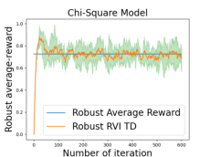

Figure 1: Robust RVI TD Algorithm.

We then consider policy optimization. We run our robust
RVI Q-learning independently for 30 times. The curves
in Figure 2 show the average value of _f_ ( _Q_ ) over 30 trajectories, and the upper/lower envelopes are the 95/5 percentiles. We also plot the optimal robust average-reward _g_ P _[∗]_
computed by the model-based RVI method in (Wang et al.,
2023). Our robust RVI Q-learning converges to the optimal
robust average-reward _g_ P _[∗]_ [under each uncertainty set, which]
verifies our theoretical results.

Figure 2: Robust RVI Q-Learning Algorithm.

**6.2. Robustness of Robust RVI Q-Learning**

We then demonstrate the robustness of our robust RVI Qlearning by showing that our method achieves a higher
average-reward when there is model deviation between training and evaluation.

6.2.1. RECYCLING ROBOT

We first consider the recycling robot problem (Example
3.3 (Sutton & Barto, 2018)). A mobile robot running on
a rechargeable battery aims to collect empty soda cans. It
has 2 battery levels: low and high. The robot can either 1)
search for empty cans; 2) remain stationary and wait for
someone to bring it a can; 3) go back to its home base to
recharge. Under low (high) battery level, the robot finds
an empty can with probabilities _α_ ( _β_ ), and remains at the
same battery level. If the robot goes out to search but finds
nothing, it will run out of its battery and can only be carried
back by human. More details can be found in (Sutton &
Barto, 2018).

In this experiment, the uncertainty lies in the probabilities _α, β_ of finding an empty can if the robot chooses the
action ‘search’. We set _δ_ = 0 _._ 4 and implement our algorithms and vanilla Q-learning under the nominal environment ( _α_ = _β_ = 0 _._ 5) with stepsize 0 _._ 01. To show the

_s,a_ _[Q]_ [(] _[s,a]_ [)]

_f_ ( _Q_ ) =

�

_f_ ( _Q_ ) = _s|,_ S _a||_ A _|_ . Due to the space limit, we only show

the results under the Chi-square and Wasserstein Distance
models. The results under the other three uncertainty sets
are presented in Appendix G.

For policy evaluation, we evaluate the robust average-reward
1
of the uniform policy _π_ ( _a|s_ ) = _|_ A _|_ [. We implement our]
robust RVI TD algorithm under different uncertainty models.
We run the algorithm independently for 30 times and plot the
average value of _f_ ( _V_ ) over all 30 trajectories. We also plot
the 95th and 5th percentiles of the 30 curves as the upper
and lower envelopes of the curves. To compare, we plot the
true robust average-reward computed using the model-based
robust value iteration method in (Wang et al., 2023). It can
be seen from the results in Figure 1 that our robust RVI TD
algorithm converges to the true robust average-reward value.

7

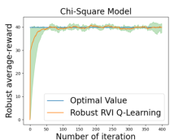

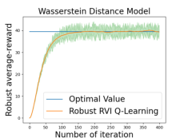

**Model-Free Robust Average-Reward Reinforcement Learning**

difference among the policies that the algorithms learned,
we plot the difference of _Q_ values at low battery level in
Figure 3(a). In the low battery level, the robust algorithms
find conservative policies which choose to wait instead of
search, whereas the vanilla Q-learning finds a policy that
chooses to search. To test the robustness of the obtained

policies, we evaluate the average-reward of the learned policies in perturbed environments. Specifically, let _x_ denote
the amplitude of the perturbation. Then, we estimate the
worst performance of the two policies over the testing uncertainty set (0 _._ 5 _−_ _x,_ 0 _._ 5 + _x_ ), and plot them in Figure 3(b).
It can be seen that when the perturbation is small, the true
worst-case kernels (w.r.t. _δ_ during training) are far from the
testing environment, and hence the vanilla Q-learning has a
higher reward; however, as the perturbation level becomes
larger, the testing environment gets closer to the worst-case
kernels, and then our robust algorithms perform better. It
can be seen that the performance of Q-learning decreases
rapidly while our robust algorithm is stable and outperforms
the non-robust Q-learning. This implies that our algorithm
is robust to the model uncertainty.

          (a) _Q_ (low,wait) _Q_ (low,search) (b) Perturbed environment

Figure 3: Recycling Robot.

6.2.2. INVENTORY CONTROL PROBLEM

We now consider the supply chain problem (Giannoccaro &
Pontrandolfo, 2002; Kemmer et al., 2018; Liu et al., 2022).
At the beginning of each month, the manager of a warehouse
inspects the current inventory of a product. Based on the
current stock, the manager decides whether or not to order
additional stock from a supplier. During this month, if the
customer demand is satisfied, the warehouse can make a
sale and obtain profits; but if not, the warehouse will obtain
a penalty associated with being unable to satisfy customer
demand for the product. The warehouse also needs to pay
the holding cost for the remaining stock and new items
ordered. The goal is to maximize the average profit.

We let _st_ denote the inventory at the beginning of the _t_ -th
month, _Dt_ be a random demand during this month, and _at_
be the number of units ordered by the manager. We assume
that _Dt_ follows some distribution and is independent over
time. When the agent takes action _at_, the order cost is
_at_, and the holding cost is 3 _·_ ( _st_ + _at_ ). If the demand
_Dt ≤_ _st_ + _at_, then selling the item brings 5 _· Dt_ in total;
but if the demand _Dt > st_ + _at_, then there will not be

any sale and a penalty of _−_ 15 will be received. We set
S = _{_ 0 _,_ 1 _, ...,_ 16 _}_ and A = _{_ 0 _, ...,_ 8 _}_ .

We first set _δ_ = 0 _._ 4 and _αt_ = 0 _._ 01, and implement our
algorithms and vanilla Q-learning under the nominal environment where _Dt ∼_ **Uniform** (0 _,_ 16) is generated following the uniform distribution. To verify the robustness, we
test the obtained policies under different perturbed environments. More specifically, we perturb the distribution of the
demand to _Dt ∼_ _U_ ( _m,b_ ), where

The results are plotted in Figure 4. We first fix _m_ = 0
and plot the performance under different values of _b_ in
Figure 4(a), then we fix _b_ = 0 _._ 25 and plot the performance
under different values of _m_ in Figure 4(b).

As the results show, when _b_ is small, i.e., the perturbation of
the environment is small, the non-robust Q-learning obtains
higher reward than our robust methods; as _b_ becomes larger,
the performance of the non-robust method decreases rapidly,
while our robust methods are more robust and outperform
the non-robust one. When _b_ is fixed, our robust methods outperform the non-robust Q-learning, which also demonstrates
the robustness of our methods.

(a) _m_ = 0 (b) _b_ = 0 _._ 25

Figure 4: Inventory Control.

**7. Conclusion**

In this paper, we developed the first model-free algorithms
with provable convergence and optimality guarantee for robust average-reward RL under a broad range of uncertainty
set models. We characterized the fundamental structure of

solutions to the robust average-reward Bellman equation,
which is crucial for the convergence analysis. We designed
model-free robust algorithms based on the ideas of relative
value iteration for non-robust average-reward MDPs and
the robust average-reward Bellman equation. We developed
concrete solutions to five popular uncertainty sets, where
we generalized the idea of multi-level Monte-Carlo and
constructed an unbiased estimate of the non-linear robust

average-reward Bellman operator.

_U_ ( _m,b_ )( _x_ ) =

1 _[|]_ [S] _[|][−]_ [2]
_|_ S _|_ [+] _[ b]_ 2 _|_ S _|_

1 _−b_

� _|_ S _|_ _[,]_ [ else] _[.]_

_|_ S _|_ [+] _[ b]_ 2 _|_ _[−]_ S _|_ _[,]_ [ if] _[ x][ ∈{][m, m]_ [ + 1] _[}][,]_

1 _−b_

_−_

_|_ S _|_ _[,]_ [ else] _[.]_

8

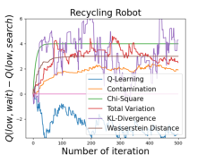

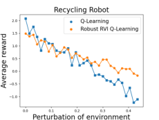

**Model-Free Robust Average-Reward Reinforcement Learning**

**8. Acknowledgments**

This work is supported by the National Science Foundation
under Grants CCF-2106560, CCF-2007783, CCF-2106339,
and CCF-1552497. This material is based upon work supported under the AI Research Institutes program by National Science Foundation and the Institute of Education

Sciences, U.S. Department of Education through Award #
2229873 - National AI Institute for Exceptional Education.
Any opinions, findings and conclusions or recommendations
expressed in this material are those of the author(s) and do
not necessarily reflect the views of the National Science
Foundation, the Institute of Education Sciences, or the U.S.
Department of Education.

**References**

Abounadi, J., Bertsekas, D., and Borkar, V. S. Learning
algorithms for Markov decision processes with average
cost. _SIAM Journal on Control and Optimization_, 40(3):
681–698, 2001.

Archibald, T., McKinnon, K., and Thomas, L. On the
generation of Markov decision processes. _Journal of the_
_Operational Research Society_, 46(3):354–361, 1995.

Badrinath, K. P. and Kalathil, D. Robust reinforcement
learning using least squares policy iteration with provable
performance guarantees. In _Proc. International Confer-_
_ence on Machine Learning (ICML)_, pp. 511–520. PMLR,
2021.

Bagnell, J. A., Ng, A. Y., and Schneider, J. G. Solving
uncertain Markov decision processes. 2001.

Bertsekas, D. P. Dynamic Programming and Optimal Control 3rd edition, volume II. _Belmont, MA: Athena Scien-_
_tific_, 2011.

Blanchet, J. H. and Glynn, P. W. Unbiased Monte Carlo for
optimization and functions of expectations via multi-level
randomization. In _2015 Winter Simulation Conference_
_(WSC)_, pp. 3656–3667. IEEE, 2015.

Blanchet, J. H., Glynn, P. W., and Pei, Y. Unbiased multilevel Monte Carlo: Stochastic optimization, steadystate simulation, quantiles, and other applications. _arXiv_
_preprint arXiv:1904.09929_, 2019.

Borkar, V. S. _Stochastic approximation: a dynamical sys-_
_tems viewpoint_, volume 48. Springer, 2009.

Borkar, V. S. and Soumyanatha, K. An analog scheme for
fixed point computation. i. theory. _IEEE Transactions on_
_Circuits and Systems I: Fundamental Theory and Appli-_
_cations_, 44(4):351–355, 1997.

Brockman, G., Cheung, V., Pettersson, L., Schneider, J.,
Schulman, J., Tang, J., and Zaremba, W. OpenAI Gym.
_arXiv preprint arXiv:1606.01540_, 2016.

Chen, L., Jain, R., and Luo, H. Learning infinite-horizon
average-reward Markov decision processes with constraints. _arXiv preprint arXiv:2202.00150_, 2022.

Gao, R. and Kleywegt, A. Distributionally robust stochastic
optimization with Wasserstein distance. _Mathematics of_
_Operations Research_, 2022.

Giannoccaro, I. and Pontrandolfo, P. Inventory management in supply chains: a reinforcement learning approach.
_International Journal of Production Economics_, 78(2):
153–161, 2002.

Goyal, V. and Grand-Clement, J. Robust Markov decision process: Beyond rectangularity. _arXiv preprint_
_arXiv:1811.00215_, 2018.

Ho, C. P., Petrik, M., and Wiesemann, W. Fast Bellman
updates for robust MDPs. In _Proc. International Con-_
_ference on Machine Learning (ICML)_, pp. 1979–1988.
PMLR, 2018.

Ho, C. P., Petrik, M., and Wiesemann, W. Partial policy iteration for L1-robust Markov decision processes. _Journal_
_of Machine Learning Research_, 22(275):1–46, 2021.

Hu, Z. and Hong, L. J. Kullback-Leibler divergence constrained distributionally robust optimization. _Available at_
_Optimization Online_, pp. 1695–1724, 2013.

Huber, P. J. A robust version of the probability ratio test.
_Ann. Math. Statist._, 36:1753–1758, 1965.

Iyengar, G. N. Robust dynamic programming. _Mathematics_
_of Operations Research_, 30(2):257–280, 2005.

Kaufman, D. L. and Schaefer, A. J. Robust modified policy
iteration. _INFORMS Journal on Computing_, 25(3):396–
410, 2013.

Kazemi, M., Perez, M., Somenzi, F., Soudjani, S., Trivedi,
A., and Velasquez, A. Translating omega-regular specifications to average objectives for model-free reinforcement learning. In _Proceedings of the 21st International_
_Conference on Autonomous Agents and Multiagent Sys-_
_tems_, pp. 732–741, 2022.

Kemmer, L., von Kleist, H., de Rochebouët, D., Tziortziotis,
N., and Read, J. Reinforcement learning for supply chain
optimization. In _European Workshop on Reinforcement_
_Learning_, volume 14, 2018.

Li, T., Wu, F., and Lan, G. Stochastic first-order methods
for average-reward Markov decision processes. _arXiv_
_preprint arXiv:2205.05800_, 2022.

9

**Model-Free Robust Average-Reward Reinforcement Learning**

Lim, S. H. and Autef, A. Kernel-based reinforcement learning in robust Markov decision processes. In _Proc. Inter-_
_national Conference on Machine Learning (ICML)_, pp.
3973–3981. PMLR, 2019.

Lim, S. H., Xu, H., and Mannor, S. Reinforcement learning
in robust Markov decision processes. In _Proc. Advances_
_in Neural Information Processing Systems (NIPS)_, pp.
701–709, 2013.

Liu, Z., Bai, Q., Blanchet, J., Dong, P., Xu, W., Zhou, Z.,
and Zhou, Z. Distributionally robust _Q_ -learning. In _Proc._
_International Conference on Machine Learning (ICML)_,
pp. 13623–13643. PMLR, 2022.

Neufeld, A. and Sester, J. Robust _Q_ -learning algorithm for
Markov decision processes under Wasserstein uncertainty.
_arXiv preprint arXiv:2210.00898_, 2022.

Nilim, A. and El Ghaoui, L. Robustness in Markov decision
problems with uncertain transition matrices. In _Proc. Ad-_
_vances in Neural Information Processing Systems (NIPS)_,
pp. 839–846, 2004.

Panaganti, K. and Kalathil, D. Sample complexity of robust
reinforcement learning with a generative model. _arXiv_
_preprint arXiv:2112.01506_, 2021.

Panaganti, K., Xu, Z., Kalathil, D., and Ghavamzadeh, M.
Robust reinforcement learning using offline data. _arXiv_
_preprint arXiv:2208.05129_, 2022.

Puterman, M. L. Markov decision processes: Discrete
stochastic dynamic programming, 1994.

Roy, A., Xu, H., and Pokutta, S. Reinforcement learning
under model mismatch. In _Proc. Advances in Neural_

_Information Processing Systems (NIPS)_, pp. 3046–3055,
2017.

Satia, J. K. and Lave Jr, R. E. Markovian decision processes with uncertain transition probabilities. _Operations_
_Research_, 21(3):728–740, 1973.

Sutton, R. S. and Barto, A. G. _Reinforcement Learning: An_
_Introduction_ . The MIT Press, Cambridge, Massachusetts,
2018.

Tamar, A., Mannor, S., and Xu, H. Scaling up robust MDPs
using function approximation. In _Proc. International_
_Conference on Machine Learning (ICML)_, pp. 181–189.
PMLR, 2014.

Tessler, C., Efroni, Y., and Mannor, S. Action robust reinforcement learning and applications in continuous control.
In _Proc. International Conference on Machine Learning_
_(ICML)_, pp. 6215–6224. PMLR, 2019.

Tewari, A. and Bartlett, P. L. Bounded parameter Markov
decision processes with average reward criterion. In _Inter-_
_national Conference on Computational Learning Theory_,
pp. 263–277. Springer, 2007.

Tsitsiklis, J. N. and Van Roy, B. Average cost temporaldifference learning. _Automatica_, 35(11):1799–1808,
1999.

Wan, Y. and Sutton, R. S. On convergence of average-reward
off-policy control algorithms in weakly-communicating
MDPs. _arXiv preprint arXiv:2209.15141_, 2022.

Wan, Y., Naik, A., and Sutton, R. S. Learning and planning
in average-reward Markov decision processes. In _Proc._
_International Conference on Machine Learning (ICML)_,
pp. 10653–10662. PMLR, 2021.

Wang, G. and Wang, T. Unbiased multilevel Monte Carlo
methods for intractable distributions: Mlmc meets mcmc.

_arXiv preprint arXiv:2204.04808_, 2022.

Wang, Y. and Zou, S. Online robust reinforcement learning
with model uncertainty. In _Proc. Advances in Neural_
_Information Processing Systems (NeurIPS)_, 2021.

Wang, Y. and Zou, S. Policy gradient method for robust reinforcement learning. In _Proc. International Conference_
_on Machine Learning (ICML)_, volume 162, pp. 23484–
23526. PMLR, 2022.

Wang, Y., Velasquez, A., Atia, G., Prater-Bennette, A., and
Zou, S. Robust average-reward Markov decision processes. In _Proc. Conference on Artificial Intelligence_
_(AAAI)_, 2023.

Wiesemann, W., Kuhn, D., and Rustem, B. Robust Markov
decision processes. _Mathematics of Operations Research_,
38(1):153–183, 2013.

Xu, H. and Mannor, S. Distributionally robust Markov decision processes. In _Proc. Advances in Neural Information_
_Processing Systems (NIPS)_, pp. 2505–2513, 2010.

Yang, W., Zhang, L., and Zhang, Z. Towards theoretical understandings of robust Markov decision processes:
Sample complexity and asymptotics. _arXiv preprint_
_arXiv:2105.03863_, 2021.

Yu, H. and Bertsekas, D. P. Convergence results for some
temporal difference methods based on least squares. _IEEE_
_Transactions on Automatic Control_, 54(7):1515–1531,
2009.

Yu, P. and Xu, H. Distributionally robust counterpart in
Markov decision processes. _IEEE Transactions on Auto-_
_matic Control_, 61(9):2538–2543, 2015.

10

**Model-Free Robust Average-Reward Reinforcement Learning**

Zhang, S., Wan, Y., Sutton, R. S., and Whiteson, S. Averagereward off-policy policy evaluation with function approximation. In _Proc. International Conference on Machine_
_Learning (ICML)_, pp. 12578–12588. PMLR, 2021a.

Zhang, S., Zhang, Z., and Maguluri, S. T. Finite sample
analysis of average-reward TD learning and _Q_ -learning.
In _Proc. Advances in Neural Information Processing Sys-_
_tems (NeurIPS)_, volume 34, pp. 1230–1242, 2021b.

Zhang, Y. and Ross, K. W. On-policy deep reinforcement
learning for the average-reward criterion. In _Proc. Inter-_
_national Conference on Machine Learning (ICML)_, pp.
12535–12545. PMLR, 2021.

Zhou, Z., Bai, Q., Zhou, Z., Qiu, L., Blanchet, J., and
Glynn, P. Finite-sample regret bound for distributionally
robust offline tabular reinforcement learning. In _Proc._
_International Conference on Artifical Intelligence and_
_Statistics (AISTATS)_, pp. 3331–3339. PMLR, 2021.

11

**Model-Free Robust Average-Reward Reinforcement Learning**

**A. Proof of Lemma 3.1**

We construct the following example.

**Example A.1.** Consider an MDP with 3 states (1,2,3) and only one action _a_, and set a ( _s, a_ )-rectangular uncertainty set

_a_ _a_
P = P _[a]_ 1 � P2 � P3 [where][ P] _[a]_ 1 [=] _[ {]_ [P] _[a]_ 11 _[,]_ [ P] _[a]_ 12 _[}]_ [,][ P] 2 _[a]_ [=] _[ {]_ [(0] _[,]_ [ 0] _[,]_ [ 1)] _[⊤][}]_ [ and][ P] _[a]_ 3 [=] _[ {]_ [(0] _[,]_ [ 1] _[,]_ [ 0)] _[⊤][}]_ [, where][ P] _[a]_ 11 [= (0] _[,]_ [ 1] _[,]_ [ 0)] _[⊤][,]_ [ P] _[a]_ 12 [=]
(0 _,_ 0 _,_ 1) _[⊤]_ . Hence, the uncertainty set contains two transition kernels P = _{_ P1 _,_ P2 _}_ . The reward of each state is set to be
_r_ = ( _r_ 1 _, r_ 2 _, r_ 3). The only stationary policy _π_ in this example is _π_ ( _i_ ) = _a, ∀i_ .

Note that this robust MDP is a unichain and hence satisfies Assumption 1 with _g_ P _[π]_ 1 [(1) =] _[ g]_ P _[π]_ 1 [(2) =] _[ g]_ P _[π]_ 1 [(3)] _[, g]_ P _[π]_ 2 [(1) =]
_g_ P _[π]_ 2 [(2) =] _[ g]_ P _[π]_ 2 [(3)][.]

Under both transition kernels P1 _,_ P2, the average-reward are identical: _g_ P _[π]_ 1 [=] _[ g]_ P _[π]_ 2 [= 0] _[.]_ [5] _[r]_ [2][ + 0] _[.]_ [5] _[r]_ [3][. Hence, both][ P][1] _[,]_ [ P][2][ are]
the worst-case transition kernels.

According to Section A.5 of (Puterman, 1994), the relative value functions w.r.t. P1 _,_ P2 can be computed as

_V_ P _[π]_ 1 [=] _r_ 1 _−_ [1]
� 4

[1]

4 _[r]_ [2] _[ −]_ [3] 4

[3]

4 _[r]_ [3] _[,]_ [ 1] 4

4 _[r]_ [2] _[ −]_ [1] 4

[1]

4 _[r]_ [3] _[,][ −]_ [1] 4

[1]

4 _[r]_ [2][ + 1] 4

4 _[r]_ [3]

_V_ P _[π]_ 2 [=] _r_ 1 _−_ [3]
� 4

[3]

4 _[r]_ [2] _[ −]_ [1] 4

[1]

4 _[r]_ [3] _[,]_ [ 1] 4

4 _[r]_ [2] _[ −]_ [1] 4

[1]

4 _[r]_ [3] _[,][ −]_ [1] 4

[1]

4 _[r]_ [2][ + 1] 4

4 _[r]_ [3]

_⊤_

_,_
�

_⊤_

_._
�

When _r_ 3 _> r_ 2, only _V_ P _[π]_ 1 [is the solution to][ (7)][; and when] _[ r]_ [2] _[ > r]_ [3][, only] _[ V][ π]_ P2 [is the solution to][ (7)][. Hence, this proves]
Lemma 3.1 and implies that not any relative value function w.r.t. a worst-case transition kernel is a solution to (7).

**B. Robust RVI TD Method for Policy Evaluation**

We define the following notation:

_rπ_ ( _s_ ) ≜ � _π_ ( _a|s_ ) _r_ ( _s, a_ ) _,_

_a_

_σ_ P _s_ ( _V_ ) ≜ � _π_ ( _a|s_ ) _σ_ P _as_ ( _V_ ) _,_

_a_

_σ_ P( _V_ ) ≜ ( _σ_ P _s_ 1 ( _V_ ) _, σ_ P _s_ 2 ( _V_ ) _, ..., σ_ P _s|_ S _|_ ( _V_ )) _∈_ R _[|]_ [S] _[|]_ _._

**B.1. Proof of Theorem 3.1**

**Theorem B.1** (Restatement of Theorem 3.1) **.** _If_ ( _g, V_ ) _is a solution to the robust Bellman equation_

_V_ ( _s_ ) = � _π_ ( _a|s_ )( _r_ ( _s, a_ ) _−_ _g_ + _σ_ P _as_ ( _V_ )) _, ∀s,_ (20)

_a_

_then 1) g_ = _g_ P _[π]_ _[(Wang et al., 2023); 2)]_ [ P] _[V][ ∈]_ _[Ω]_ _g_ _[π][; 3)][ V]_ [ =] _[ V][ π]_ P _V_ [+] _[ ce][ for some][ c][ ∈]_ [R] _[.]_

_Proof._ 1). The robust Bellman equation in (20) can be rewritten as

_g_ + _V_ ( _s_ ) _−_ _rπ_ ( _s_ ) = _σ_ P _s_ ( _V_ ) _, ∀s ∈_ S _._ (21)

From the definition, it follows that

_σ_ P _s_ ( _V_ ) = � _a_ _π_ ( _a|s_ ) minP _[a]_ _s_ _∈_ P _[a]_ _s_ P _[a]_ _s_ _[V.]_ (22)

Hence, for any transition kernel P = (P _[a]_ _s_ [)] _[ ∈]_ [�] _s,a_ [P] _s_ _[a]_ [,]

_g_ + _V_ ( _s_ ) _−_ _rπ_ ( _s_ ) _−_ � _π_ ( _a|s_ )P _[a]_ _s_ _[V][ ≤]_ [0] _[,][ ∀][s.]_ (23)

_a_

12

**Model-Free Robust Average-Reward Reinforcement Learning**

It can be further rewritten in matrix form as:

_ge ≤_ _rπ_ + (P _[π]_ _−_ _I_ ) _V,_ (24)

where P _[π]_ is the state transition matrix induced by _π_ and P, i.e., the _s_ -th row of P _[π]_ is

� _π_ ( _a|s_ )P _[a]_ _s_ _[.]_ (25)

_a_

Note that P _[π]_ has non-negative components since it is a transition matrix. Multiplying by P _[π]_ on both sides, we have that

P _[π]_ _ge_ = _ge ≤_ P _[π]_ _rπ_ + P _[π]_ (P _[π]_ _−_ _I_ ) _V,_

_ge ≤_ (P _[π]_ ) [2] _rπ_ + (P _[π]_ ) [2] (P _[π]_ _−_ _I_ ) _V,_

_..._

_ge ≤_ (P _[π]_ ) _[n][−]_ [1] _rπ_ + (P _[π]_ ) _[n][−]_ [1] (P _[π]_ _−_ _I_ ) _V._ (26)

Now, by summing up all these inequalities in (24) and (26), we have that

_nge ≤_

_n−_ 1
�(P _[π]_ ) _[i]_ _rπ_ + ((P _[π]_ ) _[n]_ _−_ _I_ ) _V,_ (27)

_i_ =0

and hence,

Let _n →∞_, and we have that

_n−_ 1
_ge ≤_ � _i_ =0 [(][P] _[π]_ [)] _[i][r][π]_

_._ (28)
_n_

[(][P] _[π]_ [)] _[i][r][π]_ + [((][P] _[π]_ [)] _[n][ −]_ _[I]_ [)] _[V]_

_n_ _n_

_ge ≤_ lim
_n→∞_

_n−_ 1
� _i_ =0 [(][P] _[π]_ [)] _[i][r][π]_

[(][P] _[π]_ [)] _[i][r][π]_ + lim ((P _[π]_ ) _[n]_ _−_ _I_ ) _V_

_n_ _n→∞_ _n_

_n→∞_ _n_ _n→∞_ _n_

=
_g_ P _[π][e,]_ (29)

((P _[π]_ ) _[n]_ _−I_ ) _V_
where the last inequality is from the definition of _g_ P _[π]_ [and the fact that][ lim] _[n][→∞]_

where the last inequality is from the definition of _g_ P _[π]_ [and the fact that][ lim] _[n][→∞]_ _n−_ = 0. Hence, _g ≤_ _g_ P _[π]_ [for any]

P _∈_ [�] _s,a_ [P] _s_ _[a]_ [.]

Consider the worst-case transition kernel P _V_ of _V_ . The robust Bellman equation can be equivalently rewritten as

_ge_ = _rπ −_ _V_ + P _[π]_ _V_ _[V.]_ (30)

This means that ( _g, V_ ) is a solution to the non-robust Bellman equation for transition kernel P _V_ and policy _π_ :

_xe_ = _rπ −_ _Y_ + P _[π]_ _V_ _[Y.]_ (31)

Thus, by Thm 8.2.6 from (Puterman, 1994),

_g_ = _g_ P _[π]_ _V_ _[,]_ (32)

_V_ = _V_ P _[π]_ _V_ [+] _[ ce,]_ [ for some] _[ c][ ∈]_ [R] _[.]_ (33)

However, note that

_g_ P _[π]_ _V_ [=] _[ g][ ≤]_ _[g]_ P _[π]_ [= min] P _∈_ P _[g]_ P _[π]_ _[≤]_ _[g]_ P _[π]_ _V_ _[,]_ (34)

thus,

_g_ P _[π]_ _V_ [=] _[ g]_ [ =] _[ g]_ P _[π]_ _[.]_ (35)

2). From (35),

_g_ P _[π]_ _V_ [=] _[ g]_ P _[π]_ _[.]_ (36)

It then follows from the definition of _Ωg_ _[π]_ [that][ P] _[V]_ _[∈]_ _[Ω]_ _g_ _[π]_ [.]

3). Since ( _g, V_ ) is a solution to the non-robust Bellman equation

_xe_ = _rπ −_ _Y_ + P _[π]_ _V_ _[Y,]_ (37)

the claim then follows from Theorem 8.2.6 in (Puterman, 1994).

13

_s,a_ [P] _s_ _[a]_ [.]

**Model-Free Robust Average-Reward Reinforcement Learning**

**B.2. Proof of Theorem 3.2**

**Theorem B.2.** _(Restatement of Theorem 3.2) Under Assumptions 1,2,3,_ ( _f_ ( _Vn_ ) _, Vn_ ) _converges to a (possible sample path_
_dependent) solution to_ (7) _a.s.._

We first show the stability of the robust RVI TD algorithm in the following lemma.

**Lemma B.1.** _Algorithm 1 remains bounded during the update, i.e.,_

sup (38)
_n_ _[∥][V][n][∥]_ _[<][ ∞][, a.s..]_

_Proof._ Denote by

_h_ ( _V_ ) ≜ _rπ_ + _σ_ P( _V_ ) _−_ _f_ ( _V_ ) _e −_ _V._ (39)

Then the update of robust RVI TD can be rewritten as

_Vn_ +1 = _Vn_ + _αn_ ( _h_ ( _Vn_ ) + _Mn_ +1) _,_ (40)

where _Mn_ +1 ≜ **T** [ˆ] _Vn −_ _rπ −_ _σ_ P( _V_ ) is the noise term.

Further, define the limit function _h∞_ :

_h_ ( _cV_ )
_h∞_ ( _V_ ) ≜ lim _._ (41)
_c→∞_ _c_

Then, from _σ_ P _[a]_ _s_ ( _cV_ ) = _cσ_ P _[a]_ _s_ ( _V_ ) and _f_ ( _cV_ ) = _cf_ ( _V_ ), it follows that

_h∞_ ( _V_ ) = lim _rπ_ (42)
_c→∞_ _c_ [+] _[ σ]_ [P][(] _[V]_ [ )] _[ −]_ _[f]_ [(] _[V]_ [ )] _[e][ −]_ _[V]_ [ =] _[ σ]_ [P][(] _[V]_ [ )] _[ −]_ _[f]_ [(] _[V]_ [ )] _[e][ −]_ _[V.]_

According to Section 2.1 and Section 3.2 of (Borkar, 2009), it suffices to verify the following assumptions:

(1). _h_ is Lipschitz;

(2). Stepsize _αn_ satisfies Assumption 3;

(3). Denoting by F _n_ the _σ_ -algebra generated by _V_ 0 _, M_ 1 _, ..., Mn_, then E[ _Mn_ +1 _|_ F _n_ ] = 0, E[ _∥Mn_ +1 _∥_ [2] _|_ F _n_ ] _≤_ _K_ (1 + _∥Vn∥_ [2] )
for some constant _K >_ 0.

(4). _h∞_ has the origin as its unique globally asymptotically stable equilibrium.

First, note that

�����

_∥h_ ( _V_ 1) _−_ _h_ ( _V_ 2) _∥_ = max
_s_

_≤_ max
_s_

�����

������

�

_π_ ( _a|s_ )( _σ_ P _as_ ( _V_ 1) _−_ _σ_ P _as_ ( _V_ 2)) _−_ ( _f_ ( _V_ 1) _−_ _f_ ( _V_ 2)) _−_ ( _V_ 1( _s_ ) _−_ _V_ 2( _s_ ))

_a_

_π_ ( _a|s_ )( _σ_ P _as_ ( _V_ 1) _−_ _σ_ P _as_ ( _V_ 2))

_a_

�

+ _|_ ( _f_ ( _V_ 1) _−_ _f_ ( _V_ 2)) _|_ + _|_ ( _V_ 1( _s_ ) _−_ _V_ 2( _s_ )) _|_
�����

�

_≤_ (2 + _Lf_ ) _∥V_ 1 _−_ _V_ 2 _∥,_ (43)

where the last inequality follows from the fact that the support function _σ_ P( _·_ ) is 1-Lipschitz and the assumptions on _f_ in
Assumption 2. Thus, _h_ is Lipschitz, which verifies (1).

It is straightforward that (3) is satisfied if E[ **T** [ˆ] _Vn|_ F _n_ ] = _rπ_ + _σ_ P( _Vn_ ) and Var[ **T** [ˆ] _Vn|_ F _n_ ] _≤_ _K_ (1 + _∥Vn∥_ [2] ). As discussed
in Section 3, we assume the existence of an unbiased estimator **T** [ˆ] with bounded variance here, and we will construct the

estimator in Section 5.

Then, it suffices to verify condition (4), i.e., to show that the ODE

_x_ ˙ ( _t_ ) = _h∞_ ( _x_ ( _t_ )) (44)

14

**Model-Free Robust Average-Reward Reinforcement Learning**

has 0 as its unique globally asymptotically stable equilibrium.

Define an operator **T** 0( _V_ )( _s_ ) ≜ [�] _a_ _[π]_ [(] _[a][|][s]_ [)] _[σ]_ [P] _[a]_ _s_ [(] _[V]_ [ )][. Then, any equilibrium] _[ W]_ [ of (44) satisfies]

**T** 0( _W_ ) _−_ _f_ ( _W_ ) _e −_ _W_ = 0 _._ (45)

This equation can be further rewritten as a set of equations:

_W_ = **T** 0( _W_ ) _−_ _ge,_

(46)

� _g_ = _f_ ( _W_ ) _._

The equation in (46) is the robust Bellman equation for a zero-reward robust MDP. Hence, from Theorem 3.1, any solution
( _g, W_ ) to (46) satisfies

_g_ = _g_ P _[π]_ _[, W]_ [ =] _[ V][ π]_ P [+] _[ ce,]_ (47)

where _V_ P _[π]_ [is the relative value function w.r.t. some worst-case transition kernel][ P][ (i.e.,] _[ g]_ P _[π]_ [= min][P] _[∈]_ [P] _[ g]_ P _[π]_ [), and some] _[ c][ ∈]_ [R][.]

Hence, any equilibrium of (44) satisfies

_W_ = _V_ P _[π]_ [+] _[ ce, f]_ [(] _[W]_ [) =] _[ g]_ P _[π]_ _[.]_ (48)

However, note that this robust Bellman equation is for a zero-reward robust MDP, hence for any P,

�

�

= 0 _,_ (49)

= 0 _,_ (50)

_g_ P _[π]_ [= lim]
_T →∞_ [E][P]

_T −_ 1
�
� _t_ =0

_rt_

_T_

_V_ P _[π]_ [=][ E][P]

_∞_
�
� _t_ =0

�( _rt −_ _g_ P _[π]_ [)]

_t_ =0

thus _g_ P _[π]_ [= 0][ and] _[ W]_ [ =] _[ ce]_ [ for some] _[ c][ ∈]_ [R][. From][ (48)][, it follows that] _[ f]_ [(] _[W]_ [) =] _[ f]_ [(] _[ce]_ [) = 0][, for any equilibrium] _[ W]_ [. From]
Assumption 2, we have that _f_ ( _ce_ ) = _cf_ ( _e_ ) = _c_ = 0. This further implies that

_W_ = _V_ P _[π]_ [+] _[ ce]_ [ = 0] _[.]_ (51)

Thus, the only equilibrium of (44) is 0.

We then show that 0 is globally asymptotically stable. Recall that the zero-reward robust Bellman operator

We further introduce two operators:

**T** 0 _V_ ( _s_ ) = � _π_ ( _a|s_ )( _σ_ P _as_ ( _V_ )) _._ (52)

_a_

**T** _[′]_ 0 _[V]_ [ ≜] **[T]** [0] _[V][ −]_ _[f]_ [(] _[V]_ [ )] _[e,]_ (53)
**T** ˜ 0 _V_ ≜ **T** 0 _V −_ _g_ P _[π]_ _[e.]_ (54)

Note that in the zero-reward robust MDP, _g_ P _[π]_ [= 0][ and][ ˜] **[T]** [0][ =] **[ T]** [0][, but we introduce this notation for future use.]

Consider the ODEs w.r.t. these two operators:

˙
_x_ = **T** _[′]_ 0 _[x][ −]_ _[x,]_ (55)

˙
_y_ = **T** [˜] 0 _y −_ _y._ (56)

First, it can be easily shown that both **T** _[′]_ 0 [and][ ˜] **[T]** [0] [are Lipschitz with constants][ 1 +] _[ L][f]_ [and][ 1][, respectively. Hence, both two]
ODEs are well-posed. Also, it can be seen that (55) is the same as the ODE in (44).

Since the second equation (56) is a non-expansion (Lipschitz with parameter no larger than 1), Theorem 3.1 of (Borkar &
Soumyanatha, 1997) implies that any solution _y_ ( _t_ ) to (56) converges to the set of equilibrium points, i.e.,

_y_ ( _t_ ) _→_ _W_ : _W_ = **T** [˜] 0 _W_ _, a.s.._ (57)
� �

15

**Model-Free Robust Average-Reward Reinforcement Learning**

Similar to the discussion for **T** 0, our Theorem 3.1 implies that the set of equilibrium points of (56) is _{W_ = _ce_ : _c ∈_ R _}_ .
Hence, for any solution _y_ ( _t_ ) to (56), _y_ ( _t_ ) _→_ _ce_ for some constant _k_ that may depend on the initial value of _y_ ( _t_ ).

Now, consider the solution _x_ ( _t_ ) to (55). According to Lemma F.1 (note that **T** 0 here is a special case of **T** in Lemma F.1
with _r_ = 0), if the solutions _x_ ( _t_ ) _, y_ ( _t_ ) have the same initial value _x_ (0) = _y_ (0), then

_x_ ( _t_ ) = _y_ ( _t_ ) + _r_ ( _t_ ) _e,_ (58)

where _r_ ( _t_ ) is a solution to ˙ _r_ ( _t_ ) = _−r_ ( _t_ ) + _g_ P _[π]_ _[−]_ _[f]_ [(] _[y]_ [(] _[t]_ [))] _[, r]_ [(0) = 0][.]

Note that the solution _r_ ( _t_ ) with _r_ (0) = 0 can be written as

_t_
_r_ ( _t_ ) = _e_ _[−]_ [(] _[t][−][s]_ [)] ( _g_ P _[π]_ _[−]_ _[f]_ [(] _[y]_ [(] _[s]_ [)))] _[ds]_ (59)
�0

by variation of constants formula (Abounadi et al., 2001). If we denote the limit of _y_ ( _t_ ) by _y_ _[∗]_ = _ce_, then lim _t→∞_ _r_ ( _t_ ) =
_g_ P _[π]_ _[−]_ _[f]_ [(] _[y][∗]_ [)][ (Lemma B.4 in (Wan et al., 2021), Theorem 3.4 in (Abounadi et al., 2001)). Hence,] _[ x]_ [(] _[t]_ [) =] _[ y]_ [(] _[t]_ [) +] _[ r]_ [(] _[t]_ [)] _[e]_
converges to _y_ _[∗]_ + ( _g_ P _[π]_ _[−]_ _[f]_ [(] _[y][∗]_ [))] _[e]_ [, i.e.,]

_x_ ( _t_ ) _→_ _ce −_ _f_ ( _ce_ ) _e_ = 0 _._ (60)

Hence, any solution _x_ ( _t_ ) to (55) converges to 0, which is its unique equilibrium. This thus implies that 0 is the unique
globally asymptotically stable equilibrium. Together with Theorem 3.7 in (Borkar, 2009), it further implies the boundedness
of _Vn_, which completes the proof.

We can readily prove Theorem B.2.

_Proof._ In Lemma B.1, we have shown that

sup (61)
_n_ _[∥][V][n][∥]_ _[<][ ∞][, a.s..]_

Thus, we have verified that conditions (A1-A3) and (A5) in (Borkar, 2009) are satisfied. Lemma 2.1 in (Borkar, 2009) thus
implies that it suffices to study the solution to the ODE ˙ _x_ ( _t_ ) = _h_ ( _x_ ( _t_ )).

For the robust Bellman operator **T** _V_ = _rπ_ + _σ_ P( _V_ ), define

**T** _[′]_ _V_ ≜ **T** _V −_ _f_ ( _V_ ) _e,_ (62)
**T** ˜ _V_ ≜ **T** _V −_ _g_ P _[π]_ _[e.]_ (63)

From Lemma F.1, we know that if _x_ ( _t_ ) _, y_ ( _t_ ) are the solutions to equations

˙
_x_ = **T** _[′]_ _x −_ _x,_ (64)

˙
_y_ = **T** [˜] _y −_ _y,_ (65)

with the same initial value _x_ (0) = _y_ (0), then

_x_ ( _t_ ) = _y_ ( _t_ ) + _r_ ( _t_ ) _e,_ (66)

where _r_ ( _t_ ) satisfies

˙
_r_ ( _t_ ) = _−r_ ( _t_ ) + _g_ P _[π]_ _[−]_ _[f]_ [(] _[y]_ [(] _[t]_ [))] _[, r]_ [(0) = 0] _[.]_ (67)

Thus, by the variation of constants formula,

_t_
_r_ ( _t_ ) = _e_ _[−]_ [(] _[t][−][s]_ [)] ( _g_ P _[π]_ _[−]_ _[f]_ [(] _[y]_ [(] _[s]_ [)))] _[ds.]_ (68)
�0

16

**Model-Free Robust Average-Reward Reinforcement Learning**

Note that **T** [˜] is also non-expansive, hence _y_ ( _t_ ) converges to some equilibrium of (65) (Theorem 3.1 of (Borkar &
Soumyanatha, 1997)). The set of equilibrium points of (65) can be characterized as

_W_ : **T** [˜] _W_ = _W_ = _{W_ : _W_ = _TW −_ _g_ P _[π]_ _[e][}]_ [ =]
� �

�

_π_ ( _a|s_ )( _r_ ( _s, a_ ) _−_ _g_ P _[π]_ [+] _[ σ]_ [P] _[a]_ _s_ [(] _[W]_ [))] _[,][ ∀][s][ ∈]_ [S]

_a_

_W_ : _W_ ( _s_ ) = �

�

_._ (69)

From Theorem 3.1, any equilibrium of (65) can be rewritten as

_W_ = _V_ P _[π]_ [+] _[ ce,]_ [ for some][ P] _[ ∈]_ _[Ω]_ _g_ _[π][, c][ ∈]_ [R] _[.]_ (70)

Thus, _y_ ( _t_ ) converges to an equilibrium denoted by _y_ _[∗]_ :

_y_ ( _t_ ) _→_ _y_ _[∗]_ ≜ _V_ P _[π][∗]_ [+] _[ c][∗][e,]_ [ for some][ P] _[∗]_ _[∈]_ _[Ω]_ _g_ _[π][, c][∗]_ _[∈]_ [R] _[.]_ (71)

Similar to Lemma B.1, it can be showed that _r_ ( _t_ ) _→_ _g_ P _[π]_ _[−]_ _[f]_ [(] _[y][∗]_ [)][ (Lemma B.4 in (Wan et al., 2021), Theorem 3.4 in]
(Abounadi et al., 2001)). This further implies that

_x_ ( _t_ ) _→_ _y_ _[∗]_ + ( _g_ P _[π]_ _[−]_ _[f]_ [(] _[y][∗]_ [))] _[e]_ [ =] _[ V][ π]_ P _[∗]_ [+ (] _[c][∗]_ [+] _[ g]_ P _[π]_ _[−]_ _[f]_ [(] _[y][∗]_ [))] _[e,]_ (72)

and we denote _m_ _[∗]_ = _c_ _[∗]_ + _g_ P _[π]_ _[−]_ _[f]_ [(] _[y][∗]_ [)][. Moreover, since] _[ f]_ [ is continuous (because it is Lipschitz), we have that]

_f_ ( _x_ ( _t_ )) _→_ _f_ ( _V_ P _[π][∗]_ [+ (] _[c][∗]_ [+] _[ g]_ P _[π]_ _[−]_ _[f]_ [(] _[y][∗]_ [))] _[e]_ [)]

= _f_ ( _V_ P _[π][∗]_ [) +] _[ c][∗]_ [+] _[ g]_ P _[π]_ _[−]_ _[f]_ [(] _[y][∗]_ [)]

= _f_ ( _V_ P _[π][∗]_ [) +] _[ c][∗]_ [+] _[ g]_ P _[π]_ _[−]_ _[f]_ [(] _[V][ π]_ P _[∗]_ [+] _[ c][∗][e]_ [)]

= _f_ ( _V_ P _[π][∗]_ [) +] _[ c][∗]_ [+] _[ g]_ P _[π]_ _[−]_ _[f]_ [(] _[V][ π]_ P _[∗]_ [)] _[ −]_ _[c][∗]_

=
_g_ P _[π]_ _[.]_ (73)

Hence, we show that

_x_ ( _t_ ) _→_ _V_ P _[π][∗]_ [+] _[ m][∗][e,]_ (74)

_f_ ( _x_ ( _t_ )) _→_ _g_ P _[π]_ _[.]_ (75)

Following Lemma 2.1 from (Borkar, 2009), we conclude that a.s.,

_Vn →_ _V_ P _[π][∗]_ [+] _[ m][∗][e,]_ (76)

_f_ ( _Vn_ ) _→_ _g_ P _[π]_ _[,]_ (77)

which completes the proof.

**C. Robust RVI Q-Learning**

**C.1. Proof of Lemma 4.1**

Part of the following theorem is proved in (Wang et al., 2023), but we include the proof for completeness.

**Theorem C.1** (Restatement of Lemma 4.1) **.** _If_ ( _g, Q_ ) _is a solution to the optimal robust Bellman equation_

_Q_ ( _s, a_ ) = _r_ ( _s, a_ ) _−_ _g_ + _σ_ P _as_ [(] _[V][Q]_ [)] _[,][ ∀][s, a,]_ (78)

_then 1) g_ = _g_ P _[∗]_ _[(Wang et al., 2023); 2) the greedy policy w.r.t.][ Q][:][ π][Q]_ [(] _[s]_ [) = arg max] _[a][ Q]_ [(] _[s, a]_ [)] _[ is an optimal robust policy]_
_(Wang et al., 2023); 3) VQ_ = _V_ P _[π][Q]_ + _ce for some_ P _∈_ _Ωg_ _[π][Q]_ _[, c][ ∈]_ [R] _[.]_

_Proof._ Taking the maximum on both sides of (78) w.r.t. _a_, we have that

max _a_ _Q_ ( _s, a_ ) = max _a_ _[{][r]_ [(] _[s, a]_ [)] _[ −]_ _[g]_ [ +] _[ σ]_ [P] _[as]_ [ (] _[V][Q]_ [)] _[}][,][ ∀][s][ ∈]_ [S] _[.]_ (79)

17

This is equivalent to

**Model-Free Robust Average-Reward Reinforcement Learning**

_VQ_ ( _s_ ) = max (80)
_a_ _[{][r]_ [(] _[s, a]_ [)] _[ −]_ _[g]_ [ +] _[ σ]_ [P] _[as]_ [ (] _[V][Q]_ [)] _[}][,][ ∀][s][ ∈]_ [S] _[.]_

By Theorem 7 in (Wang et al., 2023), we can show that _g_ = _g_ P _[∗]_ [, which proves claim (1).]

Recall that _VQ_ ( _s_ ) = max _a Q_ ( _s, a_ ). It can be also written as

_VQ_ ( _s_ ) = � _πQ_ ( _a|s_ ) _Q_ ( _s, a_ ) _._ (81)

_a_

Here, we slightly abuse the notation of _πQ_, and use _πQ_ ( _s_ ) and _πQ_ ( _a|s_ ) interchangeably.

Then, the optimal robust Bellman equation in (79) can be rewritten as

_Q_ ( _s, πQ_ ( _s_ )) = _r_ ( _s, πQ_ ( _s_ )) _−_ _g_ + _σ_ P _πQs_ ( _s_ )

_πQ_ ( _a|·_ ) _Q_ ( _·, a_ ) _._ (82)

�� _a_ �

Moreover, if we denote by _W_ ( _s_ ) = _Q_ ( _s, a_ ) = _Q_ ( _s, πQ_ ( _s_ )) = max _a Q_ ( _s, a_ ), then the equation above is equivalent to

_W_ ( _s_ ) = � _πQ_ ( _a|s_ )( _r_ ( _s, a_ ) _−_ _g_ + _σ_ P _as_ ( _W_ )) _._ (83)

_a_

Therefore, ( _W, g_ ) is a solution to the robust Bellman equation for the policy _πQ_ in Theorem 3.1. By Theorem 3.1, we have
that

_g_ = _g_ P _[π][Q]_ _[,]_ (84)

_W_ = _V_ P _[π][Q]_ + _ce,_ (85)

for some P _∈_ _Ωg_ _[π][Q]_ and _c ∈_ R.

Combining this with the claim (1) implies that _πQ_ is an optimal robust policy. Claims (2) and (3) are thus proved.

**C.2. Proof of Theorem 4.1**

**Lemma C.1.** _If_ **H** [ˆ] _satisfies that for any Q, s ∈_ S _, a ∈_ A _,_ E[ **H** [ˆ] _Q_ ( _s, a_ )] = **H** _Q_ ( _s, a_ ) _and Var_ ( **H** [ˆ] _Q_ ( _s, a_ )) _≤_ _C_ (1 + _∥Q∥_ [2] )
_for some constant C, then under Assumptions 2, 4 and 3, Algorithm 2 remains bounded during the update almost surely, i.e.,_

sup (86)
_n_ _[∥][Q][n][∥]_ _[<][ ∞][, a.s..]_

_Proof._ Denote by

_h_ ( _Q_ ) ≜ _rπ_ + _σ_ P( _VQ_ ) _−_ _f_ ( _Q_ ) _e −_ _Q._ (87)

Then, the update of robust RVI Q-learning can be rewritten as

_Qn_ +1 = _Qn_ + _αn_ ( _h_ ( _Qn_ ) + _Mn_ +1) _,_ (88)

where _Mn_ +1 ≜ **H** [ˆ] _Qn −_ _rπ −_ _σ_ P( _VQ_ ) is the noise term.

Further, define the limit function _h∞_ :

_h_ ( _cQ_ )
_h∞_ ( _Q_ ) ≜ lim _._ (89)
_c→∞_ _c_

Then, note that _σ_ P _as_ [(] _[V][cQ]_ [) =] _[ σ]_ [P] _[a]_ _s_ [(] _[cV][Q]_ [) =] _[ cσ]_ [P] _[a]_ _s_ [(] _[V][Q]_ [)][ for] _[ c >]_ [ 0][ and] _[ f]_ [(] _[cQ]_ [) =] _[ cf]_ [(] _[Q]_ [)][. It then follows that]

_h∞_ ( _Q_ ) = lim _rπ_ (90)
_c→∞_ _c_ [+] _[ σ]_ [P][(] _[V][Q]_ [)] _[ −]_ _[f]_ [(] _[Q]_ [)] _[e][ −]_ _[Q]_ [ =] _[ σ]_ [P][(] _[V][Q]_ [)] _[ −]_ _[f]_ [(] _[Q]_ [)] _[e][ −]_ _[Q.]_

18

**Model-Free Robust Average-Reward Reinforcement Learning**

Similar to the proof of Lemma B.1, it suffices to verify the following conditions:

(1). _h_ is Lipschitz;

(2). Stepsize _αn_ satisfies Assumption 3;

(3). E[ _Mn_ +1 _|_ F _n_ ] = 0, and E[ _∥Mn_ +1 _∥_ [2] _|_ F _n_ ] _≤_ _K_ (1 + _∥Qn∥_ [2] ) for some constant _K_ .

(4). _h∞_ has the origin as its unique globally asymptotically stable equilibrium.

Clearly, (2) and (3) can be verified similarly to Lemma B.1. We then verify (1) and (4).

Firstly, it can be shown that

_|h_ ( _Q_ 1)( _s, a_ ) _−_ _h_ ( _Q_ 2)( _s, a_ ) _|_ = �� _σ_ P _as_ ( _VQ_ 1) _−_ _f_ ( _Q_ 1) _−_ _Q_ 1( _s, a_ ) _−_ _σ_ P _as_ ( _VQ_ 2) _−_ _f_ ( _Q_ 2) _−_ _Q_ 2( _s, a_ )��

_≤_ �� _σ_ P _as_ ( _VQ_ 1) _−_ _σ_ P _as_ ( _VQ_ 2)�� + _|f_ ( _Q_ 1) _−_ _f_ ( _Q_ 2) _|_ + _|Q_ 1( _s, a_ ) _−_ _Q_ 2( _s, a_ ) _|_

_≤∥VQ_ 1 _−_ _VQ_ 2 _∥_ + _Lf_ _∥Q_ 1 _−_ _Q_ 2 _∥_ + _∥Q_ 1 _−_ _Q_ 2 _∥_

_≤_ (2 + _Lf_ ) _∥Q_ 1 _−_ _Q_ 2 _∥,_ (91)

where the last inequality is from the fact that _∥VQ_ 1 _−_ _VQ_ 2 _∥≤∥Q_ 1 _−_ _Q_ 2 _∥_ . This implies that _h_ is Lipschitz.

To verify (4), note that the stability equation is

_X_ ˙ ( _t_ ) = _h∞_ ( _X_ ( _t_ )) = _σ_ P( _VX_ ( _t_ )) _−_ _f_ ( _X_ ( _t_ )) _e −_ _X_ ( _t_ ) _,_ (92)

where _VX_ ( _t_ ) is a _|_ S _|_ -dimensional vector with _VX_ ( _t_ )( _s_ ) = max _a X_ ( _t_ )( _s, a_ ) _._

Any equilibrium _Q_ of the stability equation (92) satisfies that

_Q_ ( _s, a_ ) = _σ_ P _as_ ( _VQ_ ) _−_ _f_ ( _Q_ ) _e,_ (93)

which can be viewed as an optimal robust Bellman equation (10) with zero reward. Hence, by Lemma 4.1, it implies that

_f_ ( _Q_ ) = _g_ P _[∗]_ [= 0] _[,]_ (94)

_VQ_ = _V_ P _[π][Q]_ + _ce_ for some P _∈_ _Ωg_ _[π][Q]_ _[, c][ ∈]_ [R] _[.]_ (95)

In the zero-reward MDP, we have that _V_ P _[π]_ [= 0][ for any] _[ π,]_ [ P][, thus] _[ V][Q]_ [(] _[s]_ [) = max] _[a][ Q]_ [(] _[s, a]_ [) =] _[ c]_ [ for any] _[ s][ ∈]_ [S][.]

Note that from (93), _Q_ satisfies that

_Q_ ( _s, a_ ) = _σ_ P _as_ ( _VQ_ ) = _σ_ P _as_ ( _ce_ ) = _c._ (96)

Since _f_ ( _Q_ ) = 0, it implies that

_f_ ( _Q_ ) = _f_ ( _ce_ ) = _c_ = 0 _._ (97)

Therefore,

_c_ = 0 _,_ (98)

_Q_ = 0 _._ (99)

Thus, 0 is the unique equilibrium of the stability equation.

We then show that 0 is globally asymptotically stable. Define the zero-reward optimal robust Bellman operator

**H** 0 _Q_ ( _s, a_ ) = _σ_ P _as_ ( _VQ_ ) _,_ (100)

and further introduce two operators

**H** _[′]_ 0 _[Q]_ [(] _[s, a]_ [) =] _[ σ]_ [P] _[a]_ _s_ [(] _[V][Q]_ [)] _[ −]_ _[f]_ [(] _[Q]_ [)] _[,]_ (101)

˜
**H** 0 _Q_ ( _s, a_ ) = _σ_ P _as_ [(] _[V][Q]_ [)] _[ −]_ _[g]_ P _[∗]_ _[.]_ (102)

19

**Model-Free Robust Average-Reward Reinforcement Learning**

It is straightforward to verify that **H** [˜] 0 is non-expansive. Hence by (Borkar & Soumyanatha, 1997), the solution _y_ ( _t_ ) to
equation

˙
_y_ = **H** [˜] 0 _y −_ _y_ (103)

converges to the set of equilibrium points

_{W_ : _W_ ( _s, a_ ) = _σ_ P _[a]_ _s_ ( _VW_ ) _−_ _g_ P _[∗]_ _[}][, a.s..]_ (104)

This again can be viewed as an optimal robust Bellman equation with zero-reward. Hence, any equilibrium _W_ of (103)
satisfies

max _W_ ( _s, a_ ) = _c, ∀s._ (105)
_a_

This together with (104) further implies that the equilibrium _W_ of (103) satisfies

_W_ ( _s, a_ ) = _σ_ P _as_ ( _VW_ ) = _σ_ P _as_ ( _ce_ ) = _c,_ (106)

and hence _y_ ( _t_ ) converges to _{ce_ : _c ∈_ R _}_ . We denote its limit by _y_ _[∗]_ = _c_ _[∗]_ _e_ .

Lemma F.6 implies the solution _x_ ( _t_ ) to the ODE ˙ _x_ = **H** _[′]_ 0 [(] _[x]_ [)] _[ −]_ _[x]_ [ can be decomposed as] _[ x]_ [(] _[t]_ [) =] _[ y]_ [(] _[t]_ [) +] _[ r]_ [(] _[t]_ [)] _[e]_ [, where] _[ r]_ [(] _[t]_ [)]
satisfies ˙ _r_ ( _t_ ) = _−r_ ( _t_ ) + _g_ P _[∗]_ _[−]_ _[f]_ [(] _[y]_ [(] _[t]_ [))] _[, r]_ [(0) = 0][.]

Then, similar to Lemma B.1, Lemma B.4 in (Wan et al., 2021) and Theorem 3.4 in (Abounadi et al., 2001), it can be shown
that _r_ ( _t_ ) _→_ _g_ P _[∗]_ _[−]_ _[f]_ [(] _[y]_ [(] _[t]_ [)) =] _[ −][c][∗]_ [. Hence,]

_x_ ( _t_ ) _→_ 0 _,_ (107)

which proves the asymptotic stability.

Thus, we conclude that 0 is the unique globally asymptotically stable equilibrium of the stability equation, which implies the
boundedness of _{Qn}_ together with results from Section 2.1 and 3.2 from (Borkar, 2009).

**Theorem C.2** (Restatement of Theorem 4.1) **.** _The sequence {Qn} generated by Algorithm 2 converges to a solution Q_ _[∗]_ _to_
_the optimal robust Bellman equation a.s., and f_ ( _Qn_ ) _converges to the optimal robust average-reward g_ P _[∗]_ _[a.s..]_

_Proof._ According to Lemma 1 from (Borkar, 2009) and Theorem 3.5 from (Abounadi et al., 2001), the sequence _{Qn}_
converge to the same limit as the solution _x_ ( _t_ ) to the ODE ˙ _x_ = **H** _[′]_ _x −_ _x_ . Hence the proof can be completed by showing
convergence of _x_ ( _t_ ) and _f_ ( _x_ ( _t_ )).

For the optimal robust Bellman operator,

**H** _Q_ ( _s, a_ ) = _r_ ( _s, a_ ) + _σ_ P _as_ ( _VQ_ ) _,_ (108)

define two operators

**H** _[′]_ _Q_ ≜ **H** _Q −_ _f_ ( _Q_ ) _e,_ (109)
**H** ˜ _Q_ ≜ **H** _Q −_ _g_ P _[∗]_ _[e.]_ (110)

From Lemma F.6, we know that if _x_ ( _t_ ) _, y_ ( _t_ ) are the solutions to equations

˙
_x_ = **H** _[′]_ _x −_ _x,_ (111)

˙
_y_ = **H** [˜] _y −_ _y,_ (112)

with the same initial value _x_ (0) = _y_ (0), then

_x_ ( _t_ ) = _y_ ( _t_ ) + _r_ ( _t_ ) _e,_ (113)

where _r_ ( _t_ ) satisfies

˙
_r_ ( _t_ ) = _−r_ ( _t_ ) + _g_ P _[∗]_ _[−]_ _[f]_ [(] _[y]_ [(] _[t]_ [))] _[, r]_ [(0) = 0] _[.]_ (114)

20

**Model-Free Robust Average-Reward Reinforcement Learning**

It can be easily verified that **H** [˜] is non-expansive. Hence _y_ ( _t_ ) converges to the set of equilibrium points of of (112) (Theorem
3.1 of (Borkar & Soumyanatha, 1997)), which can be characterized as

� _W_ : **H** [˜] _W_ = _W_ � = _{W_ : _W_ = **H** _W −_ _g_ P _[∗]_ _[e][}]_ [ =] � _W_ : _W_ ( _s, a_ ) = _r_ ( _s, a_ ) _−_ _g_ P _[∗]_ [+] _[ σ]_ [P] _[a]_ _s_ [(] _[V][W]_ [)] _[,][ ∀][s, a]_ � _._ (115)

From Lemma 4.1, any equilibrium _W_ satisfies

_VW_ = _V_ P _[π][W]_ + _ce,_ for some P _∈_ _Ωg_ _[π][W]_ _, c ∈_ R _,_ (116)

and _πW_ is robust optimal. We denote the limit of _y_ ( _t_ ) by _W_ _[∗]_ .

Similar to (72) to (76), it can be shown that _r_ ( _t_ ) _→_ _g_ P _[∗]_ _[−]_ _[f]_ [(] _[W][ ∗]_ [)][. This further implies that]

_x_ ( _t_ ) _→_ _W_ _[∗]_ + ( _g_ P _[∗]_ _[−]_ _[f]_ [(] _[W][ ∗]_ [))] _[e]_ [ ≜] _[W][ ∗]_ [+] _[ m][∗][e,]_ (117)

where _m_ _[∗]_ = _g_ P _[∗]_ _[−]_ _[f]_ [(] _[W][ ∗]_ [)][. Note that] _[ W][ ∗]_ [+] _[ m][∗][e]_ [ is a solution to the optimal robust Bellman equation, hence] _[ x]_ [(] _[t]_ [)][ converges]
to a solution to (10). Moreover, since _f_ is continuous (because it is Lipschitz), we have that

_f_ ( _x_ ( _t_ )) _→_ _f_ ( _W_ _[∗]_ + _m_ _[∗]_ _e_ )

= _f_ ( _W_ _[∗]_ ) + _g_ P _[∗]_ _[−]_ _[f]_ [(] _[W][ ∗]_ [)]

=
_g_ P _[∗]_ _[.]_ (118)

This completes the proof.

**D. Case Studies for Robust RVI TD**

In this section, we provide the proof of the first part of Theorem 5.1, i.e., that **T** [ˆ] is unbiased and has bounded variance under
each uncertainty model.

We first show a lemma, by which the problem can be reduced to investigating whether ˆ _σ_ P _as_ is unbiased and has bounded
variance.

**Lemma D.1.** _If_

E[ˆ _σ_ P _as V_ ] = _σ_ P _as_ ( _V_ ) _, ∀s, a,_ (119)

_and moreover, there exists a constant C, such that_

_Var_ (ˆ _σ_ P _as V_ ) _≤_ _C_ (1 + _∥V ∥_ [2] ) _, ∀s, a,_ (120)

_then_

E[ **T** [ˆ] _V_ ( _s_ )] = **T** _V_ ( _s_ ) _, ∀s,_ (121)

_and_

_Var_ ( **T** [ˆ] _V_ ( _s_ )) _≤|_ A _|C_ (1 + _∥V ∥_ [2] ) _, ∀s._ (122)

_Proof._ From the definition, **T** [ˆ] _V_ ( _s_ ) = [�] _a_ _[π]_ [(] _[a][|][s]_ [)(] _[r]_ [(] _[s, a]_ [) + ˆ] _[σ]_ [P] _[a]_ _s_ _[V]_ [ )][. Thus,]

E[ **T** [ˆ] _V_ ( _s_ )] = E _π_ ( _a|s_ )( _r_ ( _s, a_ ) + ˆ _σ_ P _as_ _[V]_ [ )]
�� _a_ �

= � _π_ ( _a|s_ )( _r_ ( _s, a_ ) + E[ˆ _σ_ P _as_ _[V]_ [ ])]

_a_

= � _π_ ( _a|s_ )( _r_ ( _s, a_ ) + _σ_ P _as_ ( _V_ )) = **T** _V_ ( _s_ ) _,_ (123)

_a_

21

**Model-Free Robust Average-Reward Reinforcement Learning**

which shows that **T** [ˆ] is unbiased. On the other hand, we have that

Var( **T** [ˆ] _V_ ( _s_ )) = E
���

_π_ ( _a|s_ )( _r_ ( _s, a_ ) + ˆ _σ_ P _as V_ ) _−_ E
_a_ �� _a_

2
_π_ ( _a|s_ )( _r_ ( _s, a_ ) + ˆ _σ_ P _as V_ )
_a_ �� �

= E
���

_π_ ( _a|s_ )( _r_ ( _s, a_ ) + E� _σ_ ˆP _as V_ � [�][2][�]

_a_

_π_ ( _a|s_ )( _r_ ( _s, a_ ) + ˆ _σ_ P _as V_ ) _−_ �

_a_ _a_

ˆ
_π_ ( _a|s_ )(ˆ _σ_ P _as V_ ) _−_ E� _σ_ P _as V_ � [�][2][�]

_a_

ˆ

= E _π_ ( _a|s_ )(ˆ _σ_ P _as V_ ) _−_ E� _σ_ P _as V_ � [�][2][�]
��� _a_

( _≤a_ ) E _π_ ( _a|s_ )(ˆ _σ_ P _as V −_ E� _σ_ ˆP _as V_ �) [2]
�� _a_ �

ˆ

= � _π_ ( _a|s_ )E (ˆ _σ_ P _[a]_ _s V −_ E� _σ_ P _[a]_ _s V_ [2][�] ) [2]

_a_ � �

_≤_ � _π_ ( _a|s_ )Var(ˆ _σ_ P _as V_ )

_a_

_≤|_ A _|C_ (1 + _∥V ∥_ [2] ) _,_ (124)

where ( _a_ ) is because (E[ _X_ ]) [2] _≤_ E[ _X_ [2] ], which completes the proof.

This lemma implies that to prove Theorem 5.1, it suffices to show that ˆ _σ_ P _as_ is unbiased and has bounded variance.

**D.1. Contamination Uncertainty Set**

**Theorem D.1.** **T** [ˆ] _defined in_ (12) _is unbiased and has bounded variance._

_Proof._ First, note that

_Vn_ +1( _s_ ) = _Vn_ ( _s_ ) + _αn_ ( _r_ ( _s, a_ ) + ((1 _−_ _δ_ ) _Vn_ ( _s_ _[′]_ ) + _δ_ min _x_ _[V][n]_ [(] _[x]_ [)] _[ −]_ _[f]_ [(] _[V][n]_ [)] _[ −]_ _[V][n]_ [(] _[s]_ [))]

= _Vn_ ( _s_ ) + _αn_ ( **T** _Vn_ ( _s_ ) _−_ _f_ ( _Vn_ ) _−_ _Vn_ ( _s_ ) + _Mn_ ( _s_ )) _,_ (125)

where

_Mn_ ( _s_ ) = _r_ ( _s, a_ ) + (1 _−_ _δ_ ) _Vn_ ( _s_ _[′]_ ) + _δ_ min _x_ _[V][n]_ [(] _[x]_ [)] _[ −]_ **[T]** _[V][n]_ [(] _[s]_ [)] _[,]_ (126)

and

_π_ ( _a|s_ ) _r_ ( _s, a_ ) + (1 _−_ _δ_ ) �
_a_ � _s_ _[′]_

**T** _Vn_ ( _s_ ) = �

P _[a]_ _s,s_ _[′][V][n]_ [(] _[s][′]_ [) +] _[ δ]_ [ min] _x_ _[V][n]_ [(] _[x]_ [)] _._ (127)
_s_ _[′]_ �

Thus,

_π_ ( _a|s_ ) _r_ ( _s, a_ ) + (1 _−_ _δ_ ) �
_a_ � _s_ _[′]_

E[ _Mn_ ( _s_ )] = E� _r_ ( _s, a_ ) + (1 _−_ _δ_ ) _Vn_ ( _s_ _[′]_ ) + _δ_ min _x_ _[V][n]_ [(] _[x]_ [)] � _−_ �

P _[a]_
_s,s_ _[′][V][n]_ [(] _[s][′]_ [) +] _[ δ]_ [ min] _x_ _[V][n]_ [(] _[x]_ [)]
_s_ _[′]_ �

_π_ ( _a|s_ ) _r_ ( _s, a_ ) + (1 _−_ _δ_ ) �
_a_ � _s_ _[′]_

=
�

P _[a]_
_s,s_ _[′][V][n]_ [(] _[s][′]_ [) +] _[ δ]_ [ min] _x_ _[V][n]_ [(] _[x]_ [)]
_s_ _[′]_ �

_π_ ( _a|s_ ) _r_ ( _s, a_ ) + (1 _−_ _δ_ ) �
_a_ � _s_ _[′]_

_−_
�

P _[a]_
_s,s_ _[′][V][n]_ [(] _[s][′]_ [) +] _[ δ]_ [ min] _x_ _[V][n]_ [(] _[x]_ [))]
_s_ _[′]_ �

= 0 _._ (128)

Hence, the operator is unbiased.

22

We also have that

**Model-Free Robust Average-Reward Reinforcement Learning**

2
E[ _|Mn_ ( _s_ ) _|_ [2] ] = E _r_ ( _s, a_ ) + (1 _−_ _δ_ ) _Vn_ ( _s_ _[′]_ ) + _δ_ min _x_ _[V][n]_ [(] _[x]_ [)] _[ −]_ **[T]** _[V][n]_ [(] _[s]_ [)]
�� � �

2
_≤_ 2E _r_ ( _s, a_ ) + (1 _−_ _δ_ ) _Vn_ ( _s_ _[′]_ ) + _δ_ min _x_ _[V][n]_ [(] _[x]_ [)] + 2E[( **T** _Vn_ ( _s_ )) [2] ]
�� � �

( _a_ )
_≤_ 8 + 8 _∥Vn∥_ [2]

_≤_ 8(1 + _∥Vn∥_ [2] ) _,_ (129)

where ( _a_ ) is from the fact that E��(1 _−_ _δ_ ) _Vn_ ( _s_ _[′]_ ) + _δ_ min _x Vn_ ( _x_ )�2� = E���(1 _−_ _δ_ ) _Vn_ ( _s′_ ) + _δ_ min _x Vn_ ( _x_ )��2� _≤_ E����(1 _−_

2 2
_δ_ ) _Vn_ ( _s_ _[′]_ )�� + �� _δ_ min _x Vn_ ( _x_ )��� � _≤_ E��(1 _−_ _δ_ ) _∥Vn∥_ + � _δ∥Vn∥_ � � _≤∥Vn∥_ [2] .

The proof is completed.

**D.2. Total Variation Uncertainty Set**

The estimator under the total variation uncertainty set can be written as

where

_σ_ ˆP _as_ ( _V_ ) = max _µ≥_ 0 �Pˆ _a,s,N_ 1 +1 [(] _[V][ −]_ _[µ]_ [)] _[ −]_ _[δ]_ [Span][(] _[V][ −]_ _[µ]_ [)] � + _[∆][N]_ _pN_ [(] _[V]_ [)] _,_ (130)

_∆N_ ( _V_ ) = max _µ≥_ 0 �Pˆ _as,N_ +1 [(] _[V][ −]_ _[µ]_ [)] _[ −]_ _[δ]_ [Span][(] _[V][ −]_ _[µ]_ [)] �

_−_ [1] 2 [max] _µ≥_ 0 �Pˆ _a,Os,N_ +1 [(] _[V][ −]_ _[µ]_ [)] _[ −]_ _[δ]_ [Span][(] _[V][ −]_ _[µ]_ [)] �

_−_ [1] 2 [max] _µ≥_ 0 �Pˆ _a,Es,N_ +1 [(] _[V][ −]_ _[µ]_ [)] _[ −]_ _[δ]_ [Span][(] _[V][ −]_ _[µ]_ [)] � _._ (131)

**Theorem D.2.** _The estimated operator_ ˆ _σ_ P _as defined in_ (130) _is unbiased, i.e.,_

E[ˆ _σ_ P _as V_ ] = _σ_ P _as_ ( _V_ ) _._ (132)

_Proof._ First, denote the dual function (14) by _g_ :

_gs,a_ _[V]_ [(] _[µ]_ [) =][ P] _s_ _[a]_ [(] _[V][ −]_ _[µ]_ [)] _[ −]_ _[δ]_ [Span][(] _[V][ −]_ _[µ]_ [)] _[,]_ (133)

and denote its optimal solution by _µ_ _[V]_ _s,a_ [:]

_µ_ _[V]_ _s,a_ [= arg max] _µ≥_ 0 �P _[a]_ _s_ [(] _[V][ −]_ _[µ]_ [)] _[ −]_ _[δ]_ [Span][(] _[V][ −]_ _[µ]_ [)] � _._ (134)

Then, the support function _σ_ P _as_ ( _V_ ) = _gs,a_ _[V]_ [(] _[µ][V]_ _s,a_ [)][. Similarly, define the empirical function]

_gs,a,N_ _[V]_ +1 [(] _[µ]_ [) = ˆ][P] _[a]_ _s,N_ +1 [(] _[V][ −]_ _[µ]_ [)] _[ −]_ _[δ]_ [Span][(] _[V][ −]_ _[µ]_ [)] _[,]_ (135)

_gs,a,N_ _[V]_ +1 _,O_ [(] _[µ]_ [) = ˆ][P] _[a,O]_ _s,N_ +1 [(] _[V][ −]_ _[µ]_ [)] _[ −]_ _[δ]_ [Span][(] _[V][ −]_ _[µ]_ [)] _[,]_ (136)

_gs,a,N_ _[V]_ +1 _,E_ [(] _[µ]_ [) = ˆ][P] _[a,E]_ _s,N_ +1 [(] _[V][ −]_ _[µ]_ [)] _[ −]_ _[δ]_ [Span][(] _[V][ −]_ _[µ]_ [)] _[,]_ (137)

and their optimal solutions are denoted by _µ_ _[V]_ _s,a,N_ +1 _[, µ][V]_ _s,a,N_ +1 _,O_ _[, µ]_ _s,a,N_ _[V]_ +1 _,E_ [. We have that]

E[ˆ _σ_ P _[a]_ _s_ _[V]_ [ ] =][ E] � max _µ≥_ 0 �Pˆ _a,s,N_ 1 +1 [(] _[V][ −]_ _[µ]_ [)] _[ −]_ _[δ]_ [Span][(] _[V][ −]_ _[µ]_ [)] � + _[∆][N]_ _pN_ [(] _[V]_ [)]

�

= E[ _gs,a,_ _[V]_ 0 [(] _[µ][V]_ _s,a,_ 0 [)] +][ E] _∆N_ ( _V_ )
� _pN_

�

23

**Model-Free Robust Average-Reward Reinforcement Learning**

_N_ ( _V_ )

_|N_ = _n_
_pN_ �

= E[ _gs,a,_ _[V]_ 0 [(] _[µ][V]_ _s,a,_ 0 [)] +]

= E[ _gs,a,_ _[V]_ 0 [(] _[µ][V]_ _s,a,_ 0 [)] +]

= E[ _gs,a,_ _[V]_ 0 [(] _[µ][V]_ _s,a,_ 0 [)] +]

= E[ _gs,a,_ _[V]_ 0 [(] _[µ][V]_ _s,a,_ 0 [)] +]

_∞_
�

_∆N_ ( _V_ )

� _p_ ( _N_ = _n_ )E

_n_ =0 � _pN_

_∞_
� E _gs,a,n_ _[V]_ +1 [(] _[µ][V]_ _s,a,n_ +1 [)] _[ −]_ _[g]_ _s,a,n_ _[V]_ [(] _[µ][V]_ _s,a,n_ [)] _,_ (138)

_n_ =0 � �

_∞_
� E[ _∆n_ ( _V_ )]

_n_ =0

_∞_

_n_ �=0 E� _gs,a,n_ _[V]_ +1 [(] _[µ][V]_ _s,a,n_ +1 [)] _[ −]_ _gs_ _[V]_ _,a,n_ +1 _,O_ [(] _[µ]_ _s_ _[V]_ _,a,n_ +1 _,O_ [) +] 2 _[ g]_ _s_ _[V]_ _,a,n_ +1 _,E_ [(] _[µ][V]_ _s,a,n_ +1 _,E_ [)]

�

where the last inequality is from Lemma F.2. The last equation can be further rewritten as

E[ˆ _σ_ P _as V_ ] = E[ _gs,a,_ _[V]_ 0 [(] _[µ][V]_ _s,a,_ 0 [)] +]

_∞_
� E _gs,a,n_ _[V]_ +1 [(] _[µ][V]_ _s,a,n_ +1 [)] _[ −]_ _[g]_ _s,a,n_ _[V]_ [(] _[µ][V]_ _s,a,n_ [)]

_n_ =0 � �

= lim _n→∞_ [E] _gs,a,n_ _[V]_ [(] _[µ][V]_ _s,a,n_ [)] _._ (139)
� �

To show that ˆ _σ_ P _as_ is unbiased, it suffices to prove that

_n_ lim _→∞_ [E] _gs,a,n_ _[V]_ [(] _[µ]_ _s,a,n_ _[V]_ [)] = _gs,a_ _[V]_ [(] _[µ]_ _s,a_ _[V]_ [)] _[.]_ (140)
� �

For any arbitrary i.i.d. samples _{Xi}_ and its corresponding function _gs,a,n_ _[V]_ [, together with Lemma F.3, we have that]

_|gs,a,n_ _[V]_ [(] _[µ]_ _s,a,n_ _[V]_ [)] _[ −]_ _[g]_ _s,a_ _[V]_ [(] _[µ]_ _s,a_ _[V]_ [)] _[|]_

= _|_ 0 _≤µ≤_ max _V_ + _∥V ∥e_ _[g]_ _s,a_ _[V]_ [(] _[µ]_ [)] _[ −]_ 0 _≤µ≤_ max _V_ + _∥V ∥e_ _[g]_ _s,a,n_ _[V]_ [(] _[µ]_ [)] _[|]_

_≤_ 0 _≤µ≤_ max _V_ + _∥V ∥e_ _[|][g]_ _s,a_ _[V]_ [(] _[µ]_ [)] _[ −]_ _[g]_ _s,a,n_ _[V]_ [(] _[µ]_ [)] _[|]_

= 0 _≤µ≤_ max _V_ + _∥V ∥e_ _[|]_ [P] _s_ _[a]_ [(] _[V][ −]_ _[µ]_ [)] _[ −]_ _[δ]_ [Span][(] _[V][ −]_ _[µ]_ [)] _[ −]_ [P][ˆ] _[a]_ _s,n_ [(] _[V][ −]_ _[µ]_ [) +] _[ δ]_ [Span][(] _[V][ −]_ _[µ]_ [)] _[|]_

= 0 _≤µ≤_ max _V_ + _∥V ∥e_ _[|]_ [P] _s_ _[a]_ [(] _[V][ −]_ _[µ]_ [)] _[ −]_ [P][ˆ] _[a]_ _s,n_ [(] _[V][ −]_ _[µ]_ [)] _[|]_

_≤_ max _s_ _[−]_ [P][ˆ] _[a]_ _s,n_ _[∥]_ [1]
0 _≤µ≤V_ + _∥V ∥e_ _[∥][V][ −]_ _[µ][∥∥]_ [P] _[a]_

_≤_ 3 _∥V ∥∥_ P _[a]_ _s_ _[−]_ [P][ˆ] _[a]_ _s,n_ _[∥]_ [1] _[.]_ (141)

Thus, by Hoeffding’s inequality and Theorem 3.7 from (Liu et al., 2022),

E[ _|gs,a,n_ _[V]_ [(] _[µ][V]_ _s,a,n_ [)] _[ −]_ _[g]_ _s,a_ _[V]_ [(] _[µ][V]_ _s,a_ [)] _[|]_ []] _[ ≤]_ [3] _[∥][V][ ∥]_ _[|]_ [S] _[|]_ _n_ [2] + _[√]_ 1 ~~_[π]_~~

+1 _,_ (142)

2

_n_ +1
2 2

which implies that

completing the proof.

_n_ lim _→∞_ [E] _gs,a,n_ _[V]_ [(] _[µ][V]_ _s,a,n_ [)] = _gs,a_ _[V]_ [(] _[µ][V]_ _s,a_ [)] _[,]_ (143)
� �

**Theorem D.3.** _The estimated operator_ ˆ _σ_ P _as_ _[defined in]_ [ (130)] _[ has bounded variance, i.e., there exists a constant][ C]_ [0] _[, such that]_

_Var_ (ˆ _σ_ P _as V_ ) _≤_ (1 + 18(1 + 2 _δ_ ) [2] + 2 _C_ 0) _∥V ∥_ [2] _._ (144)

_Proof._ Similar to Theorem D.2, we have that

Var(ˆ _σ_ P _as_ _[V]_ [ )]

24

**Model-Free Robust Average-Reward Reinforcement Learning**

= E[(ˆ _σ_ P _as V_ ) [2] ] _−_ _σ_ P _as_ ( _V_ ) [2]

[)]
_≤_ E _gs,a,_ _[V]_ 0 [(] _[µ][V]_ _s,a,_ 0 [) +] _[ ∆][N]_ [(] _[V]_
�� _pN_

2
+ ( _σ_ P _as_ ( _V_ )) [2]
� �

2 _∆N_ ( _V_ )
_≤_ 2E _gs,a,_ _[V]_ 0 [(] _[µ][V]_ _s,a,_ 0 [)] + 2E
�� � � �� _pN_

2
+ ( _σ_ P _as_ ( _V_ )) [2]
� �

_≤_ (1 + 18(1 + 2 _δ_ ) [2] ) _∥V ∥_ [2] + 2

_∞_
�

_i_ =0

E[( _∆i_ ( _V_ )) [2] ]

_,_ (145)
_pi_

where the last inequality is from Lemma F.3. For any _n ≥_ 1, we have that

2

E[( _∆n_ ( _V_ )) [2] ] = E�� _gs,a,n_ _[V]_ [(] _[µ][V]_ _s,a,n_ [)] _[ −]_ _gs_ _[V]_ _,a,n,E_ [(] _[µ][V]_ _s,a,n,E_ [) +] 2 _[ g]_ _s_ _[V]_ _,a,n,O_ [(] _[µ]_ _s_ _[V]_ _,a,n,O_ [)] � �

= E�� _gs,a,n_ _[V]_ [(] _[µ][V]_ _s,a,n_ [)] _[ −]_ _[g]_ _s,a_ _[V]_ [(] _[µ][V]_ _s,a_ [) +] _[ g]_ _s,a_ _[V]_ [(] _[µ][V]_ _s,a_ [)] _[ −]_ _gs_ _[V]_ _,a,n,E_ [(] _[µ][V]_ _s,a,n,E_ [) +] 2 _[ g]_ _s_ _[V]_ _,a,n,O_ [(] _[µ]_ _s_ _[V]_ _,a,n,O_ [)]

�2�

_≤_ 2E[( _gs,a,n_ _[V]_ [(] _[µ][V]_ _s,a,n_ [)] _[ −]_ _[g]_ _s,a_ _[V]_ [(] _[µ][V]_ _s,a_ [))][2][] + 2][E] �� _gs,a_ _[V]_ [(] _[µ][V]_ _s,a_ [)] _[ −]_ _gs_ _[V]_ _,a,n,E_ [(] _[µ][V]_ _s,a,n,E_ [) +] 2 _[ g]_ _s_ _[V]_ _,a,n,O_ [(] _[µ]_ _s_ _[V]_ _,a,n,O_ [)]

( _a_ )
= 2E[( _gs,a,n_ _[V]_ [(] _[µ]_ _s,a,n_ _[V]_ [)] _[ −]_ _[g]_ _s,a_ _[V]_ [(] _[µ]_ _s,a_ _[V]_ [))][2][] + 2][E][[(] _[g]_ _s,a,n_ _[V]_ _−_ 1 [(] _[µ][V]_ _s,a,n−_ 1 [)] _[ −]_ _[g]_ _s,a_ _[V]_ [(] _[µ]_ _s,a_ _[V]_ [))][2][]]

�2�

_≤_ 18 _∥V ∥_ [2] E[ _∥_ P _[a]_ _s_ _[−]_ [P][ˆ] _[a]_ _s,n_ _[∥]_ 1 [2][] + 18] _[∥][V][ ∥]_ [2][E][[] _[∥]_ [P] _[a]_ _s_ _[−]_ [P][ˆ] _[a]_ _s,n−_ 1 _[∥]_ 1 [2][]] _[,]_ (146)

where ( _a_ ) is due to Lemma F.2 and the last inequality follows a similar argument to (141). Note that _pn_ = _Ψ_ (1 _−_ _Ψ_ ) _[n]_ for
_Ψ ∈_ (0 _,_ 0 _._ 5), thus similar to Theorem 3.7 of (Liu et al., 2022), we can show that there exists a constant _C_ 0, such that

_∞_
�

_i_ =0

E[( _∆i_ ( _V_ )) [2] ]

_≤_ _C_ 0 _∥V ∥_ [2] _._ (147)
_pi_

Thus,

Var(ˆ _σ_ P _as V_ ) _≤_ (1 + 18(1 + 2 _δ_ ) [2] ) _∥V ∥_ [2] + 2 _C_ 0 _∥V ∥_ [2] = (1 + 18(1 + 2 _δ_ ) [2] + 2 _C_ 0) _∥V ∥_ [2] _._ (148)

**D.3. Chi-Square Uncertainty Set**

The estimator under the Chi-square uncertainty set can be written as

_σ_ ˆP _as V_ = max _µ≥_ 0 �Pˆ _s,Na,_ 1 +1 [(] _[V][ −]_ _[µ]_ [)] _[ −]_ �

_δ_ VarPˆ _a,s,N_ 1 +1 [(] _[V][ −]_ _[µ]_ [)] ~~�~~

where

+ _[∆][N]_ [(] _[V]_ [)] _,_ (149)

_pN_

_∆N_ ( _V_ ) = max _µ≥_ 0 �EPˆ _as,N_ +1 [[] _[V][ −]_ _[µ]_ []] _[ −]_ ~~�~~ _δ_ VarPˆ _as,N_ +1 [(] _[V][ −]_ _[µ]_ [)] �

_−_ [1] �EPˆ _a,O_ _δ_ VarPˆ _a,O_ ~~�~~

2 [max] _µ≥_ 0 _s,N_ +1 [[] _[V][ −]_ _[µ]_ []] _[ −]_ � _s,N_ +1 [(] _[V][ −]_ _[µ]_ [)]

_−_ [1] �EPˆ _a,E_ _δ_ VarPˆ _a,E_ ~~�~~ _._

2 [max] _µ≥_ 0 _s,N_ +1 [[] _[V][ −]_ _[µ]_ []] _[ −]_ � _s,N_ +1 [(] _[V][ −]_ _[µ]_ [)]

**Theorem D.4.** _The estimated operator defined in_ (149) _is unbiased, i.e.,_

E[ˆ _σ_ P _as V_ ] = _σ_ P _as_ ( _V_ ) _._ (150)

25

**Model-Free Robust Average-Reward Reinforcement Learning**

_Proof._ Denote the dual function (15) by _g_ :

_gs,a_ _[V]_ [(] _[µ]_ [) =][ P] _s_ _[a]_ [(] _[V][ −]_ _[µ]_ [)] _[ −]_ ~~�~~ _δ_ VarP _as_ ( _V −_ _µ_ ) _,_ (151)

and denote its optimal solution by _µ_ _[V]_ _s,a_ [:]

_µ_ _[V]_ _s,a_ [= arg max] _µ≥_ 0 �P _[a]_ _s_ [(] _[V][ −]_ _[µ]_ [)] _[ −]_ �

_δ_ VarP _as_ ( _V −_ _µ_ ) ~~�~~ _._ (152)

Then, the support function _σ_ P _as_ ( _V_ ) = _gs,a_ _[V]_ [(] _[µ]_ _s,a_ _[V]_ [)][. Similarly, define the empirical function]

_gs,a,N_ _[V]_ +1 [(] _[µ]_ [) = ˆ][P] _[a]_ _s,N_ +1 [(] _[V][ −]_ _[µ]_ [)] _[ −]_ ~~�~~ _δ_ VarPˆ _as,N_ +1 [(] _[V][ −]_ _[µ]_ [)] _[,]_ (153)

_gs,a,N_ _[V]_ +1 _,O_ [(] _[µ]_ [) = ˆ][P] _[a,O]_ _s,N_ +1 [(] _[V][ −]_ _[µ]_ [)] _[ −]_
�

_gs,a,N_ _[V]_ +1 _,E_ [(] _[µ]_ [) = ˆ][P] _[a,E]_ _s,N_ +1 [(] _[V][ −]_ _[µ]_ [)] _[ −]_
�

_δ_ VarPˆ _a,O_ (154)
_s,N_ +1 [(] _[V][ −]_ _[µ]_ [)] _[,]_

_δ_ VarPˆ _a,E_ (155)
_s,N_ +1 [(] _[V][ −]_ _[µ]_ [)] _[,]_

and their optimal solutions are denoted by _µ_ _[V]_ _s,a,N_ +1 _[, µ][V]_ _s,a,N_ +1 _,O_ _[, µ][V]_ _s,a,N_ +1 _,E_ [. We have that]

_∆N_ ( _V_ )
E[ˆ _σ_ P _as V_ ] = E[ _gs,a,_ _[V]_ 0 [(] _[µ][V]_ _s,a,_ 0 [)] +][ E]
� _pN_

�

_N_ ( _V_ )

_|N_ = _n_
_pN_ �

= E[ _gs,a,_ _[V]_ 0 [(] _[µ][V]_ _s,a,_ 0 [)] +]

= E[ _gs,a,_ _[V]_ 0 [(] _[µ][V]_ _s,a,_ 0 [)] +]

= E[ _gs,a,_ _[V]_ 0 [(] _[µ][V]_ _s,a,_ 0 [)] +]

= E[ _gs,a,_ _[V]_ 0 [(] _[µ][V]_ _s,a,_ 0 [)] +]

_∞_
�

_∆N_ ( _V_ )

� _p_ ( _N_ = _n_ )E

_n_ =0 � _pN_

_∞_
� E _gs,a,n_ _[V]_ +1 [(] _[µ][V]_ _s,a,n_ +1 [)] _[ −]_ _[g]_ _s,a,n_ _[V]_ [(] _[µ]_ _s,a,n_ _[V]_ [)] _,_ (156)

_n_ =0 � �

_∞_
� E[ _∆n_ ]

_n_ =0

_∞_

_n_ �=0 E� _gs,a,n_ _[V]_ +1 [(] _[µ][V]_ _s,a,n_ +1 [)] _[ −]_ _gs_ _[V]_ _,a,n_ +1 _,O_ [(] _[µ]_ _s_ _[V]_ _,a,n_ +1 _,O_ [) +] 2 _[ g]_ _s_ _[V]_ _,a,n_ +1 _,E_ [(] _[µ][V]_ _s,a,n_ +1 _,E_ [)]

�

where the last inequality is from Lemma F.2. The last equation can be further rewritten as

E[ˆ _σ_ P _as V_ ] = E[ _gs,a,_ _[V]_ 0 [(] _[µ][V]_ _s,a,_ 0 [)] +]

_∞_
� E _gs,a,n_ _[V]_ +1 [(] _[µ][V]_ _s,a,n_ +1 [)] _[ −]_ _[g]_ _s,a,n_ _[V]_ [(] _[µ]_ _s,a,n_ _[V]_ [)]

_n_ =0 � �

= lim _n→∞_ [E] _gs,a,n_ _[V]_ [(] _[µ]_ _s,a,n_ _[V]_ [)] _._ (157)
� �

To show that ˆ _σ_ P _as_ is unbiased, it suffices to prove that

_n_ lim _→∞_ [E] _gs,a,n_ _[V]_ [(] _[µ][V]_ _s,a,n_ [)] = _gs,a_ _[V]_ [(] _[µ][V]_ _s,a_ [)] _[.]_ (158)
� �

For any arbitrary i.i.d. samples _{Xi}_ and its corresponding function _gs,a,n_ _[V]_ [, together with Lemma F.4, we have that]

_|gs,a,n_ _[V]_ [(] _[µ][V]_ _s,a,n_ [)] _[ −]_ _[g]_ _s,a_ _[V]_ [(] _[µ][V]_ _s,a_ [)] _[|]_

= _|_ max _s,a_ [(] _[µ]_ [)] _[ −]_ max _s,a,n_ [(] _[µ]_ [)] _[|]_
0 _≤µ≤V_ + _∥V ∥e_ _[g][V]_ 0 _≤µ≤V_ + _∥V ∥e_ _[g][V]_

_≤_ 0 _≤µ≤_ max _V_ + _∥V ∥e_ _[|][g]_ _s,a_ _[V]_ [(] _[µ]_ [)] _[ −]_ _[g]_ _s,a,n_ _[V]_ [(] _[µ]_ [)] _[|]_

= max P _as_ [(] _[V][ −]_ _[µ]_ [)] _[ −]_ [P][ˆ] _[a]_ _s,n_ [(] _[V][ −]_ _[µ]_ [)] _[ −]_
0 _≤µ≤V_ + _∥V ∥e_ ���� ��

_δ_ VarP _as_ ( _V −_ _µ_ ) _−_
�

26

_δ_ VarPˆ _as,n_ ( _V −_ _µ_ )
�����

**Model-Free Robust Average-Reward Reinforcement Learning**

_δ_ VarPˆ _as,n_ ( _V −_ _µ_ )
�����

_≤_ 0 _≤µ≤_ max _V_ + _∥V ∥e_ _[|]_ [P] _s_ _[a]_ [(] _[V][ −]_ _[µ]_ [)] _[ −]_ [P][ˆ] _[a]_ _s,n_ [(] _[V][ −]_ _[µ]_ [)] _[|]_ [ +] 0 _≤µ≤_ max _V_ + _∥V ∥e_

����

� ~~�~~ _δ_ VarP _as_ ( _V −_ _µ_ ) _−_ �

( _a_ )
_≤_ max _s_ _[−]_ [P][ˆ] _[a]_ _s,n_ _[∥]_ [1] [+] max
0 _≤µ≤V_ + _∥V ∥e_ _[∥][V][ −]_ _[µ][∥∥]_ [P] _[a]_ 0 _≤µ≤V_ + _∥V ∥e_

� _|δ_ VarP _as_ ( _V −_ _µ_ ) _−_ _δ_ VarPˆ _as,n_ ( _V −_ _µ_ ) _|,_ (159)

where ( _a_ ) is due to _|_ _[√]_ ~~_x_~~ _−_ _[√]_ ~~_y|_~~ _≤_ �

_|x −_ _y|_ . Note that for any distribution _p, q ∈_ _∆_ ( _|_ S _|_ ) and any random variable _X_,

_|_ Var _p_ [ _X_ ] _−_ Var _q_ [ _X_ ] _|_ = _|_ E _p_ [ _X_ [2] ] _−_ E _p_ [ _X_ ] [2] _−_ E _q_ [ _X_ [2] ] + E _q_ [ _X_ ] [2] _|_

_≤|_ E _p_ [ _X_ [2] ] _−_ E _q_ [ _X_ [2] ] _|_ + _|_ (E _p_ [ _X_ ] + E _q_ [ _X_ ])(E _p_ [ _X_ ] _−_ E _q_ [ _X_ ]) _|_

_≤_ sup _|X_ [2] _|∥p −_ _q∥_ 1 + 2(sup _|X|_ ) [2] _∥p −_ _q∥_ 1 _._ (160)

Hence,

� _|δ_ VarP _as_ ( _V −_ _µ_ ) _−_ _δ_ VarPˆ _as,n_ ( _V −_ _µ_ ) _| ≤_ ~~�~~ 3 _δ∥V −_ _µ∥_ [2] _∥_ P _[a]_ _s −_ P [ˆ] _[a]_ _s,n∥_ 1 _._ (161)

Thus, by Hoeffding’s inequality and Theorem 3.7 from (Liu et al., 2022),



+1 +

2

_n_ +1
2 2

 _[|]_ [S] _[|]_ [2] _[√]_ ~~_[π]_~~



 _,_ (162)

E[ _|gs,a,n_ _[V]_ [(] _[µ]_ _s,a,n_ _[V]_ [)] _[ −]_ _[g]_ _s,a_ _[V]_ [(] _[µ]_ _s,a_ _[V]_ [)] _[|]_ []] _[ ≤]_ [3] _[∥][V][ ∥]_

_n_ +1
2 2

�

3 _δ|_ S _|_ [2] ~~_[√]_~~ ~~_π_~~

_n_ +1
2 2

which implies that

which completes the proof.

_n_ lim _→∞_ [E] _gs,a,n_ _[V]_ [(] _[µ]_ _s,a,n_ _[V]_ [)] = _gs,a_ _[V]_ [(] _[µ]_ _s,a_ _[V]_ [)] _[,]_ (163)
� �

**Theorem D.5.** _The estimated operator_ ˆ _σ_ P _as defined in_ (149) _has bounded variance, i.e., there exists a constant C_ 0 _, such that_

_Proof._ We have that

_Var_ (ˆ _σ_ P _as V_ ) _≤_ (1 + 18(1 + _√_ 2 _δ_ ) [2] + 2 _C_ 0) _∥V ∥_ [2] _._ (164)

Var(ˆ _σ_ P _as V_ )

= E[(ˆ _σ_ P _as V_ ) [2] ] _−_ _σ_ P _as_ ( _V_ ) [2]

[)]
_≤_ E _gs,a,_ _[V]_ 0 [(] _[µ][V]_ _s,a,_ 0 [) +] _[ ∆][N]_ [(] _[V]_
�� _pN_

2
+ ( _σ_ P _as_ ( _V_ )) [2]
� �

2 _∆N_ ( _V_ ) 2
_≤_ 2E _gs,a,_ _[V]_ 0 [(] _[µ][V]_ _s,a,_ 0 [)] + 2E + ( _σ_ P _as_ ( _V_ )) [2]
�� � � �� _pN_ � �

_≤_ (1 + 18(1 + _√_

2 _δ_ ) [2] ) _∥V ∥_ [2] + 2

_∞_
�

_i_ =0

E[( _∆i_ ( _V_ )) [2] ]

_,_ (165)
_pi_

where the last inequality is from Lemma F.4. For any _n ≥_ 1, we have that

2

E[( _∆n_ ( _V_ )) [2] ] = E�� _gs,a,n_ _[V]_ [(] _[µ][V]_ _s,a,n_ [)] _[ −]_ _gs_ _[V]_ _,a,n,E_ [(] _[µ][V]_ _s,a,n,E_ [) +] 2 _[ g]_ _s_ _[V]_ _,a,n,O_ [(] _[µ]_ _s_ _[V]_ _,a,n,O_ [)] � �

= E�� _gs,a,n_ _[V]_ [(] _[µ][V]_ _s,a,n_ [)] _[ −]_ _[g]_ _s,a_ _[V]_ [(] _[µ][V]_ _s,a_ [) +] _[ g]_ _s,a_ _[V]_ [(] _[µ][V]_ _s,a_ [)] _[ −]_ _gs_ _[V]_ _,a,n,E_ [(] _[µ][V]_ _s,a,n,E_ [) +] 2 _[ g]_ _s_ _[V]_ _,a,n,O_ [(] _[µ]_ _s_ _[V]_ _,a,n,O_ [)]

�2�

_≤_ 2E[( _gs,a,n_ _[V]_ [(] _[µ][V]_ _s,a,n_ [)] _[ −]_ _[g]_ _s,a_ _[V]_ [(] _[µ][V]_ _s,a_ [))][2][] + 2][E] �� _gs,a_ _[V]_ [(] _[µ][V]_ _s,a_ [)] _[ −]_ _gs_ _[V]_ _,a,n,E_ [(] _[µ][V]_ _s,a,n,E_ [) +] 2 _[ g]_ _s_ _[V]_ _,a,n,O_ [(] _[µ]_ _s_ _[V]_ _,a,n,O_ [)]

27

�2�

**Model-Free Robust Average-Reward Reinforcement Learning**

( _a_ )
= 2E[( _gs,a,n_ _[V]_ [(] _[µ][V]_ _s,a,n_ [)] _[ −]_ _[g]_ _s,a_ _[V]_ [(] _[µ][V]_ _s,a_ [))][2][] + 2][E][[(] _[g]_ _s,a,n_ _[V]_ _−_ 1 [(] _[µ][V]_ _s,a,n−_ 1 [)] _[ −]_ _[g]_ _s,a_ _[V]_ [(] _[µ][V]_ _s,a_ [))][2][]]

_≤_ 18(1 + _√_

3 _δ_ ) [2] _∥V ∥_ [2] E[ _∥_ P _[a]_ _s_ _[−]_ [P][ˆ] _[a]_ _s,n_ _[∥]_ 1 [2] [+] _[ ∥]_ [P] _[a]_ _s_ _[−]_ [P][ˆ] _[a]_ _s,n_ _[∥]_ [1][]]

+ 18(1 + _√_

3 _δ_ ) [2] _∥V ∥_ [2] E[ _∥_ P _[a]_ _s_ _[−]_ [P][ˆ] _[a]_ _s,n−_ 1 _[∥]_ [2] 1 [+] _[ ∥]_ [P] _[a]_ _s_ _[−]_ [P][ˆ] _[a]_ _s,n−_ 1 _[∥]_ [1][]] _[,]_ (166)

where ( _a_ ) is due to Lemma F.2 and the last inequality follows a similar argument to (159). Note that _pn_ = _Ψ_ (1 _−_ _Ψ_ ) _[n]_ for
~~_√_~~ 2
_Ψ ∈_ �0 _,_ 1 _−_ 2 �. Thus, similar to Theorem 3.7 of (Liu et al., 2022), we can show that there exists a constant _C_ 0, such that

_∞_
�

_i_ =0

E[( _∆i_ ( _V_ )) [2] ]

_≤_ _C_ 0 _∥V ∥_ [2] _._ (167)
_pi_

Thus,

Var(ˆ _σ_ P _as V_ ) _≤_ (1 + 18(1 + _√_

**D.4. KL-Divergence Uncertainty Sets**

2 _δ_ ) [2] ) _∥V ∥_ [2] + 2 _C_ 0 _∥V ∥_ [2] = (1 + 18(1 + _√_ 2 _δ_ ) [2] + 2 _C_ 0) _∥V ∥_ [2] _._ (168)

The estimator under the KL-Divergence uncertainty set can be written as

ˆ
_σ_ P _as V_ ≜ _−_ min _α≥_ 0 � _δα_ + _α_ log � _e_

_−V_ ( _s_ _[′]_ 1 [)] [)]
_α_ + _[∆][N]_ [(] _[V]_ _,_
�� _pN_

where

_∆N_ ( _V_ ) = _−_ min
_α≥_ 0

_−V_
� _δα_ + _α_ log �EPˆ _as,N_ +1� _e_ _α_ [���]

+ [1]

2 [min] _α≥_ 0

+ [1]

2 [min] _α≥_ 0

_−V_
� _δα_ + _α_ log �EPˆ _a,Os,N_ +1� _e_ _α_ [���]

_−V_
� _δα_ + _α_ log �EPˆ _a,Es,N_ +1� _e_ _α_ [���] _._ (169)

**Theorem D.6.** _(Liu et al., 2022) The estimated operator_ ˆ _σ_ P _as is unbiased and has bounded variance, i.e., there exists a_
_constant C_ 0 _, such that Var_ (ˆ _σ_ P _[a]_ _s V_ ) _≤_ _C_ 0(1 + _∥V ∥_ [2] ) _._

**D.5. Wasserstein Distance Uncertainty Sets**

To study the support function w.r.t. this uncertainty model, we first introduce some notation.

**Definition D.1.** For any function _f_ : Z _→_ R, _λ ≥_ 0 and _x ∈_ Z, define the regularization operator

_Φ_ ( _λ, x_ ) ≜ inf (170)
_y∈_ Z [(] _[λd]_ [(] _[x, y]_ [)] _[l]_ [ +] _[ f]_ [(] _[y]_ [))] _[.]_

The growth rate _κ_ of function _f_ and any distribution _q_ over Z is defined as

_κq_ ≜ inf _λ ≥_ 0 : � _q_ ( _x_ ) _Φ_ ( _λ, x_ ) _> −∞_ _._ (171)
� _x∈_ Z �

**Lemma D.2.** _(Gao & Kleywegt, 2022) Consider the distributional robust optimization of a function f_ _:_

_Wl_ (inf _q,p_ ) _≤δ_ [E] _[x][∼][q]_ [[] _[f]_ [(] _[x]_ [)]] _[,]_ (172)

_and define its dual problem as_

sup _λ≥_ 0( _−λδ_ _[l]_ + _x_ � _∈_ Z _p_ ( _x_ ) inf _y∈_ Z [(] _[f]_ [(] _[y]_ [) +] _[ λd]_ [(] _[x, y]_ [)] _[l]_ [))] _[.]_ (173)

_If κp < ∞, then the strong duality holds, i.e.,_

_Wl_ (inf _q,p_ ) _≤δ_ [E] _[x][∼][q]_ [[] _[f]_ [(] _[x]_ [)] = sup] _λ≥_ 0( _−λδ_ _[l]_ + _x_ � _∈_ Z _p_ ( _x_ ) inf _y∈_ Z [(] _[f]_ [(] _[y]_ [) +] _[ λd]_ [(] _[x, y]_ [)] _[l]_ [))] _[.]_ (174)

28

**Model-Free Robust Average-Reward Reinforcement Learning**

We first verify that this strong duality holds for our support function.

**Lemma D.3.** _(Restatement of Equation_ (19) _) It holds that_

_σ_ P _as_ ( _V_ ) = sup _λ≥_ 0 � _−_ _λδ_ _[l]_ + � _x_ P _[a]_ _s,x_ [inf] _y_ [(] _[V]_ [ (] _[y]_ [) +] _[ λd]_ [(] _[x, y]_ [)] _[l]_ [)] � _._ (175)

_Proof._ In our case, the regularization operator is

_Φ_ ( _λ, x_ ) = inf (176)
_s∈_ S [(] _[λd]_ [(] _[s, x]_ [)] _[l]_ [ +] _[ V]_ [ (] _[s]_ [))] _[.]_

Note that for any _λ ≥_ 0,

�

� P _[a]_ _s_ [(] _[x]_ [) inf] _s∈_ S [(] _[λd]_ [(] _[s, x]_ [)] _[l]_ [ +] _[ V]_ [ (] _[s]_ [))] _[ ≥−∥][V][ ∥]_ _[>][ −∞][.]_ (177)

_x∈_ S

� P _[a]_ _s_ [(] _[x]_ [)] _[Φ]_ [(] _[λ, x]_ [) =] �

_x∈_ S _x∈_ S

Hence, the growth rate _κ_ P _as_ = 0 _< ∞_ . Thus, the strong duality holds.

Then, the estimator under the Wasserstein distance uncertainty set can be constructed as

_σ_ ˆP _as V_ ≜ sup
_λ≥_ 0

[)]
� _−_ _λδ_ _[l]_ + inf _y_ [(] _[V]_ [ (] _[y]_ [) +] _[ λd]_ [(] _[s]_ 1 _[′]_ _[, y]_ [)] _[l]_ [)] � + _[∆][N]_ _pN_ [(] _[V]_ + _r_ ( _s, a_ ) _,_ (178)

where

_∆N_ ( _V_ )

� inf _y_ [(] _[V]_ [ (] _[y]_ [) +] _[ λd]_ [(] _[S, y]_ [)] _[l]_ [)] ��

= sup
_λ≥_ 0

_−_ _λδ_ _[l]_ + EPˆ _a_
� _s,N_ +1

� inf _y_ [(] _[V]_ [ (] _[y]_ [) +] _[ λd]_ [(] _[S, y]_ [)] _[l]_ [)] ��

inf _._
� _y_ [(] _[V]_ [ (] _[y]_ [) +] _[ λd]_ [(] _[S, y]_ [)] _[l]_ [)] ��

_−_ sup
_λ≥_ 0

_−_ sup
_λ≥_ 0

_−_ _λδ_ _[l]_ + EPˆ _a,O_
� _s,N_ +1

_−_ _λδ_ _[l]_ + EPˆ _a,E_
� _s,N_ +1

**Theorem D.7.** _The estimated operator defined in_ (178) _is unbiased, i.e.,_

E[ˆ _σ_ P _as V_ ] = _σ_ P _as_ ( _V_ ) _._ (179)

_Proof._ Denote the dual function (19) by _g_ :

_gs,a_ _[V]_ [(] _[λ]_ [) =] _[ −][λδ][l]_ [ +][ E] _[S][∼]_ [P] _s_ _[a]_ [[inf] _x∈_ S [(] _[V]_ [ (] _[x]_ [) +] _[ λd]_ [(] _[S, x]_ [)] _[l]_ [)]] _[,]_ (180)

and denote its optimal solution by _λ_ _[V]_ _s,a_ [:]

_λ_ _[V]_ _s,a_ [= arg max] _λ≥_ 0 � _−_ _λδ_ _[l]_ + E _S∼_ P _as_ [[inf] _x∈_ S [(] _[V]_ [ (] _[x]_ [) +] _[ λd]_ [(] _[S, x]_ [)] _[l]_ [)]] � _._ (181)

Then, the support function _σ_ P _as_ ( _V_ ) = _gs,a_ _[V]_ [(] _[λ][V]_ _s,a_ [)][. Similarly, define the empirical function] _[ g]_ _s,a,N_ _[V]_ +1 _[, g]_ _s,a,N_ _[V]_ +1 _,O_ _[, g]_ _s,a,N_ _[V]_ +1 _,E_ [,]
and denote their optimal solutions by _λ_ _[V]_ _s,a,N_ +1 _[, λ][V]_ _s,a,N_ +1 _,O_ _[, λ][V]_ _s,a,N_ +1 _,E_ [. We have that]

_∆N_ ( _V_ )
E[ˆ _σ_ P _as V_ ] = E[ _gs,a,_ _[V]_ 0 [(] _[λ][V]_ _s,a,_ 0 [)] +][ E]
� _pN_

�

_N_ ( _V_ )

_|N_ = _n_
_pN_ �

= E[ _gs,a,_ _[V]_ 0 [(] _[λ][V]_ _s,a,_ 0 [)] +]

_∞_
�

_∆N_ ( _V_ )

� _p_ ( _N_ = _n_ )E

_n_ =0 � _pN_

29

**Model-Free Robust Average-Reward Reinforcement Learning**

= E[ _gs,a,_ _[V]_ 0 [(] _[λ][V]_ _s,a,_ 0 [)] +]

= E[ _gs,a,_ _[V]_ 0 [(] _[λ][V]_ _s,a,_ 0 [)] +]

= E[ _gs,a,_ _[V]_ 0 [(] _[λ][V]_ _s,a,_ 0 [)] +]

_∞_
� E[ _∆n_ ]

_n_ =0

_∞_

_n_ �=0 E� _gs,a,n_ _[V]_ +1 [(] _[λ][V]_ _s,a,n_ +1 [)] _[ −]_ _gs_ _[V]_ _,a,n_ +1 _,O_ [(] _[λ]_ _s_ _[V]_ _,a,n_ +1 _,O_ [) +] 2 _[ g]_ _s_ _[V]_ _,a,n_ +1 _,E_ [(] _[λ][V]_ _s,a,n_ +1 _,E_ [)]

_∞_
� E _gs,a,n_ _[V]_ +1 [(] _[λ][V]_ _s,a,n_ +1 [)] _[ −]_ _[g]_ _s,a,n_ _[V]_ [(] _[λ][V]_ _s,a,n_ [)] _,_ (182)

_n_ =0 � �

�

where the last inequality is from Lemma F.2. The last equation can be further rewritten as

E[ˆ _σ_ P _as V_ ] = E[ _gs,a,_ _[V]_ 0 [(] _[λ][V]_ _s,a,_ 0 [)] +]

_∞_
� E _gs,a,n_ _[V]_ +1 [(] _[λ][V]_ _s,a,n_ +1 [)] _[ −]_ _[g]_ _s,a,n_ _[V]_ [(] _[λ][V]_ _s,a,n_ [)]

_n_ =0 � �

= lim _n→∞_ [E] _gs,a,n_ _[V]_ [(] _[λ][V]_ _s,a,n_ [)] _._ (183)
� �

To show that ˆ _σ_ P _as_ is unbiased, it suffices to prove that

_n_ lim _→∞_ [E] _gs,a,n_ _[V]_ [(] _[λ]_ _s,a,n_ _[V]_ [)] = _gs,a_ _[V]_ [(] _[λ]_ _s,a_ _[V]_ [)] _[.]_ (184)
� �

For any arbitrary i.i.d. samples _{Xi}_ and its corresponding function _gs,a,n_ _[V]_ [, together with Lemma F.5, we have that]

_|gs,a,n_ _[V]_ [(] _[λ]_ _s,a,n_ _[V]_ [)] _[ −]_ _[g]_ _s,a_ _[V]_ [(] _[λ]_ _s,a_ _[V]_ [)] _[|]_

_δ_ _[V][l]_ _[∥]_ _gs,a_ _[V]_ [(] _[λ]_ [)] _[ −]_ 0 _≤λ_ max _≤_ [2] _[∥]_ _δ_ _[V][l]_ _[∥]_

= _|_ 0 _≤λ_ max _≤_ [2] _[∥][V]_ _[∥]_

_[V]_ _[∥]_ _gs,a,n_ _[V]_ [(] _[λ]_ [)] _[|]_

_δ_ _[l]_

_≤_ 0 _≤λ_ max _≤_ [2] _[∥]_ _δ_ _[V][l]_ _[∥]_ _|gs,a_ _[V]_ [(] _[λ]_ [)] _[ −]_ _[g]_ _s,a,n_ _[V]_ [(] _[λ]_ [)] _[|]_

= max
0 _≤λ≤_ [2] _[∥]_ _δ_ _[V][l]_ _[∥]_

E _S∼_ P _as_ [inf
���� _x∈_ S [(] _[V]_ [ (] _[x]_ [) +] _[ λd]_ [(] _[S, x]_ [)] _[l]_ [)]] _[ −]_ [E] _[S][∼]_ [P][ˆ] _[as,n]_ [[inf] _x∈_ S [(] _[V]_ [ (] _[x]_ [) +] _[ λd]_ [(] _[S, x]_ [)] _[l]_ [)]] ����

_≤_ 0 _≤λ_ max _≤_ [2] _[∥]_ _δ_ _[V][l]_ _[∥]_ _∥_ P _[a]_ _s_ _[−]_ [P][ˆ] _[a]_ _s,n_ _[∥]_ [1] _x,S_ [sup] _∈_ S( _|V_ ( _x_ ) + _λd_ ( _S, x_ ) _[l]_ _|_ )

_≤_ �1 + [2] _δ_ _[D][l]_ _[l]_ � _∥V ∥∥_ P _[a]_ _s_ _[−]_ [P][ˆ] _[a]_ _s,n_ _[∥]_ [1] _[,]_ (185)

where the last inequality is from the bound on _λ_ and _D_ is the diameter of the metric space (S _, d_ ).

By Hoeffding’s inequality and similar to the previous proofs, we have that

E[ _|gs,a,n_ _[V]_ [(] _[λ][V]_ _s,a,n_ [)] _[ −]_ _[g]_ _s,a_ _[V]_ [(] _[λ][V]_ _s,a_ [)] _[|]_ []] _[ ≤]_ 1 + [2] _[D][l]_
� _δ_ _[l]_

2
_|_ S _|_ _√_ ~~_π_~~

_n_ +1

�� 2 2

_∥V ∥,_ (186)
�

_n_ +1
2 2

2

which implies that

This completes the proof.

_n_ lim _→∞_ [E] _gs,a,n_ _[V]_ [(] _[λ][V]_ _s,a,n_ [)] = _gs,a_ _[V]_ [(] _[λ][V]_ _s,a_ [)] _[.]_ (187)
� �

**Theorem D.8.** _The estimated operator_ ˆ _σ_ P _as defined in_ (178) _has bounded variance, i.e., there exists a constant C_ 0 _, such that_

_Var_ (ˆ _σ_ P _as V_ ) _≤_ (3 + 2 _C_ 0) _∥V ∥_ [2] _._ (188)

_Proof._ We first have that

Var(ˆ _σ_ P _as_ _[V]_ [ )]

30

**Model-Free Robust Average-Reward Reinforcement Learning**

= E[(ˆ _σ_ P _as V_ ) [2] ] _−_ _σ_ P _as_ ( _V_ ) [2]

[)]
_≤_ E _gs,a,_ _[V]_ 0 [(] _[λ][V]_ _s,a,_ 0 [) +] _[ ∆][N]_ [(] _[V]_
�� _pN_

2
+ ( _σ_ P _as_ ( _V_ )) [2]
� �

2 _∆N_ ( _V_ )
_≤_ 2E _gs,a,_ _[V]_ 0 [(] _[λ][V]_ _s,a,_ 0 [)] + 2E
�� � � �� _pN_

2
+ ( _σ_ P _as_ ( _V_ )) [2]
� �

_≤_ 3 _∥V ∥_ [2] + 2

_∞_
�

_i_ =0

E[( _∆i_ ( _V_ )) [2] ]

_,_ (189)
_pi_

where the last inequality is from Lemma F.4. For any _n ≥_ 1, we have that

2

E[( _∆n_ ( _V_ )) [2] ] = E�� _gs,a,n_ _[V]_ [(] _[λ][V]_ _s,a,n_ [)] _[ −]_ _gs_ _[V]_ _,a,n,E_ [(] _[λ][V]_ _s,a,n,E_ [) +] 2 _[ g]_ _s_ _[V]_ _,a,n,O_ [(] _[λ]_ _s_ _[V]_ _,a,n,O_ [)] � �

= E�� _gs,a,n_ _[V]_ [(] _[λ][V]_ _s,a,n_ [)] _[ −]_ _[g]_ _s,a_ _[V]_ [(] _[λ][V]_ _s,a_ [) +] _[ g]_ _s,a_ _[V]_ [(] _[λ][V]_ _s,a_ [)] _[ −]_ _gs_ _[V]_ _,a,n,E_ [(] _[λ][V]_ _s,a,n,E_ [) +] 2 _[ g]_ _s_ _[V]_ _,a,n,O_ [(] _[λ]_ _s_ _[V]_ _,a,n,O_ [)]

�2�

_≤_ 2E[( _gs,a,n_ _[V]_ [(] _[λ][V]_ _s,a,n_ [)] _[ −]_ _[g]_ _s,a_ _[V]_ [(] _[λ][V]_ _s,a_ [))][2][] + 2][E] �� _gs,a_ _[V]_ [(] _[λ][V]_ _s,a_ [)] _[ −]_ _gs_ _[V]_ _,a,n,E_ [(] _[λ][V]_ _s,a,n,E_ [) +] 2 _[ g]_ _s_ _[V]_ _,a,n,O_ [(] _[λ]_ _s_ _[V]_ _,a,n,O_ [)]

( _a_ )
= 2E[( _gs,a,n_ _[V]_ [(] _[λ]_ _s,a,n_ _[V]_ [)] _[ −]_ _[g]_ _s,a_ _[V]_ [(] _[λ]_ _s,a_ _[V]_ [))][2][] + 2][E][[(] _[g]_ _s,a,n_ _[V]_ _−_ 1 [(] _[λ][V]_ _s,a,n−_ 1 [)] _[ −]_ _[g]_ _s,a_ _[V]_ [(] _[λ]_ _s,a_ _[V]_ [))][2][]]

�2�

2
_∥V ∥_ [2] E[ _∥_ P _[a]_ _s_ _[−]_ [P][ˆ] _[a]_ _s,n−_ 1 _[∥]_ 1 [2][]] _[,]_ (190)
�

_≤_ 2 1 + [2] _[D][l]_
� _δ_ _[l]_

2
_∥V ∥_ [2] E[ _∥_ P _[a]_ _s_ _[−]_ [P][ˆ] _[a]_ _s,n_ _[∥]_ 1 [2][] + 2] 1 + [2] _[D][l]_
� � _δ_ _[l]_

where ( _a_ ) is due to Lemma F.2 and the last inequality follows a similar argument to (186). Note that _pn_ = _Ψ_ (1 _−_ _Ψ_ ) _[n]_ for
_Ψ ∈_ �0 _,_ 0 _._ 5�, thus similar to Theorem 3.7 of (Liu et al., 2022), we can show that there exists a constant _C_ 0, such that

_∞_
�

_i_ =0

E[( _∆i_ ( _V_ )) [2] ]

_≤_ _C_ 0 _∥V ∥_ [2] _._ (191)
_pi_

Thus, we have that

Var(ˆ _σ_ P _as V_ ) _≤_ 3 _∥V ∥_ [2] + 2 _C_ 0 _∥V ∥_ [2] = (3 + 2 _C_ 0) _∥V ∥_ [2] _._ (192)

**E. Case Studies for Robust RVI Q-Learning**

In this section, we provide the proof of the second part of Theorem 5.1, i.e., **H** [ˆ] is bounded and unbiased under each
uncertainty model. We note that the proofs in this part can be easily derived by following the ones in Appendix D.

We first prove a lemma necessary to the proofs in this section.

**Lemma E.1.** _It holds that_

_∥VQ∥≤∥Q∥._ (193)

_Proof._ From the definition of _VQ_, we have that

_∥VQ∥_ = max _|VQ_ ( _s_ ) _|_ = max _|_ max _Q_ ( _s, a_ ) _|_ ≜ _|Q_ ( _s_ _[∗]_ _, a_ _[∗]_ ) _|._ (194)
_s_ _s_ _a_

Clearly, _|Q_ ( _s_ _[∗]_ _, a_ _[∗]_ ) _| ≤_ max _s,a |Q_ ( _s, a_ ) _|_, hence

_∥VQ∥≤∥Q∥._ (195)

31

**Model-Free Robust Average-Reward Reinforcement Learning**

Similar to Appendix D, the propositions of **H** [ˆ] can be reduced to the ones of ˆ _σ_ P _as_ .

**Lemma E.2.** _If_ E[ˆ _σ_ P _as V_ ] = _σ_ P _as_ ( _V_ ) _, and moreover there exists a constant C, such that for any s, a, Var_ (ˆ _σ_ P _as V_ ) _≤_
_C_ (1 + _∥V ∥_ [2] ) _, then_ E[ **H** [ˆ] _Q_ ( _s, a_ )] = **H** _Q_ ( _s, a_ ) _, and Var_ ( **H** [ˆ] _Q_ ( _s, a_ )) _≤_ _C_ (1 + _∥Q∥_ [2] ) _._

_Proof._ First, we have that

E[ **H** [ˆ] _Q_ ( _s, a_ )] = E[ _r_ ( _s, a_ ) + ˆ _σ_ P _as VQ_ ( _s_ )] = _r_ ( _s, a_ ) + _σ_ P _as_ ( _VQ_ ) = **H** _Q_ ( _s, a_ ) _._ (196)

For boundedness, note that

Var( **H** [ˆ] _Q_ ( _s, a_ )) = E ( **H** [ˆ] _Q_ ( _s, a_ ) _−_ **H** _Q_ ( _s, a_ )) [2]
� �

ˆ 2
= E�� _σ_ P _[a]_ _s_ _[V][Q]_ [(] _[s]_ [)] _[ −]_ _[σ]_ [P] _[a]_ _s_ [(] _[V][Q]_ [)] � �

_≤_ _C_ (1 + _∥VQ∥_ [2] )

_≤_ _C_ (1 + _∥Q∥_ [2] ) _,_ (197)

where the last inequality is from Lemma E.1.

This implies that the problem is reduced to verifying whether ˆ _σ_ P _as_ is unbiased and has bounded variance, which is identical
to the results in Appendix D. We thus omit the proofs for this part.

**F. Technical Lemmas**

**Lemma F.1.** _For a robust Bellman operator_ **T** _, define_

**T** _[′]_ _V_ ≜ **T** _V −_ _f_ ( _V_ ) _e,_ (198)
**T** ˜ _V_ ≜ **T** _V −_ _g_ P _[π]_ _[e.]_ (199)

_Assume that x_ ( _t_ ) _, y_ ( _t_ ) _are the solutions to equations_

˙
_x_ = **T** _[′]_ _x −_ _x,_ (200)

˙
_y_ = **T** [˜] _y −_ _y,_ (201)

_with the same initial value x_ (0) = _y_ (0) = _x_ 0 _. Then,_

_x_ ( _t_ ) = _y_ ( _t_ ) + _r_ ( _t_ ) _e,_ (202)

_where r_ ( _t_ ) _satisfies_

˙
_r_ ( _t_ ) = _−r_ ( _t_ ) + _g_ P _[π]_ _[−]_ _[f]_ [(] _[y]_ [(] _[t]_ [))] _[.]_ (203)

_Proof._ Note that **T** _[′]_ _V_ = **T** [˜] _V_ + ( _g_ P _[π]_ _[−]_ _[f]_ [(] _[V]_ [ ))] _[e]_ [, then from the variation of constants formula, we have that]

_t_
_x_ ( _t_ ) = _x_ 0 _e_ _[−][t]_ +
�0

_t_ _t_

_e_ _[−]_ [(] _[t][−][s]_ [)][ ˜] **T** ( _x_ ( _s_ )) _ds_ +
0 ��0

_e_ _[−]_ [(] _[t][−][s]_ [)] ( _g_ P _[π]_ _[−]_ _[f]_ [(] _[x]_ [(] _[s]_ [)))] _[ds]_ _e,_ (204)
0 �

_t_
_y_ ( _t_ ) = _x_ 0 _e_ _[−][t]_ + _e_ _[−]_ [(] _[t][−][s]_ [)][ ˜] **T** ( _y_ ( _s_ )) _ds._ (205)
�0

Hence, the maximal and minimal components of _x_ ( _t_ ) _−_ _y_ ( _t_ ) can be bounded as:

_t_

max
_i_ [(] _[x][i]_ [(] _[t]_ [)] _[ −]_ _[y][i]_ [(] _[t]_ [))] _[ ≤]_ �0

_t_
min _i_ [(] _[x][i]_ [(] _[t]_ [)] _[ −]_ _[y][i]_ [(] _[t]_ [))] _[ ≥]_ �0

_e_ _[−]_ [(] _[t][−][s]_ [)] ( _g_ P _[π]_ _[−]_ _[f]_ [(] _[x]_ [(] _[s]_ [)))] _[ds.]_ (206)
0

_t_ _t_

_e_ _[−]_ [(] _[t][−][s]_ [)] max
0 _i_ [(˜] **[T]** _[i]_ [(] _[x]_ [(] _[s]_ [))] _[ −]_ **[T]** [˜] _[i]_ [(] _[y]_ [(] _[s]_ [)))] _[ds]_ [ +] �0

_t_ _t_

0 _e_ _[−]_ [(] _[t][−][s]_ [)] min _i_ [(˜] **[T]** _[i]_ [(] _[x]_ [(] _[s]_ [))] _[ −]_ **[T]** [˜] _[i]_ [(] _[y]_ [(] _[s]_ [)))] _[ds]_ [ +] �0

_e_ _[−]_ [(] _[t][−][s]_ [)] ( _g_ P _[π]_ _[−]_ _[f]_ [(] _[x]_ [(] _[s]_ [)))] _[ds,]_
0

32

**Model-Free Robust Average-Reward Reinforcement Learning**

This hence implies that

_t_
Span( _x_ ( _t_ ) _−_ _y_ ( _t_ )) _≤_ _e_ _[−]_ [(] _[t][−][s]_ [)] Span( **T** [˜] ( _x_ ( _s_ )) _−_ **T** [˜] ( _y_ ( _s_ ))) _ds_
�0

_t_
_≤_ _e_ _[−]_ [(] _[t][−][s]_ [)] Span( _x_ ( _s_ ) _−_ _y_ ( _s_ )) _ds,_ (207)
�0

where the last inequality is because **T** [˜] is non-expansive w.r.t. the span semi-norm (Wang et al., 2023).

_t_
Gronwall’s inequality implies that Span( _x_ ( _t_ ) _−_ _y_ ( _t_ )) _≤_ 0 _·_ �0 _[e][−]_ [(] _[t][−][s]_ [)] _[ds]_ [ = 0][ for any] _[ t][ ≥]_ [0][. However, since][ Span][ is]
non-negative, then Span( _x_ ( _t_ ) _−_ _y_ ( _t_ )) = 0. Hence, we have that _x_ ( _t_ ) = _y_ ( _t_ ) + _r_ ( _t_ ) _e_ for some _r_ ( _t_ ) satisfying _r_ (0) = 0.

Also note that the differential of _r_ ( _t_ ) can be written as

_r_ ˙( _t_ ) _e_ = ˙ _x_ ( _t_ ) _−_ _y_ ˙( _t_ )

= **T** [˜] _x_ ( _t_ ) + ( _g_ P _[π]_ _[−]_ _[f]_ [(] _[x]_ [(] _[t]_ [)))] _[e][ −]_ _[x]_ [(] _[t]_ [)] _[ −]_ **[T]** [˜] _[y]_ [(] _[t]_ [) +] _[ y]_ [(] _[t]_ [)]

= ( _−r_ ( _t_ ) + _g_ P _[π]_ _[−]_ _[f]_ [(] _[y]_ [(] _[t]_ [)))] _[e,]_ (208)

where the last equation is because

**T** ˜ _x_ ( _t_ ) = ˜ **T** ( _y_ ( _t_ ) + _r_ ( _t_ ) _e_ ) = ˜ **T** ( _y_ ( _t_ )) + _r_ ( _t_ ) _e,_ (209)

_f_ ( _x_ ( _t_ )) = _f_ ( _y_ ( _t_ ) + _r_ ( _t_ ) _e_ ) = _f_ ( _y_ ( _t_ )) + _r_ ( _t_ ) _._ (210)

This completes the proof.

**Lemma F.2.** _For any function g_ : _∆_ ( _|_ S _|_ ) _→_ R _, assume there are_ 2 _[n]_ [+1] _i.i.d. samples Xi ∼_ _q. Denote the empirical_
_distributions from samples {Xi_ : _i_ = 1 _, ...,_ 2 _[n]_ [+1] _}, {X_ 2 _i−_ 1 : _i_ = 1 _, ...,_ 2 _[n]_ _}, {X_ 2 _i_ : _i_ = 1 _, ...,_ 2 _[n]_ _} by_ ˆ _qn_ +1 _,_ ˆ _qn_ +1 _,O,_ ˆ _qn_ +1 _,E._
_Then,_

E[ _g_ (ˆ _qn_ +1 _,O_ )] = E[ _g_ (ˆ _qn_ +1 _,E_ )] = E[ _g_ (ˆ _qn_ )] _._ (211)

_Proof._ Note that

2 _[n]_
ˆ � _i_ =
_qn_ +1 _,O_ ( _s_ ) =

2 _[n]_ _−_ _,_ (212)

_i_ =1 [1] _[X]_ 2 _i−_ 1 [=] _[s]_

hence,

E[ _g_ (ˆ _qn_ +1 _,O_ )] = � _g_ ( _p_ )P(ˆ _qn_ +1 _,O_ = _p_ )

_p_ =( _p_ 1 _,...,p|_ S _|_ ) _∈∆_ ( _|_ S _|_ )

2 _[n]_

� P � _i_ =

_p_ =( _p_ 1 _,...,p|_ S _|_ ) _∈∆_ ( _|_ S _|_ ) �

�2 _i_ _[n]_

=
�

_i_ =1 [1] _[X]_ 2 _i−_ 1 [=] _[s]_ 1

= _p_ 1 _, ...,_
2 _[n]_

_i_ =1 [1] _[X]_ 2 _i−_ 1 [=] _[s]_ _|_ S _|_

= _p|_ S _|_
2 _[n]_

_q_ _g_ ( _p_ ) _,_ (213)
���� �

where 2 _[n]_ _pi ∈_ N and [�] _[|]_ _i_ [S] =1 _[|]_ _[p][i]_ [ = 1][. On the other hand,]

E[ _g_ (ˆ _qn_ )] = � _g_ ( _p_ )P(ˆ _qn_ = _p_ )

_p_ =( _p_ 1 _,...,p|_ S _|_ ) _∈∆_ ( _|_ S _|_ )

2 _[n]_

� P � _i_ =

_p_ =( _p_ 1 _,...,p|_ S _|_ ) _∈∆_ ( _|_ S _|_ ) �

�2 _i_ _[n]_

=
�

_i_ =1 [1] _[X]_ _i_ [=] _[s]_ 1

= _p_ 1 _, ...,_
2 _[n]_

_i_ =1 [1] _[X]_ _i_ [=] _[s]_ _|_ S _|_

= _p|_ S _|_
2 _[n]_

_q_ _g_ ( _p_ ) _._ (214)
���� �

Note that _Xi_ are i.i.d., hence,

2 _[n]_
P � _i_ =
�

�2 _i_ _[n]_

_i_ =1 [1] _[X]_ _i_ [=] _[s]_ 1

�2 _i_ _[n]_

= _p_ 1 _, ...,_
2 _[n]_

_i_ =1 [1] _[X]_ _i_ [=] _[s]_ _|_ S _|_

= _p|_ S _|_
2 _[n]_

2 _[n]_
_q_ = P � _i_ =
���� � �

_i_ =1 [1] _[X]_ [2] _[i][−]_ [1][=] _[s]_ [1]

= _p_ 1 _, ...,_
2 _[n]_

_i_ =1 [1] _[X]_ 2 _i−_ 1 [=] _[s]_ _|_ S _|_

= _p|_ S _|_
2 _[n]_

_q_ _._
���� �

33

Thus,

**Model-Free Robust Average-Reward Reinforcement Learning**

E[ _g_ (ˆ _qn_ +1 _,O_ )] = E[ _g_ (ˆ _qn_ )] _._ (215)

Similarly, E[ _g_ (ˆ _qn_ +1 _,E_ )] = E[ _g_ (ˆ _qn_ )] and hence it completes the proof.

**Lemma** **F.3.** _Under the total variation uncertainty model,_ _the optimal solution and optimal value for_
_gs,a_ _[V]_ _[, g]_ _s,a,N_ _[V]_ +1 _[, g]_ _s,a,N_ _[V]_ +1 _,E_ _[, g]_ _s,a,N_ _[V]_ +1 _,O_ _[are bounded. Specifically,]_

_µ_ _[V]_ _s,a_ _[, µ][V]_ _s,a,N_ +1 _[, µ][V]_ _s,a,N_ +1 _,E_ _[, µ][V]_ _s,a,N_ +1 _,O_ _[≤]_ _[V]_ [ +] _[ ∥][V][ ∥][e,]_ (216)

_∥µ_ _[V]_ _s,a_ _[∥][,][ ∥][µ][V]_ _s,a,N_ +1 _[∥][,][ ∥][µ][V]_ _s,a,N_ +1 _,E_ _[∥][,][ ∥][µ][V]_ _s,a,N_ +1 _,O_ _[∥≤]_ [2] _[∥][V][ ∥][,]_ (217)

_|gs,a_ _[V]_ [(] _[µ][V]_ _s,a_ [)] _[|][,][ |][g]_ _s,a,N_ _[V]_ +1 [(] _[µ][V]_ _s,a,N_ +1 [)] _[|][,][ |][g]_ _s,a,N_ _[V]_ +1 _,O_ [(] _[µ][V]_ _s,a,N_ +1 _,O_ [)] _[|][,][ |][g]_ _s,a,N_ _[V]_ +1 _,E_ [(] _[µ][V]_ _s,a,N_ +1 _,E_ [)] _[| ≤]_ [3(1 + 2] _[δ]_ [)] _[∥][V][ ∥][.]_ (218)

_Proof._ First we show the bounds on the optimal solutions. If we denote the minimal entry of _V_ by _w_ : _w_ = min _s V_ ( _s_ ), then
_W_ ≜ _V −_ _we ≥_ 0. Note that,

_µ_ _[W]_ _s,a_ [= arg max] _µ≥_ 0 �P _[a]_ _s_ [(] _[W][ −]_ _[µ]_ [)] _[ −]_ _[δ]_ [Span][(] _[W][ −]_ _[µ]_ [)] �

= arg max � _−_ _w_ + P _[a]_ _s_ [(] _[V][ −]_ _[µ]_ [)] _[ −]_ _[δ]_ [Span][(] _[V][ −]_ _[µ]_ [)] � _,_ (219)
_µ≥_ 0

which is because Span( _V_ + _ke_ ) = Span( _V_ ) and P _[a]_ _s_ [(] _[V]_ [ +] _[ ke]_ [) =] _[ k]_ [ +][ P] _[a]_ _s_ _[V]_ [ . Hence,] _[ µ][W]_ _s,a_ [=] _[ µ][V]_ _s,a_ [. Moreover note that] _[ W][ ≥]_ [0][,]
hence _µ_ _[W]_ _s,a_ [is bounded:] _[ µ][W]_ _s,a_ _[≤]_ _[W]_ [, this further implies that]

_∥µ_ _[V]_ _s,a_ _[∥]_ [=] _[ ∥][µ]_ _s,a_ _[W]_ _[∥≤∥][W]_ _[∥≤]_ [2] _[∥][V][ ∥][.]_ (220)

The bounds on _µ_ _[V]_ _s,a,N_ +1 _[, µ][V]_ _s,a,N_ +1 _,O_ _[, µ][V]_ _s,a,N_ +1 _,E_ [can be similarly derived.]

We then consider the optimal value. Note that,

_gs,a_ _[V]_ [(] _[µ]_ _s,a_ _[V]_ [) =][ P] _s_ _[a]_ [(] _[V][ −]_ _[µ][V]_ _s,a_ [)] _[ −]_ _[δ]_ [Span][(] _[V][ −]_ _[µ]_ _s,a_ _[V]_ [)]

_≤∥V ∥_ + _∥µ_ _[V]_ _s,a_ _[∥]_ [+] _[ δ][|]_ [ max] _i_ [(] _[V]_ [ (] _[i]_ [)] _[ −]_ _[µ]_ _s,a_ _[V]_ [(] _[i]_ [))] _[|]_ [ +] _[ δ][|]_ [ min] _i_ [(] _[V]_ [ (] _[i]_ [)] _[ −]_ _[µ]_ _s,a_ _[V]_ [(] _[i]_ [))] _[|]_

_≤_ 3 _∥V ∥_ + 2 _δ_ ( _∥V ∥_ + _∥µ_ _[V]_ _s,a_ _[∥]_ [)]

_≤_ 3(1 + 2 _δ_ ) _∥V ∥._ (221)

On the other hand,

_gs,a_ _[V]_ [(] _[µ]_ _s,a_ _[V]_ [)] _[ ≥]_ _[g]_ _s,a_ _[V]_ [(0) =][ P] _s_ _[a][V][ −]_ _[δ]_ [Span][(] _[V]_ [ ) =][ P] _s_ _[a][V][ −]_ _[δ]_ [ max] _i_ _V_ ( _i_ ) + _δ_ min _i_ _V_ ( _i_ ) _._ (222)

Denote the maximal and minimal entries of _V_ by _V_ ( _M_ ) and _V_ ( _m_ ), then we have that

P _[a]_ _s_ _[V][ −]_ _[δ]_ [ max] _V_ ( _i_ ) + _δ_ min _V_ ( _i_ )
_i_ _i_

= P _[a]_
� _s,x_ _[V]_ [ (] _[x]_ [)] _[ −]_ _[δV]_ [ (] _[M]_ [) +] _[ δV]_ [ (] _[m]_ [)]

_x_

_≥−∥V ∥−_ 2 _δ∥V ∥,_ (223)

where the last inequality is from _∥V ∥≥_ _V_ ( _i_ ) _≥−∥V ∥_ for any entry _i_ . Thus, combining (222) and (223) implies that

_−_ (1 + 2 _δ_ ) _∥V ∥≤_ _gs,a_ _[V]_ [(] _[µ][V]_ _s,a_ [)] _[ ≤]_ [3(1 + 2] _[δ]_ [)] _[∥][V][ ∥][.]_ (224)

Similarly, the bounds on _gs,a,N_ _[V]_ +1 [(] _[µ][V]_ _s,a,N_ +1 [)] _[, g]_ _s,a,N_ _[V]_ +1 _,O_ [(] _[µ][V]_ _s,a,N_ +1 _,O_ [)] _[, g]_ _s,a,N_ _[V]_ +1 _,E_ [(] _[µ][V]_ _s,a,N_ +1 _,E_ [)][ can be derived.]

**Lemma** **F.4.** _Under_ _the_ _chi-square_ _uncertainty_ _model,_ _the_ _optimal_ _solution_ _and_ _optimal_ _value_ _for_
_gs,a_ _[V]_ _[, g]_ _s,a,N_ _[V]_ +1 _[, g]_ _s,a,N_ _[V]_ +1 _,E_ _[, g]_ _s,a,N_ _[V]_ +1 _,O_ _[are bounded. Specifically,]_

_µ_ _[V]_ _s,a_ _[, µ][V]_ _s,a,N_ +1 _[, µ][V]_ _s,a,N_ +1 _,E_ _[, µ][V]_ _s,a,N_ +1 _,O_ _[≤]_ _[V]_ [ +] _[ ∥][V][ ∥][e,]_ (225)

_∥µ_ _[V]_ _s,a_ _[∥][,][ ∥][µ][V]_ _s,a,N_ +1 _[∥][,][ ∥][µ][V]_ _s,a,N_ +1 _,E_ _[∥][,][ ∥][µ][V]_ _s,a,N_ +1 _,O_ _[∥≤]_ [2] _[∥][V][ ∥][,]_ (226)

_|gs,a_ _[V]_ [(] _[µ][V]_ _s,a_ [)] _[|][,][ |][g]_ _s,a,N_ _[V]_ +1 [(] _[µ][V]_ _s,a,N_ +1 [)] _[|][,][ |][g]_ _s,a,N_ _[V]_ +1 _,O_ [(] _[µ][V]_ _s,a,N_ +1 _,O_ [)] _[|][,][ |][g]_ _s,a,N_ _[V]_ +1 _,E_ [(] _[µ][V]_ _s,a,N_ +1 _,E_ [)] _[| ≤]_ [3(1 +] _√_

34

2 _δ_ ) _∥V ∥._ (227)

**Model-Free Robust Average-Reward Reinforcement Learning**

_Proof._ First, we show the bounds on the optimal solutions. If we denote the minimal entry of _V_ by _w_ : _w_ = min _s V_ ( _s_ ),
then _W_ ≜ _V −_ _we ≥_ 0. Note that,

_µ_ _[W]_ _s,a_ [= arg max] _W ≥µ≥_ 0 �P _[a]_ _s_ [(] _[W][ −]_ _[µ]_ [)] _[ −]_ �

_δ_ VarP _as_ ( _W −_ _µ_ ) ~~�~~

= arg max _W ≥µ≥_ 0 � _−_ _w_ + P _[a]_ _s_ [(] _[V][ −]_ _[µ]_ [)] _[ −]_ �

_δ_ VarP _as_ ( _V −_ _µ_ ) ~~�~~ _,_ (228)

which is because VarP _[a]_ _s_ [(] _[V][ −]_ _[µ][ −]_ _[we]_ [) =][ Var][P] _[a]_ _s_ [(] _[V][ −]_ _[µ]_ [) +][ Var][P] _[a]_ _s_ [(] _[we]_ [)] _[ −]_ [2][Cov][P] _[a]_ _s_ [(] _[V][ −]_ _[µ, we]_ [) =][ Var][P] _[a]_ _s_ [(] _[V][ −]_ _[µ]_ [)][. Hence]
_µ_ _[W]_ _s,a_ [=] _[ µ][V]_ _s,a_ [. Moreover note that] _[ W][ ≥]_ [0][, hence] _[ µ]_ _s,a_ _[W]_ [is bounded:] _[ µ][W]_ _s,a_ _[≤]_ _[W]_ [, this further implies that]

_∥µ_ _[V]_ _s,a_ _[∥]_ [=] _[ ∥][µ][W]_ _s,a_ _[∥≤∥][W]_ _[∥≤]_ [2] _[∥][V][ ∥][.]_ (229)

The bounds on _µ_ _[V]_ _s,a,N_ +1 _[, µ][V]_ _s,a,N_ +1 _,O_ _[, µ][V]_ _s,a,N_ +1 _,E_ [can be similarly derived.]

We then consider the optimal value. Note that,

_|gs,a_ _[V]_ [(] _[µ][V]_ _s,a_ [)] _[|]_ [ =] _[ |]_ [P] _s_ _[a]_ [(] _[V][ −]_ _[µ][V]_ _s,a_ [)] _[ −]_ �

_δ_ VarP _[a]_ _s_ ( _V −_ _µ_ _[V]_ _s,a_ ) _|_

_≤∥V ∥_ + _∥µ_ _[V]_ _s,a_ _[∥]_ [+] ~~�~~ 2 _δ∥V −_ _µ_ _[V]_ _s,a∥_ [2]

_≤_ 3 _∥V ∥_ + _√_

2 _δ_ ( _∥V ∥_ + _∥µ_ _[V]_ _s,a_ _[∥]_ [)]

_≤_ 3(1 + _√_

2 _δ_ ) _∥V ∥._ (230)

Similarly, the bounds on _gs,a,N_ _[V]_ +1 [(] _[µ][V]_ _s,a,N_ +1 [)] _[, g]_ _s,a,N_ _[V]_ +1 _,O_ [(] _[µ][V]_ _s,a,N_ +1 _,O_ [)] _[, g]_ _s,a,N_ _[V]_ +1 _,E_ [(] _[µ][V]_ _s,a,N_ +1 _,E_ [)][ can be derived.]

**Lemma F.5.** _Under the Wasserstein distance uncertainty model, the optimal solution and optimal value for_
_gs,a_ _[V]_ _[, g]_ _s,a,N_ _[V]_ +1 _[, g]_ _s,a,N_ _[V]_ +1 _,E_ _[, g]_ _s,a,N_ _[V]_ +1 _,O_ _[are bounded. Specifically,]_

_[∥]_
_λ_ _[V]_ _s,a_ _[, λ]_ _s,a,n_ _[V]_ _[, λ]_ _s,a,n,O_ _[V]_ _[, λ]_ _s,a,n,E_ _[V]_ _[≤]_ [2] _[∥][V]_ _,_ (231)

_δ_ _[l]_

_|gs,a_ _[V]_ [(] _[λ]_ _s,a_ _[V]_ [)] _[|][,][ |][g]_ _s,a,n_ _[V]_ [(] _[λ]_ _s,a,n_ _[V]_ [)] _[|][,][ |][g]_ _s,a,n,O_ _[V]_ [(] _[λ]_ _s,a,n,O_ _[V]_ [)] _[|][,][ |][g]_ _s,a,n,E_ _[V]_ [(] _[λ]_ _s,a,n,E_ _[V]_ [)] _[| ≤∥][V][ ∥][.]_ (232)

_Proof._ First, we show the bounds on the optimal solutions. Denote the optimal solution to max _λ≥_ 0 _gs,a_ _[V]_ [(] _[λ]_ [)][ by] _[ λ][V]_ _s,a_ [.]
Moreover, for each state _y ∈_ S and any _λ ≥_ 0, denote _s_ _[y]_ _λ_ [≜] [arg min] _[x][∈]_ [S] _[{][λd]_ [(] _[x, y]_ [)] _[l]_ [ +] _[ V]_ [ (] _[x]_ [)] _[}]_ [. Hence,]

_gs,a_ _[V]_ [(] _[λ]_ [) =] _[ −][λδ][l]_ [ +][ E] _[S][∼]_ [P] _s_ _[a]_ [[] _[λd]_ [(] _[S, s]_ _λ_ _[S]_ [)] _[l]_ [ +] _[ V]_ [ (] _[s]_ _λ_ _[S]_ [)]] _[.]_ (233)

Moreover, note that _gs,a_ _[V]_ [(] _[λ][V]_ _s,a_ [) = max] _[λ][≥]_ [0] _[g]_ _s,a_ _[V]_ [(] _[λ]_ [)][, hence,]

_−λ_ _[V]_ _s,a_ _[δ][l]_ [ +][ E] _[S][∼]_ [P] _s_ _[a]_ [[] _[λ][V]_ _s,a_ _[d]_ [(] _[S, s]_ _λ_ _[S][V]_ _s,a_ [)] _[l]_ [ +] _[ V]_ [ (] _[s]_ _λ_ _[S][V]_ _s,a_ [)]] _[ ≥]_ _[g]_ _s,a_ _[V]_ [(0) =][ E] _[S][∼]_ [P] _s_ _[a]_ [[] _[V]_ [ (] _[s]_ 0 _[S]_ [)] = min] _x_ _[V]_ [ (] _[x]_ [)] _[,]_ (234)

where the last equation is due to the fact that _s_ _[S]_ 0 [= arg min] _[x][∈]_ [S] _[{][V]_ [ (] _[x]_ [)] _[}]_ [ = min] _[x]_ _[V]_ [ (] _[x]_ [)][. Now consider the inner problem]
E _S∼_ P _as_ [ _λ_ _[V]_ _s,a_ _[d]_ [(] _[S, s]_ _λ_ _[S][V]_ _s,a_ [)] _[l]_ [ +] _[ V]_ [ (] _[s]_ _λ_ _[S][V]_ _s,a_ [)]][. Note that,]

E _S∼_ P _as_ [ _λ_ _[V]_ _s,a_ _[d]_ [(] _[S, s]_ _λ_ _[S][V]_ _s,a_ [)] _[l]_ [ +] _[ V]_ [ (] _[s]_ _λ_ _[S][V]_ _s,a_ [)]]

= � P _[a]_ _s,x_ � _λ_ _[V]_ _s,a_ _[d]_ [(] _[x, s]_ _λ_ _[x][V]_ _s,a_ [)] _[l]_ [ +] _[ V]_ [ (] _[s]_ _λ_ _[x][V]_ _s,a_ [)] �

_x_

( _a_ )
_≤_ � P _[a]_ _s,x_ � _λ_ _[V]_ _s,a_ _[d]_ [(] _[x, x]_ [)] _[l]_ [ +] _[ V]_ [ (] _[x]_ [)] �

_x_

= EP _as_ [ _V_ ( _S_ )] _,_ (235)

where ( _a_ ) is because _s_ _[x]_ _λ_ _[V]_ _s,a_ [= arg min] _[y][∈]_ [S] _[{][λ]_ _s,a_ _[V]_ _[d]_ [(] _[x, y]_ [)] _[l]_ [ +] _[ V]_ [ (] _[y]_ [)] _[}]_ [ and hence] _[ λ][V]_ _s,a_ _[d]_ [(] _[x, s]_ _λ_ _[x][V]_ _s,a_ [)] _[l]_ [ +] _[ V]_ [ (] _[s]_ _λ_ _[x][V]_ _s,a_ [)] _[ ≤]_ _[λ]_ _s,a_ _[V]_ _[d]_ [(] _[x, x]_ [)] _[l]_ [ +]
_V_ ( _x_ ).

35

**Model-Free Robust Average-Reward Reinforcement Learning**

Combine (234) and (235), then we further have that

min _x_ _[V]_ [ (] _[x]_ [)] _[ ≤−][λ]_ _s,a_ _[V]_ _[δ][l]_ [ +][ E] _[S][∼]_ [P] _s_ _[a]_ [[] _[λ][V]_ _s,a_ _[d]_ [(] _[S, s]_ _λ_ _[S][V]_ _s,a_ [)] _[l]_ [ +] _[ V]_ [ (] _[s]_ _λ_ _[S][V]_ _s,a_ [)]] _[ ≤−][λ]_ _s,a_ _[V]_ _[δ][l]_ [ +][ E][P] _s_ _[a]_ [[] _[V]_ [ (] _[S]_ [)]] _[.]_ (236)

This implies that

[(] _[S]_ [)]] _[ −]_ [min] _[x][ V]_ [(] _[x]_ [)]
_λ_ _[V]_ _s,a_ _[≤]_ [E][P] _[as]_ [ [] _[V]_ _[l]_

_δ_ _[l]_ _,_ (237)

[min] _[x][ V]_ [(] _[x]_ [)] _[∥]_

_≤_ [2] _[∥][V]_
_δ_ _[l]_ _δ_ _[l]_

and hence _λ_ _[V]_ _s,a_ [is bounded.]

On the other hand, note that _gs,a_ _[V]_ [(] _[λ]_ _s,a_ _[V]_ [) =] _[ σ]_ [P] _s_ _[a]_ [[] _[V]_ [ (] _[S]_ [)]][, hence,]

_V_
�� _gs,a_ [(] _[λ][V]_ _s,a_ [)] �� _≤∥V ∥._ (238)

Same bound can be similarly derived for _λ_ _[V]_ _s,a,n_ _[, λ][V]_ _s,a,n,O_ _[, λ][V]_ _s,a,n,E_ _[, g]_ _s,a,n_ _[V]_ [(] _[λ][V]_ _s,a,n_ [)] _[, g]_ _s,a,n,O_ _[V]_ [(] _[λ][V]_ _s,a,n,O_ [)] _[, g]_ _s,a,n,E_ _[V]_ [(] _[λ][V]_ _s,a,n,E_ [)][.]

**Lemma F.6.** _For an optimal robust Bellman operator:_ **H** _Q_ ( _s, a_ ) = _r_ ( _s, a_ ) + _σ_ P _as_ ( _VQ_ ) _, define_

**H** _[′]_ _Q_ ≜ **H** _Q −_ _f_ ( _Q_ ) _e,_ (239)
**H** ˜ _Q_ ≜ **H** _Q −_ _g_ P _[∗]_ _[e.]_ (240)

_Assume that x_ ( _t_ ) _, y_ ( _t_ ) _are the solutions to equations_

˙
_x_ = **H** _[′]_ _x −_ _x,_ (241)

˙
_y_ = **H** [˜] _y −_ _y,_ (242)

_with the same initial value x_ (0) = _y_ (0) _. Then x_ ( _t_ ) = _y_ ( _t_ ) + _r_ ( _t_ ) _e, where r_ ( _t_ ) _satisfies_ ˙ _r_ ( _t_ ) = _−r_ ( _t_ ) + _g_ P _[∗]_ _[−]_ _[f]_ [(] _[y]_ [(] _[t]_ [))] _[.]_

_Proof._ The proof follows exactly that of Lemma F.1 if we show that **H** [˜] is non-expansion w.r.t. the span semi-norm.

Following Theorem 17 of (Wang et al., 2023), it can be shown that

Span( **H** [˜] ( _Q_ 1) _−_ **H** [˜] ( _Q_ 2)) _≤_ Span( _VQ_ 1 _−_ _VQ_ 2) _._ (243)

Let

_s_ = arg max _Q_ 1( _i, a_ ) _−_ max _Q_ 2( _i, a_ ) _},_ (244)
_i_ _[{]_ [max] _a_ _a_

_t_ = arg min _Q_ 1( _i, a_ ) _−_ max _Q_ 2( _i, a_ ) _}._ (245)
_i_ _[{]_ [max] _a_ _a_

Then,

Span( _VQ_ 1 _−_ _VQ_ 2) = (max _Q_ 1( _s, a_ ) _−_ max _Q_ 2( _s, a_ )) _−_ (max _Q_ 1( _t, a_ ) _−_ max _Q_ 2( _t, a_ ))
_a_ _a_ _a_ _a_

_≤_ _Q_ 1( _s, as_ ) _−_ _Q_ 2( _s, as_ ) _−_ ( _Q_ 1( _t, at_ ) _−_ _Q_ 2( _t, at_ ))

_≤_ max _x,b_ [(] _[Q]_ [1][(] _[x, b]_ [)] _[ −]_ _[Q]_ [2][(] _[x, b]_ [))] _[ −]_ [min] _x,b_ [(] _[Q]_ [1][(] _[x, b]_ [)] _[ −]_ _[Q]_ [2][(] _[x, b]_ [))]

= Span( _Q_ 1 _−_ _Q_ 2) _._ (246)

where _as_ = arg max _a Q_ 1( _S, a_ ) and _at_ = arg max _a Q_ 2( _t, a_ ). This completes the proof.

36

**Model-Free Robust Average-Reward Reinforcement Learning**

**G. Additional Experiments**

In this section, we first show the additional experiments on the Garnet problem in Section 6.1. Then, we further verify our
theoretical results using some additional experiments.

**G.1. Garnet Problem**

We first verify the convergence of our robust RVI TD and robust RVI Q-learning under the Garnet problem with the same
setting as in Section 6.1. Our results show that both our algorithms converge to the (optimal) robust average-reward under
the other three uncertainty sets.

Figure 5: Robust RVI TD Algorithm under Garnet Problem.

Figure 6: Robust RVI Q-Learning Algorithm under Garnet Problem.

37

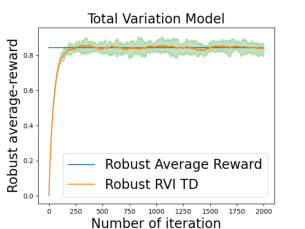

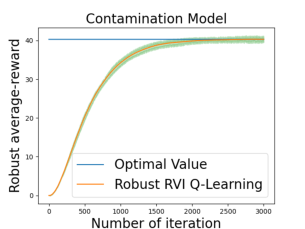

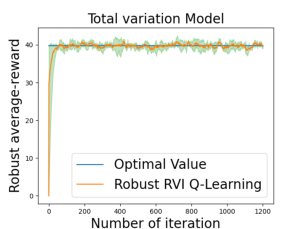

**Model-Free Robust Average-Reward Reinforcement Learning**

**G.2. Frozen-Lake Problem**

We first verify our robust RVI TD algorithm and robust RVI Q-learning under the Frozen-Lake environment of OpenAI
(Brockman et al., 2016). We set the uncertainty radius _δ_ = 0 _._ 4, _αn_ = 0 _._ 01 and plot the (optimal) robust average-reward
computed using model-based methods in (Wang et al., 2023) as the baseline. We evaluate the uniform policy for the
policy evaluation problem, plot the average value of _f_ ( _Vt_ ) of 30 trajectories and plot the 95/5 percentile as the upper/lower
envelope. For the optimal control problem, we plot the average value of _f_ ( _Qt_ ) of 30 trajectories and plot the 95/5 percentile
as the upper/lower envelope. The results show that both algorithms converge to the (optimal) robust average-reward.

Figure 7: Robust RVI TD Algorithm under Frozen-Lake environment.

Figure 8: Robust RVI Q-learning Algorithm under Frozen-Lake environment.

38

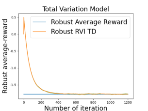

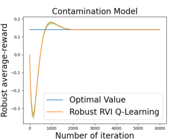

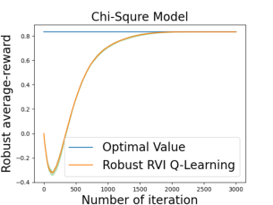

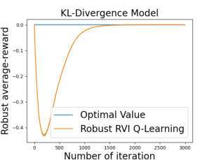

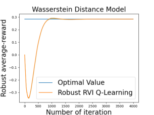

**Model-Free Robust Average-Reward Reinforcement Learning**

**G.3. Robustness of Robust RVI Q-Learning**

We further use the simple, yet widely-used problem, referred to as the one-loop task problem (Panaganti & Kalathil, 2021),
to verify the robustness of our robust RVI Q-learning. This environment is widely used to demonstrate that robust methods
can learn different optimal polices from the non-robust methods, which are more robust to model uncertainty. The one-loop
MDP contains 2 states _s_ 1 _, s_ 2, and 2 actions _al, ar_ indicating going left or right.

The nominal environment is shown in the left of Figure 9, where at state _s_ 1, going left and right will result in a transition to
_s_ 1 or _s_ 2; and at _s_ 2, going left and right will result in a transition to _s_ 1 or _s_ 2.

Figure 9: One-Loop Task.

We implement our robust RVI Q-learning and vanilla non-robust Q-learning as the baseline in this environment. At each
time step _t_, we plot the difference between _Qt_ ( _s_ 1 _, al_ ) and _Qt_ ( _s_ 1 _, ar_ ) in Figure 10(a). If _Qt_ ( _s_ 1 _, al_ ) _−_ _Qt_ ( _s_ 1 _, ar_ ) _<_ 0, the
greedy policy will be going right; and if _Qt_ ( _s_ 1 _, al_ ) _−_ _Qt_ ( _s_ 1 _, ar_ ) _>_ 0, the policy will be going left. As the results show, the
vanilla Q-learning will finally learn a policy _π_ ( _s_ 1) = _ar_, while our algorithms learn a policy _π_ ( _s_ 1) = _al_ .

To verify the robustness of our method, we test the learned policies under a perturbed testing environment, shown on the
right of Figure 9. We plot the average-reward of policies _πt_ under this perturbed environment. The results are shown in
Figure 10(b).

(a) _Q_ ( _s_ 1 _, al_ ) _−_ _Q_ ( _s_ 2 _, ar_ ) (b) Average-Reward under Testing MDP

Figure 10: One-Loop Task.

As the results show, our robust RVI Q-learning learns a more robust policy under the nominal environment, which obtains a
higher reward in the perturbed environment; whereas the non-robust Q-learning learns a policy that is optimal w.r.t. the
nominal environment, but less robust when the environment is perturbed. This verifies that our algorithm is more robust than
the vanilla method.

39

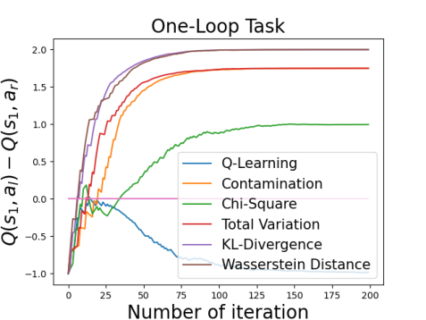

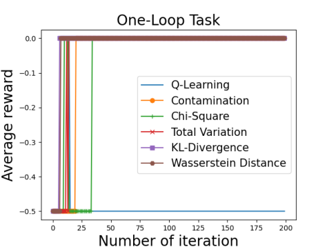
