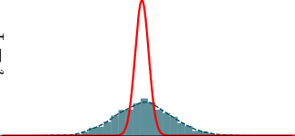
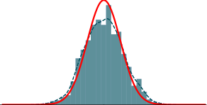
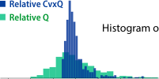
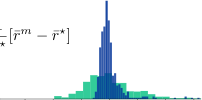

### Convex Q Learning in a Stochastic Environment: Extended Version

Fan Lu [∗] and Sean Meyn [†]

September 12, 2023

**Abstract**

The paper introduces the first formulation of convex Q-learning for Markov decision processes with function approximation. The algorithms and theory rest on a relaxation of a dual of
Manne’s celebrated linear programming characterization of optimal control. The main contributions firstly concern properties of the relaxation, described as a deterministic convex program:
we identify conditions for a bounded solution, and a significant relationship between the solution
to the new convex program, and the solution to standard Q-learning. The second set of contributions concern algorithm design and analysis: (i) A direct model-free method for approximating
the convex program for Q-learning shares properties with its ideal. In particular, a bounded
solution is ensured subject to a simple property of the basis functions; (ii) The proposed algorithms are convergent and new techniques are introduced to obtain the rate of convergence in
a mean-square sense; (iii) The approach can be generalized to a range of performance criteria,
and it is found that variance can be reduced by considering “relative” dynamic programming
equations; (iv) The theory is illustrated with an application to a classical inventory control
problem.
This is an extended version of an article to appear in the forthcoming IEEE Conference on
Decision and Control.

#### **1 Introduction**

The Q-learning algorithm introduced in [28] is a highly celebrated approach to reinforcement learning, that has evolved over the past decades to form part of the solution to complex optimal control
problems. It was originally designed to compute the state-action value function (known as the
Q-function). This early work considered the discounted-cost optimal control problem for Markov
decision processes (MDPs), in the _tabular_ setting so that the function class spans all functions.
The ultimate goal then and now is to approximate the Q-function within a restricted function
class, notably neural networks, though much of the theory is restricted to a linearly parameterized
function class. Counterexamples show that conditions on the function class are required in general,
even in a linear function approximation setting [2, 27, 9]. Criteria for stability based on sufficient
exploration are contained in the recent work [18].
Moreover, when convergent, the limit of Q-learning or DQN solves a “projected Bellman equation” (see (11)), but we know little about the implication of this conclusion. These concerns have
motivated new ways of thinking about how to approximate a Q-function.

∗F. Lu is with the Department of Applied Mathmatics and Statistics, University of California, Santa Cruz, CA
95064, USA (e-mail: flu16@ucsc.edu).

  - S. Meyn is with the Department of Electrical and Computer Engineering, University of Florida, Gainesville,
FL 32611, USA (e-mail: meyn@ece.ufl.edu). Support from ARO award W911NF2010055 and National Science
Foundation award EPCN 1935389 is gratefully acknowledged.

1

One alternative is GQ learning, based on a stochastic gradient descent algorithm with an objective similar to the mean-square Bellman error [25]. Recently a more exact stochastic gradient
descent algorithm was introduced in [1] with full stability analysis. These results present a significant advancement but come with two drawbacks: the objective is non-convex, so there is no reason
to believe the algorithm will converge to the global minimum. Moreover, it remains difficult to
interpret the solution of the global minimum. If the Bellman error is small in an _L_ 2 sense, where
the _L_ 2 norm depends on training data, what does this tell us about the performance of the ultimate
feedback policy?
The linear programming (LP) approach to optimal control pioneered by Manne [15] has inspired
alternative approaches to RL and approximate dynamic programming. The earliest such work
was found in [23], with error bounds appearing in [5, 4, 11]. Model-free algorithms appeared in

[16, 12, 13] and [17, Ch. 5], where the term _convex Q-learning_ (CvxQ) was coined. In parallel came
_logistic Q-learning_ [3], which solves a regularized dual of the LP in [12]. There is however a gap
in the settings: CvxQ was developed for deterministic control systems, while logistic Q-learning
treats MDPs. Also, the stochastic setting is so far restricted to tabular [3] or linearly factorable
MDPs [20]. Theory for CvxQ has few restrictions, beyond the limitation to deterministic control
systems.
LP approaches are attractive because we obtain by design a convergent algorithm. Moreover,
the _L∞_ -framework is more likely to lead to an interpretable solution, since performance bounds on
the resulting feedback policy can be obtained through Lyapunov function techniques [5, 11]. The
main contributions are summarized here:

**i)** Convex Q-learning for optimal control is introduced in a stochastic environment for the first
time. It is found that the constraint region is bounded subject to a persistence of excitation, generalizing the conclusions obtained recently for deterministic optimal control problems [13]. Several
approaches to approximating the solution to the convex program are proposed and analyzed.

**ii)** Prop. 2.5 implies a surprising connection between CvxQ and standard Q-learning.

**iii)** Techniques are introduced to obtain the rate of convergence in a mean-square sense—see
Prop. A.1.

**Comparison with existing literature.** The new algorithms and some of the analysis might
be anticipated from the theory for deterministic control systems in [13]. Prop. 2.5 is new (and
was initially surprising to us) even in the deterministic setting. The variance analysis surveyed
in Prop. A.1 is novel, resting on recent CLT theory from [24] to obtain an exact formula for the
asymptotic covariance. Complementary results appeared in [21], motivated by MDP LP relaxations.
Conclusions in this prior work is based on i.i.d. samples of trajectories, designed to permit application of Hoeffding’s inequality to obtain sample complexity bounds for constraint-sampled LPs.
The covariance formula in Prop. A.1 is similar to what is anticipated from stochastic approximation
(SA) theory, even though CvxQ falls outside of standard SA recursions —see discussion following
the proposition.

**Organization:** Section 2 conditions foundations for the CvxQ algorithms introduced in Section 3.
Theory for convergence rates is contained in Section 4. The theory is illustrated in Section 5 with
an application to a classical inventory control problem.

This paper is an extended version of [14], to appear in the 2023 IEEE Conference on Decision
and Control.

2

#### **2 Q-learning Convex Programs**

The control model for which algorithm design and analysis is based on the standard Markov Decision
Process (MDP) with finite state space X, finite input space U, and non-negative cost function
_c_ : Z _→_ R+, with Z := X _×_ U.
The state process is denoted _**X**_ = _{X_ ( _k_ ) : _k ≥_ 0 _}_, the input (or action) sequence _**U**_ = _{U_ ( _k_ ) :
_k ≥_ 0 _}_, and the pair process _**Z**_ = ( _**X**_ _,_ _**U**_ ). The controlled transition matrix is denoted _Pu_ for _u ∈_ U,
so that P _{X_ ( _k_ + 1) = _x_ _[′]_ _| X_ ( _k_ ) = _x, U_ ( _k_ ) = _u}_ = _Pu_ ( _x, x_ _[′]_ ); it acts on functions _V_ : X _→_ R via
_PuV_ ( _x_ ) := [�] _x_ _[′]_ _∈_ X _[P][u]_ [(] _[x, x][′]_ [)] _[V]_ [ (] _[x][′]_ [).]
_Choice of training input._ The formulation of convex programs as well as theory surrounding algorithms is couched in a stationary setting: the input used for training is defined by a randomized
stationary policy, so that the joint process _**Z**_ is a time homogeneous Markov chain on Z. It is
assumed that _**Z**_ is uni-chain, with unique invariant pmf denoted _ϖ_ .
However, we often obtain faster training when using an epsilon-greedy policy; analysis of this
more complex setting is beyond the scope of this paper.
Theory is also restricted to the discounted-cost optimality criterion, with discount factor _γ ∈_
(0 _,_ 1). The Q-function is the state-action value function,

_Q_ _[∗]_ ( _z_ ) := min
_**U**_

_∞_
� _γ_ _[k]_ E[ _c_ ( _Z_ ( _k_ )) _|Z_ (0) = _z_ ] _,_ _z_ = ( _x, u_ ) _∈_ Z

_k_ =0

where the minimum is over all adapted input sequences. It is the unique solution to the Bellman
equation,

_Q_ _[∗]_ ( _z_ ) = _c_ ( _z_ ) + _γPuQ_ _[∗]_ ( _x_ ) (1)

with _Q_ ( _x_ ):=min _u Q_ ( _x, u_ ). The optimal input is state feedback _Uk_ = ϕ _[∗]_ ( _Xk_ ), using the “ _Q_ _[∗]_ -greedy”
policy,

ϕ _[∗]_ ( _x_ ) _∈_ arg min _Q_ _[∗]_ ( _x, u_ ) _,_ _x ∈_ X (2)
_u∈_ U

**2.1** **Convex programs for approximation**

Convex Q-learning algorithm is motivated by the classical LP characterization of optimal control
problem due to Manne [15]. The following is a simple corollary:

**Proposition 2.1.** _For any pmf µ on_ Z _, the Q-function Q_ _[∗]_ _is a solution to the convex program,_

max _⟨µ, Q⟩_
_Q_ (3)

s.t. _Q_ ( _z_ ) _≤_ _c_ ( _z_ ) + _γPuQ_ ( _x_ ) _,_ _z_ = ( _x, u_ ) _∈_ Z _._

The proof follows from verification that _Q ≤_ _Q_ _[∗]_ whenever _Q_ is feasible, which is a standard
Lyapunov function argument.
This section is devoted to relaxations of (3) that are model-based. The conclusions motivate
model-free algorithms and analysis in Section 3.
To obtain a convex program we restrict to a linear family: _{Q_ _[θ]_ ( _x, u_ ) = _θ_ [⊺] _ψ_ ( _x, u_ ) : _θ ∈_ R _[d]_ _}_,
with _ψ_ : X _×_ U _→_ R _[d]_ the vector of basis functions, and based on an appropriate approximation
obtain a policy in analog with (2):

ϕ _[θ]_ ( _x_ ) _∈_ arg min _Q_ _[θ]_ ( _x, u_ ) (4)
_u∈_ U

3

The following is suggested by (3),

max _⟨µ, Q_ _[θ]_ _⟩_ s.t. _Q_ _[θ]_ ( _z_ ) _≤_ _c_ ( _z_ ) + _γPuQ_ _[θ]_ ( _x_ ) (5)
_θ_

This is not practical in typical applications because it requires knowledge of the model, and there
are so many constraints: one for each _z_ = ( _x, u_ ) _∈_ Z.
**Galerkin relaxations** Practical algorithms are obtained by expressing the constraints of (5) in
sample path form: if a vector _θ ∈_ R _[d]_ is feasible, then the following inequality is valid for _any_
adapted input sequence: with _Fk_ = _σ_ ( _Z_ ( _i_ ) : _i ≤_ _k_ ) the filtration generated by the observations,

E� _Dk_ +1( _θ_ ) _|Fk_ � _≥_ 0 _,_ _for all k ≥_ 0 _,_

(6)
_Dk_ +1( _θ_ ) := _−Q_ _[θ]_ ( _Z_ ( _k_ )) + _c_ ( _Z_ ( _k_ )) + _γQ_ _[θ]_ ( _X_ ( _k_ + 1))

**Lemma 2.2.** _The following are equivalent for an integrable random variable X and σ-field F:_

�
(i) _X_ := E[ _X | F_ ] _≥_ 0 _with probability one._
(ii) E[ _Xζ_ ] _≥_ 0 _for any F-measurable random variable ζ that is non-negative and bounded (i.e.,_
_ζ ∈_ _L∞)._

Armed with this lemma, a relaxation of (5) is obtained by specifying a sequence of _non-negative_
_d_ +-dimensional random vectors _{ζk_ : _k ≥_ 0 _}_, with _d_ + _> d_ . Denote ~~_g_~~ ~~(~~ _θ_ ) := E _ϖ_ � _−Dk_ +1( _θ_ ) _ζk_ �. A
relaxation of (5) is then defined by

max _⟨µ, Q_ _[θ]_ _⟩_ s.t. ~~_g_~~ ~~(~~ _θ_ ) _≤_ 0 _._ (7)
_θ_

An equivalent LP formulation is required for analysis. Let Φ denote the set of all deterministic
policies, and for each ϕ _∈_ Φ and _k ≥_ 0 denote

_Dk_ +1( _θ,_ ϕ) = _c_ ( _k_ ) + _θ_ [⊺] _{−ψ_ ( _k_ ) + _γψ_ ( [ϕ] _k_ +1) _[}][,]_ (8)

in which the following conventions will be used to save space when necessary: _c_ ( _k_ ) := _c_ ( _Z_ ( _k_ )), and

_ψ_ ( _k_ ) := _ψ_ ( _X_ ( _k_ ) _, U_ ( _k_ )) _, ψ_ ( [ϕ] _k_ ) [:=] _[ ψ]_ [(] _[X]_ [(] _[k]_ [)] _[,]_ [ ϕ][(] _[X]_ [(] _[k]_ [)))]

Similar to (7), we denote ~~_g_~~ ~~(~~ _θ,_ ϕ) := E _ϖ_ � _−Dk_ +1( _θ,_ ϕ) _ζk_ � for each ϕ _∈_ Φ.

**Proposition 2.3.** _Any solution to the Q-learning convex program_ (7) _is also a solution to the_
_linear program,_
max _⟨µ, Q_ _[θ]_ _⟩_ s.t. ~~_g_~~ ~~(~~ _θ,_ ϕ) _≤_ 0 _,_ ϕ _∈_ Φ _,_ (9)
_θ_

_with identical optimal values._

**Proof.** For any ϕ _∈_ ϕ, we have

E _ϖ_ � _Dk_ +1( _θ,_ ϕ) _ζk_ _[i]_ � _≥_ E _ϖ_ � _Dk_ +1( _θ_ ) _ζk_ _[i]_ � _,_ 1 _≤_ _i ≤_ _d_ +

The proof is completed on recognizing that this lower bound is achieved with ϕ = ϕ _[θ]_ . _⊓⊔_
Let Θ = _{θ ∈_ R _[d]_ : ~~_g_~~ ~~(~~ _θ_ ) _≤_ 0 _}_ denote the constraint set for (7). It is always non-empty since it
contains the origin. Prop. 2.4 tells us that this set is bounded if the vectors _{ψ_ ( _k_ ) : 0 _≤_ _k}_ are not
restricted to any half space in R _[d]_, for almost every initial condition [ _ϖ_ ]. The proof is postponed
to the Appendix.

**Proposition 2.4.** _Suppose_ P _ϖ{v_ [⊺] _ψ_ ( _k_ ) _≥_ 0 _} <_ 1 _for any non-zero v ∈_ R _[d]_ _. Then,_ Θ _is compact._

4

**2.2** **Comparison with Q-learning**

The standard Q-learning algorithm is expressed,

_θk_ +1 = _θk_ + _αk_ +1 _Dk_ +1( _θk_ ) _ζk_ (10)

where _{ζk}_ is the sequence of _d_ -dimensional eligibility vectors, typically taken as _ζk_ = _∇θQ_ _[θ]_ ( _Z_ ( _k_ ))
(which is _ψ_ ( _k_ ) with linear function approximation), and _{αk_ +1 _}_ the step-size sequence. When
convergent, the limit _θ_ _[∗]_ solves the so-called _projected Bellman equation_ (also known as a _Galerkin_
_relaxation_ ),
E _ϖ_ � _Dk_ +1( _θ_ _[∗]_ ) _ζk_ _[i]_ � = 0 _,_ 1 _≤_ _i ≤_ _d,_ (11)

where the expectation is in steady-state [26, 17].
Prop. 2.5 that follows shows that (7) also solves a Galerkin relaxation. The proof follows from
Prop. 2.3, and recognition that in (9) we may restrict to basic feasible solutions (BFS).

**Proposition 2.5.** _If the convex program_ (7) _admits at least one optimizer, then there is an opti-_
_mizer θ_ _[∗]_ _together with indices {i_ 1 _, . . ., id} ⊂{_ 1 _, . . ., d_ + _} satisfying_

E _ϖ_ � _Dk_ +1( _θ_ _[∗]_ ) _ζk_ _[i][ℓ]_ � = 0 _,_ 1 _≤_ _ℓ_ _≤_ _d ._ (12)

#### **3 Algorithms**

In Convex Q-learning, the function ~~_g_~~ : R _[d]_ _→_ R _[d]_ [+] in (7) is replaced by its approximation via Monte
Carlo

~~_g_~~ _N_ ( _θ_ ) := [1]

_N_

_N_ _−_ 1
� [ _−Dk_ +1( _θ_ ) _ζk_ ] _._

_k_ =0

**Convex Q-learning** Given the data _{Z_ ( _k_ ) : 0 _≤_ _k < N_ _}_ and a pmf _µ_ on Z, solve

max _⟨µ, Q_ _[θ]_ _⟩_ s.t. ~~_g_~~ _N_ ( _θ_ ) _≤_ 0 (13)
_θ_

As we increase the time horizon _N_, the variance of the solution to (13) decreases, but the
complexity of the linear program increases. The batch algorithms described next are designed to
reduce complexity.

**3.1** **Batch algorithms**

The two approaches below begin with the specification of intermediate times _T_ 0 = 0 _< T_ 1 _< T_ 2 _<_

_· · · < TB−_ 1 _< TB_ = _N_ . The parameter will be updated at these times to obtain _{θn_ : 0 _≤_ _n ≤_ _B}_,
initialized with _θ_ 0 _∈_ R _[d]_ . Also required are two positive step-size sequences satisfying

lim (14)
_n→∞_ _[α][n][/β][n]_ [ = 0]

The empirical distribution over the _n_ th batch of observations is denoted π _n_ . Hence, for any
vector-valued function,

1
_⟨_ π _n, g⟩_ =
_Tn_ +1 _−_ _Tn_

5

_Tn_ +1 _−_ 1
� _g_ (Φ _k_ )

_k_ = _Tn_

In view of (7), we denote, for any _θ ∈_ R _[d]_,

1
_⟨_ π _n, D_ ( _θ_ ) _ζ⟩_ :=
_Tn_ +1 _−_ _Tn_

_Tn_ +1 _−_ 1
� _Dk_ +1( _θ_ ) _ζk_

_k_ = _Tn_

We introduce a convex regularizer _Rn_, so that the objective function at stage _n_ of the algorithm
becomes
Γ _n_ ( _θ_ ) := _−⟨µ, Q_ _[θ]_ _⟩_ + _Rn_ ( _θ_ )

and Γ _n_ ( _θ, λ_ ) := Γ _n_ ( _θ_ ) _−⟨_ π _n, D_ ( _θ_ ) _ζ_ [⊺] _λ⟩_ for _λ ∈_ R _[d]_ + [+][. Updates of] _[ λ]_ [ are obtained to approximate the]
Lagrange multiplier associated with (7). Given parameter estimates _{θn_ : _n ≥_ 0 _}_, obtain a sequence
of vectors in R _[d]_ [+] via
_v_ _[n]_ [+1] = _v_ _[n]_ + _βn_ +1� _⟨_ π _n_ +1 _, D_ ( _θn_ +1) _ζn⟩−_ _v_ _[n]_ [�]

The sequence of Lagrange multiplier estimates are obtained via the recursion _λn_ +1 = [ _λn_ + _αn_ +1 _v_ _[n]_ [+1] ]+,
with _λ_ 0 _∈_ R _[d]_ + [+] [an arbitrary initial condition and [] _[x]_ []][+][ = max] _[{]_ [0] _[, x][}]_ [.]
Below are two choices for parameter updates:

**Batch Convex Q-learning implicit update**

_θn_ +1 = arg min
_θ_

�Γ _n_ ( _θ, λn_ ) + _αn_ 1+1 12 _[∥][θ][ −]_ _[θ][n][∥]_ [2][�]

It is called implicit because the solution is obtained via the fixed point equation,

_θn_ +1 = _θn −_ _αn_ +1 _∇θ_ Γ _n_ ( _θ, λn_ )��� _θ_ = _θn_ +1 (15)

The explicit update is obtained by introducing a one-step delay on the right-hand side.

**Batch CvxQ explicit update**

_θn_ +1 = _θn −_ _αn_ +1 _∇θ_ Γ _n_ ( _θ, λn_ ) (16)
��� _θ_ = _θn_

Assumptions on the regularizer are required to ensure convergence. For convenience we take

_Rn_ ( _θ_ ) = _κ{_ [ _⟨_ π _n, D_ ( _θ_ ) _ζ_ [⊺] _λ⟩_ ] _}_ [2] + _ε∥θ∥_ [2] (17)

with _κ, ε >_ 0 and [ _x_ ] _−_ := max(0 _, −x_ ). Let _R_ ( _θ_ ) denote its steady-state mean, and

Γ¯( _θ, λ_ ) := _−⟨µ, Q_ _[θ]_ _⟩−⟨ϖ, D_ ( _θ_ ) _ζ_ [⊺] _λ⟩_ + _R_ ( _θ_ )

**Proposition 3.1.** _Consider either algorithm (implicit or explicit). The algorithm is convergent to a_
_pair_ ( _θ_ _[∗]_ _, λ_ _[∗]_ ) _that solves the saddle point problem: θ_ _[∗]_ = arg min _θ_ Γ [¯] ( _θ, λ_ _[∗]_ ) _, λ_ _[∗]_ = arg max _λ_ min _θ_ Γ [¯] ( _θ, λ_ ) _._

The proof is a standard stochastic approximation analysis, in which the ODE approximation is
precisely the _primal-dual flow_ considered in [22, 8] and their references.

6

**3.2** **Relative Convex Q-Learning**

Given any pmf _ω_ on Z, denote _H_ _[∗]_ := _Q_ _[∗]_ _−⟨ω, Q_ _[∗]_ _⟩_ . Since we are subtracting a constant, we have
ϕ _[∗]_ ( _x_ ) = arg min _u∈_ U _H_ _[∗]_ ( _x, u_ ). The advantage of estimating _H_ _[∗]_ is that it remains bounded for
0 _< γ <_ 1 [7]. The extension of the preceding theory to this _relative Q-function_ is straightforward,
beginning with

**Proposition 3.2.** _For any positive pmfs µ and ω on_ Z _and positive scalar δ >_ 0 _, H_ _[∗]_ _solves the_

_convex program,_
max _⟨µ, H⟩_
_H_

s.t. _H_ ( _z_ ) _≤_ _c_ ( _z_ ) + _γPuH_ ( _x_ ) _−_ _δ⟨ω, H⟩_ _,_

_for every z_ = ( _x, u_ ) _∈_ Z _._

(18)

This motivates one version of relative convex Q-learning:

**Relative CvxQ** Given the data _{Z_ ( _k_ ) : 0 _≤_ _k < N_ _}_ and probability measures _µ_ and _ω_ on Z,
solve
max _⟨µ, H_ _[θ]_ _⟩_ s.t. ~~_g_~~ _N_ ( _θ_ ) _≤_ 0 (19)
_θ_

where ~~_g_~~ _N_ is defined as in (13), with _Dk_ +1 replaced by the relative temporal difference:

�
_Dk_ +1( _θ_ ) := _−H_ _[θ]_ ( _Z_ ( _k_ )) + _c_ ( _Z_ ( _k_ )) + _γH_ _[θ]_ ( _X_ ( _k_ + 1))

_−_ _δ⟨ω, H_ _[θ]_ _⟩._

Formulation of batch algorithms is also straightforward.

#### **4 Rates of Convergence**

We consider here the rate of convergence for the basic algorithm (13), whose solution is denoted
_θN_ . Subject to mild conditions we establish that _θN →_ _θ_ _[∗]_ with probability one as _N →∞_, where
_θ_ _[∗]_ solves (7); one assumption is that the solution is unique. It is more challenging to establish
bounds on the mean-square error (MSE) E[ _∥θ_ [˜] _N_ _∥_ [2] ], with _θ_ [˜] _N_ = _θN −_ _θ_ _[∗]_ . In fact, we have not been
able to find a deterministic _N_ 0 for which E[ _∥θ_ [˜] _N_ _∥_ [2] ] _< ∞_ for _N ≥_ _N_ 0. We fix _r >_ 0 satisfying
_|θi_ _[∗][|][ < r]_ [ for each] _[ i]_ [, and let] _[ θ]_ _N_ _[r]_ [denote the] _[ L][∞]_ [projection of the solution of (13) to the region]
Θ _r_ = _{θ ∈_ R _[d]_ : _|θi| ≤_ _r,_ 1 _≤_ _i ≤_ _d}_ . We set _θN_ _[r]_ [= 0 if the convex program (13) is unbounded or]
infeasible.
While the sequence _{θN_ _[r]_ _[}]_ [ cannot be represented as the output of any recursive algorithm, key]
results from stochastic approximation theory would suggest that the MSE should decay as _O_ (1 _/N_ ).
We verify that this rate of convergence holds, and obtain finer results:

_N_ E[ _θ_ [˜] _N_ _[r]_ [(˜] _[θ]_ _N_ _[r]_ [)][⊺][] = Σ][θ] [+] _[ O]_ � ~~_√_~~ 1

_N_ �

_√_

(20)
dist
_N_ _θ_ [˜] _N_ _[r]_ _−→_ _N_ (0 _,_ Σθ) _,_ _N →∞_

where the convergence is in distribution in the second limit, and _θ_ [˜] _N_ _[r]_ [=] _[ θ]_ _N_ _[r]_ _[−]_ _[θ][∗]_ [. The matrix Σ][θ] _[ ≥]_ [0]
is identified in Prop. 4.2 after a few preliminary results.
For each _θ ∈_ R _[d]_ and ϕ _∈_ Φ denote

~~_g_~~ _N_ ( _θ,_ ϕ) := _−_ [1]

_N_

_N_ _−_ 1
� _gk_ ( _θ,_ ϕ) _,_

_k_ =0

where _gk_ ( _θ,_ ϕ) = _−Dk_ +1( _θ,_ ϕ) _ζk_ (recall (8)).

7

**Proposition 4.1.** _Any solution to the convex program_ (13) _is also a solution to the linear program_

max _⟨µ, Q_ _[θ]_ _⟩_
_θ_ (21)

s.t. ~~_g_~~ ~~_[i]_~~ _N_ [(] _[θ,]_ [ ϕ][)] _[ ≤]_ [0] _[,]_ 1 _≤_ _i ≤_ _d_ + _,_ ϕ _∈_ Φ _._

_Moreover, a vector θ ∈_ R _[d]_ _is a BFS if and only if the following two properties hold: 1. there is a_
_set I_ + _[θ]_ [=] _[ {][j]_ [1] _[, . . ., j][d][} ⊂{]_ [1] _[, . . ., d]_ [+] _[}][ such that]_

~~_g_~~ ~~_[i]_~~ _N_ [(] _[θ,]_ [ ϕ] _[θ]_ [) = 0] _[,]_ _i ∈I_ + _[θ]_
_<_ 0 _,_ _i ̸∈I_ + _[θ]_

_where_ ϕ _[θ]_ _is the Q_ _[θ]_ _-greedy policy, and 2. There is no other Q_ _[θ]_ _-greedy policy: if_ ϕ _[′]_ _∈_ Φ _satisfies_

ϕ _[′]_ ( _x_ ) _∈_ arg min _Q_ _[θ]_ ( _x, u_ ) _,_ _for all x ∈_ X _,_

_u_

_then_ ϕ _[′]_ ( _x_ ) = ϕ _[θ]_ ( _x_ ) _for all x._

**Proof.** The proof of the LP characterization (21) is identical to the proof of Prop. 2.3. The
characterization of a BFS is a consequence of the proof: By definition, if _θ_ is a BFS then there are
exactly _d_ pairs _{_ ϕ _[i]_ _, ji_ : 1 _≤_ _i ≤_ _d}_ for which the constraints are tight, meaning ~~_g_~~ ~~_[j]_~~ _N_ _[i]_ [(] _[θ,]_ [ ϕ] _[i]_ [) = 0. We]
also have ~~_g_~~ ~~_[j]_~~ _N_ _[i]_ [(] _[θ,]_ [ ϕ] _[θ]_ [)] _[ ≥]_ ~~_[g][j]_~~ _N_ _[i]_ [(] _[θ,]_ [ ϕ] _[i]_ [) = 0, so that by feasibility we must also have] ~~_[g][j]_~~ _N_ _[i]_ [(] _[θ,]_ [ ϕ] _[θ]_ [) = 0 for]
each _i_ . Since there are exactly _d_ active constraints, we must have ϕ _[θ]_ = ϕ _[i]_ for each _i_ . _⊓⊔_
Prop. 4.1 provides the ingredients required to establish convergence.
It is assumed that _θ_ _[∗]_ is unique, from which it follows that it is also a BFS. We let _I_ + =
_{j_ 1 _, . . ., jd}_ denote the set of _d_ indices for which ~~_g_~~ ~~_[i]_~~ _N_ [(] _[θ,]_ [ ϕ] _[θ]_ [) = 0 when] _[ θ]_ [ =] _[ θ][∗]_ [and] _[ i][ ∈I]_ [+][.]
A _d_ -dimensional stochastic process _W N_ is constructed as an average,

_W N_ = [1]

_N_

_N_

_Wk_

�

_k_ =1

in which the _d_ -dimensional stochastic process _{Wk}_ is obtained in the following steps. First, construct a _d × d_ matrix _A_ [+] _k_ [, whose] _[ i, j]_ [ element is given by]

[ _A_ [+] _k_ []] _[i,j]_ [ :=] � _−ψ_ ( _k−_ 1) + _γψ_ _[θ]_ _k_ _[∗]_

_j_ _[ζ]_ _k_ _[j][i]_ _−_ 1

_[θ]_ ( _k_ )�

and let _A_ [¯][+] = E _ϖ_ � _A_ [+] _k_ [], where the expectation is in steady-state. Let] _[ β]_ _k_ [+] [be the] _[ d]_ [-dimensional vector]
whose¯ _i_ th component is equal to _c_ ( _k−_ 1) _ζk_ _[j][i]_ _−_ 1 [, whose steady state mean is the] _[ d]_ [-dimensional vector]
_β_ [+] = E _ϖ_ [ _βk_ [+][]. We then take]
_Wk_ = _βk_ [+] _[−]_ _[β]_ [¯][+] _[ −]_ [[] _[A]_ [+] _k_ _[−]_ _[A]_ [¯][+][]] _[θ][∗]_

This is analogous to the “disturbance sequence” that arises in variance analysis of standard Qlearning algorithms [6, 17].

**Proposition 4.2.** _Suppose that the linear program_ (21) _has a unique optimizer θ_ _[∗]_ _. Then,_ lim _N_ [=]
_N_ _→∞_ _[θ][r]_

lim
_N_ _→∞_ _[θ][N]_ [ =] _[ θ][∗]_ _[with probability one, and]_ [ (20)] _[ holds.]_

_The covariance matrix may be expressed_

Σθ = [ _A_ [¯][+] ] _[−]_ [1] Σ _W_ ([ _A_ [¯][+] ] _[−]_ [1] ) [⊺] _,_

_with_ Σ _W_ = lim
_N_ _→∞_ _[N]_ [E][[] _[W][ N]_ [(] _[W][ N]_ [)][⊺][]]

8

Invertibility of _A_ [¯][+] is a consequence of the fact that _θ_ _[∗]_ is a BFS.
The form of the covariance Σθ is identical in form to the minimal covariance identified in the
averaging theory of Polyak and Ruppert for stochastic approximation (see historical notes in [17,
Ch. 8]). It is likely that it is also minimal here (the batch algorithms may satisfy a CLT, but the
covariance matrix will dominate Σθ).
**Proof of Prop. 4.2 (main concepts).** The full proof follows from the more general Prop. A.1
found in the Appendix. We present here the main ideas through a heuristic, which is conveniently
explained for the more general setting of convex constraints [1] .
Consider the minimization of a linear objective _v_ [⊺] _θ_ subject to convex constraints ~~_g_~~ _N_ ( _θ_ ) _≤_ 0,
and let _θ_ _[∗]_ denote the minimizer for _N_ = _∞_ : as in Prop. 4.2 there is a limiting function ~~_g_~~ ~~,~~ and _θ_ _[∗]_

minimizes _v_ [⊺] _θ_ subject ~~_g_~~ ~~(~~ _θ_ ) _≤_ 0. The heuristic is based on the convex program

_θN_ _[∗]_ [= arg min] _[ v]_ [⊺] _[θ]_ subject to ~~_g_~~ ~~(~~ _θ_ ) _≤_ _b_ _[∗]_ _N_ (22)

with _b_ _[∗]_ _N_ [:=] ~~_[g]_~~ ~~[(]~~ _[θ][∗]_ [)] _[−]_ ~~_[g]_~~ _N_ [(] _[θ][∗]_ [). The remainder of the proof is based on the fact that][ E][[] _[∥][b][∗]_ _N_ _[∥]_ [2][] =] _[ O]_ [(1] _[/N]_ [),]
along with sensitivity theory for convex programming.
In analysis of (22) the definition of the set _I_ + remains the same, characterized in terms of
the dual under mild conditions. Let _λ_ _[∗]_ _∈_ R _[d]_ [+] denote the Lagrange multiplier associated with the
optimizer _θ_ _[∗]_ . If sensitivity is strictly positive for active constraints then _I_ + = _{i_ : _λ_ _[∗]_ _i_ _[>]_ [ 0] _[}]_ [.] _⊓⊔_

_N_ = 10 [4] _N_ = 10 [6]

-20 -10 0 10 20 -20 -10 0 10 20

-20 -10 0 10 20

-20 -10 0 10 20

_N_ _θ_ [˜] _N_ _[∗]_ [.]

Figure 1: Histogram plots of _√_

_N_ _θ_ [˜] _N_ and _√_

**Example** To illustrate the CLT in a simple setting, consider a quadratic program on R [2] with 10
constraints: _θ ∈_ R [2], ~~_g_~~ : R [2] _→_ R [10], and ~~_g_~~ _N_ ( _θ_ ) = _N_ _[−]_ [1][ �] _[N]_ _k_ =0 _[−]_ [1] _[g]_ [(] _[θ]_ [ + ∆] _[k]_ [), with] _[ {]_ [∆] _[k][}]_ [ i.i.d.,] _[ N]_ [(0] _[, I]_ [).]
The function _g_ : R [2] _→_ R [10] is the quadratic _g_ ( _ϑ_ ) = ( _a_ [⊺] _ϑ_ ) _⊙_ ( _a_ [⊺] _ϑ_ ) + _b_ [⊺] _ϑ −_ 1, where _a, b ∈_ R [2] _[×]_ [10], 1
is a vector of ones, and _⊙_ denotes element-wise multiplication.
Three quadratic programs were constructed by replacing the constraint in (22) with ~~_g_~~ _N_ ( _θ_ ) _≤_ 0,
~~_g_~~ ~~(~~ _θ_ ) _≤_ 0, and ~~_g_~~ _N_ ( _θ_ ) _≤_ _b_ _[∗]_ _N_ [. The solutions to each of these quadratic programs are denoted] _[ θ][N]_ [,] _[ θ][∗]_ [,]
and _θ_ _[∗]_
_N_ [respectively.]
The values of _a_, _b_, and _v_ were obtained by sampling independently from a normal distribution.
The results that follow show typical results for one set of values.

1Extension of variance theory to general convex constraints may be valuable when relaxing the assumption that
U is finite, or when convex regularizers are introduced.

9

The dual variable _λ_ _[∗]_ associated with _θ_ _[∗]_ was also obtained. Exactly two of ten inequality
constraints were found to be tight, and exactly two values of _λ_ _[∗]_ were strictly positive.
The theoretical Gaussian density was compared to histograms obtained from repeated independent experiments. In each of 100 runs, the corresponding errors were recorded: _√N_ _θ_ [˜] _N_ _[∗]_ [:=]

pendent experiments. In each of 100 runs, the corresponding errors were recorded: _√N_ _θ_ [˜] _N_ _[∗]_ [:=]

_√N_ [ _θN_ _[∗]_ _[−]_ _[θ][∗]_ [] and] _√N_ _θ_ [˜] _N_ := _√N_ [ _θN −_ _θ_ _[∗]_ ] . Results shown in Fig. 1 are consistent with the CLT.

Approximations are good even for _N_ = 10 [4], and nearly perfect for _N ≥_ 10 [6] .

_N_ [ _θN_ _[∗]_ _[−]_ _[θ][∗]_ [] and] _√_

_N_ _θ_ [˜] _N_ := _√_

#### **5 Application to Inventory Control**

We survey here results from experiments on a classical inventory control problem focusing on two
topics: (i) Stability and consistency of CvxQ and relative CvxQ; (ii) Comparison of convergence
rates with Q-learning and CvxQ. [2]

**Preliminaries** Consider the inventory model with inventory level _X_ ( _k_ ) _∈_ X = R (a negative value
indicating backlog), depletion rate _β >_ 0, and stocking decision _U_ ( _k_ ) _∈_ U = _{_ 0 _,_ 1 _}_ . The MDP
model has cost defined by parameters _c_ [+] _, c_ _[−]_ _>_ 0 and evolution equation,

_X_ ( _k_ + 1) = _X_ ( _k_ ) _−_ [ _β_ + _W_ ( _k_ + 1)] + _U_ ( _k_ )

(23a)
_c_ ( _x, u_ ) = max( _c_ [+] _x, −c_ _[−]_ _x_ ) _,_ _x ∈_ R ;

_{W_ ( _k_ ) _}_ is i.i.d. with zero mean and finite variance _σW_ [2] [.]
An optimal policy is of the threshold form:

ϕ( _x_ ; ~~_r_~~ ~~)~~ = **1** _{x ≤_ ~~_−r}_~~ _._ (24)

For small _β >_ 0 the optimal threshold is approximated by ~~_r_~~ ~~_[†]_~~ :=log(1+ _c_ [+] _/c_ _[−]_ ) _/ϱ_ with _ϱ_ the positive
solution to _σ_ [2]
_W_ _[ϱ]_ [2] _[/]_ [2] _[ −]_ _[βϱ][ −]_ _[γ]_ [ = 0. See [19, Ch. 7] for background.]

_J_ ˆ(0; ¯ _r_ ) Exponential _r_ ¯ _J_ ˆ(0; ¯ _r_ ) Gaussian _r_ ¯

Figure 2: Numerical Estimation of the Optimal Inventory Level.

We set _γ_ = 0 _._ 99, _β_ = 0 _._ 1, _c_ _[−]_ = 1, _c_ [+] = 10 and _σW_ [2] [= 1 in the experiments that follow, giving]
~~_r_~~ ~~_[†]_~~ _≈_ 8 _._ 77.

**Numerical Estimation of ¯** _**r**_ _**[∗]**_ **.** To evaluate the results obtained using CvxQ we estimated the
optimal threshold via Monte-Carlo, evaluating a range of 100 values of ~~_r_~~ evenly spaced in the
interval [0 _,_ 10]. We used common randomness for the entire range of thresholds, meaning that
we constructed a single i.i.d. family _{Wk_ _[i]_ [: 1] _[ ≤]_ _[i][ ≤]_ _[N,]_ [ 1] _[ ≤]_ _[k][ ≤]_ _[N]_ _[}]_ [, with] _[ N]_ [ = 2] _[ ×]_ [ 10][4][; in each]
experiment we chose initial condition _X_ _[i]_ (0) = 0. For each threshold ~~_r_~~ we obtain the sample path

2The experiments go beyond the theory because the state space is not finite. We believe that numerical results
are valuable for testing the boundaries of the theory. We know from experience that some disagree, so we respectfully
ask the reviewers to accept our preferences.

10

**Gaussian noise** **Exponentially distributed noise** **Gaussian noise**

_×_ 10 [3]

_×_ 10 [4]

Histogram of _r_ ¯ [1] [[¯] _[r][m][ −]_ _[r]_ [¯][ ]]

-0.6 -0.4 -0.2 0.0 0.2 0.4 0.6 -0.6 -0.4 -0.2 0.0 0.2 0.4 0.6

-0.6 -0.4 -0.4 0.0 0.2 0.4 0.6 -0.6 -0.4 -0.2 0.0 0.2 0.4 0.6

_θ_ ¯(1) = 3.96 _θ_ ¯(3) = -4.10 _θ_ ¯(8) = 2.06

-1.0 0.0 1.0 -1.0 0.0 1.0 -4.0 -2.0 0.0 2.0

_θ_ ¯(1) = 26.7 _θ_ ¯(3) = 13.94 _θ_ ¯(8) = 3203

-1.0 0.0 1.0 2.0 3.0 0.0 5.0 10 -200 0.0 200

**(a) Histograms of relative error for target inventory estimates** **(b) Variance is reduced by more than two orders of magnitude using relative CvxQ**

Figure 3: Performance Comparison between CvxQ, CvxRQ Q-learning and relative Q-learning.

_{X_ _[i]_ ( _k_ ; ~~_r_~~ ~~)~~ : 0 _≤_ _k < N_ _}_, _N_ = 10 [4], and from this an estimate of the discounted total cost by
truncating and averaging:

_N_ _−_ 1
� _γ_ _[k]_ _c_ ( _X_ _[i]_ ( _k_ ; ~~_r_~~ ~~)~~ ) _,_ ~~_r_~~ _∈_ [0 _,_ 10] _._

_k_ =0

�
_J_ ( _x_ ; ~~_r_~~ ~~)~~ = [1]

_N_

_N_
�

_i_ =1

The plots in Fig. 2 show results for two choices of disturbance, _Wk ∼_ _N_ (0 _,_ 1) and _Wk ∼_
Exp(1) _−_ 1. In each case, the value of _J_ [�] (0; ~~_r_~~ ~~)~~ at ~~_r_~~ ~~_[†]_~~ closely matches the empirical minimum ~~_r_~~ ~~_[∗]_~~ .

**5.1** **Algorithm Comparisons**

CvxQ, relative CvxQ, Q-learning, and relative Q-learning were applied to approximate the optimal
policy under the same modeling assumptions used to obtain the plots in Fig. 2.

**Details of Implementation** Theory surveyed in [19, Ch. 7] tells us that the optimal value function
_J_ _[∗]_ ( _x_ ) := min _u Q_ _[∗]_ ( _x, u_ ) is convex, and is approximated by _c_ ( _x_ ) _/_ (1 _−_ _γ_ ) for large _x_ . This motivated
the choice of 8-dimensional linear function class _{Q_ _[θ]_ = _θ_ [⊺] _ψ_ : _θ ∈_ R _[d]_ _}_ using the continuously
differentiable functions _ψ_ ( _z_ ) = [ _ψ_ _[′]_ ( _x_ ) **1** _{u_ = 0 _}_ ; _ψ_ _[′]_ ( _x_ ) **1** _{u_ = 1 _}_ ] [⊺] where _ψ_ _[′]_ ( _x_ ) = [ _ξ_ 1( _x_ ); _ξ_ 2( _x_ ); _x_ ; 1],
with _ξi_ ( _x_ ) = ( _|x|_ + ( _e_ _[−][δ][i][|][x][|]_ _−_ 1)) **1** _{x ≥_ 0 _}/δi_ . The values _δ_ 1 = 0 _._ 5, _δ_ 2 = 0 _._ 1, gave good results.
The following input sequence was used for training:

ϕ( _u|x_ ) := _P_ ( _U_ ( _k_ ) = _u|X_ ( _k_ ) = _x_ )

= _εPE_ ( _u_ ) + (1 _−_ _ε_ ) **1** _{u_ = ϕ( _x_ ) _}_

with _ε_ = 0 _._ 9, _PE_ uniform on U, and ϕ a threshold policy that gave good performance.
We chose _{ζk}_ in (13), (19) to be the indicator functions:

_ζk_ _[i]_ [=] **[ 1]** _[{][x][i][ ≤]_ _[X]_ [(] _[k]_ [)] _[ ≤]_ _[x][i]_ [+1] _[}][,]_ 1 _≤_ _i ≤_ _d_ +

We found that choosing _x_ _[i]_ to be evenly spaced in the range [ _−_ 28 _,_ 28] gave good performance. The
results that follow applied this approach using _d_ + = 200.
Several algorithms were tested: Q-learning using the recursion (10) with _ζk_ = _ψ_ ( _k_ ) and constant
step size _αk_ +1 = 10 _[−]_ [3] ; relative Q-learning algorithm, defined by replacing _Dk_ +1( _θk_ ) with _D_ [�] _k_ +1( _θk_ )
in (10); CvxQ (13) and relative CvxQ (19) using the convex solver from the Python library CVXPY.
Independent experiments were conducted with common disturbance _{W_ ( _k_ ) _}_ in each run (using
the model (23a)). In each of _M_ = 100 independent runs with time horizon _N_ = 10 [4], the following
data was collected: the final parameter estimate _θ_ _[m]_, and the estimate ~~_r_~~ ~~_[m]_~~ of the optimal threshold,

11

defined as the minimal solution _Q_ _[θ][m]_ ( _x,_ 0) _≤_ _Q_ _[θ][m]_ ( _x,_ 1) for all _x ≥_ ~~_r_~~ ~~_[m]_~~ . Selected results are illustrated
in Fig. 3. Shown on the left hand side are histograms of the relative error _{_ ~~[~~ ~~_r_~~ ~~_[m]_~~ _−_ ~~_r_~~ ~~_[∗]_~~ ] _/_ ~~_r_~~ ~~_[∗]_~~ : 1 _≤_ _m ≤_
_M_ _}_ . We see that relative CvxQ offers the lowest variance in these experiments.
The right hand side of Fig. 3 shows histograms of components of the scaled parameter error,
_√_ ~~_n_~~ ~~[~~ _θm∗_ [(] _[i]_ [)] _[ −]_ _[θ]_ [(] _[i]_ [)] for several] _[ i]_ [, with] _[ θ]_ [ the average of] _[ θ]_ _m_ _[∗]_ [. Only results for the CvxQ algorithms are]
shown. The CLT appears to hold, with relative CvxQ giving much lower variance.

#### **6 Conclusions**

This paper lays out new approaches to reinforcement learning design and analysis. Important gaps
include the augmentation of CvxQ to impose bounds on performance of resulting policies, techniques
for analysis in non-stationary settings (motivated by the need for more efficient exploration), and
development of algorithms for more advanced function approximation architectures (e.g., neural
networks and RKHS). It is important to improve the numerical performance of CvxQ, build bridges
with logistic Q-learning and recent approaches, such as the interacting particle approach of [10],
and find ways to make comparisons in terms of both training efficiency and policy performance.

12

#### **References**

[1] K. E. Avrachenkov, V. S. Borkar, H. P. Dolhare, and K. Patil. Full gradient DQN reinforcement
learning: A provably convergent scheme. In _Modern Trends in Controlled Stochastic Processes:_,
pages 192–220. Springer, 2021.

[2] L. Baird. Residual algorithms: Reinforcement learning with function approximation. In
A. Prieditis and S. Russell, editors, _Proc. Machine Learning_, pages 30–37. Morgan Kaufmann,
San Francisco (CA), 1995.

[3] J. Bas Serrano, S. Curi, A. Krause, and G. Neu. Logistic Q-learning. In A. Banerjee and
K. Fukumizu, editors, _Proc. of The Intl. Conference on Artificial Intelligence and Statistics_,
volume 130, pages 3610–3618, 13–15 Apr 2021.

[4] D. P. De Farias and B. Van Roy. On constraint sampling in the linear programming approach
to approximate dynamic programming. _Mathematics of operations research_, 29(3):462–478,
2004.

[5] D. P. de Farias and B. Van Roy. A cost-shaping linear program for average-cost approximate
dynamic programming with performance guarantees. _Math. Oper. Res._, 31(3):597–620, 2006.

[6] A. M. Devraj and S. P. Meyn. Zap Q-learning. In _Proc. of the Intl. Conference on Neural_
_Information Processing Systems_, pages 2232–2241, 2017.

[7] A. M. Devraj and S. P. Meyn. Q-learning with uniformly bounded variance. _IEEE Trans. on_
_Automatic Control_, 67(11):5948–5963, 2022.

[8] D. Ding and M. R. Jovanovi´c. Global exponential stability of primal-dual gradient flow dynamics based on the proximal augmented Lagrangian. In _Proc. of the American Control Conf._,
pages 3414–3419. IEEE, 2019.

[9] G. J. Gordon. Reinforcement learning with function approximation converges to a region. In
_Conference on Neural Information Processing Systems_, pages 996–1002, Cambridge, MA, 2000.

[10] A. A. Joshi, A. Taghvaei, P. G. Mehta, and S. P. Meyn. Controlled interacting particle
algorithms for simulation-based reinforcement learning. _Systems & Control Letters Control_
_Letters_, 170:1–15, 2022.

[11] C. Lakshminarayanan, S. Bhatnagar, and C. Szepesv´ari. A linearly relaxed approximate linear
program for Markov decision processes. _IEEE Transactions on Automatic control_, 63(4):1185–
1191, 2017.

[12] F. Lu, P. G. Mehta, S. P. Meyn, and G. Neu. Convex Q-learning. In _American Control Conf._,
pages 4749–4756. IEEE, 2021.

[13] F. Lu, P. G. Mehta, S. P. Meyn, and G. Neu. Convex analytic theory for convex Q-learning.
In _IEEE Conference on Decision and Control_, pages 4065–4071, Dec 2022.

[14] F. Lu and S. Meyn. Convex Q-learning in a stochastic environment. _IEEE Conference on_
_Decision and Control_, 2023.

[15] A. S. Manne. Linear programming and sequential decisions. _Management Sci._, 6(3):259–267,
1960.

13

[16] P. G. Mehta and S. P. Meyn. Q-learning and Pontryagin’s minimum principle. In _Proc. of the_
_Conf. on Dec. and Control_, pages 3598–3605, Dec. 2009.

[17] S. Meyn. _Control Systems and Reinforcement Learning_ . Cambridge University Press, Cambridge, 2022.

[18] S. Meyn. Stability of Q-learning through design and optimism. _arXiv 2307.02632_, 2023.

[19] S. P. Meyn. _Control Techniques for Complex Networks_ . Cambridge University Press, 2007.
Pre-publication edition available online.

[20] G. Neu and N. Okolo. Efficient global planning in large MDPs via stochastic primal-dual
optimization. In _International Conference on Algorithmic Learning Theory_, pages 1101–1123,

2023.

[21] M. Petrik and S. Zilberstein. Constraint relaxation in approximate linear programs. In _Inter-_
_national Conference on Machine Learning_, pages 809–816, 2009.

[22] G. Qu and N. Li. On the exponential stability of primal-dual gradient dynamics. _Control_
_Systems Letters_, 3(1):43–48, 2018.

[23] P. J. Schweitzer and A. Seidmann. Generalized polynomial approximations in Markovian
decision processes. _Journal of mathematical analysis and applications_, 110(2):568–582, 1985.

[24] D. Steinsaltz. Convergence of moments in a Markov chain Central Limit Theorem. _Indag._
_Math. (N.S.)_, 12(4):533–555, 2001.

[25] R. S. Sutton, C. Szepesv´ari, and H. R. Maei. A convergent O( _n_ ) algorithm for off-policy
temporal-difference learning with linear function approximation. In _Proc. of the Intl. Confer-_
_ence on Neural Information Processing Systems_, pages 1609–1616, Red Hook, NY, 2008.

[26] C. Szepesv´ari. _Algorithms for Reinforcement Learning_ . Synthesis Lectures on Artificial Intelligence and Machine Learning. Morgan & Claypool Publishers, 2010.

[27] J. N. Tsitsiklis and B. Van Roy. Feature-based methods for large scale dynamic programming.
_Mach. Learn._, 22(1-3):59–94, 1996.

[28] C. J. C. H. Watkins. _Learning from Delayed Rewards_ . PhD thesis, King’s College, Cambridge,
Cambridge, UK, 1989.

14

# **Appendices**

#### **A Technical Proofs**

**Proof of Prop. 2.4** The proof is similar to the characterization of boundedness in the deterministic
setting [13]. We highlight the steps and minor differences here.
If the constraint region is unbounded, then for each _m ≥_ 1, there exists _θ_ _[m]_ such that _∥θ_ _[m]_ _∥≥_ _m_,
and
1
� _−Dk_ +1( _θ_ _[m]_ ) _|Fk_ � _≤_ 0
_∥θ_ _[m]_ _∥_ [E]

Let _θ_ [ˆ] denote a limit point of the sequence _{θ_ [ˆ] _[m]_ := _θ_ _[m]_ _/∥θ_ _[m]_ _∥_ : _m ≥_ 1 _}_ : _θ_ [ˆ] = lim _i→∞_ _θ_ [ˆ] _[m][i]_ for a
subsequence _{mi}_ . By the definition of _Q_ _[θ][m]_ and elementary arguments we obtain

0 _≥_ lim
_i→∞_ [E][[] _[−][D]_ [�] _[k]_ [+1][(ˆ] _[θ][m][i]_ [)] _[|F][k]_ []]

= E� _Qθ_ ˆ( _Z_ ( _k_ )) _−_ _γQθ_ ˆ( _X_ ( _k_ + 1)) _|Fk_ �

_≥_ E� _Qθ_ ˆ( _Z_ ( _k_ )) _−_ _γQθ_ ˆ( _Z_ ( _k_ + 1)) _|Fk_ �

Non-positivity of the right hand side may be expressed,

E� _θ_ ˆ⊺( _ψ_ ( _k_ ) _−_ _γψ_ ( _k_ +1)) _|Fk_ � = _−εk_

where _{εk_ : _k ≥_ 1 _}_ is a non-negative sequence. On multiplying each side by _γ_ _[k]_, and following the
steps in [13], E� _θ_ ˆ⊺( _γk_ + _iψ_ ( _k_ + _i_ ) _−_ _γk_ + _i_ +1 _ψ_ ( _k_ + _i_ +1)) _|Fk_ �

= _−γ_ _[k]_ [+] _[i]_ E[ _εk_ + _i|Fk_ ]

With _k_ fixed, sum from _i_ = 0 to _N ≥_ 1 to obtain

_N_
_−γ_ _[k]_ � _γ_ _[i]_ E[ _εk_ + _i|Fk_ ] =

_i_ =0

_N_
� E� _θ_ ˆ⊺( _γk_ + _iψ_ ( _k_ + _i_ ) _−_ _γk_ + _i_ +1 _ψ_ ( _k_ + _i_ +1)) _|Fk_ �

_i_ =0

= _γ_ _[k]_ _θ_ [ˆ][⊺] _ψ_ ( _k_ ) _−_ _γ_ _[k]_ E� _θ_ ˆ⊺ _γN_ +1 _ψ_ ( _N_ +1) _|Fk_ �

This gives the desired result on letting _N ↑∞_ :

_∞_
_γ_ _[k]_ _θ_ [ˆ][⊺] _ψ_ ( _k_ ) = _−γ_ _[k]_ � _γ_ _[i]_ E[ _εk_ + _i|Fk_ ] _≤_ 0

_i_ =0

_⊓⊔_

**Proof of Prop. 4.2.** To ease notation in analysis of the basic Convex Q-learning algorithm we
pose an abstraction. Suppose that _**Y**_ = _{Yk_ : _k ≥_ 0 _}_ is a Markov chain on a finite state space Y
that is uni-chain and aperiodic. In application to Prop. 4.2 we have _Yk_ = ( _Xk_ ; _Uk_ ; _Xk_ +1).
The assumptions on _**Y**_ imply that there is a unique invariant pmf _ϖ_ such that lim _k→∞_ P _{Yk_ =
_y_ _[′]_ _| Y_ 0 = _y}_ = _ϖ_ ( _y_ _[′]_ ) for all _y, y_ _[′]_ _∈_ Y, where the rate of convergence is necessarily geometric.
For integers 1 _< d < d_ + and functions _A_ : Y _→_ R _[d]_ [+] _[×][d]_ and _β_ : Y _→_ R _[d]_ [+] we denote _Ak_ = _A_ ( _Yk_ ),
_βk_ = _β_ ( _Yk_ ), and the averages _A_ [¯] _N_ = _N_ _[−]_ [1][ �] _[N]_ _k_ =1 _[A][k]_ [, ¯] _[β][N]_ [ =] _[ N]_ _[−]_ [1][ �] _[N]_ _k_ =1 _[β][k]_ [. In view of Prop. 4.1 the]
convex program (5) can be expressed as a linear program:

_θN_ = min _{v_ [⊺] _θ,_ s.t. _A_ [¯] _N_ _θ ≤_ _β_ [¯] _N_ _} ._ (25)

15

Convergenceof _{θN_ _}_ in an almost sure sense requires uniqueness of the solution to the limiting
LP, ¯ ¯
_θ_ _[∗]_ := _v_ [⊺] _θ,_ s.t. _Aθ ≤_ _β ._ (26)

with _A_ [¯] = [�] _ϖ_ ( _y_ ) _A_ ( _y_ ), _β_ [¯] = [�] _ϖ_ ( _y_ ) _β_ ( _y_ ).
For mean-square convergence we require projection, as assumed in Prop. 4.1: fix _r >_ 0 satisfying
_|θi_ _[∗][|][ < r]_ [ for each] _[ i]_ [, and let] _[ θ]_ _N_ _[r]_ [denote the] _[ L][∞]_ [projection of the solution of (25) to the region]
Θ _r_ = _{θ ∈_ R _[d]_ : _|θi| ≤_ _r,_ 1 _≤_ _i ≤_ _d}_ . We set _θN_ _[r]_ [= 0 if the LP (25) is unbounded or infeasible.]
The _fundamental theorem of linear programming_ tells us that uniqueness of _θ_ _[∗]_ implies that it
is a BFS. Let _I_ + denote the set of _d_ indices for which the constraint is tight:

[ _Aθ_ [¯] _[∗]_ _−_ _β_ [¯] ] _ℓ_ = 0 _,_ _ℓ_ _∈I_ + = _{i_ 1 _, . . ., id},_ (27)

and [ _β_ ¯ [+] = (¯ _Aθ_ [¯] _β_ _[∗]_ _i_ 1 _−_ ; _. . .β_ [¯] ] _i_ ; ¯ _<βi_ 0 otherwise. Letting _d_ ) _∈_ R _[d]_, we have _θ_ _[∗]_ = [ ¯ _A_ [¯][+] _A_ [+] denote the] _[−]_ [1] ¯ _β_ [+] . _d_ _×_ _d_ matrix whose _ℓ_ th row is equal to _iℓ_, and
The _d × d_ matrix _A_ [�][+] _k_ [is obtained by extracting the same rows from][ �] _[A][k]_ [ :=] _[ A][k][ −]_ _[A]_ [¯][, and the]
_d_ -dimensional vector _β_ [�] _k_ [+] [is obtained by extracting these elements from][ �] _[β][k]_ [ =] _[ β][k][ −]_ _[β]_ [¯][.]
A CLT for the error _θN_ _[r]_ _[−]_ _[θ][∗]_ [is provided in Prop. A.1. Its proof is based on justifying the]
approximation _θN_ _[r]_ _[≈]_ _[θ][∗]_ [+ [ ¯] _[A]_ [+][]] _[−]_ [1] _[W][ N]_ [ with]

_W N_ := [1]

_N_

_N_
� _Wk,_ _Wk_ := _β_ [�] _k_ [+] _[−]_ _[A]_ [�][+] _k_ _[θ][∗]_ _[.]_

_k_ =1

**Proposition A.1.** _If the solution to_ (26) _is unique, then_ lim _N_ [= lim]
_N_ _→∞_ _[θ][r]_ _N_ _→∞_ _[θ][N]_ [ =] _[ θ][∗]_ _[with probability]_
_one._

_The mean-square error admits the approximation,_

_N_ E[( _θN_ _[r]_ _[−]_ _[θ][∗]_ [)(] _[θ]_ _N_ _[r]_ _[−]_ _[θ][∗]_ [)][⊺][] = Σ][θ] [+] _[ O]_ � ~~_√_~~ 1 _N_ �

_where_ Σθ = [ _A_ [¯][+] ] _[−]_ [1] Σ _W_ ([ _A_ [¯][+] ] _[−]_ [1] ) [⊺] _, with_

Σ _W_ = lim
_N_ _→∞_ _[N]_ [E][[] _[W][ N]_ [(] _[W][ N]_ [)][⊺][]]

_Moreover,_ _√_

_N_ ( _θN_ _[r]_ _[−]_ _[θ][∗]_ [)][ dist] _−→_ _N_ (0 _,_ Σθ) _, where the convergence is in distribution._

The proof is based on a version of the CLT from [24]:

**Proposition A.2.** _For any function g_ : _Y →_ R _, let_ ˜ _gk_ = _g_ ( _Yk_ ) _−_ _ϖ_ ( _g_ ) _(centered to have zero_
_steady-state mean), and let ZN_ = _N_ _[−]_ [1] _[/]_ [2][ �] _[N]_ _k_ =1 _[g]_ [˜] _[k][. Then, for any continuous function][ F]_ [ :][ R] _[ →]_ [R]
_with polynomial growth, and each initial condition Y_ 0 _,_

_N_ lim _→∞_ [E][[] _[F]_ [(] _[Z][N]_ [)] =][ E][[] _[F]_ [(] _[Z]_ [)]] _[,]_ _Z ∼_ _N_ (0 _, γg_ [2][)] (28)

_where γg_ [2] _[≥]_ [0] _[ is the asymptotic variance of][ {][g]_ [˜] _[k][}][ (the variance appearing in the CLT for][ {][Z][N]_ _[}][). If]_
_γg_ [2] _[>]_ [ 0] _[ then the continuity assumption on][ F][ may be relaxed.]_

16

**Proof of Prop. A.1** The proof will follow from the bound

E[ _∥EN_ [θ] _[∥]_ [2][] =] _[ O]_ [(1] _[/N]_ [2][)] _[,]_ _EN_ [θ] [:=] _[ θ]_ _N_ _[r]_ _[−]_ _[θ][∗]_ _[−]_ [[ ¯] _[A]_ [+][]] _[−]_ [1] _[W][ N]_ (29)

Subject to (27) the following conclusions hold when ( _A_ [¯] _N_ _,_ _β_ [¯] _N_ ) is sufficiently close to ( _A,_ [¯] _β_ [¯] ): _θN_
is also unique, with tight constraints specified by _I_ +, and

_θN_ = [ _A_ [¯][+] _N_ []] _[−]_ [1][ ¯] _[β]_ _N_ [+] (30)

Let _SN ∈F_ denote the event

_SN_ = _{∥A_ [¯] _N −_ _A_ [¯] _∥F < δ_ _and_ _∥β_ [¯] _N −_ _β_ [¯] _∥_ _< δ}_

where _∥· ∥F_ denotes the Frobenious norm, and (Ω _, F_ ) is the underlying probability space. It is
assumed that _δ >_ 0 is chosen sufficiently small so that (30) holds on this event, and moreover
_∥EN_ _∥F ≤_ 1 _/_ 2 with _EN_ = _I −_ _A_ [¯][+] _N_ [[ ¯] _[A]_ [+][]] _[−]_ [1][. This final bound is imposed since we will apply the]
following: _A_ ¯ [+] [ ¯ _A_ [+] _N_ []] _[−]_ [1][ = [] _[I][ −E][N]_ []] _[−]_ [1][ =] _[ I]_ [ +] _[ E][N]_ [ + [] _[I][ −E][N]_ []] _[−]_ [1] _[E]_ _N_ [2]
_with ∥_ [ _I −EN_ ] _[−]_ [1] _∥F ≤_ 2 _on the event SN_ (31)
_and_ E[ _∥EN_ [2] _[∥]_ [2] _F_ [] =] _[ O]_ [(1] _[/N]_ [2][)]

where the _L_ 2 bound follows from Prop. A.2. The following representation is also useful:

_W N_ = _β_ [¯] _N_ [+] _[−]_ _[β]_ [¯][+][ +] _[ E][N]_ [ ¯] _[β]_ [+] (32)

Applying (28) and Markov’s inequality gives for _p ≥_ 1,

P _{SN_ _[c]_ _[} ≤]_ [P] _[{][N]_ _[p/]_ [2] _[∥][A]_ [¯] _[N]_ _[−]_ _[A]_ [¯] _[∥][p]_ _F_ _[≥]_ _[N]_ _[p/]_ [2] _[δ][p][}]_

+ P _{N_ _[p/]_ [2] _∥β_ [¯] _N −_ _β_ [¯] _∥_ _[p]_ _≥_ _N_ _[p/]_ [2] _δ_ _[p]_ _}_

_≤_ _N_ _[−][p/]_ [2] _δ_ _[−][p]_ _BN_

(33)

The bounded sequence _{BN_ : _N ≥_ 1 _}_ is a linear combination of expectations of the form E[ _F_ ( _ZN_ )]
as appearing in (28); Prop. A.2 is applied for several functions, _g_ ( _y_ ) = _Ai,j_ ( _y_ ) and _βi_ ( _y_ ) for every
possible _i, j_, and _F_ ( _y_ ) = _|y|_ _[p]_ . It follows that P _{SN_ _[c]_ _[}]_ [ vanishes quickly as] _[ N][ →∞]_ [.]
Write _EN_ [θ] [=] _[ E]_ _N_ [0] **[1]** _[S]_ _N_ [+] _[ E]_ _N_ [θ] **[1]** _[S]_ _N_ _[c]_ [(recall (29)). The second moment of the second term decays]
to zero faster than _O_ (1 _/N_ _[q]_ ) for any integer _q ≥_ 2: This is a consequence of (33), the bound
_∥θN_ _[r]_ _[−]_ _[θ][∗][∥][∞]_ _[≤]_ [2] _[r]_ [ (with] _[ r]_ [ used in the projection), and Chebyshev’s inequality:]

E[ _∥_ [ _A_ [¯][+] ] _[−]_ [1] _W N_ _∥_ **1** _SN_ _[c]_ []][2] _[ ≤]_ [E][[] _[∥]_ [[ ¯] _[A]_ [+][]] _[−]_ [1] _[W][ N]_ _[∥]_ [2][]][P] _[{S]_ _N_ _[c]_ _[}]_

Of course, _EN_ [0] [=] _[ E]_ _N_ [θ] [. The change of notation is because, on the event] _[ S][N]_ [, we may apply (30)]
to obtain
_EN_ [0] [= [ ¯] _[A]_ [+][]] _[−]_ [1][�] _[A]_ [¯][+][[ ¯] _[A]_ [+] _N_ []] _[−]_ [1][ ¯] _[β]_ _N_ [+] _[−]_ _[β]_ [¯][+] _[ −]_ _[W][ N]_ �

where we have from (31),

_A_ ¯ [+] [ ¯ _A_ [+] _N_ []] _[−]_ [1] _[ −]_ [(] _[I]_ [ +] _[ E][N]_ [) =] _[ Q][N][,]_ _QN_ := [ _I −EN_ ] _[−]_ [1] _EN_ [2]
_∥QN_ _∥F ≤_ 2 _∥EN_ [2] _[∥][F]_ (on the event _SN_ ).

Applying (32) then gives

_A_ ¯ [+] [ ¯ _A_ [+] _N_ []] _[−]_ [1][ ¯] _[β]_ _N_ [+] _[−]_ _[β]_ [¯][+][ = (1 +] _[ E][N]_ [)¯] _[β]_ _N_ [+] [+] _[ Q][N]_ [ ¯] _[β]_ _N_ [+] _[−]_ _[β]_ [¯][+]

= _W N_ + _EN_ ( _β_ [¯] _N_ [+] _[−]_ _[β]_ [¯][+][) +] _[ Q][N]_ [ ¯] _[β]_ _N_ [+]

17

and on applying Prop. A.2,

E[ _∥EN_ [0] _[∥]_ [2] **[1]** _[S]_ _N_ []]

_≤_ _κ_ �E[ _∥EN_ ( _β_ [¯] _N_ [+] _[−]_ _[β]_ [¯][+][)] _[∥]_ [2][] +][ E][[] _[∥][Q][N]_ _[∥]_ _F_ [2] _[∥][β]_ [¯] _N_ [+] _[∥]_ [2] **[1]** _[S]_ _N_ []] �

_≤_ _O_ (1 _/N_ [2] ) _,_ _with κ_ = 2 _∥_ [ _A_ [¯][+] ] _[−]_ [1] _∥F ._

This establishes the bound in (29) and completes the proof. _⊓⊔_

18

