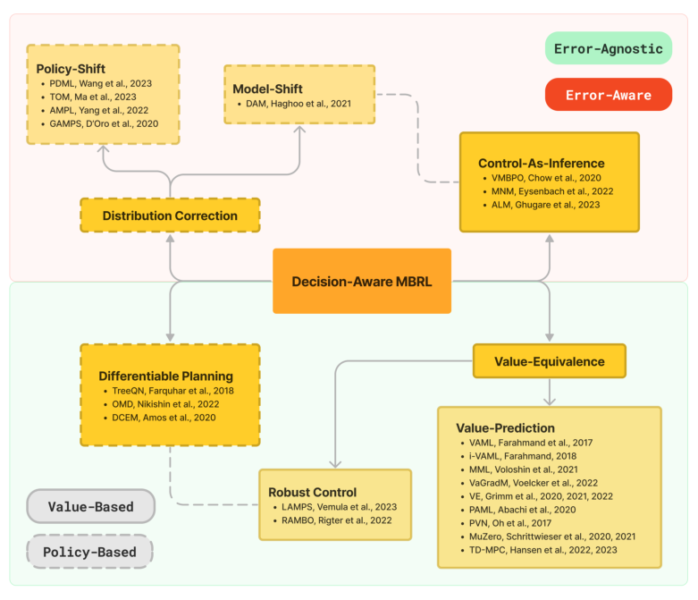
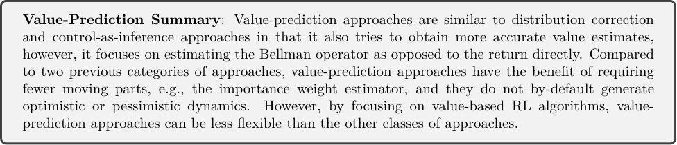
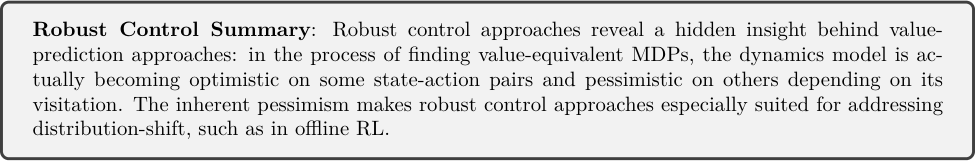

## **A Unified View on Solving Objective Mismatch in Model-** **Based Reinforcement Learning**

**Ran Wei** _[∗]_ _rw422@tamu.edu_
_VERSES Research Lab_

**Nathan Lambert** _nathanl@allenai.org_
_Allen Institute for AI_

**Anthony McDonald** _admcdonald@wisc.edu_
_University of Wisconsin-Madison_

**Alfredo Garcia** _alfredo.garcia@tamu.edu_
_Texas A&M University_

**Roberto Calandra** _roberto.calandra@tu-dresden.de_

_TU Dresden_

**Abstract**

Model-based Reinforcement Learning (MBRL) aims to make agents more sample-efficient,
adaptive, and explainable by learning an explicit model of the environment. While the capabilities of MBRL agents have significantly improved in recent years, how to best learn the
model is still an unresolved question. The majority of MBRL algorithms aim at training
the model to make accurate predictions about the environment and subsequently using the
model to determine the most rewarding actions. However, recent research has shown that
model predictive accuracy is often not correlated with action quality, tracing the root cause
to the _objective mismatch_ between accurate dynamics model learning and policy optimization of rewards. A number of interrelated solution categories to the objective mismatch
problem have emerged as MBRL continues to mature as a research area. In this work, we
provide an in-depth survey of these solution categories and propose a taxonomy to foster
future research.

**1** **Introduction**

Reinforcement learning (RL) has demonstrated itself as a promising tool for complex optimization landscapes
and the creation of artificial agents by exceeding human performance in games (Mnih et al., 2015; Silver et al.,
2016), discovering computer algorithms (Fawzi et al., 2022), managing power plants (Degrave et al., 2022),
and numerous other tasks. The premise of RL is that complex agent behavior and decisions are driven
by a desire to maximize cumulative rewards in dynamic environments (Silver et al., 2021). RL methods
focus on learning a reward-optimal policy from sequences of state-action-reward tuples. These methods can
be broadly classified as model-free RL (MFRL) and model-based RL (MBRL). MFRL methods directly
learn the policy from the environment samples, whereas MBRL approaches learn an explicit model of the
environment and use the model in the policy-learning process. MBRL methods are advantageous because
they can make deep RL agents more sample-efficient, adaptive, and explainable. Prior work has shown that
MBRL methods allow agents to plan with respect to variable goals or diverse environments (Zhang et al.,
2018; Hafner et al., 2023) and that designers can introspect an agent’s decisions (van der Waa et al., 2018),
which can help in identifying potential causes for failures (Räuker et al., 2023).

_∗_ Work done at Texas A&M University

1

Despite the benefits of MBRL, there is considerable divergence in existing algorithms and no consensus on
the aspects of the environment to model and how the model should be learned (e.g., model architecture,
data arrangement, objective functions). For example, Dyna-style MBRL algorithms are trained to make
accurate predictions about the environment, then find the optimal actions or policy with respect to the
trained model (Sutton & Barto, 2018). The intuition behind these approaches is that improving the model’s
accuracy in predicting environment dynamics should facilitate better action selection and improved algorithm
performance. However, recent research found that improved model accuracy often does not correlate with
higher achieved returns (Lambert et al., 2020). While the underperformance of policies trained on the learned
models is often due to the models’ inability to sufficiently capture environment dynamics and the policies
exploiting errors in the models (Jafferjee et al., 2020), Lambert et al. (2020) attributed the root cause of this
phenomenon to the _objective mismatch_ between model learning and policy optimization: while the policy is
trained to maximize return, the model is trained for a different objective and not aware of its role in the
policy decision-making process. This objective mismatch problem represents a substantial and fundamental
limitation of MBRL algorithms, and resolving it will likely lead to enhanced agent capabilities.

In this review, we study existing literature and provide a unifying view of different solutions to the objective mismatch problem. Our main contribution is a taxonomy of four categories of decision-aware MBRL
approaches: _Distribution Correction, Control-As-Inference, Value-Equivalence, and Differentiable Planning_,
which derive modifications to the model learning, policy optimization, or both processes for the purpose of
aligning model and policy objectives and gaining better performance (e.g., achieving higher returns). For
each approach, we discuss its intuition, implementation, and evaluations, as well as implications for agent
behavior and applications. This review is complementary to prior broader introductions of MBRL (e.g.,
see Moerland et al. (2023); Luo et al. (2022)) in its in-depth analysis of solutions to the objective mismatch
problem and illustrations of implications for MBRL approaches.

**2** **Background**

To facilitate comparisons between the reviewed approaches, we adopt the common notation and premise
for MBRL based on (Sutton & Barto, 2018). In the subsequent sections, we introduce Markov Decision
Processes, reinforcement learning, and the objective mismatch problem.

**2.1** **Markov Decision Process**

We consider reinforcement learning in Markov Decision Processes (MDP) defined by tuple ( _S, A, M, R, µ, γ_ ),
where _S_ is the set of states, _A_ is the set of actions, _M_ : _S×A →_ ∆( _S_ ) is the environment transition probability
function (also known as the dynamics model), _R_ : _S × A →_ R is the reward function, _µ_ : _S →_ ∆( _S_ ) is the
initial state distribution, and _γ ∈_ [0 _,_ 1) is the discount factor. The RL agent interacts with the environment
using a policy _π_ : _S →_ ∆( _A_ ) and generates trajectories _τ_ = ( _s_ 0: _T, a_ 0: _T_ ) distributed according to _P_ ( _τ_ ) and
evaluated by discounted cumulative rewards (also known as the return) _R_ ( _τ_ ). _P_ ( _τ_ ) and _R_ ( _τ_ ) are defined
respectively as:

_T_
� _γ_ _[t]_ _R_ ( _st, at_ ) _._ (1)

_t_ =0

_P_ ( _τ_ ) = _µ_ ( _s_ 0)

_T_
� _M_ ( _st_ +1 _|st, at_ ) _π_ ( _at|st_ ) _,_ _R_ ( _τ_ ) =

_t_ =0

Abusing notation, we also use _P_ ( _τ_ ) and _R_ ( _τ_ ) to refer respectively to the probability measure and discounted
reward for infinite horizon sequences _τ_ = ( _s_ 0: _∞, a_ 0: _∞_ ). We further denote the marginal state-action density
of policy _π_ in the environment _M_ (also known as the normalized occupancy measure) as _d_ _[π]_ _M_ [(] _[s, a]_ [) = (1] _[ −]_
_γ_ )E _P_ ( _τ_ )[ [�] _[∞]_ _t_ =0 _[γ][t]_ [ Pr(] _[s][t]_ [ =] _[ s, a][t]_ [ =] _[ a]_ [)].]

**2.2** **Reinforcement Learning**

The goal of the RL agent is to find a policy that maximizes the expected return _JM_ ( _π_ ) in the environment
with dynamics _M_, where _JM_ ( _π_ ) is defined as:

_JM_ ( _π_ ) = E _P_ ( _τ_ )[ _R_ ( _τ_ )] _._ (2)

2

**Algorithm 1** Basic algorithm of model-based reinforcement learning

**Require:** Environment, dynamics model _M_ [ˆ], policy _π_, data buffer _D_, time budget _T_
**while** _t ≤_ _T_ **do**

Interact with the environment and collect data _D ←D ∪_ ( _s, a, r, s_ _[′]_ )
Update model _M_ [ˆ]
Update policy _π_
**end while**

Importantly, the agent does not know the true environment dynamics and has to solve (2) without this
knowledge. We assume the reward function is known.

(2) is often solved by estimating the state value function _V_ ( _s_ ) and state-action value function _Q_ ( _s, a_ ) of the
optimal policy using the Bellman equations:

_Q_ ( _s, a_ ) = _R_ ( _s, a_ ) + _γ_ E _s′∼P_ ( _·|s,a_ )[ _V_ ( _s_ _[′]_ )] _,_

_V_ ( _s_ ) = max _a∈A_ _[Q]_ [(] _[s, a]_ [)] _[ .]_ (3)

Then the optimal policy can be constructed by taking actions according to:

_π_ ( _a|s_ ) _∈_ arg max _a∈A_ _[Q]_ [(] _[s, a]_ [)] _[ .]_ (4)

Variations to (3) and (4) exist depending on the problem at hand. For example, in continuous action space,
the maximum over action is typically found approximately using gradient descent (Lillicrap et al., 2015;
Schulman et al., 2017a). Policy iteration algorithms estimate the value of the current policy by defining
_V_ ( _s_ ) = E _a∼π_ ( _·|s_ )[ _Q_ ( _s, a_ )] and improve upon the current policy. We refer to the process of finding the optimal
policy for an MDP, including these variations, as _policy optimization_ .

In model-free RL, the expectation in (3) is estimated using samples from the environment. Model-based RL
instead learns a model _M_ [ˆ] and estimates the value function using samples from the model (often combined
with environment samples). These algorithms alternate between data collection in the environment, updating
the model, and improving the policy (see Algorithm 1). We will be mostly concerned with forward dynamics
model of the form _M_ [ˆ] ( _s_ _[′]_ _|s, a_ ), although other types of dynamics models such as inverse dynamics models,
can also be used (Chelu et al., 2020).

We use _Q_ _[π]_ _M_ [(] _[s, a]_ [) and] _[ V][ π]_ _M_ [(] _[s]_ [) to distinguish value functions associated with different policies and dynamics.]
When it is clear from context, we drop _M_ and _π_ to refer to value functions of the optimal policy with respect
to the _learned_ dynamics model, since all reviewed methods are model-based. We treat all value functions as
estimates since the true value functions can not be obtained directly.

**2.3** **Model Learning and Objective Mismatch**

Many MBRL algorithms train the model _M_ [ˆ] to make accurate predictions of environment transitions. This
is usually done via maximum likelihood estimation (MLE):

max _M_ ˆ E( _s,a,s′_ ) _∼D_ �log _M_ [ˆ] ( _s_ _[′]_ _|s, a_ )� _._ (MLE 5)

This choice is justified by the well-known simulation lemma (Kearns & Singh, 2002), which has been further
refined in recent state-of-the-art MBRL algorithms to account for off-policy learning:

_R_ **Theorem 2.1.** _max_ _and_ _dynamics (Lemma 3 in (Xu et al., 2020)) Given an MDP with bounded reward:M_ _,_ _a_ _data-collecting_ _behavior_ _policy_ _πb,_ _and_ _a_ _learned_ max _models,a |RM_ (ˆ _s, a_ ) _with|_ =
E( _s,a_ ) _∼dπbM_ _[D][KL]_ [[] _[M]_ [(] _[·|][s, a]_ [)] _[||]_ _M_ [ ˆ] ( _·|s, a_ )] _≤_ _ϵM_ ˆ _[,]_ _for_ _arbitrary_ _policy π_ _with_ _bounded_ _divergence_ _ϵπ_ _≥_
max _s DKL_ [ _π_ ( _·|s_ ) _||πb_ ( _·|s_ )] _, the policy evaluation error is bounded by:_

_√_
_|JM_ ˆ [(] _[π]_ [)] _[ −]_ _[J][M]_ [(] _[π]_ [)] _[| ≤]_

2 _γR_ max
_√_ ~~_ϵ_~~ _π ._ (6)
(1 _−_ _γ_ ) [2]

2 _γR_ max _√_
_√_ ~~_ϵ_~~ _M_ ˆ [+ 2]
(1 _−_ _γ_ ) [2] (1

3

Thus, one way to reduce the policy evaluation error of the optimizing policy _π_ is to make the model as
accurate as possible in state-action space visited by the behavior policy while maintaining small policy
divergence. There are two issues with this approach. First, unlike the tabular setting, the dynamics error
might not reduce to zero even with infinite data in complex, high dimensional environments due to limited
model capacity or model misspecification. Second, maintaining small policy divergence in the second term
requires knowledge of the behavior policy in all states and additional techniques for constrained policy
optimization. The former requirement can be demanding with an evolving behavior policy as in most online
RL settings, or with an unknown behavior policy as in most offline RL settings, and the latter requirement
can be undesirable since the goal in most RL settings is to quickly improve upon the behavior policy.

Towards better understanding of model learning and policy performance, Lambert et al. (2020) found that
model predictive accuracy is often not correlated with the achieved returns. They attributed the root cause
of this finding to the fact that, in the common practice, the model learning objective (i.e., maximizing likelihood) is different from the policy optimization objective (i.e., maximizing return) and they coined the term
"objective mismatch" to refer to this phenomenon. One of the main manifestations of objective mismatch
is that the dynamics model learned by one-step prediction can be inaccurate for long-horizon rollouts due
to compounding error (Lambert et al., 2022). These inaccuracies can then be exploited during policy optimization (Jafferjee et al., 2020). Various methods have been proposed to improve the dynamics model’s
long-horizon prediction performance or avoid exploitation by the policy, for example by using multistep objectives (Luo et al., 2018), training the model to self-correct (Talvitie, 2017), directly predicting the marginal
density (Janner et al., 2020), training a model with different temporal abstractions (Lambert et al., 2021),
or quantifying epistemic uncertainty in the model (Chua et al., 2018).

Nevertheless, the relationship between model learning and policy optimization has been found to be highly
nuanced. There also exist studies highlighting the diminishing contribution of model accuracy to policy performance (Palenicek et al., 2023). From a Bayesian RL perspective, model learning from one-step transitions
is theoretically optimal as it provides the sufficient statistics for both model learning and policy optimization
(Duff, 2002; Ghavamzadeh et al., 2015). However, the optimal Bayesian RL policy has to account for the
uncertainty in the dynamics model parameters and maintaining such uncertainty is generally intractable.
Thus, the complex interaction between model learning and policy optimization and efficient methods to
bridge these misaligned objectives remains a substantial research gap.

**2.4** **Towards Decision-Aware MBRL**

Overcoming the objective mismatch problem has important implications for safe and data-efficient RL. In
domains where environment interaction is expensive or unsafe, off-policy or offline RL are used to extract
optimal policies from a limited dataset (Levine et al., 2020). In offline MBRL, the dynamics model is typically
fixed after an initial pretraining stage and other methods are required to prevent model-exploitation from
the policy, such as by designing pessimistic penalties (Yu et al., 2020b; Kidambi et al., 2020). Decision-aware
MBRL has the potential to simplify or remove the design of these post hoc methods.

Beyond data-efficiency and safety, decision-aware MBRL can potentially address the gaps in current automated decision-making software systems in various domains, such as transportation and health care (McAllister et al., 2022; Wang et al., 2021). These systems are traditionally developed and tested in a modular
fashion. For example, in automated vehicles, the trajectory forecaster is typically developed independently
of the vehicle controller. As a result, modules which pass the unit test may still fail the integration test.

Thus, the core motivation for solving the objective mismatch problem is to improve MBRL agent capabilities
and downstream performance by designing model learning objectives that are aware of its role in or directly
contribute to policy optimization, policy objectives that are aware of model deficiencies, or unified objectives
that contribute to both (Lambert et al., 2020). It is therefore desirable if guiding principles can be identified to
facilitate the design of future objectives. The goal of this survey is to identify these principles by synthesizing
existing literature.

4

**3** **Survey Scope and Related Work**

The focus of this survey is on existing approaches that address the objective mismatch problem in MBRL.
We identified these approaches by conducting a literature search of the terms "objective mismatch," "modelbased," and "reinforcement learning" and their permutations on Google Scholar and Web of Science. We
compounded these searches by examining articles citing (Lambert et al., 2020) and their reference lists. We
focused on (Lambert et al., 2020) because it was the first work to coin the term "objective mismatch" and
the reference tree rooted at this paper led us to valuable older works that did not used this term. The initial
search yielded 85 results which were screened for relevance. To be included in the survey, an article has
to specifically address a solution to the objective mismatch problem or propose decision-aware objectives
for model learning and policy optimization. Articles that simply discussed the objective mismatch problem
without providing a solution were excluded. After abstract and full text screening, we retained a total of 46
papers [1] .

Before presenting the included papers, we briefly cover related research areas that are deemed out-of-scope by
our screening criteria in a non-exhaustive manner; these include state abstraction, representation learning,
control-aware dynamics learning, decision-focused learning, and meta reinforcement learning.

MDP state abstraction focuses on aggregating raw state features while preserving relevant properties of the
dynamics model, policy, or value function (Li et al., 2006; Abel et al., 2020). For example, bisimulation-based
aggregation methods aim to discover models with equivalent transitions and have been applied in the deep RL
setting (Zhang et al., 2020). Recent works on representation learning for control aim to factorize controllable
representations from uncontrollable latent variables using, for example, inverse dynamics modeling (Lamb
et al., 2022). These research directions are related to the objective mismatch problem in that they also
aim to overcome the difficulty of modeling complex and irrelevant observations for control, however, they
are out-of-scope for the current survey because they do not consider the mutual adaptation of model and
policy while learning. Control-aware dynamics learning focus on dynamics model regularization based on
smoothness or stabilizability principles in order to address compounding error in synthesizing classic (e.g.,
LQR) or learned controllers (Levine et al., 2019; Singh et al., 2021; Richards et al., 2023). However, they
do not directly focus on the source of the problem, i.e., misaligned model and policy objectives, and thus
are out-of-scope for the current survey. Objective mismatch is also related to the broad topic on decisionfocused learning, where a model is trained to predict the parameters of an optimization problem, which
is subsequently solved (Wilder et al., 2019; Elmachtoub & Grigas, 2022). Due to the focus on sequential
decision-making problems (i.e., RL), more general work on decision-focused learning is out-of-scope.

Finally, we omit meta RL (Beck et al., 2023) in the survey and the related topics of Bayesian RL
(Ghavamzadeh et al., 2015) and active inference, a Bayesian MBRL approach rooted in neuroscience
(Da Costa et al., 2020; 2023). Meta RL based on the hidden parameter and partially observable MDP
formulations (Doshi-Velez & Konidaris, 2016; Duff, 2002) has a particularly strong connection with decisionaware MBRL in that the policy is aware of the error, or rather uncertainty, in the dynamics model parameters
and predictions by virtue of planning in the belief or hyper-state space. However, these approaches often focus on obtaining Bayes-optimal exploration strategies using standard or approximate Bayesian learning and
belief-space planning algorithms as opposed to developing novel model and policy objectives (Zintgraf et al.,
2019). We also side-step the open question on unified objectives in active inference (Millidge et al., 2021;
Imohiosen et al., 2020) but discuss potential connections between active inference and control-as-inference
(Levine, 2018; Millidge et al., 2020) in section 4.2.

**4** **Taxonomy**

Our synthesis of the 46 papers identified 4 broad categories of approaches to solving the objective mismatch
problem. We consolidated these into the following taxonomy of decision-aware MBRL:

  - **Distribution Correction** adjusts for the mismatched training data in both model learning and
policy optimization.

1The full list of papers can be found at `[https://github.com/ran-weii/objective_mismatch_papers](https://github.com/ran-weii/objective_mismatch_papers)` .

5

Figure 1: Schematic of the relationships between the core surveyed decision-aware MBRL approaches. Direct relationships are shown in solid arrows. Indirect relationships are shown in dashed connections. The
algorithms in each category are sorted by the order in which they are presented in the paper.

  - **Control-As-Inference** provides guidance for the design of model learning and policy optimization
objectives by formulating both under a single probabilistic inference problem.

  - **Value-Equivalence** searches for models that are equivalent to the true environment dynamics in
terms of value function estimation.

  - **Differentiable Planning** embeds the model-based policy optimization process in a differentiable
program such that both the policy and the model can be optimized towards the same objective.

A schematic of the relationships between these approaches is shown in Figure 1. The figure illustrates that
Value-Equivalence approaches are the most prevalent in the literature, however, more recent approaches
have concentrated on distribution correction and control-as-inference. The remaining sections discuss these
approaches with a focus on their model learning and policy optimization objectives. Comparisons of the
design and evaluations of the core reviewed algorithms are provided in Table 1 and Table 2, respectively.

**4.1** **Distribution Correction**

Distribution correction aims to correct for training errors attributable to policy optimization on samples not
from the true environment (model-shift) or to samples from an outdated or different policy (policy-shift).
Our literature search identified one approach focused on addressing model-shift and four approaches focused
on policy-shift.

6

**4.1.1** **Addressing Model-Shift**

Haghgoo et al. (2021) proposed to address model-shift by using the learned model as the proposal distribution
for an importance sampling estimator of the expected return in the true environment as defined in (7):

E _P_ ( _τ_ )[ _R_ ( _τ_ )] = E _Q_ ( _τ_ ) _P_ ( _τ_ ) = E _Q_ ( _τ_ )[ _w_ ( _τ_ ) _R_ ( _τ_ )] _._ (7)

� _Q_ ( _τ_ ) _[R]_ [(] _[τ]_ [)] �

where _P_ ( _τ_ ) is the trajectory distribution in the true environment, _Q_ ( _τ_ ) = _µ_ ( _s_ 0) [�] _[∞]_ _t_ =0 _M_ [ˆ] ( _st_ +1 _|st, at_ ) _π_ ( _at|st_ ) is
the trajectory distribution induced by the learned model _M_ [ˆ] (known as the proposal distribution in importance
sampling), and _w_ ( _τ_ ) is the importance weight. Since importance sampling is agnostic to the proposal
distribution (i.e., _Q_ ( _τ_ )), this method can be applied to models trained using any objectives.

Given that both _P_ ( _τ_ ) and _Q_ ( _τ_ ) correspond to the MDP structure, the importance weight can be decomposed
over time steps as:

_t−_ 1
� _w_ ( _sm, am, sm_ +1) _._ (8)

_m_ =0

_w_ ( _s_ 0: _t, a_ 0: _t_ ) =

_t−_ 1
�

_m_ =0

_MM_ ˆ (( _ssmm_ +1+1 _||ssmm, a, amm_ )) =

Although not directly available, the per-time step importance weight _w_ ( _sm, am, sm_ +1) can be obtained using
density ratio estimation through binary classification, similar to Generative Adversarial Networks (Sugiyama
et al., 2012; Goodfellow et al., 2020). The policy is then optimized with respect to the importance-weighted
reward. Thus, the authors refer to this method as Discriminator Augmented MBRL (DAM).

To address the possibility that the estimator can have high variance for long trajectories due to multiplying
the importance weights, the authors proposed to optimize towards a model that achieves the lowest variance
for the estimator, which is shown in (Goodfellow et al., 2016) to have the following form:

_Q_ _[∗]_ ( _τ_ ) _∝_ _P_ ( _τ_ ) _R_ ( _τ_ ) _._ (9)

Such a model can be found by minimizing _DKL_ [ _Q_ _[∗]_ ( _τ_ ) _||Q_ ( _τ_ )], resulting in a return-weighted model training
objective. DAM’s model learning and policy optimization objectives are thus defined as follows:

�

maxˆ E _P_ ( _τ_ )
_M_

max _π_ E _Q_ ( _τ_ )

_∞_
�
� _t_ =0

_∞_
�
� _t_ =0

� _R_ ( _τ_ ) log _M_ [ˆ] ( _st_ +1 _|st, at_ )

_t_ =0

_∞_ _t_
� _γ_ _[t]_ �

_t_ =0 � _m_

� _w_ ( _sm, am, sm_ +1)

_m_ =0

_,_

�

_R_ ( _st, at_ )

�

(DAM 10)

_._

The authors showed that DAM outperforms the standard Dyna MBRL algorithm with a MLE model objective
in custom driving environments with multi-modal environment dynamics. They further found that including
the importance weights in the policy objective is crucial for its superior performance.

**4.1.2** **Addressing Policy-Shift**

Rather than focusing on model-shift, the policy-shift approaches address objective mismatch by re-weighting
the model training data such that samples less relevant or collected far away from the current policy’s
marginal state-action distribution are down-weighted.

Model training data in MBRL is typically collected by policies different from the current policy due to
continuous policy updating. Wang et al. (2023) found that when training the model to make accurate
predictions on all data, the model produces more error on the most recent data compared to its overall
performance. To this end, they propose an algorithm called Policy-adapted Dynamics Model Learning
(PDML) which stores all historical policies and uses an estimate of the divergence between the data-collecting
policy and the current policy to weight data samples for MLE model training.

7

In line with Wang et al. (2023) to address inferior model predictions on updated policies, Ma et al. (2023)
proposed a weighted model training scheme motivated by the following lower bound of the log-transformed
expected return:

log _JM_ ( _π_ ) = log E _d_ _[π]_ _M_ [(] _[s,a,s][′]_ [)][[] _[R]_ [(] _[s, a]_ [)]]

= log E _d_ _[π]_ ˆ
_M_ [(] _[s,a,s][′]_ [)]

_d_ _[π]_ _M_ [(] _[s][,][ a][,][ s][′]_ [)]

_d_ _[π]_ ˆ
� _M_ [(] _[s, a, s][′]_ [)] _[R]_ [(] _[s, a]_ [)] �

�

(11)

_≥_ E _d_ _[π]_ _M_ ˆ [(] _[s,a,s][′]_ [)]

�

log _[d]_ _M_ _[π]_ [(] _[s][,][ a][,][ s][′]_ [)]
_d_ _[π]_ ˆ
_M_ [(] _[s, a, s][′]_ [) + log] _[ R]_ [(] _[s, a]_ [)] �

_≥−Df_ [ _d_ _[π]_ _M_ ˆ [(] _[s, a, s][′]_ [)] _[||][d]_ _M_ _[π]_ [(] _[s, a, s][′]_ [)] +][ E] _d_ _[π]_ _M_ ˆ [(] _[s,a,s][′]_ [)][[log] _[ R]_ [(] _[s, a]_ [)]] _[,]_

where _d_ _[π]_ _M_ [(] _[s, a, s][′]_ [) = (1] _[ −]_ _[γ]_ [)][E][[][�] _[∞]_ _t_ =0 _[γ][t]_ [ Pr(] _[s][t]_ [ =] _[ s, a][t]_ [ =] _[ a, s][t]_ [+1][ =] _[ s][′]_ [)] denotes the normalized occupancy]
measure for transitions ( _s, a, s_ _[′]_ ), and _Df_ denotes a chosen _f_ -divergence measure. The first term in the
lower bound suggests that the learned dynamics model should induce similar transition occupancy to the
true environment under the current policy. To this end, the authors proposed the Transition Occupancy
Matching (TOM) algorithm to optimize the first term while alternating with optimizing the second term
using model-based policy optimization (MBPO) (Janner et al., 2019).

Although one could optimize the first term by simulating _π_ in _M_ ˆ, such an approach requires repeated
simulation for each dynamics model update and fails to leverage data collected by the behavior policy.
Instead, the authors proposed using dual RL techniques to minimize _Df_ with respect to _d_ _[π]_ _M_ ˆ [where a dual]
value function _Q_ [˜] ( _s, a_ ) is introduced to penalize _d_ _[π]_ _M_ ˆ [from violating the Bellman flow constraint] (Nachum
& Dai, 2020). Upon obtaining the optimal dual value function _Q_ [˜] _[∗]_ ( _s, a_ ), which can be estimated from the
collected data, the dual RL formulation yields the following importance weight estimator for finding the
optimal transition occupancy-matching dynamics using weighted MLE:

_d_ _[π]_ ˆ
_M_ [(] _[s, a, s][′]_ [)]
_w_ TOM( _s, a, s_ _[′]_ ) = _⋆_

_d_ ~~_[π]_~~ _M_ _[b]_ [(] _[s, a, s][′]_ [) =] _[ f][ ′]_

log _[d]_ _M_ _[π]_ [(] _[s][,][ a][,][ s][′]_ [)] _,_ (12)
� _d_ ~~_[π]_~~ _M_ _[b]_ [(] _[s, a, s][′]_ [) +] _[ γ]_ [E] _[π]_ [(] _[a][′][|][s][′]_ [)][[ ˜] _[Q][∗]_ [(] _[s][′][, a][′]_ [)]] _[ −]_ _[Q]_ [˜] _[∗]_ [(] _[s, a]_ [)] �

where the log density ratio on the right hand side is estimated using a discriminator and _f⋆_ _[′]_ [is the derivative of]
the Fenchel conjugate of the chosen _f_ -divergence function. The resulting TOM model and policy objectives
are as follows:

max _M_ ˆ E( _s,a,s′_ ) _∼D_ � _w_ TOM( _s, a, s_ _[′]_ ) log _M_ [ˆ] ( _s_ _[′]_ _|s, a_ )� _,_ (TOM 13)

max _π_ E( _s,a_ ) _∼d_ _[π]_ _M_ ˆ [[log] _[ R]_ [(] _[s, a]_ [)]] _[ .]_

Empirically, the authors showed that TOM correctly assigns higher importance weights _w_ to transition
samples more similar to the current policy and that TOM is more sample efficient and achieves higher
asymptotic performance in MuJoCo environments (Todorov et al., 2012) than MBPO and PDML which uses
heuristic policy divergence based weighting. The authors also compared TOM with VaGradM (a different
class of decision-aware MBRL algorithm reviewed in section 4.3.1) and found TOM performs significantly
better except for one environment.

In contrast to the above online RL approaches, Yang et al. (2022) addressed the offline RL setting and
proposed the Alternating Model and Policy Learning (AMPL) algorithm to optimize the following lower
bound of the expected return:

_JM_ _[π]_ _[≥]_ _[J]_ _M_ _[π]_ ˆ _[−|][J]_ _M_ _[π]_ _[−]_ _[J]_ _M_ _[π]_ ˆ _[|]_

_γRmax_
_≥_ _JM_ _[π]_ ˆ _[−]_
~~_√_~~ 2(1 _−_ _γ_ )

�

(14)
_Dπ_ ( _M,_ _M_ [ˆ] ) _,_

where the divergence in the second term which characterizes policy-shift is defined as:

_Dπ_ ( _M,_ _M_ [ˆ] ) = E( _s,a_ ) _∼dπbM_

_w_ AMPL( _s, a_ ) _DKL_ [ _M_ ( _s_ _[′]_ _|s, a_ ) _πb_ ( _a_ _[′]_ _|s_ _[′]_ ) _||M_ [ˆ] ( _s_ _[′]_ _|s, a_ ) _π_ ( _a_ _[′]_ _|s_ _[′]_ )] (15)
� �

8

_d_ _[π]_ _M_ [(] _[s][,][a]_ [)]
and _w_ AMPL( _s, a_ ) = _d_ ~~_π_~~ _Mb_ [(] _[s,a]_ [)] [is the marginal state-action density ratio between the current policy and the]
behavior policy.

Similar to TOM, the bound in (14) suggests MLE dynamics model learning weighted by _w_ AMPL( _s, a_ ). However, for policy training, (14) suggests not only maximizing reward but also minimizing the divergence so
that the evaluation error in the second term is controlled for. Instead of using dual-RL techniques to estimate
_w_ as in TOM, the authors proposed a novel fixed point estimator. They further approximated _Dπ_ ( _M,_ _M_ [ˆ] )
for policy optimization using the output of a discriminator: log(1 _−_ _C_ ( _s, a_ )). The APML model and policy
objectives are thus defined as follows:

maxˆ E( _s,a,s′_ ) _∼D_ [ _w_ AMPL( _s, a_ ) log _M_ [ˆ] ( _s_ _[′]_ _|s, a_ )] _,_
_M_ (AMPL 16)

max _π_ E( _s,a_ ) _∼d_ _[π]_ _M_ ˆ [[] _[R]_ [(] _[s, a]_ [)] _[ −]_ [log(1] _[ −]_ _[C]_ [(] _[s, a]_ [))]] _[ .]_

A similar method was proposed in (Hishinuma & Senda, 2021) which instead estimates the importance
weight using full-trajectory model rollouts.

Empirically, Yang et al. (2022) showed that APML outperforms a number of SOTA model-based and modelfree offline RL algorithms (e.g., MOPO; (Yu et al., 2020b), COMBO (Yu et al., 2021), CQL (Kumar et al.,
2020)) in most D4RL environments (Fu et al., 2020) and that including the importance weight _w_ in the
model objective is crucial for its performance.

Also in the offline RL setting, D’Oro et al. (2020) focused specifically on policy-gradient estimation using
samples from the offline dataset, but the value function is estimated using the learned model (model-value
gradient; MVG). This setup can be advantageous since the model bias is limited to the value estimate but
not the sample-based evaluation of expectation. They proposed the Gradient-Aware Model-based Policy
Search (GAMPS) algorithm which trains the model to minimize the following bound on the difference from
the true policy-gradient:

_√_ 2 _ZRmax_
_∥∇πJM_ ( _π_ ) _−∇πJ_ [MVG] ( _π_ ) _∥≤_ _[γ]_

(1 _−_ _γ_ ) [2]

�

E( _s,a_ ) _∼ηP_ _[π]_ _[D][KL]_ [[] _[M]_ [(] _[·|][s, a]_ [)] _[||]_ _M_ [ ˆ] ( _·|s, a_ )] _,_ (17)

where _Z_ is a constant and _ηP_ _[π]_ [is a state-action density weighted by the policy-gradient norm. This suggests]
a model training objective where samples with higher policy-gradient norms are up-weighted.

The GAMPS model and policy objectives are defined as follows:

log _M_ [ˆ] ( _st_ +1 _|st, at_ )

�

(GAMPS 18)

�

_t_
�

�

max _M_ ˆ E _τ_ _∼D_

max E _τ_ _∼D_
_π_

_∞_
�
� _t_ =0

_∞_
�
� _t_ =0

_∞_ _t_
� _γ_ _[t]_ �

_t_ =0 � _m_ =0

_∞_ _t_
� _γ_ _[t]_ �

_t_ =0 � _m_ =0

_,_

_m_ =0

� _∥∇_ log _π_ ( _al|sl_ ) _∥_

_l_ =0

_Q_ ( _st, at_ ) log _π_ ( _at|st_ )

�

_._

_m_ =0

_π_ ( _at|st_ )
_πb_ ( _at|st_ )

_π_ ( _at|st_ )
_πb_ ( _at|st_ )

Empirically, the authors first used a diagnostic gridworld environment to show that GAMPS can accurately
estimate policy gradients with a constrained dynamics model class which conditions only on actions but not
on states. On two MuJoCo tasks, they showed that GAMPS achieved higher asymptotic performance than
MLE model learning and two classical model-free RL algorithms adapted to the offline setting.

9

**4.2** **Control-As-Inference**

Besides the distribution correction approaches, other methods have attempted to leverage existing validated
approaches to solve the objective mismatch problem. One such principled approach is to leverage the controlas-inference framework (Levine, 2018) and formulate both model learning and policy optimization as a single
probabilistic inference problem.

The core concept of control-as-inference is that optimal control can be formulated as a probabilistic inference
problem if we assume optimal behavior were to be observed in the future and compute a posterior distribution
over the unknown actions that led to such behavior. Most control-as-inference methods define optimality
using a binary variable _O_ where the probability that an observed state-action pair is optimal ( _O_ = 1) is
defined as follows:

_P_ ( _Ot_ = 1 _|st, at_ ) = exp( _R_ ( _st, at_ )) _._ (19)

The posterior, represented as a variational distribution _Q_ ( _τ_ ), is found by maximizing the lower bound of the
marginal likelihood of optimal trajectories as follows:

log _P_ ( _O_ 0: _∞_ = 1) = log _P_ ( _O_ 0: _∞, τ_ )
� _τ_

= log E _P_ ( _τ_ )[ _P_ ( _O_ 0: _∞_ = 1 _|τ_ )]

_∞_
�
� _t_ =0

��

(20)

= log E _P_ ( _τ_ )

exp

�

� _R_ ( _st, at_ )

_t_ =0

�

_−_ _DKL_ [ _Q_ ( _τ_ ) _||P_ ( _τ_ )] _._

_≥_ E _Q_ ( _τ_ )

_∞_
�
� _t_ =0

� _R_ ( _st, at_ )

_t_ =0

The prior _P_ ( _τ_ ) is usually defined using the structure of the MDP:

_P_ ( _τ_ ) = _µ_ ( _s_ 0)

_∞_
� _M_ ( _st_ +1 _|st, at_ ) _P_ ( _at|st_ ) _,_ (21)

_t_ =0

where _P_ ( _a|s_ ) is a prior or default policy usually set to a uniform distribution.

Most of the design decisions in control-as-inference are incorporated in defining the variational distribution
_Q_ ( _τ_ ). Prior control-as-inference approaches, such as the ones reviewed in (Levine, 2018), define _Q_ ( _τ_ ) using
the environment dynamics and do not incorporate a learned model in the formulation. Thus, the majority
of those algorithms are model-free.

In contrast to those approaches, Chow et al. (2020) proposed a joint model learning and policy optimization
algorithm under the control-as-inference framework called Variational Model-Based Policy Optimization
(VMBPO) by incorporating the learned dynamics model in the variational distribution defined as follow:

_Q_ ( _τ_ ) = _µ_ ( _s_ 0)

_∞_
� _M_ ˆ ( _st_ +1 _|st, at_ ) _π_ ( _at|st_ ) _._ (22)

_t_ =0

Although _Q_ ( _τ_ ) has the same structure as the proposal distribution in the importance sampling-based algorithm DAM (see (7)), the model learning and policy optimization objectives of VMBPO are derived from a
single marginal likelihood lower bound defined as:

_∞_
�
� _t_ =0

maxˆ E _Q_ ( _τ_ )
_M,π_

� _t_ =0 _γ_ _[t]_ � _R_ ( _st, at_ ) + log _[P]_ _π_ ( [(] _a_ _[a]_ _t_ _[t]_ _|_ _[|]_ _s_ _[s]_ _t_ _[t]_ ) [)]

_[P]_ [(] _[a][t][|][s][t]_ [)] ˆ

_π_ ( _at|st_ ) [+ log] _[ M]_ _M_ [(] ( _[s]_ _s_ _[t]_ _t_ [+1] _[|]_ _|_ _[s]_ _s_ _[t]_ _t_ _[,]_ _, a_ _[ a][t]_ _t_ [)] )

_M_ ˆ ( _st_ +1 _|st, at_ )

� [�]

_._ (VMBPO 23)

Defining a Bellman-like recursive equation based on (23):

_Q_ ( _s, a_ ) = _R_ ( _st, at_ ) + log _[P]_ _π_ ( [(] _a_ _[a]_ _|_ _[|]_ _s_ _[s]_ ) [)] [+][ E] _M_ [ ˆ] ( _s_ _[′]_ _|s,a_ )

10

_V_ ( _s_ _[′]_ ) + log _[M]_ ˆ [(] _[s][′][|][s][,][ a]_ [)]
� _M_ ( _s_ _[′]_ _|s, a_ )

_._ (24)
�

The authors showed that the optimal variational dynamics and policy have the following form:

_M_ ˆ ( _s_ _[′]_ _|s, a_ ) _∝_ exp( _V_ ( _s_ _[′]_ ) + log _M_ ( _s_ _[′]_ _|s, a_ )) _,_

(25)
_π_ ( _a|s_ ) _∝_ exp( _Q_ ( _s, a_ ) + log _P_ ( _a|s_ )) _._

Similar to DAM, the authors used a discriminator to estimate the dynamics density ratio.

Interestingly, the optimal dynamics are encouraged to be not only similar to the true dynamics via the log
likelihood term, but also have a higher tendency to sample high value states. Such an optimistic dynamics
model is similar to that of DAM, albeit for a different reason that the dynamics is conditioned on the optimality variable while performing variational inference. Also similar to DAM’s importance weight-augmented
reward, the policy optimizes not only reward but also the negative log density ratio between the learned
and the ground truth dynamics. This encourages the policy to visit states where the learned dynamics is
accurate (lower cross entropy with the ground truth dynamics) and also states where the learned dynamics
is uncertain (higher entropy).

Empirically, the authors showed that VMBPO outperforms SOTA model-based (e.g., MBPO) and model-free
baselines (e.g., SAC (Haarnoja et al., 2018)) in six MuJoCo environments for a range of policy learning rate
settings. However, they did not evaluate specific agent properties discussed in the previous paragraph.

While Chow et al. (2020) was the first to propose a unified decision-aware objective for model learning and
policy optimization, Eysenbach et al. (2022) pointed out that the objective (23) is an upper-bound on the
RL objective, which can be decomposed as the expected return and its variance, and thus undesirable. They
instead proposed an algorithm called Mismatched-No-More (MNM) with an alternative optimality variable
whose distribution is conditioned on trajectories instead of state-action pairs:

_P_ ( _O_ = 1 _|τ_ ) = _R_ ( _τ_ ) =

_∞_
� _γ_ _[t]_ _R_ ( _st, at_ ) _._ (26)

_t_ =0

Using this definition of the optimality variable, they derived a modified log marginal likelihood lower bound:

log _P_ ( _O_ = 1) = log _P_ ( _O_ = 1 _, τ_ )
� _τ_

= log E _P_ ( _τ_ )[ _P_ ( _O_ = 1 _|τ_ )]

_≥_ E _Q_ ( _τ_ )[log _R_ ( _τ_ ) + log _P_ ( _τ_ ) _−_ log _Q_ ( _τ_ )]

(27)

�

�

_∞_
�

� _γ_ _[t]_ _R_ ( _st, at_ ) + log _P_ ( _τ_ ) _−_ log _Q_ ( _τ_ )

_t_ =0

= E _Q_ ( _τ_ )

_≥_ E _Q_ ( _τ_ )

�

_∞_
�
� _t_ =0

log

� _γ_ _[t]_ log _R_ ( _st, at_ ) + log _P_ ( _τ_ ) _−_ log _Q_ ( _τ_ )

_t_ =0

_._

The benefit of this modification is that it is a lower bound on the RL objective so that improving this bound
guarantees improving upon agent performance.

MNM also optimizes a single objective for both model learning and policy optimization, except that the
reward is log-transformed:

maxˆ E _Q_ ( _τ_ )
_M,π_

_∞_
�
� _t_ =0

� _t_ =0 _γ_ _[t]_ �log _R_ ( _st, at_ ) + log _[P]_ _π_ ( [(] _a_ _[a]_ _t_ _[t]_ _|_ _[|]_ _s_ _[s]_ _t_ _[t]_ ) [)]

_[P]_ [(] _[a][t][|][s][t]_ [)] ˆ

_π_ ( _at|st_ ) [+ log] _[ M]_ _M_ [(] ( _[s]_ _s_ _[t]_ _t_ [+1] _[|]_ _|_ _[s]_ _s_ _[t]_ _t_ _[,]_ _, a_ _[ a][t]_ _t_ [)] )

_M_ ˆ ( _st_ +1 _|st, at_ )

� [�]

_._ (MNM 28)

To evaluate MNM, the authors first showed that in a gridworld goal-reaching environment, MNM solves
the task faster than VMBPO and Q-learning and it is robust to constraints on the dynamics model to
only make low-resolution predictions. On robotic control tasks with contact dynamics and sparse reward
(e.g., door-opening) in MuJoCo, Deepmind Control suite (DMC) (Tassa et al., 2018), Metaworld (Yu et al.,
2020a), and ROBEL (Ahn et al., 2020) environments, MNM frequently outperformed MBPO and SAC by

11

a large margin and it consistently performed well in all tasks. Furthermore, the authors found that MNM’s
model-based value estimates were stable and did not explode towards large values throughout the learning
process, which suggest robustness to model-exploitation. Visualizing the learned dynamics, the authors also
found the MNM dynamics model tends to generate transitions towards high value states, which provides
evidence for the optimistic dynamics to speed up learning.

Extending MNM to the visual RL setting, Ghugare et al. (2022) replaced the state dynamics model with a
latent dynamics model _M_ [ˆ] ( _z_ _[′]_ _|z, a_ ) and an observation encoder _E_ [ˆ] ( _z|s_ ) in an algorithm called Latent Aligned
Model (ALM). By designing the following prior and variational distributions:

_P_ ( _τ_ ) = _µ_ ( _s_ 0)

_∞_
� _M_ ( _st_ +1 _|st, at_ ) _P_ ( _at|zt_ ) _E_ [ˆ] ( _zt|st_ ) _,_ (29)

_t_ =0

_Q_ ( _τ_ ) = _µ_ ( _s_ 0) _E_ ( _z_ 0 _|s_ 0)

_∞_
� _M_ ( _st_ +1 _|st, at_ ) _M_ [ˆ] ( _zt_ +1 _|zt, at_ ) _π_ ( _at|zt_ ) _,_ (30)

_t_ =0

where _π_ ( _a|z_ ) is a latent space policy, the ALM’s model _{M,_ [ˆ] _E_ [ˆ] _}_ and policy jointly optimize the following
objective:

��

maxˆ E _Q_ ( _τ_ )
_M,E,π_ [ˆ]

_∞_
�
� _t_ =0

_∞_
� _γ_ _[t]_

_t_ =0 �

log _R_ ( _st, at_ ) + log _[P]_ [(] _[a][t][|][z][t]_ [)]

_[P]_ [(] _[a][t][|][z][t]_ [)] _E_ ˆˆ( _zt_ +1 _|st_ +1)

_π_ ( _at|zt_ ) [+ log] _M_ ( _zt_ +1 _|zt, at_ )

_._ (ALM 31)

Interestingly, the third term in the augmented reward, which can be estimated using a discriminator similar
to VMBPO and MNM, is the information gain of the latent dynamics model, thus connecting this approach
with prior work on intrinsic motivation and information-theoretic approaches in RL (Eysenbach et al., 2021;
Rakelly et al., 2021; Sun et al., 2011) and the pragmatic-epistemic value decomposition of the expected free
energy objective function for planning in active inference (Millidge, 2020; Sajid et al., 2021; Fountas et al.,
2020).

However, different from VMBPO and MNM’s weighted-regression dynamics model learning objective, the
ALM loss implies a "self-predictive" model learning process (Schwarzer et al., 2020), where the latent dynamics model is trained to predict the encoding of observations (and reward) in the collected dataset and
the encoder is trained to match the predictions of the latent dynamics (similar to Bootstrap Your Own
Latent (Grill et al., 2020)). While theoretical understanding of self-predictive objectives is still lacking, Subramanian et al. (2022) showed that, when reward prediction is also incorporated into the objective function,
the learned latent state _z_ is a sufficient statistic (or information state) for the optimal policy with respect
to the true environment and Tang et al. (2023) proposed that it implicitly performs eigen-decomposition of
the true environment dynamics. Thus, the dynamics model learned by ALM is likely more task-agnostic
than the dynamics models of VMBPO and MNM. This also suggests that decision-aware objectives may not
necessarily need to bias model learning, aligning this method further with active inference.

Empirically, the authors found that ALM significantly outperformed SAC and SAC-SVG (Amos et al.,
2021), a MLE-based MBRL algorithm with latent dynamics, with 2e5 environment steps (1/5 of the usual
RL training steps) in five MuJoCo environments. Using the Q value evaluation protocol from (Chen et al.,
2021) and (Fujimoto et al., 2018), they found ALM value estimates to consistently have negative bias
(underestimation). Similar to MNM, they also found that including the density ratio term in the objective
is crucial.

12

**4.3** **Value-Equivalence**

A core use case of the learned dynamics model is that the agent can sample from it to augment the limited
environment samples for estimating the expected return or value function. Thus, as long as the dynamics
can lead to accurate value estimates, it does not need to model the environment at all. In other words,
the model is free to discover any dynamics that are equivalent to the true dynamics in terms of estimating
value without wasting resources on irrelevant aspects of the environment. This class of approaches focuses
almost entirely on model learning and performs standard model-based policy optimization. In this section,
we first summarize how the literature formulates equivalent dynamics and how identifying such dynamics
can be formulated as a value-prediction problem. We then summarize how such equivalence is related to the
robustness properties of the learned dynamics.

**4.3.1** **Value-Prediction**

The value-prediction approaches propose to directly predict states with accurate values rather than accurate
features. This is desirable if the dynamics model has limited capacity modeling all aspects of the environment
faithfully, for example when using a uni-modal distribution to predict multi-model transitions, but the
model can generate states whose values are close to the ground truth future state values. The models don’t
necessarily have to predict the true expected return value which is unknown, and a major design decision in
these approaches is what value function to predict.

As the first approach in this class, Farahmand et al. (2017) proposed to train the dynamics model such that
it yields the same Bellman backup (i.e., (3)) as the ground truth model. They formulated this intuition as
the following objective called Value-Aware Model Loss (VAML):

minˆ E( _s,a,s′_ ) _∼D_ max
_M_ _V_

2
��� _V_ ( _s′_ ) _−_ E _s′′∼M_ ˆ ( _·|s,a_ ) [[] _[V]_ [ (] _[s][′′]_ [)]] ��� _._ (VAML 32)

Since the true value function is not known, a robust formulation is used to optimize against the worst-case
value function.

Empirically, the authors showed that VAML achieves smaller value-estimation error and higher return than
MLE dynamics models in a finite MDP using a low-resolution dynamics model class.

To account for the fact that the optimizing policy _π_ may be different from the behavior policy _πb_, Voloshin
et al. (2021) introduced density ratio correction into an objective similar to VAML. Furthermore, to account
for unknown density ratio and value function, they propose to optimize against the worst-case for both in
their Minimax Model Learning (MML) objective:

min _M_ ˆ max _w,V_

���E( _s,a,s′_ ) _∼D_ � _w_ ( _s, a_ ) � _V_ ( _s_ _[′]_ ) _−_ E _s′′∼M_ ˆ ( _s_ _[′]_ _|s,a_ ) [[] _[V]_ [ (] _[s][′′]_ [)]] ����� _,_ (MML 33)

13

where _w_ ( _s, a_ ) = _d_ _[d]_ ~~_π_~~ _MM_ _[π]_ _b_ [(][(] _[s][s,a][,][a]_ [)][)] [is the unknown density ratio between the optimizing policy and the behavior policy]
in the ground truth environment. They showed that this objective is a tighter bound on the policy evaluation
error than the VAML objective.

Asadi et al. (2018) showed that the VAML loss function is equivalent to minimizing the Wasserstein distance
between the learned and ground truth dynamics. As a result, the learned dynamics model tends to have
attractive smoothness properties (e.g. being K-Lipschitz) and are less prone to compounding error and model
exploitation.

However, the robust formulation of VAML poses a challenging optimization problem. As a response, Farahmand (2018) proposed to replace the worst-case value function with the most recent estimate in an objective
called iterative VAML. In (Ayoub et al., 2020), the authors paired iterative VAML with an optimistic planning
algorithm to derive a novel regret bound for the RL agent. Related to iterative VAML, MuZero (Schrittwieser
et al., 2020; 2021) and Value Prediction Network (VPN) (Oh et al., 2017) replace the most recent value estimate with one bootstrapped from Monte Carlo Tree Search and multi-step look-ahead search, respectively
(for a more nuanced discussion of VAML and MuZero, see (Voelcker et al., 2023)). These algorithms all
train the model to perform reward-prediction in addition to value-prediction. A similar architecture and
loss function was used in the Predictron model to evaluate the return of fixed deterministic policies (Silver
et al., 2017a). MuZero has been shown to outperform prior state-of-the-art algorithms (e.g., AlphaZero;
(Silver et al., 2017b)) in Go, Shogi, and Chess and large scale image-based online and offline RL settings
(Schrittwieser et al., 2020; 2021).

More recently, Hansen et al. (2022; 2023) proposed combining value-prediction, reward-prediction, and selfprediction (i.e., the model learning objective in (31)) in their TD-MPC algorithm and performing modelpredictive control with a learned terminal value function. They showed that with a small number of architectural adaptations to handle environments with distinct observation and action spaces and reward magnitudes,
TD-MPC agents trained with a single set of hyperparameters substantially outperformed prior state of the
art (e.g. Dreamer-v3 (Hafner et al., 2023)) on a large set of 104 continuous control tasks. Most notably,
the authors showed in a multi-task setting across 80 tasks that increasing the number of model parameters
led to substantial increase in returns and that multi-task training improved agent performance by almost
two-fold when fine-tuned on new tasks compared to training from scratch.

Extending the VAML approach, Grimm et al. (2020) considered value-prediction with respect to _a set of_
policies Π and _a set of_ arbitrary value functions _V_ (i.e., not associated with any particular policies). They
formulated the following objective based on the proposed Value-Equivalence (VE) principle:

� E( _s_ ) _∼D,a∼π_ ( _·|s_ ) ���E _s′∼M_ ( _·|s,a_ )[ _V_ ( _s′_ )] _−_ E _s′′∼M_ ˆ ( _·|s,a_ ) [[] _[V]_ [ (] _[s][′′]_ [)]] ��� _._ (VE 34)

_V ∈V_

min _M_ ˆ

�

_π∈_ Π

The primary difference between the VE loss and the VAML loss is that it is formulated using arbitrary
policies and values, rather than just the data-collecting policies and its associated value estimates. The
benefit of this is that as we increase the size of the set of policies and value functions considered, the space
of value-equivalent models shrink before eventually reducing to the single ground truth model. Furthermore,
when the model has limited capacity even at predicting values, one can trade off between the policy and
value set considered and the desired value-equivalence loss (Grimm et al., 2021; 2022).

Empirically, the authors showed that VE significantly outperformed MLE on two tabular environments
(Catch and Four Rooms) and Cartpole when high rank constraints where imposed on the dynamics model,
the agent performance improved with increasing size of the value function set.

Despite the simplicity and popularity of the VAML-family loss, Voelcker et al. (2022) suggested that it
can cause undesirable optimization behavior when querying out-of-distribution value function estimates,
especially when the learned model is not regularized to be close to the true environment. Using the inductive
bias that the learned model should predict states similar to the true environment for next state samples _s_ _[′]_ in
the dataset, they replaced the value function estimate in the VAML loss with its Taylor expansion aroundˆ _s_ _[′]_ :
_V_ ( _s_ ) _|s′_ = _V_ ( _s_ _[′]_ )+( _∇sV_ ( _s_ ) _|s′_ ) [⊺] ( _s_ _−_ _s_ _[′]_ ). Assuming deterministic dynamics and applying the Cauchy Schwartz
inequality: ( [�] _[n]_ _i_ =1 _[x][i]_ [)][2] _[ ≤]_ _[n]_ [ �] _[n]_ _i_ =1 _[x]_ _i_ [2][, the VAML loss reduces to the following Value-Gradient Weighted Model]

14

Loss (VaGradM):

minˆ E( _s,a,s′_ ) _∼D,s′′∼M_ ˆ ( _·|s,a_ ) [[(] _[s][′′][ −]_ _[s][′]_ [)][⊺] _[diag]_ [(] _[∇][s][V]_ [ (] _[s]_ [)] _[|][s][′]_ [)(] _[s][′′][ −]_ _[s][′]_ [)]] _[ .]_ (VaGradM 35)
_M_

When evaluated against VAML and MLE dynamics model training approaches with expressive dynamics
(e.g., sufficiently large neural networks) in two MuJoCo environments, the authors found VaGradM to be
robust to loss explosion when the value estimates were inaccurate in the initial training steps and converged
to similar solutions to the MLE dynamics. However, VaGradM outperformed MLE when the dynamics
model was constrained to fewer neural network layers and when distracting state dimensions were added.

The value-prediction approach can also be applied to policy-based RL methods, where instead of training
the model to make accurate predictions of values, the model is trained to make accurate predictions of policy
gradients. Abachi (2020) proposed the (multi-step) Policy-Aware Model Loss (PAML) defined as follows:

�

_,_ (PAML 36)
������2

_K_
�
� _k_ =0

� _γ_ _[k]_ _F_ ( _st, at_ )

_k_ =0

min _M_ ˆ

E _τ_ _∼P_ ( _τ_ )
�����

_K_
�
� _k_ =0

� _γ_ _[k]_ _F_ ( _st, at_ )

_k_ =0

_−_ E _τ_ _∼Q_ ( _τ_ )

where _Q_ ( _τ_ ) = _µ_ ( _s_ 0) [�] _[∞]_ _t_ =0 _M_ [ˆ] ( _st_ +1 _|st, at_ ) _π_ ( _at|st_ ), _F_ ( _s, a_ ) = _∇_ log _π_ ( _a|s_ ) _Q_ _[∗]_ ( _s, a_ ), and _Q_ _[∗]_ ( _s, a_ ) is a model-free
value estimate.

In a linear-quadratic control setting, the author found PAML to learn more slowly and achieves lower
asymptotic performance than MLE but performs substantially better when irrelevant state dimensions are
added. However, this result did not transfer to the MuJoCo environments where PAML and MLE only
performed on par regardless of whether there were irrelevant dimensions.

**4.3.2** **Robust Control**

While seemingly bearing no obvious connection to value-prediction, the robust control approaches reviewed
in this section are in fact derived from the same value-equivalence principle for the purpose of learning
value-equivalent dynamics to the ground truth environment dynamics. As we discuss below, these approaches highlight an inherent pessimism in value-equivalent dynamics models which is neglected in the
value-prediction approaches.

Modhe et al. (2020; 2021) suggested that the VAML and value-equivalence loss functions can be understood
from the perspective of model advantage defined as:

_A_ _[π]_ _M_ ˆ [(] _[s, s][′]_ [) =] _[ γ]_ �E _a∼π_ ( _·|s_ ) _,s′′∼M_ ˆ ( _·|s,a_ ) [[] _[V]_ [ (] _[s][′′]_ [)]] _[ −]_ _[V]_ [ (] _[s][′]_ [)] � _,_ (37)

where positive model advantage corresponds to optimistic dynamics and negative model advantage corresponds to pessimistic dynamics. However, by minimizing the norm of the value-prediction error, VAML and
the VE optimize towards zero model advantage.

A more complete relationship between value-equivalence and model advantage is depicted in (Vemula et al.,
2023) where the authors derived the following decomposition of the return gap between the optimizing policy

15

_π_ and the behavior policy _πb_ in terms of _π_ ’s value in the learned dynamics model:

(1 _−_ _γ_ )[ _JM_ ( _π_ ) _−_ _JM_ ( _πb_ )] = E( _s,a_ ) _∼dπbM_ � _VM_ _[π]_ ˆ [(] _[s]_ [)] _[ −]_ _[Q][π]_ _M_ ˆ [(] _[s, a]_ [)] �

~~�~~ ~~��~~ ~~�~~
Model-based advantage under data distribution

(38)

+ _γ_ E( _s,a_ ) _∼d_ _[π]_ _M_ ˆ

�E _s′∼M_ ( _·|s,a_ ) � _VM_ _[π]_ ˆ [(] _[s][′]_ [)] � _−_ E _s′′∼M_ ˆ ( _·|s,a_ ) � _VM_ _[π]_ ˆ [(] _[s][′′]_ [)] � [�]

~~�~~ ~~�~~ � ~~�~~
Model dis-advantage under learner distribution

+ _γ_ E( _s,a_ ) _∼dπbM_

�E _s′′∼M_ ˆ ( _·|s,a_ ) � _VM_ _[π]_ ˆ [(] _[s][′′]_ [)] � _−_ E _s′∼M_ ( _·|s,a_ ) � _VM_ _[π]_ ˆ [(] _[s][′]_ [)] � [�]

_._

~~�~~ ~~�~~ � ~~�~~
Model advantage under data distribution

The second and third terms in (38) suggest that the return gap between the two policies is more nuanced
than just value-prediction error; it also involves model advantage and disadvantage under the data and
learner distributions.

This relationship suggests a recipe for jointly optimizing model and policy to improve upon the behavior
policy, namely, training the policy in the learned model starting from states visited by the behavior policy and
simultaneously training the model to increase advantage under the data distribution and decrease advantage
under the unknown learner distribution. Using this insight, Vemula et al. (2023) proposed an algorithm
called Lazy Model-based Policy Search (LAMPS) with the following model and policy objectives:

max _M_ ˆ E( _s,a_ ) _∼D,s′∼M_ ˆ ( _·|s,a_ ) � _VM_ _[π]_ ˆ [(] _[s][′]_ [)] � _−_ E( _s,a_ ) _∼dπM_ ˆ _[,s][′][∼]_ _M_ [ˆ] ( _·|s,a_ ) � _VM_ _[π]_ ˆ [(] _[s][′]_ [)] � _,_ (LAMPS 39)

max _π_ E _s∼D,a∼π_ ( _·|s_ )[ _Q_ _[π]_ _M_ ˆ [(] _[s, a]_ [)]] _[,]_

where _d_ _[π]_ ˆ
_M_ [is obtained by simulating the learner policy in the learned dynamics. By optimizing (39), the]
dynamics model will be optimistic under the data distribution, similar to control-as-inference approaches.
However, the dynamics model will be pessimistic rather than just entropic outside the data distribution,
resulting in a robust formulation.

Empirically, the authors found LAMPS to consistently achieve higher performance with fewer environment
steps than MBPO across four MuJoCo environments.

In the context of offline RL, Rigter et al. (2022) proposed a similar algorithm to LAMPS called Robust
Adversarial Model-based Offline Policy Optimization (RAMBO). The RAMBO model and policy objectives
are defined as follow:

max _M_ ˆ _λ_ E( _s,a,s′_ ) _∼D_ [log _M_ [ˆ] ( _s_ _[′]_ _|s, a_ )] _−_ E( _s,a_ ) _∼dπM_ ˆ _[,s][′][∼]_ _M_ [ˆ] ( _·|s,a_ ) � _VM_ _[π]_ ˆ [(] _[s][′]_ [)] � _,_ (RAMBO 40)

max _π_ E( _s,a_ ) _∼d_ _[π]_ _M_ ˆ [[] _[R]_ [(] _[s, a]_ [)]] _[,]_

where the model advantage loss (the first term in (39) model objective) is replaced with the standard
MLE model objective and a hyperparameter _λ_ is used to weight against the second term optimizing model
disadvantage. The policy is optimized using the learned model rather than the collected data. As a result,
the learned model is only pessimistic and only in state-actions where there is no data. This treatment makes
intuitive sense in the offline RL setting since the agent is not allowed to interact with the environment to
explore and correct for optimistic mistakes.

Theoretically, Uehara & Sun (2021) showed that for sufficiently accurate learned dynamics model on the
offline data distribution (e.g., as measued by E( _s,a_ ) _∼DDT V_ [ _M_ [ˆ] [MLE] ( _·|s, a_ ) _||M_ [ˆ] ( _·|s, a_ )] _≤_ _ϵ_ where _M_ [ˆ] [MLE] is the
MLE dynamics), simultaneously minimizing model advantage and optimizing policy on the learned dynamics
model yields a policy that is competitive with any policy found on the offline dataset. This can be done by
setting the _λ_ parameter to be sufficiently high in the RAMBO algorithm.

Empirically, Rigter et al. (2022) showed that RAMBO achieves the best overall performance amongst other
model-based and model-free baselines in four MuJoCo tasks with varying dataset qualities and it significantly
outperforms other model-based baselines in the AntMaze environment which has more challenging contact

16

dynamics. Compared with COMBO (Yu et al., 2021), a SOTA model-based offline RL algorithm, RAMBO
learns a smoother dynamics model, potentially making it less prone to local optima.

**4.4** **Differentiable Planning**

Instead of explicitly defining model learning objectives, differentiable planning approaches embed the policy
(or trajectory) optimization process with respect to the learned model as a differentiable program and update
the model with respect to a higher level objective, such as maximizing return in the true environment or
the standard Bellman error loss using environment samples (Mnih et al., 2013). These approaches typically
take on a bi-level optimization format where optimality with respect to the learned model is defined as a

constraint.

Farquhar et al. (2018) first recognized that for discrete actions and deterministic dynamics, the multi-step
look-ahead search in VPN (Oh et al., 2017) can be interpreted as an neural network layer, which can be used
to process state inputs before outputting the final value prediction. They proposed the TreeQN architecture
which can be formulated as the following bi-level optimization problem:

minˆ E( _s,a,s′_ ) _∼D_ ( _R_ ( _s, a_ ) + _γV_ ( _s_ _[′]_ ) _−_ _Q_ ( _s, a_ )) [2]
_M,Q_

(TreeQN 41)

_._

�

s.t. _V_ ( _s_ ) = arg max _a_ 0: _K_ [E] _M_ [ ˆ]

_K−_ 1
�
� _k_ =0

� _γ_ _[k]_ _R_ ( _sk, ak_ ) + _γ_ _[K]_ _V_ ( _sK_ ) _|s_ 0 = _s_

_k_ =0

In a box-pushing environment, the authors showed that TreeQN significantly outperformed DQN (Mnih
et al., 2013) and its performance improved when increasing the look-ahead depth from 1 to 3 steps. In
the Atari environments, TreeQN outperformed DQN in all except 1 environment and consistently achieved
higher performance with fewer environment steps. However, the effect of look-ahead depth in Atari were not
observable.

Nikishin et al. (2022) proposed a similar bi-level optimization approach called Optimal Model Design (OMD).
However, instead of using a multi-step look-ahead search, the constraint was defined using the first-order
optimality condition for Bellman error minimization with respect to the learned model. The OMD model
and policy objectives are defined as follows:

minˆ E( _s,a,s′_ ) _∼D_ ( _R_ ( _s, a_ ) + _γV_ ( _s_ _[′]_ ) _−_ _Q_ ( _s, a_ )) [2]
_M,Q_ (OMD 42)

s.t. _∇M_ ˆ [E] ( _s,a_ ) _∼D,s_ _[′]_ _∼M_ [ˆ] ( _·|s,a_ ) �( _R_ ( _s, a_ ) + _γV_ ( _s_ _[′]_ ) _−_ _Q_ ( _s, a_ )) [2][�] = 0 _,_

where the soft-value function _V_ ( _s_ ) := log [�] _a_ [exp(] _[Q]_ [(] _[s, a]_ [)) was used to make the constraint differentiable.]

A novelty of the OMD approach is the use of the implicit function theorem to differentiate through the
constraint. This method was later extended in (Bansal et al., 2023) where only a metric on the model
loss was included in the upper objective to automatically weight task-relevant features while the standard
prediction objective under the optimized metric was still used for model learning and formulated as an
additional constraint. Sharma et al. (2023) used a similar implicit differentiation approach in a setting where
the reward function is sampled from a distribution. Wang et al. (2021) used a sample-based approximation
of implicit gradients in the setting of predicting missing parameters in an MDP from logged trajectories and
then perform offline RL.

17

Empirically, Nikishin et al. (2022) showed that OMD outperformed MLE in Cartpole and one MuJoCo
environment when the dynamics model hidden dimensions or parameter norm were constrained and when
distracting state dimensions were added.

In contrast to the above value-based upper objectives, Amos & Yarats (2020) proposed to re-parameterize
the policy by embedding the model in a differentiable Cross Entropy Method (DCEM) trajectory optimizer.
Each action outputted by the DCEM policy is computed by running the DCEM trajectory optimization
algorithm for a finite number of iterations. Then, the dynamics model parameters are updated with respect
to the upper level objective of the expected return of the policy in the true environment. The DCEM model
and policy objectives are defined as follows:

maxˆ E( _s,a_ ) _∼d_ _[π]_ _M_ [[] _[R]_ [(] _[s, a]_ [)]]
_M_

�

(DCEM 43)

_._

s.t. _π_ ( _a|s_ ; _M_ [ˆ] ) = arg max _a_ 0: _K_ [E] _M_ [ ˆ]

_K_
�
� _k_ =0

� _R_ ( _sk, ak_ ) _|s_ 0 = _s, a_ 0 = _a_

_k_ =0

The upper level objective is optimized using the Proximal Policy Optimization algorithm (Schulman et al.,
2017b).

Empirically, the authors showed that DCEM matched the performance of Dreamer (Hafner et al., 2019), a
popular MBRL algorithm, on two MuJoCo tasks with an order-of-magnitude fewer environment samples.

Prior to the above deep learning based differentiable planners, Joseph et al. (2013) and Bansal et al. (2017)
explored similar bi-level optimization formulations of model learning where the model parameters are updated
using finite-difference gradient approximation and Bayesian optimization, respectively. These methods were
applied to simple and low-dimensional problems and they are difficult to scale to high-dimensional settings
with large dynamics model parameterizations.

Recently, Gehring et al. (2021) theoretically studied differentiable planners in a simplified reward prediction
setting and found that their learning dynamics can be understood as pre-conditioned gradient descent, which
can significantly increase convergence speed depending on the initialization of the value estimate.

Despite limited applications in RL, differentiable planners are a popular approach for inverse RL and imitation learning (Tamar et al., 2016; Okada et al., 2017; Srinivas et al., 2018; Karkus et al., 2017; Amos et al.,
2018). Aiming to improve the efficiency of learning differentiable planners, Bacon et al. (2019) proposed
a Lagrangian method which bypasses solving the lower optimization problem for every upper optimization
step. Leveraging the relationship between value-equivalence and robust control (i.e., (38)), Wei et al. (2023)
showed that favorable properties of differentiable inverse planners can be attributed to learning pessimistic
dynamics and robust policies.

**5** **Discussion**

This paper reviewed solutions to the objective mismatch problem in MBRL and classified the approaches
into a taxonomy based on their structure and intuition. The taxonomy highlights that these approaches
have influences on key components of MBRL which we discuss below:

   - MBRL objective design and the search for value optimization-equivalence in both the model and the
policy.

   - Important agent properties, such as ground truth model identifiability, agent exploration behavior,
and model optimism and pessimism.

18

19

20

   - Optimization approaches and how to extract maximum information from novel objectives.

   - Downstream applications and re-using dynamics models.

   - Benchmarking and improving rigor in MBRL.

**5.1** **Decision-Aware Objective Design**

The proposed taxonomy suggests a single principle to decision-aware model and policy objective design:
_value optimization-equivalence_, where both the model and the policy should be trained to optimize the
expected return in the real environment. The value optimization-equivalence principle extends the valueequivalence principle, a previously proposed principle for MBRL (Grimm et al., 2020; 2021; 2022) and also
reviewed in Section 4.3.1, in two ways. First, it suggests that in addition to decision-aware model learning,
which was proposed in VE, policy learning should also be decision-aware, or rather model-aware. Second,
model learning can focus on value optimization (e.g., control-as-inference and differentiable planning) rather
than just value or Bellman operator estimation (e.g., distribution correction and value-equivalence). Below,
we discuss how the value optimization-equivalence principle is manifested in the reviewed approaches. We
identify a split among the reviewed approaches similar to the policy-based vs. value-based and model-free
vs. model-based paradigms in RL and whether these approaches are designed to explicitly handle errors
occurring at different stages of the learning process.

**Error-awareness:** Error-aware approaches in the distribution correction and control-as-inference categories
achieve value optimization-equivalence by explicitly modeling the errors of simulated trajectories using distribution correction and adapting the model learning and policy optimization objective to better approximate
policy performance in the real environment. These error-modeling schemes fit imperfect models to relevant
data akin to locally weighted learning (Atkeson et al., 1997). Methods that only address model-shift, e.g., by
redesigning policy objectives, can be more permissive towards the specific model-training method. However,
authors have also identified model-training objectives with better optimization behavior from the policy
evolution, policy-gradient matching, variance reduction, or control-as-inference perspectives.

On the other hand, error-agnostic approaches achieve value-optimization equivalence by constructing equivalent classes of MDP dynamics, either explicitly as in value-equivalence or implicitly as in differentiable
planning, such that evaluating policies in the learned dynamics is close to that of the true dynamics. These
approaches simplify the training pipeline as they do not alter the standard model-based value estimation
procedure, for example by adding density-ratio estimators and auxiliary model-based reward bonus as in
DAM and MNM.

However, many approaches in both the error-aware and error-agnostic categories still do not explicitly control
for policy-shift (i.e., limiting policy divergence in (6)) or introduce policy-shift to new agent components.
In error-aware approaches, the value optimization-equivalence property may be hindered if the density-ratio
estimator trained on past data cannot generalize to new policies. Similarly, in error-agnostic approaches,
minimizing the value-prediction loss on past data may not ensure small loss on new data. Instead, policyshift is implicitly addressed by taking small optimization steps and relying on fast alternation between model
and policy updates (Ma et al., 2023), optimizing against the worst-case density-ratio (Voloshin et al., 2021),
against the worst-case dynamics (Rigter et al., 2022), or introducing reward bonus (Haghgoo et al., 2021;
Eysenbach et al., 2022; Yang et al., 2022).

**Value-awareness:** In RL, policy-based and value-based approaches are distinguished by whether a value
function is a necessary component of the algorithms, and policy-based approaches can operate on Monte Carlo
return estimators rather than explicit value function estimators. Using this analogy, we can classify distribution correction and differentiable planning as policy-based and control-as-inference and value-equivalence
as value-based. Similar to policy optimization in RL, value-based approaches for model learning are tied to
the quality of the value function estimator, which can require special care either in objective design (e.g.,
identifying the extrapolation errors of value function estimates (Voelcker et al., 2022; Farahmand et al.,
2017; Voloshin et al., 2021)) or implementation (e.g., making sure the value function estimator is sufficiently
accurate before applying to model learning (Eysenbach et al., 2022)).

21

**Model-awareness:** The value optimization-equivalence principle also implies a hybridization of modelfree and model-based RL approaches, which is manifested in most reviewed works. The traditional view
of model-based approaches is to build an as accurate as possible model of the environment. The value
optimization-equivalence principle suggests to instead stay as close as possible to model-free RL in the
sense that sampling from the model or evaluating samples from the model is close to having samples drawn
from the true environment. This is intuitive because model-free RL evaluates returns on true samples; this
is as if we were running MBRL with privileged knowledge of the true dynamics. However, there are still
several advantages of MBRL that are beyond just having better environment sample complexity. As Gehring
et al. (2021) suggested, value optimization-equivalent MBRL likely enjoys optimization advantages due to
the relationship with accelerated gradient descent methods. Value optimization-equivalent MBRL may also
enjoy exploration and safety advantages depending on whether and in what part of the state-action space
the learned dynamics is optimistic or pessimistic.

**5.2** **Properties of Decision-Aware Agents**

Decision-aware MBRL methods can mirror the enactive view of cognitive science (Di Paolo & Thompson,
2014), where the role of perception is not to build a true model of the environment but to serve as an
interface between the agent and the environment to enable flexible and adaptive behavior. Under this view,
the learned model is free to deviate from the environment. It is thus useful to understand how learned

models deviate from the true model, how agents behave during the learning process, and implications for
downstream applications.

The fullest picture is depicted by Vemula et al. (2023) who showed in an exact decomposition of the return
gap that the learned model is optimistic in the in-distribution region of the state-action space and pessimistic
in the out-of-distribution region. The adversarial model learning approach by Rigter et al. (2022) adopts the
pessimistic perspective, but instead learns an objective (accurate) model in the in-distribution region. Agents
trained with this objective will likely be more conservative in their exploration behavior and less prone to
model-exploitation. In contrast, control-as-inference approaches learn an optimistic model of the dynamics in
the in-distribution region, and they do not explicitly model out-of-distribution behavior in the model learning
objective. Instead, control-as-inference learns conservative behavior in the policy-optimization process by
encouraging agents to follow well-predicted states and only deviate when additional information about the
dynamics model can be gained. These agents will likely exhibit more exploratory behavior than robust
control agents in a more structured manner. For example, Eysenbach et al. (2022) found that their agent
tends to make the goal positions appear closer than they actually are in model rollouts so that the goals
are easier to reach, which is beneficial in sparse reward settings to accrue more feedback for the policy.
Control-as-inference agents also represent an interesting point of contact with recent information-theoretic
approaches to agent objective design in both task-driven and unsupervised RL (Hafner et al., 2020; Rhinehart
et al., 2021).

A substantial question for value optimization-equivalent agents is whether the true environment model can be
identified. The findings of Nikishin et al. (2022) suggest that the true environment model is not identifiable
given that two different dynamics models can lead to the same optimal policy. This equivalence is related to
the research on state-abstraction in MDPs where functionally similar states are aggregated (in the current
case ignored) in order to avoid modeling task-irrelevant state features (Li et al., 2006). One way to improve
identifiability is to add an environment or reward prediction loss as in (Schrittwieser et al., 2020; 2021),
however, this introduces a trade-off between value-equivalent vs. accurate models which has to be specified
by the modeler. Nikishin et al. (2022) suggested that unidentifiability is likely a blessing rather than a curse
because there are likely value-equivalent models that are easier to learn than the true model. However, Wei
et al. (2023) showed in an inverse RL setting with differentiable planners that favorable robustness properties
of value-equivalent models may succumb to overly high inaccuracy. They further suggested regularizing the
model’s state-prediction accuracy. As noted by several authors, the set of value-equivalent models reduces
with increasing number of policies and values considered (Grimm et al., 2020; Voloshin et al., 2021). This
suggests that identifiability is possible in a multi-task or meta-learning setting and an experimental validation
is provided in (Berke et al., 2022) from a cognitive science perspective. However, currently most works on
decision-aware MBRL has focused on the single-task setting.

22

**5.3** **Optimization Approaches**

In order to gain the full benefit from novel objective formulations designed to solve objective mismatch, different optimization techniques may be needed. We highlight two optimization approaches from the survey.
The majority of reviewed works use manually designed objectives for model learning and policy optimization
mostly by bounding the true return and leveraging existing optimization techniques such as policy-gradient
and adversarial training. However, certain properties of decision-aware agents can be lost in manual formulation and optimization. For example, optimistic or pessimistic behavior characteristic of decision-aware
agents is lost in models learned using value-prediction. In contrast to manual design of component objectives, differentiable planning approaches use a single objective of the true return and offload the complexity
of optimization to differentiable programming. These approaches mostly take on a bilevel-optimization format, where an update of both the model and the policy need to take into account the optimal policy with
respect to the current model. To this end, earlier differentiable planners such as (Farquhar et al., 2018; Amos
& Yarats, 2020) relied on finite-horizon or truncated-horizon policy objectives where the gradients can be
computed using backpropagation. More recent approaches such as (Nikishin et al., 2022; Bansal et al., 2023)
have explored alternative optimization techniques such as implicit differentiation which can more precisely
compute the gradient of infinite-horizon policies. However, the authors have also commented on the added
complexity and approximation to these approaches. While manually designed optimization is advantageous
for understanding the properties of decision-aware agents, more efficient end-to-end optimization approaches
may be desirable for scaling and broadening application domains.

**5.4** **Downstream Applications**

An important use case for MBRL is transfer learning, where the dynamics model learned in a source task
can be used as an environment simulator for a target task to reduce or eliminate the number of environment samples (Taylor & Stone, 2009; Zhu et al., 2023). For traditional environment prediction-based model
learning approaches, transferring would simply require the model to generalize in state-action space covered
by the target task. However, transfer learning potentially presents a larger challenge for value optimizationequivalent agents because of model unidentifiability and the fact that decision-aware models are usually
biased. In this setting, it is not clear whether model bias, especially the optimistic bias, which aids optimization in the source task is also help the target task. However, given that model-identifiability can be
improved with multi-task training, decision-aware agents may be especially suited for tasks that require continuous model fine-tuning or adaptation such as in some instances of meta RL (Nagabandi et al., 2018b;a)
and lifelong learning (Khetarpal et al., 2022). Within a limited set of multi-task decision-aware MBRL
works, Tamar et al. (2016) and Karkus et al. (2017) showed that differentiable planners trained on a variety
of imitation tasks led to promising task transfer capabilities. However, Karkus et al. (2017) observed that
multi-task training did not contribute to learning more accurate models and the models were still "wrong yet
useful". On the other hand, Hansen et al. (2023) achieved an almost two-fold improvement after fine-tuning
the TD-MPC model pretrained on a significant 80 RL tasks but did not examine the accuracy of the learned
model. Thus, the relationship between model accuracy, task transfer, and decision-aware MBRL is still an
open question.

Another important utility of MBRL is to enhance the transparency and explainability of RL agents through
the separation of model and policy, where designers can introspect the learned model to understand agent behavior and potentially correct agent failures. An important aspect of transparency is that the agent designer
can easily comprehend and identify sub-optimalities in the model and make precise editing decisions (Räuker
et al., 2023). The biases and unidentifiability in decision-aware agents introduce significant challenges for
model comprehension since the true environment is no longer the ground truth or the optimization target
and it may not be appropriate to correct the model towards the ground truth only on some identified states
but not others since it may alter the learned value-equivalence.

These application considerations suggest a need to better understand the properties of decision-aware MBRL
agents, such as value-equivalent MDPs, in order to reap their benefits without losing that of traditional
MBRL.

23

**5.5** **Evaluations and Benchmarks**

While resolving objective mismatch focuses on designing novel agent objectives or training procedures, the
qualities of the objectives should be measured based on agent behavior. Since the ultimate goal of decisionaware agents is to achieve high returns, the final performance and learning speed (i.e., the number of
environment steps to reach a performance threshold) are the primary evaluation metrics which have been
used by most reviewed decision-aware MBRL works. However, more fine-grained evaluation of decisionaware MBRL should probe its advantages over traditional MBRL and model-free RL, most importantly,
robustness to model misspecification and model-exploitation in both online and offline RL, which are the top
two motivators for most reviewed methods backed by theory (6). Many reviewed works such as (D’Oro et al.,
2020; Eysenbach et al., 2022; Farahmand et al., 2017; Voelcker et al., 2022; Abachi, 2020; Nikishin et al., 2022;
Grimm et al., 2020) compared agent performance under different levels of model misspecification by varying
the capacity of the dynamics models, removing state features, or adding distracting state features (see Table
2). Evaluation protocols of model-exploitation have also been developed in recent years by measuring valueestimation bias (Chen et al., 2021; Fujimoto et al., 2018). We recommend future work on decision-aware
MBRL to include these experiments.

Beyond model misspecification and exploitation, some authors also probed more specific agent properties
(e.g., exploration behavior). For example, Eysenbach et al. (2022) and Rigter et al. (2022) assessed the
optimism and smoothness, respectively, of their learned dynamics models through visualizations in selected
environments. Since these properties do not necessarily apply to all decision-aware MBRL approaches, different works performed different evaluations in different environments, which makes comparison of approaches
challenging if not incomplete. Thus, as our understanding of the properties and utilities of decision-aware
agents continues to develop and mature, we may benefit from documenting the agent properties that each
environment is designed to test and developing behavior suites (Osband et al., 2019) for decision-aware
agents.

The consistency between theory and implementation in decision-aware MBRL also warrants additional attention. Several works have remarked on the theory-implementation gap (Eysenbach et al., 2022; Modhe
et al., 2021; Lovatto et al., 2020), which are mostly due to additional moving components and optimization
challenges (e.g., requirements on value estimation accuracy as a result of including value estimates in model
training objectives). Thus, evaluations of decision-aware MBRL should focus on not only the final performance but also implementation easiness, training stability, debugging tools (Lambert, 2021), sharing trained
models (Pineda et al., 2021), and other optimization failure modes.

**6** **Conclusion**

While resolving objective mismatch promises to boost the capability of MBRL agents, how to design aligned
objectives for different agent components remains an open question. To this end, we found that all current
efforts to address the objective mismatch problem can be understood along the lines of 4 major categories:
_distribution correction, control-as-inference, value-equivalence, and differentiable planning_ . These efforts
point to a single principle for designing decision-aware objectives: _value optimization-equivalence_ . Under
this principle, both the dynamics model and the policy should be trained to optimize the expected return,
effectively achieving a hybridization of model-free and model-based RL. We recommend future work to
continue to enhance our understanding of decision-aware agents, identify their practical utilities, and design
appropriate evaluation suites to fully harvest their benefits.

**Broader Impact**

This paper synthesizes theoretical and empirical results for solving objective mismatch towards building
more capable MBRL agents. RL and automated decision-making system can have important ramifications,
especially when directly interfacing with humans. A major subset of these ramifications stems from misspecified reward and training environments. While we have focused on correctly specified reward and training
environments, we remark that identifying and debugging these misspecifications in decision-aware MBRL

24

agents is likely harder than traditional RL agents. We believe developing better theoretical understanding and empirical testing suites are a first step towards the transparency required to mitigate harms from
decision-aware MBRL agents.

**Acknowledgments**

This work was partly supported by the German Research Foundation (DFG, Deutsche Forschungsgemeinschaft) as part of Germany’s Excellence Strategy – EXC 2050/1 – Project ID 390696704 – Cluster of Excellence “Centre for Tactile Internet with Human-in-the-Loop” (CeTI) of Technische Universität Dresden,
and by Bundesministerium für Bildung und Forschung (BMBF) and German Academic Exchange Service
[(DAAD) in project 57616814 (SECAI, School of Embedded and Composite AI).](https://secai.org/)

**References**

Romina Abachi. _Policy-aware model learning for policy gradient methods_ . University of Toronto (Canada),
2020.

David Abel, Nate Umbanhowar, Khimya Khetarpal, Dilip Arumugam, Doina Precup, and Michael Littman.
Value preserving state-action abstractions. In _International Conference on Artificial Intelligence and_
_Statistics_, pp. 1639–1650. PMLR, 2020.

Michael Ahn, Henry Zhu, Kristian Hartikainen, Hugo Ponte, Abhishek Gupta, Sergey Levine, and Vikash
Kumar. Robel: Robotics benchmarks for learning with low-cost robots. In _Conference on robot learning_,
pp. 1300–1313. PMLR, 2020.

Brandon Amos and Denis Yarats. The differentiable cross-entropy method. In _International Conference on_
_Machine Learning_, pp. 291–302. PMLR, 2020.

Brandon Amos, Ivan Jimenez, Jacob Sacks, Byron Boots, and J Zico Kolter. Differentiable mpc for end-toend planning and control. _Advances in neural information processing systems_, 31, 2018.

Brandon Amos, Samuel Stanton, Denis Yarats, and Andrew Gordon Wilson. On the model-based stochastic
value gradient for continuous reinforcement learning. In _Learning for Dynamics and Control_, pp. 6–20.
PMLR, 2021.

Kavosh Asadi, Evan Cater, Dipendra Misra, and Michael L Littman. Equivalence between wasserstein and
value-aware loss for model-based reinforcement learning. _arXiv preprint arXiv:1806.01265_, 2018.

Christopher G Atkeson, Andrew W Moore, and Stefan Schaal. Locally weighted learning. _Lazy learning_, pp.
11–73, 1997.

Alex Ayoub, Zeyu Jia, Csaba Szepesvari, Mengdi Wang, and Lin Yang. Model-based reinforcement learning
with value-targeted regression. In _International Conference on Machine Learning_, pp. 463–474. PMLR,
2020.

Pierre-Luc Bacon, Florian Schäfer, Clement Gehring, Animashree Anandkumar, and Emma Brunskill. A
lagrangian method for inverse problems in reinforcement learning. In _Optimization in RL workshop at_
_NeurIPS_, volume 2019, 2019.

Dishank Bansal, Ricky TQ Chen, Mustafa Mukadam, and Brandon Amos. Taskmet: Task-driven metric
learning for model learning. In _Thirty-seventh Conference on Neural Information Processing Systems_,
2023.

Somil Bansal, Roberto Calandra, Ted Xiao, Sergey Levine, and Claire J Tomlin. Goal-driven dynamics
learning via bayesian optimization. In _2017 IEEE 56th Annual Conference on Decision and Control_
_(CDC)_, pp. 5168–5173. IEEE, 2017.

25

Jacob Beck, Risto Vuorio, Evan Zheran Liu, Zheng Xiong, Luisa Zintgraf, Chelsea Finn, and Shimon Whiteson. A survey of meta-reinforcement learning. _arXiv preprint arXiv:2301.08028_, 2023.

Marlene D Berke, Robert Walter-Terrill, Julian Jara-Ettinger, and Brian J Scholl. Flexible goals require
that inflexible perceptual systems produce veridical representations: Implications for realism as revealed
by evolutionary simulations. _Cognitive Science_, 46(10):e13195, 2022.

Veronica Chelu, Doina Precup, and Hado P van Hasselt. Forethought and hindsight in credit assignment.
_Advances in Neural Information Processing Systems_, 33:2270–2281, 2020.

Xinyue Chen, Che Wang, Zijian Zhou, and Keith W Ross. Randomized ensembled double q-learning:
Learning fast without a model. In _International Conference on Learning Representations_, 2021.

Yinlam Chow, Brandon Cui, MoonKyung Ryu, and Mohammad Ghavamzadeh. Variational model-based
policy optimization. _arXiv preprint arXiv:2006.05443_, 2020.

Kurtland Chua, Roberto Calandra, Rowan McAllister, and Sergey Levine. Deep reinforcement learning in a
handful of trials using probabilistic dynamics models. _Advances in neural information processing systems_,
31, 2018.

Lancelot Da Costa, Thomas Parr, Noor Sajid, Sebastijan Veselic, Victorita Neacsu, and Karl Friston. Active
inference on discrete state-spaces: A synthesis. _Journal of Mathematical Psychology_, 99:102447, 2020.

Lancelot Da Costa, Noor Sajid, Thomas Parr, Karl Friston, and Ryan Smith. Reward maximization through
discrete active inference. _Neural Computation_, 35(5):807–852, 2023.

Jonas Degrave, Federico Felici, Jonas Buchli, Michael Neunert, Brendan Tracey, Francesco Carpanese, Timo
Ewalds, Roland Hafner, Abbas Abdolmaleki, Diego de Las Casas, et al. Magnetic control of tokamak
plasmas through deep reinforcement learning. _Nature_, 602(7897):414–419, 2022.

Ezequiel Di Paolo and Evan Thompson. The enactive approach. _The Routledge handbook of embodied_
_cognition_, pp. 68–78, 2014.

Pierluca D’Oro, Alberto Maria Metelli, Andrea Tirinzoni, Matteo Papini, and Marcello Restelli. Gradientaware model-based policy search. In _Proceedings of the AAAI Conference on Artificial Intelligence_, volume 34, pp. 3801–3808, 2020.

Finale Doshi-Velez and George Konidaris. Hidden parameter markov decision processes: A semiparametric
regression approach for discovering latent task parametrizations. In _IJCAI: proceedings of the conference_,
volume 2016, pp. 1432. NIH Public Access, 2016.

Michael O’Gordon Duff. _Optimal Learning: Computational procedures for Bayes-adaptive Markov decision_
_processes_ . University of Massachusetts Amherst, 2002.

Adam N Elmachtoub and Paul Grigas. Smart “predict, then optimize”. _Management Science_, 68(1):9–26,
2022.

Ben Eysenbach, Russ R Salakhutdinov, and Sergey Levine. Robust predictable control. _Advances in Neural_
_Information Processing Systems_, 34:27813–27825, 2021.

Benjamin Eysenbach, Alexander Khazatsky, Sergey Levine, and Russ R Salakhutdinov. Mismatched no
more: Joint model-policy optimization for model-based rl. _Advances in Neural Information Processing_
_Systems_, 35:23230–23243, 2022.

Amir-massoud Farahmand. Iterative value-aware model learning. _Advances in Neural Information Processing_
_Systems_, 31, 2018.

Amir-massoud Farahmand, Andre Barreto, and Daniel Nikovski. Value-aware loss function for model-based
reinforcement learning. In _Artificial Intelligence and Statistics_, pp. 1486–1494. PMLR, 2017.

26

Gregory Farquhar, Tim Rocktäschel, Maximilian Igl, and Shimon Whiteson. Treeqn and atreec: Differentiable tree-structured models for deep reinforcement learning. In _International Conference on Learning_
_Representations_, 2018.

Alhussein Fawzi, Matej Balog, Aja Huang, Thomas Hubert, Bernardino Romera-Paredes, Mohammadamin
Barekatain, Alexander Novikov, Francisco J R Ruiz, Julian Schrittwieser, Grzegorz Swirszcz, et al. Discovering faster matrix multiplication algorithms with reinforcement learning. _Nature_, 610(7930):47–53,
2022.

Zafeirios Fountas, Noor Sajid, Pedro Mediano, and Karl Friston. Deep active inference agents using montecarlo methods. _Advances in neural information processing systems_, 33:11662–11675, 2020.

Justin Fu, Aviral Kumar, Ofir Nachum, George Tucker, and Sergey Levine. D4rl: Datasets for deep datadriven reinforcement learning. _arXiv preprint arXiv:2004.07219_, 2020.

Scott Fujimoto, Herke Hoof, and David Meger. Addressing function approximation error in actor-critic
methods. In _International conference on machine learning_, pp. 1587–1596. PMLR, 2018.

Clement Gehring, Kenji Kawaguchi, Jiaoyang Huang, and Leslie Kaelbling. Understanding end-to-end modelbased reinforcement learning methods as implicit parameterization. _Advances in Neural Information Pro-_
_cessing Systems_, 34:703–714, 2021.

Mohammad Ghavamzadeh, Shie Mannor, Joelle Pineau, Aviv Tamar, et al. Bayesian reinforcement learning:
A survey. _Foundations and Trends® in Machine Learning_, 8(5-6):359–483, 2015.

Raj Ghugare, Homanga Bharadhwaj, Benjamin Eysenbach, Sergey Levine, and Russ Salakhutdinov. Simplifying model-based rl: Learning representations, latent-space models, and policies with one objective. In
_The Eleventh International Conference on Learning Representations_, 2022.

Ian Goodfellow, Yoshua Bengio, and Aaron Courville. _Deep learning_, pp. 589–590. MIT press, 2016.

Ian Goodfellow, Jean Pouget-Abadie, Mehdi Mirza, Bing Xu, David Warde-Farley, Sherjil Ozair, Aaron
Courville, and Yoshua Bengio. Generative adversarial networks. _Communications of the ACM_, 63(11):
139–144, 2020.

Jean-Bastien Grill, Florian Strub, Florent Altché, Corentin Tallec, Pierre Richemond, Elena Buchatskaya,
Carl Doersch, Bernardo Avila Pires, Zhaohan Guo, Mohammad Gheshlaghi Azar, et al. Bootstrap your
own latent-a new approach to self-supervised learning. _Advances in neural information processing systems_,
33:21271–21284, 2020.

Christopher Grimm, André Barreto, Satinder Singh, and David Silver. The value equivalence principle for
model-based reinforcement learning. _Advances in Neural Information Processing Systems_, 33:5541–5552,
2020.

Christopher Grimm, André Barreto, Greg Farquhar, David Silver, and Satinder Singh. Proper value equivalence. _Advances in Neural Information Processing Systems_, 34:7773–7786, 2021.

Christopher Grimm, Andre Barreto, and Satinder Singh. Approximate value equivalence. _Advances in Neural_
_Information Processing Systems_, 35:33029–33040, 2022.

Tuomas Haarnoja, Aurick Zhou, Kristian Hartikainen, George Tucker, Sehoon Ha, Jie Tan, Vikash Kumar,
Henry Zhu, Abhishek Gupta, Pieter Abbeel, et al. Soft actor-critic algorithms and applications. _arXiv_
_preprint arXiv:1812.05905_, 2018.

Danijar Hafner, Timothy Lillicrap, Jimmy Ba, and Mohammad Norouzi. Dream to control: Learning
behaviors by latent imagination. In _International Conference on Learning Representations_, 2019.

Danijar Hafner, Pedro A Ortega, Jimmy Ba, Thomas Parr, Karl Friston, and Nicolas Heess. Action and
perception as divergence minimization. _arXiv preprint arXiv:2009.01791_, 2020.

27

Danijar Hafner, Jurgis Pasukonis, Jimmy Ba, and Timothy Lillicrap. Mastering diverse domains through
world models. _arXiv preprint arXiv:2301.04104_, 2023.

Behzad Haghgoo, Allan Zhou, Archit Sharma, and Chelsea Finn. Discriminator augmented model-based
reinforcement learning. In _Deep RL Workshop NeurIPS 2021_, 2021.

Nicklas Hansen, Hao Su, and Xiaolong Wang. Td-mpc2: Scalable, robust world models for continuous
control. _arXiv preprint arXiv:2310.16828_, 2023.

Nicklas A Hansen, Hao Su, and Xiaolong Wang. Temporal difference learning for model predictive control.
In _International Conference on Machine Learning_, pp. 8387–8406. PMLR, 2022.

Toru Hishinuma and Kei Senda. Weighted model estimation for offline model-based reinforcement learning.
_Advances in neural information processing systems_, 34:17789–17800, 2021.

Abraham Imohiosen, Joe Watson, and Jan Peters. Active inference or control as inference? a unifying
view. In _Active Inference: First International Workshop, IWAI 2020, Co-located with ECML/PKDD_
_2020, Ghent, Belgium, September 14, 2020, Proceedings 1_, pp. 12–19. Springer, 2020.

Taher Jafferjee, Ehsan Imani, Erin Talvitie, Martha White, and Micheal Bowling. Hallucinating value: A
pitfall of dyna-style planning with imperfect environment models. _arXiv preprint arXiv:2006.04363_, 2020.

Michael Janner, Justin Fu, Marvin Zhang, and Sergey Levine. When to trust your model: Model-based
policy optimization. _Advances in neural information processing systems_, 32, 2019.

Michael Janner, Igor Mordatch, and Sergey Levine. gamma-models: Generative temporal difference learning
for infinite-horizon prediction. _Advances in Neural Information Processing Systems_, 33:1724–1735, 2020.

Joshua Joseph, Alborz Geramifard, John W Roberts, Jonathan P How, and Nicholas Roy. Reinforcement
learning with misspecified model classes. In _2013 IEEE International Conference on Robotics and Au-_
_tomation_, pp. 939–946. IEEE, 2013.

Peter Karkus, David Hsu, and Wee Sun Lee. Qmdp-net: Deep learning for planning under partial observability. _Advances in neural information processing systems_, 30, 2017.

Michael Kearns and Satinder Singh. Near-optimal reinforcement learning in polynomial time. _Machine_
_learning_, 49:209–232, 2002.

Khimya Khetarpal, Matthew Riemer, Irina Rish, and Doina Precup. Towards continual reinforcement learning: A review and perspectives. _Journal of Artificial Intelligence Research_, 75:1401–1476, 2022.

Rahul Kidambi, Aravind Rajeswaran, Praneeth Netrapalli, and Thorsten Joachims. Morel: Model-based
offline reinforcement learning. _Advances in neural information processing systems_, 33:21810–21823, 2020.

Aviral Kumar, Aurick Zhou, George Tucker, and Sergey Levine. Conservative q-learning for offline reinforcement learning. _Advances in Neural Information Processing Systems_, 33:1179–1191, 2020.

Alex Lamb, Riashat Islam, Yonathan Efroni, Aniket Didolkar, Dipendra Misra, Dylan Foster, Lekan Molu,
Rajan Chari, Akshay Krishnamurthy, and John Langford. Guaranteed discovery of controllable latent
states with multi-step inverse models. _arXiv preprint arXiv:2207.08229_, 2022.

Nathan Lambert. Debugging model-based reinforcement learning systems. 2021.

Nathan Lambert, Brandon Amos, Omry Yadan, and Roberto Calandra. Objective mismatch in modelbased reinforcement learning. In _Learning for Dynamics and Control (L4DC)_, pp. 761–770, 2020. URL
`[https://arxiv.org/abs/2002.04523](https://arxiv.org/abs/2002.04523)` .

Nathan Lambert, Albert Wilcox, Howard Zhang, Kristofer SJ Pister, and Roberto Calandra. Learning
accurate long-term dynamics for model-based reinforcement learning. In _2021 60th IEEE Conference on_
_Decision and Control (CDC)_, pp. 2880–2887. IEEE, 2021.

28

Nathan Lambert, Kristofer Pister, and Roberto Calandra. Investigating compounding prediction errors in
learned dynamics models. _arXiv preprint arXiv:2203.09637_, 2022.

Nir Levine, Yinlam Chow, Rui Shu, Ang Li, Mohammad Ghavamzadeh, and Hung Bui. Prediction, consistency, curvature: Representation learning for locally-linear control. _arXiv preprint arXiv:1909.01506_,
2019.

Sergey Levine. Reinforcement learning and control as probabilistic inference: Tutorial and review. _arXiv_
_preprint arXiv:1805.00909_, 2018.

Sergey Levine, Aviral Kumar, George Tucker, and Justin Fu. Offline reinforcement learning: Tutorial, review,
and perspectives on open problems. _arXiv preprint arXiv:2005.01643_, 2020.

Lihong Li, Thomas J Walsh, and Michael L Littman. Towards a unified theory of state abstraction for mdps.
In _AI&M_, 2006.

Timothy P Lillicrap, Jonathan J Hunt, Alexander Pritzel, Nicolas Heess, Tom Erez, Yuval Tassa, David
Silver, and Daan Wierstra. Continuous control with deep reinforcement learning. _arXiv preprint_
_arXiv:1509.02971_, 2015.

Ângelo Gregório Lovatto, Thiago Pereira Bueno, Denis Mauá, and Leliane Nunes de Barros. Decision-aware
model learning for actor-critic methods: When theory does not meet practice. In _”I Can’t Believe It’s Not_
_Better!”NeurIPS 2020 workshop_, 2020.

Fan-Ming Luo, Tian Xu, Hang Lai, Xiong-Hui Chen, Weinan Zhang, and Yang Yu. A survey on model-based
reinforcement learning. _arXiv preprint arXiv:2206.09328_, 2022.

Yuping Luo, Huazhe Xu, Yuanzhi Li, Yuandong Tian, Trevor Darrell, and Tengyu Ma. Algorithmic framework for model-based deep reinforcement learning with theoretical guarantees. In _International Conference_
_on Learning Representations_, 2018.

Yecheng Jason Ma, Kausik Sivakumar, Jason Yan, Osbert Bastani, and Dinesh Jayaraman. Learning policyaware models for model-based reinforcement learning via transition occupancy matching. In _Learning for_
_Dynamics and Control Conference_, pp. 259–271. PMLR, 2023.

Rowan McAllister, Blake Wulfe, Jean Mercat, Logan Ellis, Sergey Levine, and Adrien Gaidon. Controlaware prediction objectives for autonomous driving. In _2022 International Conference on Robotics and_
_Automation (ICRA)_, pp. 01–08. IEEE, 2022.

Beren Millidge. Deep active inference as variational policy gradients. _Journal of Mathematical Psychology_,
96:102348, 2020.

Beren Millidge, Alexander Tschantz, Anil K Seth, and Christopher L Buckley. On the relationship between active inference and control as inference. In _Active Inference: First International Workshop, IWAI_
_2020, Co-located with ECML/PKDD 2020, Ghent, Belgium, September 14, 2020, Proceedings 1_, pp. 3–11.
Springer, 2020.

Beren Millidge, Alexander Tschantz, and Christopher L Buckley. Whence the expected free energy? _Neural_
_Computation_, 33(2):447–482, 2021.

Volodymyr Mnih, Koray Kavukcuoglu, David Silver, Alex Graves, Ioannis Antonoglou, Daan Wierstra, and
Martin Riedmiller. Playing atari with deep reinforcement learning. _arXiv preprint arXiv:1312.5602_, 2013.

Volodymyr Mnih, Koray Kavukcuoglu, David Silver, Andrei A Rusu, Joel Veness, Marc G Bellemare, Alex
Graves, Martin Riedmiller, Andreas K Fidjeland, Georg Ostrovski, et al. Human-level control through
deep reinforcement learning. _nature_, 518(7540):529–533, 2015.

Nirbhay Modhe, Harish K Kamath, Dhruv Batra, and Ashwin Kalyan. Bridging worlds in reinforcement
learning with model-advantage. In _4th Lifelong Machine Learning Workshop at ICML 2020_, 2020.

29

Nirbhay Modhe, Harish Kamath, Dhruv Batra, and Ashwin Kalyan. Model-advantage and value-aware
models for model-based reinforcement learning: Bridging the gap in theory and practice. _arXiv preprint_
_arXiv:2106.14080_, 2021.

Thomas M Moerland, Joost Broekens, Aske Plaat, Catholijn M Jonker, et al. Model-based reinforcement
learning: A survey. _Foundations and Trends® in Machine Learning_, 16(1):1–118, 2023.

Ofir Nachum and Bo Dai. Reinforcement learning via fenchel-rockafellar duality. _arXiv preprint_
_arXiv:2001.01866_, 2020.

Anusha Nagabandi, Ignasi Clavera, Simin Liu, Ronald S Fearing, Pieter Abbeel, Sergey Levine, and Chelsea
Finn. Learning to adapt in dynamic, real-world environments through meta-reinforcement learning. In
_International Conference on Learning Representations_, 2018a.

Anusha Nagabandi, Chelsea Finn, and Sergey Levine. Deep online learning via meta-learning: Continual
adaptation for model-based rl. In _International Conference on Learning Representations_, 2018b.

Evgenii Nikishin, Romina Abachi, Rishabh Agarwal, and Pierre-Luc Bacon. Control-oriented model-based
reinforcement learning with implicit differentiation. In _Proceedings of the AAAI Conference on Artificial_
_Intelligence_, volume 36, pp. 7886–7894, 2022.

Junhyuk Oh, Satinder Singh, and Honglak Lee. Value prediction network. _Advances in neural information_
_processing systems_, 30, 2017.

Masashi Okada, Luca Rigazio, and Takenobu Aoshima. Path integral networks: End-to-end differentiable
optimal control. _arXiv preprint arXiv:1706.09597_, 2017.

Ian Osband, Yotam Doron, Matteo Hessel, John Aslanides, Eren Sezener, Andre Saraiva, Katrina McKinney,
Tor Lattimore, Csaba Szepesvari, Satinder Singh, et al. Behaviour suite for reinforcement learning. In
_International Conference on Learning Representations_, 2019.

Daniel Palenicek, Michael Lutter, Joao Carvalho, and Jan Peters. Diminishing return of value expansion
methods in model-based reinforcement learning. In _The Eleventh International Conference on Learning_
_Representations_, 2023.

Luis Pineda, Brandon Amos, Amy Zhang, Nathan O Lambert, and Roberto Calandra. Mbrl-lib: A modular
library for model-based reinforcement learning. _arXiv preprint arXiv:2104.10159_, 2021.

Kate Rakelly, Abhishek Gupta, Carlos Florensa, and Sergey Levine. Which mutual-information representation learning objectives are sufficient for control? _Advances in Neural Information Processing Systems_,
34:26345–26357, 2021.

Tilman Räuker, Anson Ho, Stephen Casper, and Dylan Hadfield-Menell. Toward transparent ai: A survey
on interpreting the inner structures of deep neural networks. In _2023 IEEE Conference on Secure and_
_Trustworthy Machine Learning (SaTML)_, pp. 464–483. IEEE, 2023.

Nicholas Rhinehart, Jenny Wang, Glen Berseth, John Co-Reyes, Danijar Hafner, Chelsea Finn, and Sergey
Levine. Information is power: intrinsic control via information capture. _Advances in Neural Information_
_Processing Systems_, 34:10745–10758, 2021.

Spencer M Richards, Jean-Jacques Slotine, Navid Azizan, and Marco Pavone. Learning control-oriented
dynamical structure from data. _arXiv preprint arXiv:2302.02529_, 2023.

Marc Rigter, Bruno Lacerda, and Nick Hawes. Rambo-rl: Robust adversarial model-based offline reinforcement learning. In _Advances in Neural Information Processing Systems_, 2022.

Noor Sajid, Philip J Ball, Thomas Parr, and Karl J Friston. Active inference: demystified and compared.
_Neural computation_, 33(3):674–712, 2021.

30

Julian Schrittwieser, Ioannis Antonoglou, Thomas Hubert, Karen Simonyan, Laurent Sifre, Simon Schmitt,
Arthur Guez, Edward Lockhart, Demis Hassabis, Thore Graepel, et al. Mastering atari, go, chess and
shogi by planning with a learned model. _Nature_, 588(7839):604–609, 2020.

Julian Schrittwieser, Thomas Hubert, Amol Mandhane, Mohammadamin Barekatain, Ioannis Antonoglou,
and David Silver. Online and offline reinforcement learning by planning with a learned model. _Advances_
_in Neural Information Processing Systems_, 34:27580–27591, 2021.

John Schulman, Xi Chen, and Pieter Abbeel. Equivalence between policy gradients and soft q-learning.
_arXiv preprint arXiv:1704.06440_, 2017a.

John Schulman, Filip Wolski, Prafulla Dhariwal, Alec Radford, and Oleg Klimov. Proximal policy optimization algorithms. _arXiv preprint arXiv:1707.06347_, 2017b.

Max Schwarzer, Ankesh Anand, Rishab Goel, R Devon Hjelm, Aaron Courville, and Philip Bachman. Dataefficient reinforcement learning with self-predictive representations. In _International Conference on Learn-_
_ing Representations_, 2020.

Abhishek Sharma, Sonali Parbhoo, Omer Gottesman, and Finale Doshi-Velez. Robust decision-focused
learning for reward transfer. _arXiv preprint arXiv:2304.03365_, 2023.

David Silver, Aja Huang, Chris J Maddison, Arthur Guez, Laurent Sifre, George Van Den Driessche, Julian
Schrittwieser, Ioannis Antonoglou, Veda Panneershelvam, Marc Lanctot, et al. Mastering the game of go
with deep neural networks and tree search. _nature_, 529(7587):484–489, 2016.

David Silver, Hado Hasselt, Matteo Hessel, Tom Schaul, Arthur Guez, Tim Harley, Gabriel Dulac-Arnold,
David Reichert, Neil Rabinowitz, Andre Barreto, et al. The predictron: End-to-end learning and planning.
In _International Conference on Machine Learning_, pp. 3191–3199. PMLR, 2017a.

David Silver, Thomas Hubert, Julian Schrittwieser, Ioannis Antonoglou, Matthew Lai, Arthur Guez, Marc
Lanctot, Laurent Sifre, Dharshan Kumaran, Thore Graepel, et al. Mastering chess and shogi by self-play
with a general reinforcement learning algorithm. _arXiv preprint arXiv:1712.01815_, 2017b.

David Silver, Satinder Singh, Doina Precup, and Richard S Sutton. Reward is enough. _Artificial Intelligence_,
299:103535, 2021.

Sumeet Singh, Spencer M Richards, Vikas Sindhwani, Jean-Jacques E Slotine, and Marco Pavone. Learning stabilizable nonlinear dynamics with contraction-based regularization. _The International Journal of_
_Robotics Research_, 40(10-11):1123–1150, 2021.

Aravind Srinivas, Allan Jabri, Pieter Abbeel, Sergey Levine, and Chelsea Finn. Universal planning networks:
Learning generalizable representations for visuomotor control. In _International Conference on Machine_
_Learning_, pp. 4732–4741. PMLR, 2018.

Jayakumar Subramanian, Amit Sinha, Raihan Seraj, and Aditya Mahajan. Approximate information state
for approximate planning and reinforcement learning in partially observed systems. _The Journal of Ma-_
_chine Learning Research_, 23(1):483–565, 2022.

Masashi Sugiyama, Taiji Suzuki, and Takafumi Kanamori. _Density ratio estimation in machine learning_ .
Cambridge University Press, 2012.

Yi Sun, Faustino Gomez, and Jürgen Schmidhuber. Planning to be surprised: Optimal bayesian exploration
in dynamic environments. In _Artificial General Intelligence: 4th International Conference, AGI 2011,_
_Mountain View, CA, USA, August 3-6, 2011. Proceedings 4_, pp. 41–51. Springer, 2011.

Richard S Sutton and Andrew G Barto. _Reinforcement learning: An introduction_ . MIT press, 2018.

Erik Talvitie. Self-correcting models for model-based reinforcement learning. In _Proceedings of the AAAI_
_Conference on Artificial Intelligence_, volume 31, 2017.

31

Aviv Tamar, Yi Wu, Garrett Thomas, Sergey Levine, and Pieter Abbeel. Value iteration networks. _Advances_
_in neural information processing systems_, 29, 2016.

Yunhao Tang, Zhaohan Daniel Guo, Pierre Harvey Richemond, Bernardo Avila Pires, Yash Chandak, Rémi
Munos, Mark Rowland, Mohammad Gheshlaghi Azar, Charline Le Lan, Clare Lyle, et al. Understanding
self-predictive learning for reinforcement learning. In _International Conference on Machine Learning_, pp.
33632–33656. PMLR, 2023.

Yuval Tassa, Yotam Doron, Alistair Muldal, Tom Erez, Yazhe Li, Diego de Las Casas, David Budden,
Abbas Abdolmaleki, Josh Merel, Andrew Lefrancq, et al. Deepmind control suite. _arXiv preprint_
_arXiv:1801.00690_, 2018.

Matthew E Taylor and Peter Stone. Transfer learning for reinforcement learning domains: A survey. _Journal_
_of Machine Learning Research_, 10(7), 2009.

Emanuel Todorov, Tom Erez, and Yuval Tassa. Mujoco: A physics engine for model-based control. In _2012_
_IEEE/RSJ international conference on intelligent robots and systems_, pp. 5026–5033. IEEE, 2012.

Masatoshi Uehara and Wen Sun. Pessimistic model-based offline reinforcement learning under partial coverage. _arXiv preprint arXiv:2107.06226_, 2021.

Jasper van der Waa, Jurriaan van Diggelen, Karel van den Bosch, and Mark Neerincx. Contrastive explanations for reinforcement learning in terms of expected consequences. _arXiv preprint arXiv:1807.08706_,
2018.

Anirudh Vemula, Yuda Song, Aarti Singh, Drew Bagnell, and Sanjiban Choudhury. The virtues of laziness
in model-based rl: A unified objective and algorithms. In _International Conference on Machine Learning_,
pp. 34978–35005. PMLR, 2023.

Claas Voelcker, Arash Ahmadian, Romina Abachi, Igor Gilitschenski, and Amir-massoud Farahmand. _λ_ ac: Learning latent decision-aware models for reinforcement learning in continuous state-spaces. _arXiv_
_preprint arXiv:2306.17366_, 2023.

Claas A Voelcker, Victor Liao, Animesh Garg, and Amir-massoud Farahmand. Value gradient weighted
model-based reinforcement learning. In _International Conference on Learning Representations_, 2022.

Cameron Voloshin, Nan Jiang, and Yisong Yue. Minimax model learning. In _International Conference on_
_Artificial Intelligence and Statistics_, pp. 1612–1620. PMLR, 2021.

Kai Wang, Sanket Shah, Haipeng Chen, Andrew Perrault, Finale Doshi-Velez, and Milind Tambe. Learning mdps from features: Predict-then-optimize for sequential decision making by reinforcement learning.
_Advances in Neural Information Processing Systems_, 34:8795–8806, 2021.

Xiyao Wang, Wichayaporn Wongkamjan, Ruonan Jia, and Furong Huang. Live in the moment: Learning
dynamics model adapted to evolving policy. In _International Conference on Machine Learning_, pp. 36470–
36493. PMLR, 2023.

Stefan Webb, Adam Golinski, Rob Zinkov, Tom Rainforth, Yee Whye Teh, Frank Wood, et al. Faithful
inversion of generative models for effective amortized inference. _Advances in Neural Information Processing_
_Systems_, 31, 2018.

Ran Wei, Siliang Zeng, Chenliang Li, Alfredo Garcia, Anthony McDonald, and Mingyi Hong. A bayesian
approach to robust inverse reinforcement learning. In _Conference on Robot Learning_ . PMLR, 2023.

Bryan Wilder, Bistra Dilkina, and Milind Tambe. Melding the data-decisions pipeline: Decision-focused
learning for combinatorial optimization. In _Proceedings of the AAAI Conference on Artificial Intelligence_,
volume 33, pp. 1658–1665, 2019.

Tian Xu, Ziniu Li, and Yang Yu. Error bounds of imitating policies and environments. _Advances in Neural_
_Information Processing Systems_, 33:15737–15749, 2020.

32

Shentao Yang, Shujian Zhang, Yihao Feng, and Mingyuan Zhou. A unified framework for alternating offline
model training and policy learning. _Advances in Neural Information Processing Systems_, 35:17216–17232,
2022.

Tianhe Yu, Deirdre Quillen, Zhanpeng He, Ryan Julian, Karol Hausman, Chelsea Finn, and Sergey Levine.
Meta-world: A benchmark and evaluation for multi-task and meta reinforcement learning. In _Conference_
_on robot learning_, pp. 1094–1100. PMLR, 2020a.

Tianhe Yu, Garrett Thomas, Lantao Yu, Stefano Ermon, James Y Zou, Sergey Levine, Chelsea Finn, and
Tengyu Ma. Mopo: Model-based offline policy optimization. _Advances in Neural Information Processing_
_Systems_, 33:14129–14142, 2020b.

Tianhe Yu, Aviral Kumar, Rafael Rafailov, Aravind Rajeswaran, Sergey Levine, and Chelsea Finn. Combo:
Conservative offline model-based policy optimization. _Advances in neural information processing systems_,
34:28954–28967, 2021.

Amy Zhang, Harsh Satija, and Joelle Pineau. Decoupling dynamics and reward for transfer learning. _arXiv_
_preprint arXiv:1804.10689_, 2018.

Amy Zhang, Rowan Thomas McAllister, Roberto Calandra, Yarin Gal, and Sergey Levine. Learning invariant
representations for reinforcement learning without reconstruction. In _International Conference on Learning_
_Representations_, 2020.

Zhuangdi Zhu, Kaixiang Lin, Anil K Jain, and Jiayu Zhou. Transfer learning in deep reinforcement learning:
A survey. _IEEE Transactions on Pattern Analysis and Machine Intelligence_, 2023.

Luisa Zintgraf, Kyriacos Shiarlis, Maximilian Igl, Sebastian Schulze, Yarin Gal, Katja Hofmann, and Shimon
Whiteson. Varibad: A very good method for bayes-adaptive deep rl via meta-learning. In _International_
_Conference on Learning Representations_, 2019.

33

