Published as a conference paper at ICLR 2024

## - EFFICIENT EPISODIC MEMORY UTILIZATION OF COOP

### ERATIVE MULTI-AGENT REINFORCEMENT LEARNING

**Hyungho Na** [1] **, Yunkyeong Seo** [1] **& Il-Chul Moon** [1,2]

1Korea Advanced Institute of Science and Technology (KAIST), 2summary.ai
{gudgh723}@gmail.com,{tjdbsrud,icmoon}@kaist.ac.kr

ABSTRACT

In cooperative multi-agent reinforcement learning (MARL), agents aim to achieve
a common goal, such as defeating enemies or scoring a goal. Existing MARL algorithms are effective but still require significant learning time and often get trapped
in local optima by complex tasks, subsequently failing to discover a goal-reaching
policy. To address this, we introduce Efficient episodic Memory Utilization (EMU)
for MARL, with two primary objectives: (a) accelerating reinforcement learning
by leveraging semantically coherent memory from an episodic buffer and (b) selectively promoting desirable transitions to prevent local convergence. To achieve (a),
EMU incorporates a trainable encoder/decoder structure alongside MARL, creating
coherent memory embeddings that facilitate exploratory memory recall. To achieve
(b), EMU introduces a novel reward structure called episodic incentive based on
the desirability of states. This reward improves the TD target in Q-learning and
acts as an additional incentive for desirable transitions. We provide theoretical
support for the proposed incentive and demonstrate the effectiveness of EMU
compared to conventional episodic control. The proposed method is evaluated in
StarCraft II and Google Research Football, and empirical results indicate further
performance improvement over state-of-the-art methods. Our code is available at:
https://github.com/HyunghoNa/EMU.

1 INTRODUCTION

Recently, cooperative MARL has been adopted to many applications, including traffic control (Wiering et al., 2000), resource allocation (Dandanov et al., 2017), robot path planning (Wang et al., 2020a),
and production systems (Dittrich & Fohlmeister, 2020), etc. In spite of these successful applications,
cooperative MARL still faces challenges in learning proper coordination among multiple agents
because of the partial observability and the interaction between agents during training.

To address these challenges, the framework of centralized training and decentralized execution
(CTDE) (Oliehoek et al., 2008; Oliehoek & Amato, 2016; Gupta et al., 2017) has been proposed.
CTDE enables a decentralized execution while fully utilizing global information during centralized
training, so CTDE improves policy learning by accessing to global states at the training phase.
Especially, value factorization approaches (Sunehag et al., 2017; Rashid et al., 2018; Son et al., 2019;
Yang et al., 2020; Rashid et al., 2020; Wang et al., 2020b) maintain the consistency between individual
and joint action selection, achieving the state-of-the-art performance on difficult multi-agent tasks,
such as StarCraft II Multi-agent Challenge (SMAC) (Samvelyan et al., 2019). However, learning
optimal policy in MARL still requires a long convergence time due to the interaction between agents,
and the trained models often fall into local optima, particularly when agents perform complex tasks
(Mahajan et al., 2019). Hence, researchers present a committed exploration mechanism under this
CTDE training practice (Mahajan et al., 2019; Yang et al., 2019; Wang et al., 2019; Liu et al., 2021)
with the expectation to find episodes escaping from the local optima.

Despite the required exploration in MARL with CTDE, recent works on episodic control emphasize
the exploitation of episodic memory to expedite reinforcement learning. Episodic control (Lengyel
& Dayan, 2007; Blundell et al., 2016; Lin et al., 2018; Pritzel et al., 2017) memorizes explored
states and their best returns from experience in the episodic memory, to converge on the best policy.
Recently, this episodic control has been adopted to MARL (Zheng et al., 2021), and this episodic

1

Published as a conference paper at ICLR 2024

control case shows faster convergence than the learning without such memory. Whereas there are
merits from episodic memory and control from its utilization, there exists a problem of determining
which memories to recall and how to use them, to efficiently explore from the memory. According
to Blundell et al. (2016); Lin et al. (2018); Zheng et al. (2021), the previous episodic control
generally utilizes a random projection to embed global states, but this random projection hardly
makes the semantically similar states close to one another in the embedding space. In this case,
exploration will be limited to a narrow distance threshold. However, this small threshold leads to
inefficient memory utilization because the recall of episodic memory under such small thresholds
retrieves only the same state without consideration of semantic similarity from the perspective of
goal achievement. Additionally, the naive utilization of episodic control on complex tasks involves
the risk of converging to local optima by repeatedly revisiting previously explored states, favoring
exploitation over exploration.

**Contribution.** This paper presents an **E** fficient episodic **M** emory **U** tilization for multi-agent reinforcement learning (EMU), a framework to selectively encourage desirable transitions with semantic
memory embeddings.

    - **Efficient memory embedding:** When generating features of a global state for episodic
memory (Figure 1(b)), we adopt an encoder/decoder structure where 1) an encoder embeds
a global state conditioned on timestep into a low-dimensional feature and 2) a decoder takes
this feature as an input conditioned on the timestep to predict the return of the global state.
In addition, to ensure smoother embedding space, we also consider the reconstruction of
the global state when training the decoder to predict its return. To this end, we develop
**d** eterministic **C** onditional **A** uto **E** ncoder (dCAE) (Figure 1(c)). With this structure, important
features for overall return can be captured in the embedding space. The proposed embedding
contains semantic meaning and thus guarantees a gradual change of feature space, making the
further exploration on memory space near the given state, i.e., efficient memory utilization.

    - **Episodic incentive generation:** While the semantic embedding provides a space to explore,
we still need to identify promising state transitions to explore. Therefore, we define a
_**desirable trajectory**_ representing the highest return path, such as destroying all enemies in
SMAC or scoring a goal in Google Research Football (GRF) (Kurach et al., 2020). States
on this trajectory are marked as desirable in episodic memory, so we could incentivize the
exploration on such states according to their desirability. We name this incentive structure
as an episodic incentive (Figure 1(d)), encouraging desirable transitions and preventing
convergence to unsatisfactory local optima. We provide theoretical analyses demonstrating
that this episodic incentive yields a better gradient signal compared to conventional episodic
control.

We evaluate EMU on SMAC and GRF, and empirical results demonstrate that the proposed method
achieves further performance improvement compared to the state-of-art baseline methods. Ablation
studies and qualitative analyses validate the propositions made by this paper.

2 PRELIMINARY

2.1 DECENTRALIZED POMDP

A fully cooperative multi-agent task can be formalized by following the Decentralized Partially Observable Markov Decision Process (Dec-POMDP) (Oliehoek & Amato, 2016), _G_ =
_⟨I, S, A, P, R,_ Ω _, O, n, γ⟩_, where _I_ is the finite set of _n_ agents; _s ∈_ _S_ is the true state of the
environment; _ai ∈_ _A_ is the _i_ -th agent’s action forming the joint action _**a**_ _∈_ _A_ _[n]_ ; _P_ ( _s_ _[′]_ _|s,_ _**a**_ ) is the
state transition function; _R_ is a reward function _r_ = _R_ ( _s,_ _**a**_ _, s_ _[′]_ ) _∈_ R; Ω is the observation space; _O_
is the observation function generating an observation for each agent _oi ∈_ Ω; and finally, _γ ∈_ [0 _,_ 1) is
a discount factor. At each timestep, an agent has its own local observation _oi_, and the agent selects an
action _ai ∈_ _A_ . The current state _s_ and the joint action of all agents _**a**_ lead to a next state _s_ _[′]_ according
to _P_ ( _s_ _[′]_ _|s,_ _**a**_ ). The joint variable of _s_, _**a**_, and _s_ _[′]_ will determine the identical reward _r_ across the
multi-agent group. In addition, similar to Hausknecht & Stone (2015); Rashid et al. (2018), each
agent utilizes a local action-observation history _τi ∈_ _T ≡_ (Ω _× A_ ) for its policy _πi_ ( _a|τi_ ), where
_π_ : _T × A →_ [0 _,_ 1].

2

Published as a conference paper at ICLR 2024

2.2 DESIRABILITY AND DESIRABLE TRAJECTORY

**Definition 1.** (Desirability and Desirable Trajectory) For a given threshold return _Rthr_ and a trajectory
_T_ := _{s_ 0 _,_ _**a**_ **0** _, r_ 0 _, s_ 1 _,_ _**a**_ **1** _, r_ 1 _, ..., sT }_, _T_ is considered as a desirable trajectory, denoted as _Tξ_, when
an episodic return is _Rt_ =0 = Σ _[T]_ _t_ _[′][ −]_ = _t_ [1] _[r][t][′][ ≥]_ _[R]_ [thr][. A binary indicator] _[ ξ]_ [(] _[·]_ [)][ denotes the desirability of]
state _st_ as _ξ_ ( _st_ ) = 1 when _st ∈∀Tξ_ .

In cooperative MARL tasks, such as SMAC and GRF, the total amount of rewards from the environment within an episode is often limited as _R_ max, which is only given when cooperative agents achieve
a common goal. In such a case, we can set _Rthr_ = _R_ max. For further description of cooperative
MARL, please see Appendix A.

2.3 EPISODIC CONTROL IN MARL

Episodic control was introduced from the analogy of a brain’s hippocampus for memory utilization
(Lengyel & Dayan, 2007). After the introduction of deep Q-network, Blundell et al. (2016) adopted
this idea of episodic control to the model-free setting by storing the highest return of a given state,
to efficiently estimate the Q-values of the state. This recalling of the high-reward experiences helps
to increase sample efficiency and thus expedites the overall learning process (Blundell et al., 2016;
Pritzel et al., 2017; Lin et al., 2018). Please see Appendix A for related works and further discussions.

At timestep _t_, let us define a global state as _st_ . When utilizing episodic control, instead of directly
using _st_, researchers adopt a state embedding function _fϕ_ ( _s_ ) : _S →_ R _[k]_ to project states toward
a _k_ -dimensional vector space. With this projection, a representation of global state _st_ becomes
_xt_ = _fϕ_ ( _st_ ). The episodic control memorizes _H_ ( _fϕ_ ( _st_ )), i.e., the highest return of a given global
state _st_, in episodic buffer _DE_ (Pritzel et al., 2017; Lin et al., 2018; Zheng et al., 2021). Here, _xt_ is
used as a key to the highest return, _H_ ( _xt_ ); as a key-value pair in _DE_ . The episodic control in Lin
et al. (2018) updates _H_ ( _xt_ ) with the following rules.

max _{H_ (ˆ _xt_ ) _, Rt_ ( _st,_ _**at**_ ) _},_ if _||x_ ˆ _t −_ _xt||_ 2 _< δ_
_H_ ( _xt_ ) = � _Rt_ ( _st,_ _**at**_ ) _,_ otherwise _,_ (1)

where _Rt_ ( _st,_ _**at**_ ) is the return of a given ( _st,_ _**at**_ ); _δ_ is a threshold value of state-embedding difference;
and ˆ _xt_ ˆ = _fϕ_ (ˆ _st_ ) is _xt_ = _fϕ_ ( _st_ )’s nearest neighbor in _DE_ . If there is no similar projected state ˆ _xt_ such
that _||xt_ _−xt||_ 2 _< δ_ in the memory, then _H_ ( _xt_ ) keeps the current _Rt_ ( _st,_ _**at**_ ). Leveraging the episodic
memory, EMC (Zheng et al., 2021) presents the one-step TD memory target _QEC_ ( _fϕ_ ( _st_ ) _,_ _**at**_ ) as

_QEC_ ( _fϕ_ ( _st_ ) _,_ _**at**_ ) = _rt_ ( _st,_ _**at**_ ) + _γH_ ( _fϕ_ ( _st_ +1)) _._ (2)

Then, the loss function _L_ _[EC]_ _θ_ for training can be expressed as the weighted sum of one-step TD error
and one-step TD memory error, i.e., Monte Carlo (MC) inference error, based on _QEC_ ( _fϕ_ ( _st_ ) _,_ _**at**_ ).

_L_ _[EC]_ _θ_ = ( _y_ ( _s,_ _**a**_ ) _−_ _Qtot_ ( _s,_ _**a**_ ; _θ_ )) [2] + _λ_ ( _QEC_ ( _fϕ_ ( _s_ ) _,_ _**a**_ ) _−_ _Qtot_ ( _s,_ _**a**_ ; _θ_ )) [2] _,_ (3)

where _y_ ( _s,_ _**a**_ ) is one-step TD target; _Qtot_ is the joint Q-value function parameterized by _θ_ ; and _λ_ is a
scale factor.

**Problem of the conventional episodic control with random projection** Random projection is
useful for dimensionality reduction as it preserves distance relationships, as demonstrated by the
Johnson-Lindenstrauss lemma (Dasgupta & Gupta, 2003). However, a random projection adopted
for _fϕ_ ( _s_ ) hardly has a semantic meaning in its embedding _xt_, as it puts random weights on the
state features without considering the patterns of determining the state returns. Additionally, when
recalling the memory from _DE_, the projected state _xt_ can abruptly change even with a small change
of _st_ because the embedding is not being regulated by the return. This results in a sparse selection
of semantically similar memories, i.e. similar states with similar or better rewards. As a result,
conventional episodic control using random projection only recalls identical states and relies on its
own Monte-Carlo (MC) return to regulate the one-step TD target inference, limiting exploration of
nearby states on the embedding space.

The problem intensifies when the high-return states in the early training phase are indeed local optima.
In such cases, the naive utilization of episodic control is prone to converge on local minima. As a
result, for the super hard tasks of SMAC, EMC (Zheng et al., 2021) had to decrease the magnitude of
this regularization to almost zero, i.e., not considering episodic memories anymore.

3

Published as a conference paper at ICLR 2024

3 METHODOLOGY

This section introduces **E** fficient episodic **M** emory **U** tilization (EMU) (Figure 1). We begin by
explaining how to construct **(1) semantic memory embeddings** to better utilize the episodic memory,
which enables memory recall of similar, more promising states. To further improve memory utilization, as an alternative to the conventional episodic control, we propose **(2) episodic incentive** that
selectively encourages desirable transitions while preventing local convergence towards undesirable
trajectories.

|troller (∙; 𝜃)|Col2|MixingNetwork 𝑄𝑡𝑜𝑡= 𝑓(𝑄1, 𝑄2, ⋯, 𝑄 𝑛; 𝜃)|
|---|---|---|
|troller (∙; 𝜃)|Gradients|Gradients|

Figure 1: Overview of EMU framework.

3.1 SEMANTIC MEMORY EMBEDDING

**Episodic Memory Construction** To address the problems of a random projection adopted in episodic
control, we propose a trainable embedding function _fϕ_ ( _s_ ) to learn the state embedding patterns
affected by the highest return. The problem of a learnable embedding network _fϕ_ is that the match
between _H_ ( _fϕ_ ( _st_ )) and _st_ breaks whenever _fϕ_ is updated. Hence, we save the global state _st_ as well
as a pair of _Ht_ and _xt_ in _DE_, so that we can update _x_ = _fϕ_ ( _s_ ) whenever _fϕ_ is updated. In addition,
we store the desirability _ξ_ of _st_ according to Definition 1. Appendix E.1 illustrates the details of
memory construction proposed by this paper.

**Learning framework for State Embedding** When training _fϕ_ ( _st_ ), it is critical to extract important
features of a global state that affect its value, i.e., the highest return. Thus, we additionally adopt
a decoder structure _H_ [¯] _t_ = _fψ_ ( _xt_ ) to predict the highest return _Ht_ of _st_ . We call this embedding
function as **EmbNet**, and its learning objective of _fϕ_ and _fψ_ can be written as

_L_ ( _**ϕ**_ _,_ _**ψ**_ ) = ( _Ht −_ _fψ_ ( _fϕ_ ( _st_ ))) [2] _._ (4)

When constructing the embedding space, we found that an additional consideration of reconstruction
of state _s_ conditioned on timestep _t_ improves the quality of feature extraction and constitutes a
smoother embedding space. To this end, we develop the deterministic conditional autoencoder
( **dCAE** ), and the corresponding loss function can be expressed as

2
_L_ ( _**ϕ**_ _,_ _**ψ**_ ) = � _Ht −_ _fψ_ _[H]_ [(] _[f][ϕ]_ [(] _[s][t][|][t]_ [)] _[|][t]_ [)] � + _λrcon||st −_ _fψ s_ [(] _[f][ϕ]_ [(] _[s][t][|][t]_ [)] _[|][t]_ [)] _[||]_ 2 [2] _[,]_ (5)

where _fψ_ _[H]_ [predicts the highest return;] _[ f]_ _ψ_ _[ s]_ [reconstructs] _[ s][t]_ [;] _[ λ][rcon]_ [ is a scale factor. Here,] _[ f]_ _ψ_ _[ H]_ [and] _[ f]_ _ψ_ _[ s]_
share the lower part of networks as illustrated in Figure 1(c). Appendix C.1 presents the details of
network structure of _fϕ_ and _fψ_, and Algorithm 1 in Appendix C.1 presents the learning framework for
_fϕ_ and _fψ_ . This training is conducted periodically in parallel to the RL policy learning on _Qtot_ ( _·_ ; _θ_ ).

Figure 2 illustrates the result of t-SNE (Van der Maaten & Hinton, 2008) of 50K samples of _x ∈DE_
out of 1M memory data in training for 3s_vs_5z task of SMAC. Unlike supervised learning
with label data, there is no label for each _xt_ . Thus, we mark _xt_ with its pair of the highest return
_Ht_ . Compared to a random projection in Figure 2(a), _xt_ via _fϕ_ is well-clustered, according to the
similarity of the embedded state and its return. This clustering of _xt_ enables us to safely select

4

Published as a conference paper at ICLR 2024

(a) Random Projection (b) EmbNet (c) dCAE

Figure 2: t-SNE of sampled embedding _x ∈DE_ . Colors from red to purple (rainbow) represent from
low return to high return.

episodic memories around the key state _st_, which constitutes efficient memory utilization. This
memory utilization expedites learning speed as well as encourages exploration to a more promising
state ˆ _st_ near _st_ . Appendix F illustrates how to determine _δ_ of Eq. 1 in a memory-efficient way.

3.2 EPISODIC INCENTIVE

With the learnable memory embedding for an efficient memory recall, how to use the selected
memories still remains a challenge because a naive utilization of episodic memory is prone to
converge on local minima. To solve this issue, we propose a new reward structure called **episodic**
**incentive** _r_ _[p]_ by leveraging the desirability _ξ_ of states in _DE_ . Before deriving the episodic incentive
_r_ _[p]_, we first need to understand the characteristics of episodic control. In this section, we denote the
joint Q-function _Qtot_ ( _·_ ; _θ_ ) simply as _Qθ_ for conciseness.

**Theorem 1.** _Given a transition_ ( _s,_ _**a**_ _, r, s_ _[′]_ ) _and H_ ( _x_ _[′]_ ) _, let Lθ be the Q-learning loss with additional_
_transition reward, i.e., Lθ_ := ( _y_ ( _s,_ _**a**_ ) + _r_ _[EC]_ ( _s,_ _**a**_ _, s_ _[′]_ ) _−_ _Qtot_ ( _s,_ _**a**_ ; _θ_ )) [2] _where r_ _[EC]_ ( _s,_ _**a**_ _, s_ _[′]_ ) :=
_λ_ ( _r_ ( _s,_ _**a**_ ) + _γH_ ( _x_ _[′]_ ) _−_ _Qθ_ ( _s,_ _**a**_ )) _, then ∇θLθ_ = _∇θL_ _[EC]_ _θ_ _. (Proof in Appendix B.1)_

As Theorem 1 suggests, we can generate the same gradient signal as the episodic control by leveraging
the additional transition reward _r_ _[EC]_ ( _s,_ _**a**_ _, s_ _[′]_ ). However, _r_ _[EC]_ ( _s,_ _**a**_ _, s_ _[′]_ ) accompanies a risk of local
convergence as discussed in Section 2.3. Therefore, instead of applying _r_ _[EC]_ ( _s,_ _**a**_ _, s_ _[′]_ ), we propose
the episodic incentive _r_ _[p]_ := _γη_ ˆ( _s_ _[′]_ ) that provides an additional reward for the desirable transition
( _s,_ _**a**_ _, r, s_ _[′]_ ), such that _ξ_ ( _s_ _[′]_ ) = 1. Here, ˆ _η_ ( _s_ _[′]_ ) estimates _η_ _[∗]_ ( _s_ _[′]_ ), which represents the difference
between the true value _V_ _[∗]_ ( _s_ _[′]_ ) of _s_ _[′]_ and the predicted value via target network max _**a**_ _[′]_ _Qθ−_ ( _s_ _[′]_ _,_ _**a**_ _[′]_ ),
defined as
_η_ _[∗]_ ( _s_ _[′]_ ) := _V_ _[∗]_ ( _s_ _[′]_ ) _−_ max (6)
_**a**_ _[′][ Q][θ][−]_ [(] _[s][′][,]_ _**[ a]**_ _[′]_ [)] _[.]_

Note that we do not know _V_ _[∗]_ ( _s_ _[′]_ ) and subsequently _η_ _[∗]_ ( _s_ _[′]_ ). To accurately estimate _η_ _[∗]_ ( _s_ _[′]_ ) with
_η_ ˆ( _s_ _[′]_ ), we use the expected value considering the current policy _πθ_ as ˆ _η_ ( _s_ _[′]_ ) := E _πθ_ [ _η_ ( _s_ _[′]_ )] where
_η ∈_ [0 _, η_ max( _s_ _[′]_ )] for _s_ _[′]_ _∼_ _P_ ( _s_ _[′]_ _|s,_ _**a**_ _∼_ _πθ_ ). Here, _η_ max( _s_ _[′]_ ) can be reasonably approximated by
using _H_ ( _fϕ_ ( _s_ _[′]_ )) in _DE_ . Then, with the count-based estimation ˆ _η_ ( _s_ _[′]_ ), episodic incentive _r_ _[p]_ can be
expressed as

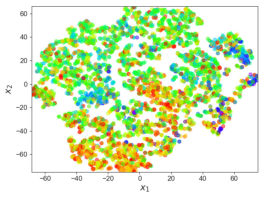

ˆ
_r_ _[p]_ = _γη_ ( _s_ _[′]_ ) = _γ_ E _πθ_ [ _η_ ( _s_ _[′]_ )] _≃_ _γ_ _[N][ξ]_ [(] _[s][′]_ [)]

_[N][ξ]_ [(] _[s][′]_ [)] _[N][ξ]_ [(] _[s][′]_ [)]

_Ncall_ ( _s_ _[′]_ ) _[η]_ [max][(] _[s][′]_ [) =] _[ γ]_ _Ncall_ ( _s_ _[′]_

_Ncall_ ( _s_ _[′]_ ) [(] _[H]_ [(] _[f][ϕ]_ [(] _[s][′]_ [))] _[ −]_ [max] _a_ _[′][ Q][θ][−]_ [(] _[s][′][, a][′]_ [))] _[,]_

(7)
where _Ncall_ ( _s_ _[′]_ ) is the number of visits on ˆ _x_ _[′]_ = NN( _fϕ_ ( _s_ _[′]_ )) _∈DE_ ; and _Nξ_ is the number of
desirable transition from ˆ _x_ _[′]_ . Here, NN( _·_ ) represents a function for selecting the nearest neighbor.
From Theorem 1, the loss function adopting episodic control with an alternative transition reward _r_ _[p]_
instead of _r_ _[EC]_ can be expressed as

_L_ _[p]_ _θ_ [= (] _[r]_ [(] _[s,]_ _**[ a]**_ [) +] _[ r][p]_ [ +] _[ γ]_ [max] (8)
_**a**_ _[′][ Q][θ][−]_ [(] _[s][′][,]_ _**[ a]**_ _[′]_ [)] _[ −]_ _[Q][θ]_ [(] _[s,]_ _**[ a]**_ [))][2] _[.]_

Then, the gradient signal of the one-step TD inference loss _γη_ ˆ( _s_ _[′]_ ) can be written as _∇θL_ _[p]_ _θ_ [with the episodic reward] _[ r][p]_ [ =]

_∇θL_ _[p]_ _θ_ [=] _[ −]_ [2] _[∇][θ][Q][θ]_ [(] _[s, a]_ [)(∆] _[ε][T D]_ [ +] _[ r][p]_ [) =] _[ −]_ [2] _[∇][θ][Q][θ]_ [(] _[s, a]_ [)(∆] _[ε][T D]_ [ +] _[ γ]_ _N_ _[N]_ _call_ _[ξ]_ [(] _[s]_ ( _s_ _[′]_ [)] _[′]_ ) _[η]_ [max][(] _[s][′]_ [))] _[,]_ (9)

5

Published as a conference paper at ICLR 2024

where ∆ _εT D_ = _r_ ( _s, a_ ) + _γ_ max _a′Qθ−_ ( _s_ _[′]_ _, a_ _[′]_ ) _−_ _Qθ_ ( _s, a_ ) is one-step inference TD error. Here, the
gradient signal _∇θL_ _[p]_ _θ_ [with the proposed episodic reward] _[ r][p]_ [ can accurately estimate the optimal]
gradient signal as follows.
**Theorem 2.** _Let ∇θL_ _[∗]_ _θ_ [=] _[ −]_ [2] _[∇][θ][Q][θ]_ [(] _[s, a]_ [)(∆] _[ε]_ _T D_ _[∗]_ [)] _[ be the optimal gradient signal with the true one]_
_step TD error_ ∆ _ε_ _[∗]_ _T D_ [=] _[ r]_ [(] _[s, a]_ [) +] _[ γV][ ∗]_ [(] _[s][′]_ [)] _[ −]_ _[Q][θ]_ [(] _[s, a]_ [)] _[. Then, the gradient signal][ ∇][θ][L][p]_ _θ_ _[with the]_
_episodic incentive r_ _[p]_ _converges to the optimal gradient signal as the policy converges to the optimal_
_policy πθ_ _[∗][, i.e.,][ ∇][θ][L][p]_ _θ_ _[→∇][θ][L]_ _θ_ _[∗]_ _[as][ π][θ][ →]_ _[π]_ _θ_ _[∗][. (Proof in Appendix B.2)]_

Theorem 2 also implies that there exists a certain bias in _∇θL_ _[EC]_ _θ_ as described in Appendix B.2. Besides the
property of convergence to the optimal gradient signal presented in Theorem 2, the episodic incentive has
the following additional characteristics. (1) The episodic incentive is
only applied to the desirable transition. We can simply see thatˆ _r_ _[p]_ = (a) 3s5z (b) MMM2
_γη_ = _γ_ E _πθ_ [ _η_ ] _≃_ _γηmaxNξ/Ncall_
and if _ξ_ ( _s_ _[′]_ ) = 0 then _Nξ_ = 0, Figure 3: Episodic incentive. Test trajectories are plotted on
yielding _r_ _[p]_ _→_ 0. Subsequently, (2) the embedded space with sampled memories in _DE_, denoted
there is no need to adjust a scale fac- with dotted markers. Star markers and numbers represent the
tor by the task complexity. (3) The desirability of state and timestep in the episode, respectively.
episodic incentive can reduce the risk Color represents the same semantics as Figure 2.
of overestimation by considering the
expected value ofˆ E _πθ_ [ _η_ ]. Instead of considering the optimistic _ηmax_, the count-based estimation
_r_ _[p]_ = _γη_ = _γ_ E _πθ_ [ _η_ ] can consider the randomness of the policy _πθ_ . Figure 3 illustrates how the
episodic incentive works with the desirability stored in _DE_ constructed by Algorithm 2 presented in
Appendix E.1. In Figure 3 as we intended, high-value states (at small timesteps) are clustered close
to the purple zone, while low-value states (at large timesteps) are located in the red zone.

(a) 3s5z (b) MMM2

Figure 3: Episodic incentive. Test trajectories are plotted on
the embedded space with sampled memories in _DE_, denoted
with dotted markers. Star markers and numbers represent the
desirability of state and timestep in the episode, respectively.
Color represents the same semantics as Figure 2.

3.3 OVERALL LEARNING OBJECTIVE

To construct the joint Q-function _Qtot_ from individual _Qi_ of the agent _i_, any form of mixer can be
used. In this paper, we mainly adopt the mixer presented in QPLEX (Wang et al., 2020b) similar to
Zheng et al. (2021), which guarantees the complete Individual-Global-Max (IGM) condition (Son
et al., 2019; Wang et al., 2020b). Considering any intrinsic reward _r_ _[c]_ encouraging an exploration
(Zheng et al., 2021) or diversity (Chenghao et al., 2021), the final loss function for the action policy
learning from Eq. 8 can be extended as

2
_L_ _[p]_ _θ_ [=] � _r_ ( _s,_ _**a**_ ) + _r_ _[p]_ + _βcr_ _[c]_ + _γ_ max _**a**_ _′Qtot_ ( _s_ _[′]_ _,_ _**a**_ _[′]_ ; _θ_ _[−]_ ) _−_ _Qtot_ ( _s,_ _**a**_ ; _θ_ )� _,_ (10)

where _βc_ is a scale factor. Note that the episodic incentive _r_ _[p]_ can be used in conjunction with any
form of intrinsic reward _r_ _[c]_ being properly annealed throughout the training. Again, _θ_ denotes the
parameters of networks related to action policy _Qi_ and the corresponding mixer network to generate
_Qtot_ . For the action selection via _Q_, we adopt a GRU to encode a local action-observation history _τ_
presented in 2.1 similar to Sunehag et al. (2017); Rashid et al. (2018); Wang et al. (2020b); but in Eq.
10, we denote equations with _s_ instead of _τ_ for the coherence with derivation in the previous section.
Appendix E.2 presents the overall training algorithm.

4 EXPERIMENTS

In this part, we have formulated our experiments with the intention of addressing the following
inquiries denoted as Q1-3.

   - Q1. How does EMU compare to the state-of-the-art MARL frameworks?

    - Q2. How does the proposed state embedding change the embedding space and improve the
performance?

    - Q3. How does the episodic incentive improve performance?

6

Published as a conference paper at ICLR 2024

We conduct experiments on complex multi-agent tasks such as SMAC (Samvelyan et al., 2019) and
GRF (Kurach et al., 2020). The experiments compare EMU against EMC adopting episodic control
(Zheng et al., 2021). Also, we include notable baselines, such as value-based MARL methods QMIX
(Rashid et al., 2018), QPLEX (Wang et al., 2020b), CDS encouraging individual diversity (Chenghao
et al., 2021). Particularly, we emphasize that EMU can be combined with any MARL framework,
so we present two versions of EMU implemented on original QPLEX and CDS, denoted as EMU
(QPLEX) and EMU (CDS), respectively. Appendix C provides further details of experiment settings
and implementations, and Appendix D.12 provides the applicability of EMU to single-agent tasks,
including pixel-based high-dimensional tasks.

4.1 Q1. COMPARATIVE EVALUATION ON STARCRAFT II (SMAC)

Figure 4: Performance comparison of EMU against baseline algorithms on three **easy and hard**
SMAC maps: 1c3s5z, 3s_vs_5z, and 5m_vs_6m, and three **super hard** SMAC maps: MMM2,
6h_vs_8z, and 3s5z_vs_3s6z.

Figure 4 illustrates the overall performance of EMU on various SMAC maps. The map categorization
regarding the level of difficulty follows the practice of Samvelyan et al. (2019). Thanks to the efficient
memory utilization and episodic incentive, both EMU (QPLEX) and EMU (CDS) show significant
performance improvement compared to their original methodologies. Especially, in **super hard**
SMAC maps, the proposed method markedly expedites convergence on optimal policy.

4.2 Q1. COMPARATIVE EVALUATION ON GOOGLE RESEARCH FOOTBALL (GRF)

Here, we conduct experiments on GRF to further compare the performance of EMU with other
baseline algorithms. In our GRF task, CDS and EMU (CDS) do not utilize the agent’s index on
observation as they contain the prediction networks while other baselines (QMIX, EMC, QPLEX)
use information of the agent’s identity in observations. In addition, we do not utilize any additional
algorithm, such as prioritized experience replay (Schaul et al., 2015), for all baselines and our
method, to expedite learning efficiency. From the experiments, adopting EMU achieves significant
performance improvement, and EMU quickly finds the winning or scoring policy at the early learning
phase by utilizing semantically similar memory.

Figure 5: Performance comparison of EMU against baseline algorithms on Google Research Football.

7

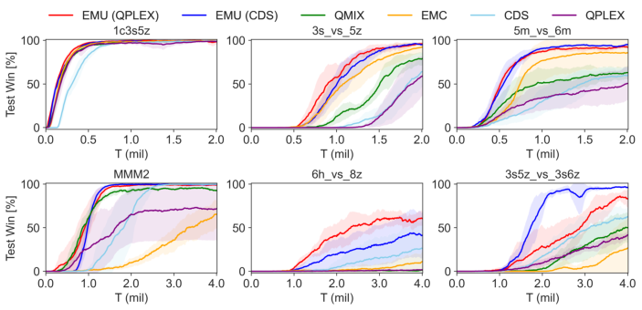

Published as a conference paper at ICLR 2024

4.3 Q2. PARAMETRIC AND ABLATION STUDY

In this section, we examine how the key hyperparameter _δ_ and the choice of design for _fϕ_ affect the
performance. To compare the learning quality and performance more quantitatively, we propose a
new performance index called _overall win-rate_, ¯ _µw_ . The purpose of ¯ _µw_ is to consider both training
efficiency (speed) and quality (win-rate) for different seed cases (see Appendix D.1 for details). We
conduct experiments on selected SMAC maps to measure ¯ _µw_ according to _δ_ and design choice for _fϕ_
such as (1) random projection, (2) **EmbNet** with Eq. 4 and (3) **dCAE** with Eq. 5.

(a) 3s_vs_5z (b) 5m_vs_6m

Figure 6: ¯ _µw_ according to _δ_ and various design choices for _fϕ_ on SMAC maps.

(a) 3s_vs_5z (b) 5m_vs_6m

Figure 7: Final win-rate according to _δ_ and
various design choices for _fϕ_ on SMAC maps.

Figure 6 and Figure 7 show ¯ _µw_ values and test win-rate at the end of training time according to
different _δ_, presented in log-scale. To see the effect of design choice for _fϕ_ distinctly, we conduct
experiments with the conventional episodic control. More data of ¯ _µw_ is presented in Tables 4 and 5 in
Appendix D.2. Figure 6 illustrates that dCAE structure shows the best training efficiency throughout
various _δ_ while achieving the optimal policy as other design choices as presented in Figure 7.

Interestingly, dCAE structure works well with
a wider range of _δ_ than EmbNet. We conjecture
that EmbNet can select very different states as
exploration if those states have similar return _H_
during training. This excessive memory recall
adversely affects learning and fails to find an
optimal policy as a result. See Appendix D.2
for detailed analysis and Appendix D.8 for an
ablation study on the loss function of dCAE.

Figure 8: Effect of varying _δ_ on complex MARL
tasks.

(a) CA_hard (GRF) (b) 6h_vs_8z (SMAC)

Even though a wide range of _δ_ works well as in tasks.
Figures 6 and 7, choosing a proper value of _δ_ in
more difficult MARL tasks significantly improves the overall learning performance. Figure 8 shows
the learning curve of EMU according to _δ_ 1 = 1 _._ 3 _e_ _[−]_ [7], _δ_ 2 = 1 _._ 3 _e_ _[−]_ [5], _δ_ 3 = 1 _._ 3 _e_ _[−]_ [3], and _δ_ 4 = 1 _._ 3 _e_ _[−]_ [2] .
In super hard MARL tasks such as 6h_vs_8z in SMAC and CA_hard in GRF, _δ_ 3 shows the best
performance compared to other _δ_ values. This is consistent with the value suggested in Appendix
F, where _δ_ is determined in a memory-efficient way. Further parametric study on _δ_ and _λrcon_ are
presented in Appendix D.5 and D.6, respectively.

4.4 Q3. FURTHER ABLATION STUDY

In this section, we carry out further ablation studies to see the effect of episodic incentive _r_ _[p]_ presented
in Section 3.2. From EMU (QPLEX) and EMU (CDS), we ablate the episodic incentive and denote
them with **(No-EI)** . We additionally ablate embedding network _fϕ_ from EMU and denote them with
**(No-SE)** . In addition, we ablate both parts, yielding EMC (QPLEX-original) and CDS (QPLEXoriginal). We evaluate the performance of each model on super hard SMAC maps. Additional ablation
studies on GRF maps are presented in Appendix D.7. Note that EMC (QPLEX-original) utilizes the
conventional episodic control presented in Zheng et al. (2021).

Figure 9 illustrates that the episodic incentive largely affects learning performance. Especially, EMU
(QPLEX-No-EI) and EMU (CDS-No-EI) utilizing the conventional episodic control show a large
performance variation according to different seeds. This demonstrates that a naive utilization of
episodic control could be detrimental to learning an optimal policy. On the other hand, the episodic
incentive selectively encourages transition considering desirability and thus prevents such a local
convergence. Appendix D.9 and D.10 present an additional ablation study on semantic embedding

8

Published as a conference paper at ICLR 2024

(a) 6h_vs_8z SMAC (b) 3s5z_vs_3s6z SMAC (c) 3s5z_vs_3s6z SMAC

Figure 9: Ablation studies on episodic incentive via complex MARL tasks.

and _r_ _[c]_, respectively. In addition, Appendix D.11 presents a comparison with an alternative incentive
(Henaff et al., 2022) presented in a single-agent setting.

4.5 QUALITATIVE ANALYSIS AND VISUALIZATION

In this section, we conduct analysis with visualization to check how the desirability _ξ_ is
memorized in _DE_ and whether it conveys correct information. Figure 10 illustrates two test
scenarios with different seeds, and each snapshot is denoted with a corresponding timestep.
In Figure 11, the trajectory of each episode is projected onto the embedded space of _DE_ .

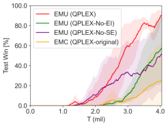

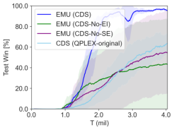

In Figure 10, case (a) successfully de- 𝑡= 6 𝑡=10 𝑡=1012 𝑡= 20
feated all enemies, whereas case (b)
lost the engagement. Both cases went
through a similar, desirable trajectory
at the beginning. For example, until

(a) Desirable trajectory on 5m_vs_6m SMAC map

_t_ = 10 agents in both cases focused 𝑡= 6 𝑡=10 𝑡=12 𝑡= 20
on killing one enemy and kept all ally
agents alive at the same time. However, at _t_ = 12, case (b) lost one agent,
and two trajectories of case (a) and

(b) Undesirable trajectory on 5m_vs_6m SMAC map

(b) in embedded space began to bifurcate. Case (b) still had a chance to

Figure 10: Visualization of test episodes.

win around _t_ = 14 _∼_ 16. However,
the states became _undesirable_ (denoted without star marker) after losing three ally agents around
_t_ = 20, and case (b) lost the battle as a result. These sequences and characteristics of trajectories are
well captured by desirability _ξ_ in _DE_ as illustrated in Figure 11.

𝑡= 6 𝑡=10 𝑡=1012 𝑡= 20

(a) Desirable trajectory on 5m_vs_6m SMAC map

𝑡= 6 𝑡=10 𝑡=12 𝑡= 20

(b) Undesirable trajectory on 5m_vs_6m SMAC map

Figure 10: Visualization of test episodes.

Furthermore, the desirable state denoted with
_ξ_ = 1 encourages exploration around it though
it is not directly retrieved during batch sampling.
This occurs through the propagation of its desirability to states currently distinguished as undesirable during memory construction, using Algorithm 2 in Appendix E.1. Consequently, when
the state’s desirability is precisely memorized
in _DE_, it can encourage desirable transitions
through the episodic incentive _r_ _[p]_ .

5 CONCLUSION

(a) Desirable trajectory (b) Undesirable trajectory

Figure 11: Test trajectories on embedded space of
_DE_ .

This paper presents EMU, a new framework to efficiently utilize episodic memory for cooperative
MARL. EMU introduces two major components: 1) a trainable semantic embedding and 2) an
episodic incentive utilizing desirability of state. Semantic memory embedding allows us to safely
utilize similar memory in a wide area, expediting learning via exploratory memory recall. The
proposed episodic incentive selectively encourages desirable transitions and reduces the risk of local
convergence by leveraging the desirability of the state. As a result, there is no need for manual
hyperparameter tuning according to the complexity of tasks, unlike conventional episodic control.
Experiments and ablation studies validate the effectiveness of each component of EMU.

9

Published as a conference paper at ICLR 2024

ACKNOWLEDGEMENTS

This research was supported by AI Technology Development for Commonsense Extraction, Reasoning, and Inference from Heterogeneous Data(IITP) funded by the Ministry of Science and
ICT(2022-0-00077).

REFERENCES

Marc Bellemare, Sriram Srinivasan, Georg Ostrovski, Tom Schaul, David Saxton, and Remi Munos.
Unifying count-based exploration and intrinsic motivation. _Advances in neural information_
_processing systems_, 29, 2016.

Marc G Bellemare, Yavar Naddaf, Joel Veness, and Michael Bowling. The arcade learning environment: An evaluation platform for general agents. _Journal of Artificial Intelligence Research_, 47:
253–279, 2013.

Charles Blundell, Benigno Uria, Alexander Pritzel, Yazhe Li, Avraham Ruderman, Joel Z Leibo,
Jack Rae, Daan Wierstra, and Demis Hassabis. Model-free episodic control. _arXiv preprint_
_arXiv:1606.04460_, 2016.

Yuri Burda, Harrison Edwards, Amos Storkey, and Oleg Klimov. Exploration by random network
distillation. _arXiv preprint arXiv:1810.12894_, 2018.

Li Chenghao, Tonghan Wang, Chengjie Wu, Qianchuan Zhao, Jun Yang, and Chongjie Zhang.
Celebrating diversity in shared multi-agent reinforcement learning. _Advances in Neural Information_
_Processing Systems_, 34:3991–4002, 2021.

Nikolay Dandanov, Hussein Al-Shatri, Anja Klein, and Vladimir Poulkov. Dynamic self-optimization
of the antenna tilt for best trade-off between coverage and capacity in mobile networks. _Wireless_
_Personal Communications_, 92(1):251–278, 2017.

Sanjoy Dasgupta and Anupam Gupta. An elementary proof of a theorem of johnson and lindenstrauss.
_Random Structures & Algorithms_, 22(1):60–65, 2003.

Marc-André Dittrich and Silas Fohlmeister. Cooperative multi-agent system for production control
using reinforcement learning. _CIRP Annals_, 69(1):389–392, 2020.

Yali Du, Lei Han, Meng Fang, Ji Liu, Tianhong Dai, and Dacheng Tao. Liir: Learning individual
intrinsic reward in multi-agent reinforcement learning. _Advances in Neural Information Processing_
_Systems_, 32, 2019.

Scott Fujimoto, Herke Hoof, and David Meger. Addressing function approximation error in actorcritic methods. In _International conference on machine learning_, pp. 1587–1596. PMLR, 2018.

Jayesh K Gupta, Maxim Egorov, and Mykel Kochenderfer. Cooperative multi-agent control using
deep reinforcement learning. In _International conference on autonomous agents and multiagent_
_systems_, pp. 66–83. Springer, 2017.

Matthew Hausknecht and Peter Stone. Deep recurrent q-learning for partially observable mdps. In
_2015 aaai fall symposium series_, 2015.

Mikael Henaff, Roberta Raileanu, Minqi Jiang, and Tim Rocktäschel. Exploration via elliptical
episodic bonuses. _Advances in Neural Information Processing Systems_, 35:37631–37646, 2022.

Rein Houthooft, Xi Chen, Yan Duan, John Schulman, Filip De Turck, and Pieter Abbeel. Vime:
Variational information maximizing exploration. _Advances in neural information processing_
_systems_, 29, 2016.

Hao Hu, Jianing Ye, Guangxiang Zhu, Zhizhou Ren, and Chongjie Zhang. Generalizable episodic
memory for deep reinforcement learning. _International conference on machine learning_, 2021.

10

Published as a conference paper at ICLR 2024

Natasha Jaques, Angeliki Lazaridou, Edward Hughes, Caglar Gulcehre, Pedro Ortega, DJ Strouse,
Joel Z Leibo, and Nando De Freitas. Social influence as intrinsic motivation for multi-agent deep
reinforcement learning. In _International conference on machine learning_, pp. 3040–3049. PMLR,
2019.

Hyoungseok Kim, Jaekyeom Kim, Yeonwoo Jeong, Sergey Levine, and Hyun Oh Song. Emi:
Exploration with mutual information. _arXiv preprint arXiv:1810.01176_, 2018.

Diederik P Kingma and Max Welling. Auto-encoding variational bayes. _arXiv preprint_
_arXiv:1312.6114_, 2013.

Karol Kurach, Anton Raichuk, Piotr Stanczyk, Michal Zajkc, Olivier Bachem, Lasse Espeholt, Carlos
Riquelme, Damien Vincent, Marcin Michalski, Olivier Bousquet, et al. Google research football:
A novel reinforcement learning environment. In _Proceedings of the AAAI Conference on Artificial_
_Intelligence_, volume 34, pp. 4501–4510, 2020.

Lei Le, Andrew Patterson, and Martha White. Supervised autoencoders: Improving generalization
performance with unsupervised regularizers. _Advances in neural information processing systems_,
31, 2018.

Máté Lengyel and Peter Dayan. Hippocampal contributions to control: the third way. _Advances in_
_neural information processing systems_, 20, 2007.

Zichuan Lin, Tianqi Zhao, Guangwen Yang, and Lintao Zhang. Episodic memory deep q-networks.
_arXiv preprint arXiv:1805.07603_, 2018.

Iou-Jen Liu, Unnat Jain, Raymond A Yeh, and Alexander Schwing. Cooperative exploration for
multi-agent deep reinforcement learning. In _International Conference on Machine Learning_, pp.
6826–6836. PMLR, 2021.

Anuj Mahajan, Tabish Rashid, Mikayel Samvelyan, and Shimon Whiteson. Maven: Multi-agent
variational exploration. _Advances in Neural Information Processing Systems_, 32, 2019.

David Henry Mguni, Taher Jafferjee, Jianhong Wang, Nicolas Perez-Nieves, Oliver Slumbers, Feifei
Tong, Yang Li, Jiangcheng Zhu, Yaodong Yang, and Jun Wang. Ligs: Learnable intrinsic-reward
generation selection for multi-agent learning. _arXiv preprint arXiv:2112.02618_, 2021.

Shakir Mohamed and Danilo Jimenez Rezende. Variational information maximisation for intrinsically
motivated reinforcement learning. _Advances in neural information processing systems_, 28, 2015.

Frans A Oliehoek and Christopher Amato. _A concise introduction to decentralized POMDPs_ . Springer,
2016.

Frans A Oliehoek, Matthijs TJ Spaan, and Nikos Vlassis. Optimal and approximate q-value functions
for decentralized pomdps. _Journal of Artificial Intelligence Research_, 32:289–353, 2008.

Georg Ostrovski, Marc G Bellemare, Aäron Oord, and Rémi Munos. Count-based exploration with
neural density models. In _International conference on machine learning_, pp. 2721–2730. PMLR,
2017.

Deepak Pathak, Pulkit Agrawal, Alexei A Efros, and Trevor Darrell. Curiosity-driven exploration
by self-supervised prediction. In _International conference on machine learning_, pp. 2778–2787.
PMLR, 2017.

Alexander Pritzel, Benigno Uria, Sriram Srinivasan, Adria Puigdomenech Badia, Oriol Vinyals,
Demis Hassabis, Daan Wierstra, and Charles Blundell. Neural episodic control. In _International_
_Conference on Machine Learning_, pp. 2827–2836. PMLR, 2017.

Santhosh K Ramakrishnan, Aaron Gokaslan, Erik Wijmans, Oleksandr Maksymets, Alex Clegg, John
Turner, Eric Undersander, Wojciech Galuba, Andrew Westbury, Angel X Chang, et al. Habitatmatterport 3d dataset (hm3d): 1000 large-scale 3d environments for embodied ai. _arXiv preprint_
_arXiv:2109.08238_, 2021.

11

Published as a conference paper at ICLR 2024

Tabish Rashid, Mikayel Samvelyan, Christian Schroeder, Gregory Farquhar, Jakob Foerster, and Shimon Whiteson. Qmix: Monotonic value function factorisation for deep multi-agent reinforcement
learning. In _International conference on machine learning_, pp. 4295–4304. PMLR, 2018.

Tabish Rashid, Gregory Farquhar, Bei Peng, and Shimon Whiteson. Weighted qmix: Expanding
monotonic value function factorisation for deep multi-agent reinforcement learning. _Advances in_
_neural information processing systems_, 33:10199–10210, 2020.

Mikayel Samvelyan, Tabish Rashid, Christian Schroeder De Witt, Gregory Farquhar, Nantas Nardelli,
Tim GJ Rudner, Chia-Man Hung, Philip HS Torr, Jakob Foerster, and Shimon Whiteson. The
starcraft multi-agent challenge. _arXiv preprint arXiv:1902.04043_, 2019.

Tom Schaul, John Quan, Ioannis Antonoglou, and David Silver. Prioritized experience replay. _arXiv_
_preprint arXiv:1511.05952_, 2015.

Kihyuk Sohn, Honglak Lee, and Xinchen Yan. Learning structured output representation using deep
conditional generative models. _Advances in neural information processing systems_, 28, 2015.

Kyunghwan Son, Daewoo Kim, Wan Ju Kang, David Earl Hostallero, and Yung Yi. Qtran: Learning to
factorize with transformation for cooperative multi-agent reinforcement learning. In _International_
_conference on machine learning_, pp. 5887–5896. PMLR, 2019.

Bradly C Stadie, Sergey Levine, and Pieter Abbeel. Incentivizing exploration in reinforcement
learning with deep predictive models. _arXiv preprint arXiv:1507.00814_, 2015.

Peter Sunehag, Guy Lever, Audrunas Gruslys, Wojciech Marian Czarnecki, Vinicius Zambaldi, Max
Jaderberg, Marc Lanctot, Nicolas Sonnerat, Joel Z Leibo, Karl Tuyls, et al. Value-decomposition
networks for cooperative multi-agent learning. _arXiv preprint arXiv:1706.05296_, 2017.

Richard S Sutton and Andrew G Barto. _Reinforcement learning: An introduction_ . MIT press, 2018.

Haoran Tang, Rein Houthooft, Davis Foote, Adam Stooke, OpenAI Xi Chen, Yan Duan, John
Schulman, Filip DeTurck, and Pieter Abbeel. # exploration: A study of count-based exploration
for deep reinforcement learning. _Advances in neural information processing systems_, 30, 2017.

Emanuel Todorov, Tom Erez, and Yuval Tassa. Mujoco: A physics engine for model-based control.
In _2012 IEEE/RSJ International Conference on Intelligent Robots and Systems_, pp. 5026–5033.
IEEE, 2012. doi: 10.1109/IROS.2012.6386109.

Laurens Van der Maaten and Geoffrey Hinton. Visualizing data using t-sne. _Journal of machine_
_learning research_, 9(11), 2008.

Binyu Wang, Zhe Liu, Qingbiao Li, and Amanda Prorok. Mobile robot path planning in dynamic
environments through globally guided reinforcement learning. _IEEE Robotics and Automation_
_Letters_, 5(4):6932–6939, 2020a.

Jianhao Wang, Zhizhou Ren, Terry Liu, Yang Yu, and Chongjie Zhang. Qplex: Duplex dueling
multi-agent q-learning. _arXiv preprint arXiv:2008.01062_, 2020b.

Tonghan Wang, Jianhao Wang, Yi Wu, and Chongjie Zhang. Influence-based multi-agent exploration.
_arXiv preprint arXiv:1910.05512_, 2019.

Tonghan Wang, Tarun Gupta, Anuj Mahajan, Bei Peng, Shimon Whiteson, and Chongjie Zhang. Rode:
Learning roles to decompose multi-agent tasks. _In Proceedings of the International Conference on_
_Learning Representations (ICLR)_, 2021.

Marco A Wiering et al. Multi-agent reinforcement learning for traffic light control. In _Machine_
_Learning: Proceedings of the Seventeenth International Conference (ICML’2000)_, pp. 1151–1158,
2000.

Jiachen Yang, Igor Borovikov, and Hongyuan Zha. Hierarchical cooperative multi-agent reinforcement learning with skill discovery. _arXiv preprint arXiv:1912.03558_, 2019.

12

Published as a conference paper at ICLR 2024

Yaodong Yang, Jianye Hao, Ben Liao, Kun Shao, Guangyong Chen, Wulong Liu, and Hongyao Tang.
Qatten: A general framework for cooperative multiagent reinforcement learning. _arXiv preprint_
_arXiv:2002.03939_, 2020.

Chao Yu, Akash Velu, Eugene Vinitsky, Jiaxuan Gao, Yu Wang, Alexandre Bayen, and Yi Wu. The
surprising effectiveness of ppo in cooperative multi-agent games. _Advances in Neural Information_
_Processing Systems_, 35:24611–24624, 2022.

Lulu Zheng, Jiarui Chen, Jianhao Wang, Jiamin He, Yujing Hu, Yingfeng Chen, Changjie Fan, Yang
Gao, and Chongjie Zhang. Episodic multi-agent reinforcement learning with curiosity-driven
exploration. _Advances in Neural Information Processing Systems_, 34:3757–3769, 2021.

Guangxiang Zhu, Zichuan Lin, Guangwen Yang, and Chongjie Zhang. Episodic reinforcement
learning with associative memory. _International conference on learning representations_, 2020.

13

Published as a conference paper at ICLR 2024

A RELATED WORKS

This section presents the related works regarding incentive generation for exploration, episodic
control, and the characteristics of cooperative MARL.

A.1 INCENTIVE FOR MULTI-AGENT EXPLORATION

Balancing between exploration and exploitation in policy learning is a paramount issue in reinforcement learning. To encourage exploration, modified count-based methods (Bellemare et al., 2016;
Ostrovski et al., 2017; Tang et al., 2017), prediction error-based methods (Stadie et al., 2015; Pathak
et al., 2017; Burda et al., 2018; Kim et al., 2018), and information gain-based methods (Mohamed &
Jimenez Rezende, 2015; Houthooft et al., 2016) have been proposed for a single agent reinforcement
learning. In most cases, an incentive for exploration is introduced as an additional reward to a TD
target in Q-learning; or such an incentive is added as a regularizer for overall loss functions. Recently,
various aforementioned methods to encourage exploration have been adopted to the multi-agent
setting (Mahajan et al., 2019; Wang et al., 2019; Jaques et al., 2019; Mguni et al., 2021) and have
shown their effectiveness. MAVEN (Mahajan et al., 2019) introduces a regularizer maximizing
the mutual information between trajectories and latent variables to learn a diverse set of behaviors.
LIIR (Du et al., 2019) learns a parameterized individual intrinsic reward function by maximizing a
centralized critic. CDS (Chenghao et al., 2021) proposes a novel information-theoretical objective to
maximize the mutual information between agents’ identities and trajectories to encourage diverse
individualized behaviors. EMC (Zheng et al., 2021) proposes a curiosity-driven exploration by
predicting individual Q-values. This individual-based Q-value prediction can capture the influence
among agents as well as the novelty of states.

A.2 EPISODIC CONTROL

Episodic control (Lengyel & Dayan, 2007) was well adopted on model-free setting (Blundell et al.,
2016) by storing the highest return of a given state, to efficiently estimate its values or Q-values.
Given that the sample generation is often limited by simulation executions or real-world observations,
its sample efficiency helps to find an accurate estimation of Q-value (Blundell et al., 2016; Pritzel
et al., 2017; Lin et al., 2018). NEC (Pritzel et al., 2017) uses a differentiable neural dictionary as
an episodic memory to estimate the action value by the weighted sum of the values in the memory.
EMDQN (Lin et al., 2018) utilizes a fixed random matrix to generate a state representation, which
is used as a key to link between the state representation and the highest return of the state in the
episodic memory. ERLAM (Zhu et al., 2020) learns associative memories by building a graphical
representation of states in memory, and GEM (Hu et al., 2021) develops state-action values of episodic
memory in a generalizable manner. Recently, EMC (Zheng et al., 2021) extended the approach
of EMDQN to a deep MARL with curiosity-driven exploration incentives. EMC utilizes episodic
memory to regularize policy learning and shows performance improvement in cooperative MARL
tasks. However, EMC requires a hyperparameter tuning to determine the level of importance of the
one-step TD memory-based target during training, according to the difficulties of tasks. In this paper,
we interpret this regularization as an additional transition reward. Then, we present a novel form of
reward, called episodic incentive, to selectively encourage the transition toward desired states, i.e.,
states toward a common goal in cooperative multi-agent tasks.

A.3 COOPERATIVE MULTI-AGENT REINFORCEMENT LEARNING (MARL) TASK

In general, there is a common goal in cooperative MARL tasks, which guarantees the maximum
return that can be obtained from the environment. Thus, there could be many local optima with
high returns but not the maximum, which means the agents failed to achieve the common goal in
the end. In other words, there is a distinct difference between the objective of cooperative MARL
tasks and that of a single-agent task, which aims to maximize the return as much as possible without
any boundary determining success or failure. Our desirability definition presented in Definition 1
in MARL setting becomes well justified from this view. Under this characteristic of MARL tasks,
learning optimal policy often takes a long time and even fails, yielding a local convergence. EMU
was designed to alleviate these issues in MARL.

14

Published as a conference paper at ICLR 2024

B MATHEMATICAL PROOF

In this section, we present the omitted proofs of Theorem 1 and Theorem 2 as follows.

B.1 PROOF OF THEOREM 1

_Proof._ The loss function of a conventional episodic control, _L_ _[EC]_ _θ_, can be expressed as the weighted
sum of one-step inference TD error ∆ _εT D_ = _r_ ( _s, a_ ) + _γ_ max _a_ _[′]_ _Qθ−_ ( _s_ _[′]_ _, a_ _[′]_ ) _−_ _Qθ_ ( _s, a_ ) and MC
inference error ∆ _εEC_ = _QEC_ ( _s, a_ ) _−_ _Qθ_ ( _s, a_ ).
_L_ _[EC]_ _θ_ = ( _r_ ( _s,_ _**a**_ ) + _γ_ max (11)
_**a**_ _[′][ Q][θ][−]_ [(] _[s][′][,]_ _**[ a]**_ _[′]_ [)] _[ −]_ _[Q][θ]_ [(] _[s,]_ _**[ a]**_ [))][2][ +] _[ λ]_ [(] _[Q][EC]_ [(] _[s,]_ _**[ a]**_ [)] _[ −]_ _[Q][θ]_ [(] _[s,]_ _**[ a]**_ [))][2] _[,]_

where _QEC_ ( _s,_ _**a**_ ) = _r_ ( _s,_ _**a**_ ) + _γH_ ( _s_ _[′]_ ) and _Qθ−_ is the target network parameterized by _θ_ _[−]_ . Then,
the gradient of _L_ _[EC]_ _θ_ can be derived as

_∇θL_ _[EC]_ _θ_ = _−_ 2 _∇θQθ_ ( _s,_ _**a**_ )[( _r_ ( _s,_ _**a**_ ) + _γ_ max
_a_ _[′][ Q][θ][−]_ [(] _[s][′][,]_ _**[ a]**_ _[′]_ [)] _[ −]_ _[Q][θ]_ [(] _[s,]_ _**[ a]**_ [)) +] _[ λ]_ [(] _[Q][EC]_ [(] _[s,]_ _**[ a]**_ [)] _[ −]_ _[Q][θ]_ [(] _[s,]_ _**[ a]**_ [))]]

= _−_ 2 _∇θQθ_ ( _s,_ _**a**_ )(∆ _εT D_ + _λ_ ∆ _εEC_ ) _._
(12)

Now, we consider an additional reward _r_ _[EC]_ for the transition to a conventional Q-learning objective,
the modified loss function _Lθ_ can be expressed as
_Lθ_ = ( _r_ ( _s,_ _**a**_ ) + _r_ _[EC]_ ( _s,_ _**a**_ _, s_ _[′]_ ) + _γ_ max (13)
_**a**_ _[′][ Q][θ][−]_ [(] _[s][′][,]_ _**[ a]**_ _[′]_ [)] _[ −]_ _[Q][θ]_ [(] _[s,]_ _**[ a]**_ [))][2] _[.]_

Then, the gradient of _Lθ_ presented in Eq. 13 is computed as
_∇θLθ_ = _−_ 2 _∇θQθ_ ( _s,_ _**a**_ )(∆ _εT D_ + _r_ _[EC]_ ) _._ (14)
Comparing Eq. 12 and Eq. 14, if we set the additional transition reward as _r_ _[EC]_ ( _s,_ _**a**_ _, s_ _[′]_ ) =
_λ_ ( _r_ ( _s,_ _**a**_ ) + _γH_ ( _s_ _[′]_ ) _−_ _Qθ_ ( _s,_ _**a**_ )), then _∇θLθ_ = _∇θL_ _[EC]_ _θ_ holds.

B.2 PROOF OF THEOREM 2

_Proof._ From Eq. 7, the value of ˆ _η_ ( _s_ _[′]_ ) can be expressed as

ˆ _Nξ_ ( _s_ _[′]_ )
_η_ ( _s_ _[′]_ ) = E _πθ_ [ _η_ ( _s_ _[′]_ )] _≃_ � _H_ ( _fϕ_ ( _s_ _[′]_ )) _−_ max �] _._ (15)
_Ncall_ ( _s_ _[′]_ ) _a_ _[′][ Q][θ][−]_ [(] _[s][′][, a][′]_ [)]

When the joint actions from the current time follow the optimal policy, _**a**_ _∼_ _πθ_ _[∗]_ [, the cumulative reward]
from _s_ _[′]_ converges to _V_ _[∗]_ ( _s_ _[′]_ ), i.e., _H_ ( _fϕ_ ( _s_ _[′]_ )) _→_ _V_ _[∗]_ ( _s_ _[′]_ ). Then, every recall of ˆ _x_ _[′]_ = NN( _fϕ_ ( _s_ _[′]_ )) _∈_
_DE_ guarantees the desirable transition, i.e., _ξ_ ( _s_ _[′]_ ) = 1, where NN( _·_ ) represents a function for
selecting the nearest neighbor. As a result, as _Ncall_ ( _s_ _[′]_ ) _→∞_, _NNcallξ_ ( _s_ ( _[′]_ _s_ ) _[′]_ ) _[→]_ [1][, yielding][ ˆ] _[η]_ [(] _[s][′]_ [)] _[ ≃]_

_NNcallξ_ ( _s_ ( _[′]_ _s_ ) _[′]_ ) � _H_ ( _fϕ_ ( _s_ _[′]_ )) _−_ max _a_ _[′]_ _Qθ−_ ( _s_ _[′]_ _, a_ _[′]_ )� _→_ _V_ _[∗]_ ( _s_ _[′]_ ) _−_ max _**a**_ _′Qθ−_ ( _s_ _[′]_ _,_ _**a**_ _[′]_ ). Then, the gradient signal
with the episodic incentive _∇θL_ _[p]_ _θ_ [becomes]
_∇θL_ _[p]_ _θ_ [=] _[ −]_ [2] _[∇][θ][Q][θ]_ [(] _[s,]_ _**[ a]**_ [)[∆] _[ε][T D]_ [ +] _[ r][p]_ []]

ˆ
= _−_ 2 _∇θQθ_ ( _s,_ _**a**_ )[∆ _εT D_ + _γη_ ( _s_ _[′]_ )]

_≃−_ 2 _∇θQθ_ ( _s,_ _**a**_ )[∆ _εT D_ + _γ_ ( _V_ _[∗]_ ( _s_ _[′]_ ) _−_ max
_**a**_ _[′][ Q][θ][−]_ [(] _[s][′][,]_ _**[ a]**_ _[′]_ [))]]

= _−_ 2 _∇θQθ_ ( _s,_ _**a**_ )[ _r_ ( _s,_ _**a**_ ) + _γ_ max
_**a**_ _[′][ Q][θ][−]_ [(] _[s][′][,]_ _**[ a]**_ _[′]_ [)] _[ −]_ _[Q][θ]_ [(] _[s,]_ _**[ a]**_ [) +] _[ γ]_ [(] _[V][ ∗]_ [(] _[s][′]_ [)] _[ −]_ [max] _**a**_ _[′][ Q][θ][−]_ [(] _[s][′][,]_ _**[ a]**_ _[′]_ [))]]

= _−_ 2 _∇θQθ_ ( _s,_ _**a**_ )[ _r_ ( _s,_ _**a**_ ) + _γV_ _[∗]_ ( _s_ _[′]_ ) _−_ _Qθ_ ( _s,_ _**a**_ )]
= _∇θL_ _[∗]_ _θ_ _[,]_
(16)
which completes the proof.

In addition, when max _**a**_ _′Qθ−_ ( _s_ _[′]_ _,_ _**a**_ _[′]_ ) accurately estimates _V_ _[∗]_ ( _s_ _[′]_ ), the original TD-target is preserved
as the episodic incentive becomes zero, i.e., _r_ _[p]_ _→_ 0. Then with the properly annealed intrinsic reward
_r_ _[c]_, the learning objective presented in Eq. 10 degenerates to the original Bellman optimality equation
(Sutton & Barto, 2018). On the other hand, even though the assumption of _H_ ( _s_ _[′]_ ) _→_ _V_ _[∗]_ ( _s_ _[′]_ ) yields
∆ _εEC →_ ∆ _ε_ _[∗]_ _T D_ [,] _[ ∇][θ][L][EC]_ _θ_ has an additional bias ∆ _εT D_ due to weighted sum structure presented in
Eq. 3. Thus, _∇θL_ _[EC]_ _θ_ can converge to _∇θL_ _[∗]_ _θ_ [only when][ max] _**[a]**_ _[′][Q][θ][−]_ [(] _[s][′][,]_ _**[ a]**_ _[′]_ [)] _[ →]_ _[V][ ∗]_ [(] _[s][′]_ [)][ and] _[ λ][ →]_ [0][ at]
the same time.

15

Published as a conference paper at ICLR 2024

C IMPLEMENTATION AND EXPERIMENT DETAILS

C.1 DETAILS OF IMPLEMENTATION

**Encoder and Decoder Structure**
As illustrated in Figure 1(c), we have an encoder and decoder structure. For an encoder _fϕ_, we
evaluate two types of structure, **EmbNet** and **dCAE** . For **EmbNet** with the learning objective
presented in Eq. 4, two fully connected layers with 64-dimensional hidden state are used with ReLU
activation function between them, followed by layer normalization block at the head. On the other
hand, for **dCAE** with the learning objective presented in Eq. 5, we utilize a deeper encoder structure
which contains three fully connected layers with ReLU activation function. In addition, **dCAE** takes
a timestep _t_ as an input as well as a global state _st_ . We set episodic latent dimension dim( _x_ ) = 4 as
Zheng et al. (2021).

LayerNorm ReLU FC FC FC

FC ReLU ReLU ReLU

𝑠 ReLU 𝑥 FC 𝑓𝜓(∙) ഥ𝐻 𝑠 FC 𝑥 FC ҧ𝑠

FC ReLU ReLU

𝑓𝜙(∙) 𝑡 𝑓𝜙(∙) 𝑓𝜓(∙)

(a) EmbNet

(b) dCAE

Figure 12: Illustration of network structures.

For a decoder _fψ_, both **EmbNet** and **dCAE** utilize a three-fully connected layer with ReLU activation
functions. Differences are that **EmbNet** takes only _xt_ as input and utilizes the 128-dimensional
hidden state while **dCAE** takes _xt_ and _t_ as inputs and adopts the 64-dimensional hidden state. As
illustrated in Figure 1(c), to reconstruct global state _st_, **dCAE** has two separate heads while sharing
lower parts of networks; _fϕ_ _[s]_ [to reconstruct] _[ s][t]_ [ and] _[ f]_ _ϕ_ _[ H]_ [to predict the return of] _[ s][t]_ [, denoted as] _[ H][t]_ [. Figure]
12 illustrates network structures of **EmbNet** and **dCAE** . The concept of supervised VAE similar to
EMU can be found in (Le et al., 2018).

The reason behind avoiding probabilistic autoencoders such as variational autoencoder (VAE)
(Kingma & Welling, 2013; Sohn et al., 2015) is that the stochastic embedding and the prior distribution could have an adverse impact on preserving a pair of _xt_ and _Ht_ for given a _st_ . In particular, with
stochastic embedding, a fixed _st_ can generate diverse _xt_ . As a result, it breaks the pair of _xt_ and _Ht_
for given _st_, which makes it difficult to select a valid memory from _DE_ .

For training, we periodically update _fϕ_ and _fψ_ with an update interval of _temb_ in parallel to MARL
training. At each training phase, we use _Memb_ samples out of the current capacity of _DE_, whose
maximum capacity is 1 million (1M), and batch size of _memb_ is used for each training step. After
updating _fϕ_, every _x ∈DE_ needs to be updated with updated _fϕ_ . Algorithm 1 shows the details of
learning framework for _fϕ_ and _fψ_ . Details of the training procedure for _fϕ_ and _fψ_ along with MARL
training are presented in Appendix E.2.

**Other Network Structure and Hyperparameters**
For a mixer structure, we adopt QPLEX (Wang et al., 2020b) in both EMU (QPLEX) and EMU (CDS)
and follow the same hyperparameter settings used in their source codes. Common hyperparameters
related to individual Q-network and MARL training are adopted by the default settings of PyMARL
(Samvelyan et al., 2019).

16

Published as a conference paper at ICLR 2024

**Algorithm 1** Training Algorithm for State Embedding

1: **Parameter:** learning rate _α_, number of training dataset _N_, batch size _B_

_N_
2: Sample Training dataset ( _s_ [(] _[i]_ [)] _, H_ [(] _[i]_ [)] _, t_ [(] _[i]_ [)] ) _i_ =1 _[∼D][E]_ [,]
3: Initialize weights _**ϕ**_ _,_ _**ψ**_ _←_ **0**
4: **for** _i_ = 1 to _⌊N/B⌋_ **do**
5: Compute ( _x_ [(] _[j]_ [)] = _f_ _**ϕ**_ ( _s_ [(] _[j]_ [)] _|t_ [(] _[j]_ [)] ) _[iB]_ _j_ =( _i−_ 1) _B_ +1
6: Predict return ( _H_ [¯] [(] _[j]_ [)] = _f_ _**ψ**_ _[H]_ [(] _[x]_ [(] _[j]_ [)] _[|][t]_ [(] _[i]_ [)][))] _[iB]_ _j_ =( _i−_ 1) _B_ +1
7: Reconstruct state (¯ _s_ [(] _[j]_ [)] = _f_ _**ψ**_ _[s]_ [(] _[x]_ [(] _[j]_ [)][)] _[|][t]_ [(] _[i]_ [)][)] _[iB]_ _j_ =( _i−_ 1) _B_ +1
8: Compute Loss _L_ ( _**ϕ**_ _,_ _**ψ**_ ) via Eq. 5
9: Update _**ϕ**_ _←_ _**ϕ**_ _−_ _α_ _[∂][L]_ [,] _**[ ψ]**_ _[ ←]_ _**[ψ]**_ _[ −]_ _[α]_ _[∂][L]_

_[∂][L]_ _[∂][L]_

_∂_ _**ϕ**_ [,] _**[ ψ]**_ _[ ←]_ _**[ψ]**_ _[ −]_ _[α]_ _∂_ _**ψ**_

_∂_ _**ϕ**_ [,] _∂_ _**ψ**_

10: **end for**

C.2 EXPERIMENT DETAILS

We utilize PyMARL (Samvelyan et al., 2019) to execute all of the baseline algorithms with their
open-source codes, and the same hyperparameters are used for experiments if they are presented
either in uploaded codes or in their manuscripts.

For a general performance evaluation, we test our methods on various maps, which require a different
level of coordination according to the map’s difficulties. Win-rate is computed with 160 samples: 32
episodes for each training random seed, and 5 different random seeds unless denoted otherwise.

Both the mean and the variance of the performance are presented for all the figures to show their
overall performance according to different seeds. Especially for a fair comparison, we set _n_ circle, the
number of training per a sampled batch of 32 episodes during training, as 1 for all baselines since
some of the baselines increase _n_ circle = 2 as a default setting in their codes.

For performance comparison with baseline methods, we use their codes with fine-tuned algorithm
configuration for hyperparameter settings according to their codes and original paper if available. For
experiments on SMAC, we use the version of starcraft.py presented in RODE (Wang et al.,
2021) adopting some modification for compatibility with QPLEX (Wang et al., 2020b). All SMAC
experiments were conducted on StarCraft II version 4.10.0 in a Linux environment.

For Google research football task, we use the environmental code provided by (Kurach et al.,
2020). In the experiments, we consider three official scenarios such as academy_3_vs_1_with_keeper
(3_vs_1WK), academy_counterattack_easy (CA_easy), and academy_counterattack_hard (CA_hard).

In addition, for controlling _r_ _[c]_ in Eq. 10, the same hyperparameters related to curiosity-based (Zheng
et al., 2021) or diversity-based exploration Chenghao et al. (2021) are adopted for EMU (QPLEX)
and EMU (CDS) as well as for baselines EMC and CDS. After further experiments, we found that
the curiosity-based _r_ _[c]_ from (Zheng et al., 2021) adversely influenced super hard SMAC task, with
the exception of corridor scenario. Furthermore, the diversity-based exploration from Chenghao
et al. (2021) led to a decrease in performance on both easy and hard SMAC maps. Thus, we decided
to exclude the use of _r_ _[c]_ for EMU (QPLEX) on the super hard SMAC task and for EMU (CDS) on
the easy/hard SMAC maps. EMU set task-dependent _δ_ values as presented in Table 1. For other
hyperparameters introduced by EMU, the same values presented in Table 8 are used throughout all
tasks. For EMU (QPLEX) in corridor, _δ_ = 1 _._ 3 _e −_ 5 is used instead of _δ_ = 1 _._ 3 _e −_ 3.

Table 1: Task-dependent hyperparameter of EMU.

Category _δ_

easy/hard SMAC maps 1 _._ 3 _e_ _[−]_ [5]

super hard SMAC maps 1 _._ 3 _e_ _[−]_ [3]

GRF 1 _._ 3 _e_ _[−]_ [3]

17

Published as a conference paper at ICLR 2024

C.3 DETAILS OF MARL TASKS

In this section, we specify the dimension of the state space, the action space, the episodic length, and
the reward of SMAC (Samvelyan et al., 2019) and GRF (Kurach et al., 2020).

In SMAC, the global state of each task of SMAC includes the information of the coordinates of all
agents, and features of both allied and enemy units. The action space of each agent consists of the
moving actions and attacking enemies, and thus it increases according to the number of enemies.
The dimensions of the state and action space and the episodic length vary according to the tasks as
shown in Table 2. For reward structure, we used the _shaped reward_, i.e., the default reward settings of
SMAC, for all scenarios. The reward is given when dealing damage to the enemies and get bonuses
for winning the scenario. The reward is scaled so that the maximum cumulative reward, _Rmax_, that
can be obtained from the episode, becomes around 20 (Samvelyan et al., 2019).

Table 2: Dimension of the state space and the action space and the episodic length of SMAC

Task Dimension of state space Dimension of action space Episodic length

1c3s5z 270 15 180

3s5z 216 14 150
3s_vs_5z 68 11 250
5m_vs_6m 98 12 70
MMM2 322 18 180
6h_vs_8z 140 14 150
3s5z_vs_3s6z 230 15 170
corridor 282 30 400

In GRF, the state of each task includes information on coordinates, ball possession, and the direction
of players, etc. The dimension of the state space differs among the tasks as in Table 3. The action
of each agent consists of moving directions, different ways to kick the ball, sprinting, intercepting
the ball and dribbling. The dimensions of the action spaces for each task are the same. Table 3
summarizes the dimension of the action space and the episodic length. In GRF, there can be two
reward modes: one is "sparse reward" and the other is "dense reward." In sparse reward mode, agents
get a positive reward +1 when scoring a goal and get -1 when conceding one to the opponents. In
dense reward mode, agents can get positive rewards when they approach to opponent’s goal, but the
maximum cumulative reward is up to +1. In our experiments, we adopt sparse reward mode, and thus
the maximum reward, _Rmax_ is +1 for GRF.

Table 3: Dimension of the state space and the action space and the episodic length of GRF

Task Dimension of state space Dimension of action space Episodic length

3_vs_1WK 26 19 150
CA_easy 30 19 150
CA_hard 34 19 150

C.4 INFRASTRUCTURE

Experiments for SMAC (Samvelyan et al., 2019) are mainly carried out on NVIDIA GeForce RTX
3090 GPU, and training for the longest experiment such as corridor via EMU (CDS) took less
than 18 hours. Note that when training is conducted with _n_ circle = 2, it takes more than one and a
half times longer. Training encoder/decoder structure and updating _DE_ with updated _fϕ_ together
only took less than 2 seconds at most in corridor task. As we update _fϕ_ and _fψ_ periodically with
_temb_, the additional time required for a trainable embedder is certainly negligible compared to MARL
training.

18

Published as a conference paper at ICLR 2024

D FURTHER EXPERIMENT RESULTS

D.1 NEW PERFORMANCE INDEX

In this section, we present the details of a new performance index called _overall win-rate_, ¯ _µw_ . For
example, let _fw_ _[i]_ [(] _[s]_ [)][ be the test win-rate at training time] _[ s]_ [ of] _[ i]_ [th seed run and] _[ µ][i]_ _w_ [(] _[t]_ [)][ represents the]
time integration of _fw_ _[i]_ [(] _[s]_ [)][ until] _[ t]_ [. Then, a normalized overall win-rate,][ ¯] _[µ][w]_ [, can be expressed as]

_µ_ ¯ _w_ ( _t_ ) = 1
_µ_ max

where _µ_ max = _t_ and ¯ _µw ∈_ [0 _,_ 1].

1

_n_

_n_ 1
� _i_ =1 _[µ]_ _w_ _[i]_ [(] _[t]_ [) =] _µ_ max

1

_n_

� _ni_ =1

_t_

_fw_ _[i]_ [(] _[s]_ [)] _[ds,]_ (17)

�0

𝑠

Figure 13: Illustration of _µ_ _[i]_ _w_ [(] _[t]_ [)][.]

Figure 13 illustrates the concept of time integration of win-rate, i.e., _µ_ _[i]_ _w_ [(] _[t]_ [)][, to construct the overall]
win-rate, ¯ _µw_ . By considering the integration of win-rate of each seed case, the performance variance
can be considered, and thus ¯ _µw_ shows the training efficiency (speed) as well as the training quality
(win-rate).

D.2 ADDITIONAL EXPERIMENT RESULTS

In Section 4.3, we present the summary of parametric studies on _δ_ with respect to various choices
of _fϕ_ . To see the training efficiency and performance at the same time, Table 4 and 5 present the
overall win-rate ¯ _µw_ according to training time. We conduct the experiments for 5 different seed cases
and at each test phase 32 samples were used to evaluate the win-rate [%]. Note that we discard the
component of episodic incentive _r_ _[p]_ to see the performance variations according to _δ_ and types of _fϕ_
more clearly.

Table 4: ¯ _µw_ according to _δ_ and design choice of embedding function on **hard** SMAC map,
3s_vs_5z.

Training time
0.69 1.37 2.00

[mil]

_δ_ random EmbNet dCAE random EmbNet dCAE random EmbNet dCAE

1.3e-7 0.033 0.051 **0.075** 0.245 0.279 **0.343** 0.413 0.443 **0.514**

1.3e-5 0.010 0.044 **0.063** 0.171 0.270 **0.325** 0.320 0.441 **0.491**

1.3e-3 0.034 0.043 **0.078** 0.226 0.270 **0.357** 0.381 0.439 **0.525**

1.3e-2 0.019 0.005 **0.079** 0.205 0.059 **0.346** 0.348 0.101 **0.518**

Table 5: ¯ _µw_ according to _δ_ and design choice of embedding function on **hard** SMAC map,
5m_vs_6m.

Training time
0.69 1.37 2.00

[mil]

_δ_ random EmbNet dCAE random EmbNet dCAE random EmbNet dCAE

1.3e-7 0.040 **0.117** 0.110 0.287 0.397 **0.397** 0.577 0.690 **0.701**

1.3e-5 0.064 0.107 **0.131** 0.334 0.402 **0.436** 0.634 0.714 **0.749**

1.3e-3 0.040 **0.080** 0.064 0.333 **0.377** 0.363 0.646 **0.687** 0.677

1.3e-2 0.038 0.000 **0.048** 0.288 0.001 **0.332** 0.584 0.001 **0.643**

19

Published as a conference paper at ICLR 2024

As Table 4 and 5 illustrate that dCAE structure for _fϕ_, which considers the reconstruction loss of
global state _s_ as in Eq. 5, shows the best training efficiency in most cases. For 5m_vs_6m task with
_δ_ = 1 _._ 3 _e_ _[−]_ [3], EmbNet achieves the highest value among _fϕ_ choices in terms of ¯ _µw_ but fails to find
optimal policy at _δ_ = 1 _._ 3 _e_ _[−]_ [2] unlike other design choices. This implies that the reconstruction loss
of dCAE facilitates the construction of a smoother embedding space for _DE_, enabling the retrieval
of memories within a broader range of _δ_ values from the key state. Figure 15 and 16 show the
corresponding learning curves of each encoder structure for different _δ_ values. A large _δ_ value results
in a higher performance variance than the cases with smaller _δ_, according to different seed cases.

This is because a high value of _δ_ encourages
exploratory memory recall. In other words, by
adjusting _δ_, we can control the level of exploration since it controls whether to recall its own
MC return or the highest value of other similar states within _δ_ . Thus, without constructing
smoother embedding space as in dCAE, learning with exploratory memory recall within large
_δ_ can converge to sub-optimality as illustrated
by the case of EmbNet in Figure 16(d).

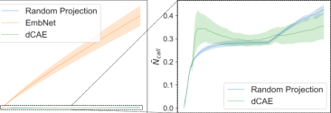

Figure 14: _N_ ¯ _call_ of all memories in _DE_ when
_δ_ = 0 _._ 013 according to design choice for _fϕ_ .

In Figure 14 which shows the averaged number .
of memory recall ( _N_ ¯ _call_ of EmbNet significantly increases as training proceeds. On the other hand, dCAE was able to _N_ [¯] _call_ ) of all memories in _DE_,
prevent this problem and recalled the proper memories in the early learning phase, achieving good
training efficiency. Thus, embedding with dCAE can leverage a wide area of memory in _DE_ and
becomes robust to hyperparameter _δ_ .

(a) _δ_ = 1 _._ 3 _e_ _[−]_ [7] (b) _δ_ = 1 _._ 3 _e_ _[−]_ [5] (c) _δ_ = 1 _._ 3 _e_ _[−]_ [3] (d) _δ_ = 1 _._ 3 _e_ _[−]_ [2]

Figure 15: Parametric studies for _δ_ on 3s_vs_5z SMAC map.

(a) _δ_ = 1 _._ 3 _e_ _[−]_ [7] (b) _δ_ = 1 _._ 3 _e_ _[−]_ [5] (c) _δ_ = 1 _._ 3 _e_ _[−]_ [3] (d) _δ_ = 1 _._ 3 _e_ _[−]_ [2]

Figure 16: Parametric studies for _δ_ on 5m_vs_6m SMAC map.

20

Published as a conference paper at ICLR 2024

D.3 COMPARATIVE EVALUATION ON ADDITIONAL STARCRAFT II MAPS

Figure 17 presents a comparative evaluation of EMU with baseline algorithms on additional SMAC
maps. Adopting EMU shows performance gain in various tasks.

Figure 17: Performance comparison of EMU against baseline algorithms on additional SMAC maps.

D.4 COMPARISON OF EMU WITH MAPPO ON SMAC

In this subsection, we compare the EMU with MAPPO (Yu et al., 2022) on selected SMAC maps.
Figure 18 shows the performance in six SMAC maps: 1c3s5z, 3s_vs_5z, 5m_vs_6m, MMM2,
6h_vs_8z and 3s5z_vs_3s6z. Similar to the previous performance evaluation in Figure 4,
Win-rate is computed with 160 samples: 32 episodes for each training random seed and 5 different
random seeds. Also, for MAPPO, scenario-dependent hyperparameters are adopted from their original
settings in the uploaded source code.

From Figure 18, we can see that EMU performs better than MAPPO with an evident gap. Although
after extensive training MAPPO showed a comparable performance against off-policy algorithm
in its original paper (Yu et al., 2022), within the same training timestep used for our experiments,
we found that MAPPO suffers from local convergence in super hard SMAC tasks such as MMM2
and 3s5z_vs_3s6z as shown in Figure 18. Only in 6h_vs_8z, MAPPO shows comparable
performance to EMU (QPLEX) with higher performance variance across different seeds.

Figure 18: Performance comparison with MAPPO on selected SMAC maps.

21

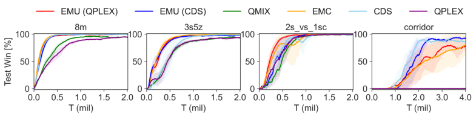

Published as a conference paper at ICLR 2024

D.5 ADDITIONAL PARAMETRIC STUDY

In this subsection, we conduct an additional parametric study to see the effect of key hyperparameter _δ_ . Unlike the previous parametric study on Appendix D.2, we adopt both dCAE embedding network for _fϕ_ and episodic reward. For evaluation, we consider three GRF tasks such
as academy_3_vs_1_with_keeper (3_vs_1WK), academy_counterattack_easy
(CA-easy), and academy_counterattack_hard (CA-hard); and one **super hard** SMAC
map such as 6h_vs_8z. For each task to evaluate EMU, four _δ_ values, such as _δ_ 1 = 1 _._ 3 _e_ _[−]_ [7],
_δ_ 2 = 1 _._ 3 _e_ _[−]_ [5], _δ_ 3 = 1 _._ 3 _e_ _[−]_ [3], and _δ_ 4 = 1 _._ 3 _e_ _[−]_ [2], are considred. Here, to compute the win-rate, 160
samples (32 episodes for each training random seed and 5 different random seeds) are used for
3_vs_1WK and 6h_vs_8z while 100 samples (20 episodes for each training random seed and 5
different random seeds) are used for CA-easy and CA-hard. Note that CDS and EMU (CDS)
utilize the same hyperparameters, and EMC and EMU (QPLEX) use the same hyperparameters
without a curiosity incentive presented in Zheng et al. (2021) as the model without it showed the
better performance when utilizing episodic control.

(a) 3_vs_1WK (GRF) (b) CA-easy (GRF) (c) CA-hard (GRF) (d) 6h_vs_8z (SMAC)

Figure 19: Parametric studies for _δ_ on various GRF maps and **super hard** SMAC map.

In all cases, EMU with _δ_ 3 = 1 _._ 3 _e_ _[−]_ [3] shows the best performance. The tasks considered here are all
complex multi-agent tasks, and thus adopting a proper value of _δ_ benefits the overall performance
and achieves the balance between exploration and exploitation by recalling the semantically similar
memories from episodic memory. The optimal value of _δ_ 3 is consistent with the determination logic
on _δ_ in a memory efficient way presented in Appendix F.

D.6 ADDITIONAL PARAMETRIC STUDY ON _λrcon_

Additionally, we conduct a parametric study for _λrcon_ in Eq. 5. For each task, EMU with five _λrcon_
values, such as _λrcon,_ 0 = 0 _._ 01, _λrcon,_ 1 = 0 _._ 1, _λrcon,_ 2 = 0 _._ 5, _λrcon,_ 3 = 1 _._ 0 and _λrcon,_ 4 = 10, are
evaluated. Here, to compute the win-rate of each case, 160 samples (32 episodes for each training
random seed and 5 different random seeds) are used. From Figure 20, we can see that broad range of

(a) 3s5z (SMAC) (b) 3s_vs_5z (SMAC)

Figure 20: Parametric study for _λrcon_ .

_λrcon ∈_ �0 _._ 1 _,_ 0 _._ 5 _,_ 1 _._ 0� work well in general. However, with large _λrcon_ as _λrcon,_ 4 = 10, we can
observe that some performance degradation at the early learning phase in 3s5z task. This result is
in line with the learning trends of Case 1 and Case 2 of 3s5z in Figure 23, which do not consider
prediction loss and only take into account the reconstruction loss. Thus, considering both prediction
loss and reconstruction loss as Case 4 in Eq. 5 with proper _λrcon_ is essential to optimize the overall
learning performance.

22

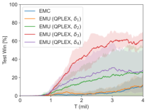

Published as a conference paper at ICLR 2024

D.7 ADDITIONAL ABLATION STUDY IN GRF

(a) 3_vs_1WK (GRF) (b) CA-easy (GRF)

Figure 21: Ablation studies on episodic incentive on GRF tasks.

In this subsection, we conduct additional ablation studies via GRF tasks to see the effect of episodic
incentive. Again, EMU (CDS-No-EI) ablates episodic incentive from EMU (CDS) and utilizes the
conventional episodic control presented in Eq. 3 instead. Again, EMU (CDS-No-SE) ablates semantic
embedding by dCAE and adopts random projection with episodic incentive _r_ _[p]_ . In both tasks, utilizing
episodic memory with the proposed embedding function improves the overall performance compared
to the original CDS algorithm. By adopting episodic incentives instead of conventional episodic
control, EMU (CDS) achieves better learning efficiency and rapidly converges to optimal policies
compared to EMU (CDS-No-EI).

D.8 ADDITIONAL ABLATION STUDY ON EMBEDDING LOSS

In our case, the autoencoder uses the reconstruction loss to enforce the embedded representation _x_
to contain the full information of the original feature, _s_ . We are adding ( _Ht −_ _fψ_ _[H]_ [(] _[f][ϕ]_ [(] _[s][t][|][t]_ [)] _[|][t]_ [))][2][ to]
guide the embedded representation to be consistent to _Ht_, as well, which works as a regularizer to
the autoencoder. Therefore, _fψ_ _[H]_ [is used in Eq. 5 to predict the observed] _[ H][t]_ [ from] _[ D][E]_ [ as a part of the]
semantic regularization effort.

Because _Ht_ is different from _fψ_ _[H]_ [(] _[x][t]_ [)][, the effort of minimizing their difference becomes the regularizer]
creating a gradient signal to learn _ψ_ and _ϕ_ . The update of _ϕ_ results in the updated _x_ influenced by the
regularization. Note that we update _ϕ_ through the backpropagation of _ψ_ .

The case of _L_ ( _ϕ, ψ_ ) = _||st −_ _fψ_ _[s]_ [(] _[f][ϕ]_ [(] _[s][t][|][t]_ [)] _[|][t]_ [)] _[||]_ 2 [2] [occurs when] _[ λ][rcon]_ [becomes relatively much higher]
than 1, which makes ( _Ht −_ _fψ_ _[H]_ [(] _[f][ϕ]_ [(] _[s][t][|][t]_ [)] _[|][t]_ [))][2][ becomes ineffective. In other words, when] _[ λ][rcon]_ [ in Eq.]
5 becomes relatively much higher than 1, ( _Ht −_ _fψ_ _[H]_ [(] _[f][ϕ]_ [(] _[s][t][|][t]_ [)] _[|][t]_ [))][2][ becomes ineffective.]

The case of _L_ ( _ϕ, ψ_ ) = ( _Ht_ _−fψ_ _[H]_ [(] _[f][ϕ]_ [(] _[s][t][|][t]_ [)] _[|][t]_ [))][2][ occurs when the scale factor] _[ λ][rcon]_ [ becomes relatively]
much smaller than 1, which makes ( _Ht −_ _fψ_ _[H]_ [(] _[f][ϕ]_ [(] _[s][t][|][t]_ [)] _[|][t]_ [))][2][ become a dominant factor. We conduct]
ablation studies considering four cases as follows:

    - **Case 1:** _L_ ( _ϕ, ψ_ ) = _||st −_ _fψ_ _[s]_ [(] _[f][ϕ]_ [(] _[s][t]_ [))] _[||]_ 2 [2][, presented in Figure 22(a)]

    - **Case 2:** _L_ ( _ϕ, ψ_ ) = _||st −_ _fψ_ _[s]_ [(] _[f][ϕ]_ [(] _[s][t][|][t]_ [)] _[|][t]_ [)] _[||]_ 2 [2][, presented in Figure 22(b)]

    - **Case 3:** _L_ ( _ϕ, ψ_ ) = ( _Ht −_ _fψ_ _[H]_ [(] _[f][ϕ]_ [(] _[s][t][|][t]_ [)] _[|][t]_ [))][2][, presented in Figure 22(c)]

    - **Case 4:** _L_ ( _ϕ, ψ_ ) = ( _Ht −_ _fψ_ _[H]_ [(] _[f][ϕ]_ [(] _[s][t][|][t]_ [)] _[|][t]_ [))][2][ +] _[ λ][rcon][||][s][t][ −]_ _[f]_ _ψ_ _[ s]_ [(] _[f][ϕ]_ [(] _[s][t][|][t]_ [)] _[|][t]_ [)] _[||]_ 2 [2][, i.e., Eq. 5,]
presented in Figure 22(d)

We visualize the result of t-SNE of 50K samples _x ∈_ _DE_ out of 1M memory data trained by various
loss functions: The task was 3s_vs_5z of SMAC as in Figure 2 and the training for all models
proceeds for 1.5mil training steps. Case 1 and Case 2 showed irregular return distribution across the
embedding space. In those two cases, there was no consistent pattern in the reward distribution. Case
3 with only return prediction in the loss showed better patterns compared to Case 1 and 2 but some
features are not clustered well. We suspect that the consistent state representation also contributes
to the return prediction. Case 4 of our suggested loss showed the most regular pattern in the return
distribution arranging the low-return states as a cluster and the states with desirable returns as another

23

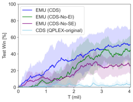

Published as a conference paper at ICLR 2024

(a) Loss (case 1) (b) Loss (case 2) (c) Loss (case 3) (d) Loss (case 4)

Figure 22: t-SNE of sampled embedding _x ∈_ _DE_ trained by dCAE with various loss functions in
3s_vs_5z SMAC map. Colors from red to purple represent from low return to high return.

cluster. In Figure 23, Case 4 shows the best performance in terms of both learning efficiency and
terminal win-rate.

(a) 3s5z (SMAC) (b) 3s_vs_5z (SMAC)

Figure 23: Performance comparison of various loss functions
for dCAE.

24

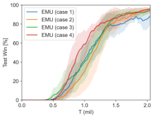

Published as a conference paper at ICLR 2024

D.9 ADDITIONAL ABLATION STUDY ON SEMANTIC EMBEDDING

To further understand the role of semantic embedding, we conduct additional ablation studies and
present them with the general performance of other baseline methods. Again, EMU (CDS-No-SE)
ablates semantic embedding by dCAE and adopts random projection instead, along with episodic
incentive _r_ _[p]_ .

Figure 24: Performance comparison of EMU against baseline algorithms on three **easy and hard**
SMAC maps: 1c3s5z, 3s_vs_5z, and 5m_vs_6m, and three **super hard** SMAC maps: MMM2,
6h_vs_8z, and 3s5z_vs_3s6z.

Figure 25: Performance comparison of EMU against baseline algorithms on Google Research
Football.

For relatively easy tasks, EMU (QPLEX-No-SE) and EMU (CDS-No-SE) show comparable performance at first but they converge on sub-optimal policy in most tasks. Especially, this characteristic is
well observed in the case of EMU (CDS-No-SE). As large size of memories are stored in an episodic
buffer as training goes on, the probability of recalling similar memories increases. However, with
random projection, semantically incoherent memories can be recalled and thus it can adversely affect
the value estimation. We deem this is the reason for the convergence on suboptimal policy in the case
of EMU (No-SE). Thus we can conclude that recalling semantically coherent memory is an essential
component of EMU.

25

Published as a conference paper at ICLR 2024

D.10 ADDITIONAL ABLATION ON _r_ _[c]_

In Eq.10, we introduce _r_ _[c]_ as an additional reward which may encourage exploratory behavior or
coordination. The reason we introduce _r_ _[c]_ is to show that EMU can be used in conjunction with
any form of incentive encouraging further exploration. Our method may not be strongly effective
until some desired states are found, although it has exploratory behavior via the proposed semantic
embeddings, controlled by _δ_ . Until then, such incentives could be beneficial to find desired or goal
states. Figures 26-27 show the ablation study of with and without _r_ _[c]_, and the contribution of _r_ _[c]_ is
limited compared to _r_ _[p]_ .

(a) 3s_vs_5z (b) 5m_vs_6m (c) 3s5z_vs_3s6z

Figure 26: Ablation studies on _r_ _[c]_ in SMAC tasks.

(a) 3s_vs_5z (b) 5m_vs_6m (c) 3s5z_vs_3s6z

Figure 27: Ablation studies on _r_ _[c]_ in SMAC tasks.

D.11 COMPARISON OF EPISODIC INCENTIVE WITH EXPLORATORY INCENTIVE

In this subsection, we replace the episodic incentive with another exploratory incentive, introduced
by (Henaff et al., 2022). In (Henaff et al., 2022), the authors extend the count-based episodic bonuses
to continuous spaces by introducing episodic elliptical bonuses for exploration. In this concept, a
high reward is given when the state projected in the embedding space is different from the previous
states within the same episode. In detail, with a given feature encoder _ϕ_, the elliptical bonus _bt_ at
timestep _t_ is computed as follows:

_bt_ = _ϕ_ ( _st_ ) _[T]_ _Ct_ _[−]_ [1] _ϕ_ ( _st_ ) (18)

where _Ct_ _[−]_ [1] is an inverse covariance matrix with an initial value of _Ct_ _[−]_ =0 [1] [= 1] _[/λ][e]_ [3] _[b]_ _**[I]**_ [. Here,] _[ λ][e]_ [3] _[b]_ [ is]
a covariance regularizer. For update inverse covariance, the authors suggested a computationally
efficient update as

1
_Ct_ _[−]_ +1 [1] [=] _[ C]_ _t_ _[−]_ [1] _−_ 1 + _bt_ +1 _uu_ _[T]_ (19)

where _u_ = _Ct_ _[−]_ [1] _ϕ_ ( _st_ +1). Then, the final reward ¯ _rt_ with episodic elliptical bonuses _bt_ is expressed as

_r_ ¯ _t_ = _rt_ + _βe_ 3 _bbt_ (20)

where _βe_ 3 _b_ and _rt_ are a corresponding scale factor and external reward given by the environment,
respectively.

For this comparison, we utilize the dCAE structure as a state embedding function _ϕ_ . For a mixer,
QPLEX (Wang et al., 2020b) is adopted for all cases, and we denote the case with an elliptical
incentive instead of the proposed episodic incentive as QPLEX (SE+E3B). Figure 28 illustrates

26

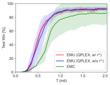

Published as a conference paper at ICLR 2024

Figure 28: Performance comparison with elliptical incentive on selected SMAC maps.

the performance of adopting an elliptical incentive for exploration instead of the proposed episodic
incentive. QPLEX (SE+E3B) uses the same hyperparameters with EMU (SE+EI) and we set
_λe_ 3 _b_ = 0 _._ 1 according to Henaff et al. (2022).

As illustrated by Figure 28, adopting an elliptical incentive presented by (Henaff et al., 2022) instead
of an episodic incentive does not give any performance gain and even adversely influences the
performance compared to QPLEX. It seems that adding excessive surprise-based incentives can be a
disturbance in MARL tasks since finding a new state itself does not guarantee better coordination
among agents. In MARL, agents need to find the proper combination of joint action in a given
similar observations when finding an optimal policy. On the other hand, in high-dimensional pixelbased single-agent tasks such as Habitat (Ramakrishnan et al., 2021), finding a new state itself
can be beneficial in policy optimization. From this, we can note that adopting a certain algorithm
from a single-agent RL case to MARL case may require a modification or adjustment with domain
knowledge.

As a simple tuning, we conduct parametric study for _βe_ 3 _b_ = _{_ 0 _._ 01 _,_ 0 _._ 1 _}_ to adjust magnitude of
incentive of E3B. Figure 29 illustrates the results. In Figure 29, QPLEX (SE+E3B) with _βe_ 3 _b_ = 0 _._ 01
shows a better performance than the case with _βe_ 3 _b_ = 0 _._ 1 and comparable performance to EMC
in 5m_vs_6m. However, EMU with the proposed episodic incentive shows the best performance.
From this comparison, we can see that incentives proposed by previous work need to be adjusted

Figure 29: Performance comparison with an elliptical incentive on selected SMAC maps.

according to the type of tasks, as it was done in EMC (Zheng et al., 2021). On the other hand, with
the proposed episodic incentive we do not need such hyperparameter-scaling, allowing much more
flexible application across various tasks.

27

Published as a conference paper at ICLR 2024

D.12 ADDITIONAL TOY EXPERIMENT AND APPLICABILITY TESTS

In this section, we conduct additional experiments on the didactic example presented by (Zheng et al.,
2021) to see how the proposed method would behave in a simple but complex coordination task.
Additionally, by defining _Rthr_ to define the desirability presented in Definition 1, we can extend
EMU to a single-agent RL task, where a strict goal is not defined in general.

**Didactic experiment on Gridworld** We adopt the didactic example such as gridworld environment
from (Zheng et al., 2021) to demonstrate the motivation and how the proposed method can overcome
the existing limitations of the conventional episodic control. In this task, two agents in gridworld (see
Figure 30(a)) need to reach their goal states at the same time to get a reward _r_ = 10 and if only one
arrives first, they get a penalty with the amount of _−p_ . Please refer to (Zheng et al., 2021) for further
details.

**Wall**

(a) Gridworld (b) Performance evaluation ( _p_ = 2)

Figure 30: Didactic experiments on gridworld.

To see the sole effect of the episodic control, we discard the curiosity incentive part of EMC, and for
a fair comparison, we set the same exploration rate of _ϵ_ -greedy with _Tϵ_ = 200 _K_ for all algorithms.
We evaluate the win-rate with 180 samples (30 episodes for each training random seed and 6 different
random seeds) at each training time. Notably, adopting episodic control with a naive utilization
suffers from local convergence (see QPLEX and EMC (QPLEX) in Figure 30(b)), even though it
expedites learning efficiency at the early training phase. On the other hand, EMU shows more robust
performance under different seed cases and achieves the best performance by an efficient and discreet
utilization of episodic memories.

**Applicability test to single agent RL task** We first need to define _Rthr_ value to effectively apply
EMU to a single-agent task where a goal of an episode is generally not strictly defined, unlike
cooperative multi-agent tasks with a shared common goal.

In a single-agent task where the action space is continuous such as MuJoCo (Todorov et al., 2012),
the actor-critic method is often adopted. Efficient memory utilization of EMU can be used to train
the critic network and thus indirectly influence policy learning, unlike general cooperative MARL
tasks where value-based RL is often considered.

We implement EMU on top of TD3 and use the open-source code presented in (Fujimoto et al., 2018).
We begin to train the model after sufficient data is stored in the replay buffer and conduct **6 times of**
**training per episode with 256 mini-batches.** Note that this is different from the default settings of
RL training, which conducts training at each timestep. Our modified setting aims to see the effect on
the sample efficiency of the proposed model. The performance of the trained model is evaluated at
every 50k timesteps.

We use the same hyperparameter settings as in MARL task presented in Table 8 except for the
update interval, _temb_ = 100 _K_ according to large episodic timestep in single-RL compared to
MARL tasks. It is worth mentioning that additional customized parameter settings for single-agent
tasks may further improve the performance. In our evaluation, three single-agent tasks such as
Hopper-v4, Walker2D-v4 and Humanoid-v4 are considered, and Figure 32 illustrates each
task. Here, _δ_ 2 = 1 _._ 3 _e −_ 5 is used for Hopper-v4 and Walker2D-v4, and _δ_ 3 = 1 _._ 3 _e −_ 3 is
used for Humanoid-v4 as Humanoid-v4 task contains much higher state dimension space as
376-dimension. Please refer to Todorov et al. (2012) for a detailed description of tasks.

28

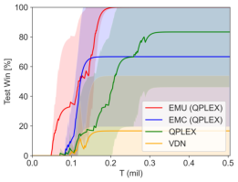

Published as a conference paper at ICLR 2024

(a) Hopper-v4 (b) Walker2D-v4 (c) Humanoid-v4

Figure 31: Illustration of MuJoCo scenarios.

(a) Performance (Hopper) (b) Performance (Walker2D) (c) Performance (Humanoid)

Figure 32: Applicability test to single agent task ( _Rthr_ = 500).

In Figure 32, EMU (TD3) shows the performance improvement compared to the original TD3.
Thanks to semantically similar memory recall and episodic incentive, states deemed desirable could
have high values, and trained policy is encouraged to visit them more frequently. As a result, EMU
(TD3) shows the better performance. Interestingly, under state dimension as Humanoid-v4 task,
TD3 and EMU (TD3) show a distinct performance gap in the early training phase. This is because,
in a task with a high-dimensional state space, it is hard for a critic network to capture important
features determining the value of a given state. Thus, it takes longer to estimate state value accurately.
However, with the help of semantically similar memory recall and error compensation through
episodic incentive, a critic network in EMU (TD3) can accurately estimate the value of the state much
faster than the original TD3, leading to faster policy optimization.

Unlike cooperative MARL tasks, single-RL tasks normally do not have a desirability threshold. Thus,
one may need to determine _Rthr_ based on domain knowledge or a preference for the level of return
to be deemed successful. Figure 33 presents a performance variation according to _Rthr_ .

(a) Hopper-v4 (b) Walker2d-v4

Figure 33: Parametric study on _Rthr_ .
When we set _Rthr_ = 1000 in Walker2d task, desirability signal is rarely obtained compared to the
case with _Rthr_ = 500 in the early training phase. Thus, EMU with _Rthr_ = 500 shows the better
performance. However, both cases of EMU show better performance compared to the original TD3.
In Hopper task, both cases of _Rthr_ = 500 and _Rthr_ = 1000 show the similar performance. Thus,

29

Published as a conference paper at ICLR 2024

when determining _Rthr_, it can be beneficial to set a small value rather than a large one that can be
hardly obtained.

Although setting a small _Rthr_ does not require much domain knowledge, a possible option to detour
this is a periodic update of desirability based on the average return value _H_ ( _s_ ) in all _s ∈DE_ . In this
way, a certain state with low return which was originally deemed as _desirable_ can be reevaluated as
_undesirable_ as training proceeds. The episodic incentive is not further given to those undesirable

states.

**Scalability to image-based single-agent RL task** Although MARL tasks already contain highdimension state space such as 322-dimension in MMM2 and 282-dimension in corridor, imagebased single RL tasks, such as Atari Bellemare et al. (2013) game, often accompany higher state
spaces such as [210x160x3] for "RGB" and [210x160] for "grayscale". We use the "grayscale" type
for the following experiments. For the details of the state space in MARL task, please see Appendix
C.3.

In an image-based task, storing all state values to update all the key values in _DE_ as _fϕ_ updates can be
memory-inefficient, and a semantic embedding from original states may become overhead compared
to the case without it. In such case, one may resort to a pre-trained feature extraction model such
as ResNet model provided by torch-vision in a certain amount for dimension reduction only, before
passing through the proposed semantic embedding. The feature extraction model above is not an
object of training.

As an example, we implement EMU on the top of DQN model and compare it with the original
DQN on Atari task. For the EMU (DQN), we adopt some part of pre-trained ResNet18 presented
by torch-vision for dimensionality reduction, before passing an input image to semantic embedding.
At each epoch, 320 random samples are used for training in Breakout task, and 640 random
samples are used in Alien task. The same mini-batch size of 32 is used for both cases. For
_fϕ_ training, the same parameters presented in Table 8 are adopted except for the _temb_ = 10 _K_
considering the timestep of single RL task. We also use the same _δ_ 2 = 1 _._ 3 _e −_ 5 and set _Rthr_ = 50
for Breakout and _Rthr_ = 40 for Alien, respectively. Please refer to Bellemare et al. (2013) and
https://gymnasium.farama.org/environments/atari for task details. As in Figure
34, we found a performance gain by adopting EMU on high-dimensional image-based tasks.

(a) Breakout (b) Performance (Breakout) (c) Alien (d) Performance (Alien)

Figure 34: Image-based single-RL task example.

30

Published as a conference paper at ICLR 2024

E TRAINING ALGORITHM

E.1 MEMORY CONSTRUCTION

During the centralized training, we can access the information on whether the episodic return reaches
the highest return _R_ max or threshold _Rthr_, i.e., defeating all enemies in SMAC or scoring a goal in
GRF. When storing information to _DE_, by the definition presented Definition. 1, we set _ξ_ ( _s_ ) = 1 for
_∀s ∈Tξ_ .

For efficient memory construction, we propagate the desirability of the state to a similar state within
the threshold _δ_ . With this desirability propagation, similar states have an incentive for a visit. In
addition, once a memory is saved in _DE_, the memory is preserved until it becomes obsolete (the oldest
memory to be recalled). When a desirable state is found near the existing suboptimal memory within
_δ_, we replace the suboptimal memory with the desirable one, which gives the effect of a memory shift
to the desirable state. Algorithm 2 presents the memory construction with the desirability propagation
and memory shift.

**Algorithm 2** Episodic memory construction

1: _ξT_ : Optimality of trajectory
2: _T_ = _{s_ 0 _,_ _**a**_ **0** _, r_ 0 _, s_ 1 _, ..., sT }_ : Episodic trajectory
3: Initialize _Rt_ = 0
4: **for** _t_ = _T_ to 0 **do**
5: Compute _xt_ = _fϕ_ ( _st_ ) and _yt_ = ( _xt −_ _µ_ ˆ _x_ ) _/σ_ ˆ _x_
6: pick the nearest neighbor ˆ _xt ∈DE_ and get ˆ _yt_ .
7: **if** _||y_ ˆ _t −_ _yt||_ 2 _< δ_ **then**
8: _Ncall_ (ˆ _xt_ ) _←_ _Ncall_ (ˆ _xt_ ) + 1
9: **if** _ξT_ == 1 **then**
10: _Nξ_ (ˆ _xt_ ) _←_ _Nξ_ (ˆ _xt_ ) + 1
11: **end if**
12: **if** _ξt_ == 0 and _ξT_ == 1 **then**
13: _ξt ←_ _ξT_ _▷_ desirability propagation
15:14: _Hx_ ˆˆ _tt ← ←xRt_, _t_ ˆ _yt ←_ _yt_, ˆ _st ←_ _st_ _▷_ memory shift
16: **else**
17: **if** _H_ [ˆ] _t < Rt_ **then** _H_ [ˆ] _t ←_ _Rt_
18: **end if**

19: **end if**

20: **else**
21: Add memory _DE ←_ ( _xt, yt, Rt, st, ξt_ )
22: **end if**

23: **end for**

For memory capacity and latent dimension, we used the same values as Zheng et al. (2021), and
Table 6 shows the summary of hyperparameter related to episodic memory.

Table 6: Configuration of Episodic Memory.

Configuration Value

episodic latent dimension, dim( _x_ ) 4
episodic memory capacity 1M
a scale factor, _λ_
0.1
(for conventional episodic control only)

The memory construction for EMU seems to require a significantly large memory space, especially
for saving global states _s_ . However, _DE_ uses CPU memory instead of GPU memory, and the memory
required for the proposed embedder structure is minimal compared to the memory usage of original

31

Published as a conference paper at ICLR 2024

Table 7: Additional CPU memory usage to save global states.

CPU memory usage (1M data)
SMAC task
(GiB)

5m_vs_6m 0.4
3s5z_vs_3s6z 0.9
MMM2 1.2

RL training (<1%). Thus, a memory burden due to a trainable embedding structure is negligible.
Table 7 presents examples of CPU memory usage to save global states _s ∈DE_ .

E.2 OVERALL TRAINING ALGORITHM

In this section, we present details of the overall MARL training algorithm including training of
_fϕ_ . Additional hyperparameters related to Algorithm 1 to update encoder _fϕ_ and decoder _fψ_ are
presented in Table 8. Note that variables _N_ and _B_ are consistent with Algorithm 1.

Table 8: EMU Hyperparameters for _fϕ_ and _fψ_ training.

Configuration Value

a scale factor of reconstruction loss, _λrcon_ 0.1
update interval, _temb_ 1K
training samples, _N_ 102.4K
batch size of training, _B_ 1024

Algorithm 3 presents the pseudo-code of overall training for EMU. In Algorithm 3, network parameters related to a mixer and individual Q-network are denoted as _θ_, and double Q-learning with target
network is adopted as other baseline methods (Rashid et al., 2018; 2020; Wang et al., 2020b; Zheng
et al., 2021; Chenghao et al., 2021).

**Algorithm 3** EMU: Efficient episodic Memory Utilization for MARL

1: _D_ : Replay buffer
2: _DE_ : Episodic buffer
3: _Q_ _[i]_ _θ_ [: Individual Q-network of] _[ n]_ [ agents]
4: _M_ : Batch size of RL training
5: Initialize network parameters _θ_, _ϕ_, _ψ_
6: **while** _tenv ≤_ _tmax_ **do**
7: Interact with the environment via _ϵ_ -greedy policy based on [ _Q_ _[i]_ _θ_ []] _i_ _[n]_ =1 [and get a trajectory] _[ T]_ [ .]
8: Run Algorithm 2 to update _DE_ with _T_
9: Append _T_ to _D_
10: **for** _k_ = 1 **to** _n_ circle **do**
11: Get _M_ sample trajectories [ _T_ ] _[M]_ _i_ =1 _[∼D]_
12: Run MARL training algorithm using [ _T_ ] _[M]_ _i_ =1 [and] _[ D][E]_ [, to update] _[ θ]_ [ with Eq.10]
13: **end for**
14: **if** _tenv_ mod _temb_ == 0 **then**
15: Run Algorithm 1 to update _ϕ_, _ψ_
16: Update all _x ∈DE_ with updated _fϕ_
17: **end if**

18: **end while**

Here, any CTDE training algorithm can be adopted for MARL training algorithm in line 12 in
Algorithm 3. As we mentioned in Section C.4, training of _fϕ_ and _fψ_ and updating all _x ∈DE_ only

32

Published as a conference paper at ICLR 2024

takes less than two seconds at most under the task with largest state dimension such as corridor.
Thus, the computation burden for trainable embedder is negligible compared to the original MARL
training.

F MEMORY UTILIZATION

A remaining issue in utilizing episodic memory is how to determine a proper threshold value _δ_ in
Eq. 1. Note that this _δ_ is used for both updating the memory and recalling the memory. One simple
option is determining _δ_ based on prior knowledge or experience, such as hyperparameter tuning.
Instead, in this section, we present a more memory-efficient way for _δ_ selection. When computing

ˆ
_||x −_ _x||_ 2 _< δ_, the similarity is compared elementwisely. However, this similarity measure puts
a different weight on each dimension of _x_ since each dimension of _x_ could have a different range
of distribution. Thus, instead of _x_, we utilize the normalized value. Let us define a normalized
embedding _y_ with the statistical mean ( _µx_ ) and variance ( _σx_ ) of _x_ as

_y_ = ( _x −_ _µx_ ) _/σx._ (21)

Here, the normalization is conducted for each dimension of _x_ . Then, the similarity measure via

ˆ
_||y −_ _y||_ 2 _< δ_ with Eq. 21 puts an equal weight to each dimension, as _y_ has a similar range of
distribution in each dimension. In addition, an affine projection of Eq. 21 maintains the closeness
of original _x_ -distribution, and thus we can safely utilize _y_ -distribution instead of _x_ -distribution to
measure the similarity.

In addition, _y_ defined in Eq. 21 nearly follows the normal distribution, although it does not strictly
follow it. This is due to the fact that the memorized samples _x_ in _DE_ do not originate from the same
distribution, nor are they uncorrelated, as they can stem from the same episode. However, we can
achieve an approximate coverage of the majority of the distribution, specifically 3 _σy_ in both positive
and negative directions of _y_, by setting _δ_ as

_δ ≤_ [(][2] _[ ×]_ [ 3] _[σ][y]_ [)][dim(] _[y]_ [)] _._ (22)

_M_

For example, when _M_ = 1 _e_ [6] and dim( _y_ ) = 4, if _σy ≈_ 1 then _δ ≤_ 0 _._ 0013. This is the reason we
select _δ_ = 0 _._ 0013 for the exploratory memory recall.

33

