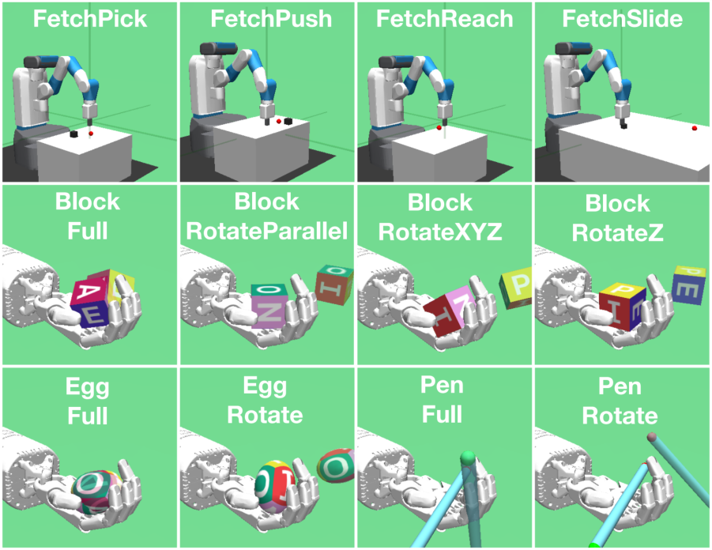

## Quasimetric Value Functions with Dense Rewards

Khadichabonu Valieva

University of Southern Mississippi
Khadichabonu.Valieva@usm.edu

Bikramjit Banerjee
University of Southern Mississippi
Bikramjit.Banerjee@usm.edu

September 16, 2024

**Abstract**

As a generalization of reinforcement learning (RL) to parametrizable goals, goal conditioned RL (GCRL)
has a broad range of applications, particularly in challenging tasks in robotics. Recent work has established
that the optimal value function of GCRL _Q_ _[∗]_ ( _s, a, g_ ) has a quasimetric structure, leading to targetted neural
architectures that respect such structure. However, the relevant analyses assume a sparse reward setting—a
known aggravating factor to sample complexity. We show that the key property underpinning a quasimetric,
viz., the triangle inequality, is preserved under a dense reward setting as well. Contrary to earlier findings
where dense rewards were shown to be detrimental to GCRL, we identify the key condition necessary for
triangle inequality. Dense reward functions that satisfy this condition can only improve, never worsen,
sample complexity. This opens up opportunities to train efficient neural architectures with dense rewards,
compounding their benefits to sample complexity. We evaluate this proposal in 12 standard benchmark
environments in GCRL featuring challenging continuous control tasks. Our empirical results confirm that
training a quasimetric value function in our dense reward setting indeed outperforms training with sparse
rewards.

### **1 Introduction**

Reinforcement learning (RL) is a popular class of techniques for training autonomous agents to behave (near)optimally, often without requiring a model of the task or environment. In goal-achieving tasks, traditional
RL learns policies that reach a single goal at the minimum (maximum) expected cost (value) from any state.
Contrastingly in multi-task settings, a goal conditioned value function models the cost-to-go to a _set of goal_
_states_, not just one. This generalization from a single-goal case to goal-conditioned RL (GCRL) yields effective representations—powered by deep neural networks—for value functions capable of capturing abstract
concepts underlying goal achievement in many complex tasks (M. Liu et al., 2022; Plappert et al., 2018;
Wang et al., 2023).
Recent work has established that the true optimal value function in GCRL is always a _quasimetric_, i.e., a
metric without the constraint of being symmetric, but crucially respecting the triangle inequality (B. Liu et al.,
2023; Pitis et al., 2020; Wang & Isola, 2022). This allows the search for value functions to be naturally restricted to the space of quasimetrics. Additionally, such functions are designed to be _universal value function_
_approximators_ (UVFA), i.e., capable of approximating arbitrarily complex value functions. Accordingly, B.
Liu et al. (2023) propose the metric residual network (MRN) architecture for GCRL value functions that
explicitly accommodate an asymmetric component while maintaining the UVFA property and the triangle
inequality. This and other similar approaches search a smaller subset of the space of value functions, yet the

1

true optimal value function is guaranteed to reside in it. This has led to significant gains in terms of sample
efficiency in recent GCRL advancements (B. Liu et al., 2023; Wang & Isola, 2022; Wang et al., 2023).
In this paper, we review some of the theoretical analyses underlying much of the work cited above. In
particular, the proof of the key property of triangle inequality in B. Liu et al. (2023) is established for a
_sparse reward_ setting that is easy to design but hard to learn from. By contrast, _dense reward_ settings using
various mechanisms, e.g., reward shaping, intrinsic motivation, human feedback etc., are generally known to
improve sample efficiency. If dense reward-based value functions were to satisfy the triangle inequality, then
their reward bias could be combined with the representational bias of quasimetrics to deliver a double punch
to sample complexity. However, existing negative results (Plappert et al., 2018) specifically in GCRL show
that dense rewards significantly deteriorate the performance of state-of-the-art RL methods, and might appear
to foreclose a discussion on their efficacy in GCRL. Contradictorily, we show that dense rewards can indeed
bring their benefit to bear in GCRL as long as they satisfy a condition under which the triangle inequality
is preserved for the _optimal_ value function. Furthermore, we establish a condition under which the triangle
inequality is preserved for _on-policy_ value functions that may be encountered during RL iterations. This
result adds nuance to recent contradictory finding (Wang et al., 2023) that on-policy value functions do _not_
satisfy the triangle inequality. We show experiments in 12 benchmark GCRL tasks to establish that dense
rewards indeed improve sample complexity in some tasks, but never deteriorate sample efficiency in any task.
Our main contributions can be summarized as:

  - We show that using rewards shaped with potential functions that serve as admissible heuristics, the
optimal value function does satisfy the triangle inequality;

  - We define and delineate a progressive criterion for GCRL policies and show that under such policies
the on-policy value function satisfies the triangle inequality;

  - Via experiments in 12 standard benchmark GCRL tasks, we show that dense rewards improve sample
complexity as well as the learned policy in 4 of the 12 tasks, while not deteriorating performance in
any task.

### **2 Background**

This section covers the preliminaries on goal conditioned RL, the prevalent solution approaches for GCRL,
and the recent architecture of metric residual networks that we use in this paper.

**2.1** **Goal-conditioned RL**

Goal conditioned RL is modeled by goal-conditioned Markov decision process, _M_ = ( _S, A, G, T, R, γ, ρ_ 0 _, ρG_ ).
While _S, A, T, ρ_ 0 define the state action spaces, the transition function and the initial state distribution just
like a standard MDP, _G_ gives the space of goal states, and _ρG_ is the distribution from which a goal is sampled at the beginning of an episode. Further, the reward function _R_ is additionally parametrized by the goal,
_R_ : _S × A × G �→ℜ_ . In the _sparse reward_ setting, _R_ is often defined as

_R_ ( _s, a, g_ ) =

0 if _M_ ( _s, a_ ) = _g_
(1)
_−_ 1 otherwise
�

where _M_ : _S × A �→G_ maps the product space of _S_ and _A_ to _G_ . As opposed to the common assumption
_G ⊂S_, _M_ allows action _a_ to decide whether the goal is reached (B. Liu et al., 2023).

2

**2.2** **Solution Approach: DDPG+HER**

A popular approach to solving GCRL is a combination of off-policy actor-critic, e.g., DDPG (Lillicrap et al.,
2016) with hindsight experience replay (HER) (Andrychowicz et al., 2017). DDPG in GCRL estimates a
goal conditioned critic

�

_Q_ _[π]_ ( _s, a, g_ ) = E

_∞_
� _γ_ _[t]_ _rt,g|s_ 0 = _s, a_ 0 = _a, g_
� _t_ =0

where the expectation is taken over future steps of rewards generated by the policy ( _π_ ), and the _T, R_ functions.
The critic is updated by minimizing the mean squared TD error over samples ( _st, at, st_ +1 _, g_ ) drawn from a
replay buffer _D_,
_L_ ( _Q_ ) = E �( _rt,g_ + _γQ_ ( _st_ +1 _, π_ ( _st_ +1) _, g_ ) _−_ _Q_ ( _st, at, g_ )) [2][�] _._ (2)

By ensuring that _Q_ is differentiable w.r.t. actions _a_, the actor policy _π_ is updated in the direction of the
gradient E[ _∇atQ_ ( _st, at, g_ )], where the expectation is again evaluated using samples drawn from _D_ . As these
samples are drawn from state distributions generated by policies different from _π_, DDPG is an off-policy
method, although it estimates Q-values in an on-policy way (Eq. 2). This last aspect will be scrutinized
further in Sec. 3.2.

Hindsight experience replay (HER) (Andrychowicz et al., 2017) mitigates the sparse reward problem by
relabeling failed trajectories. Instead of treating all experience traces where the agent failed to achieve a goal
as is, HER changes the goal in some of them to match a step of the trace in hindsight—essentially pretending
as if the agent’s goal all along was to reach the state that it actually did. This transforms some of the failed
episodes into successful experiences that are informative about goal achievement, and allows the agent to
generalize, eventually, to the true goal distribution _ρG_ .

**2.3** **Metric Residual Network**

B. Liu et al. (2023) propose a novel neural architecture for GCRL critic based on the insight that the optimal
negated action-value function, _−Q_ _[∗]_ ( _s, a, g_ ), satisfies the triangle inequality _in the sparse reward setting_
of Eq. 1. Consequently, they introduce the metric residual network (MRN) that decomposes _−Q_ into the
sum of a metric and an asymmetric residual component that provably approximates any quasipseudometric.
Specifically,
_Q_ ( _s, a, g_ ) = _−_ ( _dsym_ ( _hsa, hsg_ ) + _dasym_ ( _hsa, hsg_ )) (3)

where _hsa_ and _hsg_ are latent encodings of concatenated ( _s, a_ ) and ( _s, g_ ), _dsym_ and _dasym_ are symmetric and
asymmetric distance components given by

_dsym_ ( _x, y_ ) = _∥µ_ 1( _x_ ) _−_ _µ_ 1( _y_ ) _∥,_ (4)

_dasym_ ( _x, y_ ) = max (5)
_i_ [(] _[µ]_ [2] _[i]_ [(] _[x]_ [)] _[ −]_ _[µ]_ [2] _[i]_ [(] _[y]_ [))][+] _[,]_

_µ_ 1 and _µ_ 2 are neural networks. The provable UVFA property of MRNs is due to _dasym_, while _dsym_ improves
sample efficiency due to its symmetry. We use DDPG+HER with MRN critic architecture as the base GCRL
method for this paper.

### **3 Triangle Inequality**

In this section, we establish that both the optimal value function as well as on-policy value functions satisfy
the triangle inequality under novel conditions.

3

**3.1** **Optimal Value Function**

Our primary claim is that _−Q_ _[∗]_ satisfies the triangle inequality not only in the sparse reward setting, but also
in the presence of dense rewards, particularly potential shaped rewards. This observation lends GCRL to
improved sample efficiency when approximating _−Q_ _[∗]_ using a combination of MRN and potential shaped
rewards.

We use the standard potential based shaping rewards

_F_ ( _s, a, s_ _[′]_ _, a_ _[′]_ _, g_ ) = _γϕ_ ( _s_ _[′]_ _, a_ _[′]_ _, g_ ) _−_ _ϕ_ ( _s, a, g_ ) (6)

and a simple potential function

1 _−_ _γd_ ( _s,a,g_ ) _/η_
_ϕ_ ( _s, a, g_ ) = _−_
� 1 _−_ _γ_

�

where _d_ is a distance measure between the state and the goal, and _η_ is a measure of the atomicity of actions—
distance covered per time step. Note that in the reward regime of Eq. 1,

1 _−_ _γL∗_
_Q_ _[∗]_ ( _s, a, g_ ) = _−_
� 1 _−_ _γ_

�

where _L_ _[∗]_ is the _optimal_ expected number of steps required to reach the goal _g_ from state _s_ .

**Observation 1.** _If d_ ( _s, a, g_ ) _≤_ _ηL_ _[∗]_ _, then ϕ_ ( _s, a, g_ ) _≥_ _Q_ _[∗]_ ( _s, a, g_ ) _, ∀s, a, g_

In other words, if _d_ ( _s, a, g_ ) _/η_ is an underestimate of _L_ _[∗]_ then the above condition will be satisfied.
Thus, _d_ acts as an admissible heuristic. For this paper, we choose a simple arc-cosine distance _d_ ( _s, a, g_ ) =

_M_ ( _s,a_ ) _·g_
cos _[−]_ [1][ �] _∥M_ ( _s,a_ ) _∥∥g∥_ � _/π_, which is known to be a metric. Here _M_ is defined in the context of Eq. 1. However,
this choice is not necessary for our theoretical results to hold. Rather, it is prompted by its boundedness and
our desire to avoid intricate, environment-specific reward engineering.
We distinguish _Q_ _[∗]_ ( _s, a, g_ )—the optimal action values with unshaped sparse rewards—from _Q_ _[∗]_ _F_ [(] _[s, a, g]_ [)]
which corresponds to action values with rewards shaped by _F_ in Eq. 6. Next we establish the validity of
triangle inequality with _Q_ _[∗]_ _F_ [in two cases: (i)] _[ G ≡S × A]_ [ and (ii)] _[ G ̸≡S × A]_ [.]

**3.1.1** **Case I:** _G ≡S × A_

In this setting, _M_ is the identity mapping. We use the notation _xt_ = ( _st, at_ ). The main result is:

**Proposition 1.** _Consider the shaped, goal-conditioned MDP MGCF_ = ( _S, A, G, T, R_ + _F, γ, ρ_ 0 _, ρg_ ) _, with_
_G ≡S × A. The optimal universal value function Q_ _[∗]_ _F_ _[satisfies the triangle inequality:][ ∀][x]_ [1] _[, x]_ [2] _[, x]_ [3] _[ ∈X]_ _[,]_

_Q_ _[∗]_ _F_ [(] _[x]_ [1] _[, x]_ [2][) +] _[ Q][∗]_ _F_ [(] _[x]_ [2] _[, x]_ [3][)] _[ ≤]_ _[Q][∗]_ _F_ [(] _[x]_ [1] _[, x]_ [3][)] _[,]_

_The only condition ϕ must satisfy is_

_ϕ_ ( _s, a, g_ ) _≥_ _Q_ _[∗]_ ( _s, a, g_ ) _, ∀s, a, g_ (7)

_w.r.t. the unshaped value function, for which a sufficient condition is established in Obs. 1._

**Proof:** As in (B. Liu et al., 2023), consider the Markov policies _π_ 1 _, π_ 2 _, π_ 3 that are optimal w.r.t. _Q_ _[∗]_ _F_ [(] _[x]_ [1] _[, x]_ [2][)][,]
_Q_ _[∗]_ _F_ [(] _[x]_ [2] _[, x]_ [3][)][,] _[ Q][∗]_ _F_ [(] _[x]_ [1] _[, x]_ [3][)][ and the (non-Markov) policy] _[ π]_ [1] _[→]_ [2][ defined for] _[ t >]_ [ 0][ as:]

_π_ 1 _→_ 2( _a|st_ ) =

_π_ 1( _a|st_ ) _,_ _x_ [2] _̸∈_ _x<t_
� _π_ 2( _a|st_ ) _,_ otherwise.

4

Let _τ_ be the random variable that indicates the first time _π_ 1 _→_ 2 reaches _x_ [2] . In the steps below, we notate
_F_ ( _st, at, st_ +1 _, at_ +1 _, g_ ) as _Ft,g_, and E( _xt,rt_ ) _∼π,T,R,τ_ as E _π,._ for brevity. Then define

_τ_
� _γ_ _[t]_ ( _rt,g_ + _Ft,g_ ) _|x_ 0 = _x_ [1] _, g_ = _x_ [2] _,_
� _t_ =0 �

_q_ 1 [1] _→_ 2 [=][ E] _[π]_ 1 _→_ 2 _[,.]_

_q_ 2 [2] _→_ 3 [=][ E] _[π]_ 1 _→_ 2 _[,.]_

= E _π_ 1 _→_ 2 _,._

_._
�

_∞_
� _γ_ _[t]_ ( _rt,g_ + _Ft,g_ ) _|xτ_ = _x_ [2] _, g_ = _x_ [3]
� _t_ = _τ_ �

_∞_
�( _γ_ _[t]_ _rt,g_ ) + 0 _−_ _γ_ _[τ]_ _ϕτ_
� _t_ = _τ_

Now,

_Q_ _[∗]_ _F_ [(] _[x]_ [1] _[, x]_ [2][) =][ E] _[π]_ 1 _[,.]_

_τ_
� _γ_ _[t]_ ( _rt,g_ + _Ft,g_ ) _|x_ 0 = _x_ [1] _, g_ = _x_ [2] +
� _t_ =0 �

E _π_ 1 _,._

_∞_
� _γ_ _[t]_ ( _rt,g_ + _Ft,g_ ) _|xτ_ +1 = _x_ [2] _, g_ = _x_ [2] _,_ (8)
� _t_ = _τ_ +1 �

and _π_ 1 _≡_ _π_ 1 _→_ 2 for the first _τ_ steps. Therefore, _Q_ _[∗]_ _F_ [(] _[x]_ [1] _[, x]_ [2][)] _[ −]_ _[q]_ 1 [1] _→_ 2

= E _π_ 1 _,._

= E _π_ 1 _,._

= E _π_ 1 _,._

_∞_
� _γ_ _[t]_ ( _rt,g_ + _Ft,g_ ) _|xτ_ = _x_ [2] _, g_ = _x_ [2] _,_
� _t_ = _τ_ +1 �

_∞_
� ( _γ_ _[t]_ _rt,g_ ) + _γ_ _[∞]_ _ϕ_ ( _._ ) _−_ _γ_ _[τ]_ [+1] _ϕτ_ +1 _|x_ [2] _, x_ [2]
� _t_ = _τ_ +1 �

_∞_
� ( _γ_ _[t]_ _rt,g_ ) _−_ _γ_ _[τ]_ [+1] _ϕτ_ +1 _|x_ [2] _, x_ [2]
� _t_ = _τ_ +1 �

= E _τ_ [ _γ_ _[τ]_ [+1] ][ _Q_ _[∗]_ ( _x_ [2] _, x_ [2] ) _−_ _ϕ_ ( _x_ [2] _, x_ [2] )]

_≤_ 0 by assumption (Eq. 7).

Similarly,

_Q_ _[∗]_ _F_ [(] _[x]_ [2] _[, x]_ [3][) =][ E] _[π]_ 2 _[,.]_

_∞_
� _γ_ _[t]_ ( _rt,g_ + _Ft,g_ ) _|x_ 0 = _x_ [2] _, g_ = _x_ [3]
� _t_ =0 �

_∞_

_≤_ _γ_ _[τ]_ E _π_ 2 _,._ � _γ_ _[t]_ ( _rt,g_ + _Ft,g_ ) _|x_ [2] _, x_ [3]

� _t_ =0 �

= E _π_ 2 _,._

= E _π_ 2 _,._

_∞_
� _γ_ _[t]_ [+] _[τ]_ ( _rt,g_ + _Ft,g_ ) _|x_ [2] _, x_ [3]
� _t_ =0 �

_∞_
� _γ_ _[k]_ _rk,g_ + 0 _−_ _γ_ _[τ]_ _ϕτ_ _|x_ [2] _, x_ [3]
� _k_ = _τ_ �

_∞_
� _γ_ _[k]_ _rk,g −_ _γ_ _[τ]_ _ϕτ_ _|x_ [2] _, x_ [3]
� _k_ = _τ_ �

_∞_
�
�

= E _π_ 1 _→_ 2 _,._

=
_q_ 2 [2] _→_ 3 _[,]_ (9)

5

since _π_ 2 _≡_ _π_ 1 _→_ 2 after _τ_ . Therefore, _Q_ _[∗]_ _F_ [(] _[x]_ [2] _[, x]_ [3][)] _[ −]_ _[q]_ 2 [2] _→_ 3 _[≤]_ [0][. Consequently,]

_Q_ _[π]_ _F_ [1] _[→]_ [2] ( _x_ [1] _, x_ [3] ) = _q_ 1 [1] _→_ 2 [+] _[ q]_ 2 [2] _→_ 3 _[≥]_ _[Q][∗]_ _F_ [(] _[x]_ [1] _[, x]_ [2][) +] _[ Q][∗]_ _F_ [(] _[x]_ [2] _[, x]_ [3][)] _[.]_

But since the optimal _Q_ _[∗]_ _F_ [(] _[x]_ [1] _[, x]_ [3][)] _[ ≥]_ _[Q][π]_ _F_ [1] _[→]_ [2] ( _x_ [1] _, x_ [3] ), we arrive at the triangle inequality.

**3.1.2** **Case II:** _G ̸≡S × A_

The proof of this case closely resembles (B. Liu et al., 2023); we highlight the main difference in blue color
but also provide the rest of the proof for completeness. In this case, _M_ is an onto mapping. Given a goal _g_,
the GCRL problem effectively reduces to a standard MDP and there exists a deterministic optimal policy _π_ _[∗]_

for reaching the goal _g_ from an initial state _x_ = ( _s_ 0 _, a_ 0). Then, under deterministic dynamics,

_Q_ _[∗]_ _F_ [(] _[x, g]_ [) =] sup _Q_ _[∗]_ _F_ [(] _[x, x][′]_ [)] _[.]_
_x_ _[′]_ : _M_ ( _x_ _[′]_ )= _g_

Assuming the supremum is attainable, let

_xg_ = arg max _F_ [(] _[x, x][′]_ [)] _[,]_ (10)
_x_ _[′]_ : _M_ ( _x_ _[′]_ )= _g_ _[Q][∗]_

then _Q_ _[∗]_ _F_ [(] _[x, g]_ [) =] _[ Q][∗]_ _F_ [(] _[x, x][g]_ [)][. Assume for contradiction that this is not the case, i.e.,] _[ Q][∗]_ _F_ [(] _[x, g]_ [)] _[ ̸]_ [=] _[ Q][∗]_ _F_ [(] _[x, x][g]_ [)][.]
There are two possibilities:

  - If _Q_ _[∗]_ _F_ [(] _[x, x][g]_ [)] _[ > Q][∗]_ _F_ [(] _[x, g]_ [)][: This would imply that by using a policy that selects] _[ x][g]_ [ rather than] _[ g]_ [,]
one could achieve a higher return. This contradicts the definition of _π_ _[∗]_ as the optimal policy, thus
_Q_ _[∗]_ _F_ [(] _[x, x][g]_ [)] _[ > Q][∗]_ _F_ [(] _[x, g]_ [)][ cannot be true.]

  - If _Q_ _[∗]_ _F_ [(] _[x, x][g]_ [)] _[ < Q][∗]_ _F_ [(] _[x, g]_ [)][: Let]
_τ_ = min
_t_ [(] _[M]_ [(] _[x][t]_ [) =] _[ g]_ [)] _[,]_

such that _xτ_ is the first ( _s, a_ ) pair along the optimal trajectory that achieves the goal. There are two
further cases:

1. After reaching _xτ_, _π_ _[∗]_ will repeatedly return to _xτ_ . In this case, we have _Q_ _[∗]_ _F_ [(] _[x, x][g]_ [)] _[ ≥]_ _[Q][∗]_ _F_ [(] _[x, x][τ]_ [)]
by the definition of _xg_ (Eq. 10) and

_Q_ _[∗]_ _F_ [(] _[x, x][τ]_ [) =] _[ Q]_ _F_ _[∗]_ [(] _[x, g]_ [)] _[ −]_ _[γ][τ]_ [+1] _[Q]_ _F_ _[∗]_ [(] _[x][τ]_ _[, g]_ [)]

=
_Q_ _[∗]_ _F_ [(] _[x, g]_ [)] _[ −]_ _[γ][τ]_ [+1][ [] _[Q][∗]_ [(] _[x][τ]_ _[, g]_ [)] _[ −]_ _[ϕ]_ [(] _[x][τ]_ _[, g]_ [)]]

_≥_ _Q_ _[∗]_ _F_ [(] _[x, g]_ [)] _[,]_ [ by Eq. 7] _[.]_ (11)

Combining the two, we get _Q_ _[∗]_ _F_ [(] _[x, x][g]_ [)] _[ ≥]_ _[Q][∗]_ _F_ [(] _[x, g]_ [)][ which contradicts our assumption that] _[ Q][∗]_ _F_ [(] _[x, g]_ [)] _[ >]_
_Q_ _[∗]_ _F_ [(] _[x, x][g]_ [)][.]

2. _π_ _[∗]_ never returns to _xτ_ after reaching it for the first time. In this case, one can find the next
_τ_ _[′]_ = min _t>τ_ ( _M_ ( _xt_ ) = _g_ ) _,_ such that _xτ ′_ is another ( _s, a_ ) along the optimal trajectory. Again,
there are two sub-cases:

(a) If _π_ _[∗]_ repeatedly visits _xτ ′_, then the argument in the first case applies.
(b) Otherwise, recursively find the next _τ_ _[′′]_, and so on. Eventually, we may have a last state _xζ_
such that no _t > ζ_ satisfies _M_ ( _xt_ ) = _g_ . Then, _Q_ _[∗]_ _F_ [(] _[x, x][g]_ [)] _[ ≥]_ _[Q][∗]_ _F_ [(] _[x, x][ζ]_ [)] _[ ≥]_ _[Q][∗]_ _F_ [(] _[x, g]_ [)] _[.]_ [ The]
last inequality is derived in the same way as Eq. 11. Alternatively, there may exist an infinite
sequence of such _{xτ_ _}_ . Following this sequence, the claim remains true but the supremum is
not attainable. However, in this case an _xτ_ can be found in the sequence such that _Q_ _[∗]_ _F_ [(] _[x, x][τ]_ [)]
is arbitrarily close to _Q_ _[∗]_ _F_ [(] _[x, g]_ [)][.]

6

**3.1.3** **Projection**

_Q_ _[∗]_ _F_ [has the same upper bound as] _[ Q][∗]_ [, since] _[ Q]_ _F_ _[∗]_ [(] _[s, a, g]_ [) =] _[ Q][∗]_ [(] _[s, a, g]_ [)] _[ −]_ _[ϕ]_ [(] _[s, a, g]_ [)] _[ ≤]_ [0][ by Eq. 7. Conse-]
quently, the MRN architecture needs no modification, specifically to Eq. 3, as the critic output is guaranteed
to be non-positive despite potentially positive shaping rewards. However, _Q_ _[∗]_ _F_ [has a more informed lower]
bound:

_Q_ _[∗]_ _F_ [(] _[s, a, g]_ [) =] _[ Q][∗]_ [(] _[s, a, g]_ [)] _[ −]_ _[ϕ]_ [(] _[s, a, g]_ [)]

1
_≥−_
1 _−_ _γ_ _[−]_ _[ϕ]_ [(] _[s, a, g]_ [)]

= _−_ _[γ][d]_ [(] _[s,a,g]_ [)] _[/η]_ (12)

1 _−_ _γ_

which we impose on the critic. Recent analyses (Gupta et al., 2022) have shown that projection informed by
shaping effectively reduces the size of the state space for exploration, leading to improved regret bounds.

**3.2** **On-Policy Value Functions**

In their critique of on-policy Q-function estimation methods for GCRL such as DDPG in continuous control
tasks, Wang et al. (2023) show that _on-policy_ Q-function may not be a quasimetric, even though the _optimal_
Q-function is. However, their counterexample is an extreme policy that is unlikely to be encountered during
on-policy iterations. In this section, we establish that on-policy Q-functions do indeed satisfy the triangle
inequality (and hence meet the quasimetric criterion) if the policy makes a minimal progress toward the
goal. We call such policies _progressive policies_ and believe they are more relevant to on-policy Q-function
estimation in GCRL. We first formalize the notion of progressive policies, specify our assumption, and finally
show that the corresponding value functions satisfy the triangle inequality.
For notational convenience, we write E _s′∼T_ ( _.|s,a_ ) _,a′∼π_ ( _s′_ ) simply as E _s′,a′_ . Note that the on-policy value
function for a policy _π_ satisfies

_Q_ _[π]_ ( _s, a, g_ ) = _R_ ( _s, a, g_ ) + _γ_ E _s′,a′_ _Q_ _[π]_ ( _s_ _[′]_ _, a_ _[′]_ _, g_ ) _._ (13)
� �

**Definition 1.** _The progress of a GCRL policy π is given by_

∆ _[π]_ ( _s, a, g_ ) = E _s′,a′_ _Q_ _[π]_ ( _s_ _[′]_ _, a_ _[′]_ _, g_ ) _−_ _Q_ _[π]_ ( _s, a, g_ )
� �

_for any_ ( _s, a, g_ ) _∈S × A × G._

We refer to ∆ _[π]_ for the optimal policy as ∆ _[∗]_ . We assume that the progress of _π_ is not unboundedly
different from that of the optimal policy, i.e., the following holds for some 0 _< ϵ < ∞_

_ϵ ≤_ ∆ _[∗]_ ( _s, a, g_ ) _−_ ∆ _[π]_ ( _s, a, g_ ) _≤_ 2 _ϵ._ (14)

Note that (i) _ϵ_ does not need to be small, just finite; (ii) the counterexample in Wang et al. (2023) does not
satisfy this assumption. Our main result of this section is:

**Proposition 2.** _Consider the goal-conditioned MDP MGC_ = ( _S, A, G, T, R, γ, ρ_ 0 _, ρg_ ) _. The on-policy value_
_function Q_ _[π]_ _defined in Eq. 13 for any policy π that satisfies Eq. 14 also satisfies the triangle inequality:_
_∀x_ [1] _, x_ [2] _, x_ [3] _∈X_ _,_
_Q_ _[π]_ ( _x_ [1] _, x_ [2] ) + _Q_ _[π]_ ( _x_ [2] _, x_ [3] ) _≤_ _Q_ _[π]_ ( _x_ [1] _, x_ [3] ) _._

7

**Proof:** From Eq. 13 we have,

E _s′,a′_ _Q_ _[π]_ ( _s_ _[′]_ _, a_ _[′]_ _, g_ ) = ( _Q_ _[π]_ ( _s, a, g_ ) _−_ _R_ ( _s, a, g_ )) _/γ._
� �

Then, using Eq. 14 and Def. 1, for either _z ≡_ ( _x_ [1] _, x_ [2] ) or _z ≡_ ( _x_ [2] _, x_ [3] ), the following holds:

∆ _[∗]_ ( _z_ ) _−_ ∆ _[π]_ ( _z_ ) = _[Q][∗]_ [(] _[z]_ [)] _[ −]_ _[R]_ [(] _[z]_ [)] _−_ _Q_ _[∗]_ ( _z_ ) _−_

_γ_

_Q_ _[π]_ ( _z_ ) _−_ _R_ ( _z_ )

+ _Q_ _[π]_ ( _z_ )
_γ_

= ( [1]

_γ_ _[−]_ [1)[] _[Q][∗]_ [(] _[z]_ [)] _[ −]_ _[Q][π]_ [(] _[z]_ [)]]

_≥_ _ϵ_ (by Eq. 14).

Adding for _z ≡_ ( _x_ [1] _, x_ [2] ) and _z ≡_ ( _x_ [2] _, x_ [3] ), we get

_Q_ _[π]_ ( _x_ [1] _, x_ [2] ) + _Q_ _[π]_ ( _x_ [2] _, x_ [3] ) _≤_ _Q_ _[∗]_ ( _x_ [1] _, x_ [2] ) + _Q_ _[∗]_ ( _x_ [2] _, x_ [3] ) _−_ [2] _[ϵ][γ]_ (15)

1 _−_ _γ_

But similarly for _z ≡_ ( _x_ [1] _, x_ [3] ),

∆ _[∗]_ ( _z_ ) _−_ ∆ _[π]_ ( _z_ ) = ( [1]

_γ_ _[−]_ [1)[] _[Q][∗]_ [(] _[z]_ [)] _[ −]_ _[Q][π]_ [(] _[z]_ [)]] _[ ≤]_ [2] _[ϵ]_

by Eq. 14. This gives _Q_ _[∗]_ ( _x_ [1] _, x_ [3] ) _≤_ _Q_ _[π]_ ( _x_ [1] _, x_ [3] ) + 1 [2] _−_ _[ϵ][γ]_ _γ_ [. Finally, the result is obtained by combining this]

with Eq. 15 and noting that the triangle inequality holds for the optimal Q-value function, i.e., _Q_ _[∗]_ ( _x_ [1] _, x_ [2] ) +
_Q_ _[∗]_ ( _x_ [2] _, x_ [3] ) _≤_ _Q_ _[∗]_ ( _x_ [1] _, x_ [3] ).

This result relies on the triangle inequality of the optimal value function as established before in (B.
Liu et al., 2023) for sparse rewards and in Sec. 3.1 for dense rewards. But it does not have any dependence
on whether _M_ is one-to-one or onto, hence the two cases _G ≡S × A_ and _G ̸≡S × A_ do not need to be
distinguished. The result also does not assume any specific form of, or bounds on, the reward function. Hence
it extends readily to shaped rewards as well, as long as the shaped value function respects the same upper
bound (Sec. 3.1.3), _Q_ _[π]_ _F_ [(] _[.]_ [)] _[ ≤]_ [0][.]

### **4 Related Work**

Several value function representations have been proposed for GCRL over the last decade. Schaul et al. (2015)
introduced the bilinear decomposition, later generalized to bilinear value networks (Yang et al., 2022) with
better learning efficiency. Pitis et al. (2020) proposed the deep norm (DN) and wide norm (WN) families
of neural representations that respect the triangle inequality. However, they are restricted to norm-induced
functions, and are generally unable to represent all functions that respect the triangle inequality. By contrast,
Possion Quasi-metric Embedding (PQE) (Wang & Isola, 2022) can universally approximate _any_ quasipseudometric, thus improving upon DN/WN. However, as B. Liu et al. (2023) argue, PQE captures the restrictive
form of first hitting-time when applied to GCRL, whereas MRNs capture the more general setting of repeated return to goal ( _Q_ _[∗]_ ( _g, g_ ) _̸_ = 0), while preserving the UVFA property of PQEs. Durugkar et al. (2021)
introduced a quasimetric that estimates the Wasserstein-1 distance between state visitation distributions, minimizing which is equivalent to policy optimization in GCRL tasks with deterministic transition dynamics.

8

While they use the Wasserstein discriminator as a potential for reward shaping (as intrinsic motivation), our
goal is different. We prove that dense rewards via shaping preserves the triangle inequality for the general
class of potential based shaping, not just for the Wasserstein based quasimetric. Other recent architectures for
GCRL use contrastive representation (Eysenbach et al., 2022) but without regard to quasimetric architecture,
and Quasimetric RL (QRL) (Wang et al., 2023) where temporal distances are learned, although it is unclear
if it respects the triangle inequality in stochastic settings.
While the above literature on representation learning has been centered on expressive and flexible representations for GCRL, their analyses are generally restricted to sparse reward settings. In fact, past experimentation with dense rewards in GCRL have yielded negative results (Plappert et al., 2018). Plappert et al.
(2018) argue that dense reward signals are hard to learn from because (i) arbitrary distance measures (e.g.,
Euclidean distance and quaternions for rotations) are highly non-linear; (ii) dense rewards bias the policy
toward specific strategies that may be sub-optimal. Similar arguments also appear in (M. Liu et al., 2022).
However, our setting overcomes these objections. First, we establish the sufficient condition (Eq. 7) for the
triangle inequality that may not be satisfied by arbitrary distance measures, _ϕ_, providing guidance on the contrary. And second, we use potential based reward shaping (Ng et al., 1999) which is policy invariant, hence
strategically unbiased. However, we acknowledge the large body of work on reward shaping (Brys et al.,
2014; Devlin & Kudenko, 2012; Knox & Stone, 2009; Tang et al., 2017; Van Seijen et al., 2017) of various
types (e.g., count-based, intrinsic motivation, human advice, etc.) where careful, heuristic reward design is
often employed to explicitly bias the policies.

### **5 Experimental Results**

We use GCRL benchmark manipulation tasks with the Fetch robot and Shadow-hand domains (Plappert et al.,
2018); see Fig. 1. MRN has been extensively compared with competitive baseline architectures and found
to be superior, viz., BVN (Yang et al., 2022), DN/WN (Pitis et al., 2020), and PQE (Wang & Isola, 2022).
Consequently, we focus on comparing against MRN with sparse rewards as the sole baseline.
We experimentally evaluate the following hypotheses:
**Hypothesis 1:** Dense rewards can be used in conjunction with MRN architecture for estimating value
functions. Specifically, the property of _Q_ _[∗]_ function that MRNs capture—that it satisfies the triangle inequality—
is preserved in the presence of shaped rewards with the new value function _Q_ _[∗]_ _F_ [. Dense rewards enable the]
less restrictive _Q_ _[∗]_ _F_ [to be learned more efficiently than] _[ Q][∗]_ [.]
**Hypothesis 2:** Plappert et al. (Plappert et al., 2018) found that dense rewards hurt RL performance in
GCRL robot manipulation tasks. This negative result contradicts our Hypothesis 1. We conjecture that their
application of dense rewards did not satisfy the required structure—specifically Eq. 7—which is why it failed.
To confirm this contradiction, we verify that our dense reward setting does not deteriorate RL performance in
any task.
[We use the MRN code publicly available at: https://github.com/Cranial-XIX/metric-](https://github.com/Cranial-XIX/metric-residual-network)
[residual-network with simple modifications to add Eq. 6 to the reward function and Eq. 12 to clip](https://github.com/Cranial-XIX/metric-residual-network)
the critic’s output. No other changes were made to any algorithm or neural architecture. In particular, all
parameter values (e.g. layer sizes) were unchanged, except the newly added parameter _η_ was set to 0 _._ 02.
This value was selected from the set _{_ 0 _._ 01 _,_ 0 _._ 02 _,_ 0 _._ 03 _,_ 0 _._ 04 _,_ 0 _._ 05 _}_ using performance improvement as the
criterion. For each environment, 5 seeds were used for independent trials, as in (B. Liu et al., 2023). In each
epoch, the agent is trained on 1000 episodes and then evaluated over 100 independent rollouts with randomly
sampled goals. The average success rates in these evaluations are collected over 5 seeds. The results are
plotted in Fig. 2. All experiments were run on NVIDIA Quadro RTX 6000 GPUs with 24 GiB of memory
each and running on Ubuntu 22.04.
We see from Fig. 2 that indeed dense rewards improve the sample complexity in some environments,

9

Figure 1: GCRL benchmark environments (Plappert et al., 2018). Figure from (B. Liu et al., 2023).

10

|Col1|FetchRea|ach|Col4|
|---|---|---|---|
|0% 20% 40% 60% 80% 100% Success Rate|FetchRe|ach|ach|
|0% 20% 40% 60% 80% 100% Success Rate||||
|0% 20% 40% 60% 80% 100% Success Rate||||
|0% 20% 40% 60% 80% 100% Success Rate||||
|0% 20% 40% 60% 80% 100% Success Rate|De|nseRew|ards|
|0% 20% 40% 60% 80% 100% Success Rate|Sp| arse Rew|ards|

|FetchPush|Col2|
|---|---|
|FetchPush|FetchPush|
|||
|||
|||
|||
|||

|Col1|FetchSlide|Col3|
|---|---|---|
||FetchSlide|FetchSlide|
||||
||||
||||
||||
||||

|Fetch|Pick|Col3|
|---|---|---|
||||
||||
||||
||||
||||

|100% SuccessRate 80% 60% 40% 20% 0%|BlockRota|teZ|Col4|
|---|---|---|---|
|0% 20% 40% 60% 80% 100% Success Rate||||
|0% 20% 40% 60% 80% 100% Success Rate||||
|0% 20% 40% 60% 80% 100% Success Rate||||
|0% 20% 40% 60% 80% 100% Success Rate||||
|0% 20% 40% 60% 80% 100% Success Rate||||

|ockRotateParalle|l|
|---|---|
|||
|||
|||
|||
|||

|Col1|BlockRotateXYZ|Col3|
|---|---|---|
||||
||||
||||
||||
||||

|Bloc|kFull|Col3|
|---|---|---|
||||
||||
||||
||||
||||

|100% SuccessRate 80% 60% 40% 20% 0% 0 1|EggRota|te|Col4|
|---|---|---|---|
|0 1 0% 20% 40% 60% 80% 100% Success Rate||||
|0 1 0% 20% 40% 60% 80% 100% Success Rate||||
|0 1 0% 20% 40% 60% 80% 100% Success Rate||||
|0 1 0% 20% 40% 60% 80% 100% Success Rate||||
|0 1 0% 20% 40% 60% 80% 100% Success Rate|0 20 30 40|0 20 30 40|5|

|40 60 80 10 EggFull|Col2|
|---|---|
|EggFull|EggFull|
|||
|||
|||
|||
|40 60 80 1|40 60 80 1|

|0 20|40 60 80 10 PenRotate|Col3|
|---|---|---|
||PenRotate|PenRotate|
||||
||||
||||
||||
|10|20 30 4|0 5|

|Pen|Full|Col3|
|---|---|---|
||||
||||
||||
||||
|20 40|60 80 1|60 80 1|

Figure 2: Comparison of MRN with sparse rewards vs. dense rewards. Learning curves are averaged over
five independent trials, and one standard deviation bands are included. We see statistically significant improvement of performance due to dense rewards in 4 of the 12 environments, viz., FetchSlide, BlockFull,
Eggfull and PenFull. There is no statistically significant deterioration in any environment.

to an extent that is statistically significant as shown with standard deviation bands. In particular, there is
statistically significant improvement in 4 of the 12 environments, viz., FetchSlide, BlockFull, Eggfull and
PenFull. Not only is the sample complexity improved, but also higher quality policies are learned. This
confirms Hypothesis 1. Furthermore, no statistically significant deterioration is observed in any environment,
confirming Hypothesis 2.

### **6 Conclusion**

We have presented generalizations of previous results on triangle inequality in the context of value functions
in GCRL. Specifically, we have shown that the optimal value function satisfies the triangle inequality even
when the reward function is densified with a particular class of shaping functions. Additionally, we have
shown that the on-policy value functions also satisfy the triangle inequality if the underlying policy satisfies
a certain progressive criterion. Both of these findings contradict previously published results in some ways,
which emphasizes the importance of the nuanced conditions behind our results. Experiments in 12 benchmark
GCRL tasks confirms that dense rewards only improve the sample efficiency, never deteriorates it. Future
investigations could focus on more general classes of reward functions that preserve the quasimetric property
of value functions and/or lend themselves to other, potentially more effective, architectures.

### **References**

Andrychowicz, M., Wolski, F., Ray, A., Schneider, J., Fong, R., Welinder, P., McGrew, B., Tobin, J., Pieter
Abbeel, O., & Zaremba, W. (2017). Hindsight experience replay. In I. Guyon, U. V. Luxburg, S.

11

Bengio, H. Wallach, R. Fergus, S. Vishwanathan, & R. Garnett (Eds.), _Advances in neural informa-_
_tion processing systems_ [(Vol. 30). Curran Associates, Inc. https://proceedings.neurips.cc/paper](https://proceedings.neurips.cc/paper_files/paper/2017/file/453fadbd8a1a3af50a9df4df899537b5-Paper.pdf) ~~f~~ iles/
[paper/2017/file/453fadbd8a1a3af50a9df4df899537b5-Paper.pdf](https://proceedings.neurips.cc/paper_files/paper/2017/file/453fadbd8a1a3af50a9df4df899537b5-Paper.pdf)
Brys, T., Now´e, A., Kudenko, D., & Taylor, M. (2014, July). Combining multiple correlated reward and
shaping signals by measuring confidence. In _Proceedings of the twenty-eighth aaai conference on_
_artificial intelligence_ (pp. 1687–1693, Vol. 28). AAAI Press.
Devlin, S., & Kudenko, D. (2012). Dynamic potential-based reward shaping. In _Proceedings of the 11th_
_international conference on autonomous agents and multiagent systems (aamas 2012)_ (pp. 433–
440, Vol. 1). International Foundation for Autonomous Agents; Multiagent Systems.
Durugkar, I., Tec, M., Niekum, S., & Stone, P. (2021). Adversarial intrinsic motivation for reinforcement
[learning [https://openreview.net/forum?id=GYr3qnFKgU]. In A. Beygelzimer, Y. Dauphin, P.](https://openreview.net/forum?id=GYr3qnFKgU)
Liang, & J. W. Vaughan (Eds.), _Advances in neural information processing systems_ .
Eysenbach, B., Zhang, T., Levine, S., & Salakhutdinov, R. (2022). Contrastive learning as goal-conditioned
reinforcement learning. _Advances in Neural Information Processing Systems_, 35603–35620.
Gupta, A., Pacchiano, A., Zhai, Y., Kakade, S., & Levine, S. (2022). Unpacking reward shaping: Understanding the benefits of reward engineering on sample complexity. In S. Koyejo, S. Mohamed, A.
Agarwal, D. Belgrave, K. Cho, & A. Oh (Eds.), _Advances in neural information processing systems_
[(pp. 15281–15295, Vol. 35). Curran Associates, Inc. https://proceedings.neurips.cc/paper](https://proceedings.neurips.cc/paper_files/paper/2022/file/6255f22349da5f2126dfc0b007075450-Paper-Conference.pdf) ~~f~~ iles/
[paper/2022/file/6255f22349da5f2126dfc0b007075450-Paper-Conference.pdf](https://proceedings.neurips.cc/paper_files/paper/2022/file/6255f22349da5f2126dfc0b007075450-Paper-Conference.pdf)
Knox, W. B., & Stone, P. (2009). Interactively shaping agents via human reinforcement: The tamer framework. _Proceedings of the Fifth International Conference on Knowledge Capture_, 9–16.
Lillicrap, T. P., Hunt, J. J., Pritzel, A., Heess, N., Erez, T., Tassa, Y., Silver, D., & Wierstra, D. (2016). Continuous control with deep reinforcement learning. In Y. Bengio & Y. LeCun (Eds.), _4th international_
_conference on learning representations, ICLR 2016, san juan, puerto rico, may 2-4, 2016, confer-_
_ence track proceedings_ [. http://arxiv.org/abs/1509.02971](http://arxiv.org/abs/1509.02971)
Liu, B., Feng, Y., Liu, Q., & Stone, P. (2023). Metric residual networks for sample efficient goal-conditioned
reinforcement learning. _Thirty-Seventh AAAI Conference on Artificial Intelligence (AAAI)_ .
Liu, M., Zhu, M., & Zhang, W. (2022, July). Goal-conditioned reinforcement learning: Problems and solutions [Survey Track]. In L. D. Raedt (Ed.), _Proceedings of the thirty-first international joint confer-_
_ence on artificial intelligence, IJCAI-22_ (pp. 5502–5511). International Joint Conferences on Artifi[cial Intelligence Organization. https://doi.org/10.24963/ijcai.2022/770](https://doi.org/10.24963/ijcai.2022/770)
Ng, A. Y., Harada, D., & Russell, S. (1999). Policy invariance under reward transformations: Theory and
application to reward shaping. _Proc. 16th International Conf. on Machine Learning_, 278–287.
Pitis, S., Chan, H., Jamali, K., & Ba, J. (2020). An inductive bias for distances: Neural nets that respect the
[triangle inequality [https://openreview.net/forum?id=HJeiDpVFPr].](https://openreview.net/forum?id=HJeiDpVFPr) _International Conference on_
_Learning Representations_ .
Plappert, M., Andrychowicz, M., Ray, A., McGrew, B., Baker, B., Powell, G., Schneider, J., Tobin, J.,
Chociej, M., Welinder, P., Kumar, V., & Zaremba, W. (2018). Multi-Goal Reinforcement Learning:
Challenging Robotics Environments and Request for Research [https://arxiv.org/abs/1802.09464].
Schaul, T., Horgan, D., Gregor, K., & Silver, D. (2015). Universal value function approximators. In F. R.
Bach & D. M. Blei (Eds.), _Proc. international conference on machine learning (icml)_ (pp. 1312–
[1320, Vol. 37). JMLR.org. http://dblp.uni-trier.de/db/conf/icml/icml2015.html%5C#SchaulHGS15](http://dblp.uni-trier.de/db/conf/icml/icml2015.html%5C#SchaulHGS15)
Tang, H., Houthooft, R., Foote, D., Stooke, A., Chen, X., Duan, Y., Schulman, J., DeTurck, F., & Abbeel,
P. (2017). #Exploration: A study of count-based exploration for deep reinforcement learning. _Pro-_
_ceedings of the 31st International Conference on Neural Information Processing Systems_, 2753–
2762.

Van Seijen, H., Fatemi, M., Romoff, J., Laroche, R., Barnes, T., & Tsang, J. (2017). Hybrid reward architecture for reinforcement learning. In I. Guyon, U. v. Luxburg, S. Bengio, H. Wallach, R. Fergus,

12

S. V. N. Vishwanathan, & R. Garnett (Eds.), _Advances in neural information processing systems_
(pp. 1–10, Vol. 30). Curran Associates, Inc.
Wang, T., & Isola, P. (2022). On the learning and learnability of quasimetrics. _International Conference on_
_Learning Representations_ . %5Curl%7Bhttps://openreview.net/forum?id=y0VvIg25yk%7D
Wang, T., Torralba, A., Isola, P., & Zhang, A. (2023). Optimal goal-reaching reinforcement learning via quasimetric learning. _Proceedings of the 40th International Conference on Machine Learning_, 36411–
36430.

Yang, G., Hong, Z.-W., & Agrawal, P. (2022). Bi-linear value networks for multi-goal reinforcement learning

[[https://openreview.net/forum?id=LedObtLmCjS].](https://openreview.net/forum?id=LedObtLmCjS) _International Conference on Learning Repre-_
_sentations_ .

13

