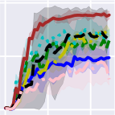
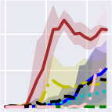
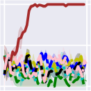
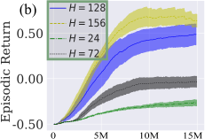
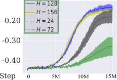
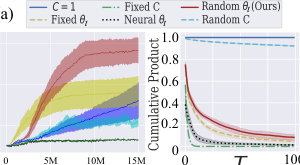
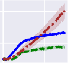

## **Stable Hadamard Memory: Revitalizing** **Memory-Augmented Agents for Reinforcement** **Learning**

**Hung Le, Kien Do, Dung Nguyen, Sunil Gupta, and Svetha Venkatesh**
Applied AI Institute, Deakin University, Geelong, Australia

```
                 thai.le@deakin.edu.au

```

**Abstract**


Effective decision-making in partially observable environments demands robust
memory management. Despite their success in supervised learning, current deeplearning memory models struggle in reinforcement learning environments that are
partially observable and long-term. They fail to efficiently capture relevant past
information, adapt flexibly to changing observations, and maintain stable updates
over long episodes. We theoretically analyze the limitations of existing memory
models within a unified framework and introduce the Stable Hadamard Memory,
a novel memory model for reinforcement learning agents. Our model dynamically
adjusts memory by erasing no longer needed experiences and reinforcing crucial
ones computationally efficiently. To this end, we leverage the Hadamard product
for calibrating and updating memory, specifically designed to enhance memory
capacity while mitigating numerical and learning challenges. Our approach significantly outperforms state-of-the-art memory-based methods on challenging partially observable benchmarks, such as meta-reinforcement learning, long-horizon
credit assignment, and POPGym, demonstrating superior performance in handling
long-term and evolving contexts.


**1** **Introduction**


Reinforcement learning agents necessitate memory. This is especially true in Partially Observable
Markov Decision Processes (POMDPs [Kaelbling et al., 1998]), where past information is crucial for
making informed decisions. However, designing a robust memory remains an enduring challenge,
as agents must not only store long-term memories but also dynamically update them in response to
evolving environments. Memory-augmented neural networks (MANNs)–particularly those developed for supervised learning [Graves et al., 2016, Vaswani et al., 2017], while offering promising
solutions, have consistently struggled in these dynamic settings. Recent empirical studies [Morad
et al., 2023, Ni et al., 2024] have shown that MANNs exhibit instability and underperform simpler
vector-based memory models such as GRU [Chung et al., 2014] or LSTM [Hochreiter, 1997]. The
issue is exacerbated in complex and sparse reward scenarios where agents must selectively retain
and erase memories based on relevance. Unfortunately, existing methods fail to provide a memory
writing mechanism that is simultaneously efficient, stable, and flexible to meet these demands.


In this paper, we focus on designing a better writing mechanism to encode new information into
the memory _._ To this end, we introduce the Hadamard Memory Framework (HMF), a unified model
that encompasses many existing writing methods as specific cases. This framework highlights the
critical role of _memory calibration_, which involves linearly adjusting memory elements by multiplying the memory matrix with a _calibration matrix_ and then adding an _update matrix_ . By leveraging Hadamard products that operate element-wise on memory matrices, we allow memory writing


Preprint. Under review.


without mixing the memory cells in a computationally efficient manner. More importantly, the calibration and update matrices are dynamically computed based on the input at each step. This enables
the model to learn adaptive memory rules, which are crucial for generalization. For instance, in
meta-reinforcement learning with varying maze layouts, a fixed memory update rule may work for
one layout but fail in another. By allowing the calibration matrix to adjust according to the current
maze observation, the agent can learn to adapt to any layout configuration. A dynamic calibration
matrix also enables the agent to flexibly forget and later recall information as needed. For example,
an agent navigating a room may need to remember the key’s location, retain it during a detour, and
later recall it when reaching a door, while discarding irrelevant detour events.


Although most current memory models can be reformulated within the HMF, they tend to be either
overly simplistic with limited calibration capabilities [Katharopoulos et al., 2020, Radford et al.,
2019] or unable to manage memory writing reliably, suffering from gradient vanishing or exploding
issues [Ba et al., 2016, Morad et al., 2024]. To address these limitations, we propose a specific instance of HMF, called Stable Hadamard Memory, which introduces a novel calibration mechanism
based on two key principles: (i) dynamically adjusting memory values in response to the current
context input to selectively weaken outdated or enhance relevant information, and (ii) ensuring the
expected value of the calibration matrix product remains bounded, thereby preventing gradient vanishing or exploding. Through extensive experimentation on POMDP benchmarks, including meta
reinforcement learning, long-horizon credit assignment, and hard memorization games, we demonstrate that our method consistently outperforms state-of-the-art memory-based models in terms of
performance while also delivering competitive speed. We also provide comprehensive ablation studies that offer insights into the components and internal workings of our memory models.


**2** **Background**


**2.1** **Reinforcement Learning Preliminaries**


A Partially Observable Markov Decision Process (POMDP) is formally defined as a tuple
_⟨S, A, O, R, P, γ⟩_, where _S_ is the set of states, _A_ is the set of actions, _O_ is the observation space,
_R_ : _S ×_ _A →_ R is the reward function, _P_ : _S ×_ _A →_ ∆( _S_ ) defines the state transition probabilities,
and _γ ∈_ [0 _,_ 1) is the discount factor. Here, the agent does not directly observe the true environment
state _st_ . Instead, it receives an observation _ot ∼_ _O_ ( _st_ ), which provides partial information about
the state, often not enough for optimal decision making. Therefore, the agent must make decisions
based on its current observation _ot_ and a history of previous observations, actions, and rewards
( _a_ 0 _, r_ 0 _, o_ 1 _, . . ., at−_ 1 _, rt−_ 1 _, ot_ ). The history may exclude past rewards or actions.


Let us denote the input context at timestep _t_ as _xt_ = ( _ot, at−_ 1 _, rt−_ 1) and assume that we can encode

the sequence of contexts into a memory _Mt_ = _f_ _{xi}_ _[t]_ _i_ =1 . The goal is to learn a policy _π_ ( _at|Mt_ )
� �
that maximizes the expected cumulative discounted reward:


�


_J_ ( _π_ ) = E _π_


_∞_
�
� _t_ =1


� _γ_ _[t]_ _R_ ( _st, at_ ) _|at ∼_ _π_ ( _at|Mt_ ) _, st_ +1 _∼_ _P_ ( _st_ +1 _|st, at_ ) _, ot ∼_ _O_ ( _st_ )


_t_ =1


(1)


Thus, a memory system capable of capturing past experiences is essential for agents to handle the
partial observability of the environment while maximizing long-term rewards.


**2.2** **Memory-Augmented Neural Networks**


We focus on matrix memory _M_, and to simplify notation, we assume it is a square matrix. Given a
memory _M ∈_ R _[H][×][H]_, we usually read from the memory as:


_ht_ = _Mtq_ ( _xt_ ) (2)
where _q_ is a query network _q_ : R _[D]_ _�→_ R _[H]_ to map an input context _xt ∈_ R _[D]_ to a query vector.
The read value _ht_ later will be used as the input for policy/value functions. Even more important
than the reading process is the memory writing: _How can information be written into the memory_
_to ensure efficient and accurate memory reading?_ A general formulation for memory writing is
_Mt_ = _f_ ( _Mt−_ 1 _, xt_ ) with _f_ as the update function that characterizes the memory models.


2


The simplest form of memory writing traces back to Hebbian learning rules: _Mt_ = _Mt−_ 1 + _xt ⊗_ _xt_
where _⊗_ is outer product [Kohonen and Ruohonen, 1973, Hebb, 2005]. Later, researchers have
proposed “fast weight” memory [Marr and Thach, 1991, Schmidhuber, 1992, Ba et al., 2016]:


_Mt_ = _Mt−_ 1 _λ_ + _ηg_ ( _Mt−_ 1 _, xt_ ) _⊗_ _g_ ( _Mt−_ 1 _, xt_ ) (3)


where _g_ is a non-linear function that take the previous memory and the current input data as the input;
_λ_ and _η_ are constant hyperparameters. On the other hand, computer-inspired memory architectures
such as Neural Turing Machine (NTM, [Graves et al., 2014]) and Differentiable Neural Computer
(DNC, [Graves et al., 2016]) introduce more sophisticated memory writing:


_Mt_ = _Mt−_ 1 _⊙_ ( **1** _−_ _w_ ( _Mt−_ 1 _, xt_ ) _⊗_ _e_ ( _Mt−_ 1 _, xt_ )) + _w_ ( _Mt−_ 1 _, xt_ ) _⊗_ _v_ ( _Mt−_ 1 _, xt_ ) (4)


where _w_, _e_ and _v_ are non-linear functions that take the previous memory and the current input data
as the input to produce the writing weight, erase and value vectors, respectively. _⊙_ is the Hadamard
(element-wise) product.


The problem with non-linear _f_ w.r.t _M_ is that the computation must be done in recursive way, and
thus being slow. Therefore, recent memory-based models adopt simplified linear dynamics. For
example, Linear Transformer’s memory update reads [Katharopoulos et al., 2020]:


_ϕ_ ( _k_ ( _xt_ ))
_Mt_ = _Mt−_ 1 + _v_ ( _xt_ ) _⊗_ (5)
~~�~~ _t_ _[ϕ]_ [ (] _[k]_ [ (] _[x][t]_ [))]


where _ϕ_ is an activation function; _k_ and _v_ are functions that transform the input to key and value.
Recently, Beck et al. [2024] have proposed matrix-based LSTM (mLSTM):


_Mt_ = `f` ( _xt_ ) _Mt−_ 1 + `i` ( _xt_ ) _v_ ( _xt_ ) _⊗_ _k_ ( _xt_ ) (6)


where `f` and `i` are the forget and input gates, respectively. In another perspective inspired by neuroscience, Fast Forgetful Memory (FFM, [Morad et al., 2024]) employs a parallelable memory writing,
which processes a single step update as follows:


_Mt_ = _Mt−_ 1 _⊙_ _γ_ + � _v_ ( _xt_ ) _⊗_ **1** _[⊤]_ [�] _⊙_ _γ_ _[t][−][n]_ (7)


where _γ_ is a trainable matrix, _v_ is an input transformation function, and _n_ is the last timestep.


**3** **Methods**


In this section, we begin by introducing a unified memory writing framework that incorporates
several of the memory writing approaches discussed earlier. Next, we examine the limitations of
current memory writing approaches through an analysis of this framework. Following this analysis,
we propose specialized techniques to address these limitations. For clarity and consistency, all
matrix and vector indices will be referenced starting from 1, rather than 0. Constant matrices are
denoted by bold numbers.


**3.1** **Hadamard Memory Framework (HMF)**


We propose a general memory framework that uses the Hadamard product as its core operation. The
memory writing at time step _t_ is defined as:


(8)

where _Cθ_ : R _[D]_ _�→_ R _[H][×][H]_ and _Uφ_ : R _[D]_ _�→_ R _[H][×][H]_ are parameterized functions that map the current
input _xt_ to two matrices _Ct_ (calibration matrix) and _Ut_ (update matrix). Here, _θ_ and _φ_ are referred
to as calibration and update parameters. Intuitively, the calibration matrix _Ct_ determines which
parts of the previous memory _Mt−_ 1 should be weakened and which should be strengthened while
the update matrix _Ut_ specifies the content to be encoded into the memory. We specifically choose


3


the Hadamard product ( _⊙_ ) as the matrix operator because it operates on each memory element
individually. We avoid using the matrix product to prevent mixing the content of different memory
cells during calibration and update. Additionally, the matrix product is computationally slower.


There are many ways to design _Ct_ and _Ut_ . Given proper choices of _Ct_ and _Ut_, Eqs. 3-7 can be
reformulated into Eq. 8. Inspired by prior “fast weight” works, we propose a simple update matrix:


(9)


where _k_ and _v_ are trainable neural networks that transform the input _xt_ to key and value representations. _ηφ_ : R _[D]_ _�→_ R is a parameterized function that maps the current input _xt_ to an update gate that
controls the amount of update at step _t_ . For example, if _ηφ_ ( _xt_ ) = 0, the memory will not be updated
with any new content, whereas _ηφ_ ( _xt_ ) = 1 the memory will be fully updated with the content from
the _t_ -th input. We implement _ηφ_ ( _xt_ ) as a neural network with sigmoid activation function.


We now direct our focus towards the design of _Ct_, which is the core contribution of our work.
The calibration matrix selectively updates the memory by erasing no longer important memories
and reinforcing ongoing critical ones. In a degenerate case, if _Ct_ = **1** for all _t_, the memory will
not forget or strengthen any past information, and will only memorize new information over time,
similar to the Hebbian Rule and Transformers. To analyze the role of the calibration matrix, it is
useful to unroll the recurrence, leading to the closed-form equation (see proof in Appendix A.1):


_̸_

_̸_

_̸_


_t_
� _Ui ⊙_


_i_ =1


_̸_

_̸_

_̸_


_t_
� _Cj_ (10)

_j_ = _i_ +1


_̸_

_̸_

_̸_


_Mt_ = _M_ 0


_̸_

_̸_

_̸_


_t_
� _Ci_ +


_i_ =1


_̸_

_̸_

_̸_


where [�] represents element-wise products. Then, _ht_ = _Mtq_ ( _xt_ ) = _M_ 0 � _ti_ =1 _[C][i][q]_ [ (] _[x][t]_ [) +]
_t_
� _i_ =1 _[U][i][ ⊙]_ [�] _[t]_ _j_ = _i_ +1 _[C][j][q]_ [ (] _[x][t]_ [)][. Calibrating the memory is important because without calibration]
( _Ct_ = **1** _∀t_ ), the read value becomes: _ht_ = _M_ 0 _q_ ( _xt_ ) + [�] _[t]_ _i_ =1 _[U][i][q]_ [ (] _[x][t]_ [)] _[ .]_ [ In this case, mak-]
ing _ht_ to reflect a past context at any step _j_ requires that _q_ ( _xt_ ) _̸_ = 0 and [�] _i_ = _̸_ _j_ _[U][i][q]_ [ (] _[x][t]_ [) =]

� _i_ = _̸_ _j_ _[η][φ]_ [ (] _[x][i]_ [)] _[ v]_ [ (] _[x][i]_ [) [] _[k]_ [ (] _[x][i]_ [)] _[ ·][ q]_ [ (] _[x][t]_ [)]] _[ ≈]_ **[0]** [, which can be achieved if we can find] _[ q]_ [ (] _[x][t]_ [)][ such that]
_k_ ( _xi_ ) _· q_ ( _xt_ ) _≈_ 0 _∀i ̸_ = _j_ . Yet, this becomes hard when _T ≫_ _H_ and _ηφ_ ( _xi_ ) _̸_ = **0** as it leads to an
overdetermined system with more equations than variables. We note that avoiding memorizing any
_i_ -th step with _ηφ_ ( _xi_ ) = 0 is suboptimal since _xi_ may be required for another reading step _t_ _[′]_ = _̸_ _t_ .


_̸_

_̸_

_̸_


Therefore, at a certain timestep _t_, it is critical to eliminate no longer relevant timesteps from _Mt_ by
calibration, i.e., _Ui ⊙_ [�] _[t]_ _j_ = _i_ +1 _[C][j][ ≈]_ **[0]** [ for unimportant] _[ i]_ [ (forgetting). For example, an agent may]
first encounter an important event, like seeing a color code, before doing less important tasks, such
as picking apples. When reaching the goal requiring to identify a door matching the color code, it
would be beneficial for the agent to erase memories related to the apple-picking task, ensuring a
clean retrieval of relevant information–the color code. Conversely, if timestep _i_ becomes relevant
again at a later timestep _t_ _[′]_, we need to recover its information, ensuring _Ui ⊙_ [�] _[t]_ _j_ _[′]_ = _i_ +1 _[C][j][ ̸]_ [=] **[ 0]**

(strengthening), just like the agent, after identifying the door, may return to collecting apple task.
_Remark_ 1 _._ In the Hadamard Memory Framework, calibration should be enabled ( _Ct ̸_ = **1** ) and
conditioned on the input context.


Regarding computing efficiency, if _Ct_ and _Ut_ are not functions of _M<t_, we can compute the memory

_t_
using Eq. 10 in parallel, ensuring fast execution. In particular, the set of products �� _tj_ = _i_ +1 _[C][j]_ � _i_ =1

can be calculated in parallel in _O_ (log _t_ ) time. The summation can also be done in parallel in
_O_ (log _t_ ) time. Additionally, since all operations are element-wise, they can be executed in parallel with respect to the memory dimensions. Consequently, the total time complexity is _O_ (log _t_ ).
Appendix Algo. 1 illustrates an implementation supporting parallelization.

_Remark_ 2 _._ In the Hadamard Memory Framework, with optimal parallel implementation, the time
complexity for processing a sequence of _t_ steps is _O_ (log _t_ ). By contrast, without parallelization, the
time complexity is _O_ � _tH_ [2][�] .


4


**3.2** **Challenges on Memory Calibration**


The calibration matrix enables agents to either forget or enhance past memories. However, it complicates learning due to the well-known issues of gradient vanishing or exploding. This can be
observed when examining the policy gradient over _T_ steps, which reads:


_̸_


_∇_ Θ _J_ ( _π_ Θ) = E _s,a∼π_ Θ


_̸_


_T_
� _t_ =0 ~~�~~ _∇_ Θ log _π_ ~~�~~ Θ� ( _at|Mt_ ~~�~~ )

_Gt_ (Θ)


_̸_


_Adv_ ( _st, at, γ_ ) (11)


_̸_


where Θ is the set of parameters, containing _{θ, φ}_, _Adv_ represents the advantage function, which
integrates reward information _R_ ( _st, at_ ), and _Gt_ (Θ) = _∂_ log _π∂M_ Θ( _at_ _t|Mt_ ) _∂M∂_ Θ _t_ [captures information]

related to the memory. Considering main gradient at step _t_, required to learn _θ_ and _φ_ :


_̸_


_∂θ_
� ~~��~~ �
_G_ 1( _i,t,θ_ )


_̸_


_∂θ_ _t_ = _M_ 0 _∂_ [�] _[t]_ _i_ = _∂θ_ 1 _[C][θ]_ [(] _[x][i]_ [)]


_̸_


_∂Mt_


_̸_


+
_∂θ_


_̸_


_t_ _∂_ [�] _[t]_ _j_ = _i_ +1 _[C][θ]_ [(] _[x][j]_ [)]
� _Uφ_ ( _xi_ ) _⊙_ _∂θ_

_i_ =1 � �


_̸_


_t_
�


_̸_


; (12)


_̸_


_t_
� _Cθ_ ( _xj_ )

_j_ = _i_ +1


_̸_


_∂Mt_

_∂φ_ [=]


_̸_


_t_
�


_i_ =1


_̸_


_∂Uφ_ ( _xi_ ) _⊙_

_∂φ_


_̸_


(13)


_̸_


~~�~~ ~~��~~ ~~�~~
_G_ 2( _i,t,θ_ )


We collectively refer _G_ 1 ( _i, t, θ_ ) and _G_ 2 ( _i, t, θ_ ) as _G_ 1 _,_ 2 ( _i, t, θ_ ) _∈_ R _[H][×][H]_ . These terms are critical as
they capture the influence of state information at timestep _i_ on the learning parameters _θ_ and _φ_ . The
training challenges arise from these two terms as the number of timesteps _t_ increases: (i) _Numerical_
_Instability (Gradient Exploding):_ if _∃m.k ∈_ [1 _, H_ ] s _._ t _. G_ 1 _,_ 2 ( _i, t, θ_ ) [ _m, k_ ] _→∞_, this leads to
overflow, causing the gradient to become “nan”; (ii) _Learning Difficulty (Gradient Vanishing)_ : if
_t ≫_ _i_ 0, _∥G_ 1 _,_ 2 ( _i, t, θ_ ) _∥≈_ 0 _∀i < i_ 0, meaning no signal from timesteps _i < i_ 0 contributes to
learning the parameters. This is suboptimal, especially when important observations occur early in
the episode, and rewards are sparse and given at the episode end, .i.e., _R_ ( _st, at_ ) = 0 _∀_ _t ̸_ = _T_ .


_How to design the calibration matrix Cθ_ ( _x_ ) _to overcome the training challenges?_ A common
approach is to either fix it as hyperparameters or make it learnable parameters independent on the
input _xt_ (e.g., Eqs. 3 and 7). Unfortunately, we can demonstrate that this leads to either numerical
instability or learning difficulties as formalized in Proposition 3. In the next section, we will provide
a better design for the calibration matrix.
**Proposition 3.** _If calibration is enabled Cθ_ ( _xt_ ) _̸_ = **1** _, yet the calibration matrix is fixed, independent_
_of the input xt (∀t_ : _Cθ_ ( _xt_ ) = _θ ∈_ R _[H][×][H]_ _), numerical instability or learning difficulty will arise._


_Proof._ See Appendix A.2


**3.3** **Stable Hadamrad Memory (SHM)**


To avoid numerical and learning problems, it is important to ensure each element of _Ct_ is not always greater than 1 or smaller than 1, which ends up in their product will be bounded such that

_T_
E _t_ =1 _[C][t]_ = _̸_ _{_ **0** _,_ _**∞**_ _}_ as _T →∞_ . At the same time, we want _Ct_ to be a function of _xt_ to enable
�� �
calibration conditioned on the current context. To this end, we propose the calibration matrix:


(14)
where _vc_ : R _[D]_ _�→_ R _[H]_ is a mapping function, and _θt ∈_ R _[H]_ represents the main calibration parameters. Here, we implement _vc_ as a linear transformation to map the input to memory space. Notably,
the choice of _θt_ determines the stability of the calibration. _We propose to design θt as trainable_
_parameters that is randomly selected from a set of parameters θ_ . In particular, given _θ ∈_ R _[L][×][H]_,


5


we sample uniformly a random row from _θ_, _θt_ = _θ_ [ _lt_ ] where _lt ∼U_ (1 _, L_ ) where _L_ is the number
of possible _θt_ . We name the design as Stable Hadamard Memory (SHM). Given the formulation,
the range of an element _zt_ _[m,k]_ = _Cθ_ ( _xt_ ) [ _m, k_ ] is [0 _,_ 2] where _m, k ∈_ [1 _, H_ ]. We can show one


_T_
important property of this choice is that E _t_ =1 _[C][t]_ _≈_ **1** under certain conditions.
�� �

**Proposition 4.** _Assume: (i) xt ∼N_ (0 _,_ Σ _t_ ) _, (ii) vf is a linear transformation, i.e.,vc_ ( _xt_ ) = _Wxt,_
_(iii) {zt_ = _θt ⊗_ _vc_ ( _xt_ ) _}_ _[T]_ _t_ =1 _[are independent across][ t][. Given][ C][θ]_ [ (] _[x][t]_ [)] _[ defined in Eq. 14 then][ ∀][T][ ≥]_
0 _,_ 1 _≤_ _m, k ≤_ _H:_


_̸_


�


_̸_


�


_̸_


E


_̸_


_T_
� _zt_ _[m,k]_
� _t_ =1


_̸_


= E


_̸_


_T_
�
� _t_ =1


_̸_


� _Cθ_ ( _xt_ ) [ _m, k_ ]


_t_ =1


_̸_


= 1


_̸_


_Proof._ see Appendix A.3


Assumption (i) is reasonable as _xt_ can be treated as being drawn from a Gaussian distribution, and
LayerNorm can be applied to normalize _xt_ to have a mean of zero. Assumption (ii) can be realized
as we implement _vc_ as a linear transformation. Assumption (iii) is more restrictive because _{xt}_ _[T]_ _t_ =1
are often dependent in RL setting, which means _{zt_ = _θt ⊗_ _vc_ ( _xt_ ) _}_ _[T]_ _t_ =1 [are not independent and]

thus, E _Tt_ =1 _[z]_ _t_ _[m,k]_ = 1 _̸_ . However, by reducing the linear dependence between _zt_ through random
�� �

selection of _θt_, we can make E _Tt_ =1 _[z]_ _t_ _[m,k]_ closer to 1, and thus being bounded. Specifically,
�� �

we will prove that by using _θt_ = _θ_ [ _lt_ ] ; _lt ∼U_ (1 _, L_ ) the Pearson Correlation Coefficient between
timesteps is minimized, as stated in the following proposition:

**Proposition 5.** _Let zt_ _[m,k]_ = _u_ _[m]_ _t_ _[v]_ _t_ _[k]_ _[where][ z]_ _t_ _[m,k]_ = ( _θt ⊗_ _vc_ ( _xt_ )) [ _m, k_ ] _, u_ _[m]_ _t_ = _θt_ [ _m_ ] _and vt_ _[k]_ [=]
_vc_ ( _xt_ ) [ _k_ ] _. Given the Pearson correlation coefficient of two random variables X and Y is defined_
_Cov_ ( _X,Y_ )
_as ρ_ ( _X, Y_ ) = ~~_√_~~ _Var_ ( _X_ ) ~~_[√]_~~ _Var_ ( _Y_ ) _[, then][ ∀][v]_ _t_ _[k][, v]_ _t_ _[k][′][:]_


�� _ρ_ � _u_ _[m]_ _t_ _[v]_ _t_ _[k][, u][m]_ _t_ _[′][ v]_ _t_ _[k][′]_ ��� _≤_ �� _ρ_ � _vt_ _[k][, v]_ _t_ _[k][′]_ ���


_The equality holds when u_ _[m]_ _t_ [=] _[ βu][m]_ _t_ _[′][ .]_


_Proof._ See Appendix A.4


As a result, our choice of _θt_ outperforms other straightforward designs for minimizing dependencies
between timesteps. For instance, a fixed _θt_ ( _θt_ = _θ ∈_ R _[H]_ ) results in higher dependencies because
_ρ_ ( _θ_ [ _m_ ] _vt_ _[k][, θ]_ [ [] _[m]_ []] _[ v]_ _t_ _[k][′]_ [) =] _[ ρ]_ [(] _[v]_ _t_ _[k][, v]_ _t_ _[k][′]_ [)] _[ ≥]_ _[ρ]_ � _u_ _[m]_ _t_ _[v]_ _t_ _[k][, u][m]_ _t_ _[′][ v]_ _t_ _[k][′]_ �. In practice, even when E �� _Tt_ =1 _[z]_ _t_ _[m,k]_ �

is bounded, the cumulative product can occasionally become very large for certain episodes and
timesteps, leading to overflow and disrupting the learning process. This can be avoided by clipping
the gradients. In experiments, we implement SHM using nonparallel recursive form (Eq. 8). The
memory is then integrated into policy-gradient RL algorithms to optimize Eq. 1, with the read value
_ht_ (Eq. 2) used as input for value/policy networks. Code will be available upon publication.


**4** **Experimental Results**


We evaluate our method alongside notable memory-augmented agents in POMDP environments.
Unless stated otherwise, the context consists of the observation and previous action. All training
uses the same hardware (single NVDIA H100 GPU), RL architecture, algorithm, training protocol,
and hyperparameters. We focus only on model-free RL algorithms. The baselines differ only in
their memory components: GRU [Chung et al., 2014], FWP [Schlag et al., 2021], GPT-2 [Radford
et al., 2019], S6 [Gu and Dao, 2023], mLSTM [Beck et al., 2024], FFM [Morad et al., 2024] and
SHM (Ours). For tasks with a clear goal, we measure performance using the Success Rate, defined
as the ratio of episodes that reach the goal to the total number of evaluation episodes. For tasks in
POP-Gym, we use Episode Return as the evaluation metric. We fix SHM’s number of possible _θt_,
_L_ = 128, across experiments.


6


_̸_


_Var_ ( _X_ ) ~~_[√]_~~


_̸_


_Var_ ( _Y_ ) _[, then][ ∀][v]_ _t_ _[k][, v]_ _t_ _[k][′][:]_







Figure 1: Meta-RL: Wind and Point Robot learning curves. Mean _±_ std. over 5 runs.


Figure 2: Credit Assignment: Visual Match, Key-to-Door learning curves. Mean _±_ std. over 3 runs.


**4.1** **Sample-Efficient Meta Reinforcement Learning**


Meta-RL targets POMDPs where rewards and environmental dynamics differ across episodes, representing various tasks [Schmidhuber, 1987, Thrun and Pratt, 1998]. To excel in all tasks, memory
agents must learn general memory update rules that can adapt to any environments. We enhanced
the Wind and Point Robot environments from Ni et al. [2022] to increase difficulty. In these environments, the observation consists of the agent’s 2D position _pt_, while the goal state _pg_ is hidden. The
agent takes continuous actions _at_ by moving with 2D velocity vector. The sparse reward is defined
as _R_ ( _pt_ +1 _, pg_ ) = **1** ( _∥pt_ +1 _−_ _pg∥_ 2 _≤_ _r_ ) where _r_ = 0 _._ 01 is the radius. In Wind, the goal is fix
_pg_ = [0 _,_ 1], yet there are noises in the dynamics: _pt_ +1 = _pt_ + _at_ + _w,_ with the “wind” _w_ sampled
from _U_ [ _−_ 0 _._ 1 _,_ 0 _._ 1] at the start and fixed thereafter. In Point Robot, the goal varies across episodes,
sampled from _U_ [ _−_ 10 _,_ 10]. To simulate real-world conditions where the training tasks are limited,
we create 2 modes using different number of training and testing tasks: [50 _,_ 150] and [10 _,_ 190],
respectively. Following the modifications, these simple environments become significantly more
challenging to navigate toward the goal, so we set the episode length to 100.


We incorporate the memory methods to the Soft Actor Critic (SAC, [Haarnoja et al., 2018]), using
the same code base introduced in Ni et al. [2022]. We keep the SHM model sizes and memory
capacities small, at around 2MB for the checkpoint and 512 memory elements, which is roughly
equivalent to a GRU (see Appendix C.1). We train all models for 500,000 environment steps, and
report the learning curves in Fig. 1. In the easy mode (50-150), our SHM method consistently
achieves the best performance, with a near-optimal success rate, while other methods underperform
by 20-50% on average in Wind and Point Robot, respectively. In the hard mode (10-190), SHM
continues to outperform other methods by approximately 20%, showing earlier signs of learning.


**4.2** **Long-term Credit Assignment**


In this task, we select the Visual Match and Key-to-Door environments, the most challenge tasks
mentioned in Ni et al. [2024]. Both have observation as the local view of the agent, discrete actions
and sparse rewards dependent on the full trajectory, requiring long-term memorization. In particular,
the pixel-based Visual Match task features an intricate reward system: in Phase 1, observing color
codes yields no rewards, while in Phase 2, picking an apple provides immediate reward of one,


7





Task Level GRU FFM SHM (Ours)

Easy -37.9 _±_ 7.7 -32.7 _±_ 0.6 **49.5** _±_ **23.3**
Autoencode Medium -43.6 _±_ 3.5 -32.7 _±_ 0.6 **-28.8** _±_ **14.4**

Hard -48.1 _±_ 0.7 -47.7 _±_ 0.5 **-43.9** _±_ **0.9**


Easy -41.1 _±_ 1.0 -34.0 _±_ 7.1 **-12.3** _±_ **2.4**
Battleship Medium -39.4 _±_ 0.5 -37.1 _±_ 3.1 **-16.8** _±_ **0.6**
Hard -38.5 _±_ 0.5 -38.8 _±_ 0.3 **-21.2** _±_ **2.3**


Easy -10.9 _±_ 1.0 **10.7** _±_ **1.2** -1.9 _±_ 2.4
Concentration Medium -21.4 _±_ 0.5 -24.7 _±_ 0.1 **-21.0** _±_ **0.8**

Hard -84.0 _±_ 0.3 -87.5 _±_ 0.5 **-83.3** _±_ **0.1**


Easy **99.9** _±_ **0.0** 98.4 _±_ 0.3 88.9 _±_ 11.1
RepeatPrevious Medium -34.7 _±_ 1.7 -24.3 _±_ 0.4 **48.2** _±_ **7.2**
Hard -41.7 _±_ 1.8 -33.9 _±_ 1.0 **-19.4** _±_ **9.9**

Average All -28.4 _±_ 1.3 -24.2 _±_ 1.2 **-5.1** _±_ **6.3**
Table 1: PopGym: Mean return _±_ std. ( _×_ 100) at the end of training over 3 runs. The range of return
( _×_ 100) is [ _−_ 100 _,_ 100].


relying on short-term memory. The final reward–a bonus for reaching the door with the matching
color code is set to 10. Key-to-Door also involves multiple phases: finding the key, picking apples,
and reaching the door. The terminal reward is given if the key was acquired in the first phase and used
to open the door. Both tasks can be seen as decomposed episodic problems with noisy immediate
rewards, requiring that in the final phase, the agent remembers the event in the first phase. We create
2 configurations using different episode steps in the second phases: 250 and 500, respectively.


Still following Ni et al. [2022], we use SAC-Discrete [Christodoulou, 2019] as the RL algorithm.
We use the same set of baselines as in Sec. 4.1 and train them for 2 million environment steps. The
results in Fig. 2 clearly show that, our method, SHM, significantly outperforms all other methods in
terms of success rate. Notably, SHM is the only method that can perfectly solve both 250 and 500step Visual Match while the second-best performer, FFM, achieves only a 77% and 25% success rate,
respectively. In Key-To-Door, our method continues showing superior results with high success rate.
By contrast, no meaningful learning is observed from the other methods, which perform similarly to
GPT-2, as also noted by Ni et al. [2024].


**4.3** **POPGym Hardest Games**


We evaluate SHM on the POPGym benchmark [Morad et al., 2023], the largest POMDP benchmark
to date. Following previous studies [Morad et al., 2023, Samsami et al., 2024], we focus on the most
memory-intensive tasks: Autoencode, Battleship, Concentration and RepeatPrevious. These tasks
require ultra long-term memorization, with complexity increasing across Easy, Medium, and Hard
levels. All tasks use categorical action and observation spaces, allowing up to 1024 steps.


For comparison, we evaluate SHM against _state-of-the-art model-free methods_, including GRU and
FFM. Other memory models, such as DNC, Transformers, FWP, and SSMs, have been reported to
perform worse. The examined memory models are integrated into PPO [Schulman et al., 2017],
trained for 15 million steps using the same codebase as Morad et al. [2023] to ensure fairness.
The models differ only in their memory, controlled by the memory dimension hyperparameter _H_ .
We tune it for each baseline, adjusting it to optimize performance, as larger _H_ values typically
improve results. The best-performing configurations are reported in Table 1, where SHM demonstrates a relative improvement of _≈_ 10-12% over FFM and GRU on average. Notably, the learning
curves in Appendix Fig. 4 show that only SHM demonstrates signs of learning in several tasks,
including RepeatPrevious-Medium/Hard, and Autoencode-Easy/Medium. Detailed hyperparameter
setting and additional results are provided in Appendix C.2.


In terms of running time, the average batch inference time in milliseconds for GRU, FFM, and SHM
is 1.6, 1.8, and 1.9, respectively, leading to a total of 7, 8, and 9 hours of training per task. While
SHM is slightly slower than GRU and FFM, the difference is a reasonable trade-off for improved
memory management in partially observable environments. Last but not least, our model’s runtime
was measured using a non-parallel implementation, while GRU benefits from hardware optimization
in the PyTorch library. SHM’s running time could be further improved with proper parallelization.


8








0.5


0 100 Autoencode-Easy Battleship-Easy


(c)


_t=50_ _t=80_ _t=110_ _t=115_ _t=120_


100

### M


-100

2
### C


0


_t=124_


Phase 1 Forget Remember Phase 2 Phase 3

|0.2 0.4 0 0 mportant memory t=20|Col2|Col3|Col4|Col5|
|---|---|---|---|---|
|Forget Rem<br> <br>se 1<br>_t=15_<br>_t=20_|Forget Rem<br> <br>se 1<br>_t=15_<br>_t=20_|Forget Rem<br> <br>se 1<br>_t=15_<br>_t=20_|Forget Rem<br> <br>se 1<br>_t=15_<br>_t=20_|Forget Rem<br> <br>se 1<br>_t=15_<br>_t=20_|
|Forget Rem<br> <br>se 1<br>_t=15_<br>_t=20_|||||
|Forget Rem<br> <br>se 1<br>_t=15_<br>_t=20_|||||
|Forget Rem<br> <br>se 1<br>_t=15_<br>_t=20_|||||
|Forget Rem<br> <br>se 1<br>_t=15_<br>_t=20_|orget Rem|orget Rem|orget Rem|orget Rem|


|Col1|Col2|
|---|---|
|_t=110_|_t=115_|
|||
|||


Figure 3: (a) Left: Return of calibration designs over 3 runs; Right: Calibration matrix cumulative
product over 100 episodes. (b) Return of memory sizes _H_ on Autoencode-Easy (left) and BattleshipEasy (right). (c) Memory ( _M_, top) and calibration ( _C_, bottom) matrices over timesteps in Visual
Match: SHM erases memory that are no longer required and strengthens the important ones.


**4.4** **Model Analysis and Ablation Study**


**Choice of Calibration** Prop. 5 suggests that selecting random _θt ∈_ R _[H]_ in Eq. 14 will reduce the
dependencies between _Ct_, bringing [�] _[T]_ _t_ =1 _[C][t]_ [ closer to] **[ 1]** [ to avoid gradient issues. In this section, we]
empirically verify that by comparing our proposed Random _θt_ with the following designs: _C_ = **1**,
no calibration is used; _Random C_, where a random calibration matrix is sampled from normal
distribution at each timestep, having E _Tt_ =1 _[z]_ _t_ _[m,k]_ = 1 under mild assumptions, but preventing
�� �
learning meaningful calibration rules; _Fixed C_, a simpler method for learning calibration, but prone
to gradient problems (Prop. 3); _Fixed θt_, where we learn fixed parameter _θt_, which is proven to be
less effective than Random _θt_ in reducing linear dependencies between timesteps (Prop. 5); Neural
_θt_, where _θt_ = _FFW_ ( _xt_ ), generated by a feedforward neural network like mLSTM, but with no
guarantee of reducing timestep dependencies. We trained RL agents using the above designs of the
calibration matrix with _H_ = 72 on the Autoencode-Easy task and present the learning curves in
Fig. 3 (a, left). The results show that our proposed Random _θt_ outperforms the other baselines by a
substantial margin, with at least a 30% improvement in performance. This confirms the effectiveness
of our calibration design in enhancing the final results.


**Vanishing Behavior** In practice, exploding gradients can be mitigated by clipping. Thus, we focus
on the vanishing gradient, which depends on the cumulative product _Cj_ = [�] _[j]_ _t_ =1 _[C][t]_ [. Our theory]
suggests that Random _θt_ should be less susceptible to the vanishing phenomenon compared to other
methods such as Fixed _C_, Fixed _θt_ and Neural _θt_ . To verify that, for each episode, we compute the
average value of elements in the matrix _Cj_ that are smaller than 1 ( _Cj_ [ _<_ 1]), as those larger than
1 are prone to exploding and are not appropriate for averaging with the vanishing values. We plot
_Cj_ [ _<_ 1] for _j_ = 1 _,_ 2 _, ..._ 100 over 100 episodes in Fig 3 (a, right).


The results are consistent with theoretical predictions: Fixed _C_ leads to rapid vanishing of the
cumulative product in just 10 steps. Neural _θt_ also perform badly, likely due to more complex
dependencies between timesteps because _zt_ _[m,k]_ now becomes non-linear function of _xt_, causing
� _Tt_ =1 _[z]_ _t_ _[m,k]_ to deviate further from 1. While Fixed _θt_ is better than Neural _θt_, it still exhibits quicker
vanishing compared to our approach Random _θt_ . As expected, Random _C_ shows little vanishing,
but like setting _C_ = 1, it fails to leverage memory calibration, resulting in underperformance (Fig.
3 (a, left)). Random _θt_, although its _Cj_ also deviates from 1, shows the smallest deviation among the
calibration learning approaches. Additionally, the vanishing remain manageable after 100 timesteps,
allowing gradients to still propagate effectively and enabling the calibration parameters to be learned.


9


**Memory Size** The primary hyperparameter of our method is _H_, determining the memory capacity.
We test SHM with _H ∈{_ 24 _,_ 72 _,_ 128 _,_ 156 _}_ on the Autoencode-Easy and Battleship-Easy tasks.
Fig. 3 (b) shows that larger memory generally results in better performance. In terms of speed,
the average batch inference times (in milliseconds) for different _H_ values are 1.7, 1.8, 1.9, and 2.1,
respectively. We choose _H_ = 128 for other POPGym tasks to balance performance and speed.


**Forgetting and Remembering** Here, we investigate the learned calibration strategy of SHM on
Visual Match with 15,100, and 10 steps in Phase 1, 2 and, 3, respectively. We sample several representative _Mt_ and _Ct_ from 3 phases and visualize them in Fig. 3 (c). In Phase 1, the agent identifies
the color code and stores it in memory, possibly in two columns of _M_, marked as “important memory”. In Phase 2, unimportant memory elements are erased where _Ct ≈_ 0 (e.g., those within the
blue rectangle). However, important experiences related to the Phase 1’s code are preserved across
timesteps until Phase 3 (e.g., those within the red rectangle where _Ct_ ≳1), which is desirable.


**5** **Related works**


Numerous efforts have been made to equip RL agents with memory mechanisms. Two main research
directions focus on inter-episode and intra-episode memory approaches. While episodic control with
a global, tabular memory enhances sample efficiency by storing experiences across episodes [Blundell et al., 2016, Le et al., 2021, 2022a], it falls short in recalling specific events within individual
episodes. Similarly, global memory mechanisms can support exploration or optimization [Badia
et al., 2020, Le et al., 2022b, 2024], but are not designed to address the challenges of memorization within a single episode. In contrast, to address the challenges of partially observable Markov
decision processes (POMDPs), RL agents often leverage differentiable memory, which is designed
to capture the sequence of observations within an episode, and can be learned by policy gradient
algorithms [Wayne et al., 2018].


Differentiable memory models can be broadly categorized into vector-based and matrix-based approaches. Vector-based memory, like RNNs [Elman, 1990], processes inputs sequentially and stores
past inputs in their hidden states. While RNNs are slower to train, they are efficient during inference. Advanced variants, such as GRU and LSTM, have shown strong performance in POMDPs,
often outperforming more complex RL methods [Ni et al., 2022, Morad et al., 2023]. Recently,
faster alternatives like convolutional and structured state space models (SSM) have gained attention

[Bai et al., 2018, Gu et al., 2020], though their effectiveness in RL is still under exploration. Initial
attempts with models like S4 underperformed in POMDP tasks [Morad et al., 2023], but improved
SSM versions using S5, S6 or world models have shown promise [Lu et al., 2024, Gu and Dao,
2023, Samsami et al., 2024]. Despite these advancements, vector-based memory is limited, as compressing history into a single vector makes it challenging to scale for high-dimensional memory

space.


Matrix-based memory, on the other hand, offers higher capacity by storing history in a matrix
but at the cost of increased complexity. Attention-based models, such as Transformers [Vaswani
et al., 2017], have largely replaced RNNs in SL, also delivering good results in standard POMDPs

[Parisotto et al., 2020]. However, their quadratic memory requirements limit their use in environments with long episodes. Empirical studies have also shown that Transformers struggle with
long-term memorization and credit assignment tasks [Ni et al., 2024]. While classic memoryaugmented neural networks (MANNs) demonstrated good performance in well-crafted long-term
settings [Graves et al., 2016, Hung et al., 2019, Le et al., 2020], they are slow and do not scale well
in larger benchmarks like POPGym [Morad et al., 2023]. New variants of LSTM [Beck et al., 2024],
including those based on matrices, have not been tested in reinforcement learning settings and lack
theoretical grounding to ensure stability.


Simplified matrix memory models [Katharopoulos et al., 2020, Schlag et al., 2021], offer scalable solutions but have underperformed compared to simple RNNs in the POPGym benchmark, highlighting the challenges of designing efficient matrix memory for POMDPs. Recently, Fast and Forgetful
Memory (FFM, [Morad et al., 2024]), incorporating inductive biases from neuroscience, has demonstrated better average results than RNNs in the benchmark. However, in the most memory-intensive
environments, the improvement remains limited. Compared to our approach, these matrix-based
memory methods lack a flexible memory calibration mechanism and do not have robust safeguards
to prevent numerical and learning issues in extremely long episodes.


10


**6** **Discussion**


In this paper, we introduced the Stable Hadamard Framework (SHF) and its effective instance, the
Stable Hadamard Memory (SHM), a novel memory model designed to tackle the challenges of
dynamic memory management in partially observable environments. By utilizing the Hadamard
product for memory calibration and update, SHM provides an efficient and theoretically grounded
mechanism for selectively erasing and reinforcing memories based on relevance. Our experiments
on the POPGym and POMDP benchmarks demonstrate that SHM significantly outperforms state-ofthe-art memory-based models, particularly in long-term memory tasks, while being fast to execute.
Although our theory suggests that SHM should be more stable and mitigate gradient learning issues
by reducing linear dependencies between timesteps, this stability is not guaranteed to be perfect.
Further theoretical investigation is needed to validate and refine these properties in future work.


**References**


Jimmy Ba, Geoffrey E Hinton, Volodymyr Mnih, Joel Z Leibo, and Catalin Ionescu. Using fast
weights to attend to the recent past. In _Advances in Neural Information Processing Systems_,
pages 4331–4339, 2016.


Adri`a Puigdom`enech Badia, Pablo Sprechmann, Alex Vitvitskyi, Daniel Guo, Bilal Piot, Steven
Kapturowski, Olivier Tieleman, Mart´ın Arjovsky, Alexander Pritzel, Andew Bolt, et al. Never
give up: Learning directed exploration strategies. _arXiv preprint arXiv:2002.06038_, 2020.


Shaojie Bai, J Zico Kolter, and Vladlen Koltun. An empirical evaluation of generic convolutional
and recurrent networks for sequence modeling. _arXiv preprint arXiv:1803.01271_, 2018.


Maximilian Beck, Korbinian P¨oppel, Markus Spanring, Andreas Auer, Oleksandra Prudnikova,
Michael Kopp, G¨unter Klambauer, Johannes Brandstetter, and Sepp Hochreiter. xlstm: Extended
long short-term memory. _arXiv preprint arXiv:2405.04517_, 2024.


Charles Blundell, Benigno Uria, Alexander Pritzel, Yazhe Li, Avraham Ruderman, Joel Z Leibo,
Jack Rae, Daan Wierstra, and Demis Hassabis. Model-free episodic control. _arXiv preprint_
_arXiv:1606.04460_, 2016.


Petros Christodoulou. Soft actor-critic for discrete action settings. _arXiv preprint arXiv:1910.07207_,
2019.


Junyoung Chung, Caglar Gulcehre, KyungHyun Cho, and Yoshua Bengio. Empirical evaluation of
gated recurrent neural networks on sequence modeling. _arXiv preprint arXiv:1412.3555_, 2014.


Jeffrey L Elman. Finding structure in time. _Cognitive science_, 14(2):179–211, 1990.


Alex Graves, Greg Wayne, and Ivo Danihelka. Neural turing machines. _arXiv preprint_
_arXiv:1410.5401_, 2014.


Alex Graves, Greg Wayne, Malcolm Reynolds, Tim Harley, Ivo Danihelka, Agnieszka GrabskaBarwi´nska, Sergio G´omez Colmenarejo, Edward Grefenstette, Tiago Ramalho, John Agapiou,
et al. Hybrid computing using a neural network with dynamic external memory. _Nature_, 538
(7626):471–476, 2016.


Albert Gu and Tri Dao. Mamba: Linear-time sequence modeling with selective state spaces. _arXiv_
_preprint arXiv:2312.00752_, 2023.


Albert Gu, Tri Dao, Stefano Ermon, Atri Rudra, and Christopher R´e. Hippo: Recurrent memory
with optimal polynomial projections. _Advances in neural information processing systems_, 33:
1474–1487, 2020.


Tuomas Haarnoja, Aurick Zhou, Pieter Abbeel, and Sergey Levine. Soft actor-critic: Off-policy
maximum entropy deep reinforcement learning with a stochastic actor. In _International confer-_
_ence on machine learning_, pages 1861–1870. PMLR, 2018.


Donald Olding Hebb. _The organization of behavior: A neuropsychological theory_ . Psychology
press, 2005.


11


S Hochreiter. Long short-term memory. _Neural Computation MIT-Press_, 1997.


Chia-Chun Hung, Timothy Lillicrap, Josh Abramson, Yan Wu, Mehdi Mirza, Federico Carnevale,
Arun Ahuja, and Greg Wayne. Optimizing agent behavior over long time scales by transporting
value. _Nature communications_, 10(1):5223, 2019.


Leslie Pack Kaelbling, Michael L Littman, and Anthony R Cassandra. Planning and acting in
partially observable stochastic domains. _Artificial intelligence_, 101(1-2):99–134, 1998.


Angelos Katharopoulos, Apoorv Vyas, Nikolaos Pappas, and Franc¸ois Fleuret. Transformers are
rnns: Fast autoregressive transformers with linear attention. In _International conference on ma-_
_chine learning_, pages 5156–5165. PMLR, 2020.


Teuvo Kohonen and Matti Ruohonen. Representation of associated data by matrix operators. _IEEE_
_Transactions on Computers_, 100(7):701–702, 1973.


Hung Le, Truyen Tran, and Svetha Venkatesh. Self-attentive associative memory. In _International_
_conference on machine learning_, pages 5682–5691. PMLR, 2020.


Hung Le, Thommen Karimpanal George, Majid Abdolshah, Truyen Tran, and Svetha Venkatesh.
Model-based episodic memory induces dynamic hybrid controls. _Advances in Neural Information_
_Processing Systems_, 34:30313–30325, 2021.


Hung Le, Majid Abdolshah, Thommen K George, Kien Do, Dung Nguyen, and Svetha Venkatesh.
Episodic policy gradient training. In _Proceedings of the AAAI Conference on Artificial Intelli-_
_gence_, volume 36, pages 7317–7325, 2022a.


Hung Le, Thommen Karimpanal George, Majid Abdolshah, Dung Nguyen, Kien Do, Sunil Gupta,
and Svetha Venkatesh. Learning to constrain policy optimization with virtual trust region. _Ad-_
_vances in Neural Information Processing Systems_, 35:12775–12786, 2022b.


Hung Le, Kien Do, Dung Nguyen, and Svetha Venkatesh. Beyond surprise: Improving exploration
through surprise novelty. In _Proceedings of the 23rd International Conference on Autonomous_
_Agents and Multiagent Systems_, pages 1084–1092, 2024.


Chris Lu, Yannick Schroecker, Albert Gu, Emilio Parisotto, Jakob Foerster, Satinder Singh, and
Feryal Behbahani. Structured state space models for in-context reinforcement learning. _Advances_
_in Neural Information Processing Systems_, 36, 2024.


David Marr and W Thomas Thach. A theory of cerebellar cortex. In _From the Retina to the Neocor-_
_tex_, pages 11–50. Springer, 1991.


Steven Morad, Ryan Kortvelesy, Matteo Bettini, Stephan Liwicki, and Amanda Prorok. Popgym:
Benchmarking partially observable reinforcement learning. _arXiv preprint arXiv:2303.01859_,
2023.


Steven Morad, Ryan Kortvelesy, Stephan Liwicki, and Amanda Prorok. Reinforcement learning
with fast and forgetful memory. _Advances in Neural Information Processing Systems_, 36, 2024.


Tianwei Ni, Benjamin Eysenbach, and Ruslan Salakhutdinov. Recurrent model-free rl can be a
strong baseline for many pomdps. In _International Conference on Machine Learning_, pages
16691–16723. PMLR, 2022.


Tianwei Ni, Michel Ma, Benjamin Eysenbach, and Pierre-Luc Bacon. When do transformers shine
in rl? decoupling memory from credit assignment. _Advances in Neural Information Processing_
_Systems_, 36, 2024.


Emilio Parisotto, Francis Song, Jack Rae, Razvan Pascanu, Caglar Gulcehre, Siddhant Jayakumar,
Max Jaderberg, Raphael Lopez Kaufman, Aidan Clark, Seb Noury, et al. Stabilizing transformers
for reinforcement learning. In _International conference on machine learning_, pages 7487–7498.
PMLR, 2020.


Alec Radford, Jeffrey Wu, Rewon Child, David Luan, Dario Amodei, Ilya Sutskever, et al. Language
models are unsupervised multitask learners. _OpenAI blog_, 1(8):9, 2019.


12


Mohammad Reza Samsami, Artem Zholus, Janarthanan Rajendran, and Sarath Chandar. Mastering
memory tasks with world models. _arXiv preprint arXiv:2403.04253_, 2024.


Imanol Schlag, Kazuki Irie, and J¨urgen Schmidhuber. Linear transformers are secretly fast weight
programmers. In _International Conference on Machine Learning_, pages 9355–9366. PMLR,
2021.


J¨urgen Schmidhuber. _Evolutionary principles in self-referential learning, or on learning how to_
_learn: the meta-meta-... hook_ . PhD thesis, Technische Universit¨at M¨unchen, 1987.


J¨urgen Schmidhuber. Learning to control fast-weight memories: An alternative to dynamic recurrent
networks. _Neural Computation_, 4(1):131–139, 1992.


John Schulman, Filip Wolski, Prafulla Dhariwal, Alec Radford, and Oleg Klimov. Proximal policy
optimization algorithms. _arXiv preprint arXiv:1707.06347_, 2017.


Sebastian Thrun and Lorien Pratt. Learning to learn: Introduction and overview. In _Learning to_
_learn_, pages 3–17. Springer, 1998.


Ashish Vaswani, Noam M. Shazeer, Niki Parmar, Jakob Uszkoreit, Llion Jones, Aidan N. Gomez,
Lukasz Kaiser, and Illia Polosukhin. Attention is all you need. In _Neural Information Processing_
_Systems_, 2017. URL `[https://api.semanticscholar.org/CorpusID:13756489](https://api.semanticscholar.org/CorpusID:13756489)` .


Greg Wayne, Chia-Chun Hung, David Amos, Mehdi Mirza, Arun Ahuja, Agnieszka GrabskaBarwinska, Jack Rae, Piotr Mirowski, Joel Z Leibo, Adam Santoro, et al. Unsupervised predictive
memory in a goal-directed agent. _arXiv preprint arXiv:1803.10760_, 2018.


13


**Appendix**


**A** **Theoretical Results**


**A.1** **Closed-form Memory Update**


Given
_Mt_ = _Mt−_ 1 _⊙_ _Ct_ + _Ut_ (15)


then


_̸_


_t_
� _Cj_ (16)

_j_ = _i_ +1


_̸_


_t_
�


_̸_


_Mt_ = _M_ 0


_Proof._ We prove by induction.


_̸_


_t_
� _Ci_ +


_i_ =1


_̸_


_t_
� _Ui ⊙_


_i_ =1


_̸_


_t_
�


_̸_


**Base case:** for _t_ = 1, the equation becomes for both Eqs. 15 and 16:


_M_ 1 = _M_ 0 _· C_ 1 + _U_ 1


Thus, the equation holds for _t_ = 1.


**Inductive hypothesis:** Assume the equation holds for _t_ = _n_ :


_̸_


_n_
� _Cj_

_j_ = _i_ +1


_̸_


_n_
�


_̸_


_Mn_ = _M_ 0


_̸_


_n_
� _Ci_ +


_i_ =1


_̸_


_n_
� _Ui ⊙_


_i_ =1


_̸_


_n_
�


_̸_


**Inductive step:** We now prove the equation holds for _t_ = _n_ + 1. From the update rule in Eq. 15:


_Mn_ +1 = _Mn ⊙_ _Cn_ +1 + _Un_ +1


Substitute _Mn_ using the inductive hypothesis:


_̸_


_n_
� _Ui ⊙_


_i_ =1


_̸_


_n_
�


_̸_


_n_
� _Cj_

_j_ = _i_ +1


_̸_


_n_
�


_̸_


 _⊙_ _Cn_ +1 + _Un_ +1


_̸_





_̸_


_Mn_ +1 =


_̸_


 _M_ 0


_̸_


_n_
� _Ci_ +


_i_ =1


_̸_


_n_
� _Ui ⊙_


_i_ =1


_̸_


_n_ +1
� _Cj_ + _Un_ +1

_j_ = _i_ +1


_̸_


= _M_ 0


= _M_ 0


_̸_


_n_ +1
� _Ci_ +


_i_ =1


_̸_


_n_ +1
� _Ci_ +


_i_ =1


_̸_


_n_ +1
� _Ui ⊙_


_i_ =1


_̸_


_n_ +1
�


_̸_


_n_ +1
� _Cj_

_j_ = _i_ +1


_̸_


_n_ +1
�


_̸_


This matches the form of the closed-form Eq. 16 for _t_ = _n_ + 1, completing the proof by induction.


**A.2** **Proposition 3**


**Definition 6. Critical Memory Gradients** : In the Hadamard Memory Framework, we define the
critical memory gradients of memory rules as follows:


_̸_


_G_ 1 ( _i, t, θ_ ) = _∂_ [�] _[t]_ _j_ = _i_ +1 _[C][θ]_ [(] _[x][j]_ [)] =

_∂θ_

_̸_


_t_
�

_j_ = _i_ +1 _̸_


_∂Cθ_ ( _xj_ )

_⊙_
_∂θ_

_̸_


_t_
� _Cθ_ ( _xk_ )

_k_ = _i_ +1 _,k_ = _̸_ _j_


_̸_


_G_ 2 ( _i, t, θ_ ) =


_̸_


_t_
� _Cθ_ ( _xj_ )

_j_ = _i_ +1


_̸_


Now we can proceed to the proof for Proposition 3.


14


_Proof._ In the case _Cθ_ ( _xt_ ) = _θ ∈_ R _[H][×][H]_, the critical gradients read:


_̸_


_t_
� _θ_

_k_ = _i_ +1 _,k_ = _̸_ _j_


_G_ 1 ( _i, t, θ_ ) =


_̸_


_t_
�

_j_ = _i_ +1 _̸_


_̸_

= ( _t −_ _i_ ) _θ_ _[t][−][i][−]_ [1]


_G_ 2 ( _i, t, θ_ ) = _θ_ _[t][−][i]_

If _∃_ 0 _≤_ _m, k < H_ s _._ t _. |θ_ [ _m, k_ ] _| >_ 1, _G_ 1 _,_ 2 ( _i, t, θ_ ) [ _m, k_ ] _∼_ _o_ _θ_ [ _m, k_ ] _[t][−][i][−]_ [1][�], and thus _→∞_, i.e.,
�

numerical problem arises. Let _∥·∥_ denote the infinity norm, we also have:


_∥G_ 1 ( _i, t, θ_ ) _∥_ = ��( _t −_ _i_ ) _θt−i−_ 1�� _≤_ ( _t −_ _i_ ) _∥θ∥t−i−_ 1


_∥G_ 2 ( _i, t, θ_ ) _∥_ = �� _θt−i_ �� _≤∥θ∥t−i_


Note that if _∀m, k |θ_ [ _m, k_ ] _| <_ 1, _∥θ∥_ _<_ 1, both terms become 0 as _t −_ _i_ increases, thus learning
problem always arises. In conclusion, in this case, to avoid both numerical and learning problems,
_∀m, k |θ_ [ _m, k_ ] _|_ = 1, which is not optimal in general.


**A.3** **Proposition 4**


_Proof._ Let _zt_ _[m,k]_ = _u_ _[m]_ _t_ _[v]_ _t_ _[k]_ [where] _[ z]_ _t_ _[m,k]_ = ( _θt ⊗_ _vc_ ( _xt_ )) [ _m, k_ ], _u_ _[m]_ _t_ = _θt_ [ _m_ ] and _vt_ _[k]_ [=] _[ v][c]_ [(] _[x][t]_ [) [] _[k]_ []][.]
Using assumption (i) and (ii), _vt_ _[k]_ [is a Gaussian variable, i.e.,] _[ v]_ _t_ _[k]_ _[∼N]_ �0 _, µ_ _[k]_ _t_ �. By definition, _u_ _[m]_ _t_ [is]
a categorical random variable that can take values _{θ_ [ _m, lt_ ] _}_ _[L]_ _lt_ =1 [with equal probability][ 1] _[/L]_ [. For]
now, we drop the subscripts _m_, _k_ and _t_ for notation ease. The PDF of _z_ = _uv_ can be expressed
as a mixture distribution since _u_ is categorical and can take discrete values _{ul}_ _[L]_ _l_ =1 [. The PDF of] _[ z]_ [,]
denoted as _f_ ( _z_ ), is given by:


_̸_


_f_ ( _z_ ) =


_̸_


_L_
� _P_ ( _u_ = _ul_ ) _fulv_ ( _z_ )


_l_ =1


_̸_


= [1]

_L_


_̸_


_L_
� _fulv_ ( _z_ )


_l_ =1


_̸_


where _fulv_ ( _z_ ) is the PDF of _ulv_, and _ul_ is a constant for each _l_ . Thus, _fulv_ ( _z_ ) is the scaled PDF of

_u_ :


_̸_


�


_̸_


1
_fulv_ ( _z_ ) =
_|ul|_ _[f][v]_


_̸_


_z_
� _ul_


_̸_


Since _v ∼N_ (0 _, µ_ ), the PDF of _v_, denoted as _fv_ ( _x_ ), is symmetric about 0, we have:


_̸_


_−z_
� _ul_


_̸_


1

=
� _|ul|_ _[f][v]_


_̸_


= _fulv_ ( _−z_ ) _._
�


_̸_


1
_fulv_ ( _z_ ) =
_|ul|_ _[f][v]_


_̸_


_z_
� _ul_


_̸_


_z_
� _u_


_̸_


This shows that _fulv_ ( _z_ ) is symmetric around 0 for each _l_ . Therefore, the PDF _f_ ( _z_ ) is also symmetric:


_̸_


_L_
�


_̸_


_L_


_̸_


_f_ ( _z_ ) = [1]

_L_


_̸_


_f_ ( _z_ ) = [1]


_̸_


� _fulv_ ( _z_ ) = _L_ [1]

_l_ =1


_̸_


_L_
� _fulv_ ( _−z_ ) = _f_ ( _−z_ )


_l_ =1


_̸_


Since tanh is an odd function and the PDF of _z_ _[m,k]_ is symmetric about 0, E �tanh � _z_ _[m,k]_ [��] = 0 and


_T_
thus E �1 + tanh � _z_ _[m,k]_ [��] = 1. Finally, using assumption (iii), E �� _t_ =1 _[z]_ _t_ _[m,k]_ � = [�] _[T]_ _t_ =1 [E] � _zt_ _[m,k]_ � =
1.


15


Task Input type Policy/Value networks RL algorithm Batch size

3-layer FFW + 1 Memory
Meta-RL Vector SAC 32
layer (128 _,_ 128 _,_ 128 _, H_ )
Credit 2-layer CNN + 2-layer FFW
Image SAC-D 32
Assignment + 1 Memory layer (128 _,_ 128 _, H_ )

3-layer FFW + 1 Memory
POPGym Vector PPO 65,536
layer (128 _,_ 64 _, H,_ 64)


Table 2: Network architecture shared across memory baselines.


**A.4** **Proposition 5**


_Proof._ Without loss of generalization, we can drop the indice _m_ and _k_ for notation ease. Since
_θt_ = _θ_ [ _lt_ ] ; _lt ∼U_ (1 _, L_ ), it is reasonable to assume that each of _{ut, ut′}_, _{ut, vt}_, _{ut, vt′}_,
_{ut′, vt}_, _{ut′, vt′}_ are independent. In this case, let us denote _X_ = _utvt_ and _X_ _[′]_ = _ut′vt′_, we have


Cov( _X, X_ _[′]_ ) = Cov( _utvt, ut′vt′_ )
= E[ _utvt · ut′vt′_ ] _−_ E[ _utvt_ ] _·_ E[ _ut′vt′_ ]
= E( _utvt_ )E( _ut′vt′_ ) _−_ E( _ut_ )E( _vt_ )E( _ut′_ )E( _vt′_ )
= E( _ut_ )E( _vt_ )[E( _ut′vt′_ ) _−_ E( _ut′_ )E( _vt′_ )]
= E[ _ut_ ]E[ _ut′_ ]Cov( _vt, vt′_ )


The variances read:


Var( _X_ ) = Var( _utvt_ ) = E[ _u_ [2] _t_ _[v]_ _t_ [2][]] _[ −]_ [E][[] _[u][t][v][t]_ []][2][ =][ E][[] _[u]_ [2] _t_ []] �E[ _vt_ [2][]] _[ −]_ [E][[] _[v][t]_ []][2][�] = E[ _u_ [2] _t_ []] _[ ·]_ [ Var][(] _[v][t]_ [)]


Similarly:


Var( _X_ _[′]_ ) = Var( _ut′vt′_ ) = E[ _u_ [2] _t_ _[′]_ []] _[ ·]_ [ Var][(] _[v][t][′]_ [)]


Given _ρ_ as the Pearson Correlation Coefficient, consider the ratio:


_|ρ_ ( _X, X_ _[′]_ ) _|_
_|ρ_ ( _vt, vt′_ ) _|_ [=]


_|_ E[ _ut_ ]E[ _ut′_ ]Cov( _vt,vt′_ ) _|_
~~_√_~~ E[ _u_ [2] _t_ []] _[·]_ [Var][(] _[v][t]_ [)] _[·]_ [E][[] _[u]_ [2] _t_ _[′]_ []] _[·]_ [Var][(] _[v][t][′]_ [)]

_|_ Cov( _vt,vt′_ ) _|_
~~_√_~~ Var( _vt_ ) _·_ Var( _vt′_ )


= _[|]_ [E][[] _[u][t]_ []][E][[] _[u][t][′]_ []] _[|]_
~~�~~ E[ _u_ [2] _t_ []][E][[] _[u]_ [2] _t_ _[′]_ []]


By the independence of _ut_ and _ut′_ and the Cauchy-Schwarz inequality:


_|_ E[ _ut_ ]E[ _ut′_ ] _|_ = _|_ E[ _utut′_ ] _| ≤_
�


E[ _u_ [2] _t_ []][E][[] _[u]_ [2] _t_ _[′]_ []] _[,]_


which implies


_|ρ_ ( _utvt, ut′vt′_ ) _|_

_≤_ 1 _⇐⇒|ρ_ ( _utvt, ut_ _[′]_ _vt_ _[′]_ ) _| ≤|ρ_ ( _vt, vt_ _[′]_ ) _|_
_|ρ_ ( _vt, vt′_ ) _|_


The equality holds when _ut_ = _βut_ _[′]_ .


**B** **Details on Methodology**


In this section, we describe RL frameworks used across experiments, which are adopted exactly
from the provided benchmark. Table 2 summarizes the main configurations. Further details can be
found in the benchmark papers [Ni et al., 2022, Morad et al., 2023].


16


**Algorithm 1:** Theoretical Parallel Hadamard Memory Framework.

**Input:** _M_ 0 _∈_ R _[B][×][H][×][H]_, _C ∈_ R _[B][×][T][ ×][H][×][H]_, _U ∈_ R _[B][×][T][ ×][H][×][H]_
**Operator:** _⊕_ parallel prefix sum _, ⊗_ parallel prefix product _, ⊙_ Hadamard product
**Ouput:** _M_ = _{M_ _}_ _[n]_ _t_ =1 _[∈]_ [R] _[B][×][T][ ×][H][×][H]_
`/* Parallel prefix product along T. Complexity:` _O_ (log( _t_ )) `.` `*/`

**1** _Cp_ = _⊗_ ( _C,_ dim = 1)

`/* Concatenation along T. Complexity:` _O_ (1) `.` `*/`

**2** _D_ = concat([ _M_ 0 _, C_ ] _,_ dim = 1)

`/* Parallel prefix product along T. Complexity:` _O_ (log( _t_ )) `.` `*/`

**3** _Dp_ = _⊗_ ( _D,_ dim = 1)

`/* Parallel Hadamard product (` _Cp ̸_ = 0 `).` `Complexity:` _O_ (1) `.` `*/`

1
**4** _E_ = _U ⊙_ _Cp_
`/* Parallel prefix sum along T. Complexity:` _O_ (log( _t_ )) `.` `*/`

**5** _Ep_ = _⊕_ ( _E,_ dim = 1)

`/* Parallel sum.` `Complexity:` _O_ (1) `.` `*/`

**6** _M_ = _Dp_ [: _,_ 1 :] + _Ep_


Task URL License
Meta-RL `[https://github.com/twni2016/pomdp-baselines](https://github.com/twni2016/pomdp-baselines)` MIT
Credit Assignment `[https://github.com/twni2016/Memory-RL](https://github.com/twni2016/Memory-RL)` MIT
POP-Gym `[https://github.com/proroklab/popgym](https://github.com/proroklab/popgym)` MIT
Table 3: Benchmark repositories used in our paper.


**C** **Details of Experiments**


We adopt public benchmark repositories to conduct our experiments. The detail is given in Table 3


**C.1** **Sample-Efficiency in Meta Reinforcement Learning and Long-term Credit Assignment**
**Details**


We report the choice of memory hyperparameter _H_ in Table. 4. Due to the lack of efficient parallel
processing in the codebase from Ni et al. [2022], running experiments with larger memory sizes is
prohibitively slow. As a result, we were only able to test models with 512 memory elements, limiting the potential performance of our SHM. This constraint contrasts with the POPGym benchmark
with better parallel processing, where our method scales comfortably with larger memory sizes, as
demonstrated later in C.2.


**C.2** **POPGym Hardest Games Details**


In this experiment, we tuned the memory model size to ensure optimal performance. Specifically, for
GRU, we tested hidden sizes of 256, 512, 1024, and 2048 on the Autoencode-Easy task. Increasing
GRU’s hidden size did not lead to performance gains but resulted in a significant rise in computation
cost. For instance, at _H_ = 2048, the average batch inference time was 30 milliseconds, compared
to 1.6 milliseconds at _H_ = 256. Thus, we set GRU’s hidden size to 256, as recommended by the
POPGym documentation. For FFM, we set the context size to _c_ = 4, as the authors suggest that
a larger context size degrades performance. We tuned the trace size _m ∈{_ 32 _,_ 128 _,_ 256 _,_ 512 _}_ on
the Autoencode-Easy task and found that _m_ = 128 provided slightly better results, so we used this


Model GRU FWP GPT-2 ~~_[∗]_~~ S6 mLSTM FFM SHM (Ours)
_H_ 512 24 512 512 24 128 24
Memory elements 512 512 512 _× T_ 512 512 512 512
Table 4: Memory dimension for Meta-RL and Credit Assignment tasks. GRU and S6 use vector
memory of size _H_ . GPT-2 does not have a fixed size memory and attend to all previous _T_ timesteps
in the episode. _H_ = 512 is the dimension of Transformer’s hidden layer. FFM’s memory shape is
2 _× m × c_ where _c_ = 4, _H_ = _m_ = 128. FWP and SHM’s memory shape is _H × H_ .


17




Figure 4: POPGym learning curves: Mean _±_ std. over 3 runs.


value for all experiments. For our method, we tested _H ∈{_ 24 _,_ 72 _,_ 128 _,_ 156 _}_ on the same task and
observed that larger values of _H_ led to better performance, as shown in the ablation study in Sec.
4.4. However, to balance runtime, memory cost, and performance, we set _H_ = 128 for all POPGym
experiments. The learning curves are given in Fig. 4.


18


