## - FROM SPARSE TO DENSE: TODDLER INSPIRED REWARD TRANSITION IN GOAL-ORIENTED REINFORCEMENT LEARNING


**Won-Seok Choi**
Seoul National University
Seoul, South Korea

```
wchoi@bi.snu.ac.kr

```


**Junseok Park**
Seoul National University
Seoul, South Korea
```
jspark@bi.snu.ac.kr

```


**Hyeonseo Yang**
Seoul National University
Seoul, South Korea
```
hsyang@bi.snu.ac.kr

```


**Min Whoo Lee**
Seoul National University
Seoul, South Korea

```
mwlee@bi.snu.ac.kr

```


**Minsu Lee** _[∗]_
Sungshin Women’s University
Seoul, South Korea

```
 mslee@bi.snu.ac.kr

```


**Byoung-Tak Zhang** _[∗]_
Seoul National University, AIIS
Seoul, South Korea
```
 btzhang@bi.snu.ac.kr

```


January 30, 2025


**ABSTRACT**


Reinforcement learning (RL) agents often face challenges in balancing exploration and exploitation,
particularly in environments where sparse or dense rewards bias learning. Biological systems, such
as human toddlers, naturally navigate this balance by transitioning from free exploration with sparse
rewards to goal-directed behavior guided by increasingly dense rewards. Inspired by this natural
progression, we investigate the **Toddler-Inspired Reward Transition** in goal-oriented RL tasks. Our
study focuses on _transitioning from sparse to potential-based dense (S2D) rewards_ while preserving
optimal strategies. Through experiments on dynamic robotic arm manipulation and egocentric 3D
navigation tasks, we demonstrate that effective S2D reward transitions significantly enhance learning
performance and sample efficiency. Additionally, using a Cross-Density Visualizer, we show that S2D
transitions smooth the policy loss landscape, resulting in wider minima that improve generalization
in RL models. In addition, we reinterpret Tolman’s maze experiments, underscoring the critical role
of early free exploratory learning in the context of S2D rewards.


**1** **Introduction**


Reinforcement Learning (RL) is a branch of machine learning where agents make decisions to maximize environmental
rewards, balancing between _exploration_ – trying new actions – and _exploitation_, using known actions to optimize rewards.
Adjusting the density of the reward function—between sparse and dense—plays a crucial role in achieving an effective
balance, as it directly shapes the agent’s exploration and decision-making process [21, 23]. However, excessively
sparse or dense rewards can bias this balance, hindering effective learning, especially in complex environments with
high-dimensional inputs such as egocentric raw image observations from 3D real-world-like settings [36, 51, 59].


Therefore, achieving this balance necessitates a deeper understanding of the interplay between sparse and dense reward
structures. Sparse rewards, typically provided only upon achieving specific goals, encourage extensive environmental
exploration but can significantly slow down learning [2, 32]. Conversely, dense rewards offer frequent feedback,
accelerating learning but may cause agents to prioritize short-term gains over long-term strategies [34]. Given these
trade-offs, relying solely on one type of reward structure may fail to capture the complexities required for effective RL
learning.


To address this challenge, we draw inspiration from toddlers, who naturally leverage both sparse and dense rewards
during their developmental learning processes. Initially, as depicted in Figure 1-(a), toddlers act as _innate explorers_,


1Corresponding author.


A PREPRINT - JANUARY 30, 2025


Figure 1: Analogy of agents’ trajectories to toddlers’ learning. (a) A toddler’s learning trajectory––free exploration of
the environment reflects learning with sparse rewards, (b) goal-directed behavior emerges as the toddler focuses on
specific objectives, representing dense rewards. Similarly, the arrow above illustrates the agent’s transition from sparse
to potential-based dense rewards, drawing a parallel between the learning processes of toddlers and agents.


engaging with their environment without prior knowledge—much like agents encountering new situations without
expecting immediate rewards [44]. As they grow, toddlers transition from free exploration to goal-directed learning,
focusing on specific objectives with denser rewards, such as visual cues or feedback, as illustrated in Figure 1(b) [14, 16, 17, 49]. This natural progression provides a compelling analogy for RL dynamics, where agents could
similarly refine their strategies through iterative interactions with their environment.


Building on studies of exploration mechanisms in toddlers, we explore this potential of the **Toddler-inspired Sparse-**
**to-Dense (S2D) Reward Shift** and demonstrate its effectiveness within an RL framework by examining its impact on
three key aspects: (1) performance, (2) policy losslandscape, and (3) the role of early free exploration under sparse
rewards. For our comparative analysis, we focus on the combination of sparse and dense rewards by evaluating four
extrinsic reward strategies that use distance-based cues to achieve the goal: only sparse, only dense, sparse-to-dense,
and dense-to-sparse (D2S). To adjust the reward density while maintaining the optimal policy, we incorporate a potential
function [43], an auxiliary reward that guides the agent through changes in the reward structure. Additionally, we
leverage intrinsic motivation algorithms [3, 4, 48], which address the exploration-exploitation trade-off by encouraging
exploration without explicit external goals, as additional baselines. Performance results indicate that S2D transitions
achieve higher success rates and greater sample efficiency compared to other reward strategies in complex goal-oriented
RL environments.


To comprehensively assess the impact of S2D transitions on policy learning parameters, we visualize these parameters as
a topographical map. In this visualization, each point represents a unique set of parameters, and the altitude corresponds
to the policy loss [35]. Rugged landscapes, characterized by sharp peaks and deep valleys, indicate volatile and
challenging learning dynamics, whereas smoother terrains suggest more stable and efficient optimization processes. Our
findings reveal that the Sparse-to-Dense (S2D) Reward Transition markedly smooths the loss landscape, as illustrated
in Figure 5. Especially, smoother loss landscapes are associated with wider minima, enhancing generalization by
yielding solutions that are less sensitive to minor variations in parameters or data [28]. Furthermore, we use a sharpness
metric [13] to confirm that S2D results in the widest minima in neural networks after training, outperforming other
reward baselines, as shown in Table 2.


To deepen our understanding of the role of early sparse rewards in facilitating free exploration within the S2D framework,
we take inspiration from the work of Edward C. Tolman, a cognitive psychologist, whose maze experiments [56]
demonstrated the concept of latent learning—an implicit process in which initial free exploratory behavior enables the
formation of a cognitive map of the environment before the introduction of explicit rewards. To reinterpret this in RL
frameworks, we designed two egocentric 3D maze environments, where randomized goal and spawn locations enhance
generalization, and enriched visual stimuli encourage agents to learn diverse object representations. Analogously,
our experimental results indicate that early free exploration during the sparse reward phase in the S2D framework
allows agents to establish robust initial parameters, as shown in Figure 9 and Figure 8. These parameters could, in turn,
enhance the generalization and stability of policy optimization during the subsequent dense reward phase.


2


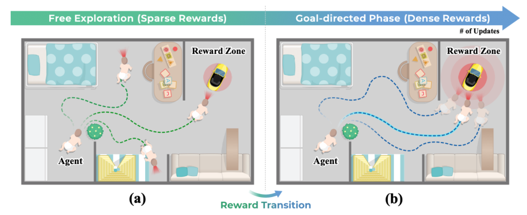


A PREPRINT - JANUARY 30, 2025


Our research sheds light on the intricate balance between exploration and exploitation in RL, providing key insights for
designing adaptive reward structures. To support these findings, we developed diverse testbeds, including dynamic
robotic arm manipulation and egocentric 3D navigation tasks, specifically designed to evaluate and enhance generalization. By drawing inspiration from toddlers’ natural learning behaviors, we bridge biological and artificial learning,
providing a fundamental groundwork for RL systems that are not only robust and generalizable but also efficient in
complex environments.


This study builds upon our earlier work [47] and offers the following key contributions:


1. **Performance Improvement:** Inspired by toddler learning patterns, we demonstrate that the S2D approach
effectively enhances RL learning by balancing exploration and exploitation, leading to higher success rates,
improved sample efficiency, and better generalization compared to other reward strategies.


2. **Validation Across Diverse Environments:** We validate our approach for generalization and robustness across
diverse environments, including manipulation and visual navigation tasks. To this end, we also designed
customized 3D environments, such as ViZDoom and Minecraft mazes, for comprehensive evaluation.


3. **Impact on 3D Policy Loss Landscape:** Using a cross-density visualizer and sharpness metric, we show that
S2D transitions smooth the policy loss landscape, resulting in wider minima that improve generalization in RL
policies.


4. **Reinterpretation of Tolman’s Maze Experiment:** We show that the role of early free exploration under
sparse rewards in S2D frameworks establishes robust initial policies, enhancing generalization and stability
during transitions to dense rewards.


**2** **Related Works**


**2.1** **Exploration-Exploitation in Deep Reinforcement Learning**


Balancing exploration and exploitation is a key challenge in deep RL [33]. Exploration allows agents to discover new
strategies, while exploitation maximizes rewards from known behaviors. Striking this balance is particularly challenging
in sparse-reward settings, where feedback is rare and tied to specific goals, offering little guidance for effective learning.
To address this, additional rewards are introduced through two complementary methods. Extrinsic rewards, aligned
with task objectives, provide feedback for intermediate milestones, guiding agents toward their goals. Intrinsic rewards,
driven by curiosity or novelty, promote exploration of new states using techniques like next-state prediction [3, 4, 48].
These mechanisms work together to help agents overcome the limitations of sparse rewards by encouraging exploration
while maintaining goal-oriented behavior. Within this framework, we propose a reward strategy inspired by human
development. Similar to toddlers, who initially explore freely in sparse-reward environments before transitioning
to goal-directed behaviors supported by denser feedback, we investigate how this paradigm can enhance RL agents’
adaptability, exploration efficiency, and overall performance across varying reward structures.


**2.2** **Toddler-Inspired Learning**


The developmental stages of toddlers have provided a novel perspective for advancing deep learning. Researchers
studied the natural exploratory behaviors and unique learning mechanisms of toddlers and discovered ways to refine
both supervised and reinforcement learning approaches. For example, classifiers trained on datasets reflecting a toddler’s
perspective of objects have been shown to outperform those based on adult perspectives [5], demonstrating the benefits
of exploration-centered learning. Similarly, critical learning periods in toddlers correspond to similar phases in RL

[9, 46] and deep neural networks [1]. These toddler-inspired methodologies highlight significant parallels between
biological growth and AI model development, underscoring the value of biological insights in advancing AI.


**2.3** **Curriculum Learning**


Curriculum Learning (CL), inspired by educational curriculums, has been shown to improve training speed [20], learning
efficiency, and safety [57] in machine learning. The progression of CL from easy to more challenging tasks is effective
in enhancing generalization and convergence rates [6, 58] in both supervised and reinforcement learning [12, 18, 41].
While numerous studies focus on easy-to-hard tasks [10, 11, 25], other studies [37, 60] suggest a _general-to-specific_
approach. In such an approach, agents first gather diverse experiences and then exploiting them. Following this idea,
we incorporate the toddler-inspired S2D reward transition into RL, applying it to goal-directed reward transitions.


3


A PREPRINT - JANUARY 30, 2025


Figure 2: Summary of the baseline rewards.


**2.4** **Potential-Based Reward Shaping (PBRS)**


In RL, the objective is to maximize cumulative rewards. However, designing optimal reward functions often poses
significant challenges, frequently involving intensive reward engineering. Reward Shaping (RS) is a well-established
method used to accelerate training by offering supplementary feedback [54]. When reward structures are variable,
potential-based reward shaping ensures that optimal strategies remain stable by integrating rewards based on potential
functions [43]. Traditionally, these shaped rewards are applied consistently throughout the training process. In contrast,
our study introduces the concept of Toddler-Inspired Reward Transition, examining the impact of dynamically adjusting
reward density over time.


**3** **Preliminaries**


**3.1** **Reinforcement Learning**


Reinforcement learning (RL) is a field of machine learning particularly suited for solving sequential decision-making
problems. The core principle of RL is to maximize an agent’s expected reward through trial and error, analogous to
how humans acquire skills to complete tasks. RL problems are commonly modeled using a Markov Decision Process
(MDP), defined as _⟨S, A, P, R, γ⟩_, which consists of the following components: a set of states _S_, a set of actions _A_, a
state transition probability matrix _P_ : _S × A →S_, and a reward function _R_ : _S × A →_ R. The discount factor _γ_ is
used to limit the influence of rewards from distant future states in a trajectory.


At each time step _t_, the agent selects an action _at ∈A_ based on a policy _π_ ( _·|st_ ), which specifies a probability over
actions given the current state _st ∈S_ . The MDP updates its state to _st_ +1 _∼P_ ( _·|st, at_ ), and the agent receives a reward
_R_ ( _st, at_ ) during the transition. The goal of an RL algorithm is to determine an optimal policy _π_ _[∗]_ _∈_ Π _[∗]_ _⊆_ Π, where
Π is the set of all possible policies, and Π _[∗]_ represents the subset of policies that maximizes the expected cumulative
reward _R_ = E [ [�] _[∞]_ _t_ =0 _[γ][t][R]_ [ (] _[s][t][, a][t]_ [)]][.]


**3.2** **Potential-Based Reward Shaping**


To improve an agent’s performance, selecting an appropriate curriculum is crucial. In this study, we argue that adjusting
the proportions of provided rewards is instrumental in achieving robust and generalized performance. Formally, we
define supp( _R_ ) _⊆S_ as the _support_ set of the reward function _R_ . In other words, supp( _R_ ) comprises the states that
yield non-zero rewards for certain actions:


supp( _R_ ) = _{s ∈S | ∃a ∈A s.t. R_ ( _s, a_ ) _̸_ = 0 _}._


The sparsity of a reward function is quantified by the ratio of the cardinalities of supp( _R_ ) and _S_ . For two reward
functions _RD_ and _RS_ defined on _S_, we say that _RD_ is _denser_ than _RS_ if the condition _|_ supp( _RS_ ) _| ≤|_ supp( _RD_ ) _|_
is satisfied. In the context of curriculum learning, we assume that the support set of a _dense_ reward function _RD_
encompasses that of a _sparse_ reward function _RS_ : supp( _RS_ ) _⊆_ supp( _RD_ ).


For reward transition, mechanisms that systematically move from sparse to dense rewards while maintaining learning
stability are essential. Potential-based reward shaping (PBRS) provides a practical approach by densifying the reward
signal with an additional potential-based reward _Fi_, all while preserving the optimal policy. In PBRS, the potential-based
reward _Fi_ for the _i_ -th MDP is defined as follows:


4


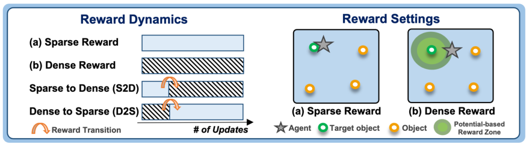


A PREPRINT - JANUARY 30, 2025


_Fi_ ( _s, a_ ) = E _s′∼P_ ( _s,a_ )[ _γ_ Φ _i_ ( _s_ _[′]_ ) _−_ Φ _i_ ( _s_ )] _,_ (1)


where Φ _i_ : _S →_ R is a _potential function_ at stage _i_ . Note that the optimal policy _π_ _[∗]_ _∈_ Π _[∗]_ with respect to reward _Ri_ is
still optimal with respect to reward ( _Ri_ + _Fi_ ):


�


_Q_ ( _s, a_ ) = E _P,π_


= E _P,π_


= E _P,π_


_∞_
�
� _t_ =0


_∞_
�
� _t_ =0


_∞_
� _γ_ _[t]_ _R_ _[t]_ _i_
� _t_ =0


� _γ_ _[t]_ [ �] _R_ _[t]_ _i_ [+] _[ F][ t]_ _i_ � _| s_ 0 = _s_


_t_ =0


_−_ Φ _i_ ( _s_ 0) _._


�


� _γ_ _[t]_ _R_ _[t]_ _i_ [+] _[ γ][t]_ [�] _γ_ Φ _i_ ( _st_ +1) _−_ Φ _i_ ( _st_ )� _| s_ 0 = _s_


_t_ =0


�


Also, the supported region of the PBRS reward, denoted as supp( _Ri_ + _Fi_ ), contains the region of its original reward _Ri_ :


supp( _Ri_ + _Fi_ ) = supp( _Ri_ ) _∪_ supp( _Fi_ ) _⊇_ supp( _Ri_ ) _,_


and it means that the PBRS reward is more denser than the original reward.


**3.3** **Multi-stage RL with Potential-based Reward Function**


Curriculum learning [20, 57] is a multi-stage approach for training models robustly by progressively adjusting the difficulty of
tasks over time. In RL, curriculum learning is defined as a series of MDPs _{Mi}i_ _[N]_ =1 [where each MDP] _[ M][i]_ [=] _[ ⟨S][,][ A][,][ P][,][ R][i][, γ][⟩]_
is characterized by a unique reward function _Ri_, representing different task difficulties [6, 58]. By setting the stage transitions
_T_ = ( _T_ 1 _, T_ 2 _, · · ·, TN_ _−_ 1), the MDP transitions from one to another.


**Definition 1 (Curriculum)** _Let a series of MDPs be {Mi}i_ _[N]_ =1 _[with][ M][i]_ [=] _[ ⟨S][,][ A][,][ P][,][ R][i][, γ][⟩][, and its state transitions be][ T]_ [ =]
( _T_ 1 _, T_ 2 _, · · ·, TN_ _−_ 1) _∈_ N _[N]_ _[−]_ [1] _. A curriculum C is defined as a tuple C_ = ( _{Mi}i_ _[N]_ =1 _[,][ T]_ [ )] _[ where the][ M]_ _I_ ( _t_ ; _T_ ) _[is chosen to train the]_
_agent at training step t ∈_ N _. The stage indicator I_ ( _t_ ; _T_ ) _is defined as:_


_∀i, ∀t ∈_ [ _Ti−_ 1 _, Ti_ ) _,_ _I_ ( _t_ ; _T_ ) := _i,_


where _T_ 0 := 0 and _TN_ := _∞_ .


**3.4** **Wide Minima Phenomenon and Loss Landscape**


In deep neural networks, the loss landscape refers to the multi-dimensional space where each point’s altitude represents the loss
for specific parameters [35]. The objective is to find minima in this landscape. Wide minima have broad gradients, facilitating
smooth convergence to global minima via gradient descent, which enhances robustness and generalization to data distribution
perturbations [27]. In contrast, _sharp minima_ possess steep gradients that are sensitive to such perturbations, often leading to
overfitting and poor generalization [15]. Empirical studies have shown that models located in wide minima tend to perform better
and generalize more effectively than those situated in sharp minima [24, 28]. This principle also applies to RL, where the distribution
of the experiences of an agent can vary slightly at each time step. Our empirical results confirm that policies positioned in wide
minima improve generalization and robustness in these fluctuating environments.


**3.5** **Tolman’s Maze Experiment**


The classic maze experiment conducted by Edward C. Tolman provides a foundational basis for understanding the Sparse-to-Dense
(S2D) reward transition strategy [56]. Tolman’s study revealed how rats navigated mazes under varying reward conditions, yielding
valuable insights into the role of free exploration and reward timing. Specifically, three groups of rats were tested:


1. No Reward Group: Rats freely explored the maze without receiving any rewards. (analogous to **only sparse** )


2. Consistent Reward Group: Rats received rewards consistently upon reaching the goal. (analogous to **only dense** )


3. Delayed Reward Group: Rats began in a reward-free phase but later transitioned to consistent rewards. (analogous to
**Sparse-to-Dense, S2D** )


Notably, the Delayed Reward Group outperformed others once rewards were introduced, suggesting that the period of free exploration
allowed the rats to form internal representations, or cognitive maps, of their environment. These cognitive maps facilitated efficient
navigation when the rewards became available. Inspired by these cognitive and developmental phenomena, our study explores
whether free exploration under sparse rewards in the S2D framework can similarly cultivate foundational experiences in AI agents,
thereby enhancing their ability to construct cognitive maps and ultimately improving learning efficiency and policy robustness in RL.


5


A PREPRINT - JANUARY 30, 2025


**4** **Method**


To implement our experiments, we design a reward transition frameworks inspired by toddler behavior. We investigate how this
transition affects agent learning, focusing on its impact on the policy loss landscape and the emergence of wide minima. Inspired by
Tolman’s experiments, we further examine the role of free exploration under sparse rewards within S2D frameworks by analyzing the
internal representations formed.


**4.1** **Toddler-Inspired Sparse to Dense Reward Curriculum**


We first design the Sparse to Dense (S2D) reward transition to infuse the exploration-to-exploitation strategy into curriculum learning.
A curriculum _C_ becomes an _S2D-curriculum_ if the reward functions _{Ri}i_ _[N]_ =1 [of their respective MDPs] _[ {M][i][}][N]_ _i_ =1 [gradually become]
denser while preserving optimal policies.


**Definition 2 (** _**Toddler-inspired S2D-curriculum**_ **)** _A curriculum C_ = ( _{Mi}i_ _[N]_ =1 _[,][ T]_ [ )] _[ with its corresponding MDPs][ M][i]_ [=]
_⟨S, A, P, Ri, γ⟩_ _is an S2D-curriculum if the following conditions are satisfied:_


supp( _R_ 1) _⊆_ supp( _R_ 2) _⊆· · · ⊆_ supp( _RN_ ) (2)


Π _[∗]_ 1 _[⊇]_ [Π] _[∗]_ 2 _[⊇· · · ⊇]_ [Π] _[∗]_ _N_ _[,]_ (3)


Π _[∗]_ _i_ [is a set of optimal policies within the MDP] _[ M][i]_ [. Equation 2 indicates that the sequence of reward functions should increase in]
density. Equation 3 constrains the optimality on the policies such that the optimal policies of _Mi_ +1 are also optimal in _Mi_ .


From Equations 2 and 3, the reward functions must become denser while preserving the same set of optimal policies. To achieve this,
we use the potential-based reward shaping (PBRS) approach [22, 42], which allows adjusting the reward density without altering the
optimal policy.


For the experiments, we assume that the agent can only get a reward if it reaches the goal _g ∈G_ within a certain radius in the
_sparse_ reward setting ( _M_ 1): _F_ 1( _s_ ) = 0. On the other hand, in the _dense_ reward setting ( _M_ 2, _M_ 3), the agent gets an additional
potential-based dense reward _Fi≥_ 2 with the potential function Φ( _·_ ), shown in Equation 4:


Φ( _s_ ) := diam _p_ ( _S_ ) _−||s −_ _g||p,_ (4)


where _s ∈S_ and _g ∈G_ are the agent’s current position and the goal position, respectively. diam _p_ ( _S_ ) is the diameter of given set
_S_ . The dense reward is determined by the agent’s proximity to the goal, based on the Euclidean distance ( _p_ = 2) or Manhattan
distance ( _p_ = 1) . Table 1 shows sparse and dense reward functions utilized across various experimental environments. The detailed
implementation of the Toddler-Inspired S2D Reward Transition is provided in Algorithm 1.


**Algorithm 1:** Algorithm for Toddler-Inspired Sparse-to-Dense (S2D) Reward Transition in RL

**Input:** RL algorithm _G_ (e.g., SAC, PPO, DQN), Curriculum _C_ = _{Mk}k_ _[n]_ =1 [with state transition] _[ T]_ [ =] _[ {][T][k][}][n]_ _k_ =1 _[−]_ [1][, Potential]
function Φ, Discount factor _γ_, Terminal step _Td_
**Output:** Trained RL agent with optimized policy _πθ_
**1** Initialize RL agent with policy parameters _θ_, environment _E_

**2** Initialize Replay buffer _B ←∅_

**3** _T ←_ 0 _, k ←_ 1

**4 while** _T < Td_ **do**

**5** _t ←_ 0

**6** Reset environment, obtain _s_ 0
**7** **while** _not terminal condition_ **do**


**8** _t ←_ _t_ + 1

**9** _at ∼_ _πθ_ ( _·|st_ )

**10** ( _rt, st_ +1) _←Mk_ ( _st, at_ )

**11** # _F_ 1( _·, ·_ ) = 0, supp( _Fk_ ) _⊆_ supp( _Fk_ +1)

**1213** _Fr_ ˜ _tk ←_ ( _st, art_ + _t_ ) _← Fk_ ( _γs_ Φ( _t, astt_ +1) ) _−_ # Update rewardΦ( _st_ )

**14** _B ←B ∪{_ ( _st, at,_ ˜ _rt, st_ +1) _}_

**15** _b ←_ sample( _B_ )

**16** _πθ ←G_ ( _πθ, b_ ) # Update policy with mini-batch from replay buffer

**17** **end**


**18** _T ←_ _T_ + _t_

**19** **if** _T ≥_ _Tk_ **then**

**20** _k ←_ _k_ + 1 # Transition to next stage

**21** **end**


**22 end**


**23 return** _πθ_


6


A PREPRINT - JANUARY 30, 2025


**4.2** **Visualizing Policy Loss Landscapes**


This study examines the impact of the S2D transition on the policy loss landscape. Following the method outlined in [35], we plot
policy loss landscapes by varying parameters _θ_ [˜] = _θ_ + _α_ **x** + _β_ **y**, where _θ_ denotes the current parameters and _α_ and _β_ are normalized
coordinates. The axes, represented by vectors **x** and **y**, introduce specific perturbations in the parameter space. These vectors are
normalized to have unit length and are orthogonalized for clarity and consistency in scaling. The z-axis represents the average policy
loss over a batch of transitions from the replay buffer. It is important to note that the relative position of one landscape over another
is not significant since each landscape corresponds to distinct network parameters with different loss ranges due to varying stages of
learning.


Given the lack of effective visualization techniques for policy loss landscapes during reward transitions in previous research, we
have created the Cross-Density Visualizer. This tool provides a 3D view of the shift of policy loss landscapes from exclusively
sparse or dense rewards to mixed-reward settings. Our approach involves two distinct sets of transitions: Sparse-to-Dense (S2D) and
Sparse-to-Sparse (Only Sparse) in one, and Dense-to-Sparse (D2S) and Dense-to-Dense (Only Dense) in the other. As illustrated in
Figure 5 and further elaborated in Appendices B and C, our visualizations reveal _smoothing effects_, especially prominent in the S2D
model.


Table 1: Sparse and dense reward formulations used in each environment. Rewards are provided when the specified
conditions are met.


**Environment** **Description** **Sparse Reward** **Dense Reward**


**LunarLander** 2D landing simulation _||s −_ _g||_ 2 _<_ 1 _γ_ Φ( _st_ +1) _−_ Φ( _st_ ) _<_ 0 _._ 3
**CartPole** Pole balancing _||s −_ _g||_ 2 _<_ 0 _._ 02 _γ_ Φ( _st_ +1) _−_ Φ( _st_ ) _<_ 1
**UR5** Robotic arm reaching _||s −_ _g||_ 2 _<_ 0 _._ 02 _γ_ Φ( _st_ +1) _−_ Φ( _st_ ) _<_ 1
**ViZDoom-Seen** First-person maze (trained) _||s −_ _g||_ 2 _<_ 0 _._ 0075 _γ_ Φ( _st_ +1) _−_ Φ( _st_ ) _<_ 0 _._ 14
**ViZDoom-Unseen** First-person maze (unseen) _||s −_ _g||_ 2 _<_ 0 _._ 0075 _γ_ Φ( _st_ +1) _−_ Φ( _st_ ) _<_ 0 _._ 14
**Cross Maze** 2D navigation task _||s −_ _g||_ 1 _<_ 2 _γ_ Φ( _st_ +1) _−_ Φ( _st_ ) _<_ 5
**Playroom Maze** 3D toddler exploration _||s −_ _g||_ 1 _<_ 2 _γ_ Φ( _st_ +1) _−_ Φ( _st_ ) _<_ 5


**4.3** **Exploring Minima Sharpness After Reward Transitions**


Our findings of smoothing effects prompted us to hypothesize that the S2D transition helps escape local minima and enhances
generalization in wider minima. Wide minima in neural networks are indicative of robust and adaptable models [24, 28]. By
investigating minima after this transition, we aim to enhance performance and gain a better understanding of agent adaptability in
various situations. To evaluate the extent to which the policy remains in wide minima, we measure the end-of-training convergence
of the neural network of S2D to wide minima using the sharpness metric defined in Equation 5 and compare it with those of other
transitions. This follows the approach proposed in [13], which outlines a specific form of sharpness measure as described in [28].


_||_ max _ϵ||p≤ρ_ _[L][π]_ [(] _[θ]_ [ +] _[ ϵ]_ [)] _[ −]_ _[L][π]_ [(] _[θ]_ [)] (5)


Here, _θ_ represents the current parameters in the policy loss landscape. The maximizer ˆ _ϵ_ can be estimated using the following
equation:

_ϵ_ ˆ = _ρ_ sgn( _∇θLπ_ ( _θ_ )) _·_ _[|∇][θ]_ _[L][π]_ [(] _[θ]_ [)] _[|][q][−]_ [1] _/_ � _||∇θ_ _Lπ_ ( _θ_ ) _||_ _[q]_ _q_ � _p_ 1 _,_


where 1 _/p_ + 1 _/q_ = 1, and sgn( _·_ ) is the element-wise sign function [13]. For our experiments, we used _ρ_ = 0 _._ 02, and _p_ = _q_ = 2 in
our experiments.


**4.4** **Analyzing Policy Behavior in Tolman’s Maze Experiments**


We also examine the impact of the S2D transition on agents’ internal representations, inspired by Tolman’s maze experiments [56].
We hypothesize that early free exploration under sparse rewards fosters robust initial parameters through diverse experiences, enabling
efficient policy learning under dense rewards. Using (1) RNN feature convergence, (2) policy visualization and (3) Visualization of
Trajectory, we highlight another dimension of the S2D approach’s advantages.


**4.4.1** **Measuring the Mean Distance Between RNN Features**


In our partially observable 3D egocentric playroom maze, the agent uses a recurrent neural network (RNN) to maintain hidden states.
To measure how quickly these internal representations converge, we:


7


A PREPRINT - JANUARY 30, 2025


(a) Collect observations: We fix a particular roll-out (trajectory) in the environment. This trajectory is the same across all
reward baselines for fair comparison.

(b) Record and extract hidden states: At regular training intervals (e.g., every _X_ steps), we checkpoint the RNN parameters of
each agent. Using the saved parameters, we re-run the same trajectory and record the corresponding hidden state vectors
**h** _t_ at each time step _t_ .
(c) Compute mean distances: We compute the mean pairwise distance, which is _ℓ_ 2 distance _|_ **h** _t_ 1 _−_ **h** _t_ 2 _|_ 2, between hidden
state vectors across time to quantify how much (and how consistently) the RNN representation changes across training
checkpoints.


A sharper drop in these distances typically indicates that the RNN features are converging faster or more stably. As demonstrated in
Figure 9-(a), the S2D transition tends to yield faster convergence than other baselines after reward transition.


**4.4.2** **Action Frequency Analysis**


Figure 9-(b) presents a temporal analysis of discrete action frequencies, such as _move forward_, _turn left_, and _turn right_, over
checkpoints saved at regular intervals during training. The sparse-to-dense reward transition occurred at 3 million steps, and the
statistical distribution of actions sampled from the policy _π_ ( _a | s_ ) was evaluated over three rollout episodes. For each step _t_ within
an episode, actions _at_ were drawn according to _π_ ( _a | st_ ), where _st_ denotes the observed state at time _t_ . The aggregated frequency
of an action _a_, denoted as _fa_, is computed as:


�


_Ti_
�


1

_Ti_
�


_fa_ = [1]

_n_


_n_
�


_i_ =1


� I( _a_ = _a_ _[i]_ _t_ [)]


_t_ =1


_,_


where _Ti_ represents the length of the _i_ -th episode, _N_ = [�][5] _i_ =1 _[T][i]_ [ is the total number of steps across all five episodes, and][ I][(] _[a]_ [ =] _[ a]_ _t_ _[i]_ [)]
is the indicator function that equals 1 if the action _a_ _[i]_ _t_ [at step] _[ t]_ [ of episode] _[ i]_ [ matches] _[ a]_ [, and 0 otherwise. This analysis provides insights]
into the temporal preferences of the policy _π_ over the course of training.


**4.4.3** **Trajectory Visualization**


The agent’s spatial trajectories, defined by its global coordinates, are plotted on a 2D overhead map to visualize navigation patterns.
Figure 7 highlights the most frequently traversed paths, identified via visual inspection. These paths represent common strategies
employed by the agents to reach the goal, often corresponding to optimal or near-optimal navigation routes. Frequent trajectories are
extracted using frequency-based methods, providing insights into the agent’s pathfinding efficiency. As shown in Figure 8, compared
to an only dense—which tends to be biased toward stronger rewards and thus exhibits more “angular” exploration—S2D explores
more freely across multiple directions. This broader range of experiences leads to richer, more foundational learning.


**5** **Experiment Design**


In this section, we explore in-depth the dynamics of the S2D reward transition compared to multiple reward-driven methods. We
discuss its substantial effects across multiple challenging environments, as illustrated in Appendix A. We specifically explored the
implications of applying the reward transition to RL by addressing four critical questions:


The details of our environments and extensive supplementary experiments are outlined in Appendix A and C.


**5.1** **Reward Setting Details**


**5.1.1** **Reward-driven baselines for comparison.**


As outlined in Figure 2, we examine four primary reward settings: (1) Only Sparse, where rewards are given only upon reaching the
goal, encouraging broad exploration; (2) Only Dense, which uses potential-based reward shaping (PBRS) [43] to provide additional


8


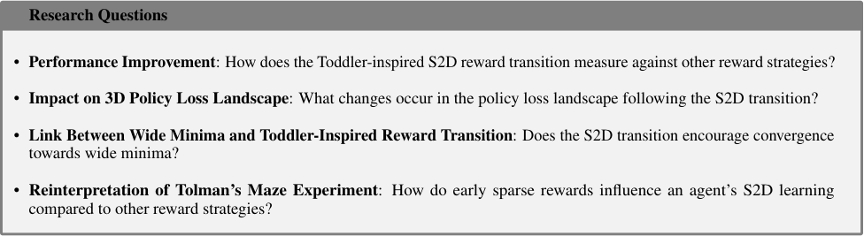


A PREPRINT - JANUARY 30, 2025


Figure 3: Experimental environments. (a) ViZDoom environments. (b) Minecraft environments. (c) Additional
environments: Modified UR5-Reacher, Cartpole-Reacher with randomly spawned goals, and the detailed description of
LunarLander are provided in Appendix A.


rewards based on proximity to the goal, preserving optimal policies while enhancing goal-directed learning; (3) Sparse-to-Dense
(S2D), starting with sparse rewards to promote exploration before transitioning to dense rewards for effective exploitation; and (4)
Dense-to-Sparse (D2S), the reverse of S2D, starting with dense rewards and transitioning to sparse rewards to evaluate its relative
impact. For detailed formulations of sparse and dense rewards, including the specific distance thresholds for each environment,
please refer to Table 1.


As an additional baselines, we also incorporate intrinsic motivation reward methods, which similarly tackle this trade-off. Specifically,
we used Never Give Up (NGU) [4] for discrete environments like ViZDoom and LunarLander, and Random Network Distillation
(RND) [8] for continuous action environments like CartPole. These approaches incentivize exploration by providing intrinsic rewards
to agents for identifying new states.


**5.1.2** **Hyperparameter Analysis of Reward Transition Timing.**


Furthermore, we analyzed hyperparameters for the timing of reward transitions through ablation studies (see Table 2). Inspired by
early developmental interactions [49, 53], we compare three transition points, _t ∈{_ 1 _N,_ 2 _N,_ 3 _N_ _}_, where _N_ is roughly 1/12 of the
entire training period. The specific value of _N_, adjusted for each environment’s episode length, is detailed in Appendix A. These
transition points are labeled as _C_ 1, _C_ 2, and _C_ 3, respectively, for S2D and D2S reward transitions.


**5.2** **Environment Details**


To evaluate the impact of reward dynamics, we tested under various conditions, including state-based and visual observations, as
well as both discrete and continuous action spaces, detailed in Appendix A-Table A.2. We examined different reward configurations,
including the S2D reward transition, across several goal-directed tasks in established benchmark environments. Figure 3-(c) depicts
examples such as LunarLander [7], CartPole, and UR5 [55]. Appendix A provides a comprehensive description of the challenging
dynamics introduced for UR5 and CartPole, with randomized placements for agents, goals, and obstacles, labeled as the ‘reacher’
version. All agents had full access to state information and were assessed using the Soft Actor-Critic (SAC) [19] algorithm.
Additionally, we adjusted the reward structure for both sparse and dense settings, with additional details in Appendix A.


**5.2.1** **Enhanced Generalization Environment**


To deepen the evaluation of generalization capabilities, we designed a challenging egocentric navigation scenario within the ViZDoom
environment [26], as illustrated in Figure 3-(a). In the **Seen** environment (Appendix Figure A.12-(a), objects were randomly placed,
and walls featured one of three textures. The **Unseen** environment (Appendix Figure A.12-(b)) required the agent to adapt to three
new wall textures, distinct from those in the **Seen** scenario. The A3C [40] algorithm was employed to assess performance in this

context.


**5.2.2** **Tolman’s Maze Environments**


To emulate the learning behavior in Tolman’s maze, we created two 3D egocentric navigation scenarios using the Minecraft toolkit
(see Appendix A). The first scenario, illustrated in Figure 3b-Upper, is a cross maze where agents spawn in a designated blue zone at
the maze’s center and must move outward along different corridors to reach three goals—two used in training and a newly introduced


9


A PREPRINT - JANUARY 30, 2025


Figure 4: The agent’s performance across different reward baselines in several goal-oriented tasks. (1-3) In LunarLander,
the total reward gained from intrinsic incentives was well below zero, as indicated by the dashed line. For UR5, both
intrinsic motivation and sparse reward settings resulted in near-zero performance, making it difficult to observe. (4), (5)
The ViZDoom agent’s ability to generalize across different reward types.


one for evaluation. The central insignia obscure visibility, encouraging an exploration-exploitation trade-off. This environment is
especially challenging for Goal 2 due to its reduced reward area (see Appendix A, Figure A.13).


The second scenario, shown in Figure 3b-Lower, mimics a toddler’s playroom, where agents spawn in a blue zone and must
navigate to a randomly placed goal in a red zone. The space is cluttered with objects of varying colors and sizes, requiring more
complex navigation. This setup is designed to analyze policy representations as agents learn from egocentric observations in a
high-dimensional input space that closely resembles real-world conditions.


**6** **Results**


**6.1** **Performance Results**


**6.1.1** **Sample Efficiency and Success Rate**


We conducted experiments in diverse environments with static points of view. The results are presented in Figure 4-(1-3) and
Table 2. These environments vary in the agents’ performance under sparse reward; LunarLander and CartPole-Reacher exhibited
poor performance with default sparse rewards. In these scenarios, the S2D approach consistently outperformed all other baselines
and showed superior sample efficiency. Even in the more challenging UR5-Reacher, which requires more precise control and
has a higher-dimensional action space, S2D still led the performance. Unlike intrinsic motivation-based algorithms that often
prioritize exploration state over goal achievement, S2D outperformed other methods. Furthermore, we conducted experiments in
ViZDoom-Seen and Unseen, Minecraft Cross, and Minecraft playroom maze, which are environments with an egocentric viewpoint.
Similar to the results mentioned above, S2D exhibited superior performance across all cases, as demonstrated in Figure 4-(4-5),
Figure 6 and Figure 7. Notably, D2S outcomes were consistently lower than those of S2D in all environments, highlighting the
effectiveness of the S2D transition as a training curriculum.


**6.1.2** **Enhanced Generalization Performance**


The S2D reward transition consistently outperformed other agents in various dynamic environments that require strong generalization,
such as those with varying goal locations or agent spawn positions, as shown in Figure 3a to 3c. We specifically designed more
challenging environments that introduce visual changes not seen during training, illustrated in Figure 3a and 3b.


In the ViZDoom-Unseen environment, where agents face significant visual changes due to the addition of three new wall textures
(Figure 3a), the S2D transition demonstrates superior generalization and sample efficiency compared to other baselines, as shown
in Figure 4-(4),(5). Similarly, in the Minecraft Cross maze, where a newly occurring goal location appears during evaluation
(Figure 3b-Upper), the S2D transition still displayed superior results, as shown in Figure 6.


10


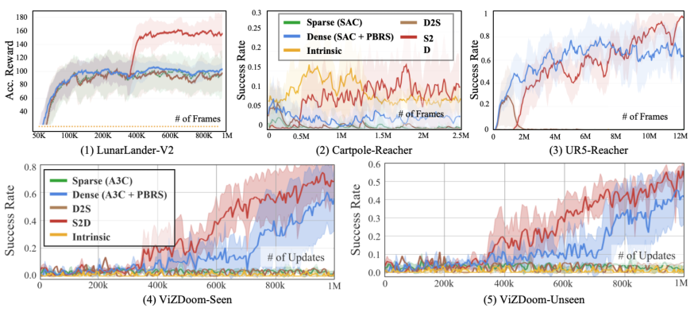


A PREPRINT - JANUARY 30, 2025


Task Metric S2D( _C_ 1) S2D( _C_ 2) **S2D** ( _C_ 3) Only Sparse Only Dense D2S( _C_ 1) D2S( _C_ 2) D2S( _C_ 3)


Lunar Perf. 138.71 _±_ 3.71 63.40 _±_ 160.55 **168.88** _±_ 23.66 142.50 _±_ 4.25 139.68 _±_ 14.90 140.75 _±_ 7.46 130.63 _±_ 19.69 142.37 _±_ 15.62
Lander Sharp. 27.06 _±_ 36.31 1231.93 _±_ 2424.61 **7.46** _±_ 3.37 8.97 _±_ 2.83 8.71 _±_ 4.43 8.95 _±_ 2.89 8.99 _±_ 2.97 11.32 _±_ 3.72


Perf. 3.18 _±_ 4.00 **14.61** _±_ 10.96 5.29 _±_ 7.47 0.14 _±_ 0.25 3.88 _±_ 4.63 1.55 _±_ 0.29 0.38 _±_ 0.07 0.97 _±_ 0.19
CartPole
Sharp. 0.12 _±_ 0.24 **0.01** _±_ **0.15** 0.01 _±_ 0.24 0.08 _±_ 0.57 0.19 _±_ 0.03 0.16 _±_ 0.09 0.05 _±_ 0.21 0.02 _±_ 0.17


Perf. 65.54 _±_ 10.86 65.69 _±_ 17.32 **94.15** _±_ 4.28 0.00 _±_ 0.00 64.23 _±_ 13.03 0.00 _±_ 0.00 0.00 _±_ 0.00 0.00 _±_ 0.00
UR5
Sharp. 0.67 _±_ 0.01 0.62 _±_ 0.11 **0.61** _±_ **0.04** 0.09 _±_ 0.52 0.67 _±_ 0.01 0.52 _±_ 0.24 0.56 _±_ 0.28 0.47 _±_ 0.20


Cross Maze 0 Perf. 75.19 _±_ 0.06 **81.90** _±_ 0.06 75.49 _±_ 0.06 64.94 _±_ 0.03 67.32 _±_ 0.08 60.57 _±_ 0.03 62.88 _±_ 0.03 63.96 _±_ 0.03


Cross Maze 1 Perf. 69.65 _±_ 0.07 **77.16** _±_ 0.05 75.39 _±_ 0.06 57.82 _±_ 0.03 69.46 _±_ 0.07 55.66 _±_ 0.04 57.31 _±_ 0.05 51.95 _±_ 0.05


Cross Maze 2 Perf. **63.60** _±_ 0.05 62.86 _±_ 0.03 57.60 _±_ 0.06 57.26 _±_ 0.03 57.54 _±_ 0.07 55.15 _±_ 0.05 57.25 _±_ 0.04 54.47 _±_ 0.04


playroom maze Perf. 22.95 _±_ 0.03 21.94 _±_ 0.02 **25.78** _±_ 0.03 17.50 _±_ 0.02 18.91 _±_ 0.02 16.06 _±_ 0.01 17.22 _±_ 0.01 17.59 _±_ 0.01


Table 2: Performance and sharpness metrics were measured over at least six trials in each environment. Reduced
sharpness indicates wide minima, which may improve generalization performance. The best performance and corresponding sharpness values are highlighted in bold, showing that the top-performing **S2D** also achieves the widest
minima. Through ablation studies of the reward transition timing, we also found that the optimal reward transition
timing occurs within the first third of training, similar to toddlers’ early critical learning period.


Figure 5: Analysis of policy loss landscape after reward transition. The 3D visualization depicts the policy loss
landscape following a reward transition, starting with either a sparse or dense reward.


**6.2** **Impact on 3D Policy Loss Landscape**


Our visualizations, presented in Figure 5 and detailed in Appendix B, emphasize significant _smoothing effects_, especially with the
S2D transition. In Figure 5, the upper row shows dense-to-dense (Only Dense) and D2S transitions, while the lower row displays
S2D and sparse-to-sparse (Only Sparse) transitions. Significant smoothing effects were primarily observed during the S2D transition,
aiding in overcoming local minima and promoting wider minima, thereby enhancing generalization. These effects became evident
after the transition at T = 50 and T = 2000 in LunarLander, and at T = 3500 in Cartpole-Reacher. Detailed 3D visualizations are
provided in Appendix B.


While our primary experiments focused on Soft Actor-Critic (SAC)[19], we also evaluated other algorithms, such as Proximal Policy
Optimization (PPO)[52] and Deep Q-Network (DQN)[38], as detailed in Appendix C, and observed similar smoothing effects during
the S2D reward transitions. Moreover, to further illustrate these smoothing effects, we experimented with these other algorithms in a
gridworld environment that reveals changes in the policy loss landscape more intuitively.


**6.3** **Results of Wide Minima**


Using sharpness metrics, we analyzed the convergence behavior at the end of training for networks guided by S2D reward transitions
and compared them to baseline models. Lower sharpness values, which correspond to wider minima, were found to be associated
with improved generalization. As evident from Table 2, only agents following the S2D reward transition converged to these wider
minima, indicating superior performance in various complex environments.


11


A PREPRINT - JANUARY 30, 2025


Figure 6: Performance analysis of agents using different reward strategies in the Cross maze environment. (a) Episode
length during training and evaluation for Goal Points 0, 1, and 2. (b) Number of episodes completed for training and
evaluation phases at different goal points.


**6.4** **Results of Tolman’s Maze Experiment**


**6.4.1** **Cross Maze**


We measured episode length, a performance metric used in Tolman’s maze experiment. Figure 6a shows that agents using the S2D
reward transition achieve consistently shorter episode lengths across Goal Points 0, 1, and 2 during training and evaluation compared
to other reward structures. Consequently, the plot of S2D extended furthest along the horizontal axis, indicating that the agent
completed more episodes within the same number of global steps.


To get a better understanding of learning trends, we measured the number of episodes completed during training and evaluation as
a function of global steps in Figure 6b. All S2D agents demonstrated a steeper increase in completed episodes, even in the more
challenging scenario of Goal Point 2. This indicates that S2D agents display higher sample efficiency and success rates across all
scenarios, demonstrating superior performance and generalization to unseen goal positions.


**6.4.2** **playroom maze**


Figure 7(a),(b)-(1),(2) show that S2D agents achieve significantly shorter episode lengths during training, indicating improved sample
efficiency and enhanced performance compared to other reward strategies. This suggests that the S2D reward transition mechanism
effectively guides agents to reach goals faster by balancing exploration and exploitation more efficiently and accelerating learning.


12


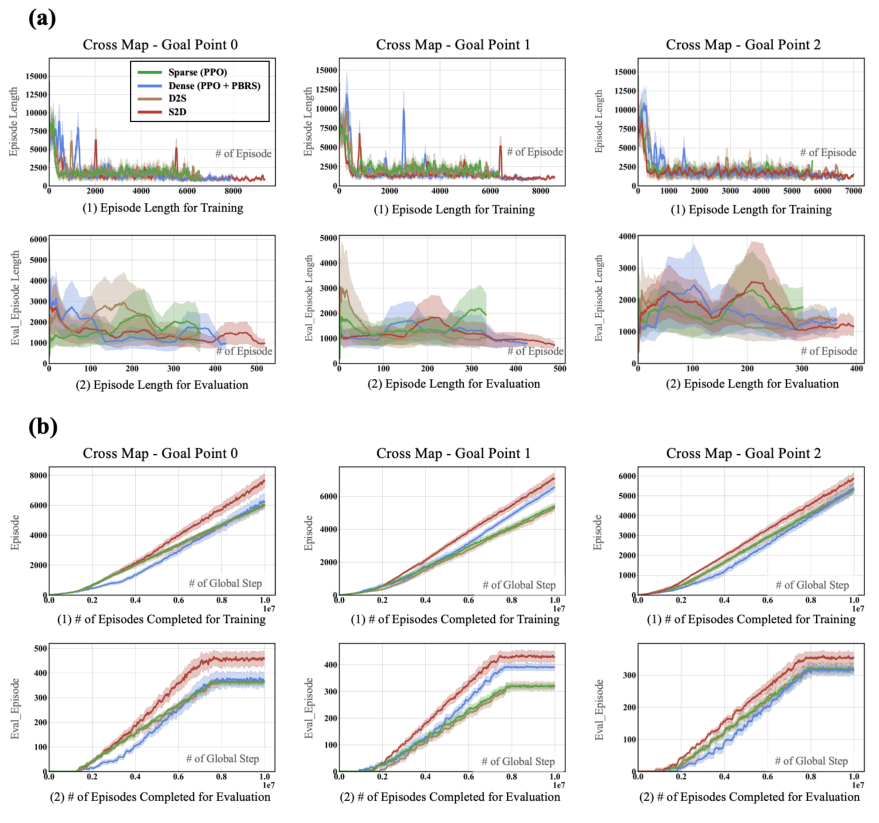


A PREPRINT - JANUARY 30, 2025


Figure 7: Performance analysis of agents using different reward strategies in the playroom maze environment. (a)
Random Seed: Training results with a random seed, similar to typical experimental settings. (b) Fixed Seed: In the
initial phase, before reward transitioning (at 0.3 global steps), sparse or dense rewards were used, and seeds were fixed
to ensure fairness and clarity in the analysis. A total of 6 seeds were used for each experiment.


Figures 7a,b-(3) show that overall, S2D demonstrates greater stability, lower variance, and improved learning performance compared
to the only dense reward strategy and others, even in visually complex, high-dimensional playroom environments. This highlights
the robustness and generalization capability of the S2D approach. Notably, after the reward transition point, compared to the purely
dense reward strategy, the all-S2D approach achieves faster convergence with much more stable performance, maintaining a much
lower standard deviation. This is clearly observed in the success rate results from both the random seed and fixed seed experimental
environments.


**6.4.3** **Visualization of Trajectory**


In the playroom maze (Figure8-(a)), agent trajectories under different reward settings reveal significant differences in exploration
behavior. The top row showcases agents’ extensive exploratory paths. S2D and Only Sparse agents exhibit diverse, exploratory
trajectories, providing opportunities to robustly learn about the environment and objects from various angles. This exploration
suggests that these agents can learn more about their environment, similar to how toddlers learn through extensive exploration. In
contrast, Only Dense agents show more direct and angular trajectories, indicating limited exploration and a focus on reaching the
goal quickly. This pattern suggests that dense reward agents focus on quickly reaching the goal, which may limit their ability to learn
about the environment comprehensively. The bottom row illustrates the most frequent shortest trajectories. S2D agents show the
most efficient paths to the goal, effectively balancing the exploration-exploitation trade-off. In the Cross Maze (Figure8-(b)), similar
patterns are observed. Agents using the S2D reward transition demonstrate better shortest trajectories.


**6.4.4** **Mean Distance Between RNN Features**


To evaluate the impact of reward transitions on RL agents’ internal representations, we analyzed the convergence of RNN feature
representations in the playroom maze. Figure 9-(a) depicts the mean Euclidean distance between hidden state vectors for agents
trained with S2D, Only Dense, and Only Sparse reward settings. Agents trained using the S2D framework exhibited a significant
reduction in feature distance following the reward transition, indicating faster convergence of internal representations. This suggests
that the sparse reward phase serves as a foundational learning stage, fostering robust initial parameter configurations through
extensive exploration and facilitating the discovery of diverse state-action mappings. These robust initial parameters enable stable
and generalizable optimization during subsequent dense reward learning. In contrast, agents trained exclusively with dense rewards
exhibited slower and less consistent convergence compared to those using the S2D approach. This disparity is likely due to limited
exploration, which prematurely reinforces suboptimal behaviors. Agents trained solely with sparse rewards demonstrated the slowest
convergence overall, as the scarcity of reward signals impeded the development of meaningful representations. For D2S agents, most
convergence occurred during the dense reward phase. The sparse reward phase had minimal impact post-transition, as initial dense
reward optimization induced a primary dense reward bias, thereby limiting adaptability to sparse rewards in later stages.


13


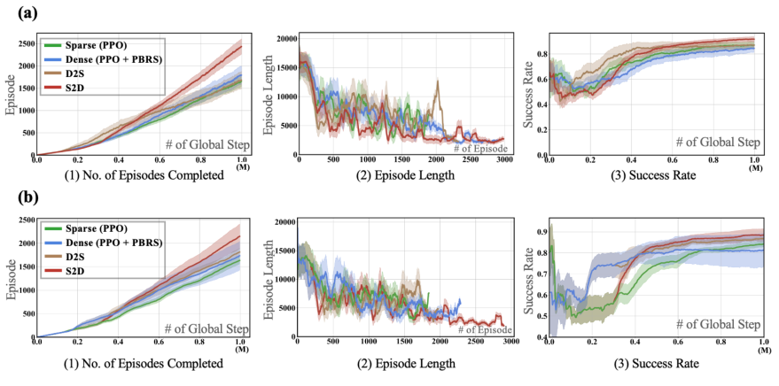


A PREPRINT - JANUARY 30, 2025


Figure 8: Visualizations of the trajectories near the final episode and feature analysis in maze environments. (a)
playroom maze Trajectories: The top row displays the exploration paths of agents with different reward settings. The
bottom row illustrates the most frequent shortest paths. (b) Cross Maze Trajectories: The most frequent shortest paths
are displayed.


Figure 9: Feature analysis in maze environments: RNN Feature and Action Frequency Analysis. (a) The left graph
shows the mean distance between RNN features during training, with the reward transition occurring at 3M steps.
In the region highlighted in red, the features converge notably faster for S2D compared to Only Dense, suggesting
that learning with sparse rewards initially provides good initial parameter points. (b) The right plots depict action
distributions (straight, left, right). The reward transition occurred at 3M steps, and the plots are based on results from
over five trials.


**6.4.5** **Action Frequency Analysis**


Figure 9-(b) illustrates the behavior distributions of agents trained under various reward baseline models. Each colored line—blue
(straight), orange (left), and gray (right)—represents the proportion of behaviors observed at specific checkpoints. During the sparse
reward phase, both the S2D and Only Sparse models exhibited significant instability in policy behaviors. Upon transitioning to
dense rewards, the S2D and Only Dense models displayed markedly divergent outcomes. The Only Dense model continued to
show instability even after apparent convergence, suggesting that its policy may have settled into a suboptimal local minimum. This
persistent instability indicates a vulnerability to environmental changes, thereby limiting the model’s generalizability. In contrast, the
S2D approach maintained consistent stability across all five trials, implying that its policy occupies a broader and more optimal


14


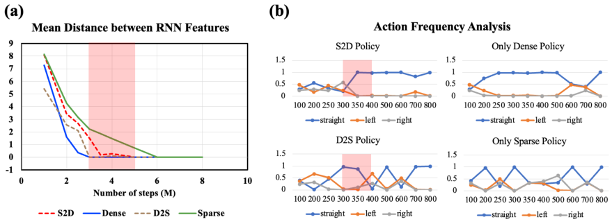


A PREPRINT - JANUARY 30, 2025


solution space. These findings highlight the robustness of the S2D framework in developing stable and generalizable policies capable
of adapting to environmental variations.


**7** **Discussion**


Throughout this study, we focus on the key challenge of balancing exploration and exploitation in goal-oriented RL, particularly
with reward shaping. This challenge is heightened in scenarios involving high-dimensional raw input, such as egocentric real-world
environments. To address this, we explore the significant advantages of incorporating S2D reward transitions, ranging from simple
gridworld environments to complex 3D egocentric-view settings, inspired by toddler learning patterns.


**7.1** **Performance Improvement**


Our results consistently show that S2D outperforms other reward-shaping strategies across both discrete and continuous action spaces.
In more generalizable environments like ViZDoom and mazes, S2D agents still converged faster, achieved optimal performance,
and exhibited lower variance compared to reward baselines. Moreover, we observed that agents equipped with intrinsic motivation
algorithms excel at discovering diverse states but mainly struggle to focus on specific goals, a critical requirement in goal-oriented
RL. In contrast, the S2D transition mechanism effectively balances exploration with exploitation, thereby facilitating stronger goal
attainment. Ablation studies reveal that the most beneficial point for transitioning from sparse to dense rewards typically lies around
the first quarter of the early training schedule, although the precise timing depends on task complexity. For instance, UR5-Reacher
requires an extended free exploration phase before transitioning, aligning with early critical learning periods observed in infant
development.


**7.2** **Impact on 3D Policy Loss Landscape**


One of the most striking findings of this study is the impact of S2D transitions on policy loss landscapes. Using our Cross-Density
Visualizer (Figure 5), we observed significant smoothing effects during S2D transitions, particularly in environments requiring
generalization. These effects reduce the sharp peaks and valleys typically associated with dense reward settings, thereby facilitating
convergence to wider minima. While our primary experiments utilize SAC, we extended our analysis to include other algorithms,
such as PPO [52] and DQN [38], to ensure a broader evaluation. Notably, this smoothing effect predominantly appears with the S2D
transition, as further confirmed in additional gridworld experiments detailed in Appendix C.


**7.3** **Link Between Wide Minima and Toddler-Inspired Reward Transition**


Wide minima, by virtue of their broad and flat characteristics, tend to produce solutions that generalize well to previously unseen
environments. The sharpness metrics in Table 2 support this claim, showing that S2D agents consistently achieve lower sharpness
values—indicative of wider minima. Indeed, only the S2D reward transition allowed agents to converge to the broadest minima in
LunarLander and CartPole-Reacher, where even the Only Sparse approach demonstrated some success. A notable exception arises in
UR5-Reacher, where the Only Sparse setting exhibits unexpectedly low sharpness but simultaneously yields near-zero performance.
This outcome is likely due to limited or absent gradient updates, causing gradient stagnation and high variance—factors that can
artificially reduce sharpness metrics. Nonetheless, the most critical comparison lies with the Only Dense baseline: S2D not only
outperforms dense rewards but also maintains high performance while exhibiting lower sharpness, aligning it more closely with wide
minima that facilitate robust generalization.! "


**7.4** **Key Insights from Reinterpretation of Tolman’s Maze**


Inspired by Tolman’s maze, our investigation centers on how early free exploration under sparse reward influences policy development
within the S2D framework. To this end, we designed two distinct maze environments to systematically evaluate these effects. Our
experiments reveal that, across all maze scenarios, S2D agents achieve shorter episode lengths and greater sample efficiency compared
to other reward configurations, such as using only dense rewards or D2S. In particular, trajectory visualizations in the Playroom
Maze (Figure 8) demonstrate that S2D agents exhibit more efficient behaviors, reliably identifying optimal paths compared to other
approaches.


During the sparse reward phase, S2D agents explored a broader range of pathways, whereas agents trained with only dense rewards
followed more constrained and angular trajectories. This suggests that initiating training with sparse rewards, rather than relying on
dense rewards from the outset, allows for more diverse experience gathering—ultimately laying a foundation for efficient policy
refinement once denser rewards are introduced.


To further assess how reward transitions influence the agents’ internal representations, we measured the mean distance between RNN
features during training (Figure 9-a). We observed that S2D agents showed a notable reduction in feature distances following the
reward transition, suggesting a faster convergence of internal representations compared to the Only Dense group. In contrast, Only
Dense agents—without the benefits of initial free exploration—experienced slower and less consistent convergence. Furthermore,
policy visualization (Figure 9-b) reinforces this observation, highlighting the stable exploration-exploitation balance maintained by
S2D agents.


15


A PREPRINT - JANUARY 30, 2025


Concluding these findings from Section 6.4.4, we claim that the introduction of sparse rewards at the outset promotes the development
of robust initial parameter settings. These parameters accelerate stable and generalizable policy learning when dense rewards are
introduced later. This approach aligns with Tolman’s original hypothesis: initial free exploration, followed by the introduction of
stronger stimuli, such as rewards, leads to optimal performance outcomes.


**8** **Conclusion**


Drawing inspiration from developmental learning of toddlers, this research advances a dynamic reward transition model in goaloriented RL, challenging the traditional static reward densities. Transitioning from S2D rewards improves learning efficiency across
various RL tasks while also fundamentally changing how the agent learns, encouraging a smoother, more stable progression toward
optimal behaviors. Our Cross-Density Visualizer reveals a key smoothing effect on the policy loss landscape during these transitions,
and sharpness metrics confirm that S2D fosters wider minima, promoting better generalization. Further, our reinterpretation of
Tolman’s maze experiments within custom 3D egocentric environments underscores the critical role of early free exploration in
establishing good initial policy parameters—akin to a cognitive map—which optimizes subsequent navigation as dense rewards
are introduced. This integration of developmental insights into RL methodology paves the way for designing more adaptable,
high-performance learning systems, significantly contributing to the field of RL.


**9** **Future Work and Opportunities**


The integration of the toddler-inspired reward transition paradigm within reinforcement learning (RL) frameworks has established a
foundational groundwork, demonstrating that the Sparse-to-Dense (S2D) transition can enhance agent generalization and performance.
Building upon this foundation, several promising avenues remain for further exploration, presenting significant opportunities to
advance the S2D framework and its applications.


**9.1** **Automating Reward Transition Timing**


A pivotal area for future research is the development of automated methods to determine the optimal timing for reward transitions.
Currently, the transition from sparse to dense rewards is manually scheduled based on predefined criteria. Our preliminary
investigations into smoothing effects and the convergence of recurrent neural network (RNN) representations lay the groundwork
for automated optimization methods. Future work should explore adaptive scheduling algorithms or meta-learning approaches
that dynamically adjust the reward transition timing based on real-time assessments of policy loss landscapes and representation
convergence metrics. Automating this process would enhance the adaptability and efficiency of the S2D framework, reducing the
reliance on manual intervention and enabling more nuanced reward shaping tailored to the agent’s learning progression.


**9.2** **Integrating with Model-Based RL Frameworks**


Another promising direction involves the integration of the S2D reward transition with model-based reinforcement learning (RL)
approaches. Model-based RL, which leverages internal representations of the environment to predict future states and outcomes,
contrasts with model-free RL, where agents learn policies directly from interactions without explicit environmental models. While
our Tolman maze experiments utilized model-free RL settings, incorporating model-based methods could enable more informed
decision-making by utilizing these predictive models. By combining S2D transitions with model-based frameworks, future research
can directly analyze and compare the impact of reward transitions on representation learning. This integration could facilitate the
development of more human-like learning environments, where agents not only learn from rewards but also build predictive models
of their surroundings, enhancing both efficiency and adaptability.


**9.3** **Extending to Multi-Agent Systems and Real-World Applications**


Expanding the S2D framework to multi-agent systems and real-world applications represents another significant opportunity for
future research. In collaborative tasks, where agents must balance individual goals with group objectives, dynamic reward transitions
could foster effective cooperation and healthy competition. Additionally, applying the S2D framework to real-world scenarios,
such as robot AI, would allow for the validation and refinement of our approach in more practical and complex environments. This
extension could lead to the development of more sophisticated and robust RL frameworks capable of handling the intricacies of
real-world interactions and multi-agent dynamics.


**10** **Acknowledgments**


The authors would like to express their sincere gratitude to Inwoo Hwang, Changhoon Jeong, Moonhoen Lee, and Dong-Sig
Han for their insightful discussions and valuable suggestions on the early drafts of this paper. This work was partly supported by
the IITP (2021-0-02068-AIHub/15%, 2021-0-01343-GSAI/10%, 2022-0-00951-LBA/15%, 2022-0-00953-PICA/25%) and NRF
(RS-2023-00274280/10%, 2021R1A2C1010970/25%) grant funded by the Korean government.


16


A PREPRINT - JANUARY 30, 2025


**References**


[1] Alessandro Achille, Matteo Rovere, and Stefano Soatto. Critical learning periods in deep networks. In _International Conference_
_on Learning Representations_, 2018.


[2] OpenAI: Marcin Andrychowicz, Bowen Baker, Maciek Chociej, Rafal Jozefowicz, Bob McGrew, Jakub Pachocki, Arthur
Petron, Matthias Plappert, Glenn Powell, Alex Ray, et al. Learning dexterous in-hand manipulation. _The International Journal_
_of Robotics Research_, 39(1):3–20, 2020.


[3] Arthur Aubret, Laetitia Matignon, and Salima Hassas. A survey on intrinsic motivation in reinforcement learning. _arXiv_
_preprint arXiv:1908.06976_, 2019.


[4] Adrià Puigdomènech Badia, Pablo Sprechmann, Alex Vitvitskyi, Daniel Guo, Bilal Piot, Steven Kapturowski, Olivier Tieleman,
Martín Arjovsky, Alexander Pritzel, Andew Bolt, et al. Never give up: Learning directed exploration strategies. _arXiv preprint_
_arXiv:2002.06038_, 2020.


[5] Sven Bambach, David Crandall, Linda Smith, and Chen Yu. Toddler-inspired visual object learning. _Advances in neural_
_information processing systems_, 31, 2018.


[6] Yoshua Bengio, Jérôme Louradour, Ronan Collobert, and Jason Weston. Curriculum learning. In _ICML ’09_, 2009.


[7] Greg Brockman, Vicki Cheung, Ludwig Pettersson, Jonas Schneider, John Schulman, Jie Tang, and Wojciech Zaremba. Openai
gym. _arXiv preprint arXiv:1606.01540_, 2016.


[8] Yuri Burda, Harrison Edwards, Amos Storkey, and Oleg Klimov. Exploration by random network distillation. _arXiv preprint_
_arXiv:1810.12894_, 2018.


[9] Roy De Kleijn, Deniz Sen, and George Kachergis. A critical period for robust curriculum-based deep reinforcement learning of
sequential action in a robot arm. _Topics in Cognitive Science_, 2(2):311–326, 2022.


[10] Qi Dong, Shaogang Gong, and Xiatian Zhu. Class rectification hard mining for imbalanced deep learning. In _Proceedings of_
_the IEEE International Conference on Computer Vision_, pages 1851–1860, 2017.


[11] Bi’an Du, Xiang Gao, Wei Hu, and Xin Li. Self-contrastive learning with hard negative sampling for self-supervised point
cloud learning. In _Proceedings of the 29th ACM International Conference on Multimedia_, MM ’21, page 3133–3142, New
York, NY, USA, 2021. Association for Computing Machinery. ISBN 9781450386517. doi: 10.1145/3474085.3475458. URL
`[https://doi.org/10.1145/3474085.3475458](https://doi.org/10.1145/3474085.3475458)` .


[12] Carlos Florensa, David Held, Xinyang Geng, and Pieter Abbeel. Automatic goal generation for reinforcement learning agents.
In _International conference on machine learning_, pages 1515–1528. PMLR, 2018.


[13] Pierre Foret, Ariel Kleiner, Hossein Mobahi, and Behnam Neyshabur. Sharpness-aware minimization for efficiently improving
generalization. In _International Conference on Learning Representations_, 2021. URL `[https://openreview.net/forum?](https://openreview.net/forum?id=6Tm1mposlrM)`
`[id=6Tm1mposlrM](https://openreview.net/forum?id=6Tm1mposlrM)` .


[14] Eleanor J Gibson. Exploratory behavior in the development of perceiving, acting, and the acquiring of knowledge. _Annual_
_review of psychology_, 39(1):1–42, 1988.


[15] Ian J Goodfellow, Oriol Vinyals, and Andrew M Saxe. Qualitatively characterizing neural network optimization problems.
_arXiv preprint arXiv:1412.6544_, 2014.


[16] Alison Gopnik, Andrew N Meltzoff, and Patricia K Kuhl. _The scientist in the crib: Minds, brains, and how children learn._
William Morrow & Co, 1999.


[17] Alison Gopnik, Shaun O’Grady, Christopher G Lucas, Thomas L Griffiths, Adrienne Wente, Sophie Bridgers, Rosie Aboody,
Hoki Fung, and Ronald E Dahl. Changes in cognitive flexibility and hypothesis search across human life history from childhood
to adolescence to adulthood. _Proceedings of the National Academy of Sciences_, 114(30):7892–7899, 2017.


[18] Alex Graves, Marc G Bellemare, Jacob Menick, Remi Munos, and Koray Kavukcuoglu. Automated curriculum learning for
neural networks. In _international conference on machine learning_, pages 1311–1320. PMLR, 2017.


[19] Tuomas Haarnoja, Aurick Zhou, Pieter Abbeel, and Sergey Levine. Soft actor-critic: Off-policy maximum entropy deep
reinforcement learning with a stochastic actor. In _International conference on machine learning_, pages 1861–1870. PMLR,
2018.


[20] Guy Hacohen and Daphna Weinshall. On the power of curriculum learning in training deep networks. _ArXiv_, 2, 2019.


[21] Joshua Hare. Dealing with sparse rewards in reinforcement learning. _arXiv preprint arXiv:1910.09281_, 2019.


17


A PREPRINT - JANUARY 30, 2025


[22] Anna Harutyunyan, Sam Devlin, Peter Vrancx, and Ann Nowé. Expressing arbitrary reward functions as potential-based advice.
In _Proceedings of the AAAI Conference on Artificial Intelligence_, volume 29, 2015.


[23] Sinan Ibrahim, Mostafa Mostafa, Ali Jnadi, Hadi Salloum, and Pavel Osinenko. Comprehensive overview of reward engineering
and shaping in advancing reinforcement learning applications. _IEEE Access_, 2024.


[24] Stanisław Jastrz˛ebski, Zachary Kenton, Devansh Arpit, Nicolas Ballas, Asja Fischer, Yoshua Bengio, and Amos Storkey.
Finding flatter minima with sgd, 2018. URL `[https://openreview.net/forum?id=r1VF9dCUG](https://openreview.net/forum?id=r1VF9dCUG)` .


[25] Yannis Kalantidis, Mert Bulent Sariyildiz, Noe Pion, Philippe Weinzaepfel, and Diane Larlus. Hard negative mixing for
contrastive learning. In H. Larochelle, M. Ranzato, R. Hadsell, M.F. Balcan, and H. Lin, editors, _Advances in Neural Information_
_Processing Systems_, volume 33, pages 21798–21809. Curran Associates, Inc., 2020. URL `[https://proceedings.neurips.](https://proceedings.neurips.cc/paper/2020/file/f7cade80b7cc92b991cf4d2806d6bd78-Paper.pdf)`
`[cc/paper/2020/file/f7cade80b7cc92b991cf4d2806d6bd78-Paper.pdf](https://proceedings.neurips.cc/paper/2020/file/f7cade80b7cc92b991cf4d2806d6bd78-Paper.pdf)` .


[26] Michał Kempka, Marek Wydmuch, Grzegorz Runc, Jakub Toczek, and Wojciech Ja´skowski. Vizdoom: A doom-based ai
research platform for visual reinforcement learning. In _2016 IEEE conference on computational intelligence and games (CIG)_,
pages 1–8. IEEE, 2016.


[27] Nitish Shirish Keskar, Dheevatsa Mudigere, Jorge Nocedal, Mikhail Smelyanskiy, and Ping Tak Peter Tang. On large-batch
training for deep learning: Generalization gap and sharp minima. _arXiv preprint arXiv:1609.04836_, 2016.


[28] Nitish Shirish Keskar, Dheevatsa Mudigere, Jorge Nocedal, Mikhail Smelyanskiy, and Ping Tak Peter Tang. On large-batch
training for deep learning: Generalization gap and sharp minima. In _International Conference on Learning Representations_,
2017. URL `[https://openreview.net/forum?id=H1oyRlYgg](https://openreview.net/forum?id=H1oyRlYgg)` .


[29] Kibeom Kim, Min Whoo Lee, Yoonsung Kim, JeHwan Ryu, Minsu Lee, and Byoung-Tak Zhang. Goal-aware cross-entropy
for multi-target reinforcement learning. _Advances in Neural Information Processing Systems_, 34:2783–2795, 2021.


[30] Kibeom Kim, Hyundo Lee, Min Whoo Lee, Moonheon Lee, Minsu Lee, and Byoung-Tak Zhang. L-sa: Learning under-explored
targets in multi-target reinforcement learning. _arXiv preprint arXiv:2305.13741_, 2023.


[31] Kibeom Kim, Kisung Shin, Min Whoo Lee, Moonhoen Lee, Minsu Lee, and Byoung-Tak Zhang. Visual hindsight self-imitation
learning for interactive navigation. _arXiv preprint arXiv:2312.03446_, 2023.


[32] W Bradley Knox, Alessandro Allievi, Holger Banzhaf, Felix Schmitt, and Peter Stone. Reward (mis) design for autonomous
driving. _Artificial Intelligence_, 316:103829, 2023.


[33] Pawel Ladosz, Lilian Weng, Minwoo Kim, and Hyondong Oh. Exploration in deep reinforcement learning: A survey.
_Information Fusion_, 85:1–22, 2022.


[34] Adam Daniel Laud. _Theory and application of reward shaping in reinforcement learning_ . University of Illinois at UrbanaChampaign, 2004.


[35] Hao Li, Zheng Xu, Gavin Taylor, Christoph Studer, and Tom Goldstein. Visualizing the loss landscape of neural nets. _Advances_
_in neural information processing systems_, 31, 2018.


[36] Vincenzo Lomonaco, Karan Desai, Eugenio Culurciello, and Davide Maltoni. Continual reinforcement learning in 3d nonstationary environments. In _Proceedings of the IEEE/CVF Conference on Computer Vision and Pattern Recognition Workshops_,
pages 248–249, 2020.


[37] David JC MacKay. Information-based objective functions for active data selection. _Neural computation_, 4(4):590–604, 1992.


[38] Volodymyr Mnih, Koray Kavukcuoglu, David Silver, Alex Graves, Ioannis Antonoglou, Daan Wierstra, and Martin Riedmiller.
Playing atari with deep reinforcement learning. _arXiv preprint arXiv:1312.5602_, 2013.


[39] Volodymyr Mnih, Koray Kavukcuoglu, David Silver, Andrei A. Rusu, Joel Veness, Marc G. Bellemare, Alex Graves, Martin
Riedmiller, Andreas K. Fidjeland, Georg Ostrovski, Stig Petersen, Charles Beattie, Amir Sadik, Ioannis Antonoglou, Helen
King, Dharshan Kumaran, Daan Wierstra, Shane Legg, and Demis Hassabis. Human-level control through deep reinforcement
learning. _Nature_, 518(7540):529–533, 2015. doi: 10.1038/nature14236. URL `[https://doi.org/10.1038/nature14236](https://doi.org/10.1038/nature14236)` .


[40] Volodymyr Mnih, Adria Puigdomenech Badia, Mehdi Mirza, Alex Graves, Timothy Lillicrap, Tim Harley, David Silver, and
Koray Kavukcuoglu. Asynchronous methods for deep reinforcement learning. In _International conference on machine learning_,
pages 1928–1937. PMLR, 2016.


[41] Sanmit Narvekar and Peter Stone. Generalizing curricula for reinforcement learning. In _4th Lifelong Machine Learning_
_Workshop at ICML 2020_, 2020.


[42] A. Ng, Daishi Harada, and Stuart J. Russell. Policy invariance under reward transformations: Theory and application to reward
shaping. In _International Conference on Machine Learning_, 1999.


18


A PREPRINT - JANUARY 30, 2025


[43] Andrew Y Ng, Daishi Harada, and Stuart Russell. Policy invariance under reward transformations: Theory and application to
reward shaping. In _Icml_, volume 99, pages 278–287. Citeseer, 1999.


[44] Pierre-Yves Oudeyer and Linda B Smith. How evolution may work through curiosity-driven developmental process. _Topics in_
_Cognitive Science_, 8(2):492–502, 2016.


[45] Georgios Papoudakis, Filippos Christianos, Lukas Schäfer, and Stefano V Albrecht. Benchmarking multi-agent deep reinforcement learning algorithms in cooperative tasks. In _Thirty-fifth Conference on Neural Information Processing Systems Datasets_
_and Benchmarks Track (Round 1)_, 2021.


[46] Junseok Park, Kwanyoung Park, Hyunseok Oh, Ganghun Lee, Minsu Lee, Youngki Lee, and Byoung-Tak Zhang. Toddlerguidance learning: Impacts of critical period on multimodal ai agents. In _Proceedings of the 2021 International Conference on_
_Multimodal Interaction_, pages 212–220, 2021.


[47] Junseok Park, Yoonsung Kim, Hee Bin Yoo, Min Whoo Lee, Kibeom Kim, Won-Seok Choi, Minsu Lee, and Byoung-Tak
Zhang. Unveiling the significance of toddler-inspired reward transition in goal-oriented reinforcement learning. In _Proceedings_
_of the AAAI Conference on Artificial Intelligence_, volume 38, pages 592–600, 2024.


[48] Deepak Pathak, Pulkit Agrawal, Alexei A Efros, and Trevor Darrell. Curiosity-driven exploration by self-supervised prediction.
In _International conference on machine learning_, pages 2778–2787. PMLR, 2017.


[49] Jean Piaget, Margaret Cook, et al. _The origins of intelligence in children_, volume 8. International Universities Press New York,
1952.


[50] Antonin Raffin, Ashley Hill, Adam Gleave, Anssi Kanervisto, Maximilian Ernestus, and Noah Dormann. Stable-baselines3:
Reliable reinforcement learning implementations. _Journal of Machine Learning Research_, 22(268):1–8, 2021. URL `[http:](http://jmlr.org/papers/v22/20-1364.html)`
`[//jmlr.org/papers/v22/20-1364.html](http://jmlr.org/papers/v22/20-1364.html)` .


[51] John Schulman, Philipp Moritz, Sergey Levine, Michael Jordan, and Pieter Abbeel. High-dimensional continuous control
using generalized advantage estimation. _arXiv preprint arXiv:1506.02438_, 2015.


[52] John Schulman, Filip Wolski, Prafulla Dhariwal, Alec Radford, and Oleg Klimov. Proximal policy optimization algorithms.
_arXiv preprint arXiv:1707.06347_, 2017.


[53] JP Shonkoff and DA Phillips. From neurons to neighborhoods: The science of early childhood development. eric. ed. gov.
_National Academy of Sciences Press: Washington DC. Accessed on May_, 8:2015, 2000.


[54] Matthew E Taylor and Peter Stone. Transfer learning for reinforcement learning domains: A survey. _Journal of Machine_
_Learning Research_, 10(7), 2009.


[55] Emanuel Todorov, Tom Erez, and Yuval Tassa. Mujoco: A physics engine for model-based control. In _2012 IEEE/RSJ_
_international conference on intelligent robots and systems_, pages 5026–5033. IEEE, 2012.


[56] Edward C Tolman. Cognitive maps in rats and men. _Psychological review_, 55(4):189, 1948.


[57] Matteo Turchetta, Andrey Kolobov, Shital Shah, Andreas Krause, and Alekh Agarwal. Safe reinforcement learning via
curriculum induction. _Advances in Neural Information Processing Systems_, 33:12151–12162, 2020.


[58] Daphna Weinshall, Gad Cohen, and Dan Amir. Curriculum learning by transfer learning: Theory and experiments with deep
networks. In _International Conference on Machine Learning_, pages 5238–5246. PMLR, 2018.


[59] Baicen Xiao, Qifan Lu, Bhaskar Ramasubramanian, Andrew Clark, Linda Bushnell, and Radha Poovendran. Fresh: Interactive
reward shaping in high-dimensional state spaces using human feedback. _arXiv preprint arXiv:2001.06781_, 2020.


[60] Byoung-Tak Zhang. Selecting a critical subset of given examples during learning. In _International Conference on Artificial_
_Neural Networks_, pages 517–520. Springer, 1994.


19


A PREPRINT - JANUARY 30, 2025


**Supplementary Material: Insights into Toddler-Inspired Reward Transitions in**
**Goal-Oriented Reinforcement Learning**


  - **Part A:** This part elaborates on the experimental setups and additional appendices referenced in the main paper.


  - **Part B:** This part showcases detailed results of the 3D policy loss landscape visualizations post-stage transition for
Toddler-inspired S2D Reward Transition, in comparison to various baselines. This complements the section: Visualizing
Post-Transition 3D Policy Loss Landscape: Cross-Density Visualizer in the main text.


  - **Part C:** This part includes extra experiments, analyses, and further visualizations of the 3D policy loss landscape across
different algorithms in a gridworld setting.


**11** **Section A: Experimental Details**


**11.1** **Comparison of Overall Experimental Setup**


Table 3 summarizes the experimental environments used in our study. Environments above the double line are discussed in the main
text, while those below are detailed in the appendices. Each setup was tailored to the Toddler-inspired S2D reward transition, with
specifics provided in the environment setup sections.


Table 3: This table compares the experimental environments utilized in our research. The environments above the
double line are covered in the main body, while those below are included in the appendices. Each environment and
reward scheme was customized to align with the Toddler-inspired S2D reward transition, with full details provided in
the respective environment setup sections. .

|Environment|Task DifficultySettings EnvironmentsType Input<br>#ofStages PointofView ActionSpace ObservationTypes|
|---|---|
|OpenAI Gym[55]<br>MuJoCo[55]<br>MuJoCo[55]<br>ViZDoom[26]<br>Minecraft|LunarLander-V2<br>-<br>2D<br>Coordinate & Velocity & Angle & Boolean fag value<br>2-stage<br>StaticView<br>Continous<br>State-based RL<br>CartPole-Reacher<br>-<br>3D<br>Joint Value & Goal Position<br>2-stage<br>StaticView<br>Continuous<br>State-based RL<br>UR5-Reacher<br>-<br>3D<br>Joint Value & Goal Position<br>2-stage<br>StaticView<br>Continuous<br>State-based RL<br>Seen & Unseen Navigation<br>-<br>3D<br>RGB-D<br>2-stage<br>Egocentric View<br>Discrete<br>Visual RL<br>Toddler playroom & Cross Maze<br>-<br>3D<br>RGB<br>2-stage<br>Egocentric View<br>Discrete<br>Visual RL|
|RWARE[45]<br>Gridworld|Shelf-delivery<br>Level3<br>2D<br>Internal state of the surrounding tiles<br>Non-humanoid<br>StaticView<br>Discrete<br>3-stage & State-based RL<br>Navigation<br>-<br>2D<br>Position-based value<br>2-stage<br>StaticView<br>Discrete<br>State-based RL|


Table 4: Detailed settings for hyperparameter _N_, indicating the number of frames after which the stage transition occurs
for each environment ( _C_ 1, _C_ 2, and _C_ 3). In ViZDoom experiments, _N_ represents the number of updates, while for
Gridworld-DQN, _C_ 1=100, _C_ 2=200, and _C_ 3=300 episodes.

|Environment|Total#ofTraining 1N(C 1) 2N(C 2) 3N(C 3)|
|---|---|
|LunarLander-V2<br>ViZDoom-Seen & Unseen<br>CartPole-Reacher<br>UR5-Reacher<br>Toddler Playroom Maze<br>Cross Maze|1M frames<br>100k<br>200k<br>400k<br>1M frames<br>50k<br>100k<br>250k<br>12k episodes<br>1k<br>2k<br>3k<br>25k episodes<br>1k<br>2k<br>3k<br>10M frames<br>1M<br>2M<br>3M<br>10M frames<br>1M<br>2M<br>3M|
|RWARE<br>Gridworld|7M frames<br>1M<br>2M<br>3M<br>25k episodes<br>3k<br>5k<br>7k|


1


A PREPRINT - JANUARY 30, 2025


**11.2** **Reward Transition Hyperparameters**


In Table 4 and Figure 10, we pinpoint the exact moment when the agent transitions to dense reward stages across various environments,
along with the total number of stages for each.


Figure 10: Visualization of the overall setup, including the number of stages and the transition times, in Toddler-inspired
S2D experiments across all environments.


**11.3** **Model Hyperparameters**


The Table 5 provides information on the hyperparameters for each environment used in our study.


Table 5: The hyperparameters for our experiments and those mentioned in the Appendices are provided here. When
visualizing the policy loss landscape for LunarLander, we utilized discount factors _γ_ of 1 and 0.99.

|Hyperparameters|LunarLander CartPole-Reacher UR5 -Reacher ViZDoom-S&U Minecraft RWARE Gridworld|
|---|---|
|RL algorithms<br>Learning Rate<br>Value Function Coeffcient<br>Discount Factor<br>Batch Size<br>Optimizer<br>Maximum # of Steps<br>Entropy Coeffcient|SAC<br>SAC<br>SAC<br>A3C<br>PPO<br>PPO<br>PPO<br>3e-4<br>0.0007<br>0.0007<br>7e-5<br>3e-4<br>5e-4<br>5e-4<br>3e-4<br>-<br>-<br>0.5<br>0.5<br>-<br>5e-4<br>0.99<br>0.99<br>0.99<br>1.0<br>0.99<br>0.99<br>0.99<br>128<br>128<br>128<br>-<br>128<br>10<br>128<br>Adam<br>Adam<br>Adam<br>Adam<br>Adam<br>Adam<br>Adam<br>500<br>200<br>500<br>50<br>20000<br>150<br>50<br>0.2<br>Auto<br>Auto<br>0.1<br>0.005<br>0.01<br>0.03|


**11.4** **Environment Details**


For each environment, both the baseline methods and the proposed approach were executed using at least over five random seeds.
The hardware setup included four NVIDIA GeForce RTX 3090 GPUs, two NVIDIA GeForce RTX 2080ti GPUs, and an AMD
Ryzen Threadripper 3960X 24-core processor. Additionally, a total of 188 GB of RAM was utilized.


**11.4.1** **OpenAI Gym: LunarLander-V2.**


In this scenario, the lander starts mid-air with random speed and orientation. The agent’s main task is to control the engines to land
between two flags. The optimal landing should be centered on the pad, as vertical as possible, and at low speed. Rewards are given
for actions like descending from the top of the screen, achieving a gentle landing with low speed, and making contact with each leg.
Penalties are applied for excessive use of the main engine to encourage fuel efficiency, and severe penalties are given for crashes or
landings far from the target pad. In our experiments, we utilized the environment’s default rewards as the sparse reward structure and
incorporated distance-based, potential-driven dense rewards as part of our Toddler-inspired S2D reward transition, as outlined earlier.


Our reward shaping approach employs a distance-based potential function. Unlike other environments we used, the LunarLander
scenario offers rewards for landing anywhere on the surface. Thus, when the lander approaches within 0.3 units of the ground (where
1.0 is the total screen height), as shown in Table 5, an additional potential-based reward is granted per frame.


**11.4.2** **MuJoCo: CartPole-Reacher & UR5-Reacher tasks.**


To determine how well the Toddler-inspired S2D reward transition works across different tasks, we leveraged the MuJoCo [55]
engine, a popular physics simulator for virtual environments. Our study focused on demanding continuous control tasks with goals
that change randomly each episode, requiring the agent to adapt and reach the target.


In the CartPole-Reacher task, the agent controls a cart moving along a horizontal line to keep an attached pole balanced. Since the
default task is relatively easy for agents to master, we raised the difficulty by setting a goal that demands the pole’s end to be within a


2


A PREPRINT - JANUARY 30, 2025


Figure 11: Examples of environments where goals randomly spawn. (a) UR5-Reacher. (b) CartPole-Reacher.


Figure 12: Egocentric views of a ViZDoom agent in environments with various walls and objects. (a) Three walls in
ViZDoom-Seen. (b) Three walls in ViZDoom-Unseen.


specific radius. This goal is placed on the upper side of the horizontal line, making it a challenging yet achievable target, as depicted
in Figure 11-(b).


The UR5-Reacher task involves a robotic arm with six degrees of freedom, with each joint allowing movement along one axis. This
setup provides the arm with extensive flexibility to reach various positions and orientations, but also presents a complex control
challenge. In this task, the agent must learn to maneuver the arm to reach a specific location, with the goal randomly assigned in each
episode, as shown in Figure 11-(a).


For both UR5-Reacher and CartPole-Reacher tasks, we implemented a potential-based dense reward system from the beginning,
based on the distance between the agent’s current state and the target state, as illustrated in Table 11. To encourage faster task
completion, we also applied a living penalty.


**11.4.3** **ViZDoom-Seen & Unseen.**


ViZDoom [26], a simulator derived from the first-person shooter game Doom, was developed to advance research in RL. In this
study, we utilize and adapt the egocentric navigation task from [29]. The task requires the agent to begin in a corner of a square room


3


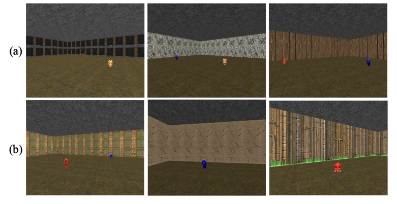


A PREPRINT - JANUARY 30, 2025


and navigate to the correct object out of two present in the room. The target object is randomly selected at the start of each episode
and is known to the agent.


The two objects, _Card_ and _Skull_, each come in three different colors (Red, Blue, Yellow) to prevent the agent from memorizing
based solely on color. Additionally, the map features three distinct wall textures in both Seen and Unseen variations, with unique
textures for each version.


The agent’s input consists of a series of four RGB-D frames, each with a resolution of 42x42 pixels. The agent can select from
three discrete actions: turning clockwise, turning counterclockwise, and moving forward. Each action is repeated over four in-game
frames, and in our manuscript, a single "step" is defined as these four consecutive frames.


Figure 13: Egocentric views of a Minecraft agent in environments with various walls and objects. (a) Scenes in
Toddler-Playroom. (b) Scenes in Cross-Maze. (c) Reward Areas for Goal Points in a Maze Environment.** The left
panel shows the reward area for Goal Points 0 or 1, with dense rewards (blue) extending from the starting point and
sparse rewards (green) at the goal, offering a straightforward path for exploration. The right panel highlights the reward
area for Goal Point 2, which presents a challenge due to its left-skewed position and reduced reward area, requiring
precise navigation for optimal reward collection.


In terms of rewards, the agent earns 10 points for reaching the target object and loses 1 point for selecting the wrong object. Contact
with either object ends the episode, and the episode will otherwise conclude after 50 steps with a penalty of -0.1. To accelerate
training, a small penalty of -0.01 is applied at each time step. To introduce visual complexity and assess the generalization capabilities
of the trained agent, we use **Seen** and **Unseen** map versions, which differ in wall textures, as illustrated in Figure 12. Additionally, a
dense reward of 5.0 is awarded when the agent approaches within 100 units of the goal object, given that the map measures 700 by
700 units.


We used the A3C algorithm [40] and the architecture from [29] [1] and [30, 31] as our baseline. All ViZDoom experiments were
performed on two separate hardware configurations, with additional experiments on a unified hardware setup to follow.


**11.4.4** **Minecraft-Toddler Playroom Maze & Cross Maze**


We utilized an environment based on Minecraft. In the Toddler Playroom Maze experiment, the goal object is randomly positioned
within a predefined goal zone, requiring the agent to generalize its navigation behavior in Maze. Within the environment, the goal is
marked by a light blue glazed terracotta block display object, scaled to 0.5. Additionally, the room is decorated with various colored
blocks to enhance visual richness as seen in Figure 13-(a).


The agent receives a frame of RGB egocentric vision input without a HUD (Head-Up Display). Each vision channel has a width of
114 pixels and a height of 64 pixels. The agent can choose among three discrete actions as in VizDoom: turning clockwise, turning
counterclockwise, and moving forward.


As a sparse reward function, the agent receives a reward of 1 when it reaches within a Manhattan distance of 2 from the goal. For a
dense reward, the agent receives a reward of 0.001 when it is within a Manhattan distance of 5 from the goal and closer than the last
step. The reward is withdrawn when the agent moves farther away.


The second scenario features a cross maze where agents start at the south end and move towards three goal points, labeled clockwisely
as Goal 0, 1, and 2. During training, the agent moves toward two randomly selected goals, leaving the remaining one goal point
for evaluation. Then, in the evaluation phase, agents are tested on all three goal points. Two cake blocks are placed at the goal to
visually indicate it. The inputs, output actions, and reward functions are the same as in the Toddler Playroom Maze experiment. To
effectively test the exploration and exploitation trade-off, a curtain is placed in the center of the maze, blocking the view in four
directions as shown in Figure 13-(b). This prevents the agent from immediately seeing the goal, requiring it to explore more before
exploiting the information gathered to reach the goal. Specifically, Goal Point 2 is designed to be more challenging than Goal Points


1https://github.com/kibeomKim/GACE-GDAN


4


A PREPRINT - JANUARY 30, 2025


0 and 1. In this scenario, the agent is spawned from the left and is given a much reduced reward area as illustrated in Figure 13-(c).
As a result, the s2d agent performed well across all goal points.


Figure 14: Data Extraction and Processing for RNN Features and Policy Visualization. (a) The process begins by
selecting a trajectory where the agent reaches the goal within 2000 to 3000 steps. (b) We intercept key functions in
Stable-baselines3 library to log intermediate calculation results. Observations pass through the neural network, with
intermediate results logged and observations saved as image files. JSON files and image files are then generated and
repeated across all model checkpoints to help visualizing the mean distance between RNN features and policy decisions.


**Algorithm 2:** Measuring Mean Distance Between RNN Features

**Require:** Trajectory _τ_ = _{o_ 1 _, o_ 2 _, . . ., oT }_, Training intervals _I_ = _{i_ 1 _, i_ 2 _, . . ., iN_ _}_
**Ensure:** Mean pairwise distances _D_ = _{d_ 1 _, d_ 2 _, . . ., dN_ _}_

1: Initialize empty list _D_
2: **for** each training interval _i ∈_ _I_ **do**
3: Load RNN parameters _θi_
4: Initialize empty list _H_
5: Reset RNN hidden states
6: **for** each timestep _t ∈_ _τ_ **do**
7: Extract features from observation _ot_ using CNN
8: Compute hidden state _ht_ = RNN(features; _θi_ )
9: Append _ht_ to _H_
10: **end for**
11: Compute mean pairwise distance _di_ = MeanPairwiseDistance( _H_ )
12: Append _di_ to _D_
13: **end for**

14: **return** _D_


**11.4.5** **Data Extraction for Mean Distance Between RNN Features and Policy Visualization**


To extract data for visualizing the mean distance between RNN features and policy decisions, we follow a structured process as seen
in Figure 14:


First, we select trajectories where the episode ended by reaching the goal within 2000 to 3000 steps. From these trajectories,
we create an action array corresponding to the selected trajectories. Next, we hook into the `Stable-baselines3` library[50]
the following two functions to log intermediate calculation results: `RecurrentActorCriticPolicy.get_distribution` and
`RecurrentActorCriticPolicy._predict` .


Using the action array, we perform a rollout to move the agent. During this process, observations are passed through the agent’s
neural network, and intermediate calculation results are logged. Observations are also saved as image files.


Finally, the JSON files and image files generated during the rollout are used for further analysis. This process is repeated for all
model checkpoint files for comprehensive visualization.


5


A PREPRINT - JANUARY 30, 2025


**12** **Section B: 3D Visualization of the Policy Loss Landscape After Stage Transition**


This section provides a 3D visualization of the policy loss landscape after transitioning from initial sparse or dense reward settings to
two different scenarios: one featuring sparse rewards and another with dense rewards. We employ the _Cross-Density Visualizer_ to
map this landscape within a shared parameter space. In our visualization, the hyperparameters _α_ and _β_ in _θ_ [˜] = _θ_ + _α_ **x** + _β_ **y** are set
to range between -10 and 10. This setup results in two distinct datasets: Sparse-to-Dense (S2D) and Sparse-to-Sparse (Only Sparse)
form one set, while Dense-to-Sparse (D2S) and Dense-to-Dense (Only Dense) form the other. We observe a noticeable smoothing
effect, particularly with the Toddler-inspired S2D reward transition, which could help navigate local minima and lead to broader
minima.


**12.1** **Results.**


Our findings show that the Toddler-inspired S2D reward transition results in a significant smoothing effect, particularly in reducing
the depth of local minima. This effect is evident in the blue landscapes of Figures 15, 16, and 17, especially in the segments depicting
sparse-to-sparse and sparse-to-dense visualizations, compared to the D2S, Only Dense, and Only Sparse methods.


The observed reduction in local minima depth suggests that agents can more readily escape local minima, leading to improved
generalization performance on broader minima. To validate this hypothesis, we measured the end-of-training convergence of neural
networks guided by Toddler-inspired S2D, utilizing sharpness metrics to evaluate their tendency toward wider minima compared
to baseline models. As displayed in Table 2, agents employing the Toddler-inspired S2D reward transition demonstrate superior
performance in dynamic environments by converging on broader minima.


These findings imply a direct link between the smoothing effect on the local loss landscape and the enhanced ability to escape local
minima.


**12.2** **Additional Insights: Visualizing Policy Loss Landscape After Reward Transition**


To gain a more profound understanding of how reward transitions affect agent behavior, we visualized the policy loss landscape
following these transitions. This examination offers detailed insights into the model’s optimization landscape, highlighting specific
challenges and advantages that impact continuous learning.


**12.2.1** **Unique Characteristics of LunarLander-V2’s Landscape**


The LunarLander-V2 environment, depicted in Figure 15, is distinguished by its unique reward distribution. Here, actions such
as descending from the top of the screen to the landing pad or achieving a stable landing state yield substantial rewards ranging
from 100 to 140 points. Conversely, deviations from the landing pad or crashes incur penalties. We hypothesize that this variety of
reward opportunities creates a policy loss landscape for the agent that is smoother and less spiky compared to landscapes in other
environments. Figure 15: 3D Policy Loss Landscape for LunarLander-V2 showing smoothing effects in the loss landscape with the
S2D reward transition.


**12.2.2** **Distinct Peaks in CartPole-Reacher and UR5-Reacher**


In contrast, the CartPole-Reacher and UR5-Reacher environments exhibit a more concentrated reward structure. The rewards are
highly focused and localized, resulting in policy loss landscapes characterized by pronounced peaks, as illustrated in Figure 16 and
17 for CartPole-Reacher and UR5-Reacher, respectively.


Through these visualizations, we gain a deeper understanding of the unique reward structures of various environments and how they
shape policy loss landscapes, ultimately influencing the learning paths of agents after transitions.


6


A PREPRINT - JANUARY 30, 2025


**13** **Extensive 3D Visualizations for All Baseline Strategies**


**13.1** **LunarLander-V2: Examining Dense-to-Sparse (D2S) & Dense-to-Dense / Sparse-to-Dense (S2D) &**
**Sparse-to-Sparse Transformations**


Figure 15: This figure offers a detailed look at the 3D policy loss landscape during reward scheme transitions. On the
left, the landscape immediately after the transition is shown, while the right side portrays the landscape around t = 2000.
The initial set of lines highlights the dense-to-sparse (D2S, _C_ 1, red) and dense-to-dense (Only Dense, blue) transitions.
Conversely, the below set focuses on sparse-to-dense (Toddler-inspired S2D, _C_ 2, blue) and sparse-to-sparse (Only
Sparse, red) transformations. Significantly, the Toddler-inspired S2D approach reveals a more pronounced reduction in
the depth of local minima, indicating substantial smoothing effects across various updates.


7


A PREPRINT - JANUARY 30, 2025


**13.2** **CartPole-Reacher: Assessing Dense-to-Sparse (D2S) & Dense-to-Dense / Sparse-to-Dense (S2D) &**
**Sparse-to-Sparse Shifts**


Figure 16: This 3D visualization of the policy loss landscape for CartPole-Reacher illustrates that notable smoothing
effects were predominantly seen with the Toddler-inspired S2D (sparse-to-dense, _C_ 2, blue) transformation.


8


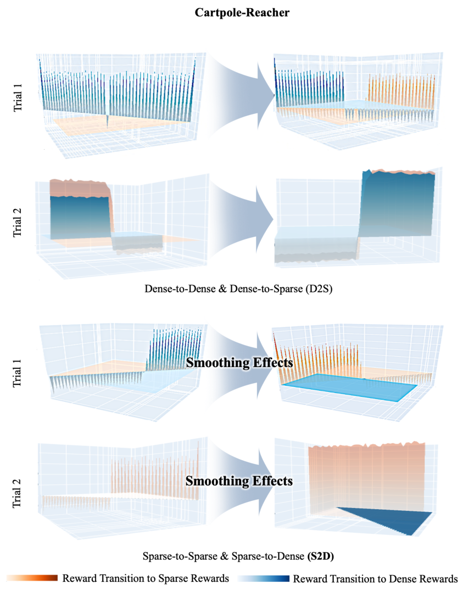


A PREPRINT - JANUARY 30, 2025


**13.3** **UR5-Reacher: Evaluating Dense-to-Sparse (D2S) & Dense-to-Dense / Sparse-to-Dense (S2D) &**
**Sparse-to-Sparse Dynamics**


Figure 17: This figure presents the 3D policy loss landscape for the UR5-Reacher task after various reward adjustments,
such as sparse-to-dense (Toddler-inspired S2D, _C_ 3, blue) and sparse-to-sparse (Only Sparse, red). Initially, the advantage
of S2D over the Only Dense method becomes more pronounced over time, although both methods initially perform
similarly. The Only Dense model displayed fewer lower depths of local minima after the reward transition, depending on
seeds. However, the Toddler-inspired S2D method consistently exhibited significant smoothing effects more frequently,
effectively reducing the depth of local minima and outperforming alternative baseline strategies.


9


A PREPRINT - JANUARY 30, 2025


Figure 18: Overview of three ViZDoom-FourObjects environments: **Level1**, fixed object locations & changing wall
texture; **Level2**, random object locations; **Level3**, random object locations with changing wall textures and extra walls
added.


**14** **Section C: Additional Experiments of Toddler-Inspired S2D Reward Transition in**
**Various Environments**


**14.1** **ViZDoom-FourObjects Navigation: Experiments on Reward Transition Timings**


We developed additional environments using ViZDoom [26]. These environments are slightly modified from those in [29]. In these
environments, which we call _ViZDoom-FourObjects_ tasks, we focused on investigating the relationship between reward transition
timings and learning.


**14.1.1** **Task settings.**


Four objects appear on the map, one of which is randomly selected as the target for the agent to locate. Each object can appear in two
different colors or styles. The map is 700 by 700 units, and the agent starts in the middle for every episode. Figure 18 shows three
ViZ-Level environments with increasing levels of complexity. Objects are positioned at a distance from the agent to keep the task
challenging. Successfully reaching the goal object gives the agent a reward of 10.0, while touching a non-goal object results in a
penalty of -1.0, ending the episode in either case. If the agent doesn’t reach any object within the time limit (25 steps for levels 1 and
2, or 37 steps for level 3), it receives a penalty of -0.1. To promote exploration, a reward of -0.01 is applied at each time step. We
used the A3C algorithm [40] for reinforcement learning, with averages and standard deviations calculated over three trials.


The main difference of these environments from ViZDoom-Seen and ViZDoom-Unseen is in the number of objects that are in the
map, as well as the initial placement of objects and agent. In the ViZDoom-Seen and Unseen, the agent is spawned at a corner of the
map, while in ViZDoom-FourObjects environments, the agent is spawned near the center of the map. The former environments have
larger distance from the agent’s initial position and the goal object’s position in average, while the latter environments emphasize the
need to distinguish between a wider diversity of objects. In addition. the ViZ-Level3 environment adds extra walls within the map,
which are not used in ViZDoom-Seen and Unseen.


**14.1.2** **Settings on dense reward and curricula.**


The experiments on ViZDoom-FourObjects are unique in that three reward settings are covered, rather than two. The sparse reward
setting, referred to as _Stage-1_, follows the reward scheme described above. On top of this, _Stage-2_ provides an additional reward of
5.0 once the agent arrives within 200 unit distance from the goal object. Lastly, _Stage-3_ provides an additional negative reward of
-5.0 once the agent arrives within 200 unit distance of an object that is not the goal. The tested three curricula settings are described in
Figure 10, where _N_ is one million parameter updates. Additionally, we tested the Only Dense setting, where only Stage-3 guidance
is provided throughout the entire training. We denote this setting as _C_ 5.


**14.1.3** **Results on ViZDoom environments.**


We demonstrate the impact of the three-stage transitions of Toddler-inspired S2D reward transition and examine the critical periods.
For each level of ViZDoom-FourObjects, we measure the agent’s performance across three different stage transitions, with results
displayed on Figure 19.


Figure 19-(a) displays the learning curves on ViZ-Level1. The agent reaches a perfect success rate (100%) in the order of ( _C_ 1)
and ( _C_ 2). ( _C_ 3) shows the lowest success rate (92%). The Only Dense model ( _C_ 5) cannot even reach the lowest success rate of the
Toddler-inspired S2D models (90.7%).


10


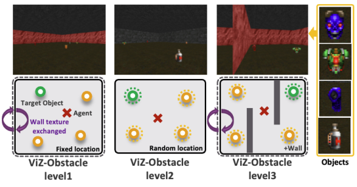


A PREPRINT - JANUARY 30, 2025


Figure 19: Comparison of different transition timings ( _C_ 1 _, C_ 2 _, C_ 3 _, C_ 5) according to three levels of ViZDoomFourObjects. We use results from five trials.


Figure 19-(b) displays the learning curves on ViZ-Level2. _C_ 2 shows a superior success rate (78%). The _C_ 1 also shows a moderate
performance (57%). In contrast, in _C_ 3 and _C_ 5, the agent cannot solve the task properly at all (0%).


Lastly, Figure 19-(c) displays the learning curves on ViZ-Level3, the most complex environment. Here, all models show a larger
improvement according to stage-2,3 rewards. As shown in Figure 19-(c), _C_ 1 (90%), _C_ 2 (83%) and _C_ 3 (78%) exhibit best to worst
performances in order.


**14.1.4** **Overall analysis on ViZDoom-FourObjects environments.**


We observe vast performance improvements after first transition from Stage-1 to Stage-2 rewards at the _1M point_ in ViZ-Level1 and
Level3, particularly with the best performing models of ViZ-Level1 _C_ 1 and Level3 ( _C_ 1) respectively. In the case of Viz-Level2, _C_ 2,
where stage transition occurs at 2M, has shown the most outstanding performance, while _C_ 3 cannot learn the task at all. Therefore, we
observe that there is the _appropriate_ timing of stage transition within Toddler-inspired S2D, which leads to the steepest performance
improvement in these visual navigation tasks. Especially, the initial stage transition, whether at 1M updates for ViZ-Level1 and
Level3 or at 2M updates for ViZ-Level2, highlights a crucial timing for reward transition strategies. We examined the importance of
pinpointing this optimal phase for moving from sparse to dense rewards, taking cues from toddler developmental stages.


**14.1.5** **Importance of early free exploration.**


As additional ablative experiments, we varied the entropy prior to the transition from Stage-1 to Stage-2 reward. The prior entropy
was set to {0.1, 0.01, 0.001}, while the entropy afterwards was fixed to 0.01. As shown in Figure 19-(d), we found that an appropriate
entropy term of 0.1 is more crucial for the Toddler-inspired S2D reward transition than 0.01 (blue) and 0.001 (green), indicating the
importance of free exploration at the early stage of learning.


11


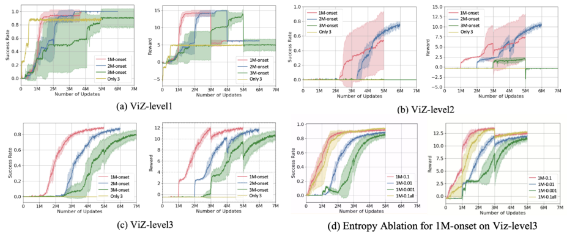


A PREPRINT - JANUARY 30, 2025


Figure 20: Performance metrics in RWARE tasks. The vertical axis measures the average number of shelves successfully
delivered per episode, while the horizontal axis records the time steps. Solid lines indicate the performance of agents
utilizing Toddler-inspired S2D transitions ( _C_ 1), ( _C_ 2), ( _C_ 3), whereas dotted lines depict the outcomes of agents using
only dense rewards ( _C_ 4). The mean and standard deviation for each trial, conducted over five attempts, are represented
by lines and shaded areas. Notably, the ( _C_ 3) agent demonstrates superior learning curves across all scenarios, even in
situations where Stage-3 guidance proves less useful, as seen in Level 3. The large standard deviations underscore the
inherent challenges in RWARE tasks with multiple subgoals.


**14.2** **Shelf Delivery Tasks in RWARE: Experiments Using a Three-Stage Guidance Approach with Suboptimal**
**Rewards**


**14.2.1** **Task Configuration.**


Figures 20 and 21 showcase our expanded tests within the RWARE grid-world environments, which utilize a discrete state-action
space. We have tailored RWARE [45] for single-agent operations, involving a mobile agent navigating through rows of shelves
(blue), some randomly tagged as "requested" (red) for delivery. The agent’s actions include { _MoveForward, TurnLeft, TurnRight,_
_Load/Unload, Noop_ }. It can only sense the tiles in a 3x3 grid around its position. The agent’s objective is to move requested shelves
to a goal location (green) and then return them, completing a series of subgoals, such as reaching, transporting, and restoring the
shelves.


Three levels of difficulty were set: Level 1 includes 8 shelves, 3 requested; Level 2 has 10 shelves, 3 requested, leading to a sparser
reward structure; Level 3 features 32 shelves with 16 requested, greatly increasing the complexity of exploration. Figure 21 displays
these setups.


**14.2.2** **Guidance Strategy.**


Rewards were structured across three stages reflecting the subtasks: Stage-1 gives a +1.0 reward for delivering a requested shelf to
the destination; Stage-2 rewards both delivering and returning the shelf; Stage-3 adds a bonus for picking up a requested shelf.


**14.2.3** **Results in RWARE Experiments.**


This investigation examines how different Toddler-inspired S2D reward schemes affect learning tasks in RWARE, focusing on
_subgoal_ sequences to observe suboptimal outcomes near transition phases. We assessed Toddler-inspired S2D transitions at various
stages ( _C_ 1, _C_ 2, _C_ 3) and only dense rewards at Stage-2 ( _C_ 4) or Stage-3 ( _C_ 5). Transition timings are as described in Figure 10, with
_N_ set to 1 million (1M) time steps. PPO [52] was employed as the learning algorithm, and outcomes were averaged over five trials.
Here are the main results:


     - **Level 1.** (Figure 20-(a)). Among Toddler-inspired S2D agents, _C_ 3 showed superior performance, while _C_ 1 did not manage
to deliver shelves beyond the 4M time step. Although Only 2 ( _C_ 4) and Only 3 ( _C_ 5) achieved impressive results, the _C_ 3
agent was on par or better.


     - **Level 2.** (Figure 20-(b)). In this scenario, _C_ 3 again led the performance, with _C_ 2 following closely. The performances of
Only 2 ( _C_ 4) and Only 3 ( _C_ 5) were comparable to _C_ 3.


     - **Level 3.** (Figure 20-(c)). In this challenging environment, _C_ 3 excelled. Stage-3 guidance was not particularly beneficial, as
seen with the Only 3 agent ( _C_ 4), but _C_ 3 maintained robustness against less advantageous reward settings.


**14.2.4** **Comprehensive Analysis of RWARE Tasks.**


In Figure 21, we illustrate the movement paths of various agents in RWARE-Level1. Goals, requested shelves, and unrequested
shelves are represented by green, red, and blue squares. The agent starts where the goal is located (green). The _C_ 1 agent mistakenly
selected incorrect shelves twice before halting. The _C_ 2 agent managed to deliver correctly initially but struggled with efficient


12


A PREPRINT - JANUARY 30, 2025


Figure 21: (a) Visual representation of agent trajectories in RWARE-Level1. (b) The three different levels of RWARE
environments.


-0.1 -0.1 -0.1 -0.1 -0.1 -0.1 6 -0.1 -0.1 -0.1 -0.1 -0.1 -0.1 -0.1 -0.1 -0.1 -0.1 -0.1 -0.1 -0.1 -1 -1 -1 100


-0.1 -0.1 -0.1 -0.1 -0.1 6 9 6 -0.1 -0.1 -0.1 -0.1 -0.1 -0.1 -0.1 -0.1 -0.1 -0.1 -0.1 -0.1


-0.1 -0.1 -0.1 -0.1 6 9 12 9 6 -0.1 -0.1 -0.1 -0.1 -0.1 -0.1 -0.1 -0.1 -0.1 -0.1 -0.1


-0.1 -0.1 -0.1 6 9 12 50 12 9 6 -0.1 -0.1 -0.1 -0.1 -0.1 -0.1 50 -0.1 -0.1 -0.1


-0.1 -0.1 -0.1 -0.1 6 9 12 9 6 -0.1 -0.1 -0.1 -0.1 -0.1 -0.1 -0.1 -0.1 -0.1 -0.1 -0.1


-0.1 -0.1 -0.1 -0.1 -0.1 6 9 6 -0.1 -0.1 -0.1 -0.1 -0.1 -0.1 -0.1 -0.1 -0.1 -0.1 -0.1 -0.1


-0.1 -0.1 -0.1 -0.1 -0.1 -0.1 6 -0.1 -0.1 -0.1 -0.1 -0.1 -0.1 -0.1 -0.1 -0.1 -0.1 -0.1 -0.1 -0.1


-0.1 -0.1 -10 -0.1 -0.1 -0.1 -0.1 -0.1 -0.1 -0.1 -0.1 -0.1 -10 -0.1 -0.1 -0.1 -0.1 -0.1 -0.1 -0.1

|-1|-1|-1|100|
|---|---|---|---|
|-1|W|-1|-1|
|-1|-1|-1|-1|
|-1|-1|-10|-1|


-0.1 -0.1 -0.1 -0.1 -0.1 -0.1 -0.1 -0.1 -0.1 -0.1 -0.1 -0.1 -0.1 -0.1 -0.1 -0.1 -0.1 -0.1 -0.1 -0.1 -1 -1 -1 2


-0.1 -0.1 -0.1 -0.1 -0.1 -0.1 w -0.1 -0.1 -0.1 -0.1 -0.1 -0.1 -0.1 -0.1 -0.1 w -0.1 -0.1 -0.1 -1 -1 -10 -1

|-0 .1|-0 .1|-0 .1|-0 .1|-0 .1|-0 .1|6|-0 .1|-0 .1|-0 .1|
|---|---|---|---|---|---|---|---|---|---|
|-0.1|-0.1|-0.1|-0.1|-0.1|6|9|6|-0.1|-0.1|
|-0.1|-0.1|-0.1|-0.1|6|9|12|9|6|-0.1|
|-0.1|-0.1|-0.1|6|9|12|50|12|9|6|
|-0.1|-0.1|-0.1|-0.1|6|9|12|9|6|-0.1|
|-0.1|-0.1|-0.1|-0.1|-0.1|6|9|6|-0.1|-0.1|
|-0.1|-0.1|-0.1|-0.1|-0.1|-0.1|6|-0.1|-0.1|-0.1|
|-0.1|-0.1|-10|-0.1|-0.1|-0.1|-0.1|-0.1|-0.1|-0.1|
|-0.1|-0.1|-0.1|-0.1|-0.1|-0.1|-0.1|-0.1|-0.1|-0.1|
|-0.1|-0.1|-0.1|-0.1|-0.1|-0.1|w|-0.1|-0.1|-0.1|


|-0 .1|-0 .1|-0 .1|-0 .1|-0 .1|-0 .1|-0 .1|-0 .1|-0 .1|-0 .1|
|---|---|---|---|---|---|---|---|---|---|
|-0.1|-0.1|-0.1|-0.1|-0.1|-0.1|-0.1|-0.1|-0.1|-0.1|
|-0.1|-0.1|-0.1|-0.1|-0.1|-0.1|-0.1|-0.1|-0.1|-0.1|
|-0.1|-0.1|-0.1|-0.1|-0.1|-0.1|50|-0.1|-0.1|-0.1|
|-0.1|-0.1|-0.1|-0.1|-0.1|-0.1|-0.1|-0.1|-0.1|-0.1|
|-0.1|-0.1|-0.1|-0.1|-0.1|-0.1|-0.1|-0.1|-0.1|-0.1|
|-0.1|-0.1|-0.1|-0.1|-0.1|-0.1|-0.1|-0.1|-0.1|-0.1|
|-0.1|-0.1|-10|-0.1|-0.1|-0.1|-0.1|-0.1|-0.1|-0.1|
|-0.1|-0.1|-0.1|-0.1|-0.1|-0.1|-0.1|-0.1|-0.1|-0.1|
|-0.1|-0.1|-0.1|-0.1|-0.1|-0.1|w|-0.1|-0.1|-0.1|


|-1|2|3|100|
|---|---|---|---|
|-1|W|2|3|
|-1|-1|-1|2|
|-1|-1|-10|-1|


Figure 22: Gridworld-navigation task. **Left** : 10 _×_ 10 environment with potential-based dense rewards using _PPO_ .
**Center** : 10 _×_ 10 environment with sparse rewards using _PPO_ . **Right-Top** : 4 _×_ 4 environment with sparse rewards
using _DQN_ . **Right-Bottom** : 4 _×_ 4 environment with potential-based dense rewards using _DQN_ .


navigation afterward. The _C_ 3 agent, however, delivered shelves efficiently and minimized subgoal failures, emphasizing the
importance of well-timed reward transitions.


**14.2.5** **Significance of Early Exploration.**


_C_ 1 and _C_ 2 underperformed when initial stage transitions occurred prematurely, before 3M training steps, as seen in Figure 20. This
highlights the necessity for an adequate exploration period (Stage-1) with sparse rewards for effective learning. Despite having rich
rewards, the Only 3 agent ( _C_ 5) failed completely in Level 3. Conversely, the _C_ 3 agent showed resilience to less beneficial rewards
during initial stage transitions in the Toddler-inspired S2D framework.


**14.2.6** **Study Limitations.**


This study’s main goal was to assess how the timing of reward transitions impacts performance metrics in tasks featuring subgoals.
The findings detail how these transitions influence overall task outcomes. However, determining an optimal reward shaping strategy
for tasks with subgoals remains a challenge. This presents a key area for further investigation, focusing on developing more
refined reward shaping techniques, including potential-based methods within this specific context, to enhance the effectiveness of
toddler-inspired reward transitions and improve performance outcomes.


**14.3** **Gridworld: Add-on Algorithms Experiments on 3D Loss Landscape**


To explore the impact of reward transitions on policy learning, we conducted 3D visualizations of the policy loss landscape using the
Gridworld environment. Gridworld’s simplicity provides a controlled setting with fewer variables, allowing us to clearly observe the


13


A PREPRINT - JANUARY 30, 2025


effects of the S2D reward transition compared to baseline methods. In our main analysis, we employed the SAC algorithm [19], but
to ensure our observations were not limited to a single algorithm, we extended our experiments to include DQN [39] and PPO [52].


**14.3.1** **Environment Setup**


The experimental setup features a gridworld environment, as shown in Figure 22. The agent can move in four directions: up, down,
left, and right, and receives a living penalty of _−_ 0 _._ 1 to encourage exploration. We performed experiments in two scenarios: (1) a
fixed-goal 4 _×_ 4 environment using DQN [39], and (2) a random-goal 10 _×_ 10 environment using PPO [52]. To achieve optimal
stage transition, we set _T_ = 200 for the fixed goal over 1000 steps and _T_ = 5000 for the random goal over 100,000 steps. The
neural network architecture comprises three fully connected layers with ReLU activation, and the batch size is set to 128. For PPO,
updates were made every 2 episodes. The Cross-Density Visualizer strategy was employed for visualization.


**14.3.2** **Results of Loss Landscape in DQN and PPO Algorithms**


We analyzed the policy loss landscape using the PPO algorithm and the Q-function loss landscape using the DQN algorithm. While
DQN focuses on learning Q-values, examining its loss landscape offers insights into how different reward schemes affect learning
dynamics. In both Gridworld-DQN and PPO scenarios, the Toddler-inspired S2D reward transition demonstrated a noticeable
smoothing effect on the loss landscape, outperforming other baseline methods. This effect is highlighted in Figures 23, 24, and 25(b),
where it achieved superior performance metrics. However, as shown in Figures 24 and 25-(a), there is little distinction between
dense and sparse landscapes as updates increase. Our findings suggest that transitioning from sparse to dense rewards using the
Toddler-inspired S2D method effectively reduces local minima depth, surpassing both dense-to-sparse (D2S) and exclusively dense
approaches.


14


A PREPRINT - JANUARY 30, 2025


**14.4** **In-Depth 3D Loss Landscape Analysis for Gridworld-PPO and DQN Algorithms**


**14.4.1** **Gridworld-PPO: Exploring Sparse-to-Dense (S2D) & Sparse-to-Sparse Transitions**


Figure 23: This visualization showcases the 3D policy loss landscape post-transition from sparse-to-dense (Toddlerinspired S2D, _C_ 3, blue) and sparse-to-sparse (Only Sparse, red) reward schemes. The Toddler-inspired S2D transition
in the PPO algorithm exhibits a pronounced smoothing effect, notably reducing the depth of local minima.


15


A PREPRINT - JANUARY 30, 2025


**14.4.2** **Gridworld-PPO: Analyzing Dense-to-Sparse (D2S) & Dense-to-Dense Shifts**


Figure 24: This figure presents the 3D policy loss landscape for dense-to-sparse (D2S, _C_ 3, red) and dense-to-dense
(Only Dense, blue) transitions. As observed in Appendix Section B, these configurations show minimal smoothing
effects, even with increased updates, indicating less adaptability in the Gridworld-PPO setup.


16


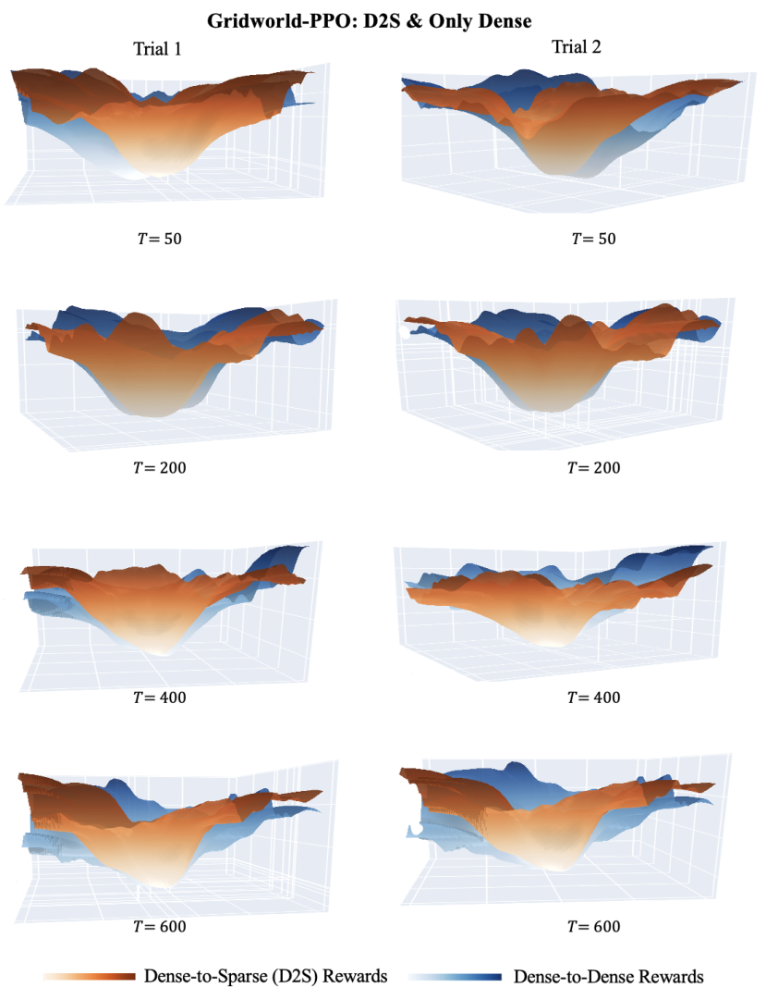


A PREPRINT - JANUARY 30, 2025


**14.4.3** **Gridworld-DQN: Comparing S2D, Only Sparse, D2S, and Only Dense Approaches**


Figure 25: This illustration captures the 3D Q-value loss landscape across different reward transitions, including
Toddler-inspired S2D and baseline approaches. Unlike the baseline methods (D2S, Only Dense, Only Sparse), which
lack significant smoothing, the Toddler-inspired S2D transition in panel (b) demonstrates a clear smoothing effect by
effectively reducing the depth of local minima through the adoption of potential-based dense rewards.


17


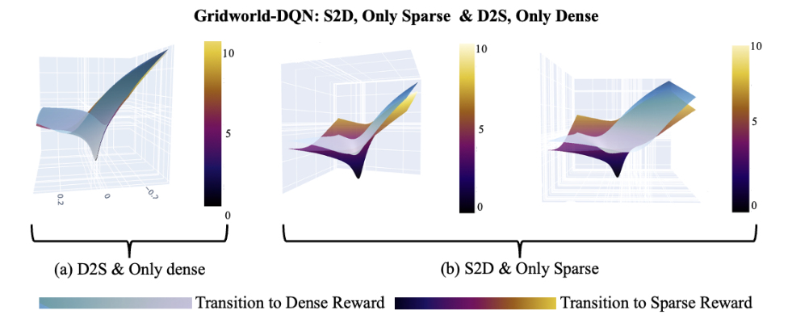
