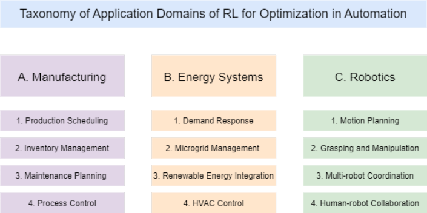

## **A Survey of Reinforcement Learning for Optimization in Automation**

Ahmad Farooq* [1] and Kamran Iqbal [2]

_**Abstract**_ **— Reinforcement Learning (RL) has become a criti-**
**cal tool for optimization challenges within automation, leading**
**to significant advancements in several areas. This review article**
**examines the current landscape of RL within automation,**
**with a particular focus on its roles in manufacturing, energy**
**systems, and robotics. It discusses state-of-the-art methods,**
**major challenges, and upcoming avenues of research within each**
**sector, highlighting RL’s capacity to solve intricate optimization**
**challenges. The paper reviews the advantages and constraints of**
**RL-driven optimization methods in automation. It points out**
**prevalent challenges encountered in RL optimization, includ-**
**ing issues related to sample efficiency and scalability; safety**
**and robustness; interpretability and trustworthiness; transfer**
**learning and meta-learning; and real-world deployment and**
**integration. It further explores prospective strategies and future**
**research pathways to navigate these challenges. Additionally, the**
**survey includes a comprehensive list of relevant research papers,**
**making it an indispensable guide for scholars and practitioners**
**keen on exploring this domain.**
**Index terms: Reinforcement Learning, Automation,**
**Manufacturing, Energy Systems, Robotics**

I. INTRODUCTION

_A. Motivation_

Reinforcement learning (RL) has emerged as a effective framework for sequential decision-making problems,
enabling agents to learn optimal policies through interaction
with the environment [1], [2] In recent years, RL has
achieved remarkable success in various domains, including
manufacturing [3], energy systems [4], and robotics [5]. The
key advantage of RL lies in its ability to learn from trialand-error experience without requiring explicit supervision
or a predefined model.
Simultaneously, optimization problems are ubiquitous in
automation, spanning diverse areas such as production
scheduling [6], process control [7], and inventory management [8]. These problems often involve complex decisionmaking under uncertainty, large-scale combinatorial search
spaces, and dynamic environments. Traditional optimization approaches, such as mathematical programming and
metaheuristics, have been extensively studied and applied to
automation problems [9]. However, they often struggle with
scalability, adaptability, and the need for domain-specific
knowledge.
The intersection of RL and optimization in automation
presents a promising avenue for addressing these challenges.
By leveraging the power of RL to learn from experience and
adapt to changing conditions, we can develop more efficient,

This work is not supported by any organization. This work is a preprint
version of the paper published in the 2024 IEEE 20th International Conference
on Automation Science and Engineering (CASE) held from August 28 to
September 1, 2024, in Bari, Italy. The final version is available at IEEE
Xplore under the conference proceedings.
*Corresponding Author: Ahmad Farooq

flexible, and robust optimization algorithms for automation
tasks [10], [11]. This has led to a growing body of research
on RL-based optimization in various automation domains,
which is the focus of this survey.

_B. Scope and Contributions_

This survey paper aims to provide a comprehensive
overview of RL techniques for optimization in automation.
We focus on three key application domains: manufacturing,
energy systems, and robotics. In each domain, we review
representative works that demonstrate the effectiveness of
RL in solving optimization problems and discuss the unique
challenges and opportunities.
The main contributions of this survey are as follows:
1. We provide a systematic categorization of RL-based
optimization approaches in automation, highlighting their
strengths and limitations.
2. We discuss the state-of-the-art RL algorithms used for
optimization in each application domain.
3. We identify common challenges faced by RL-based
optimization in automation, including sample efficiency and
scalability; safety and robustness; interpretability and trustworthiness; transfer learning and meta-learning; and realworld deployment and integration, and discuss potential
solutions and future research directions.

4. We present a comprehensive bibliography of relevant research papers, serving as a valuable resource for researchers
and practitioners interested in this field.
To the best of our knowledge, this is the first survey
paper that specifically focuses on RL for optimization in
automation, covering a wide range of application domains
and providing insights into the current state and future
prospects of this rapidly growing field.

_C. Organization of the Paper_

The remainder of this survey is organized as follows:
Section II focuses on the applications of RL-based optimization in three major domains: manufacturing, energy
systems, and robotics. For each domain, we provide a comparative analysis of the selected papers, highlighting their key
findings, methodologies, and contributions. We also discuss
the domain-specific challenges and opportunities. Section
III discusses the common challenges faced by RL-based
optimization in automation. We present an overview of the
potential solutions and future research directions to address
these challenges. Finally, Section IV concludes the survey,
summarizing the key takeaways.

II. APPLICATION DOMAINS

Reinforcement Learning (RL) has revolutionized automation in Manufacturing, Energy Systems, and Robotics. Figure

Fig. 1: Taxonomy of Application Domains of RL for Optimization in Automation

1 shows these major domains and their sub-domains that we
will discuss in this section.

_A. Manufacturing_

RL is revolutionizing manufacturing through advancements in production scheduling, inventory management,
maintenance planning, and process control, showcasing its
potential to tackle complex optimization challenges within
this sector. In production scheduling, RL methods surpass
traditional models by adeptly handling uncertainties, thereby
enhancing profitability and customer service [6], [12]–[15].
For inventory management, RL techniques, particularly Deep
Reinforcement Learning (DRL) and Multi-agent Reinforcement Learning (MARL), offer innovative solutions for managing stochastic demands and complex supply chains, leading to improved sales and reduced wastage [8], [16]–[19].
Maintenance planning benefits from RL’s dynamic optimization capabilities, utilizing real-time data for maintenance
schedules, thus improving system reliability and reducing
downtimes [20]–[24]. In process control, RL’s adaptability ensures product quality and operational efficiency, with
methodologies like Explainable RL and DRL enhancing
process understanding and control strategies [7], [25]–[28].
Future directions point towards developing risk-sensitive formulations, leveraging real-world data, and integrating smart
systems to further enhance manufacturing efficiency. Table
I encapsulates these insights by outlining key objectives,
challenges addressed, RL approaches, outcomes, and future
directions, alongside representative studies that underscore
RL’s transformative impact on manufacturing.

_B. Energy Systems_

RL and DRL are transforming energy systems, offering
innovative solutions across demand response, microgrid management, renewable energy integration, and Heating, Ventilation, and Air Conditioning (HVAC) control to optimize and
enhance grid stability, sustainability, and energy efficiency.
Demand response strategies benefit from DRL and MARL to
dynamically adjust energy usage in response to utility signals,
achieving up to 22% energy savings and more efficient

electricity management [29]–[34]. In microgrid management,
DRL and MARL approaches enhance grid resilience by
optimizing energy distribution and usage, resulting in improved cost efficiency and increased system reliability [35]–

[40]. For renewable energy integration, RL’s capability to
handle the variability of renewable sources leads to more
effective energy dispatch strategies, ensuring grid stability
and maximizing the use of renewable resources [4], [31],

[41]–[44]. HVAC systems, as major energy consumers, see
optimizations through DRL and batch RL methods, achieving
significant reductions in energy consumption while maintaining occupant comfort [29], [45]–[49]. Looking ahead,
the future promises advancements in adaptive strategies
and bridging the simulation-experiment gap for demand response, enhanced learning efficiency for microgrid management, scalability and adaptability improvements in renewable
energy integration, and wider applicability of pre-trained
models for HVAC control. This narrative is encapsulated in
the Table II, which outlines the key objectives, challenges
addressed, RL methodologies, and outcomes for each subdomain, alongside future research directions and representative
studies illustrating RL’s significant role in advancing energy

systems.

_C. Robotics_

RL is revolutionizing robotics, making significant strides
across motion planning, grasping and manipulation, multirobot coordination, and human-robot collaboration, thereby
addressing intricate challenges inherent in the field. In motion
planning, RL, particularly DRL and innovative methodologies like curriculum learning, empowers robots to adeptly
navigate and execute tasks in dynamic environments, enhancing adaptability and task performance [50]–[52], [63].
Grasping and manipulation benefit from DRL’s ability to
process complex sensor inputs, enabling robots to interact
with diverse objects and environments with unprecedented
flexibility and efficiency [53], [54], [64]–[66]. Multi-robot
coordination leverages DRL and MARL to facilitate sophisticated collaborative strategies among robots, optimizing
collective actions to achieve common goals in complex and

|Feature/Criteria|ProductionScheduling|InventoryManagement|MaintenancePlanning|ProcessControl|
|---|---|---|---|---|
|**Key Objectives**|Optimize allocation of tasks to resources over time|Balance supply with demand, minimize costs, and ensure timely product availability|Minimize downtime, extend asset life, ensure safety|Ensure product quality, operational efciency, and safety|
|**Challenges Addressed**|Handling complexities and uncertainties in scheduling tasks|Stochastic demand, perishable goods, multi-echelon supply chains|Dynamic maintenance planning under system degradation|Controlling complex manufacturing processes|
|**RL Approaches**|DQN [6], Distributional RL [15], DRL [13], A2C [12]|DQN [17], PPO [19], A2C [16], DRL [8], Cooperative MARL [18]|Multi-Agent Actor Critic [24], Deep Q-learning [22], [23], Q-learning [21]|TRPO [26], DDPG [7], Dynamic Q-table [25]|
|**Methodology Highlights**|Superiority over traditional mixed integer linear programming models, competitive performance against heuristic methods|Comprehensive roadmap for DRL deployment, novel frameworks for multi-agent hierarchical inventory management|Analysis of RL/DRL applications, dynamic maintenance policies using Q-learning|Adaptation of RL for Statistical Process Control (SPC), integration of domain expertise, apprenticeship learning|
|**Outcomes**|Increased proftability, reduced inventory levels, improved customer service|Maximized sales, minimized perishable product wastage, optimized supply chain needs|Reduced maintenance activities, enhanced feet availability, adapted maintenancepolicies|Enhanced SPC adaptability, improved control policies, handling nonlinearities in manufacturing|
|**Future Directions**|Development of risk-sensitive formulations, leveraging real-world data|Advanced cooperative strategies among agents, leveraging custom GPU-parallelized environments|Integration with smart factory systems, leveraging condition monitoring data|Utilization of real-world data for training, improving RL training efciency|
|**Representative Studies**|Hubbs et al. [12], Shi et al. [13], Guo et al. [14], Esteso et al. [6], Mowbray et al. [15]|Boute et al. [8], Sultana et al. [16], De Moor et al. [17], Khirwar et al. [18], Leluc et al. [19]|Ogunfowora and Najjaran [20], Yousef et al. [21], Yousef et al. [22], Andrade et al. [23], Thomas et al. [24]|Viharos and Jakab [25], Nian, Liu, and Huang [7], Kuhnle et al. [26], Mowbray et al. [27], and Li, Du, Jiang [28]|

TABLE I: Comparison of RL Approaches for Optimization in Manufacturing

|Feature/Criteria|DemandResponse|MicrogridManagement|RenewableEnergy Integration|HVACControl|
|---|---|---|---|---|
|**Key Objectives**|Optimize energy usage and cost in response to utility signals, enhancing grid stability|Enhance grid resilience and efciency, optimizing energy distribution and usage|Seamlessly integrate renewable energy into power systems, maximizing utilization while ensuring grid stability|Optimize HVAC systems for energy efciency without compromising occupant comfort|
|**Challenges Addressed**|Adapting to dynamic pricing and demand, improving energy consumption efciency|Managing diverse energy sources, ensuring reliable and efcient operation|Addressing variability and unpredictability of renewable sources|Balancing energy savings with thermal comfort requirements|
|**RL Approaches**|PPO [29], [30], MARL [31], [34], DQN [32], MADDPG [33]|DQN [39], PPO [37], A3C [35],|MA-DRL [42], Q-learning [31]|PPO [29], Batch Constrained Munchausen Deep Q-learning [47], Q-learning [48], A3C[45]|
|**Methodology Highlights**|Meta-learning for simulation-experiment gap, multi-agent systems for residential energy management|Expert knowledge integration, operational fexibility with proximal policy optimization|Analysis on RL’s role, multi-task learning for system-wide optimization|Architecture optimization for demand response, safe control strategies, and energy consumption reduction|
|**Outcomes**|Up to 22% energy savings, efcient electricity usage management|Improved energy distribution and cost efciency, increased resilience|Enhanced management of complex energy fows, signifcant performance improvements|Reduction in HVAC energy consumption, improved operational efciency|
|**Future Directions**|Advanced cooperative strategies, bridging the simulation-experiment gap|Enhanced learning efciency, integration with smart grid technologies|Scalability and adaptability of RL methods, robustness against environmental changes|Adaptability to diverse buildings, pre-training models, transfer learning applications|
|**Representative Studies**|Azuatalam et al. [29], Jang et al. [30], Ahrarinouri et al. [31], Lu et al. [32], Lu et al. [33], Zhang et al. [34]|Nakabi and Toivanen [35], Hu and Kwasinski [36], Zhang et al. [37], Zhang et al. [38], Shojaeighadikolaei et al. [39], Du and Li [40]|Yang et al. [41], Cao et al. [42], Chen et al. ( [43], Sivamayil et al. [44], Perera and Kamalaruban [4], Ahrarinouri et al. [31]|Azuatalam et al. [29], Zhong et al. [45], Sierla et al. [46], Liu et al. [47], Yuan et al. [48], Biemann et al. [49]|

TABLE II: Comparison of RL Approaches for Optimization in Energy Systems

|Feature/Criteria|MotionPlanning|Manipulation|Multi -robot Coordination|Human-robot Collab|
|---|---|---|---|---|
|**Key Objectives**|Enable robots to navigate and perform tasks in dynamic environments|Enhance robotic interaction with objects and environments|Optimize collaborative actions of multiple robots for a commongoal|Facilitate efective interaction and cooperation between humans and robots|
|**Challenges Addressed**|Navigating complex and dynamic environments, learning from interaction|Adapting to diverse objects, leveraging complex sensor inputs|Resource competition, obstacle avoidance in cooperative tasks|Adaptation to human behaviors, ensuring safety and making intelligent decisions|
|**RL Approaches**|PPO [50], Q-learning [51], Soft Actor-Critic (SAC) [52]|DDPG [53], Double DQN [54]|Multi-Robot Coordination with Deep Reinforcement Learning (MRCDRL) [55], Multi Agent Deep Reinforcement Learning [56]|DQN [57], [58], SAC [59], [60], DDPG [61], Double DQN [62]|
|**Methodology Highlights**|EfcientLPT [52] for space robots, curriculum learning for robotic arms|Visuo-motor feedback, dexterous grasping in sparse environments|MRCDRL [55] for cooperative action, MARL for pick-and-place optimization|Human-centered DRL, explainable RL for interaction quality enhancement|
|**Outcomes**|Improved planning accuracy, learning from human demonstrations|Signifcant outperformance in grasping tasks, adaptability to grippers|Efective resource allocation and dynamic obstacle avoidance, applicability in smart manufacturing|Enhanced coordination in packaging tasks, adaptability to user habits during collaboration|
|**Future Directions**|Integration with sensory feedback, real-time adaptation|Incorporation of more complex sensory modalities, tactile feedback|Scalable coordination strategies for larger teams, integration with smart environments|Personalized adaptation to human habits, enhancing safety and interpretability|
|**Representative Studies**|Wang et al. [63], Cao et al. [52], Zhou et al. [50], Yu and Chang [51]|Joshi et al. [54], Schuck et al. [53], Han et al. [64], Rivera et al. [65], Beigomi and Zhu [66]|Wang and Deng [55], Lan et al. [56], Yang [67], Lan et al. [68], Sadhu and Konar [69], Khamassi [70]|Ghadirzadeh et al. [57], Iucci et al. [58], Shafti et al. [59], Cai et al. [62], Thumm et al. [60], El-Shamouty et al. [61]|

TABLE III: Comparison of RL Approaches for Optimization in Robotics

dynamic tasks [55], [56], [67]–[70]. Human-robot collaboration (HRC) sees advancements through DRL’s capacity for
learning from interactions and adapting to human behaviors,
significantly improving cooperation in tasks ranging from
manufacturing to daily assistance [57]–[62]. Future research
directions emphasize the integration of sensory feedback for
real-time adaptation in motion planning, enhancing grasping
tasks with complex sensory and tactile feedback, developing
scalable coordination strategies for larger robot teams, and
personalizing HRC to adapt to human habits while enhancing
safety and interpretability. Table III succinctly encapsulates these domains by detailing key objectives, challenges
addressed, RL approaches, methodology highlights, outcomes, and future directions, alongside representative studies
demonstrating RL’s transformative impact on robotics.

III. CHALLENGES, STATE OF THE ART, AND FUTURE

DIRECTIONS

There has been a significant progress in the field of
RL for optimization in automation; however, there are still
challenges to be addressed. Table IV gives a comparison of
these challenges, along with the state of the art in the field
and future directions that we will discuss in this section.

_A. Sample Efficiency and Scalability_

Sample efficiency and scalability are vital in RL to minimize training data and ensure solutions scale with task
complexity. These challenges are particularly important in

real-world applications where data collection is expensive or
time-consuming [71], [72].
Current efforts to enhance sample efficiency and scalability include making past samples more reflective of the current
model [71], [72], using evolution strategies and efficient
memory in experience replay [73], [74], incorporating offline
data for online learning [75], [76], and leveraging adaptive
learning techniques [77], [78].
Future research should aim at algorithms with adaptive
learning rates, domain-specific knowledge integration, efficient computational resource use, and cross-domain transfer
learning to further improve sample efficiency and scalability
in RL applications.

_B. Safety and Robustness_

Ensuring safety and robustness in RL is crucial, especially
for applications in critical domains like autonomous driving
and healthcare. Safe RL algorithms aim to learn policies that
satisfy safety constraints during both training and deployment

[107].
Current strategies for ensuring safety include developing
concepts of safety robustness [79], frameworks for robust
policies [80], tackling observational adversarial attacks [81],
integrating robust-control-barrier-function layers [82], managing safety requirements with robust action governor [83],
enforcing safety via robust Model Predictive Control (MPC)

[84], offering robustness guarantees [85], [86], improving policy robustness through falsification-based adversarial
learning [87], and inducing a safety curriculum [108].

|Challenges|Description|RLApproaches|StateoftheArt|FutureDirections|RelatedStudies|
|---|---|---|---|---|---|
|**Sample Efciency** **and Scalability**|Reducing the data needed for learning and ensuring scalability|PPO, SAC, Model-based Policy Optimization (MBPO), Dreamer, IMPALA, Acme|Model-based RL with planning algorithms, of-policy learning with prioritized experience replay, and large-scale distributed RL systems|Focus on algorithms with adaptive learning rates and cross-domain transfer learning|Tianyue Cao [71], Florian E. Dorner [72], Suri et al. [73] Yang et al. [74], Ball et al. [75] Li et al. [76], Ly et al. [77], Wang et al.[78]|
|**Safety and** **Robustness**|Ensuring RL policies perform safely under uncertain conditions|Constrained Policy Optimization (CPO), Lyapunov-based approaches, State-wise Safe RL, Probabilistic constraint methods|Formal methods for policy verifcation, robust adversarial training, and safe exploration techniques|Integrating formal verifcation methods and enhancing human-RL interaction|Hao Xiong and Xiumin Diao [79], Li et al. [80], Liu et al. [81], Emam et al. [82], Li et al. [83], [84], Queeney et al. [85], Md Asifur Rahman and Sarra M. Alqahtani [86], Wang et al.[87]|
|**Interpretability and** **Trustworthiness**|Developing RL models whose actions are transparent and understandable|MARL, Q-learning, Deep RL, DQN, PPO, TD3, SAC|Feature attribution, policy distillation, and interpretable models like decision trees and attention mechanisms|Improving the foundation of interpretable models and applying self-supervised learning for interpretable representations|Glanois et al. [88], Duo Xu and Faramarz Fekri [89]), Mansour et al. [90], Eckstein et al. [91], Alharin et al. [92], Shi et al. [93], Dao et al. [94].|
|**Transfer Learning** **and Meta-learning**|Enabling RL systems to rapidly adapt to new tasks using knowledge from past experiences|A3C, Meta-RL, Meta-RL with Context-conditioned Action Translator (MCAT), TD3|Context-based meta-learning frameworks, multi-task learning techniques, and fne-tuning pre-trained models|Developing algorithms that generalize across a wider range of tasks and enhance transfer learning capabilities|Hospedales et al. [95], Guo et al. [96], Narvekar et al. [97], Varma et al. [98], Sasso et al. [99], Ren et al. [100]|
|**Real-world** **Deployment and** **Integration**|Bridging the gap between theoretical advancements and practical utility in RL deployment|Behavior-Regularized Model-ENsemble (BREMEN), Distributional Maximum a Posteriori Policy Optimization (DMPO), Distributed Distributional Deterministic Policy Gradient (D4PG)|Scalable RL architectures, robust policy deployment strategies, and open-source benchmarks and toolkits|Prioritizing deployment efciency, enhancing human-RL interaction, and fostering academia-industry collaboration|Dulac-Arnold et al. [101], Matsushima et al. [102], Yahmed et al. [103], Li et al. [104], Garau-Luis et al. [105], Kanso and Patra [106]|

TABLE IV: Current Challenges, State of the Art, and Future Directions for RL for Optimization in Automation

Future research directions should focus on developing
scalable safe RL algorithms for high-dimensional continuous
control tasks, integrating formal verification methods with
RL, and improving the adaptability of safe RL algorithms to
dynamic environments.

_C. Interpretability and Trustworthiness_

Ensuring RL models are interpretable and trustworthy is
essential for applications in healthcare, autonomous systems,
and finance, requiring transparent, understandable, and reliable decision-making processes.
Current research to improve interpretability includes distinguishing between interpretability and explainability [88],
integrating symbolic logic with deep RL for transparency

[89], achieving policy interpretability in structured environments [90], interpreting RL modeling in cognitive sciences

[91], discovering interpretable features in vision-based RL

[93], and introducing sparse evidence collection for human
interpretation [94].
Advancements will focus on foundational improvements
to make models intrinsically understandable, incorporating

human feedback, advancing feature discovery techniques, and
applying self-supervised learning for natural interpretability,
aiming for a deeper human understanding of RL behaviors.

_D. Transfer Learning and Meta-learning_

Transfer learning and meta-learning address the need for
RL systems to efficiently adapt to new tasks using knowledge
from past experiences, aiming to improve learning efficiency
and generalization across various environments.
Hospedales et al. [95] highlight meta-learning’s role in
adaptability across tasks. Guo et al. [96] develop an action
translator for meta-RL to enhance exploration and efficiency.
Narvekar et al. [97] present a curriculum learning framework
that uses task sequencing for improved learning in complex
scenarios. Varma et al. [98] demonstrate the benefits of using
pre-trained models like ResNet50 to boost RL performance.
Sasso et al. [99] and Ren et al. [100] investigate multi-source
transfer learning and meta-RL for fast adaptation based on
human preferences.
Future efforts will focus on algorithms that better generalize across diverse tasks, with a push towards unsupervised

and self-supervised learning to advance transfer learning
capabilities. There’s also a growing interest in models that
autonomously leverage past knowledge.

_E. Real-world Deployment and Integration_

Real-world RL model deployment involves overcoming the
divide between theoretical research and practical application,
ensuring model robustness, and aligning simulated training
environments with real-world conditions.

Dulac-Arnold et al. [101] highlight real-world RL deployment challenges, introducing benchmarks for complexity. Matsushima et al. [102] focus on efficient deployment
with minimal data. Yahmed et al. [103] outline deployment
challenges and emphasize the need for solutions. Li et al.

[104] advocate for incorporating human feedback during
deployment for safety. Garau-Luis et al. [105] discuss DRL
deployment advancements, while Kanso and Patra [106]
discuss engineering solutions for RL scalability.
Future efforts will center on algorithms and frameworks
enhancing deployment efficiency and real-world relevance,
generalization from simulations to reality, improving humanRL interactions, and robust, scalable deployment platforms.
Domain-specific challenges and academia-industry collaboration are pivotal for RL’s real-world success.

IV. CONCLUSION

Reinforcement Learning (RL) has showcased its vast capabilities in sectors such as manufacturing, energy systems,
and robotics, driven by deep learning innovations that tackle
complex challenges. Despite these advancements, real-world
deployment introduces challenges requiring extensive research for practical RL implementation. This review emphasizes the need for improved sample efficiency, model safety,
interpretability, and real-world integration strategies. To meet
these requirements, a comprehensive approach is necessary,
integrating algorithmic advancements, domain-specific insights, robust benchmarks, and understanding the balance
between theory and practice. Moreover, integrating human
feedback and ethical considerations is crucial for the responsible deployment of RL. Ultimately, RL’s transition from
theory to a key AI component marks significant progress,
with ongoing efforts expected to overcome current obstacles,
leveraging RL’s full potential in intelligent decision-making
and system optimization.

References

[1] R. S. Sutton and A. G. Barto, _Reinforcement learning: An introduction_ .
MIT press, 2018.

[2] V. Mnih, K. Kavukcuoglu, D. Silver, A. A. Rusu, J. Veness, M. G.
Bellemare, A. Graves, M. Riedmiller, A. K. Fidjeland, G. Ostrovski
_et al._, “Human-level control through deep reinforcement learning,”
_nature_, vol. 518, no. 7540, pp. 529–533, 2015.

[3] C. Li, P. Zheng, Y. Yin, B. Wang, and L. Wang, “Deep reinforcement
learning in smart manufacturing: A review and prospects,” _CIRP_
_Journal of Manufacturing Science and Technology_, vol. 40, pp. 75–
101, 2023.

[4] A. Perera and P. Kamalaruban, “Applications of reinforcement learning
in energy systems,” _Renewable and Sustainable Energy Reviews_, vol.
137, p. 110618, 2021.

[5] J. Kober, J. A. Bagnell, and J. Peters, “Reinforcement learning in
robotics: A survey,” _The International Journal of Robotics Research_,
vol. 32, no. 11, pp. 1238–1274, 2013.

[6] A. Esteso, D. Peidro, J. Mula, and M. D´ıaz-Madro˜nero, “Reinforcement
learning applied to production planning and control,” _International_
_Journal of Production Research_, vol. 61, no. 16, pp. 5772–5789, 2023.

[7] R. Nian, J. Liu, and B. Huang, “A review on reinforcement learning:
Introduction and applications in industrial process control,” _Computers_
_& Chemical Engineering_, vol. 139, p. 106886, 2020.

[8] R. N. Boute, J. Gijsbrechts, W. Van Jaarsveld, and N. Vanvuchelen,
“Deep reinforcement learning for inventory control: A roadmap,”
_European Journal of Operational Research_, vol. 298, no. 2, pp. 401–
412, 2022.

[9] C. Blum and A. Roli, “Metaheuristics in combinatorial optimization:
Overview and conceptual comparison,” _ACM computing surveys_
_(CSUR)_, vol. 35, no. 3, pp. 268–308, 2003.

[10] Y. Li, “Deep reinforcement learning: An overview,” _arXiv preprint_
_arXiv:1701.07274_, 2017.

[11] K. Arulkumaran, M. P. Deisenroth, M. Brundage, and A. A. Bharath,
“Deep reinforcement learning: A brief survey,” _IEEE Signal Process-_
_ing Magazine_, vol. 34, no. 6, pp. 26–38, 2017.

[12] C. D. Hubbs, C. Li, N. V. Sahinidis, I. E. Grossmann, and J. M. Wassick,
“A deep reinforcement learning approach for chemical production
scheduling,” _Computers & Chemical Engineering_, vol. 141, p. 106982,
2020.

[13] D. Shi, W. Fan, Y. Xiao, T. Lin, and C. Xing, “Intelligent scheduling of
discrete automated production line via deep reinforcement learning,”
_International journal of production research_, vol. 58, no. 11, pp. 3362–
3380, 2020.

[14] F. Guo, Y. Li, A. Liu, and Z. Liu, “A reinforcement learning method to
scheduling problem of steel production process,” in _Journal of Physics:_
_Conference Series_, vol. 1486, no. 7. IOP Publishing, 2020, p. 072035.

[15] M. Mowbray, D. Zhang, and E. A. D. R. Chanona, “Distributional reinforcement learning for scheduling of chemical production processes,”
_arXiv preprint arXiv:2203.00636_, 2022.

[16] N. N. Sultana, H. Meisheri, V. Baniwal, S. Nath, B. Ravindran, and H. Khadilkar, “Reinforcement learning for multi-product
multi-node inventory management in supply chains,” _arXiv preprint_
_arXiv:2006.04037_, 2020.

[17] B. J. De Moor, J. Gijsbrechts, and R. N. Boute, “Reward shaping to
improve the performance of deep reinforcement learning in perishable
inventory management,” _European Journal of Operational Research_,
vol. 301, no. 2, pp. 535–545, 2022.

[18] M. Khirwar, K. S. Gurumoorthy, A. A. Jain, and S. Manchenahally,
“Cooperative multi-agent reinforcement learning for inventory management,” in _Joint European Conference on Machine Learning and_
_Knowledge Discovery in Databases_ . Springer, 2023, pp. 619–634.

[19] R. Leluc, E. Kadoche, A. Bertoncello, and S. Gourv´enec, “Marlim:
Multi-agent reinforcement learning for inventory management,” _arXiv_
_preprint arXiv:2308.01649_, 2023.

[20] O. Ogunfowora and H. Najjaran, “Reinforcement and deep reinforcement learning-based solutions for machine maintenance planning,
scheduling policies, and optimization,” _Journal of Manufacturing_
_Systems_, vol. 70, pp. 244–263, 2023.

[21] N. Yousefi, S. Tsianikas, and D. W. Coit, “Reinforcement learning for
dynamic condition-based maintenance of a system with individually
repairable components,” _Quality Engineering_, vol. 32, no. 3, pp. 388–
408, 2020.

[22] ——, “Dynamic maintenance model for a repairable multi-component
system using deep reinforcement learning,” _Quality Engineering_,
vol. 34, no. 1, pp. 16–35, 2022.

[23] P. Andrade, C. Silva, B. Ribeiro, and B. F. Santos, “Aircraft maintenance check scheduling using reinforcement learning,” _Aerospace_,
vol. 8, no. 4, p. 113, 2021.

[24] J. Thomas, M. P. Hern´andez, A. K. Parlikad, and R. Piechocki,
“Network maintenance planning via multi-agent reinforcement learning,” in _2021 IEEE International Conference on Systems, Man, and_
_Cybernetics (SMC)_ . IEEE, 2021, pp. 2289–2295.

[25] Z. J. Viharos and R. Jakab, “Reinforcement learning for statistical
process control in manufacturing,” _Measurement_, vol. 182, p. 109616,
2021.

[26] A. Kuhnle, M. C. May, L. Sch¨afer, and G. Lanza, “Explainable
reinforcement learning in production control of job shop manufacturing
system,” _International Journal of Production Research_, vol. 60, no. 19,
pp. 5812–5834, 2022.

[27] M. Mowbray, R. Smith, E. A. Del Rio-Chanona, and D. Zhang, “Using
process data to generate an optimal control policy via apprenticeship

and reinforcement learning,” _AIChE Journal_, vol. 67, no. 9, p. e17306,
2021.

[28] Y. Li, J. Du, and W. Jiang, “Reinforcement learning for process control
with application in semiconductor manufacturing,” _IISE Transactions_,
pp. 1–15, 2023.

[29] D. Azuatalam, W.-L. Lee, F. de Nijs, and A. Liebman, “Reinforcement
learning for whole-building hvac control and demand response,”
_Energy and AI_, vol. 2, p. 100020, 2020.

[30] D. Jang, L. Spangher, M. Khattar, U. Agwan, and C. Spanos, “Using
meta reinforcement learning to bridge the gap between simulation and
experiment in energy demand response,” in _Proceedings of the Twelfth_
_ACM International Conference on Future Energy Systems_, 2021, pp.
483–487.

[31] M. Ahrarinouri, M. Rastegar, and A. R. Seifi, “Multiagent reinforcement learning for energy management in residential buildings,” _IEEE_
_Transactions on Industrial Informatics_, vol. 17, no. 1, pp. 659–666,
2020.

[32] R. Lu, R. Bai, Z. Luo, J. Jiang, M. Sun, and H.-T. Zhang, “Deep
reinforcement learning-based demand response for smart facilities
energy management,” _IEEE Transactions on Industrial Electronics_,
vol. 69, no. 8, pp. 8554–8565, 2021.

[33] R. Lu, Y.-C. Li, Y. Li, J. Jiang, and Y. Ding, “Multi-agent deep reinforcement learning based demand response for discrete manufacturing
systems energy management,” _Applied Energy_, vol. 276, p. 115473,
2020.

[34] X. Zhang, R. Lu, J. Jiang, S. H. Hong, and W. S. Song, “Testbed
implementation of reinforcement learning-based demand response
energy management system,” _Applied energy_, vol. 297, p. 117131,
2021.

[35] T. A. Nakabi and P. Toivanen, “Deep reinforcement learning for energy
management in a microgrid with flexible demand,” _Sustainable Energy,_
_Grids and Networks_, vol. 25, p. 100413, 2021.

[36] R. Hu and A. Kwasinski, “Energy management for microgrids using a
reinforcement learning algorithm,” in _2021 IEEE Green Energy and_
_Smart Systems Conference (IGESSC)_ . IEEE, 2021, pp. 1–6.

[37] B. Zhang, Z. Chen, and A. M. Ghias, “Deep reinforcement learningbased energy management strategy for a microgrid with flexible loads,”
in _2023 International Conference on Power Energy Systems and_
_Applications (ICoPESA)_ . IEEE, 2023, pp. 187–191.

[38] W. Zhang, H. Qiao, X. Xu, J. Chen, J. Xiao, K. Zhang, Y. Long,
and Y. Zuo, “Energy management in microgrid based on deep reinforcement learning with expert knowledge,” in _International Workshop_
_on Automation, Control, and Communication Engineering (IWACCE_
_2022)_, vol. 12492. SPIE, 2022, pp. 275–284.

[39] A. Shojaeighadikolaei, A. Ghasemi, A. G. Bardas, R. Ahmadi, and
M. Hashemi, “Weather-aware data-driven microgrid energy management using deep reinforcement learning,” in _2021 North American_
_Power Symposium (NAPS)_ . IEEE, 2021, pp. 1–6.

[40] Y. Du and F. Li, “Intelligent multi-microgrid energy management based
on deep neural network and model-free reinforcement learning,” _IEEE_
_Transactions on Smart Grid_, vol. 11, no. 2, pp. 1066–1076, 2019.

[41] T. Yang, L. Zhao, W. Li, and A. Y. Zomaya, “Reinforcement learning
in sustainable energy and electric systems: A survey,” _Annual Reviews_
_in Control_, vol. 49, pp. 145–163, 2020.

[42] D. Cao, W. Hu, J. Zhao, G. Zhang, B. Zhang, Z. Liu, Z. Chen, and
F. Blaabjerg, “Reinforcement learning and its applications in modern
power and energy systems: A review,” _Journal of modern power_
_systems and clean energy_, vol. 8, no. 6, pp. 1029–1042, 2020.

[43] X. Chen, G. Qu, Y. Tang, S. Low, and N. Li, “Reinforcement learning
for selective key applications in power systems: Recent advances and
future challenges,” _IEEE Transactions on Smart Grid_, vol. 13, no. 4,
pp. 2935–2958, 2022.

[44] K. Sivamayil, E. Rajasekar, B. Aljafari, S. Nikolovski, S. Vairavasundaram, and I. Vairavasundaram, “A systematic study on reinforcement
learning based applications,” _Energies_, vol. 16, no. 3, p. 1512, 2023.

[45] X. Zhong, Z. Zhang, R. Zhang, and C. Zhang, “End-to-end deep
reinforcement learning control for hvac systems in office buildings,”
_Designs_, vol. 6, no. 3, p. 52, 2022.

[46] S. Sierla, H. Ihasalo, and V. Vyatkin, “A review of reinforcement learning applications to control of heating, ventilation and air conditioning
systems,” _Energies_, vol. 15, no. 10, p. 3526, 2022.

[47] H.-Y. Liu, B. Balaji, S. Gao, R. Gupta, and D. Hong, “Safe hvac control
via batch reinforcement learning,” in _2022 ACM/IEEE 13th Interna-_
_tional Conference on Cyber-Physical Systems (ICCPS)_ . IEEE, 2022,
pp. 181–192.

[48] X. Yuan, Y. Pan, J. Yang, W. Wang, and Z. Huang, “Study on the
application of reinforcement learning in the operation optimization of
hvac system,” in _Building Simulation_, vol. 14. Springer, 2021, pp.
75–87.

[49] M. Biemann, F. Scheller, X. Liu, and L. Huang, “Experimental evaluation of model-free reinforcement learning algorithms for continuous
hvac control,” _Applied Energy_, vol. 298, p. 117164, 2021.

[50] D. Zhou, R. Jia, and H. Yao, “Robotic arm motion planning based
on curriculum reinforcement learning,” in _2021 6th International_
_Conference on Control and Robotics Engineering (ICCRE)_ . IEEE,
2021, pp. 44–49.

[51] T. Yu and Q. Chang, “Reinforcement learning based user-guided
motion planning for human-robot collaboration,” _arXiv preprint_
_arXiv:2207.00492_, 2022.

[52] Y. Cao, S. Wang, X. Zheng, W. Ma, X. Xie, and L. Liu, “Reinforcement
learning with prior policy guidance for motion planning of dual-arm
free-floating space robot,” _Aerospace Science and Technology_, vol.
136, p. 108098, 2023.

[53] M. Schuck, J. Br¨udigam, A. Capone, S. Sosnowski, and S. Hirche,
“Dext-gen: Dexterous grasping in sparse reward environments with
full orientation control,” _arXiv preprint arXiv:2206.13966_, 2022.

[54] S. Joshi, S. Kumra, and F. Sahin, “Robotic grasping using deep
reinforcement learning,” in _2020 IEEE 16th International Conference_
_on Automation Science and Engineering (CASE)_ . IEEE, 2020, pp.
1461–1466.

[55] D. Wang, H. Deng, and Z. Pan, “Mrcdrl: Multi-robot coordination with
deep reinforcement learning,” _Neurocomputing_, vol. 406, pp. 68–76,
2020.

[56] X. Lan, Y. Qiao, and B. Lee, “Towards pick and place multi
robot coordination using multi-agent deep reinforcement learning,”
in _2021 7th International Conference on Automation, Robotics and_
_Applications (ICARA)_ . IEEE, 2021, pp. 85–89.

[57] A. Ghadirzadeh, X. Chen, W. Yin, Z. Yi, M. Bj¨orkman, and D. Kragic,
“Human-centered collaborative robots with deep reinforcement learning,” _IEEE Robotics and Automation Letters_, vol. 6, no. 2, pp. 566–571,
2020.

[58] A. Iucci, A. Hata, A. Terra, R. Inam, and I. Leite, “Explainable
reinforcement learning for human-robot collaboration,” in _2021 20th_
_International Conference on Advanced Robotics (ICAR)_ . IEEE, 2021,
pp. 927–934.

[59] A. Shafti, J. Tjomsland, W. Dudley, and A. A. Faisal, “Real-world
human-robot collaborative reinforcement learning,” in _2020 IEEE/RSJ_
_International Conference on Intelligent Robots and Systems (IROS)_ .
IEEE, 2020, pp. 11 161–11 166.

[60] J. Thumm, F. Trost, and M. Althoff, “Human-robot gym: Benchmarking
reinforcement learning in human-robot collaboration,” _arXiv preprint_
_arXiv:2310.06208_, 2023.

[61] M. El-Shamouty, X. Wu, S. Yang, M. Albus, and M. F. Huber, “Towards
safe human-robot collaboration using deep reinforcement learning,”
in _2020 IEEE international conference on robotics and automation_
_(ICRA)_ . IEEE, 2020, pp. 4899–4905.

[62] Z. Cai, Z. Feng, L. Zhou, C. Ai, H. Shao, X. Yang _et al._, “A
framework and algorithm for human-robot collaboration based on
multimodal reinforcement learning,” _Computational Intelligence and_
_Neuroscience_, vol. 2022, 2022.

[63] J. Wang, T. Zhang, N. Ma, Z. Li, H. Ma, F. Meng, and M. Q.-H.
Meng, “A survey of learning-based robot motion planning,” _IET Cyber-_
_Systems and Robotics_, vol. 3, no. 4, pp. 302–314, 2021.

[64] D. Han, B. Mulyana, V. Stankovic, and S. Cheng, “A survey on deep
reinforcement learning algorithms for robotic manipulation,” _Sensors_,
vol. 23, no. 7, p. 3762, 2023.

[65] P. Rivera, J. Oh, E. Valarezo, G. Ryu, H. Jung, J. H. Lee, J. G. Jeong,
and T.-S. Kim, “Reward shaping to learn natural object manipulation
with an anthropomorphic robotic hand and hand pose priors via onpolicy reinforcement learning,” in _2021 International Conference on_
_Information and Communication Technology Convergence (ICTC)_ .
IEEE, 2021, pp. 167–171.

[66] B. Beigomi and Z. H. Zhu, “Enhancing robotic grasping of free-floating
targets with soft actor-critic algorithm and tactile sensors: a focus on
the pre-grasp stage,” in _AIAA SCITECH 2024 Forum_, 2024, p. 2419.

[67] X. Yang, “Reinforcement learning for multi-robot system: A review,” in
_2021 2nd International Conference on Computing and Data Science_
_(CDS)_ . IEEE, 2021, pp. 203–213.

[68] X. Lan, Y. Qiao, and B. Lee, “Coordination of a multi robot
system for pick and place using reinforcement learning,” in _2022 2nd_

_International Conference on Computers and Automation (CompAuto)_ .
IEEE, 2022, pp. 87–92.

[69] A. K. Sadhu and A. Konar, _Multi-agent coordination: A reinforcement_
_learning approach_ . John Wiley & Sons, 2020.

[70] M. Khamassi, “Adaptive coordination of multiple learning strategies in
brains and robots,” in _Theory and Practice of Natural Computing: 9th_
_International Conference, TPNC 2020, Taoyuan, Taiwan, December_
_7–9, 2020, Proceedings 9_ . Springer, 2020, pp. 3–22.

[71] T. Cao, “Study of sample efficiency improvements for reinforcement
learning algorithms,” in _2020 IEEE Integrated STEM Education_
_Conference (ISEC)_ . IEEE, 2020, pp. 1–1.

[72] F. E. Dorner, “Measuring progress in deep reinforcement learning
sample efficiency,” _arXiv preprint arXiv:2102.04881_, 2021.

[73] K. Suri, X. Q. Shi, K. N. Plataniotis, and Y. A. Lawryshyn, “Maximum
mutation reinforcement learning for scalable control,” _arXiv preprint_
_arXiv:2007.13690_, 2020.

[74] D. Yang, X. Qin, X. Xu, C. Li, and G. Wei, “Sample efficient
reinforcement learning method via high efficient episodic memory,”
_IEEE Access_, vol. 8, pp. 129 274–129 284, 2020.

[75] P. J. Ball, L. Smith, I. Kostrikov, and S. Levine, “Efficient online
reinforcement learning with offline data,” in _International Conference_
_on Machine Learning_ . PMLR, 2023, pp. 1577–1594.

[76] G. Li, Y. Wei, Y. Chi, Y. Gu, and Y. Chen, “Breaking the sample
size barrier in model-based reinforcement learning with a generative
model,” _Advances in neural information processing systems_, vol. 33,
pp. 12 861–12 872, 2020.

[77] A. Ly, R. Dazeley, P.Vamplew,F.Cruz,andS.Aryal, “Elastic step ddpg:
Multi-step reinforcement learning for improved sample efficiency,” in
_2023 International Joint Conference on Neural Networks (IJCNN)_ .
IEEE, 2023, pp. 01–06.

[78] Z. Wang, J. Wang, Q. Zhou, B. Li, and H. Li, “Sample-efficient
reinforcement learning via conservative model-based actor-critic,” in
_Proceedings of the AAAI Conference on Artificial Intelligence_, vol. 36,
no. 8, 2022, pp. 8612–8620.

[79] H. Xiong and X. Diao, “Safety robustness of reinforcement learning
policies: A view from robust control,” _Neurocomputing_, vol. 422, pp.
12–21, 2021.

[80] Z. Li, C. Hu, Y. Wang, Y. Yang, and S. E. Li, “Safe reinforcement
learning with dual robustness,” _arXiv preprint arXiv:2309.06835_,
2023.

[81] Z. Liu, Z. Guo, Z. Cen, H. Zhang, J. Tan, B. Li, and D. Zhao,
“On the robustness of safe reinforcement learning under observational
perturbations,” _arXiv preprint arXiv:2205.14691_, 2022.

[82] Y. Emam, G. Notomista, P. Glotfelter, Z. Kira, and M. Egerstedt, “Safe
reinforcement learning using robust control barrier functions,” _IEEE_
_Robotics and Automation Letters_, 2022.

[83] Y. Li, N. Li, H. E. Tseng, A. Girard, D. Filev, and I. Kolmanovsky, “Safe
reinforcement learning using robust action governor,” in _Learning for_
_Dynamics and Control_ . PMLR, 2021, pp. 1093–1104.

[84] M. Zanon and S. Gros, “Safe reinforcement learning using robust mpc,”
_IEEE Transactions on Automatic Control_, vol. 66, no. 8, pp. 3638–
3652, 2020.

[85] J. Queeney, E. C. Ozcan, I. C. Paschalidis, and C. G. Cassandras,
“Optimal transport perturbations for safe reinforcement learning with
robustness guarantees,” _arXiv preprint arXiv:2301.13375_, 2023.

[86] M. A. Rahman and S. Alqahtani, “Task-agnostic safety for reinforcement learning,” in _Proceedings of the 16th ACM Workshop on_
_Artificial Intelligence and Security_, 2023, pp. 139–148.

[87] X. Wang, S. Nair, and M. Althoff, “Falsification-based robust adversarial reinforcement learning,” in _2020 19th IEEE International_
_Conference on Machine Learning and Applications (ICMLA)_ . IEEE,
2020, pp. 205–212.

[88] C. Glanois, P. Weng, M. Zimmer, D. Li, T. Yang, J. Hao, and W. Liu,
“A survey on interpretable reinforcement learning,” _arXiv preprint_
_arXiv:2112.13112_, 2021.

[89] D. Xu and F. Fekri, “Interpretable model-based hierarchical reinforcement learning using inductive logic programming,” _arXiv preprint_
_arXiv:2106.11417_, 2021.

[90] Y. Mansour, M. Moshkovitz, and C. Rudin, “There is no accuracyinterpretability tradeoff in reinforcement learning for mazes,” _arXiv_
_preprint arXiv:2206.04266_, 2022.

[91] M. K. Eckstein, L. Wilbrecht, and A. G. Collins, “What do reinforcement learning models measure? interpreting model parameters in
cognition and neuroscience,” _Current opinion in behavioral sciences_,
vol. 41, pp. 128–137, 2021.

[92] A. Alharin, T.-N. Doan, and M. Sartipi, “Reinforcement learning
interpretation methods: A survey,” _IEEE Access_, vol. 8, pp. 171 058–
171 077, 2020.

[93] W. Shi, G. Huang, S. Song, Z. Wang, T. Lin, and C. Wu, “Selfsupervised discovering of interpretable features for reinforcement
learning,” _IEEE Transactions on Pattern Analysis and Machine_
_Intelligence_, vol. 44, no. 5, pp. 2712–2724, 2020.

[94] G. Dao, W. H. Huff, and M. Lee, “Learning sparse evidence-driven
interpretation to understand deep reinforcement learning agents,” in
_2021 IEEE Symposium Series on Computational Intelligence (SSCI)_ .
IEEE, 2021, pp. 1–7.

[95] T. Hospedales, A. Antoniou, P. Micaelli, and A. Storkey, “Metalearning in neural networks: A survey,” _IEEE transactions on pattern_
_analysis and machine intelligence_, vol. 44, no. 9, pp. 5149–5169, 2021.

[96] Y. Guo, Q. Wu, and H. Lee, “Learning action translator for meta
reinforcement learning on sparse-reward tasks,” in _Proceedings of the_
_AAAI Conference on Artificial Intelligence_, vol. 36, no. 6, 2022, pp.
6792–6800.

[97] S. Narvekar, B. Peng, M. Leonetti, J. Sinapov, M. E. Taylor, and
P. Stone, “Curriculum learning for reinforcement learning domains:
A framework and survey,” _Journal of Machine Learning Research_,
vol. 21, no. 181, pp. 1–50, 2020.

[98] N. S. Varma, V. Sinha _et al._, “Effective reinforcement learning using
transfer learning,” in _2022 IEEE International Conference on Data_
_Science and Information System (ICDSIS)_ . IEEE, 2022, pp. 1–6.

[99] R. Sasso, “Multi-source transfer learning for deep model-based
reinforcement learning,” Ph.D. dissertation, 2021.

[100] Z. Ren, A. Liu, Y. Liang, J. Peng, and J. Ma, “Efficient meta
reinforcement learning for preference-based fast adaptation,” _Advances_
_in Neural Information Processing Systems_, vol. 35, pp. 15 502–15 515,
2022.

[101] G. Dulac-Arnold, N. Levine, D. J. Mankowitz, J. Li, C. Paduraru,
S. Gowal, and T. Hester, “An empirical investigation of the challenges of
real-world reinforcement learning,” _arXiv preprint arXiv:2003.11881_,
2020.

[102] T. Matsushima, H. Furuta, Y. Matsuo, O. Nachum, and S. Gu,
“Deployment-efficient reinforcement learning via model-based offline
optimization,” _arXiv preprint arXiv:2006.03647_, 2020.

[103] A. H. Yahmed, A. A. Abbassi, A. Nikanjam, H. Li, and F. Khomh,
“Deploying deep reinforcement learning systems: A taxonomy of
challenges,” in _2023 IEEE International Conference on Software_
_Maintenance and Evolution (ICSME)_ . IEEE, 2023, pp. 26–38.

[104] Z. Li, K. Xu, L. Liu, L. Li, D. Ye, and P. Zhao, “Deploying
offline reinforcement learning with human feedback,” _arXiv preprint_
_arXiv:2303.07046_, 2023.

[105] J. J. Garau-Luis, E. Crawley, and B. Cameron, “Evaluating the
progress of deep reinforcement learning in the real world: aligning domain-agnostic and domain-specific research,” _arXiv preprint_
_arXiv:2107.03015_, 2021.

[106] A. Kanso and K. Patra, “Engineering a platform for reinforcement
learning workloads,” in _Proceedings of the 1st International Con-_
_ference on AI Engineering: Software Engineering for AI_, 2022, pp.
88–89.

[107] J. Garcıa and F. Fern´andez, “A comprehensive survey on safe reinforcement learning,” _Journal of Machine Learning Research_, vol. 16,
no. 1, pp. 1437–1480, 2015.

[108] M. Turchetta, A. Kolobov, S. Shah, A. Krause, and A. Agarwal, “Safe
reinforcement learning via curriculum induction,” _Advances in Neural_
_Information Processing Systems_, vol. 33, pp. 12 151–12 162, 2020.

