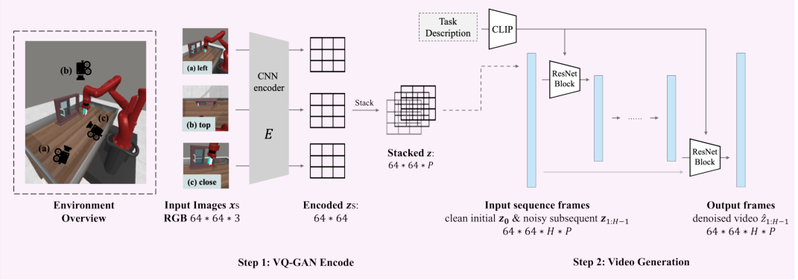
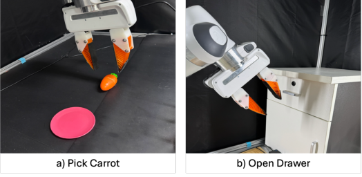
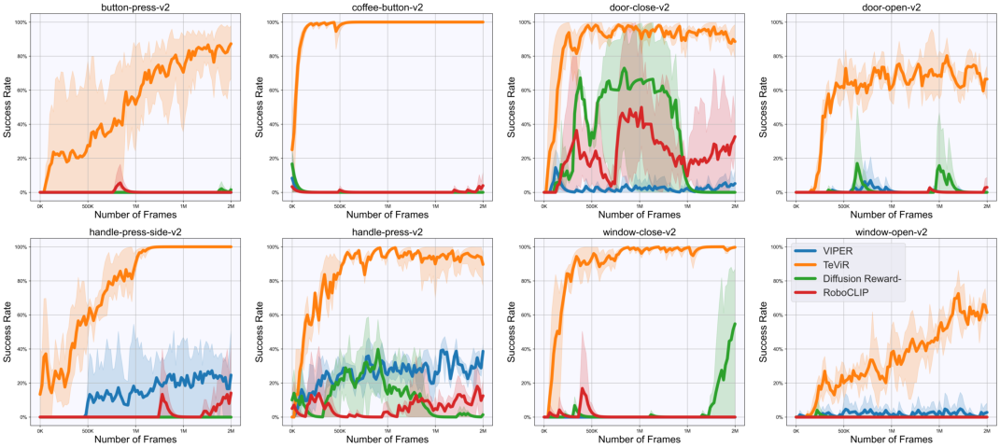
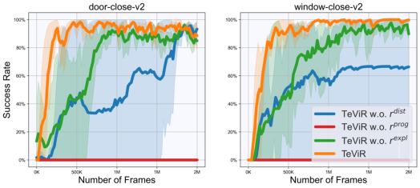

1

## TeViR: Text-to-Video Reward with Diffusion Models for Efficient Reinforcement Learning

Yuhui Chen, Haoran Li, Zhennan Jiang, Haowei Wen, Dongbin Zhao

_**Abstract**_ **—Developing scalable and generalizable reward engi-**
**neering for reinforcement learning (RL) is crucial for creating**
**general-purpose agents, especially in the challenging domain**
**of robotic manipulation. While recent advances in reward en-**
**gineering with Vision-Language Models (VLMs) have shown**
**promise, their sparse reward nature significantly limits sample**
**efficiency. This paper introduces TeViR, a novel method that**
**leverages a pre-trained text-to-video diffusion model to generate**
**dense rewards by comparing the predicted image sequence with**
**current observations. Experimental results across 13 simulation**
**and real-world robotic tasks demonstrate that TeViR outperforms**
**traditional methods leveraging sparse rewards and other state-**
**of-the-art (SOTA) methods, achieving better sample efficiency**
**and performance without ground truth environmental rewards.**
**TeViR’s ability to efficiently guide agents in complex environ-**
**ments highlights its potential to advance reinforcement learning**
**applications in robotic manipulation.**

_**Index Terms**_ **—reinforcement learning (RL), reward engineer-**
**ing, text-to-video diffusion model, robot manipulation, sample**
**efficiency.**

I. INTRODUCTION
# D EVELOPING general-purpose agents with reinforcementlearning (RL) necessitates scalable and generalizable

reward engineering to provide effective task specifications for
downstream policy learning [1]. Reward engineering is crucial
as it determines the policies agents can learn and ensures they
align with intended objectives. However, the manual design
of reward functions often present significant challenges [2]–

[4], particularly in robotic manipulation tasks [5]–[8]. This
challenge has emerged as a major bottleneck in developing
general-purpose agents.
Although inverse reinforcement learning (IRL) [9] learns
rewards from pre-collected expert demonstration, these learned
reward functions are unreliable for learning policies due to
noise and misspecification errors [10], especially for robotic
manipulation tasks since in-domain data is limited [11].
Additionally, the learned reward functions is not generally
applicable across tasks. With the impressive generalization
capabilities, pre-trained Vision-Language Models (VLMs) enables referencing visual features with natural language [12],
and thus used to generate sparse rewards for policy training

This work has been submitted to the IEEE for possible publication.
Copyright may be transferred without notice, after which this version may
no longer be accessible.
Yuhui Chen, Haoran Li, Zhennan Jiang, and Dongbin Zhao are with the
Institute of Automation, Chinese Academy of Sciences, Beijing 100190,
China, and are also with the School of Artificial Intelligence, University of
Chinese Academy of Sciences, Beijing 100049.
This work was done while Haowei Wen was a research intern at Institute
of Automation, Chinese Academy of Sciences, Beijing 100190, China.

by calculating the similarity between language descriptions
of tasks and the visual observations [13], [14]. However, the
reward signals generated in these methods are often unstable
and meets high variance, leading to insufficient supervision
and low sample efficiency. This is because VLMs lack the
diversity to generalize to different tasks as they are trained only
on matching language descriptions and visual observations

[15].
Recent approaches about pre-trained video diffusion models

[16] have achieved significant success in capturing the complex distribution of videos, such as the text-to-video generation

[17]. This technology is then employed in policy modeling,
using text-to-video diffusion models to predict future frames
and inverse dynamics models to derive actions for decisionmaking [18]–[21]. However, this require high-quality video
prediction [22] or otherwise the inverse dynamics model
may fail to generate appropriate actions. Additionally, some
methods generate video prediction rewards through prediction likelihood [23], [24] to encourage the robot to match
the desired behavior. However, these methods often lead to
sub-optimal behaviors since the prediction likelihood only
generates the short-term image under the policy [25]. These
approaches minimize prediction uncertainty rather than providing effective guidance for achieving long-term goals. More
importantly, these methods still rely on the sparse reward from
the environment.

To this end, we present **Te** xt-to- **Vi** deo **R** eward (TeViR),
a novel framework designed to calculate dense rewards by
generating videos with the language instruction input, enabling
agents to efficiently learn the desired policy. Our framework
involves video generation for planning the task execution and
assessing whether current observation meet expectations and
contribute to task progress. Visual and linguistic information
play crucial roles in human learning and decision-making
processes [18], [26], [27]. We combine these two types of
information with prior information across different tasks, and
utilizes text-to-video diffusion models for long horizon planning, which generates observations of the imaginary trajectory
based on the current visual observation and language task
description. By comparing these predicted images with the
current observations, dense rewards can be calculated for each
timestep, without relying on the environment rewards. Such
dense rewards enable the policy to evaluate the current state
and efficiently learn the desired behavior [28], [29]. Benefits
from the long-term planning ability of the video generation model, TeViR exploits the information from generated
trajectory, thereby achieving better performance and sample
efficiency compared to predicting the short-term observations.

2

Fig. 1. Overall framework of TeViR. The text-to-video diffusion model takes the initial RGB observation of the environment and a textual goal description as
its input. Then it synthesizes an image sequence of the future and the TeViR is calculated using the current observation and the synthesized image sequence.
Finally, the TeViR helps the agent update its policy.

Concretely, this work makes the following contributions:

1) We propose TeViR, a novel framework that annotates
reward for RL agents. By utilizing the capability of
text-to-video diffusion models to generate videos, TeViR
relies solely on the text description of the task and the
visual observations to generate dense rewards for policy
learning, eliminating the dependency on the ground truth
environmental reward.

2) TeViR offers a multi-view approach for video generation
to tackle occlusion issues. It calculates dense rewards

by assessing the distance to the desired trajectory and
the progress toward the goal. This reward system enhances the sample efficiency and success rate of RL
policies. It can be applied to learn policies for various
robotic manipulation skills, such as reaching, pushing,
and grasping.
3) We conduct experiments to show that TeViR achieves
the new SOTA for the reward engineering in 11 MetaWorld tasks and 2 real-world tasks. Notably, without
the environmental rewards, the average success rate
increased by 49.1% on Meta-World tasks and by 29.0%
on real-world tasks within same training steps.

Through these contributions, our approach addresses the
limitations of existing methods and offers a robust framework
for reward engineering in complex RL environments.

II. RELATED WORK

_A. Learning from Expert Videos_

How to learn policy from expert videos has been studied for
decades. Imitation learning (IL) methods often rely on stateaction pairs from expert demonstrations to learn policy. Recent
studies such as [30]–[32], emphasize learning directly from the
raw export data, bypassing the need for manually labeled data.
IRL [33]–[35] extends the capabilities of IL by deriving reward
functions from the observed behaviors of experts. Several
works use perceptual metrics such as goal-image similarity

and trajectory similarity to calculate rewards [11], [36]–[38]. A
novel approach involves using video prediction models to estimate future states and derive rewards based on predicted loglikelihood or entropy [13], [23], [24]. These methods allow for
dynamic reward generation, potentially increasing the adaptability and efficiency of learning algorithms. In contrast to
prior methods, our approach utilizes a text-to-video diffusion
model to generate dense rewards by comparing predicted video
sequences with the agent’s current observations, providing a
more scalable and generalizable feedback mechanism for RL.

_B. Large models as Reward Functions_

To design reward functions capturing human preferences,
methods [8], [39] explores large language models (LLMs) in
text-based games like negotiations or card games. Other works
followed by demonstrating that LLMs can write code of the
reward function for training robots [40]–[42]. Focusing on
applications that interact with the physical world, approaches
employ VLMs as a success detector to provide sparse task rewards [43], or to evaluate whether image observation of agent
aligns with language description of the robot tasks [14], [44]–

[47]. However, these methods operate on individual frames or
short clips, without modeling full temporal task completion,
and their reward accuracy heavily depends on how well the
agent’s visual observations align with the data distribution of
the pre-trained VLMs [11], [14]. This limits their effectiveness
in long-horizon, open-ended tasks, particularly when domain
or viewpoint shifts occur.
Other than using language as the interface, more recent
approaches applied the large Text-to-Image model to generate
visual goal [38] or web-scale text-to-video diffusion model
to learn universal policies [18], [19], [48], serving image as
a unified representation of the physical world. In contrast,
our method learns dense rewards via a text-to-video diffusion

model conditioned on both language descriptions and current
visual observations, offering more informative and continuous

3

Fig. 2. Illustration of the 3 view selected for the Meta-World environment and the network architecture of our text-to-video diffusion model. We chose _left_,
_top_ and _close_ to collect visual observations, so as to comprehensively capture the robot state during the task execution. (a),(b) and (c) are the images observed
from 3 view, respectively. The video generation process includes 2 steps: (1) We use an CNN-based encoder to encode RGB images into vectors _**z**_ (2) Then
we use an U-Net architecture with factorized spatial-temporal convolution kernel as the basic building block for video generation.

feedback to accelerate policy learning while improving the
scalability and generalization across various tasks.

III. PRELIMINARIES

_A. Markov Decision Process_

We consider an RL agent that interacts with the environment
modeled as a Markov Decision Process (MDP) with a finite
horizon. The process is defined by a tuple _{_ _**S**_ _,_ _**A**_ _, P,_ _**R**_ _, γ}_,
where _**S**_ and _**A**_ represents the state space and the action space.
For action _**a**_ _t ∈_ _**A**_, state and next state _**s**_ _t,_ _**s**_ _t_ +1 _∈_ _**S**_ at time
step _t_, _P_ ( _**s**_ _t_ +1 _|_ _**s**_ _t,_ _**a**_ _t_ ) represents the environment transition
function, _r_ ( _**s**_ _t,_ _**a**_ _t,_ _**s**_ _t_ +1) _∈_ _**R**_ represents the reward function,
and _γ_ represents the discount factor. The goal of this RL
agent is to learn an optimal policy _π_ ( _**a**_ _t|_ _**s**_ _t_ ) that maximizes
the expected return E _[T]_ _t_ =0 _[ −]_ [1][[] _[γ][t][r][t]_ []][. And we use subscripts] _[ t][ ∈]_
_{_ 0 _, · · ·, T −_ 1 _}_ to denote trajectory time steps of a finitehorizon _T_ .

_B. Text-to-video Diffusion Model_

The text-to-video diffusion model is a conditional video

diffusion model [16], [49] that takes the initial image _**x**_ 0
and a language description _txt_ as its condition and aims
to approximate the distribution _pϕ_ ( _**τ**_ 1: _H−_ 1 _|_ _**x**_ 0 _, txt_ ), where
_**τ**_ 1: _H−_ 1 = _{_ _**x**_ 1 _, ...,_ _**x**_ _H−_ 1 _}_ represents a video clip from video
time step 1 to _H −_ 1.
The forward diffusion process applies noise _**ϵ**_ in the latent
space at each diffusion time step _k ∈{_ 0 _, ..., K}_ to the data
distribution _**τ**_ 1: _H−_ 1. The noisy sample can be calculated by
_**τ**_ 1: _[k]_ _H−_ 1 [=] _[ √]_ ~~_[a]_~~ _[t]_ ~~_**[τ]**_~~ 1: [ 0] _H−_ 1 [+] _[ √]_ [1] _[ −]_ ~~_[a]_~~ _[t]_ ~~_[ϵ]_~~ [, where] ~~_[a]_~~ _[t]_ [is the accumu-]
lation of the noise schedule over past time steps _{_ 0 _, ..., k}_ .
We use superscripts _k ∈{_ 0 _, · · ·, K −_ 1 _}_ to denote diffution
time steps. To learn the distribution _p_ ( _**τ**_ 1: _N_ _−_ 1 _|_ _**x**_ 0 _, txt_ ), this
diffusion model aims to train a score function _ϵθ_ to predict
the noise _**ϵ**_ that applied to _**τ**_ 1: _N_ _−_ 1 given the perturbed sample.

Given the Gaussian noise scheduling ~~_a_~~ _t_ ~~,~~ the overall learning
objective with mean squared error (MSE) is shown below:

_LMSE_ = _||_ _**ϵ**_ _−_ _ϵθ_ ( _**τ**_ 1: _[k]_ _H−_ 1 _[|]_ _**[x]**_ [0] _[, txt]_ [)] _[||]_ [2]

= _||_ _**ϵ**_ _−_ _ϵθ_ ( _[√]_ ~~_a_~~ _t_ ~~_**τ**_~~ 1: [0] _H−_ 1 [+] _√_

(1)
1 _−_ ~~_a_~~ _t_ ~~_ϵ_~~ _|_ _**x**_ 0 _, txt_ ) _||_ [2]

where the noise _**ϵ**_ is sampled from a multivariate Gaussian
distribution, and _k_ _∈{_ 1 _, ..., K}_ is a randomly sampled
diffusion step.

IV. METHOD

_A. TeViR Framework_

To generalize TeViR across different tasks and environments, we consider an RGB images _**s**_ _∈_ R _[H×W×]_ [3], as a
universal interface between the RL agent and environments.
However, reward engineering on RGB images without reliance
on the environmental sparse reward is tedious and sometimes
intractable. To tackle this prominent challenge, we propose
our framework for dense reward calculation which consists of

three modules, a text-to-video diffusion model to synthesize
expert future image sequences conditioned on the first frame
and the task descriptions, the TeViR to calculate rewards, and
an RL agent using the reward to update its policy.
As depicted in Figure 1, our framework leverages expert
experience from pre-trained text-to-video diffusion models at
a high level. The model takes a language description to specify
desired task and an RGB image to indicate the initial state of
the environment as condition, and generates a sequence of
key frames illustrating the expected progression toward task
completion. We expect the RGB image to capture dynamic
features in the environment, with the generated expert video
bridging the domain gap between task language description
and the robot behavior. This enables more comprehensive
guidance for long-horizon tasks, addressing the challenges
posed by sparse or unreliable reward signals.
Downstream, to adapt the RL agent to the target behavior
represented under the generated video, our framework calculates dense rewards using the generated video and current

4

Fig. 3. Progress calculation illustration. For each image _zt_ in a trajectory, the progress reward calculates the similarity with the corresponding generated
image sequence within its progress _Mt_ . We assume that the image _zt−_ 1 on a trajectory with progress _Mt−_ 1 = 4 is similar to the farthest reached image
_zMt−_ 1 and we have _Mt_ = 5. If _zt_ of the trajectory is similar to image _zMt_, then progress for _zt_ +1 should be 6, labeled in green. Otherwise, the progress
for _zt_ +1 would maintain 5, labeled in orange.

observation to encourage it exploring and learning the desired
policy. In contrast to existing methods like RoboCLIP [14],
which provide sparse rewards based on task language and visual observation similarity, and Diffusion Reward [24], which
only predicts short-term images without capturing long-term
task progression, our framework generates dense rewards by
comparing the current observation to the entire predicted image trajectory. This allows the RL agent to receive continuous,
informative feedback throughout the task, rather than relying
on a single sparse signal. By calculating rewards based on
both visual observation and the predicted image sequence,
our framework isolates the reward calculation process from
any environmental information other than the visual inputs,
while still leveraging prior knowledge learned from the textto-video diffusion models. This unique design leads to more
effective exploration and better learning of the desired policy
in complex robotic tasks.

_B. Multi-view Video Generation_

We then illustrate how we generate videos through a pretrained text-to-video model. Firstly, we train an image encoder
to condense the information from the high-dimensional observation space. Specifically, we employ the VQ-GAN [1] encoder

[50] to encode the image _**x**_ into a quantized latent vector
_**z**_ = _Q_ ( _E_ ( _**x**_ )), where _E_ represents the encoder and _Q_ denotes
the element-wise quantizer. With this encoder, an image _**x**_ is
then represented by a latent vector _**z**_ in the following sections.
Since RGB images capture only color information, they
have limitations in dealing with occlusions and offering a
comprehensive spatial understanding of the environment. To
address these challenges, we utilize multiple _P_ views, which
provide complementary perspectives that enhance the model’s
ability to assess the mechanical structure and task execution.
The selection of these views is made based on their ability
to capture different aspects of the task and may be adjusted
according to specific environment and task requirements. For

1https://github.com/dome272/VQGAN-pytorch

the robot manipulation tasks we selected, we choose _P_ = 3
views: _left, top, close_, as illustrated on the left in Figure
2. The left view ( _**z**_ _[left]_ ) offers a broad, global perspective
of the environment, ensuring that the agent has an overall
understanding of the task setting. The top view ( _**z**_ _[top]_ ) provides
a vertical perspective, which is essential for tasks that require
precise positioning or spatial awareness from above, such as
aligning with objects. The close view ( _**z**_ _[close]_ ) focuses on
the robot and task object, offering fine-grained details of the
manipulation process, such as grasping or object interaction.
These diverse views help address occlusion issues and ensure
that the model captures a complete spatial representation. To
simplify the notation, if a vector _**z**_ is referenced later without a
superscript indicating a specific view, it should be interpreted
as representing the aggregation of all selected views.
The whole architecture of our text-to-video diffusion model

is illustrated in Figure 2. Firstly, the images from all view
are firstly encoded into latent vectors the VQ-GAN encoder.
Then we stack all latent vectors as one frame, a basic block of
the sequence frame for video prediction via an U-Net model.
The U-Net model finally takes a clean initial frame _**z**_ 0 and
_H −_ 1 subsequent noisy frames _**z**_ 1: _H−_ 1 as input and generate
the image sequence � _**z**_ 0: _H−_ 1. By combining latent vectors from
all views, we create a more complete and detailed spatial
representation of the scene. Also, stacking latent vectors
ensures that information from different views is integrated
into a single coherent frame, maintaining consistency and
reducing discrepancies that may arise from individual perspectives. Throughout this paper, the text-to-video diffusion
model predicts a fixed number of image sequence, where we
set _H_ = 8 in all experiments.

_C. Text-to-video Reward_

Finally, we introduce the details of our reward calculation
method. The reward functions is important to guide the
agent’s behavior by indicating the desirability of its actions
to maximize long-term success. Therefore, the critical insight
behind TeViR is to how closely the current observation aligns

5

Fig. 4. Trajectory visualizations of ’window-close-v2’ from _left_ view. (a) The scripted policy provided by Meta-World demonstrates expert performance. (b)
The policy trained by RoboCLIP approaches the target object, the window, but fails to close it. (c) The policy trained by Diffusion Reward learns to close the
window but exhibits instability, resulting in a low success rate. (d) The policy trained by TeViR successfully learns the desired behavior with high robustness.

with the generated image sequence and the overall progress
toward completing the task. This evaluation allows us to
calculate a reward that effectively encourages the agent to
prioritize states and actions that lead to the desired trajectory,
ultimately reinforcing behaviors that align with successful task
completion.
In designing the TeViR, we aim to capture the essence
of effective learning by rewarding observations that closely
resemble the final stages of the generated image sequence.
This strategic alignment encourages the agent to prioritize
states that are nearer to the desired trajectory, thus reinforcing
behaviors that closely mirror expert performance. By focusing
on these pivotal moments, the TeViR effectively guides the
agent towards the goal, ensuring that it hones in on the most
crucial aspects of the task.
By interacting with the environment for a whole rollout,
we have a trajectory _{_ _**z**_ 0 _, ...,_ _**z**_ _T −_ 1 _}_ and a generated image

�
sequence _{_ _**z**_ 0 _, ...,_ � _**z**_ _H−_ 1 _}_ . The trajectories are evaluated based
on these main criteria:

_a) Distance Reward:_ To guide the agent towards states
that closely match the desired trajectory, we firstly introduce
the distance reward _rt_ _[dist]_ . A naturalistic way to define the
distance between 2 states is through similarity. We define
a function to quantify the similarity between corresponding
images on the trajectory _**z**_ 1: _T −_ 1 and the generated image
sequence � _**z**_ 1: _H−_ 1. This function captures the feature-based
discrepancies between the two trajectories. Since the agent’s
observations are derived from multiple views (e.g., left, top,
and close-up), the reward calculation must take into account
the information from all these perspectives. Specifically, we
_**a**_ _·_ _**b**_
calculate the cosine similarity _σ_ ( _**a**_ _,_ _**b**_ ) = _||_ _**a**_ _||·||_ _**b**_ _||_ [for each]
view and combine the results using a weighted average across
different views:

_σ_ ( _**z**_ _t,_ � _**z**_ _h_ ) = � _Pi_ =0 _[w][view]_ ~~�~~ _Pi_ =0 _[i][σ]_ [(] _[w]_ _**[z]**_ _[view]_ _t_ _[view][i][i]_ _,_ � _**z**_ _h_ _[view][i]_ ) (2)

where _w_ _[view][i]_ _, p ∈{_ 1 _, ..., P_ _}_ are hyperparameters for different
view to adapt to different task requirements. This ensures that

different perspectives contribute appropriately to the reward
based on the task’s requirements. We give the definition of
the distance reward:

_**r**_ _t_ _[dist]_ = _σ_ ( _**z**_ _t,_ � _**z**_ _h∗_ ) (3)

where _h_ _[∗]_ = arg max _h∈{_ 0 _,...Mt−_ 1 _} σ_ ( _**z**_ _t,_ � _**z**_ _h_ ).
_b) Progress Reward:_ We then have the progress reward
_rt_ _[prog]_, for evaluating the overall progress toward completing
the task. Consider the task of opening a door. If the agent
skips the step of grasping the doorknob and tries to pull the
door directly, it fails to complete the task correctly. Therefore,
we should guide the agent to perform each critical step in
sequence to ensure the proper execution of the task.
To mitigate the agent’s propensity to skip essential intermediate steps and jump directly to the end of the trajectory, we
introduce a concept termed a reached image. This mechanism
employs a similarity threshold _θ_ to evaluate the progress _M_
that the agent has made towards replicating the expert image
sequence, where _Mt ∈{_ 0 _, ..., H −_ 1 _}_ that marks the farthest
image along the expert image sequence that the agent has
successfully approximated up to trajectory time step _t_ . This
mechanism is illustrated in Figure 3.
Then, a binary reward is issued if the agent’s current
observation closely resembles the expert’s final image in
the trajectory. When the environment sparse reward _**r**_ _[spar]_ is
available in some cases, we can replace the corresponding part
with the ground truth value directly and refer as _**r**_ _t_ _[prog]_ [+] . We
give the definition of the progress reward _rt_ _[prog]_ :

_**r**_ _t_ _[prog]_ = _αh_ _[∗]_ + I[ _σ_ ( _zt,_ � _**z**_ _H−_ 1) _> θ_ ]

(4)
_**r**_ _t_ _[prog]_ [+] = _αh_ _[∗]_ + _rt_ _[spar]_

where _h_ _[∗]_ = arg max _h∈{_ 0 _,...Mt−_ 1 _} σ_ ( _**z**_ _t,_ � _**z**_ _h_ ) and _α_ is a hyperparameter for balancing the progress reward. In practice we
find _α_ = 0 _._ 125 is suitable for all tasks selected.
_c) Exploration reward:_ While the above-mentioned rewards encourage the agent to replicate expert behaviors,
the complexity of tasks with high-dimensional inputs may

**Algorithm 1** TeViR Formulation

# Pretrain a text-to-video diffusion model _ϕ_ if not available
Collect expert videos and corresponding task description _D_
from multiple tasks
Train diffusion model _pϕ_ on dataset _D_ by Equation (1)
# Downstream RL with TeViR

**for** each rollout **do**

Initialize reached image _M_ 0 = 0
Observe _**z**_ 0 and generate the image sequence

�
_{_ _**z**_ 0 _, ...,_ � _**z**_ _H−_ 1 _}_
Collect a trajectory _{_ _**z**_ 0 _, ...,_ _**z**_ _T −_ 1 _}_
**for** _t ∈{_ 0 _,_ 1 _, ..., T −_ 1 _}_ **do**

Calculate the TeViR or TeViR+ by Equation (5), Equation (6)
**if** Current image is similar to the farthest reached
image: _σ_ ( _**z**_ _t,_ � _**z**_ _Mt−_ 1) _≥_ _θ_ **then**

_Mt_ +1 = _Mt_ + 1 # Update the reached image
**else**

_Mt_ +1 = _Mt_ # Keep the reached image
**end if**

**end for**

**end for**

still limit exploration. To address this, we integrate Random
Network Distillation [2] [51] as an exploration reward, referred
to as _**r**_ _t_ _[expl]_ = _**r**_ _t_ _[rnd]_ . It allows the agent to quickly learn
how to recover from suboptimal or undesirable states, thereby
improving sample efficiency.
The _**r**_ _t_ _[rnd]_ is a reward calculation method that encourages exploration by introducing an intrinsic reward based
on prediction errors. Specifically, it uses a fixed randomly
initialized neural network _ν_ 0 and a predictor network _ν_ 1. The
agent receives a higher exploration reward when the predictor
network _ν_ 1 struggles to accurately predict the output of the
random network _ν_ 0 given the same input. This incentivizes
the agent to explore states that are novel or less familiar, as
these states typically yield higher prediction errors and thus
higher exploration rewards.
We finally give the definition of the TeViR:

_rt_ _[T eV iR]_ = _rt_ _[dist]_ + _rt_ _[prog]_ + _rt_ _[expl]_ (5)

When the environment sparse reward _**r**_ _[spar]_ is available, we
can have:

_rt_ _[T eV iR]_ [+] = _rt_ _[dist]_ + _rt_ _[prog]_ [+] + _rt_ _[expl]_ (6)

We summarize the complete reward formulation procedure of
TeViR in Algorithm 1.

V. EXPERIMENTS

Our experiments are conducted in a simulated environment
that reflects the complexities and sparse nature of real-world
robotic manipulation scenarios. The effectiveness of our reward function is evaluated against traditional reward strategies,
focusing on the agent’s ability to learn correct behaviors
efficiently. All agents are trained using raw pixel observations

2https://github.com/jcwleo/random-network-distillation-pytorch

6

from the environment without access to other information,
such as state or task rewards. In our experiments, we aim
to answer the following questions:

1) Is TeViR capable of efficiently guiding an agent to learn
the desired behavior rapidly? (Section V-B)
2) Is TeViR effective at providing a sufficient learning
signal for learning the desired behavior without environmental rewards? (Section V-C)
3) Can TeViR maintain robustness despite poor text-tovideo generation quality? (Section V-D)
4) What implementation detail of TeViR matters for task
learning? (Section V-F)

_A. Experimental Setup_

_1) Baselines:_ We compare our method against the following methods:

_•_ **Raw Sparse Reward** : This method only uses the ground
truth environment sparse reward for training the policy.
This is a basic policy training reward for traditional RL
methods.

_•_ **RoboCLIP** : RoboCLIP [3] [14] utilizes pre-trained VLMs
to generate rewards for the agent. This is done by providing a sparse reward to the agent at the end of the trajectory
which describes the similarity of the agent’s behavior to
the language task description. This comparison tests the
benefit of generating dense rewards for policy learning.

_•_ **VIPER** : VIPER [4] [23] learns a video prediction transformer from expert videos and directly leverages the
video model’s likelihood as a reward signal to encourage the agent to match the video model’s trajectory
distribution. This comparison tries to answer the benefit
of using text-to-video diffusion models to generate the
whole expert trajectory for reward formulation.

_•_ **Diffusion Reward** : Instead of VIPER using a video
prediction transformer, Diffusion Reward [5] [24] leverages
conditional video diffusion models to capture the expert video distribution. Then, it utilizes the conditional
entropy of the video prediction with the ground truth
environment sparse reward to formulate dense rewards.
This analysis aims to evaluate the advantages of the
guidance ability of TeViR for efficient policy convergence. To compare the method under a situation where
an environment reward is not available, we further implement the Diffusion Reward without the ground truth
environment sparse reward, labeled as Diffusion Rewardin the following section.

_•_ **UniPi** : Unlike other reward engineering methods, UniPi [6]

[18] learns a text-to-video diffusion model from internetscale video datasets as a planner, and then an inverse
dynamics model is used to extract the underlying actions
from the generated video. This comparison evaluates the
robustness of our method in terms of the generation
quality of the video. For the inverse dynamic model of

3https://github.com/sumedh7/RoboCLIP
4https://github.com/Alescontrela/viper rl
5https://github.com/TEA-Lab/diffusion reward
6https://github.com/flow-diffusion/AVDC

7

Fig. 5. Performances of the different reward engineering methods with the environmental sparse reward on 8 tasks from Meta-World benchmark. Raw Sparse
Reward and Diffusion Reward are compared with TeViR+ with 3 random seeds within 1M training steps.

UniPi, we follow the network architecture described in
Appendix A.2 of UniPi [18], which consists of a 3x3
convolutional layer, 3 layers of 3x3 convolutions with
residual connection, a mean-pooling layer across all pixel
locations, and an MLP layer of (128, 4) channels to
predict the action for robot control.

TABLE I

LANGUAGE DESCRIPTION AND HYPERPARAMETERS OF TEVIR FOR EACH

TASK

**Task** **Language Description** _θ_ _{w_ _[left]_ _, w_ _[top]_ _, w_ _[close]_ _}_
button-press-topdown-v2 Press a button from the top. 0.8 _{_ 0.5, 0.8, 0.4 _}_
button-press-v2 Press a button. 0.8 _{_ 0.5, 0.8, 0.4 _}_
coffee-button-v2 Push a button on the coffee machine. 0.8 _{_ 0.4, 0.8, 0.5 _}_
door-close-v2 Close a door. 0.9 _{_ 0.2, 0.8, 0.3 _}_
door-open-v2 Open a door. 0.7 _{_ 0.3, 0.8, 0.5 _}_
drawer-close-v2 Close a drawer. 0.8 _{_ 0.8, 0.4, 0.4 _}_
drawer-open-v2 Open a drawer. 0.8 _{_ 0.5, 0.2, 0.7 _}_
handle-press-side-v2 Press a handle down sideways. 0.8 _{_ 0.3, 0.8, 0.5 _}_
handle-press-v2 Press a handle down. 0.8 _{_ 0.3, 0.8, 0.5 _}_
window-close-v2 Close a window. 0.8 _{_ 0.2, 0.8, 0.2 _}_
window-open-v2 Open a window. 0.7 _{_ 0.3, 0.8, 0.5 _}_
Pick Carrot (real-world) Put the carrot into the plate. 0.7 _{_ 0.8, 0, 0.5 _}_
Pull Compartment (real-world) Pull open the sliding compartment. 0.7 _{_ 0.8, 0, 0.5 _}_

_a) Experimental Environments and Training Details:_ We
intend to demonstrate the effectiveness of TeViR on visual

robotic manipulation tasks from Meta-World [52] with Sawyer
arm, and real-world tasks with Franka Emika arm. To ensure
task diversity and complexity when evaluating reward function, we choose 11 Meta-World manipulation tasks and 2 realworld tasks shown in Figure 6, including different skills such
as reaching, pushing, and grasping. Each task is associated
with 64 _×_ 64-dimensional RGB images of multiple view
and a binary ground truth environmental sparse reward. The
sparse reward in real-world tasks is generated by a pre-trained
ResNet-based classifier, which evaluates the completion of
target task. These tasks are widely used in visual RL and are
chosen to be diverse in objects and manipulating skills. The

Fig. 6. Overview of all real-world experimental tasks, including a) Pick Carrot
and b) Open Drawer.

language description and hyperparameters for each task are
shown in Table I.

For the Meta-World tasks, we collect 30 expert videos of
each view for each via the scripted policy provided by the
official repository [7] . For the real-world tasks, we collect 30
expert videos of each view through human tele-operation. And
we utilize the task description as shown in Table I to synthesize
ten sentences with consistent semantic content to expand data
diversity.
For the video generation, we used a fixed pre-trained CLIPText encoder (63M parameters) [53] to encode language task
descriptions into 512-dimension embedding. Then we follow
AVDC [19] and use a similar network architecture and training
setup which utilizes Video U-Net model with 3 residual blocks
of 128 base channels and channel multiplier [1, 2, 3, 4, 5],
attention resolutions [8, 16], attention head dimension 32.
We use 1e-4 as the learning rate and Adam optimizer for
model updating. The training is performed on an NVIDIA

7https://github.com/Farama-Foundation/Metaworld

8

Fig. 7. Performances of the different reward engineering methods without the environmental feedback on 8 tasks from Meta-World benchmark. RoboCLIP,
VIPER and Diffusion Reward- are compared with TeViR with 3 random seeds within 2M training steps.

A6000 GPU with a batch size of 8, using the first 80% of
the video data, with the remaining 20% used for evaluation.
The video diffusion model is trained for 400K steps, taking
approximately 20 hours to complete.
Note that for a fair comparison, all reward engineering
methods tested are agnostic to the choice of downstream
RL algorithm. For Meta-World tasks, we use DrQv2 [8] [54]
as the backbone. And we use _action repeat_ = 3 and
_feature dim_ = 50 for DrQv2 policy. For real-world tasks,
we adopt HIL-SERL [9] [55], incorporating human intervention
during training. For all tasks, the discount is 0.99. We use 1e-4
as the learning rate and Adam optimizer for policy training,
which is performed on an NVIDIA A6000 GPU with a batch
size of 256.

_B. Learning with Ground Truth Sparse Reward_

Firstly, we aim to investigate whether our proposed framework, TeViR, can efficiently guide the agent to the desired
behavior while tackling complex robotics tasks. We select
8 tasks of varying difficulty levels, requiring the agent to
learn behaviors such as pushing, pulling, and grasping. In the
context of learning with ground truth environmental sparse
rewards, we choose TeViR+ using Equation 6, which incorporates the environmental reward as part of the reward and
compares it against both raw sparse reward and the Diffusion
Reward. And the interaction budget is set at 1 million for
comparison.
The experiment results shown in Figure 5 indicate that relying solely on sparse environmental rewards facilitates progress
in more straightforward tasks like ’door-close-v2’, where the
agent needs to slap and close the door. However, it encounters

8https://github.com/facebookresearch/drqv2
9https://github.com/rail-berkeley/hil-serl

considerable difficulties with more complex tasks such as
’door-open-v2’, where the agent must first grasp the doorknob
and then pull the door open. Utilizing video prediction models,
Diffusion Reward employs conditional entropy as a dense
reward to guide the agent in learning the desired behavior.
Success in more complex tasks, such as ’door-open-v2’ and
’drawer-open-v2’, demonstrates that Diffusion Reward can
guide the agent by rewarding those expert-like trajectories.
However, this video prediction model uses the diffusion model
to predict only the following image based on historical images, limiting its ability to provide guidance for long-horizon
policies. Despite the powerful representational capabilities of
the diffusion model in capturing expert distributions, it still
struggles to guide the agent efficiently, resulting in excessively
long training steps.

In contrast, by utilizing the text-to-video diffusion model
to generate the entire expert trajectory for guiding the agent,
TeViR+ achieves superior policy guidance, as evidenced by the
greater sample efficiency. This approach enables the agent to
benefit from a more comprehensive and structured learning
process, effectively reducing the training steps required to
achieve the desired behavior. The extensive guidance provided
by the text-to-video diffusion model allows the agent to
better understand the long-term implications of its actions
compared to models that predict only the next state. This
holistic approach facilitates more efficient learning of complex
tasks.

Also, the presence of ground truth environmental sparse
rewards results in significant variance across the three methods
in Figure 5, primarily due to the binary success signal (0
or 1) provided. During the initial stages of training, agents
employ random exploration strategies. Agents can rapidly
learn the desired behaviors upon discovering a successful try
and receiving the environmental sparse reward. In this context,

Fig. 8. Performances of TeViR with added noise on 2 selected tasks from
Meta-World benchmark. Results are reported on 3 random seeds.

TABLE II

SUCCESS RATES WITH ADDED NOISE.

**Method** **Task** **SNR(dB)**
30 25 20 15 10

UniPi handle-press-side-v2 90.0% 33.3% 0.0% 0.0% 0.0%
window-close-v2 83.3% 23.3% 0.0% 0.0% 0.0%

TeViR handle-press-side-v2 100.0% 93.3% 96.7% 76.7% 6.7%
window-close-v2 93.3% 90.0% 90.0% 73.3% 56.7%

the effectiveness of different methods in guiding the agent’s
policy learning becomes a critical factor for sample efficiency.
In scenarios with only sparse rewards, the variance is at
its highest, indicating that this method relies heavily on the
agent’s ability to explore desired behaviors through random
exploration. Conversely, dense rewards such as the Diffusion
Reward effectively guide the agent’s policy learning, leading
to faster learning rates and reduced variance. Furthermore,
the TeViR+ exhibits even lower variance than the Diffusion

Reward, suggesting that it has better guidance that enables
agents to achieve rapid success on learning the desired policy.

_C. Learning without Ground Truth Sparse Reward_

To learn behaviors using our pre-trained text-to-video diffusion model and without utilizing any reward signals from the
environment, we then provide the learning curves of success
rates using Equation 5 in TeViR. For our comparative analysis,
we selected three methods that do not incorporate the ground
truth environmental sparse rewards: RoboCLIP, VIPER, as
well as the Diffusion Reward that removed _r_ _[spar]_ (labeled as
Diffusion Reward-). This selection allows us to evaluate the
impact of excluding traditional sparse reward mechanisms on
the performance of each method. We also selected 8 tasks
with varying difficulty levels, and the interaction budget is set
at 2 million for comparison. All training curves are shown in
Figure 7.
The experimental results demonstrate that our method
achieves outstanding performance across all tasks in the absence of the ground truth environmental sparse rewards. This
finding underscores the robustness and effectiveness of our
approach in complex robot manipulation tasks. As depicted
in Figure 4, RoboCLIP, which generates a sparse reward by
calculating the similarity between the image trajectory and the
language description of the desired behavior, fails in almost
all tasks. The agent can only get closer to its goal position,

9

Fig. 9. Performances of TeViR with task-irrelevant and temporally disordered
frames on 2 selected tasks from Meta-World benchmark. Results are reported
on 3 random seeds.

TABLE III

SUCCESS RATES WITH ERRONEOUS FRAMES.

**Method** **Task** **Proportion of Error**
0% 12.5% 25%

UniPi handle-press-side-v2 100.0% 40.0% 16.7%
window-close-v2 96.7% 10.0% 0.0%

TeViR handle-press-side-v2 100.0% 86.7% 26.7%
window-close-v2 96.7% 56.7% 33.3%

as language alone is insufficient to capture the intricacies of
complex behaviors.
Meanwhile, both VIPER and Diffusion Reward- are capable
of generating dense rewards to accelerate policy learning,
yet they still suffer from low sample efficiency. Within the
constraint of 2 million training steps, these methods also fail
in most of the tasks. Notably, for the ’door-close-v2’ task, the
Diffusion Reward- experiences a policy collapse after initially
achieving the desired behavior, indicating the instability of
the conditional entropy reward without integrating the environment reward.

_D. Learning with Poorly Generated Video_

Maintaining temporal consistency across frames is a significant challenge for contemporary text-to-video generation
methods. Existing models often produce videos with flickering and unnatural transitions as they struggle to preserve
structural consistency throughout the video sequence [56]. In
this section, we evaluate our method with UniPi to illustrate
the performance of these two approaches under conditions of
poor text-to-video generation quality.
Compared to the training outcomes of TeViR+ depicted in
Figure 5, the results for TeViR shown in Figure 7 demonstrate
greater instability and an inability to achieve a 100% success
rate across multiple experimental settings (e.g., button-pressv2, window-close-v2). This instability is primarily due to
the lack of ground truth sparse rewards from the environment, causing TeViR to converge to behaviors that merely
approximate the generated expert trajectories. Consequently,
the performance of TeViR heavily depends on these generated
expert image sequences, which may not encompass all possible
scenarios or offer optimal solutions for the present contexts.
To simulate poor-quality video generation, we employ two
distinct methods. These evaluations aim to provide a comprehensive understanding of the robustness of our method and

Fig. 10. Trajectory returns of TeViR on real-world ”Open Drawer” task. Only
Traj. 3 successfully completes the task.

UniPi under adverse video generation conditions. All results
for UniPi are implemented via open-loop control and tested
on 30 independent experiment with random seeds. All results
for TeViR are reported by 3 random seeds within 2M training

steps.

_a) Impact of Added Noise:_ The first method involves
directly adding noise to the generated videos. We investigate
the performance of the two methods under varying signal-tonoise ratios (SNR). The results are shown in Table II, and we
provide training curves of TeViR in Figure 9.

_b) Impact of Task-Irrelevant and Temporally Disordered_
_Frames:_ The second method introduces task-irrelevant or

temporally disordered frames into the generated videos. We
explore the final performance of both methods under a fixed
proportion of erroneous frames. The results are shown in Table
III, and we provide training curves of TeViR in Figure 9.

Based on the results in Table II and Table III, it is clear
that the presence of significant noise or incorrect frames in
the generated video can significantly impact the performance
of different methods. Specifically, UniPi’s inverse dynamics
model shows a marked sensitivity to these perturbations. High
levels of noise and frame errors lead to notable inaccuracies in

the inverse dynamics model’s output, which in turn can result
in policy failures. This sensitivity to noise can undermine the
reliability of the UniPi in real-world applications where data
imperfections are common.

Conversely, TeViR is based on reinforcement learning,
enabling it to learn how to accomplish tasks from suboptimal
states through exploration [57], which contributes to its higher
robustness compared to UniPi. Even when the Signal-toNoise Ratio (SNR) is as low as 20 or the error rate is as
high as 12.5%, TeViR can still effectively guide the policy.
Furthermore, when the SNR is reduced to 15 or higher error
rates are introduced, TeViR still maintains a level of performance, albeit with some instability. This indicates that, even
under more extreme conditions, TeViR retains its ability to
adapt and continue learning, which showcases its adaptability
and robustness in challenging real-world scenarios. However,
under these conditions, the performance of TeViR is limited
due to the challenges in accurately calculating the distance
reward and progress reward, which are critical for guiding the
agent’s learning process.

10

Fig. 11. Performances Raw sparse reward and TeViR+ on 2 real-world tasks.
Raw Sparse Reward is compared with TeViR+ and all results are reported as
a running average over 20 episode.

Fig. 12. Ablation studies for validating the necessity of multi-view observation on 2 selected tasks from Meta-World benchmark. Results are reported on
3 random seeds.

_E. Real World Experiments_

To further assess the practical applicability of TeViR in realworld settings, where reward design remains a fundamental
challenge, we extend our experiments to a physical robotic
platform. Specifically, we evaluate RL training using TeViR+
against a baseline that relies solely on raw sparse rewards
across two representative manipulation tasks, under otherwise
identical training conditions.
As shown in Figure 10, we first validate the effectiveness
of TeViR rewards in a real-world ”Open Drawer” task. In this
setup, three trajectories reflect varying levels of task progress:
Traj.1 exhibits only minor movement, Traj.2 fails to grasp the
drawer handle, and only Traj.3 completes the task successfully.
TeViR accurately distinguishes these differences, assigning
rewards that reflect task success without relying on any handcrafted metrics.

To fairly isolate the impact of TeViR+, we ensure a consistent level of human intervention across all settings. As
shown in Figure 11, TeViR+ significantly accelerates policy
learning and leads to more stable and goal-consistent behaviors
in real-world conditions. Notably, it achieves higher success
rates within the same training steps, outperforming the sparsereward baseline (e.g., 100% vs. 65% and 90% in the two
tasks). These results highlight TeViR’s potential to reduce the
reliance on hand-crafted reward functions while preserving
sample efficiency and robustness.

_F. Ablation Studies_

_1) Multi-view Observations:_ Selecting observations from
multiple view is crucial for enhancing the environment representation, which directly impacts reward calculation, as

Fig. 13. Ablation studies for validating the necessity of each reward
components of TeViR on 2 selected tasks from Meta-World benchmark.
Results are reported on 3 random seeds.

evidenced in Figure 12. In our Meta-World experiments,
camera viewpoints are fixed, and we adjust a small number
of hyperparameters, such as the weights assigned to each
view, to align with the specific requirements of each task. The
_close_ view primarily provides detailed information about the
manipulated object, making it insufficient for guiding the agent
effectively on its own. In contrast, training without the _close_
view may lose essential information about the manipulated
object, which leads to unstable training, especially for those
tasks that require careful manipulation on the object (e.g.
’window-close-v2’). On the other hand, the _left_ and _top_ view
offer comprehensive information about the environment and
the robot arm, leading to better performance when they are
used. The weights assigned to each view can be adjusted to
meet the specific requirements of different tasks and environments, as shown in Table I. For instance, the ’window-closev2’ task necessitates a parallel movement to close the window,
thus requiring a higher weight on the _top_ view. Conversely,
the ’drawer-open-v2’ task demands precise manipulation of
the handle, necessitating a higher weight on the _close_ view.
Implementing multiple view can improve the accuracy of
similarity calculations, offering more efficient and stable guidance, and thereby achieving better overall performance. While
in real-world settings, we can place cameras to adequately
capture the environment, the manipulated objects, and the
robot arm’s state, while minimizing occlusions, without the
need for additional hyperparameter tuning as shown in Figure
10. This physical flexibility preserves generality across tasks
without requiring manual adjustment of view weights, while
still ensuring effective observations for reward computation
and policy learning.

_2) Component Analysis of TeViR:_ To investigate the impact of the different components _r_ _[dist]_, _r_ _[prog]_, and _r_ _[expl]_ that
constitute TeViR on training performance, we conduct a series of controlled experiments as shown in Figure 13. Each
experiment isolate one of these components to evaluate its
individual contribution to TeViR’s overall performance. The
distance reward _r_ _[dist]_ guides the agent toward the expected
state by evaluating how close the agent is to the target. By
providing feedback on similarity, this reward ensures that the
agent’s actions are directed towards reducing the gap between
its current state and the desired state. The absence of _r_ _[dist]_

can lead to sub-optimal behaviors, where the agent may not

11

prioritize finishing the task, resulting in inefficient learning.
On the other hand, the progress reward _r_ _[prog]_ assesses the
task progress at the current state, giving the agent feedback
on its advancement towards task completion. This reward is
crucial for maintaining a sense of direction in learning procedure. Without _r_ _[prog]_, the agent lacks the necessary feedback of
its progress, which often leads to learning failure as the agent
may struggle to understand the significance of its actions in
the context of the overall task.
Finally, the exploration reward _r_ _[expl]_ encourages the agent to
explore the environment and discover new states and actions.
This reward is vital for policy exploration, enabling the agent
to gather diverse experiences and avoid being trapped in
local optima. _r_ _[expl]_ helps in achieving efficient convergence
to the desired behavior by ensuring that the agent explores
sufficiently to find effective strategies for task completion.
Without the exploration reward, the agent may not explore
enough, leading to poor performance and slow convergence.

VI. CONCLUSION

In this paper, we presented TeViR, a novel framework
for reward engineering in RL, specifically designed to tackle
the challenges of complex robotic manipulation tasks. By
leveraging a pre-trained text-to-video diffusion model, TeViR
generates dense rewards based on the similarity between
predicted future states and current observations. Our extensive experiments across a variety of tasks demonstrated that
TeViR outperforms existing methods, including those relying
on sparse rewards and other advanced reward engineering
methods. Notably, TeViR achieved better sample efficiency
and performance, even in the absence of environmental sparse
rewards. This highlights the robustness and effectiveness of
our approach in complex environments. Additionally, TeViR’s
reliance on visual feedback and pre-trained video models
offers a scalable and adaptable framework that can be applied
to a wide range of tasks without the need for task-specific
reward engineering. This represents a significant step forward
in the development of general-purpose agents, paving the
way for more efficient and effective reinforcement learning
applications in robotics and beyond.
Future work may explore several exciting directions to
further enhance TeViR. One area of focus could be training
video generation models with internet-scale data for a broader
range of tasks, which enables TeViR to tackle more complex and realistic operation tasks, and drives advancements
in the field of robotics by allowing for more sophisticated
and real-world robotic applications. A more effective key
frame selection or prediction mechanisms that are task-aware
and semantically grounded is also important, to improve the
fidelity and relevance of the generated videos and further
reduce ambiguity during reward computation. Another promising direction is combining UniPi and TeViR to enhance sample
efficiency and training robustness, enabling effective policy
learning with a few samples. For instance, UniPi can be
used to collect samples and warm up the policy, followed
by TeViR for fine-tuning. This aims to achieve more efficient
utilization of available samples and foster quicker adaptation

to new tasks, which is crucial for advancing the capabilities
of robotic systems in dynamic environments under resourceconstrained condition. These enhancements aim to push the
boundaries of what is achievable in reinforcement learning
and robotic manipulation, driving forward the field towards
more sophisticated and capable AI systems.

ACKNOWLEDGMENTS

This work is supported by the National Natural Science
Foundation of China (NSFC) under Grants No. 62136008, No.
62103409, the Strategic Priority Research Program of Chinese
Academy of Sciences (CAS) under Grant XDA27030400 and
in part by the International Partnership Program of the Chinese
Academy of Sciences under Grant 104GJHZ2022013GC.

REFERENCES

[1] Y. J. Ma, S. Sodhani, D. Jayaraman, O. Bastani, V. Kumar, and
A. Zhang, “VIP: towards universal visual reward and representation via
value-implicit pre-training,” in _International Conference on Learning_
_Representations ICLR_, 2023.

[2] W. He, H. Gao, C. Zhou, C. Yang, and Z. Li, “Reinforcement learning
control of a flexible two-link manipulator: An experimental investigation,” _IEEE Transactions on Systems, Man, and Cybernetics: Systems_,
vol. 51, no. 12, pp. 7326–7336, 2021.

[3] J. Chai, W. Chen, Y. Zhu, Z.-X. Yao, and D. Zhao, “A hierarchical deep
reinforcement learning framework for 6-dof ucav air-to-air combat,”
_IEEE Transactions on Systems, Man, and Cybernetics: Systems_, vol. 53,
no. 9, pp. 5417–5429, 2023.

[4] Y. Chen, S. Tian, S. Liu, Y. Zhou, H. Li, and D. Zhao, “Conrft: A
reinforced fine-tuning method for vla models via consistency policy,” in
_Robotics: Science and Systems RSS_, 2025.

[5] A. Singh, L. Yang, C. Finn, and S. Levine, “End-to-end robotic reinforcement learning without reward engineering,” in _Robotics: Science_
_and Systems XV_, 2019.

[6] A. I. K´aroly, P. Galambos, J. Kuti, and I. J. Rudas, “Deep learning
in robotics: Survey on model structures and training strategies,” _IEEE_
_Transactions on Systems, Man, and Cybernetics: Systems_, vol. 51, no. 1,
pp. 266–279, 2021.

[7] H. Li, Q. Zhang, and D. Zhao, “Deep reinforcement learning-based
automatic exploration for navigation in unknown environment,” _IEEE_
_Transactions on Neural Networks and Learning Systems_, vol. 31, no. 6,
pp. 2064–2076, 2020.

[8] M. Kwon, S. M. Xie, K. Bullard, and D. Sadigh, “Reward design with
language models,” in _International Conference on Learning Represen-_
_tations ICLR_, 2023.

[9] S. Arora and P. Doshi, “A survey of inverse reinforcement learning:
Challenges, methods and progress,” _Artif. Intell._, vol. 297, p. 103500,
2021.

[10] D. Amodei, C. Olah, J. Steinhardt, P. Christiano, J. Schulman, and
D. Man´e, “Concrete problems in ai safety,” _arXiv preprint:1606.06565_,
2016.

[11] Y. J. Ma, S. Sodhani, D. Jayaraman, O. Bastani, V. Kumar, and
A. Zhang, “VIP: towards universal visual reward and representation via
value-implicit pre-training,” in _International Conference on Learning_
_Representations ICLR_, 2023.

[12] A. Radford, J. W. Kim, C. Hallacy, A. Ramesh, G. Goh, S. Agarwal,
G. Sastry, A. Askell, P. Mishkin, J. Clark, G. Krueger, and I. Sutskever,
“Learning transferable visual models from natural language supervision,” in _International Conference on Machine Learning ICML_, 2021.

[13] J. Yang, M. S. Mark, B. Vu, A. Sharma, J. Bohg, and C. Finn, “Robot
fine-tuning made easy: Pre-training rewards and policies for autonomous
real-world reinforcement learning,” in _IEEE International Conference on_
_Robotics and Automation, ICRA_, 2024.

[14] S. Sontakke, J. Zhang, S. M. R. Arnold, K. Pertsch, E. Biyik, D. Sadigh,
C. Finn, and L. Itti, “Roboclip: One demonstration is enough to learn
robot policies,” in _Annual Conference on Neural Information Processing_
_Systems NIPS_, 2023.

[15] Y. Wang, Z. Sun, J. Zhang, Z. Xian, E. Biyik, D. Held, and Z. Erickson,
“RL-VLM-F: reinforcement learning from vision language foundation
model feedback,” in _International Conference on Machine Learning,_
_ICML_, 2024.

12

[16] J. Ho, T. Salimans, A. Gritsenko, W. Chan, M. Norouzi, and D. J. Fleet,
“Video diffusion models,” _Advances in Neural Information Processing_
_Systems_, vol. 35, pp. 8633–8646, 2022.

[17] J. Ho, W. Chan, C. Saharia, J. Whang, R. Gao, A. Gritsenko,
D. P. Kingma, B. Poole, M. Norouzi, D. J. Fleet _et al._, “Imagen
video: High definition video generation with diffusion models,” _arXiv_
_preprint:2210.02303_, 2022.

[18] Y. Du, S. Yang, B. Dai, H. Dai, O. Nachum, J. Tenenbaum, D. Schuurmans, and P. Abbeel, “Learning universal policies via text-guided video
generation,” in _Annual Conference on Neural Information Processing_
_Systems NIPS_, 2023.

[19] P. Ko, J. Mao, Y. Du, S. Sun, and J. B. Tenenbaum, “Learning to act
from actionless videos through dense correspondences,” in _International_
_Conference on Learning Representations ICLR_, 2024.

[20] S. Yang, Y. Du, S. K. S. Ghasemipour, J. Tompson, L. P. Kaelbling,
D. Schuurmans, and P. Abbeel, “Learning interactive real-world simulators,” in _International Conference on Learning Representations ICLR_,
2024.

[21] C. Wen, X. Lin, J. I. R. So, K. Chen, Q. Dou, Y. Gao, and P. Abbeel,
“Any-point trajectory modeling for policy learning,” in _Robotics: Science_
_and Systems_, 2024.

[22] W. Ye, Y. Zhang, M. Wang, S. Wang, X. Gu, P. Abbeel, and Y. Gao,
“Foundation reinforcement learning: towards embodied generalist agents
with foundation prior assistance,” _arXiv preprint:2310.02635_, 2023.

[23] A. Escontrela, A. Adeniji, W. Yan, A. Jain, X. B. Peng, K. Goldberg,
Y. Lee, D. Hafner, and P. Abbeel, “Video prediction models as rewards
for reinforcement learning,” in _Annual Conference on Neural Informa-_
_tion Processing Systems NIPS_, 2023.

[24] T. Huang, G. Jiang, Y. Ze, and H. Xu, “Diffusion reward: Learning
rewards via conditional video diffusion,” in _European Computer Vision_
_Association ECCV_, 2024.

[25] H. Li, Y. Zhang, H. Wen, Y. Zhu, and D. Zhao, “Stabilizing diffusion
model for robotic control with dynamic programming and transition
feasibility,” _IEEE Transactions on Artificial Intelligence_, vol. 1, no. 01,
pp. 1–11, 2024.

[26] L. M. Padilla, S. H. Creem-Regehr, M. Hegarty, and J. K. Stefanucci,
“Decision making with visualizations: a cognitive framework across
disciplines,” _Cognitive research: principles and implications_, vol. 3, pp.
1–25, 2018.

[27] B. Li, H. Li, Y. Zhu, and D. Zhao, “MAT: Morphological adaptive transformer for universal morphology policy learning,” _IEEE Transactions on_
_Cognitive and Developmental Systems_, pp. 1–12, 2024.

[28] Y. Chen, H. Li, and D. Zhao, “Boosting continuous control with
consistency policy,” in _International Conference on Autonomous Agents_
_and Multiagent Systems AAMAS_, 2024.

[29] Y. Gu, Y. Cheng, C. L. P. Chen, and X. Wang, “Proximal policy
optimization with policy feedback,” _IEEE Transactions on Systems,_
_Man, and Cybernetics: Systems_, vol. 52, no. 7, pp. 4600–4610, 2022.

[30] C. Lynch, A. Wahid, J. Tompson, T. Ding, J. Betker, R. Baruch,
T. Armstrong, and P. Florence, “Interactive language: Talking to robots
in real time,” _IEEE Robotics and Automation Letters_, 2023.

[31] J. Pari, N. M. M. Shafiullah, S. P. Arunachalam, and L. Pinto, “The
surprising effectiveness of representation learning for visual imitation,”
in _Robotics: Science and Systems XVIII_, 2022.

[32] S. Yang, W. Zhang, R. Song, J. Cheng, H. Wang, and Y. Li, “Watch and
act: Learning robotic manipulation from visual demonstration,” _IEEE_
_Transactions on Systems, Man, and Cybernetics: Systems_, vol. 53, no. 7,
pp. 4404–4416, 2023.

[33] P. Abbeel and A. Y. Ng, “Apprenticeship learning via inverse reinforcement learning,” in _International Conference on Machine Learning ICML_,
2004.

[34] C. Finn, S. Levine, and P. Abbeel, “Guided cost learning: Deep inverse
optimal control via policy optimization,” in _International Conference on_
_Machine Learning ICML_, 2016.

[35] K. Zakka, A. Zeng, P. Florence, J. Tompson, J. Bohg, and D. Dwibedi,
“XIRL: cross-embodiment inverse reinforcement learning,” in _Confer-_
_ence on Robot Learning CORL_, 2021.

[36] P. Sermanet, K. Xu, and S. Levine, “Unsupervised perceptual rewards
for imitation learning,” in _Robotics: Science and Systems XIII_, 2017.

[37] A. S. Chen, S. Nair, and C. Finn, “Learning generalizable robotic reward
functions from ”in-the-wild” human videos,” in _Robotics: Science and_
_Systems XVII_, 2021.

[38] J. Gao, K. Hu, G. Xu, and H. Xu, “Can pre-trained text-to-image models
generate visual goals for reinforcement learning?” in _Annual Conference_
_on Neural Information Processing Systems NIPS_, 2023.

13

[39] H. Hu and D. Sadigh, “Language instructed reinforcement learning
for human-ai coordination,” in _International Conference on Machine_
_Learning ICML_, 2023.

[40] W. Yu, N. Gileadi, C. Fu, S. Kirmani, K. Lee, M. G. Arenas, H. L.
Chiang, T. Erez, L. Hasenclever, J. Humplik, B. Ichter, T. Xiao, P. Xu,
A. Zeng, T. Zhang, N. Heess, D. Sadigh, J. Tan, Y. Tassa, and F. Xia,
“Language to rewards for robotic skill synthesis,” in _Conference on_
_Robot Learning CORL_, 2023.

[41] Y. Wang, Z. Xian, F. Chen, T. Wang, Y. Wang, K. Fragkiadaki,
Z. Erickson, D. Held, and C. Gan, “Robogen: Towards unleashing
infinite data for automated robot learning via generative simulation,”
in _International Conference on Machine Learning, ICML_, 2024.

[42] Y. J. Ma, W. Liang, G. Wang, D. Huang, O. Bastani, D. Jayaraman,
Y. Zhu, L. Fan, and A. Anandkumar, “Eureka: Human-level reward
design via coding large language models,” in _International Conference_
_on Learning Representations ICLR_, 2024.

[43] Y. Du, K. Konyushkova, M. Denil, A. Raju, J. Landon, F. Hill, N. de Freitas, and S. Cabi, “Vision-language models as success detectors,” in
_Conference on Lifelong Learning Agents_, 2023.

[44] Y. Du, O. Watkins, Z. Wang, C. Colas, T. Darrell, P. Abbeel, A. Gupta,
and J. Andreas, “Guiding pretraining in reinforcement learning with
large language models,” in _International Conference on Machine Learn-_
_ing ICML_, 2023.

[45] J. Rocamonde, V. Montesinos, E. Nava, E. Perez, and D. Lindner,
“Vision-language models are zero-shot reward models for reinforcement
learning,” in _International Conference on Learning Representations_
_ICLR_, 2024.

[46] Y. J. Ma, V. Kumar, A. Zhang, O. Bastani, and D. Jayaraman, “LIV:
language-image representations and rewards for robotic control,” in
_International Conference on Machine Learning, ICML_, ser. Proceedings
of Machine Learning Research, vol. 202. PMLR, 2023, pp. 23 301–
23 320.

[47] C. Chang, S. Wang, J. Zhang, J. Ge, and L. Li, “Llmscenario: Large
language model driven scenario generation,” _IEEE Transactions on_
_Systems, Man, and Cybernetics: Systems_, vol. 54, no. 11, pp. 6581–
6594, 2024.

[48] K. Black, M. Nakamoto, P. Atreya, H. Walke, C. Finn, A. Kumar,
and S. Levine, “Zero-shot robotic manipulation with pretrained imageediting diffusion models,” _arXiv preprint: 2310.10639_, 2023.

[49] J. Song, C. Meng, and S. Ermon, “Denoising diffusion implicit models,”
in _International Conference on Learning Representations ICLR_, 2021.

[50] P. Esser, R. Rombach, and B. Ommer, “Taming transformers for highresolution image synthesis,” in _IEEE Conference on Computer Vision_
_and Pattern Recognition CVPR_, 2021.

[51] Y. Burda, H. Edwards, A. J. Storkey, and O. Klimov, “Exploration by
random network distillation,” in _International Conference on Learning_
_Representations, ICLR_, 2019.

[52] T. Yu, D. Quillen, Z. He, R. Julian, K. Hausman, C. Finn, and S. Levine,
“Meta-world: A benchmark and evaluation for multi-task and meta
reinforcement learning,” in _Conference on Robot Learning_, 2019.

[53] A. Radford, J. W. Kim, C. Hallacy, A. Ramesh, G. Goh, S. Agarwal,
G. Sastry, A. Askell, P. Mishkin, J. Clark, G. Krueger, and I. Sutskever,
“Learning transferable visual models from natural language supervision,” in _International Conference on Machine Learning ICML_, 2021.

[54] D. Yarats, R. Fergus, A. Lazaric, and L. Pinto, “Mastering visual
continuous control: Improved data-augmented reinforcement learning,”
in _International Conference on Learning Representations ICLR_, 2022.

[55] J. Luo, C. Xu, J. Wu, and S. Levine, “Precise and dexterous robotic
manipulation via human-in-the-loop reinforcement learning,” _arXiv_
_preprint:2410.21845_, 2024.

[56] Y. Zhang, Y. Wei, D. Jiang, X. Zhang, W. Zuo, and Q. Tian, “Controlvideo: Training-free controllable text-to-video generation,” in _Inter-_
_national Conference on Learning Representations ICLR_, 2024.

[57] Y. Fu, Y. Zhu, J. Chai, and D. Zhao, “Ldr: Learning discrete representation to improve noise robustness in multiagent tasks,” _IEEE Transactions_
_on Systems, Man, and Cybernetics: Systems_, vol. 55, no. 1, pp. 513–525,
2025.

