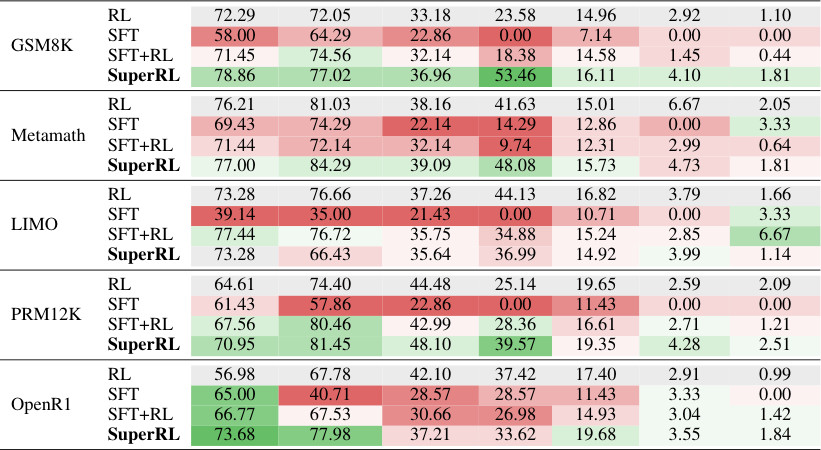
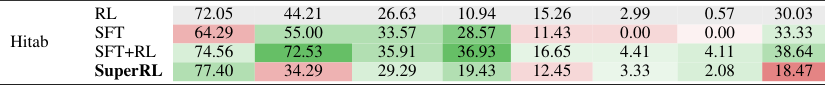
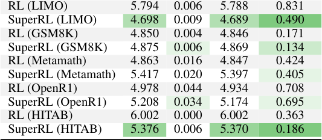
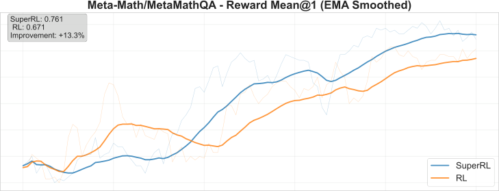
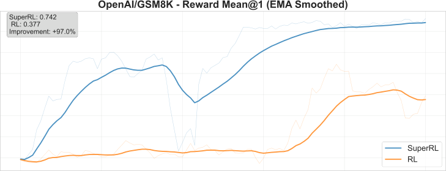

## **SuperRL: Reinforcement Learning with Supervision** **to Boost Language Model Reasoning**

**Yihao Liu** [1] _[∗]_ **Shuocheng Li** [1] _[∗]_ **Lang Cao** [2] _[∗]_ **Yuhang Xie** [1] _[∗]_

**Mengyu Zhou** [3] _[†]_ **Haoyu Dong** [3] **Xiaojun Ma** [3] **Shi Han** [3] **Dongmei Zhang** [3]

1Peking University 2University of Illinois Urbana-Champaign 3Microsoft


**Abstract**


Large language models (LLMs) are increasingly applied to complex reasoning
tasks, where rich high-quality offline data—such as expert-annotated solutions—are
often available. However, standard reinforcement learning (RL) struggles in sparsereward settings and fails to fully leverage offline supervision. We propose SuperRL,
a unified training framework that adaptively switches between RL and supervised
fine-tuning (SFT) . For any data instance where all sampled trajectories yield
zero reward, indicating a lack of gradient signal, SuperRL triggers a fallback
to supervised fine-tuning using high-quality offline data. Experiments across
diverse reasoning benchmarks demonstrate that SuperRL outperforms standard RL,
delivering improved sample efficiency, generalization, and robustness.


Figure 1: Overview of **SuperRL** . SuperRL is a unified training framework that adaptively combines
RL and SFT based on reward signal. During training, for each input, the model samples multiple
rollouts and computes their rewards. If at least one trajectory receives a nonzero reward, standard RL
updates are applied using policy gradients. If all trajectories yield zero reward—indicating an absence
of learning signal—SuperRL falls back to supervised fine-tuning using high-quality demonstrations.


_∗_ Work done during internship at Microsoft.

_†_ Corresponding author (mezho@microsoft.com).


Preprint. Under review.


**1** **Introduction**


LLM reasoning has been studied extensively using lightweight prompting techniques—few-shot
examples, chain-of-thought prompting, and self-consistency heuristics—but such static approaches
can exhibit diminishing returns in more challenging inference scenarios. [1, 2, 3, 4, 5, 6] More recently,
there has been growing interest in leveraging reinforcement learning for "test-time scaling" [7],
empowering models to bolster their reasoning capabilities as they generate outputs. For example,
Deepseek R1 demonstrates that applying Group Relative Policy Optimization (GRPO) to fine-tune
inference trajectories can lead to more robust and flexible reasoning behaviors, all without modifying
the underlying model architecture. [8, 9]


Despite recent progress, online reinforcement learning methods such as PPO and GRPO still face
limitations in reasoning tasks. [8, 10] First, these inherently on-policy methods update exclusively
from trajectories generated by the current policy and therefore struggle to leverage high-quality
offline data—such as human-annotated or distilled reasoning traces—that encode valuable prior
knowledge but lie outside the policy distribution. [11, 12] Second, in sparse-reward environments,
online rollouts seldom produce enough successful trajectories to supply reliable learning signals,
making it difficult to bootstrap coherent reasoning. [13, 14] Ultimately, because offline data provide
numerous successful trajectories with clear guidance while online rollouts frequently fail and offer
little feedback, reinforcement learning struggles to acquire robust reasoning capabilities.


Supervised fine-tuning (SFT) directly leverages offline data with “correct thinking” to teach reliable
reasoning paths but lacks any mechanism to learn from mistakes or negative cases, leading it to
simply memorize positives [15, 16, 17]. In contrast, reinforcement learning (RL) can generalize
by exploring and learning from failed trajectories [17]. While multi-stage SFT + RL—first offline
fine-tuning then on-policy RL as in RLHF [18]—anchors models to sound reasoning and adapts
them under sparse rewards, it suffers catastrophic forgetting of supervised knowledge during RL
and considerable sample and compute inefficiency. [19, 20, 21] These shortcomings motivate tighter
integration—e.g., interleaving or unifying SFT and RL objectives within each update—to preserve
alignment, improve stability, and boost efficiency. However, multi-stage SFT+RL pipelines can
impair generalization by overfitting to offline traces and narrow RL objectives. [19, 20, 21]


To enhance language model reasoning across both dense and sparse reward regimes, we propose
**SuperRL**, a unified training framework that dynamically switches between RL and SFT at the instance
level. For each training input, the model samples multiple rollouts and evaluates their rewards. If
any rollout receives a nonzero reward, policy gradient updates are applied. Otherwise—when all
rollouts fail—SuperRL falls back to SFT on expert demonstrations. This simple yet effective fallback
mechanism allows the model to benefit from high-quality offline data whenever online learning
provides insufficient signal. While online rollouts frequently fail to offer informative supervision,
offline datasets contain abundant successful trajectories that are often underutilized. By adaptively
leveraging these trajectories, SuperRL closes this gap and facilitates more stable and effective learning.
SuperRL is entirely data-driven and achieves strong generalization across reasoning tasks.


**Our main contributions are as follows:**


    - **SFT-guided Reinforcement Learning.** We propose a simple yet powerful mechanism
to integrate SFT signals into the RL process. This hybrid approach enables the model to
fall back on high-quality offline supervision in situations where reward signals are sparse,
delayed, or entirely absent, thereby significantly enhancing the learning signal in complex
reasoning environments.


    - **The SuperRL Framework.** We introduce **SuperRL**, a training framework that dynamically
switches between RL and SFT at the instance level. The switching is guided by reward
feedback, allowing the system to adaptively determine the most appropriate optimization
strategy for each input.


    - **Comprehensive Empirical Validation.** We conduct extensive experiments across multiple
reasoning benchmarks and model scales. Results show that SUPERRL outperforms standard
RL baselines in most settings, yielding consistent gains in sample efficiency, generalization
to out-of-distribution problems, and training stability. Notably, these improvements hold
across both synthetic tasks and real-world language reasoning benchmarks, highlighting the
robustness and practical effectiveness of the proposed framework.


2


**2** **Related Work**


**2.1** **Reasoning with LLMs**


LLMs exhibit impressive knowledge but often struggle with complex reasoning tasks (e.g. multi-step
math or logical problems) without specialized training. Recent research has shown that incorporating
explicit reasoning steps can substantially improve performance. For example, training models to
produce chain-of-thought solutions (step-by-step reasoning) enables better arithmetic and logic
problem solving. [22] In fact, fine-tuning a pretrained LM on detailed quantitative reasoning
demonstrations (as done in Minerva) led to state-of-the-art results on challenging math benchmarks.
These findings underscore that vanilla next-token prediction alone is insufficient for high-level
reasoning; additional fine-tuning or feedback signals are needed to guide LLMs in reasoning processes.
This has driven interest in post-training LLMs specifically for reasoning capabilities, as seen with
recent models like DeepSeek-R1, which explicitly target mathematical reasoning skills [22, 9] .
Such models leverage verifiable rewards (e.g. checking a final answer’s correctness) to refine the
reasoning ability of LLMs, pointing to the need for training paradigms beyond standard supervised
learning. [9, 23]


**2.2** **Reinforcement Learning for LLMs**


Reinforcement learning from human feedback [24]—as popularized by InstructGPT—uses on-policy
methods like PPO to fine-tune language models against a learned reward signal, but doing so requires
costly fresh sampling, a separate value network and careful KL-penalty tuning, and remains sampleinefficient when rewards are asparse. [10, 25, 22] GRPO simplifies PPO by ditching the critic and
computing advantages via within-prompt reward normalization across multiple candidates, yet it
still depends on large volumes of model-generated outputs and can wander from the pre-trained
behavior in low-reward regimes. These limitations—computational overhead, sample inefficiency and
instability under sparse feedback—have spurred interest in leaner or hybrid approaches that retain the
simplicity of policy gradients while injecting external guidance to stabilize and steer training.[8, 22]


However, even with these leaner on-policy variants, sparse-reward reasoning still yields too few
positive signals for stable gradient estimates, leading to stalled or collapsed training [13, 14].


**2.3** **Unifying SFT and RL**


Many methods leverage demonstrations to jump-start reasoning. SFT trains a pre-trained LLM on
prompt–solution pairs (human-written or model-verified), teaching explicit reasoning patterns and
yielding strong baseline performance.[26, 27] However, pure SFT merely imitates its training data:
it cannot exceed the quality or coverage of provided solutions, and gaps in demonstration types or
optimal answers limit its generalization.[17]


Recent research has demonstrated that combining supervised fine-tuning (SFT) with reinforcement
learning (RL) effectively enhances the capabilities of large language models (LLMs). This approach
leverages offline high-quality data to guide initial training and employs reinforcement learning
to further align model outputs with desired behaviors. Notably, several recent works, including
InstructGPT[27], DeepSeek-R1[9] and Qwen3[28], have adopted similar strategies to bolster the
reasoning abilities of LLMs. [9, 28]


Unlike previous approaches that separate RL and SFT into distinct stages, SuperRL treats them
as complementary processes governed by the data itself. It selectively applies offline supervision
only when online rollouts lack useful reward signals—achieving more stable optimization and better
generalization, particularly in tasks where sparse rewards make RL alone unreliable.


**3** **Methodology**


**3.1** **Reward-Guided Loss Selection**


We introduce a simple yet effective principle: when any rollout trajectory yields a nonzero reward, we
apply a standard policy-gradient update to reinforce beneficial behaviors. However, if _all_ trajectories
return zero reward—signifying complete failure—the model instead performs a supervised update


3


using offline demonstrations. This fallback mechanism ensures continuous learning even in the
absence of meaningful reward signals.


Our approach treats the _presence or absence of reward_ as a reliable indicator of learning potential.
Rather than relying on hand-tuned heuristics or reward-density estimators, the rollout outcomes themselves determine whether reinforcement learning (RL) or supervised fine-tuning (SFT) is appropriate.
This design is lightweight, hyperparameter-free, and operates at the per-instance level.


By selectively activating SFT only on challenging examples, the model allocates RL updates to
solvable cases while directing supervision toward failure modes. This dynamic allocation improves
training stability and accelerates convergence. On easier datasets, SFT is rarely triggered; under
sparse-reward regimes, SFT becomes an automatic fail-safe. The result is a unified learning rule that
is both simple and robust—consistently outperforming pure RL across diverse reasoning tasks.


SuperRL embodies this philosophy by integrating RL and SFT into a single reward-aware optimization
loop that dynamically adjusts the training signal based on rollout feedback.


**3.2** **Reward-Gated Optimization in SUPERRL**


**Notation.** For a task instance _x ∈X_ we draw _K_ trajectories ˜ _y_ 1 _, . . .,_ ˜ _yK ∼_ _πθ_ ( _· | x_ ) and obtain
rewards _R_ ( _x,_ ˜ _yk_ ). A demonstration set _Y_ SFT( _x_ ) = _{y_ _[∗]_ [(1)] _, . . ., y_ _[∗]_ [(] _[M]_ [)] _}_ is available for imitation.
Define the advantage and importance ratio


_πθ_ ( _y_ ˜ _k_ _|_ _x_ )
_Ak_ = _R_ ( _x,_ ˜ _yk_ ) _−_ _b_ ( _x_ ) _,_ _rk_ ( _θ_ ) =
_πθ_ old(˜ _yk |_ _x_ ) _[.]_


**Two primitive losses.**


_L_ SFT( _θ_ ; _x_ ) = _−_ [1]

_M_


_L_ PG( _θ_ ; _x_ ) = _−_ [1]

_K_


_M_
� log _πθ_ � _y_ _[∗]_ [(] _[m]_ [)] _| x_ � _,_ (1)


_m_ =1


_K_
� _g_ � _rk_ ( _θ_ ) _, Ak_ � _,_ (2)


_k_ =1


where _g_ ( _·, ·_ ) is any monotone policy-gradient surrogate (e.g. PPO, TRPO, GRPO).


**Reward-based soft gate.** We define a soft gate that checks whether _any_ rollout receives nonzero
reward:
_c_ ( _x_ ) = **1** �max _R_ ( _x,_ ˜ _yk_ ) _>_ 0� (triggered if any rollout succeeds)
_k_


Based on this gate, we define the unified objective:


_LSuperRL_ ( _θ_ ; _x_ ) = (1 _−_ _c_ ( _x_ )) _L_ SFT( _θ_ ; _x_ ) + _c_ ( _x_ ) _L_ PG( _θ_ ; _x_ )


If every rollout fails ( _c_ ( _x_ ) = 0), the model performs supervised imitation using demonstrations; otherwise, it reinforces successful behaviors via policy gradients. This hyperparameter-free switch tightly
couples exploration and imitation, providing stable and sample-efficient learning that outperforms
pure RL across both dense- and sparse-reward reasoning tasks.


**3.3** **Design Variants and Unified Hybrid Objective**


The hard switch in Eq. (3.2) forces every instance to be handled by _either_ supervised imitation
or policy gradients. We explore two relaxations that keep the notation of Sec. 3.2—namely
_Ak, rk, g_ ( _·, ·_ )—while softening the coupling between the two learning signals.


**Advantage-based soft gate.** We define an alternative binary gate that triggers RL only if _at least_
_one_ trajectory has a strictly positive advantage:


_cA_ ( _x_ ) = **1** �max _Ak >_ 0� (triggered if any rollout outperforms the baseline)
_k_


4


The resulting loss is:


_L_ AdvGate( _θ_ ; _x_ ) = (1 _−_ _cA_ ( _x_ )) _L_ SFT( _θ_ ; _x_ ) + _cA_ ( _x_ ) _L_ PG( _θ_ ; _x_ ) (1)


Unlike the original SUPERRL switch, which triggers RL updates whenever any rollout yields a
nonzero _raw_ reward, the advantage-based gate examines whether any trajectory yields a strictly
_positive advantage_ —that is, outperforms a learned baseline _b_ ( _x_ ). This makes it more selective:
dense but uninformative reward patterns (e.g., constant shaping terms) are often cancelled out by
the baseline, resulting in _Ak_ = 0 and thus closing the gate. Even when raw rewards are nonzero,
the update may fall back to SFT if no genuine improvement is detected. This design prevents
futile RL updates on deceptively positive but sub-optimal trajectories and is particularly effective in
sparse-reward settings with frequent shaping noise or misleading reward signals.


**Uncertainty-weighted hybrid fusion.** A fully continuous alternative removes the binary gate and
learns how much to trust each loss through two log-variance scalars _σ_ pg and _σ_ sft:


_L_ Hybrid( _θ_ ) = _e_ _[−]_ [2] _[σ]_ [pg] _L_ PG( _θ_ ) + _e_ _[−]_ [2] _[σ]_ [sft] _L_ SFT( _θ_ ) + _σ_ pg + _σ_ sft (2)


where _L_ PG may be instantiated by PPO, TRPO, or GRPO. Demonstration and on-policy batches
are mixed within every update; the learned variances down-weight noisy gradients yet the additive
_σ_ -terms stop either branch from collapsing to zero. During training, we interleave high-quality
demonstrations with roll-outs in each mini-batch. The two uncertainty parameters adaptively balance
signal quality without any explicit switching rule: noisy or unstable gradients are automatically
suppressed by the factors _e_ _[−]_ [2] _[σ]_, while the additive _σ_ penalties prevent the model from becoming
overconfident.


Equation (1) preserves the hyperparameter-free spirit of the original gate while being more selective;
Eq. (2) offers a differentiable, learnable fusion at the cost of two extra parameters.


**4** **Experiments**


**4.1** **Experimental Setup**


We evaluate SuperRL across a diverse suite of reasoning benchmarks that vary in structure, difficulty,
and reward sparsity. Our evaluation spans both _dense-reward tasks_ (e.g., GSM8K, METAMATH) and
_sparse-reward tasks_ (e.g., OPENR1, PRM12K). In all settings, SuperRL consistently outperforms
strong baselines, including pure RL and the conventional two-stage SFT+RL pipeline.


In dense regimes, SuperRL performs comparably or better than RL, suggesting that the SFT fallback
is rarely triggered and thus incurs no degradation. In sparse regimes, where rollouts frequently fail,
SuperRL activates its supervised fallback, leading to significant gains in success rate, generalization,
and training stability.


To gain deeper insights into training dynamics, we track the proportion of samples that trigger RL
versus SFT over time. On sparse tasks, SFT is used frequently at the beginning to bootstrap learning
and is phased out as the policy improves. In contrast, dense tasks rarely invoke SFT. This per-instance
adaptivity balances exploration and supervision effectively, reducing KL divergence variance and
promoting stable optimization.


We further ablate several design variants: (1) _Advantage-based gating_, which replaces rewardchecking with advantage-checking; (2) _Hybrid-Log-Sigma_, which softly blends RL and SFT losses
using learned uncertainty weights; and (3) _Fixed-schedule hybrids_ with manually tuned schedules.
Although these variants yield some improvements over naïve RL, they require extra tuning or
introduce rigidity. In contrast, SuperRL offers a simple, hyperparameter-free, and plug-and-play
switching mechanism that delivers stronger and more stable performance.


**4.2** **Cross-Dataset Generalization Analysis**


**Key Observations** Across the 5 _×_ 7 = 35 pairs in Table 1, **SuperRL** improves upon _RL_ in **24** cases,
is worse in 10, and ties once. [3] Gains are largest when the _source_ dataset itself supplies either dense


3A cell is counted as an improvement when the SuperRL entry strictly exceeds the corresponding RL entry.


5


Table 1: Cross-dataset generalization accuracy (%) of different training methods. Each row block
corresponds to a model trained on a specific dataset (e.g., GSM8K, Metamath, etc.), while columns
report the zero-shot accuracy on various held-out test sets. The baseline ( _Vanilla RL_ ) performance is
shown in the first row of each block and shaded in gray. Colored cells indicate the relative change
compared to this baseline: green for improvement and red for degradation, with darker shades
representing larger absolute differences. This visualization highlights the generalization patterns of
each training method across diverse reasoning tasks.


**Training** **Method** **GSM8K** **Metamath** **PRM12K** **LIMO** **OpenR1** **AIME24** **AIME25**


Table 2: Cross-dataset test accuracy (%) of models trained on **Hitab** dataset. Colors indicate change
relative to _RL_ (top row): green = higher accuracy, red = lower accuracy; deeper shades reflect larger
deltas.


**Training** **Method** **GSM8K** **Metamath** **PRM12K** **LIMO** **OpenR1** **AIME24** **AIME25** **Hitab**


rewards (e.g., GSM8K, METAMATH) or moderately sparse but still informative feedback (PRM12K,
OPENR1). In these settings, reward–gated switching allows exploration-driven RL updates while still
injecting high-quality supervision on difficult examples, yielding improvements of up to **+29.9 pp** .


**Insights from LIMO** When trained on LIMO, SuperRL underperforms RL—a divergence attributable to both the dataset’s limited size and its deliberate construction. Specifically, LIMO
contains only 817 examples, all manually filtered to emphasize high reasoning complexity. This
results in sparse rewards and low pattern diversity: successful trajectories are few and narrowly
distributed. In such settings, RL can overfit to these recurring patterns, achieving higher in-domain
accuracy. However, SuperRL’s fallback to SFT introduces broader—but diffuse—supervision that
struggles to provide useful learning signals when data is both scarce and hard. Consequently, SuperRL
cannot effectively learn from LIMO alone. Nevertheless, SuperRL demonstrates strong generalization
despite its poor in-domain performance. When trained on more diverse and densely supervised
datasets such as GSM8K, it achieves surprisingly strong results on LIMO and other hard transfer
benchmarks. This contrast highlights the critical role of training data: it not only affirms the limitations of LIMO’s narrow construction but also reinforces SuperRL’s ability to generalize when given
sufficient and well-distributed supervision. The findings suggest that the model’s underperformance
is more reflective of dataset-specific bottlenecks than of architectural limitations.


6







Table 3: Entropy statistics of RL and SuperRL across datasets. Green cells indicate improvements
over RL (i.e., lower entropy), with darker shades representing greater reductions.


**Method & Dataset** **Max** **Min** **Range** **Variance**


Results in Table 2 show a clear contrast with earlier trends: the two-stage _SFT+RL_ achieves the
best performance on HITAB, while SuperRL falls behind even vanilla RL. HITAB is a challenging,
cross-domain benchmark focused on table reasoning, where rewards are binary and high-quality
demonstrations—collected via DeepSeek R1 distillation and RFT-style sampling—are abundant. In
this setting, a dedicated SFT phase proves critical: it allows the model to absorb diverse, domainspecific reasoning patterns before engaging in exploration. SuperRL, by contrast, switches prematurely to RL as soon as a single successful trajectory is found, which may truncate the supervision
phase too early and miss the chance to learn stable table reasoning heuristics. This issue is especially
pronounced in cross-domain settings like HITAB, where general reasoning strategies learned via
minimal supervision may not transfer well. Nevertheless, SuperRL still exhibits strong generalization
ability across datasets. Despite its underperformance on HITAB, it maintains competitive transfer
performance on other challenging benchmarks—highlighting that its fallback supervision discourages
brittle memorization and fosters more broadly applicable reasoning strategies.


**Practical take-aways.**


    - **Reward-gated switching is generally effective** : it provides a plug-and-play improvement
over RL with no extra hyperparameters in most transfer scenarios.


    - **Dataset properties matter** : highly filtered, ultra-sparse sources such as LIMO may require
additional stabilisation; heterogeneous, demonstration-rich benchmarks such as Hitab benefit
from longer SFT exposure.


    - **Future work** : learn a data-driven gating schedule that adapts to both reward sparsity and
demonstration density, thereby unifying the advantages of SuperRL and two-stage SFT+RL.


**4.3** **Adaptive Behaviors During Training**


Beyond accuracy and generalization, we also assess SuperRL in terms of training stability and
computational cost. These dimensions are critical for real-world deployment, especially in settings
where reward sparsity and rollout variance can induce unstable gradients and excessive tuning
overhead.


**Entropy Stabilization Patterns.** To evaluate training stability, we analyze the entropy statistics of
RL and SuperRL across multiple datasets, as shown in Table 3. Entropy quantifies the uncertainty of
the policy during exploration; high variance or wide ranges often indicate unstable updates, while
excessively low entropy can suppress exploration. A well-calibrated entropy profile reflects both
stable learning and sufficient exploration capacity.


Across most datasets, SuperRL achieves a meaningful reduction in entropy variance and range
compared to vanilla RL, suggesting more stable and controlled optimization. For instance, in
GSM8K and METAMATH, SuperRL consistently narrows the entropy range and lowers the variance,
leading to smoother convergence without sacrificing exploration. These improvements reflect the
benefit of selectively falling back to supervised fine-tuning in failure cases.


7





|Me<br>60 LI<br>50<br>40<br>30<br>20<br>10<br>A1 vg.4<br>0 Act|Me|tamath|Col4|60.0|Col6|
|---|---|---|---|---|---|
|Avg Act<br>0<br>10<br>20<br>30<br>40<br>50<br>60<br>1.4<br>Me<br>~~LI~~|~~LI~~|~~MO~~||||
|Avg Act<br>0<br>10<br>20<br>30<br>40<br>50<br>60<br>1.4<br>Me<br>~~LI~~||||||
|Avg Act<br>0<br>10<br>20<br>30<br>40<br>50<br>60<br>1.4<br>Me<br>~~LI~~||~~181~~|~~28.0~~|||
|Avg Act<br>0<br>10<br>20<br>30<br>40<br>50<br>60<br>1.4<br>Me<br>~~LI~~||ivation<br>Avg<br>~~.~~<br>3.9|Interval<br>Activ<br><br>5.8|Interval<br>Activ<br><br>5.8|Interval<br>Activ<br><br>5.8|


|100 94 Metamath<br>LIMO<br>81 oun<br>80<br>on<br>60<br>va<br>40 33 31 c<br>20<br>12<br>4 0 0 1 8 1 7<br>0 099 0199 0299 0399 0499 0599<br>- 10 - 20 - 30 - 40 - 50 -<br>Trainin Ste Ran e|Col2|94|Col4|Col5|Col6|Col7|Metam|ath|
|---|---|---|---|---|---|---|---|---|
|0-99<br>100-199<br>200-299<br>300-399<br>400-499<br>500-599<br>Trainin Ste Rane<br>0<br>20<br>40<br>60<br>80<br>100<br> cvaon oun<br>33<br>~~94~~<br>4<br>81<br>0<br>31<br>0<br>12<br>1<br>8<br>1<br>7<br>~~Metamath~~<br>LIMO||81|81||||LIMO||
|0-99<br>100-199<br>200-299<br>300-399<br>400-499<br>500-599<br>Trainin Ste Rane<br>0<br>20<br>40<br>60<br>80<br>100<br> cvaon oun<br>33<br>~~94~~<br>4<br>81<br>0<br>31<br>0<br>12<br>1<br>8<br>1<br>7<br>~~Metamath~~<br>LIMO|||||||||
|0-99<br>100-199<br>200-299<br>300-399<br>400-499<br>500-599<br>Trainin Ste Rane<br>0<br>20<br>40<br>60<br>80<br>100<br> cvaon oun<br>33<br>~~94~~<br>4<br>81<br>0<br>31<br>0<br>12<br>1<br>8<br>1<br>7<br>~~Metamath~~<br>LIMO|||||||||


Figure 2: **Analysis of SFT Activation Patterns and Efficiency. Left:** The histogram shows the
count of supervised fine-tuning (SFT) activations per 100 training steps for two datasets: _Metamath_
and _LIMO_ . Most SFT activations in both cases occur in the early phase of training (0–100 steps),
with _LIMO_ exhibiting a denser activation pattern overall. **Right:** A comparison of SFT activation
efficiency metrics across datasets. _LIMO_ shows longer average activation lengths, shorter intervals
between activations, and a higher activation density (segments with SFT triggered per 500 steps),
indicating more frequent and sustained reliance on SFT throughout training.


However, on LIMO and HITAB, we observe an over-suppression of entropy dynamics: while
SuperRL lowers the entropy variance (e.g., from 0 _._ 831 to 0 _._ 490 on LIMO), it also curtails the range
and maximum entropy to a degree that may hinder sufficient exploration. This suggests that frequent
fallback to SFT may anchor the policy too tightly to demonstrative behaviors, limiting the diversity
of trajectories explored. Consequently, the model may prematurely exploit suboptimal behaviors,
leading to diminished performance on exploration-heavy tasks.


These findings highlight that entropy stabilization is a double-edged sword: while reducing variance
helps avoid erratic learning, overly dampened entropy signals can impair policy expressiveness.
SuperRL performs best when the fallback mechanism maintains a dynamic balance between policy
stability and exploratory diversity. In aggregate, its adaptive optimization strategy yields more reliable
convergence across diverse reward landscapes, though careful tuning may be necessary to avoid
under-exploration in sparse regimes.


**SFT Trigger Patterns.** We observe notable differences in how frequently and efficiently supervised
fine-tuning (SFT) is triggered across datasets. As shown in Figure 2, _LIMO_ triggers SFT much more
frequently than _Metamath_, especially in the early stages of training (0–100 steps), suggesting that it
encounters a higher proportion of hard instances requiring fallback supervision. Additionally, the
right panel highlights that _LIMO_ exhibits longer average SFT activation lengths and denser activation
patterns, with shorter intervals between activations. These trends imply that the model struggles
to sustain reward-guided learning for longer stretches and must rely more consistently on offline
signals. In contrast, _Metamath_ shows more sparsely distributed SFT usage, indicating more stable or
successful online exploration with less dependence on supervised corrections once initial learning
has occurred.


Importantly, across both datasets, we observe a consistent trend: the reliance on SFT signals decreases
as training progresses. This pattern highlights the adaptive nature of our method—SFT is heavily
used in early stages to guide learning when the model lacks competency, but gradually fades out as
the policy improves and the model learns to solve problems correctly on its own. This transition
reflects a shift from supervision-driven learning to reward-driven generalization, demonstrating the
effectiveness of our hybrid training framework.


Table 4 provides a quantitative summary of average scores and SFT fallback usage across datasets. A
clear negative correlation emerges between the SuperRL average score and total SFT trigger count
( _r_ = _−_ 0 _._ 86, _p_ = 0 _._ 028 _<_ 0 _._ 05), suggesting that fallback is most critical on tasks where standard RL
struggles to achieve high scores. This trend is even more pronounced when comparing score gains:
in datasets with high SFT fallback (e.g., PRM12K, OPENR1), SuperRL significantly outperforms


8


Table 4: Average score and SFT-triggered update count during training. Higher SFT usage correlates
with harder tasks and greater gains in average score.


**Dataset** **RL Score** **SuperRL Score** **SFT Trigger Count**


OpenR1 0.526 0.619 728
PRM12K 0.268 0.590 484

HITAB 0.645 0.665 270

LIMO 0.500 0.688 247

Metamath 0.715 0.700 40

GSM8K 0.687 0.758 19


RL. Conversely, in easier datasets like GSM8K or METAMATH, where scores are relatively high and
SFT is rarely needed, the margin is small or even reversed.


This analysis underscores the adaptive value of SuperRL’s fallback mechanism. When RL alone
fails to make progress—either due to sparse rewards or brittle dynamics—SFT provides essential
guidance. Rather than rely on static supervision, SuperRL selectively triggers imitation based on
rollout outcomes, offering a robust and flexible solution for navigating varying task difficulty. The
heterogeneous SFT usage patterns thus reflect not only task complexity but also the system’s capacity
to maintain learning momentum across regimes.


Interestingly, when analyzing the relationship between RL average score and SFT trigger count,
we observe a similar but weaker negative correlation ( _r_ = _−_ 0 _._ 64, _p ≈_ 0 _._ 171). While the trend
aligns with the intuition that lower RL performance invites more SFT fallback, the lack of statistical
significance suggests that raw RL scores alone are not as strong a predictor of fallback reliance. This
is likely because SuperRL selectively invokes SFT based on rollout success rather than static task
characteristics—meaning that even if RL achieves moderately good average scores on some tasks, it
may still benefit from occasional fallback in rare failure cases.


In contrast, the SuperRL score shows a much stronger and statistically significant correlation with
SFT usage, reinforcing the idea that SuperRL dynamically calibrates its reliance on supervision to
support progress where RL plateaus. Taken together, these results highlight that SFT fallback not only
enhances performance but also reflects the model’s internal learning difficulty, offering a principled
mechanism to bridge the gap between exploration and convergence.


**4.4** **Hybrid Variants and Insights**


We conclude by comparing SuperRL with two hybrid variants — _Hybrid-Advantage-Gated_ and
_Hybrid-Log-Sigma_, each relaxing the original reward-gated switch in different ways. Table 5 presents
the cross-dataset generalization performance under consistent training datasets.


**SuperRL Outperforms in the Majority.** Despite its localized shortcomings on LIMO and HITAB,
**SuperRL consistently outperforms both Hybrid-Adv-Gated and Hybrid-Log-Sigma in the vast**
**majority of settings** . As shown in Table 5, SuperRL achieves higher or equal accuracy in 28 out
of 42 train-test pairs compared to the advantage-gated variant, and dominates the uncertainty-based
hybrid in nearly every case. This pattern holds especially true when the training dataset offers a
reasonable mix of reward sparsity and demonstration richness—conditions under which SuperRL’s
reward-gated fallback efficiently balances exploration and imitation.


These results reaffirm the core design philosophy behind SuperRL: by using a simple, deterministic
switch based on actual rollout outcomes, it avoids overfitting to noisy shaping signals while also
bypassing the need for complex auxiliary mechanisms. In contrast, advantage-based gating introduces
extra learning dynamics that may require careful calibration, while soft blending with uncertainty
weights often leads to instability or underperformance. The empirical gap across datasets highlights that SuperRL’s binary gating mechanism—though minimal—is highly effective and broadly
applicable.


**When SuperRL Falls Behind: The Case of LIMO and HITAB.** While SuperRL generally
achieves strong generalization across diverse benchmarks, two notable exceptions emerge: LIMO


9


**Training Set** **Method** **GSM8K Metamath PRM12K LIMO OpenR1 AIME2024 AIME2025**


SuperRL 78.86 77.02 36.96 53.46 16.11 4.10 1.81
GSM8K Adv-Gated 76.43 77.93 37.48 34.73 15.50 3.46 2.20

Log-Sigma 73.88 52.72 37.60 24.18 14.29 2.95 1.22


SuperRL 77.00 84.29 39.09 48.08 15.73 4.73 1.81
Metamath Adv-Gated 74.77 84.29 38.26 43.27 15.86 4.21 2.87

Log-Sigma 71.95 77.71 32.60 14.80 14.21 2.50 1.02


SuperRL 73.28 66.43 35.64 36.99 14.92 3.99 1.14
LIMO Adv-Gated 71.20 77.39 36.98 37.54 15.24 4.63 6.67

Log-Sigma 70.55 71.86 34.21 28.96 14.66 3.63 2.36


SuperRL 70.95 81.45 48.10 39.57 19.35 4.28 2.51
PRM12K Adv-Gated 74.90 81.18 51.00 40.87 20.17 2.26 2.11

Log-Sigma 60.97 46.98 42.94 18.06 15.87 1.51 1.86


SuperRL 73.68 77.98 37.21 33.62 19.68 3.55 1.84
OpenR1 Adv-Gated 14.28 29.61 28.57 14.11 10.23 0.56 0.74
Log-Sigma 10.40 27.18 27.53 14.29 12.18 0.18 1.42


SuperRL 77.40 34.29 29.29 19.43 12.45 3.33 2.08
Hitab Adv-Gated 78.09 38.62 29.29 9.76 13.51 5.54 0.64

Log-Sigma 61.08 27.48 29.02 15.78 12.18 3.05 1.09

Table 5: Cross-dataset test accuracy (%) of SuperRL and its variants. Adv-Gated uses advantagebased gating; Log-Sigma softly blends RL and SFT losses with uncertainty-weighted averaging.
Color indicates delta relative to SuperRL: green = higher, red = lower.


and HITAB. In both cases, the _Advantage-Gated_ variant surpasses SuperRL, suggesting specific
regimes where reward-gated switching may be less effective.


In LIMO, the dataset is both small in size (817 samples) and manually curated for high reasoning
difficulty, resulting in extremely sparse rewards and low structural diversity. Under such conditions,
SuperRL’s reward-based gate may be too permissive—deeming trajectories with minimal reward
as successful, thereby deactivating the fallback to supervision prematurely. The _Advantage-Gated_
method, which relies on learned advantage signals, is more selective: it delays the switch until a
trajectory meaningfully improves over the baseline. This added caution helps preserve supervision
longer during early training, which proves crucial when reward signals are misleading or insufficient
for exploration.


In HITAB, the situation is different but equally revealing. Hitab focuses on table-based reasoning,
which presents a different set of challenges compared to math word problems or symbolic reasoning.
Furthermore, the dataset is constructed via distillation from DeepSeek R1 followed by RFT-style
filtering, resulting in trajectories that reflect model-like patterns rather than diverse human logic. In
this context, SuperRL’s reward-triggered switching can be overly aggressive: once it detects any
success signal—even if superficial—it disables the SFT path, missing the opportunity to deeply
absorb structured table reasoning heuristics. On the other hand, the _Advantage-Gated_ approach defers
the switch until the learned advantage becomes significant, thus sustaining supervision longer and
capturing the domain-specific inductive biases required for table reasoning.


**Interpretation and Value of Reward-Gated Switching.** These failure cases highlight an important
limitation: although reward-based gating is efficient and principled in most reasoning tasks, it may
struggle when (i) reward signals are noisy and overly sparse (e.g., LIMO), or (ii) task structure
demands more sustained exposure to supervision (e.g., table-based reasoning in HITAB).


Nevertheless, SuperRL remains highly competitive overall. Its performance on other hard benchmarks—especially when trained on more general-purpose datasets like GSM8K or PRM12K—shows
that the reward-gated fallback mechanism is effective in dynamically routing learning signals based
on rollout success, without the need for extra models or hyperparameters.


10


**Takeaway.** While _Advantage-Gated_ may outperform in specific scenarios like LIMO and HITAB,
SuperRL offers a broadly applicable, plug-and-play strategy that delivers reliable performance across
varied reasoning domains. Future work may explore combining reward- and advantage-based signals
or developing more domain-aware switching strategies—but the current design already strikes a
strong balance between stability, adaptability, and simplicity.


**5** **Conclusion**


We present SuperRL, a unified training framework that adaptively combines supervised and reinforcement signals to improve reasoning under both dense and sparse rewards. Experiments show
that SuperRL achieves superior performance, stability, and generalization across diverse reasoning
benchmarks. Limitations and future work are discussed in Appendix A.


11


**References**


[1] Jason Wei, Xuezhi Wang, Dale Schuurmans, Maarten Bosma, Fei Xia, Ed Chi, Quoc V Le,
Denny Zhou, et al. Chain-of-thought prompting elicits reasoning in large language models.
_Advances in neural information processing systems_, 35:24824–24837, 2022.


[2] Xuezhi Wang, Jason Wei, Dale Schuurmans, Quoc Le, Ed Chi, Sharan Narang, Aakanksha
Chowdhery, and Denny Zhou. Self-consistency improves chain of thought reasoning in language
models. _arXiv preprint arXiv:2203.11171_, 2022.


[3] Tom Brown, Benjamin Mann, Nick Ryder, Melanie Subbiah, Jared D Kaplan, Prafulla Dhariwal,
Arvind Neelakantan, Pranav Shyam, Girish Sastry, Amanda Askell, et al. Language models are
few-shot learners. _Advances in neural information processing systems_, 33:1877–1901, 2020.


[4] Boshi Wang, Sewon Min, Xiang Deng, Jiaming Shen, You Wu, Luke Zettlemoyer, and Huan
Sun. Towards understanding chain-of-thought prompting: An empirical study of what matters.
_arXiv preprint arXiv:2212.10001_, 2022.


[5] Zhuosheng Zhang, Aston Zhang, Mu Li, and Alex Smola. Automatic chain of thought prompting
in large language models. _arXiv preprint arXiv:2210.03493_, 2022.


[6] Lang Cao. Graphreason: Enhancing reasoning capabilities of large language models through a
graph-based verification approach. _arXiv preprint arXiv:2308.09267_, 2023.


[7] Qiyuan Zhang, Fuyuan Lyu, Zexu Sun, Lei Wang, Weixu Zhang, Wenyue Hua, Haolun Wu,
Zhihan Guo, Yufei Wang, Niklas Muennighoff, Irwin King, Xue Liu, and Chen Ma. A survey
on test-time scaling in large language models: What, how, where, and how well?, 2025.


[8] Zhihong Shao, Peiyi Wang, Qihao Zhu, Runxin Xu, Junxiao Song, Xiao Bi, Haowei Zhang,
Mingchuan Zhang, YK Li, Y Wu, et al. Deepseekmath: Pushing the limits of mathematical
reasoning in open language models. _arXiv preprint arXiv:2402.03300_, 2024.


[9] DeepSeek-AI, Daya Guo, Dejian Yang, Haowei Zhang, Junxiao Song, Ruoyu Zhang, Runxin
Xu, Qihao Zhu, Shirong Ma, Peiyi Wang, Xiao Bi, Xiaokang Zhang, Xingkai Yu, Yu Wu,
Z. F. Wu, Zhibin Gou, Zhihong Shao, Zhuoshu Li, Ziyi Gao, Aixin Liu, Bing Xue, Bingxuan
Wang, Bochao Wu, Bei Feng, Chengda Lu, Chenggang Zhao, Chengqi Deng, Chenyu Zhang,
Chong Ruan, Damai Dai, Deli Chen, Dongjie Ji, Erhang Li, Fangyun Lin, Fucong Dai, Fuli
Luo, Guangbo Hao, Guanting Chen, Guowei Li, H. Zhang, Han Bao, Hanwei Xu, Haocheng
Wang, Honghui Ding, Huajian Xin, Huazuo Gao, Hui Qu, Hui Li, Jianzhong Guo, Jiashi Li,
Jiawei Wang, Jingchang Chen, Jingyang Yuan, Junjie Qiu, Junlong Li, J. L. Cai, Jiaqi Ni, Jian
Liang, Jin Chen, Kai Dong, Kai Hu, Kaige Gao, Kang Guan, Kexin Huang, Kuai Yu, Lean
Wang, Lecong Zhang, Liang Zhao, Litong Wang, Liyue Zhang, Lei Xu, Leyi Xia, Mingchuan
Zhang, Minghua Zhang, Minghui Tang, Meng Li, Miaojun Wang, Mingming Li, Ning Tian,
Panpan Huang, Peng Zhang, Qiancheng Wang, Qinyu Chen, Qiushi Du, Ruiqi Ge, Ruisong
Zhang, Ruizhe Pan, Runji Wang, R. J. Chen, R. L. Jin, Ruyi Chen, Shanghao Lu, Shangyan
Zhou, Shanhuang Chen, Shengfeng Ye, Shiyu Wang, Shuiping Yu, Shunfeng Zhou, Shuting
Pan, S. S. Li, Shuang Zhou, Shaoqing Wu, Shengfeng Ye, Tao Yun, Tian Pei, Tianyu Sun,
T. Wang, Wangding Zeng, Wanjia Zhao, Wen Liu, Wenfeng Liang, Wenjun Gao, Wenqin Yu,
Wentao Zhang, W. L. Xiao, Wei An, Xiaodong Liu, Xiaohan Wang, Xiaokang Chen, Xiaotao
Nie, Xin Cheng, Xin Liu, Xin Xie, Xingchao Liu, Xinyu Yang, Xinyuan Li, Xuecheng Su,
Xuheng Lin, X. Q. Li, Xiangyue Jin, Xiaojin Shen, Xiaosha Chen, Xiaowen Sun, Xiaoxiang
Wang, Xinnan Song, Xinyi Zhou, Xianzu Wang, Xinxia Shan, Y. K. Li, Y. Q. Wang, Y. X.
Wei, Yang Zhang, Yanhong Xu, Yao Li, Yao Zhao, Yaofeng Sun, Yaohui Wang, Yi Yu, Yichao
Zhang, Yifan Shi, Yiliang Xiong, Ying He, Yishi Piao, Yisong Wang, Yixuan Tan, Yiyang
Ma, Yiyuan Liu, Yongqiang Guo, Yuan Ou, Yuduan Wang, Yue Gong, Yuheng Zou, Yujia He,
Yunfan Xiong, Yuxiang Luo, Yuxiang You, Yuxuan Liu, Yuyang Zhou, Y. X. Zhu, Yanhong
Xu, Yanping Huang, Yaohui Li, Yi Zheng, Yuchen Zhu, Yunxian Ma, Ying Tang, Yukun Zha,
Yuting Yan, Z. Z. Ren, Zehui Ren, Zhangli Sha, Zhe Fu, Zhean Xu, Zhenda Xie, Zhengyan
Zhang, Zhewen Hao, Zhicheng Ma, Zhigang Yan, Zhiyu Wu, Zihui Gu, Zijia Zhu, Zijun Liu,
Zilin Li, Ziwei Xie, Ziyang Song, Zizheng Pan, Zhen Huang, Zhipeng Xu, Zhongyu Zhang,
and Zhen Zhang. Deepseek-r1: Incentivizing reasoning capability in llms via reinforcement
learning, 2025.


[10] John Schulman, Filip Wolski, Prafulla Dhariwal, Alec Radford, and Oleg Klimov. Proximal
policy optimization algorithms, 2017.


12


[11] Sergey Levine, Aviral Kumar, George Tucker, and Justin Fu. Offline reinforcement learning:
Tutorial, review, and perspectives on open problems, 2020.


[12] Scott Fujimoto, David Meger, and Doina Precup. Off-policy deep reinforcement learning
without exploration, 2019.


[13] Marcin Andrychowicz, Filip Wolski, Alex Ray, Jonas Schneider, Rachel Fong, Peter Welinder,
Bob McGrew, Josh Tobin, Pieter Abbeel, and Wojciech Zaremba. Hindsight experience replay,
2018.


[14] Adrien Ecoffet, Joost Huizinga, Joel Lehman, Kenneth O. Stanley, and Jeff Clune. Go-explore:
a new approach for hard-exploration problems, 2021.


[15] Jason Wei, Maarten Bosma, Vincent Y. Zhao, Kelvin Guu, Adams Wei Yu, Brian Lester, Nan
Du, Andrew M. Dai, and Quoc V. Le. Finetuned language models are zero-shot learners, 2022.


[16] Victor Sanh, Albert Webson, Colin Raffel, Stephen H. Bach, Lintang Sutawika, Zaid Alyafeai,
Antoine Chaffin, Arnaud Stiegler, Teven Le Scao, Arun Raja, Manan Dey, M Saiful Bari,
Canwen Xu, Urmish Thakker, Shanya Sharma Sharma, Eliza Szczechla, Taewoon Kim, Gunjan
Chhablani, Nihal Nayak, Debajyoti Datta, Jonathan Chang, Mike Tian-Jian Jiang, Han Wang,
Matteo Manica, Sheng Shen, Zheng Xin Yong, Harshit Pandey, Rachel Bawden, Thomas Wang,
Trishala Neeraj, Jos Rozen, Abheesht Sharma, Andrea Santilli, Thibault Fevry, Jason Alan Fries,
Ryan Teehan, Tali Bers, Stella Biderman, Leo Gao, Thomas Wolf, and Alexander M. Rush.
Multitask prompted training enables zero-shot task generalization, 2022.


[17] Tianzhe Chu, Yuexiang Zhai, Jihan Yang, Shengbang Tong, Saining Xie, Dale Schuurmans,
Quoc V. Le, Sergey Levine, and Yi Ma. Sft memorizes, rl generalizes: A comparative study of
foundation model post-training, 2025.


[18] Daniel M. Ziegler, Nisan Stiennon, Jeffrey Wu, Tom B. Brown, Alec Radford, Dario Amodei,
Paul Christiano, and Geoffrey Irving. Fine-tuning language models from human preferences,
2020.


[19] Yun Luo, Zhen Yang, Fandong Meng, Yafu Li, Jie Zhou, and Yue Zhang. An empirical study of
catastrophic forgetting in large language models during continual fine-tuning, 2025.


[20] Suhas Kotha, Jacob Mitchell Springer, and Aditi Raghunathan. Understanding catastrophic
forgetting in language models via implicit inference, 2024.


[21] Heshan Fernando, Han Shen, Parikshit Ram, Yi Zhou, Horst Samulowitz, Nathalie Baracaldo,
and Tianyi Chen. Mitigating forgetting in llm supervised fine-tuning and preference learning,
2025.


[22] Wei Xiong, Jiarui Yao, Yuhui Xu, Bo Pang, Lei Wang, Doyen Sahoo, Junnan Li, Nan Jiang,
Tong Zhang, Caiming Xiong, and Hanze Dong. A minimalist approach to llm reasoning: from
rejection sampling to reinforce, 2025.


[23] Youssef Mroueh. Reinforcement learning with verifiable rewards: Grpo’s effective loss, dynamics, and success amplification, 2025.


[24] Hanze Dong, Wei Xiong, Bo Pang, Haoxiang Wang, Han Zhao, Yingbo Zhou, Nan Jiang, Doyen
Sahoo, Caiming Xiong, and Tong Zhang. Rlhf workflow: From reward modeling to online rlhf,
2024.


[25] Douglas C. Crowder, Darrien M. McKenzie, Matthew L. Trappett, and Frances S. Chance.
Hindsight experience replay accelerates proximal policy optimization, 2024.


[26] Liang Wen, Yunke Cai, Fenrui Xiao, Xin He, Qi An, Zhenyu Duan, Yimin Du, Junchen Liu,
Lifu Tang, Xiaowei Lv, Haosheng Zou, Yongchao Deng, Shousheng Jia, and Xiangzheng Zhang.
Light-r1: Curriculum sft, dpo and rl for long cot from scratch and beyond, 2025.


[27] Long Ouyang, Jeff Wu, Xu Jiang, Diogo Almeida, Carroll L. Wainwright, Pamela Mishkin,
Chong Zhang, Sandhini Agarwal, Katarina Slama, Alex Ray, John Schulman, Jacob Hilton,
Fraser Kelton, Luke Miller, Maddie Simens, Amanda Askell, Peter Welinder, Paul Christiano,
Jan Leike, and Ryan Lowe. Training language models to follow instructions with human
feedback, 2022.


[28] An Yang, Anfeng Li, Baosong Yang, Beichen Zhang, Binyuan Hui, Bo Zheng, Bowen Yu,
Chang Gao, Chengen Huang, Chenxu Lv, Chujie Zheng, Dayiheng Liu, Fan Zhou, Fei Huang,
Feng Hu, Hao Ge, Haoran Wei, Huan Lin, Jialong Tang, Jian Yang, Jianhong Tu, Jianwei Zhang,


13


Jianxin Yang, Jiaxi Yang, Jing Zhou, Jingren Zhou, Junyang Lin, Kai Dang, Keqin Bao, Kexin
Yang, Le Yu, Lianghao Deng, Mei Li, Mingfeng Xue, Mingze Li, Pei Zhang, Peng Wang, Qin
Zhu, Rui Men, Ruize Gao, Shixuan Liu, Shuang Luo, Tianhao Li, Tianyi Tang, Wenbiao Yin,
Xingzhang Ren, Xinyu Wang, Xinyu Zhang, Xuancheng Ren, Yang Fan, Yang Su, Yichang
Zhang, Yinger Zhang, Yu Wan, Yuqiong Liu, Zekun Wang, Zeyu Cui, Zhenru Zhang, Zhipeng
Zhou, and Zihan Qiu. Qwen3 technical report, 2025.

[29] Karl Cobbe, Vineet Kosaraju, Mohammad Bavarian, Mark Chen, Heewoo Jun, Lukasz Kaiser,
Matthias Plappert, Jerry Tworek, Jacob Hilton, Reiichiro Nakano, Christopher Hesse, and John
Schulman. Training verifiers to solve math word problems, 2021.

[30] Longhui Yu, Weisen Jiang, Han Shi, Jincheng Yu, Zhengying Liu, Yu Zhang, James T. Kwok,
Zhenguo Li, Adrian Weller, and Weiyang Liu. Metamath: Bootstrap your own mathematical
questions for large language models, 2024.

[31] Lei Wang, Wanyu Xu, Yihuai Lan, Zhiqiang Hu, Yunshi Lan, Roy Ka-Wei Lee, and Ee-Peng
Lim. Plan-and-solve prompting: Improving zero-shot chain-of-thought reasoning by large
language models, 2023.

[32] Yixin Ye, Zhen Huang, Yang Xiao, Ethan Chern, Shijie Xia, and Pengfei Liu. Limo: Less is
more for reasoning, 2025.

[33] Zhoujun Cheng, Haoyu Dong, Zhiruo Wang, Ran Jia, Jiaqi Guo, Yan Gao, Shi Han, Jian-Guang
Lou, and Dongmei Zhang. Hitab: A hierarchical table dataset for question answering and
natural language generation, 2022.

[34] The Agentica Team. Deepscaler: Surpassing o1-preview with a 1.5b model by scaling rl, 2024.
Technical Report.


14


**Contents of Appendix**


**A Limitations and Future Work** **16**


**B** **Broader Impacts and Safeguards** **16**


**C Detailed Settings of Experiments** **17**


C.1 Dataset Configurations . . . . . . . . . . . . . . . . . . . . . . . . . . . . . . . . 17


C.2 Model Configurations . . . . . . . . . . . . . . . . . . . . . . . . . . . . . . . . . 18


C.3 Construction and Utilization of Offline Reasoning Data . . . . . . . . . . . . . . . 19


C.4 Prompt and Output Format Design . . . . . . . . . . . . . . . . . . . . . . . . . . 19


C.5 Reward Design . . . . . . . . . . . . . . . . . . . . . . . . . . . . . . . . . . . . 20


C.6 Metric Design . . . . . . . . . . . . . . . . . . . . . . . . . . . . . . . . . . . . . 21


C.7 Environment Setup . . . . . . . . . . . . . . . . . . . . . . . . . . . . . . . . . . 21


**D Lessons Learned from Failed Attempts and Design Iterations** **22**


D.1 Offline Data as GRPO-Compatible Rollouts: A Negative Result . . . . . . . . . . 23


D.1.1 Variant I: Direct Injection of Expert Rollouts . . . . . . . . . . . . . . . . 23


D.1.2 Variant II: Self-Rewritten Expert Rollouts . . . . . . . . . . . . . . . . . . 23


D.2 Conclusion: Offline Rollouts Undermine GRPO Stability . . . . . . . . . . . . . . 24


D.3 Offline Data as Few-shots . . . . . . . . . . . . . . . . . . . . . . . . . . . . . . . 24


**E Training Graph Analysis** **24**


**F** **Soft Fusion over Hard Switching: A Unified Perspective on SuperRL versus SFT+RL** **27**


15


**A** **Limitations and Future Work**


While SuperRL demonstrates strong empirical performance across a variety of reasoning benchmarks,
several limitations remain. First, the current fallback mechanism is reactive—it only resorts to
supervised fine-tuning (SFT) when all sampled trajectories receive zero reward. While this avoids
overwriting useful gradient signals from positive rollouts, it does not proactively leverage the offline
data to shape early-stage exploration or mitigate suboptimal trajectory distributions. Incorporating
more proactive or uncertainty-aware fallback strategies—such as reward prediction confidence,
entropy thresholds, or offline pre-filtering—could further enhance learning stability.


Second, although SuperRL dynamically interleaves RL and SFT at the instance level, the two
optimization objectives remain loosely coupled, alternating between distinct update rules. This
decoupling may result in suboptimal credit assignment and hinder smoother gradient integration.
A promising direction is to develop fully unified objectives or joint loss formulations that softly
interpolate between SFT and RL signals, possibly guided by reward magnitude or rollout quality.


Third, our framework currently assumes access to high-quality expert trajectories for fallback SFT.
However, such data may be unavailable or limited in some domains. Future work may explore
bootstrapping fallback supervision from model self-refinements, synthetic generation, or retrievalaugmented reasoning.


Lastly, SuperRL is evaluated on static reasoning tasks with fixed inputs. Extending the framework
to interactive or agentic environments—where reasoning is coupled with tool use, memory, or longhorizon planning—would require addressing new challenges in credit assignment, non-stationarity,
and temporal abstraction. Moreover, integrating SuperRL with test-time search or planning methods
(e.g., MCTS, beam-guided rollouts) remains an exciting avenue to push the limits of adaptive
reasoning under sparse rewards.


Overall, while SuperRL provides a practical and effective solution to unify supervised and
reinforcement-based reasoning, we believe it opens a broader design space for adaptive training
paradigms that blend exploration, supervision, and search.


**B** **Broader Impacts and Safeguards**


As language models become increasingly capable of performing complex reasoning tasks, they are
poised to influence high-stakes domains such as education, scientific discovery, legal analysis, and
decision support. SuperRL, by improving the reasoning robustness of LLMs, could further accelerate
this trend. However, such capabilities also introduce new societal risks, especially if models generate
persuasive yet flawed reasoning or learn undesirable behaviors from biased feedback.


A key benefit of SuperRL lies in its fallback to high-quality supervised trajectories when reward
signals are absent. This acts as a built-in safeguard, anchoring learning to human-verified reasoning
paths and reducing the likelihood of reinforcement-induced divergence. However, reliance on
offline data also inherits its limitations—such as annotation bias, narrow coverage, or stylistic
homogenization—which could be amplified by repeated reuse. Careful curation, diversity analysis,
and auditing of demonstration datasets are therefore crucial to mitigate these effects.


Moreover, since SuperRL adaptively integrates reinforcement learning, it inherits known risks
from RL-based training: reward hacking, undesired generalization, and non-transparent credit
assignment. Although our instance-level switching reduces over-optimization on spurious reward
signals, stronger safeguards—such as adversarial evaluation, uncertainty estimation, or reward model
interpretability—are needed to ensure alignment in more open-ended settings.


From a deployment perspective, reasoning models trained with SuperRL should be clearly scoped
and audited before use in sensitive applications. Developers should monitor not only final accuracy
but also behavioral changes introduced by the RL component, especially in failure cases. Humanin-the-loop evaluation, scenario red-teaming, and counterfactual probing can provide additional
oversight.


Lastly, while SuperRL improves reasoning competence, it does not address deeper epistemic limitations of LLMs, such as lack of verifiability or causal grounding. Future safeguards may benefit from


16


integrating structured verification, external tool use, or modular reasoning pipelines to augment the
transparency and controllability of these systems.


**C** **Detailed Settings of Experiments**


**C.1** **Dataset Configurations**


To rigorously evaluate SuperRL, we utilize nine diverse datasets encompassing various reasoning
challenges, from arithmetic problem-solving to competition-level mathematics and multi-agent
reasoning. Below, we provide detailed descriptions of each dataset:


**GSM8K** is a benchmark dataset comprising 8,500 high-quality grade school math word problems,
crafted by human problem writers. The dataset is divided into 7,500 training and 1,000 test examples.
Each problem typically requires 2 to 8 steps to solve, involving basic arithmetic operations such
as addition, subtraction, multiplication, and division. GSM8K serves as a standard for evaluating
multi-step mathematical reasoning in language models.


**MetaMathQA** is a large-scale dataset containing 395,000 mathematical question-answer pairs. The
dataset is generated by augmenting existing problems from GSM8K and MATH datasets, ensuring
diversity and complexity in mathematical reasoning tasks. MetaMathQA aims to enhance the forward
and backward reasoning capabilities of models across various mathematical domains, including
algebra, geometry, and calculus.


**PRM12K** is a subset of the PRM800K dataset, focusing on mathematical problems. It consists of
12,000 samples, each accompanied by five different solution paths, encompassing both correct and
incorrect answers. Unlike some filtered datasets, PRM12K retains all samples, providing additional
columns to indicate the correctness of each solution. This structure makes it particularly suitable for
preference learning and reward modeling tasks.


**OpenR1-Math-220k** is a comprehensive dataset designed for mathematical reasoning, comprising
220,000 math problems. Each problem is associated with two to four reasoning traces generated
by the DeepSeek R1 model. The traces have been verified using tools like Math Verify and Llama3.3-70B-Instruct, ensuring at least one correct reasoning path per problem. This dataset challenges
models to understand and replicate complex reasoning processes.


**LIMO** (Less is More for Reasoning) is a benchmark that challenges the conventional belief that
large datasets are necessary for effective reasoning. It contains only 817 meticulously curated training
samples, yet models trained on LIMO demonstrate superior performance across multiple benchmarks.
LIMO emphasizes the quality of training data over quantity, showcasing that complex reasoning
abilities can be elicited with limited but well-structured examples.


**HiTab** is a dataset developed for question answering and natural language generation over hierarchical tables. It includes 3,597 tables and 10,686 QA pairs, sourced from statistical reports
and Wikipedia pages. The tables exhibit complex hierarchical structures, and the dataset provides
fine-grained annotations for entity and quantity alignment. HiTab poses significant challenges in
numerical reasoning due to its hierarchical indexing and implicit semantic relationships.


**AIME 2024** consists of 30 competition-grade problems from the 2024 AIME I and II exams.
The dataset is formatted for open-ended reasoning with final boxed answers and is widely used in
zero-shot evaluations. It focuses on symbolic, algebraic, and geometric reasoning under limited
supervision.


**AIME 2025** contains 30 problems from AIME I and II 2025, split into Part I and Part II. Compared
to 2024, this version includes visual figures (e.g., TikZ-rendered diagrams), making it a more
challenging benchmark for symbolic and spatial reasoning tasks. It is commonly evaluated using
AveragePass@1.


17


**DeepScaleR-Preview** is a curated subset of a larger multi-agent reasoning benchmark. The dataset
emphasizes hierarchical reasoning across multiple steps, with annotations for subgoal structures. It
spans mathematical, logical, and planning domains, and is designed to test both compositionality and
scalability of reasoning models.


Table 6: Benchmarks used in this study. “–” indicates the split is not officially provided.


Dataset # Train # Test Task Type Domain License Source


GSM8K [29] 7,473 1,319 Math word problems Elementary math MIT [Link](https://huggingface.co/datasets/openai/gsm8k)
METAMATHQA [30] 395,000 – Math QA Mathematics MIT [Link](https://huggingface.co/datasets/meta-math/MetaMathQA)
PRM12K [31] 12,000 – Programmatic reasoning Mathematics Apache 2.0 [Link](https://huggingface.co/datasets/horseee/MixChain-Z-PRM12K)
LIMO [32] 817 – Few-shot reasoning Mathematics MIT [Link](https://github.com/GAIR-NLP/LIMO)
OPENR1-MATH-220K 220,000 – Math reasoning Mathematics Apache 2.0 [Link](https://huggingface.co/datasets/open-r1/OpenR1-Math-220k)
HITAB [33] 7,399 1,583 Hierarchical table QA Statistics C-UDA 1.0 [Link](https://github.com/microsoft/HiTab)
AIME 2024 – 30 Competition math Olympiad MIT [Link](https://huggingface.co/datasets/HuggingFaceH4/aime_2024)
AIME 2025 – 30 Competition math Olympiad CC BY 4.0 [Link](https://huggingface.co/datasets/yentinglin/aime_2025)
DEEPSCALER-PREVIEW [34] – – Hierarchical reasoning Mixed Apache 2.0 [Link](https://huggingface.co/datasets/agentica-org/DeepScaleR-Preview-Dataset)


**C.2** **Model Configurations**


To comprehensively evaluate SuperRL, we select a diverse set of open-source language models
varying in size, architecture family, and training objectives. These models span three primary families:
**Qwen2.5**, **LLaMA 3.x**, and **DeepSeek-R1 Distilled** . Below, we provide detailed descriptions of
each:


**Qwen2.5 Series** is a family of autoregressive language models developed by Alibaba, instructiontuned for a wide range of reasoning tasks. It offers multiple model sizes—0.5B, 1.5B, 3B, and
7B—allowing systematic exploration of scale effects. All models are licensed under Apache 2.0 and
trained with a consistent architecture design and tokenizer, ensuring comparability across sizes.


**DeepSeek-R1-Distill-1.5B** is a distilled version of the original DeepSeek-R1 model, designed to
preserve the reasoning capabilities of larger models while reducing computational overhead. It is
instruction-tuned on diverse reasoning traces and optimized for both efficiency and generalization.
This 1.5B model plays a key role in evaluating compact reasoning models.


**LLaMA 3.x Series** includes models from the LLaMA 3.1 and 3.2 releases by Meta, with
community-instruct fine-tuning. We use the 1B and 3B models from LLaMA 3.2, and the 8B
model from LLaMA 3.1. These models are known for their competitive instruction-following ability
and are widely adopted in the community for downstream alignment tasks.


All model weights are publicly available under permissive licenses, enabling reproducible benchmarking. Table 7 summarizes the key properties of each model used in our experiments.


Table 7: Model configurations evaluated in our experiments.


Model Parameters (B) Family License Source


Qwen2.5-0.5B 0.5 Qwen2.5 Apache 2.0 [Link](https://github.com/QwenLM/Qwen2.5)
Qwen2.5-1.5B 1.5 Qwen2.5 Apache 2.0 [Link](https://github.com/QwenLM/Qwen2.5)
Qwen2.5-3B 3 Qwen2.5 Apache 2.0 [Link](https://github.com/QwenLM/Qwen2.5)
Qwen2.5-7B 7 Qwen2.5 Apache 2.0 [Link](https://github.com/QwenLM/Qwen2.5)
R1-Distill-1.5B 1.5 DeepSeek-R1 MIT [Link](https://huggingface.co/deepseek-ai)
Llama3.2-1B-Instruct 1 Llama 3.2 Llama 3 Community [Link](https://huggingface.co/meta-llama/Llama-3.2-1B)
Llama3.2-3B-Instruct 3 Llama 3.2 Llama 3 Community [Link](https://huggingface.co/meta-llama/Llama-3.2-3B)
Llama3.1-8B-Instruct 8 Llama 3.1 Llama 3 Community [Link](https://huggingface.co/meta-llama/Llama-3.1-8B)


18


**C.3** **Construction and Utilization of Offline Reasoning Data**


The offline SFT data utilized in SuperRL is derived from expert-annotated or high-quality modelgenerated reasoning traces. Many of the datasets we employ inherently contain rich, step-by-step
problem-solving trajectories, serving as natural sources of offline supervision.


For instance, the GSM8K dataset provides detailed answer fields comprising multi-step reasoning
chains and final solutions, making it directly suitable for use as SFT targets. Similarly, PRM12K
offers both expert-annotated solutions and a substantial portion of high-quality, model-generated
reasoning traces. We meticulously validate and include these generated traces in our SFT corpus
when their final answers align with the correct labels.


LIMO, originally designed to study long-horizon mathematical reasoning, was explicitly structured to
benefit from supervised learning. Its strong performance under SFT alone motivated our inclusion of
LIMO in the hybrid training setting, leveraging its expert-annotated solutions as high-quality offline
supervision signals.


In contrast, HiTab lacks annotated intermediate reasoning steps, which are crucial for supervised
learning in our hybrid training framework. To address this, we generate synthetic reasoning trajectories using a large instruction-tuned model (e.g., Deepseek-R1), prompted to produce step-by-step
justifications for each QA pair. We implement a stringent answer-filtering mechanism: only when the
generated rationale’s final answer matches the ground-truth label is it accepted into the SFT corpus.
This ensures high precision and prevents low-quality traces from corrupting training.


**Implementation in VERL.** Within the VERL framework, whose license is Apache License 2.0,
we adopt a structured approach to integrate offline trajectories into the training pipeline:


    - **Data Annotation and Storage** : Each data sample is augmented with an extra info field,
encapsulating metadata such as the original question, the extracted or generated reasoning
trajectory, and the target answer. This design ensures that auxiliary information is preserved
alongside the primary data, facilitating downstream processing.

    - **Custom Dataset Class** : We define a custom `Dataset` class that preprocesses the annotated
data. This class is responsible for converting each entry into a standardized `DataProto`
object. The `DataProto` includes tokenized inputs, loss masks for supervised targets, and
auxiliary fields for logging and analysis. This modular design promotes flexibility and
reusability across different training configurations.

    - **Integration with Actor Module** : The `Actor` module accesses the preprocessed `DataProto`
objects during training. By leveraging the structured information within each `DataProto`,
the `Actor` can efficiently retrieve high-quality supervision signals, ensuring that the model
benefits from the rich reasoning trajectories during optimization.


This integration strategy ensures that the offline trajectories are seamlessly incorporated into the
hybrid optimization process, providing consistent behavioral priors and enhancing the model’s
reasoning capabilities.


**C.4** **Prompt and Output Format Design**


To promote interpretable and verifiable reasoning behavior, we adopt distinct prompting and output
formatting strategies tailored to the model type.


**Prompt Design.** For both vanilla and structured-output models, we append a concise instruction—“Let’s think step by step and output the final answer in `boxed{}` .”—to the original problem
description to encourage step-by-step reasoning and a clearly identifiable final answer.


For example:


**Prompt:** If you have 3 apples and you buy 2 more, how many do you have? Let’s
think step by step and output the final answer in boxed{}.


For **vanilla models** without structured output conventions, the model is directly given the above
prompt string. A typical output is:


19


```
    We start with 3 apples. Buying 2 more gives us 3 + 2 = 5.
    The final answer is boxed{5}.

```

In contrast, for **structured-output models** (e.g., Qwen2.5-1.5B, DeepSeek-R1-Distill-Qwen-1.5B)
that support chat-style prompting, we apply `apply_chat_template` to transform the prompt into a
ChatML-formatted conversation. For instance:

```
    <|im_start|>system
    You are a helpful assistant.<|im_end|>
    <|im_start|>user
    If you have 3 apples and you buy 2 more, how many do you
    have? Let’s think step by step and output the final answer
    in boxed{}.<|im_end|>
    <|im_start|>assistant

    <think>

```

**Expected Model Output and Postprocessing.** The output format likewise depends on the model’s
interface and training. For structured-output models, the expected output includes special tags:

```
    We start with 3 apples. Buying 2 more gives us 3 + 2 = 5.
    Now let’s output the final answer.</think>
    <answer>The answer is boxed{5}</answer>

```

In this case, we apply tag-aware parsing during postprocessing:


    - Extract the reasoning trace enclosed in `<think>` tags.

    - Extract the final answer from within the `<answer>` tag, specifically the content of `boxed{}` .


For vanilla models, which do not include tags, we rely on regex-based postprocessing:


    - Identify the reasoning portion as any content before the appearance of `boxed{}` .

    - Parse the numerical answer from within `boxed{}` .


These model-aware prompt formatting and output parsing strategies ensure the consistent interpretation of model responses across evaluation and training pipelines. They also enable structured reward
computation and answer matching for reinforcement learning optimization.


**C.5** **Reward Design**


Given a model response _y_ to input _x_, we compute the reward as a binary signal:


1 if extract( _y_ ) = _y_ [gt]
_r_ ( _x, y_ ) =
�0 otherwise


where extract( _y_ ) denotes the parsed answer obtained via model-specific extraction logic, and _y_ [gt] is
the ground-truth answer.


To accommodate surface-form variations—especially prevalent in datasets such as LIMO and
PRM12K—we incorporate a _canonicalization layer_ in the reward computation. This module standardizes answer representations by:


    - Normalizing numeric formats (e.g., converting fractions to decimals);

    - Performing symbolic equivalence checks (e.g., 2 _x_ + 4 vs. 4 + 2 _x_ );

    - Unifying variable names, units, or other context-specific notations.


If the canonicalized prediction matches any canonicalized gold reference, we assign a reward of 1.


As a fallback mechanism, when no delimiters (e.g., `\boxed{}` ) are detected in the model output, we
extract the last numerical span as a proxy for the final answer. All reward functions are implemented
as deterministic, stateless modules to ensure reproducibility and compatibility with batched rollout
evaluations in PPO and GRPO training pipelines.


20


**C.6** **Metric Design**


We adopt **Exact Match (EM)** accuracy as the primary evaluation metric to assess model performance
on reasoning tasks. A prediction is considered correct if the extracted answer exactly matches the
ground-truth answer after normalization. This includes removing extraneous formatting, standardizing
numerical representations, and optionally applying symbolic simplification when applicable. EM
offers a strict yet interpretable signal of end-to-end correctness, effectively capturing whether the
model arrives at the correct final solution.


Compared to token-level metrics such as BLEU or ROUGE—which quantify n-gram overlap—EM
is more aligned with the discrete nature of most reasoning tasks. Token-based metrics often tolerate
superficial similarity while overlooking semantically crucial deviations (e.g., predicting 7 _._ 0 instead
of 7 _._ 5), thus failing to penalize incorrect answers that appear linguistically similar. In contrast, EM
enforces a high bar for correctness by requiring exact alignment with the reference answer.


To accommodate datasets with multiple valid reasoning paths or equivalent solutions—such as
PRM12K and OpenR1—we extend EM to a _relaxed matching_ scheme. Specifically, a prediction is
marked as correct if it matches _any_ of the acceptable reference answers after canonicalization. This
allows for flexibility in surface forms (e.g., equivalent algebraic expressions or unit conversions)
while preserving the core requirement of semantic equivalence.


In all cases, the normalization and canonicalization procedures used during EM evaluation are kept
deterministic and model-agnostic to ensure reproducibility and fairness. This design choice ensures
that the metric remains robust across diverse model architectures and output formats.


**C.7** **Environment Setup**


All experiments are conducted within the `verl` framework, a scalable actor–critic reinforcement
learning platform tailored for optimizing language models. This framework serves as the foundation
for our experimental setup, allowing us to implement and iterate on various training strategies. Our
primary experiments utilize GRPO as the core reinforcement learning algorithm. However, to validate
the general applicability of our uncertainty-weighted hybrid training framework, we also conduct
comparative trials using PPO. The configurations, scripts and source code for these experiments are
all developed and modified within the `verl` . This includes the implementation of the GRPO and
PPO algorithms, as well as the integration of the uncertainty-weighted hybrid training approach. The
flexibility of the `verl` enables us to seamlessly update and refine our methods, ensuring that our
experiments are both robust and adaptable.


Our experimental scripts follow a unified and modular configuration framework designed to ensure
consistency across all datasets and model backbones. This framework supports flexible adaptation,
with minor adjustments made to accommodate variations in model scale (e.g., parameter count) and
available computational resources (e.g., GPU memory capacity). By default, both the actor and critic
are initialized from the same pretrained checkpoint. This shared initialization helps maintain stability
in the early stages of training and ensures that policy updates build upon a consistent starting point.
Unless otherwise noted, we train the entire model with full-parameter updates, rather than using
techniques like partial tuning or adapters. To manage memory consumption during training, we enable
gradient checkpointing, which trades off additional computation for significantly reduced memory
usage. This is particularly important when training large models with long sequences or large batch
sizes. To constrain policy drift and encourage stable learning, we apply KL divergence regularization
between the current policy and a fixed reference policy. We use a low-variance KL formulation with
a fixed regularization coefficient of 0.001, following prior work showing its effectiveness in language
model fine-tuning.


We adopt a fixed learning rate of 1e-6 for all experiments, regardless of dataset or model size. This
consistent setting simplifies hyperparameter tuning and facilitates fair comparisons across different
tasks. The batch size is set to 32 by default, which provides a good balance between training stability
and GPU memory efficiency. However, in data-scarce scenarios—such as the LIMO dataset, which
contains relatively few high-quality training samples—we reduce the batch size to 8 to improve
gradient quality and mitigate overfitting risks associated with small datasets. Each training run
proceeds for 500 update steps, a schedule empirically chosen to ensure sufficient optimization while
maintaining computational efficiency. To monitor progress and detect training instabilities early, we
conduct model evaluation every 5 steps on a held-out validation set. At the end of training, we report


21


the test-set performance at step 500 if the learning curve shows smooth convergence. In cases where
the validation curve exhibits fluctuations or noise—typically due to reward sparsity or instability in
policy gradients—we apply exponential moving average (EMA) smoothing to the score trajectory to
obtain a more reliable final evaluation metric. This ensures that our reported performance reflects the
overall trend rather than being biased by momentary spikes or drops.


For rollout generation, we employ the `vLLM` backend, which enables efficient and scalable batched
decoding with optimized GPU memory usage. Each prompt is decoded to produce five candidate
responses, allowing for diverse sampling during training. To ensure stable runtime behavior, we cap
GPU memory utilization at 40%. The decoding configuration adopts a stochastic sampling strategy
with a temperature of 1.0, top- _k_ = _−_ 1 (disabled), and top- _p_ = 1 _._ 0, corresponding to unconstrained
nucleus sampling. These settings encourage diverse yet coherent response generation from the model.
We constrain the maximum sequence length—comprising both the input prompt and the generated
output—to 2048 tokens. Prompts that exceed this limit are filtered out prior to generation, and any
attempt to exceed the limit during decoding raises a truncation error. This strict enforcement helps
maintain consistency and prevents the introduction of ambiguous or malformed training signals.


For dataset partitioning, we follow the original train/test splits provided by the benchmark for
GSM8K and HITAB, ensuring compatibility with prior work and fair comparison. For all other
datasets containing more than 20,000 examples, we randomly subsample a total of 20,000 instances
to reduce computational cost while maintaining representative coverage. The selected subset is then
split into training and test sets using an 80/20 ratio. This standardized partitioning protocol facilitates
consistent evaluation across diverse datasets with varying sizes and distributions.


All experiments are conducted on machines equipped with NVIDIA H100 GPUs. For most settings
involving smaller models (e.g., 1-3B parameters), we utilize a 2-GPU configuration, which provides
sufficient compute capacity for full-parameter training. In contrast, larger models (e.g., 7B and above)
are trained in a distributed fashion using multiple nodes and GPUs. We construct multi-node clusters
using `Ray`, a flexible framework for large-scale distributed computing. Once initialized, training is
orchestrated through `verl` ’s distributed utilities, which support scalable actor–critic reinforcement
learning with efficient inter-GPU communication and synchronization. The micro-batch size is fixed
at 2 per GPU across all experiments, regardless of the number of nodes or model size. This setting
balances memory usage and gradient estimation stability, especially under reinforcement learning
with sparse rewards. To ensure a fair comparison across different training paradigms, we adopt
a unified optimizer configuration—including learning rate, weight decay, and scheduler—for all
methods: supervised-only (SFT), reinforcement learning-only (RL), sequential SFT+RL, and our
proposed hybrid RL+SFT. This design isolates the effect of training strategies from confounding
optimization differences.


For the SFT and SFT+RL baselines, we begin by fine-tuning the base model using the same training
dataset, learning rate, and context length as in the RL-based training setups. The supervised finetuning is conducted for a total of 25 epochs, a duration chosen to ensure sufficient convergence
without overfitting. Throughout training, we evaluate each epoch’s checkpoint on the held-out test set
using greedy decoding, i.e., with temperature set to zero and no sampling. The checkpoint achieving
the highest test-set performance is selected as the final SFT baseline. For the SFT+RL baseline,
reinforcement learning is initialized from this best-performing SFT checkpoint. We then continue
training the model under the same RL framework used in our hybrid method. The final performance
of the SFT+RL model is reported based on the test-set score at the point where the learning curve
reaches stable convergence. If the learning dynamics are noisy, we apply exponential moving average
(EMA) smoothing to determine the final score in a robust manner.


**D** **Lessons Learned from Failed Attempts and Design Iterations**


Throughout the development of SuperRL, we explored a range of alternative strategies aimed at
improving data efficiency and stability in RL for language models. A key motivating principle behind
our early design iterations was to fully leverage existing supervision data within the RL training loop,
regardless of whether it was collected off-policy or generated dynamically. This led us to investigate
several hybrid approaches that sought to maximize the utility of available data across both supervised
and reinforcement learning signals. Despite their conceptual appeal, many of these attempts failed


22


to yield meaningful improvements, and in some cases, actively degraded performance. Below, we
summarize the most instructive failures.


**D.1** **Offline Data as GRPO-Compatible Rollouts: A Negative Result**


To investigate the potential of incorporating static expert supervision within GRPO training, we
augment each sampled prompt by treating expert-annotated responses as auxiliary rollouts. Concretely,
for every on-policy prompt sampled during training, the corresponding offline trajectory is injected
into the GRPO buffer with its reward computed via a task-specific metric (e.g., exact match). These
expert rollouts coexist with policy-generated samples, contributing to the surrogate loss and gradient
updates. This design aims to regularize policy optimization and accelerate convergence by leveraging
high-quality behavioral signals.


**Empirical Collapse.** Despite these motivations, both rollout-injection variants led to catastrophic
learning failure: validation accuracy declined consistently throughout training, indicating that static
expert rollouts destabilized optimization and accelerated mode collapse.


**D.1.1** **Variant I: Direct Injection of Expert Rollouts**


This variant treats offline expert trajectories as if they were on-policy samples from the current
policy _πθ_, directly incorporating them into the GRPO buffer for joint optimization. At each training
step, we sample a batch of expert trajectories ( _xe, ye_ ) _∼D_ expert, assign rewards _r_ ( _xe, ye_ ) based on
task-specific metrics, and compute the mixed surrogate loss:


_L_ mixed = E( _x,y_ ) _∼πθ_ [ _w_ ( _x, y_ ) _·_ log _πθ_ ( _y|x_ )] + _λ ·_ E( _xe,ye_ ) _∼D_ expert [ _r_ ( _xe, ye_ ) _·_ log _πθ_ ( _ye|xe_ )] _,_ (3)


where the first term corresponds to preference-weighted GRPO rollouts, and the second term injects
expert supervision weighted by scalar _λ_ .


**Observed Failure.** This strategy consistently degraded performance across all benchmarks (e.g.,
LIMO, HiTab), slowing convergence and increasing KL divergence relative to both pure GRPO and
reward-aware rollout-to-SFT methods. We attribute this to _distributional mismatch_ : expert trajectories
( _xe, ye_ ) are not sampled from _πθ_, violating GRPO’s on-policy assumption and introducing highvariance gradients. As a result, the policy oscillates between chasing unreachable expert targets and
reinforcing suboptimal behaviors. This is reflected in elevated KL divergence:


KL( _πθ∥π_ ref) = E _x_


�� _y_


_πθ_ ( _y|x_ ) log _[π][θ]_ [(] _[y][|][x]_ [)]

_π_ ref( _y|x_ )

_y_


_π_ ref( _y|x_ )


�


_,_ (4)


signaling instability and misalignment with the initial reference distribution. Furthermore, static
expert rollouts fail to adapt to the evolving policy’s exploration frontier, providing little guidance in
unexplored regions of the solution space.


**D.1.2** **Variant II: Self-Rewritten Expert Rollouts**


To address the distributional mismatch, we introduce a _self-rewrite_ mechanism wherein expert
responses are reformulated by the current policy to ensure alignment with its own distribution.
Given ( _xe, ye_ ) _∼D_ expert, we prompt _πθ_ to generate a rewritten response ˆ _ye ∼_ _πθ_ ( _· | xe, ye_ ) that is
semantically equivalent to _ye_ . The rewritten trajectory ( _xe,_ ˆ _ye_ ) is assigned the same reward as the
original expert response, yielding the loss:


_L_ rewrite = E( _x,y_ ) _∼πθ_ [ _w_ ( _x, y_ ) _·_ log _πθ_ ( _y|x_ )] + _λ ·_ E( _xe,y_ ˆ _e_ ) _∼πθ_ ( _· | xe,ye_ ) [ _r_ ( _xe,_ ˆ _ye_ ) _·_ log _πθ_ (ˆ _ye|xe_ )] _._
(5)


**Observed Failure.** While distributional alignment is improved, this method failed to yield performance gains. Rewritten responses often diverged semantically from expert outputs, especially in multistep reasoning tasks, introducing _semantic drift_ . Assigning expert-level rewards _r_ ( _xe,_ ˆ _ye_ ) = _r_ ( _xe, ye_ )
to imperfect rewrites led to reward misalignment:


E[ _r_ ( _xe,_ ˆ _ye_ )] _< r_ ( _xe, ye_ ) _,_ but used reward _≈_ _r_ ( _xe, ye_ ) _._ (6)


This misalignment inflated value predictions and reinforced spurious reasoning paths, resulting in
cumulative confirmation bias and unstable convergence.


23


Table 8: Few-shot Prompting Performance with **Random Selection** (Qwen2.5-1.5B, GRPO)


**Dataset** **Vanilla** **1-shot (Random)** **3-shot (Random)** **Best (Random)** **Gain** **Observation**


GSM8K 0.755 0.747 0.745 **Vanilla** -0.010 Few-shots degrade performance
MetaMath 0.814 0.793 0.8255 **3-shot** +0.011 Faster convergence; slight gain
PRM12K 0.505 0.480 0.5057 **3-shot** +0.007 Slight gain
LIMO 0.018 0.018 _→_ 0 0.018 _→_ 0 **None** Collapse All models collapse to 0


**D.2** **Conclusion: Offline Rollouts Undermine GRPO Stability**


Our findings reveal that treating offline trajectories as GRPO-compatible rollouts—either directly
or via self-rewriting—fails to improve and often degrades performance. These strategies violate
GRPO’s on-policy assumptions and introduce high-variance or semantically misaligned gradients.
We conclude that more principled methods are needed to bridge the gap between static supervision
and dynamic exploration without compromising the stability of reinforcement learning updates.


**D.3** **Offline Data as Few-shots**


To more effectively leverage the information contained in high-quality offline data, we explored
augmenting the original prompt by prepending additional exemplars drawn from the same supervised
dataset. These few-shot exemplars, comprising other question-solution pairs, are intended to serve as
implicit guidance. By exposing the model to a wider range of reasoning patterns, we aim to enhance
its generalization capabilities.


We explored three selection strategies for constructing these few-shot demonstrations: **Random**
**Selection:** Randomly sample one or more exemplars from the SFT dataset without conditioning on
the current prompt. **Prompt Similarity:** Retrieve exemplars whose questions are semantically similar
to the target prompt, based on embedding-based similarity. **Solution Similarity:** Select exemplars
whose solutions are structurally or semantically similar to the expert solution of the target prompt.


For each strategy, we varied the number of exemplars included in the prompt (one vs. three) to test
whether increasing few-shot context leads to measurable improvements.


**Empirical Observations.** Despite the intuitive appeal of enriching the prompt with related examples,
none of the strategies consistently outperformed the base model across benchmarks. The effectiveness
of few-shot augmentation was highly variable: while minor gains were observed on specific reasoningcentric datasets such as MetaMath and PRM12K, performance degraded or remained stagnant on
others, including GSM8K and LIMO. Notably, LIMO exhibited complete collapse under few-shot
augmentation, echoing similar failure patterns seen in other unstable training regimes.


We performed extensive evaluations using the **Random Select** strategy across four datasets, while the
**Prompt Similarity** and **Solution Similarity** strategies were validated on a subset due to computational constraints. Nevertheless, all methods displayed consistent patterns: no significant improvement
was achieved over the vanilla setting, and the inclusion of static exemplars occasionally introduced
additional variance or learning instability. Crucially, none of the approaches achieved the type of
meaningful gains observed under our proposed hybrid training strategy, which dynamically balances
supervised and policy gradient objectives.


In summary, our findings highlight the limitations of offline few-shot augmentation as a plug-and-play
solution for improving GRPO training. The static nature of these exemplars, combined with potential
mismatches in reasoning complexity or style, undermines their utility as general-purpose inductive
scaffolds. While few-shot prompting may offer minor benefits in specific cases, it fails to deliver
consistent performance gains and does not constitute a reliable substitute for hybrid or dynamically
supervised training methods.


**E** **Training Graph Analysis**


The training dynamics depicted in 3 and 4 offer detailed insights into how SuperRL and RL perform
across three datasets under distinct reward frameworks, with all metrics tracked as EMA-smoothed
Reward Mean@1 over training steps. In GSM8KTrainingGraph.pdf, which focuses on dense reward
scenarios, SuperRL demonstrates a clear and consistent advantage over RL across all datasets. On


24


|IR mL p: o0 v.7<br>r e|17<br>ment: +7 .9%|Col3|Col4|Col5|Col6|Col7|Col8|Col9|
|---|---|---|---|---|---|---|---|---|
||||||||||
||||||||||
||||||||||
||||||||||
|||||||Supe<br>~~RL~~|rRL||
||||||||||


|upe<br>IR mL p: o0 v.6<br>r e|7: 1 .<br>ment: +13 .3%|Col3|Col4|Col5|Col6|Col7|
|---|---|---|---|---|---|---|
||||||||
||||||||
||||||||
||||||||
||||||Supe<br>RL|rRL|
||||||||


|SuperR<br>IR mL p: o0 v.1<br>r e|L 6: 0 .526<br>0<br>ment: +229 .0%|Col3|Col4|Col5|Col6|Col7|Col8|
|---|---|---|---|---|---|---|---|
|||||||||
|||||||||
|~~S~~<br>R|~~uperRL~~<br>L|~~uperRL~~<br>L||||||
|||||||||
|||||||||
|||||||||
|||||||||


Figure 3: Training curve on the GSM8K dataset with **dense reward** . This graph shows how the
performance evolves over time under sparse reward environment.


OpenAI/GSM8K, SuperRL reaches a final Reward Mean@1 of 0.774, marking a 7.9% improvement
compared to RL’s 0.717. The curves show a steady divergence as training progresses, indicating
that SuperRL effectively harnesses the dense reward signals to refine its performance over time.
For Meta-Math/MetaMathQA, the gap is more pronounced: SuperRL achieves 0.761, a 13.3% gain
over RL’s 0.671, suggesting its strong adaptability to mathematical reasoning tasks where dense
feedback provides critical step-by-step guidance. Most notably, on GAIR/LIMO, SuperRL delivers
a remarkable 229.0% improvement, with a final value of 0.526 versus RL’s 0.160, underscoring its
ability to thrive in complex reasoning environments with dense reward structures.


Turning to 4, which examines sparse reward settings, SuperRL’s performance shows nuanced strengths
and a single exception. On OpenAI/GSM8K, it achieves a striking 97.0% improvement, with a
final Reward Mean@1 of 0.742 compared to RL’s 0.377, highlighting its proficiency in extracting


25





|IR mL p: o0 v.<br>r|377<br>ement: +97 .0%|Col3|Col4|Col5|Col6|Col7|Col8|
|---|---|---|---|---|---|---|---|
|||||||||
|||||||||
|||||||||
|||||||||
||||||Supe|Supe|rRL|
||||||~~RL~~|~~RL~~||





|IR mL p: o0 v.<br>r|579<br>ement: +34 .2%|Col3|Col4|Col5|Col6|Col7|
|---|---|---|---|---|---|---|
||||||||
||||||||
||||||~~S~~|~~RL~~|


|SuperR<br>IR mL p: o0 v.<br>r|3L 2: 0 .323<br>9<br>ement: -1 .8%|Col3|Col4|Col5|Col6|Col7|
|---|---|---|---|---|---|---|
||||||||
||||||||
||||||||
||||||||
||||||Supe<br>RL|rRL|
||||||||


Figure 4: Training curve on the OpenR1 dataset with **sparse reward** . This graph illustrates the
challenges and learning dynamics under sparse supervision.


meaningful signals from limited feedback in this dataset. For Meta-Math/MetaMathQA, SuperRL
maintains a solid edge, reaching 0.776 (34.2% higher than RL’s 0.579), with sustained separation in
the curves indicating robust learning under sparse supervision. However, on GAIR/LIMO, SuperRL
slightly underperforms, with a final value of 0.323 (-1.8% compared to RL’s 0.329), suggesting that
the dataset’s unique characteristics, when combined with sparse rewards, create a scenario where
RL’s optimization approach aligns more effectively with the limited feedback.


Together, these graphs from 3 and 4 illustrate that SuperRL generally excels in both dense and sparse
reward environments, with its performance gains being particularly significant in dense settings and
most sparse scenarios, while also revealing a specific case where RL holds a marginal advantage.


26


**F** **Soft Fusion over Hard Switching: A Unified Perspective on SuperRL**
**versus SFT+RL**


A core challenge in aligning large language models (LLMs) with complex reasoning behaviors
lies in how to effectively combine supervised fine-tuning (SFT) and reinforcement learning (RL).
While SFT offers high-quality, human-aligned demonstrations, RL allows the model to adapt toward
task-specific rewards and discover novel, high-utility behaviors. Yet integrating these two signals
remains nontrivial: naïve combinations often result in instability, forgetting, or inefficiency.


The traditional SFT+RL framework adopts a _hard switching_ strategy. It first optimizes the model
using offline expert data via SFT, and then transitions to on-policy RL to maximize downstream
reward signals. While simple and modular, this two-stage approach suffers from critical limitations.
First, the abrupt shift in objectives often causes _catastrophic forgetting_ of previously learned behavior,
especially under sparse or noisy rewards. Second, once the model is anchored to demonstration-like
behaviors, it may resist exploring off-distribution actions that yield higher long-term reward. Third,
RL without continual alignment can overfit to narrow reward functions, producing undesired or brittle
behavior.


In contrast, the latest version of **SuperRL** implements a _lightweight but principled soft fusion_ strategy:
for each training instance, the model performs multiple rollouts and examines their rewards. If any
rollout receives a non-zero reward, RL updates are applied; otherwise, the model falls back to
supervised updates using expert demonstrations. This dynamic instance-level switching seamlessly
blends exploration with imitation: rather than predefining a training schedule or manually tuning loss
weights, SuperRL adaptively selects the most informative signal—RL or SFT—for each input based
on reward feedback.


This formulation brings several practical and conceptual advantages:


    - It avoids sharp transitions between learning paradigms and retains the _stability of SFT_
throughout training.

    - It ensures that _online exploration is grounded by offline knowledge_ in low-reward regions,
improving learning in sparse-reward or hard-exploration regimes.

   - It introduces no additional architectural complexity—only a reward-gated control
flow—making it both simple to implement and scalable across tasks and model sizes.

    - It encourages _generalization beyond demonstrations_ by using SFT only when needed,
preventing the model from overfitting to static traces.


Compared to previous “soft fusion” approaches that require manually tuned loss interpolation or
gradient-level blending, SuperRL leverages reward feedback as a _data-driven switch_, reducing the
risk of signal interference while preserving training efficiency. This design effectively bridges the
strengths of both paradigms: _SFT provides a fallback anchor when RL fails, and RL enables adaptive_
_generalization when reward signals are informative_ .


Nonetheless, SuperRL’s strategy is not without limitations. First, it relies on _reward observability_ :
when rewards are extremely noisy or delayed, the switch decision may become unstable. Second,
unlike continuous fusion, the fallback mechanism may not fully capture finer-grained trade-offs
between imitation and exploration within the same instance. Third, in domains where reward functions
are dense and fully aligned with demonstrations (e.g., synthetic games), pure RL may suffice and
converge faster without SFT fallback.


Even so, for open-ended reasoning, long-horizon inference, and weak supervision settings—where
reward signals are partial and data distributions shift—SuperRL offers a _robust, generalizable, and_
_efficient alternative to hard-switch SFT+RL pipelines_ . It avoids the brittleness of static methods while
maintaining a clean training loop and strong empirical performance.


In summary, SuperRL reimagines soft fusion not as continuous loss interpolation but as _instance-_
_level reward-aware fallback_, enabling practical and scalable integration of offline supervision with
online exploration. This simple yet effective strategy offers a compelling alternative to traditional
hard-switching pipelines, particularly for real-world LLM training under sparse or uncertain feedback.


27


