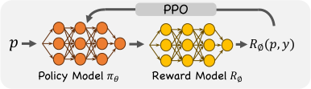
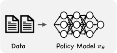
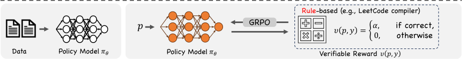
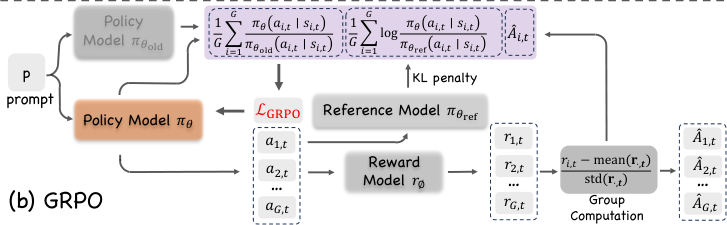

## **Reinforcement Learning in Vision: A Survey**

**Weijia Wu** [1] **Chen Gao** [1] **Joya Chen** [1] **Kevin Qinghong Lin** [1] **Qingwei Meng** [2]

**Yiming Zhang** [3] **Yuke Qiu** [2] **Hong Zhou** [2] **Mike Zheng Shou** [1] _[ ∗]_

1 **Show Lab, National University of Singapore**
2 **Zhejiang University**
3 **The Chinese University of Hong Kong**

**Abstract**

Recent advances at the intersection of reinforcement learning (RL) and visual intelligence
have enabled agents that not only perceive complex visual scenes but also reason, generate,
and act within them. This survey offers a critical and up-to-date synthesis of the field. We
first formalize visual RL problems and trace the evolution of policy-optimization strategies
from RLHF to verifiable reward paradigms, and from Proximal Policy Optimization to
Group Relative Policy Optimization. We then organize more than 200 representative
works into four thematic pillars: multi-modal large language models, visual generation,
unified model frameworks, and vision-language-action models. For each pillar we examine
algorithmic design, reward engineering, benchmark progress, and we distill trends such
as curriculum-driven training, preference-aligned diffusion, and unified reward modeling.
Finally, we review evaluation protocols spanning set-level fidelity, sample-level preference,
and state-level stability, and we identify open challenges that include sample efficiency,
generalization, and safe deployment. Our goal is to provide researchers and practitioners with
a coherent map of the rapidly expanding landscape of visual RL and to highlight promising
directions for future inquiry. Resources are available at: `[https://github.com/weijiawu/](https://github.com/weijiawu/Awesome-Visual-Reinforcement-Learning)`
`[Awesome-Visual-Reinforcement-Learning](https://github.com/weijiawu/Awesome-Visual-Reinforcement-Learning)` .

**1** **Introduction**

Reinforcement Learning (RL) has achieved remarkable successes in the field of Large Language Models
(LLMs) (Jaech et al., 2024; Rafailov et al., 2023), most notably through paradigms like Reinforcement Learning
from Human Feedback (RLHF) (Ouyang et al., 2022) and innovative frameworks such as DeepSeek-R1 (Guo
et al., 2025a). These methodologies have significantly enhanced the capabilities of LLMs, aligning generated
outputs closely with human preferences and enabling nuanced, complex reasoning and interaction capabilities
previously unattainable through supervised learning alone.

In recent years, inspired by these remarkable achievements from LLM, there has been an explosive interest
in extending the RL methodologies that proved successful for LLMs to multimodal large models, including
Vision-Language Models (VLM) (Zhou et al., 2025a; Zheng et al., 2025; Zhang et al., 2025g), Vision-LanguageAction models (VLA) (Lu et al., 2025b; Tan et al., 2025b; Luo et al., 2025; Yuan et al., 2025b), diffusion-based
visual generation models (Fan et al., 2023b; Black et al., 2023; Zhou et al., 2025c), and unified multimodal
frameworks (Mao et al., 2025; Wang et al., 2024b; 2025a), as shown in Figure 1. Multimodal models such as
Gemini 2.5 (DeepMind, 2025) have leveraged RL to align visual-textual reasoning processes and produce
outputs with higher semantic coherence and alignment with human judgments. Concurrently, VLA models
integrating vision and language with action-oriented outputs have adopted RL to optimize complex sequential
decision-making processes in interactive environments, significantly improving task-specific performance in
GUI automation (Yuan et al., 2025b; Shi et al., 2025), robotic manipulation (Lu et al., 2025b), and embodied
navigation (Kim et al., 2025). The rapid advancement of diffusion-based generative models has further spurred

_∗_ Corresponding author : Mike Zheng Shou (mikeshou@nus.edu.sg).

1

Figure 1: **Timeline of Representative Visual Reinforcement Learning Models.** The figure presents a
chronological overview of key Visual RL models from 2023 to 2025, organized into four tracks: Multimodal
LLM, Visual Generation, Unified Models, and VLA Models.

this RL-driven innovation wave. Works like ImageReward (Xu et al., 2023) have introduced reinforcement
learning to enhance the semantic alignment and visual quality of generative outputs, refining diffusionbased generation through iterative feedback mechanisms derived from human preferences or automated
reward critics. Moreover, unified models that blend multiple tasks, _i.e.,_ understanding, and generation, into
single architectures (Mao et al., 2025; Jiang et al., 2025b) have increasingly relied on RL-driven fine-tuning,
achieving generalization and task transfer previously considered challenging. Despite the substantial progress
in integrating reinforcement learning with multimodal large language models, several core challenges remain.
These include stabilizing policy optimization under complex reward signals, managing high-dimensional and
diverse visual inputs, and designing scalable reward functions that support long-horizon decision-making.
Addressing these challenges necessitates methodological innovations in both algorithmic design and evaluation
protocols.

In this survey, we present a comprehensive synthesis of recent advances in visual reinforcement learning
within the context of multimodal large models, with a focus on the surge of research activity since 2024. We
begin by revisiting foundational RL successes in language models, such as RLHF (Ouyang et al., 2022) and
DeepSeek-R1 (Guo et al., 2025a), which have laid the groundwork for multimodal adaptation. Subsequently,
we discuss how these strategies have evolved in the visual domain, categorizing over 200 representative
works into four key domains: (i) multimodal large language models, (ii) visual generation, (iii) unified
RL frameworks, and (iv) vision-language-action agents, as shown in Figure 1. Within each category, we
analyze key developments in algorithmic formulations, reward modeling, and benchmarking methodologies.
Finally, we identify open challenges and future directions, highlighting the need for more efficient multimodal
reasoning, robust long-horizon learning strategies for VLA tasks, and scalable, high-fidelity reward signals
tailored to visual generation. Through this comprehensive overview, we offer a structured overview of visual
reinforcement learning to support future research and practical deployment in this rapidly evolving field.

Our key contributions are as follows:

2

Table 1: **Glossary of Symbols for Visual Reinforcement Learning.** It consolidates the notation that
recurs across Sections §2.1–§2.3, with the rightmost column pointing to each appearance of the symbol.

**Symbol** **Alias** **Meaning** **Appears in**

_p_ prompt User prompt (initial state) §2.1, §2.2.1, §2.3.1, §2.3.2
_at_ action Token / pixel patch / diffusion noise at step _t_ §2.1, Eq. (8), §2.3.2
_y_ traj Full continuation ( _a_ 1 _, . . ., aT_ ) §2.1, §2.2.1, §2.2.3
_yi_ continuation _i_ -th continuation in a GRPO group §2.1, §2.3.2
_st_ state Prompt plus previously generated actions §2.1, §2.3.1, §2.3.2
_πθ_ policy Trainable model (current parameters) §2.1, §2.2.1, §2.2.2, §2.3.1, §2.3.2
_πθ_ old behaviour policy Frozen policy that produced current batch Eq. (10), §2.3.2
_π_ SFT SFT baseline Supervised-fine-tuned checkpoint §2.2.1, §2.3.1
_π_ ref reference Policy used in KL regulariser §2.1, §2.3.1, §2.3.2
_ρt_ ratio Importance weight _πθ/πθ_ old Eq. (10), §2.3.2
_AAV_ ˆˆ _ψti,t_ criticadvantagegroup adv. Group-normalised advantage (GRPO)Value network predicting future returnGAE advantage (token-level) Eq. (12), §2.3.2Eq. (9), §2.3.1§2.3.1
_O_ = _{at}_ _[G]_ 1 group Set of _G_ continuations for one prompt at _t_ timestep §2.1, §2.3.2
_G_ group size Number of continuations per prompt §2.1, §2.3.2
_rϕ_ ( _st, at_ ) token reward Immediate reward from frozen preference model §2.3.1
_ri_ token reward Reward of the _i_ -th continuation in group §2.3.2
mean( _·_ ) mean Group reward mean in GRPO §2.3.2
std( _·_ ) std Group reward standard deviation in GRPO §2.3.2
_Rϕ_ ( _p, y_ ) RM Sequence-level reward model (RLHF) §2.2.1
_ϵ_ clip PPO clipping threshold Eq. (10), §2.3.2
_β_ KL weight Weight balancing KL vs. reward Eq. (8), §2.2.1, §2.3.2
KL( _·∥·_ ) KL Divergence between policy and reference §2.2.1, §2.3.1, §2.3.2
_D_ KL( _p_ ) est. KL Token-average KL estimator in GRPO Eq. (13)

- We provide a systematic and up-to-date survey of over 200 visual reinforcement learning studies, encompassing MLLMs, visual generation, unified models, and vision-language-action agents.

- We analyze advances in policy optimization, reward modeling, and benchmarking across subfields, revealing
key challenges and future directions: such as reward design in visual generation and the lack of intermediate
supervision in reasoning and VLA tasks.

- We introduce a principled taxonomy of Visual RL methods based on metric granularity and reward
supervision, including three reward paradigms for image generation. This framework clarifies the design
trade-offs across domains and offers actionable insights for selecting and developing RL strategies.

**2** **Preliminary: Reinforcement Learning in LLM**

This section lays the foundation for the RL of multi-modal models. We first formalize the notation (§2.1),
casting text and image generation as a Markov Decision Process. Next, we examine three alignment paradigms
(§2.2): _RL from Human Feedback_ (RLHF), _Group-Relative Policy Optimization_ (GRPO), and _Reinforcement_
_Learning with Verifiable Rewards_ (RLVR), each aligning policies via human preferences or deterministic
checks. Finally, §2.3 reviews the core policy gradient methods (PPO, GRPO) and their adaptations to visual
reasoning and generation.

**2.1** **Notation and Problem Formulation**

We cast text- or image-generation as an episodic Markov decision process. We treat the user _prompt p_ as the
**initial state** _s_ 0 = _p_ . At timestep _t_, the state is the prompt plus all previously generated actions:

_st_ = � _p, a_ 1 _, . . ., at−_ 1� _._ (1)

A _continuation_ is the full action sequence _{a_ 1 _, . . ., aT }_, where each token _at ∈A_ is sampled autoregressively
from the policy:

_πθ_ � _at | st_ � = _πθ_ � _at | p, a_ 1 _, . . ., at−_ 1� _._ (2)

3

Step 2 : Train Reward Model

Step 3 : Optimize Policy with RL

Step 1 : Train Supervised Policy Step 2 : Train Reward Model
(a) RL from Human Feedback (RLHF)

Step 1 : Train Supervised Policy

Step 1 : Train Supervised Policy

Step 2 : Optimize Policy with DPO

(b) Direct Preference Optimization (DPO)

Step 2 : Optimize Policy against Verifiable Reward

(c) RL with Verifiable Rewards (RLVR)

Figure 2: **Three Alignment Paradigms for Reinforcement Learning.** (a) RLHF learns a reward model
from human preference data and optimizes the policy via PPO. (b) DPO removes the reward model and
directly optimizes a contrastive objective against a frozen reference. (c) RLVR replaces subjective preferences
with deterministic verifiable signals and trains the policy using GRPO.

In words, the prompt anchors the state sequence, and each new action is chosen in the context of that prompt
and the tokens already produced.

A fixed reference model ( _e.g.,_ the supervised fine-tuned checkpoint) is denoted _π_ ref. Human preferences are
distilled into a scalar reward model _Rϕ_ ( _p, y_ ), replacing the reward from the unknown environment. We write
_ρt_ ( _θ_ ) = _πθ_ ( _at | st_ )� _πθ_ old( _at | st_ ) for the importance ratio between new and behavior policies. _A_ [ˆ] _t_ is used to
denote the advantage estimate. PPO reduces the variance of _A_ [ˆ] _t_ with a learned critic _V_ [ˆ] _ψ_, whereas GRPO
replaces the critic by a _group-relative_ baseline computed from a set _O_ = _{ai}_ _[G]_ _i_ =1 [of continuations that share]
the same prompt. All two algorithms add a KL regulariser KL� _πθ_ ( _·|_ _p_ ) _∥π_ ref( _·|_ _p_ )� weighted by _β_ to keep the
updated policy close to the reference. Unless stated otherwise, expectations E[ _·_ ] are over prompts _p_ _∼D_ and
continuations drawn from the specified policy.

**2.2** **Alignment Paradigms**

**2.2.1** **RL from Human Feedback**

RLHF (Ouyang et al., 2022) extends the underlying MDP with _pairwise preference data_ curated from human
annotators. Each preference example is a triple ( _p, y_ A _, y_ B), where _p_ is the prompt (or state sequence)
and ( _y_ A _, y_ B) are two candidate continuations (trajectories, images, _etc._ ); the label _y_ _∈{_ 0 _,_ 1 _}_ records which
continuation is preferred, as shown in Figure 2.

**Reward-model learning.** A scalar reward model _Rϕ_ is trained to reproduce the pairwise ordering via a
Bradley–Terry likelihood:

_L_ RM = _−_ �

( _p,y_ A _,y_ B)

� _y_ log _σ_ � _Rϕ_ ( _p, y_ A) _−_ _Rϕ_ ( _p, y_ B)� + (1 _−_ _y_ ) log _σ_ � _Rϕ_ ( _p, y_ B) _−_ _Rϕ_ ( _p, y_ A)� [�] _,_ (3)

where _σ_ ( _·_ ) is the logistic function. After convergence, _Rϕ_ provides a _dense, differentiable_ proxy for human
preference.

4

**Policy optimization.** The policy _πθ_ is finally fine-tuned by maximizing (i) the learned reward, (ii) a
KL penalty that keeps the policy close to the supervised-fine-tuned baseline _π_ SFT, and (iii) an _optional_
log-likelihood regulariser on the original pre-training distribution, as introduced in InstructGPT (Ouyang
et al., 2022) [1] :

max E( _p,y_ ) _∼πθ_ � _Rϕ_ ( _p, y_ )�
_θ_ � ~~��~~ �

reward

_−β_ E _p_ �KL� _πθ_ ( _·|_ _p_ ) _∥_ _π_ SFT( _·|_ _p_ )��

~~�~~ ~~��~~ ~~�~~
SFT anchoring

+ _γ_ E _x∼D_ pretrain�log _πθ_ ( _x_ )�

~~�~~ ~~�~~ � ~~�~~
pre-training log-likelihood

_._ (4)

In practice, the first two terms are optimised with KL-regularised PPO over minibatches of sampled
continuations, while the third term adds the pre-training gradients (“PPO-ptx” in (Ouyang et al., 2022)) to
mitigate performance regressions on the original corpus.

**Three-stage recipe.** Most modern RLHF pipelines follow the three-stage recipe, as shown in Figure 2 (a).
Step 1: Collect demonstration data, and train a supervised policy; Step 2: Collect comparison data, and
train a reward model; Step 3: Optimize a policy _πθ_ against the reward model using PPO. The paradigm
was _pioneered_ by Christiano et al., (Christiano et al., 2017), who trained Atari and robotic agents from
pairwise human preferences. Ouyang et al., (Ouyang et al., 2022) later _scaled_ the recipe to large language
models (InstructGPT) by coupling preference modeling with PPO. For vision, reward models such as
ImageReward (Xu et al., 2023) and Human Preference Score (HPS) (Wu et al., 2023b) supply dense aesthetic
signals that guide text-to-image diffusion and related tasks.

**2.2.2** **Direct Preference Optimization**

Direct Preference Optimisation (DPO) (Rafailov et al., 2023) takes exactly the _same_ pairwise-preference
data as RLHF but removes the intermediate reward-model and RL loop. Instead, it derives a _closed-form,_
_supervised_ objective that implicitly enforces a KL constraint to a frozen reference policy _π_ ref, as shown in
Figure 2 (b).

**Closed-form objective.** For every prompt _p_ annotators rank two continuations � _y_ A _, y_ B� and order them so
that _y_ A is the preferred continuation (“winner”) and _y_ B the non-preferred one (“loser”). Thus the dataset
consists of triples ( _p, y_ A _, y_ B) _∼D_ . Let _π_ ref be a frozen reference policy (e.g., the SFT checkpoint) and let
_β >_ 0 be a temperature hyper-parameter. DPO minimizes:

_L_ DPO = _−_ E( _p,y_ A _,y_ B) _∼D_ �log _σ_ � _β_ ∆ _θ_ ( _p, y_ A _, y_ B)� [�] _,_ (5)

where the log-odds gap is:

_[|]_ _[p]_ [)]
∆ _θ_ ( _p, y_ A _, y_ B) = log _[π][θ]_ [(] _[y]_ [A]

_[|]_ _[p]_ [)] _[|]_ _[p]_ [)]

_[π][θ]_ [(] _[y]_ [A] _[π][θ]_ [(] _[y]_ [B]

_π_ ref( _y_ A _| p_ ) _[−]_ [log] _π_ ref( _y_ B _| p_ )

_π_ ref( _y_ B _| p_ )

= �log _πθ_ ( _y_ A _| p_ ) _−_ log _πθ_ ( _y_ B _| p_ )� _−_ �log _π_ ref( _y_ A _| p_ ) _−_ log _π_ ref( _y_ B _| p_ )� _._ (6)

The logistic function _σ_ ( _z_ ) = 1 _/_ (1 + _e_ _[−][z]_ ) turns the gap into a binary-classification loss; training proceeds with
standard maximum-likelihood gradients, no reward model, value network, or importance sampling is required.

**2.2.3** **Reinforcement Learning with Verifiable Rewards**

Reinforcement Learning with Verifiable Rewards (RLVR) eliminates the subjectivity and data-collection cost
of RLHF by replacing pairwise human preferences with _deterministic, programmatically checkable_ reward
signals _v_ : ( _p, y_ ) _�→{_ 0 _,_ 1 _, . . ., K}_ . Typical examples include `pass` _/_ `fail` unit tests for code synthesis, exactmatch answers in mathematics, IoU/dice thresholds for segmentation, or formal output-format validators
( _e.g.,_ LeetCode compiler). Because the reward is generated _online_ by execution or metric evaluation, RLVR
removes both (i) the reward-model training stage of RLHF and (ii) the contrastive surrogate loss of DPO,

1The coefficients _β_ and _γ_ respectively control the strength of the KL penalty and the pre-training log-likelihood term. Setting
_γ_ =0 recovers the standard PPO objective.

5

Figure 3: **Two Representative Policy Optimization Algorithms for LLM.** PPO (a) uses a learned
value model _Vψ_ for advantage estimation and injects the KL penalty at each token. GRPO (b) removes the
value model, computes group-normalized advantages _A_ [ˆ] _i,t_ across _G_ continuations, and applies an explicit
prompt-level KL penalty.

while still enabling substantial policy improvements beyond supervised learning (Guo et al., 2025a; Shao
et al., 2024b; Lambert et al., 2024), as shown in Figure 2 (c).

**Verifiable reward.** For a prompt (state) _p_ and a sampled continuation _y_, a verifier returns:

_r_ ( _p, y_ ) = _v_ ( _p, y_ ) _∈{_ 0 _,_ 1 _},_ (7)

_e.g.,_ “ `pass` ” if the generated program solves all hidden tests. The same idea applies to vision: a generated
mask that attains IoU _≥_ 0 _._ 9 with ground truth, or an image whose CLIP similarity exceeds a hard threshold
can be awarded _r_ =1. Current most RLVR systems ( _e.g.,_ DeepSeekMath, Deepseek-R1) adopt GRPO (Shao
et al., 2024b) (see Equ. 12) and standard KL regularization to train the policy model.

RLVR therefore follows a concise two-stage pipeline. Step 1: Supervised policy pre-training on demonstrations
_{_ ( _p, y_ ) _}_, producing the initial _π_ SFT. Step 2: RL fine-tuning with GRPO/PPO against the on-the-fly verifiable
reward _v_ ( _p, y_ ), optionally mixing in a small percentage of teacher-forced SFT updates to stabilise training.

**2.3** **Policy-Optimization Algorithms**

**2.3.1** **Proximal Policy Optimization**

Proximal Policy Optimization (PPO) (Schulman et al., 2017) is a first order trust region method that updates
the policy _πθ_ while _staying close to the previous policy πθ_ old at every step, as shown in Figure 3 (a). In textor image-generation problems we treat a prompt _p_ as the initial state _s_ 0 and the continuation _{a_ 1 _, . . ., aT }_ as
the trajectory. Define the importance-sampling ratio _ρt_ ( _θ_ ) and immediate reward _rϕ_ :

- **Importance–sampling ratio**

_πθ_ ( _at_ _| st_ )
_ρt_ ( _θ_ ) =
_πθ_ old( _at | st_ ) _[,]_

which re-weights the gradient estimate from the behavior policy to the updated policy.

- **Immediate reward** _rϕ_ ( _st, at_ ), provided by a _frozen_ reward model _rϕ_ that has been pre-trained to
approximate human preference.

6

- **Value baseline** _Vψ_ ( _st_ ), produced by a _learned_ value network _Vψ_ that regresses the expected discounted
return from state _st_ .

With the KL-regularised reward between the policy model and reference model, _rt_ [PPO] can be defined:

_[|][ s][t]_ [)]
_rt_ [PPO] = _rϕ_ ( _st, at_ ) _−_ _β_ log _[π][θ]_ [(] _[a][t]_ (8)

_π_ ref( _at | st_ ) _[,]_

where the KL term(latter item) keeps the updated policy _πθ_ from drifting too far from the frozen reference
_π_ ref. _β_ balances exploration (via KL proximity to the frozen reference model _π_ ref) against exploitation of the
reward model. A larger _β_ implies stricter proximity and thus safer but potentially slower learning. Then the
generalized advantage estimator (GAE) (Schulman et al., 2015) produces _A_ [ˆ] _t_ :

_A_ ˆ _t_ = GAE� _rt_ [PPO] _, Vψ_ � _,_ (9)

where GAE computes advantage values by exponentially weighting multi-step reward estimates, providing a
smooth trade-off between low-variance learning and high-variance Monte Carlo returns.

The surrogate objective maximized by PPO is then:

_L_ PPO = E _t_ �min� _ρt_ ( _θ_ ) _A_ [ˆ] _t,_ clip� _ρt_ ( _θ_ ) _,_ 1 _−_ _ϵ,_ 1 + _ϵ_ � _A_ ˆ _t_ �� _,_ (10)

where the hyper-parameter _ϵ_ _∈_ (0 _,_ 1) controls the width of the trust region. Accurate and low-variance _A_ [ˆ] _t_
estimates are therefore critical, they direct each policy update and ultimately determine the stability and
sample efficiency of PPO.

**2.3.2** **Group Relative Policy Optimization**

Group Relative Policy Optimisation (GRPO) (Shao et al., 2024b) extends PPO by discarding the learned
value (critic) network and replacing it with a _group-relative_ baseline computed from multiple outputs sampled
for the same prompt. This design markedly reduces memory consumption while aligning the advantage
estimator with the comparison-based reward model, as shown in Figure 3 (b).

**Group Relative Baseline.** For each prompt _p_, we sample a group of _G_ full continuations _a_ 1 _, . . ., aG ∼_
_πθ_ ( _· | p_ ), where each continuation _a·,t_ = ( _a_ 1 _,t, . . ., aG,t_ ) is a sequence of tokens indexed by timestep _t_ . The
frozen reward model _rϕ_ ( _p, ai,t_ ) then assigns a scalar score to each token _ai,t_ conditioned on the prompt. These
sequence level rewards are then normalized across the group to compute a group-relative advantage signal:

_A_ ˆ _i,t_ = ˜ _ri,t_ = _[r][i][,][t][ −]_ [mean][(] **[r]** _[·][,][t]_ [)] _,_ (11)

std( **r** _·,t_ )

where mean( _·_ ) and std( _·_ ) denote the mean and standard deviation functions used to compute the group
relative advantage. The same _A_ [ˆ] _i_ is reused for every token _ai,t_ in the continuation, producing the clipped
surrogate:

(12)

_L_ GRPO = E _p∼D_ � _G_ 1

_G_
�

_i_ =1

1
_|ai|_

_|ai|_
� min� _ρi,t_ _A_ [ˆ] _i,t,_ clip� _ρi,t,_ 1 _−_ _ϵ,_ 1 + _ϵ_ � _A_ ˆ _i,t_ � [�]

_t_ =1

_−_ _β_ E _p_ _D_ KL _πθ_ ( _· | p_ ) _π_ ref( _· | p_ ) _,_
� � ��� ��

where _ρi,t_ = _πθ_ ( _ai,t | si,t_ )� _πθ_ old( _ai,t | si,t_ ) _._ The explicit KL penalty _D_ KL( _·_ ) keeps _πθ_ near the reference _π_ ref,
while the group-relative advantage _A_ [ˆ] _i_ replaces the value baseline _Vψ_, roughly halving memory and compute
yet retaining a low-variance learning signal.

**Prompt-level KL estimator.** Instead of injecting a token-wise penalty into the reward (as PPO does with
_β_ log _π_ _[π]_ ref _[θ]_ [), GRPO adds a] _[ separate]_ [ prompt-level regulariser. With the] _[ G]_ [ sampled continuations we form an]

unbiased token-average estimate:

_π_ ref( _ai,t | si,t_ )

_D_ KL( _p_ ) = [1]

_G_

_G_
�

_i_ =1

1

_|ai|_

_|ai|_
�

� _t_ =1 log � _ππ_ ref _θ_ (( _aaii,t,t_ _|| s sii,t,t_ ))

_,_ (13)
�

7

Figure 4: **Overall taxonomy of reinforcement-learning research in vision.** The chart groups existing
work by high-level domain (MLLMs, visual generation, unified models, and vision-language action agents)
and then by finer-grained tasks, illustrating representative papers for each branch.

which measures how far the current policy drifts from the frozen reference _π_ ref over the _whole_ continuation.

Relative to PPO in Equ. (10), GRPO introduces two key improvements: _1) Eliminates the value (critic)_
_network._ Variance reduction is achieved by a _group-relative_ baseline, leading to lower memory footprint
and fewer hyper-parameters. _2) Separates the KL loss channel._ The KL divergence is optimized as an
explicit regulariser rather than folded into the advantage, yielding a transparent trade-off between reward
maximization and reference anchoring.

**3** **Reinforcement Learning in Vision**

**3.1** **Multi-Modal Large Language Models**

We categorize the works into four coherent groups, each defined by shared RL-driven objectives and internal
reasoning mechanisms.

8

**3.1.1** **Conventional RL-based MLLMs**

We refer to _conventional RL-based MLLMs_ as approaches that apply reinforcement learning primarily to
_align_ a vision–language backbone with _verifiable, task-level rewards_, without explicitly modeling multi-step
chain-of-thought reasoning. Typical works RePIC (Oh et al., 2025), GoalLadder (Zakharov & Whiteson, 2025),
Drive-R1 (Li et al., 2025e) and VLM-R1 (Shen et al., 2025b) replace preference models with _deterministic_
_validators_ ( _e.g.,_ exact-match, IoU, BLEU) and optimize the policy by GRPO/PPO variants under a KL
regulariser. This design yields stable value-free training, improves zero-shot robustness on captioning,
grounding and autonomous-driving benchmarks, and substantially reduces the annotation cost typically
incurred by supervised fine-tuning.

Recent extensions demonstrate the flexibility of this paradigm. GRPO-CARE (Chen et al., 2025b) introduces
consistency-aware group normalization to mitigate reward variance, while Q-Ponder (Cai et al., 2025c) adds a
pondering controller. From a data perspective, MoDoMoDo formulates a multi-domain mixture optimization
that predicts reward distributions and selects optimal curricula (Liang et al., 2025); V-Triune further unifies
perception and reasoning tasks within a single triple-objective pipeline, empirically validating that rule-based
RL scales to diverse visual signals (Ma et al., 2025). Collectively, these studies indicate that (i) verifiable
rewards can serve as a low-cost alternative to human feedback, (ii) group-relative objectives offer higher
training stability than token-level PPO on heterogeneous visual tasks, and (iii) curriculum or data-mixture
scheduling is emerging as a key ingredient for broad generalization.

**3.1.2** **Spatial and 3D Perception**

**2D perception.** Perception centric works applies RL to sharpen object detection, segmentation and
grounding without engaging in lengthy chain–of–thought reasoning. Omni-R1 (Zhong et al., 2025) introduces
a two-system (global–local) GRPO pipeline that verifies predictions via rule-based metrics, yielding notable
improvements on region-level benchmarks and emotion-recognition tasks. DIP-R1 (Park et al., 2025b) further
decomposes perception into step-wise “inspect _→_ observe _→_ act” cycles, where each stage receives deterministic
IoU or counting-based rewards to boost fine-grained detection. Perception-R1 (Yu et al., 2025) revisits the
effect of GRPO on a spectrum of detection and OCR datasets. Complementing these, VisRL (Chen et al.,
2025h) frames intention-guided focus selection as an RL sub-policy, eliminating expensive region labels and
consistently outperforming supervised strong baselines on visual grounding tasks.

**3D perception.** Beyond 2-D, several studies leverage RL to align multimodal models with physically
consistent 3-D layouts. MetaSpatial (Pan & Liu, 2025) employs rendered depth/IoU rewards to refine spatial
reasoning for AR/VR scene generation, whereas Scene-R1 (Yuan et al., 2025c) couples video-grounded snippet
selection with a two-stage grounding policy to learn 3-D scene structure without point-level supervision.
At molecular scale, BindGPT (Zholus et al., 2025) treats atom placement as sequential actions and uses
binding-affinity estimators as verifiable rewards, demonstrating the scalability of perception-focused RL
to 3-D biochemical design. Collectively, these approaches underscore a common recipe: (i) formulate
detection/segmentation/3-D alignment as Markov decision problems, (ii) craft deterministic spatial rewards
( _e.g.,_ IoU, depth consistency, binding energy), and (iii) fine-tune pretrained VLM backbones via GRPO/PPO
for stable perception enhancement—thereby differentiating themselves from reasoning-oriented RL variants.

**3.1.3** **Image Reasoning**

Thinking about Images methods enhance multimodal reasoning by _verbalising_ observations of a static picture
before producing an answer, but the visual content itself is not modified during inference. By contrast,
Thinking with Images elevates the picture to an _active, external workspace_ : models iteratively _generate, crop,_
_highlight, sketch or insert explicit visual annotations_ as tokens in their chain-of-thought, thereby aligning
linguistic logic with grounded visual evidence.

**Think about Image** . Early think about image works for spatial VQA employs view-consistent or
transformation-invariant objectives, such as SVQA-R1 (Wang & Ling, 2025) and STAR-R1 (Li et al.,
2025g). VL-GenRM (Zhang et al., 2025d) and RACRO (Gou et al., 2025) refine preference data or caption
rewards to curb hallucinations. Benchmark-oriented efforts such as EasyARC (Unsal & Akkus, 2025) offer

9

procedurally generated, fully verifiable tasks that suit outcome-based reinforcement learning. To mitigate
shortcut reliance and improve generality, Visionary-R1 (Xia et al., 2025) enforces image interpretation before
reasoning, whereas UniVG-R1 (Bai et al., 2025) unifies referring, captioning, and detection by coupling a
grounding corpus with GRPO fine-tuning. Extensions such as EchoInk-R1 (Xing et al., 2025) further enrich
visual reasoning by integrating audio–visual synchrony under GRPO optimization. Meanwhile, curriculumdriven frameworks—WeThink, G1, GThinker, and Observe-R1 progressively increase task complexity or
introduce re-thinking cues ( _e.g.,_ difficulty ladders, multimodal format constraints) to cultivate deeper and
more structured reasoning capabilities in MLLMs. These methods show that language only RL with welldesigned visual correctness rewards significantly improves model accuracy, robustness, and out-of-distribution
performance.

**Think with Image.** Early think with image works grounds reasoning via discrete _region–level_ operations:
GRIT (Fan et al., 2025) interleaves bounding-box tokens with language and trains under GRPO to maximize
both answer correctness and box fidelity, while VILASR (Wu et al., 2025a) generalizes this idea to multi-view
and video settings, enforcing cross-view spatial consistency. Ground-R1 (Cao et al., 2025) and BRPO (Chu
et al., 2025) adopt two-stage pipelines that first highlight evidence regions (via IoU-based or reflection rewards)
before verbal reasoning. A complementary thread explores pixel-space or sequence-level manipulation. Visual
Planning (Xu et al., 2025b) replaces text chains with imagined image roll-outs rewarded by downstream task
success; Pixel Reasoner (Su et al., 2025a) augments the action space with crop, erase and paint primitives
and balances exploration through curiosity-driven rewards, whereas DeepEyes (Zheng et al., 2025) shows
that end-to-end RL can spontaneously induce such visual thinking behaviours. Finally, TACO (Kan et al.,
2025) introduces a think–answer consistency objective that resamples long visual–verbal chains until their
intermediate edits align with the final answer. Together, these systems demonstrate that explicitly generating
or editing visual artefacts during reasoning optimized via GRPO or R1-style outcome RL—yields more
faithful, interpretable and robust image understanding than language only approaches.

**3.1.4** **Video Reasoning**

Video reasoning extends the capabilities of MLLMs to process temporal dynamics, requiring not only spatial
perception but also sequential understanding and causal inference. Recent works in this domain have
proposed diverse approaches to tackle complex reasoning over video inputs. For instance, VQ-Insight (Zhang
et al., 2025h) introduces a hierarchical reward design and self-consistency voting mechanism tailored to the
question–answering process over long videos. TW-GRPO (Dang et al., 2025) combines token wise credit
assignment with GRPO-style optimization to improve fine-grained temporal alignment between textual
reasoning and video evidence. Meanwhile, several R1-style frameworks have been developed to unlock video
understanding in complex real-world or egocentric settings. EgoVLM (Vinod et al., 2025) and VAU-R1 (Zhu
et al., 2025b) focus on egocentric video reasoning with visual memory and utility-based rewards. DeepVideoR (Park et al., 2025a) integrates dense video encodings and external reward functions to supervise long-horizon
reasoning. TimeMaster (Zhang et al., 2025e) explicitly structures temporal abstraction and reasoning via
curriculum learning, while VideoR1 (Feng et al., 2025) proposes a scalable RL framework for video-based
QA tasks across multiple domains. Collectively, these works highlight the importance of aligning temporal
representations with language trajectories through reinforcement learning, paving the way for robust and
generalizable video reasoning agents.

**3.2** **Visual Generation**

**3.2.1** **Image Generation**

RL for image generation models departs from the language counterpart in both _action space_ continuous
diffusion steps or prompt refinements and _reward design_, which must capture perceptual quality, text–image
alignment, and subject fidelity. A first family learns an explicit _visual reward model_ : ImageReward (Xu
et al., 2023) supplies human-preference scores that drive policy-gradient fine-tuning of diffusion backbones
in DiffPPO (Xiao et al., 2024), Dpok (Fan et al., 2023a), and FocusDiff (Pan et al., 2025). A second
line bypasses reward modelling by optimising _pairwise or unary preferences_ : DDPO (Black et al., 2023),
DiffusionDPO (Wallace et al., 2024), Diffusion-KTO (Li et al., 2024b), and DiffusionRPO (Gu et al., 2024)

10

Human-Centric

（a）

Preference

Figure 5: **Three reward paradigms for RL-based image generation.** (a) Human-Centric Preference
Optimization: aligns outputs with human aesthetic scores (HPS (Wu et al., 2023b), ImageReward (Xu et al.,
2023)); (b) Multimodal Reasoning-Based Evaluation: scores images via multimodal reasoning consistency
(UnifiedReward (Wang et al., 2025j), PARM (Guo et al., 2025d)); (c) Metric-Driven Objective Optimization:
minimizes task-specific quantitative metrics such as FID and IoU.

treat denoising trajectories as MDPs and apply R1/GRPO updates to maximise comparative human feedback.
Beyond alignment, works such as PrefPaint (Liu et al., 2024a), Parrot (Lee et al., 2024), and RLRF (Rodriguez
et al., 2025b) craft multi-objective or render-and-compare rewards to refine aesthetics, diversity, or vector
graphics. RL has also been used to inject _reasoning and prompt adaptation_ : ReasonGen-R1 (Zhang et al.,
2025i), GoT-R1 (Duan et al., 2025) and RePrompt (Wu et al., 2025b) first generate textual plans or improved
prompts, then reinforce the generator for coherent scene synthesis. Finally, personalisation methods—DPGT2I (Wei et al., 2024), RPO (Miao et al., 2024a), and B [2] -DiffuRL (Hu et al., 2025a) optimize rewards that
measure subject fidelity under scarce reference images. Collectively, these studies show that RL, armed with
perceptual or preference-based rewards, can steer diffusion models toward higher realism, stronger prompt
faithfulness, controllable layout, and user-specific appearance capabilities difficult to achieve with likelihood
training alone.

**3.2.2** **Video Generation**

Applying RL to video generation introduces challenges absent in images: rewards must capture _temporal_
_coherence_, _motion naturalness_, and _text–video alignment_ across hundreds of frames. Early work such
as InstructVideo (Yuan et al., 2024) repurposed image scorers and applied PPO to refine short clips,
whereas VideoRM (Wu et al., 2024) and VideoReward (Liu et al., 2025b) learn dedicated preference models
that grade entire sequences for smoothness, consistency and prompt faithfulness. Building on GRPO/R1,
DanceGRPO (Xue et al., 2025) shows that group-normalized returns stabilize long-horizon optimization and
boost aesthetic and alignment scores across diffusion and flow backbones.

Beyond preference alignment, specialized rewards tackle domain-specific goals. GAPO (Zhu et al., 2025a)
exploits gap-aware ranking to fine-tune anime videos; Phys-AR (Lin et al., 2025) penalizes violations of
physics to yield plausible trajectories; and InfLVG (Fang et al., 2025) trains an inference-time policy that
retains only context tokens beneficial for multi-scene coherence. Auxiliary critics further facilitate training:
VideoScore (He et al., 2024b) and Gradeo (Mou et al., 2025) offer explainable, multi-factor scores, while
TeViR (Chen et al., 2025d) feeds imagined video roll-outs as dense rewards to downstream control agents.
Collectively, these studies demonstrate that carefully crafted sequence level rewards and group-relative policy
updates are key to producing temporally consistent, semantically aligned, and physically plausible videos
capabilities difficult to obtain with likelihood training alone.

11

**3.2.3** **3D Generation**

RL for 3D generation differs from 2D and video tasks as rewards operate on _volumetric structures_ or _rendered_
_views_, often requiring expensive render-and-compare loops. DreamCS (Zou et al., 2025) pioneers this paradigm
by framing text-to-mesh synthesis as a Markov decision process: a diffusion backbone proposes coarse shapes,
then a policy refines vertex positions under a reward that jointly measures silhouette IoU, CLIP text-mesh
alignment, and mesh smoothness. On the reward side, DreamReward (Ye et al., 2024) introduces a large-scale
human preference dataset of rendered 3-D assets and trains a geometry-aware critic that scores prompts,
renders, and latent SDFs; the learned signal enables stable PPO fine-tuning of existing text-to-shape models.

A complementary line adopts direct preference optimization. DreamDPO (Zhou et al., 2025c) extends DPO
to NeRF and mesh diffusion models by sampling paired 3D outputs and maximizing the margin dictated by
human comparisons, achieving superior prompt fidelity without an explicit value network. Finally, NablaR2D3 (Liu et al., 2025d) tackles _interactive scene editing_ : the agent sequentially adds, deletes, or transforms
objects in a 3D scene; reward is computed via real-time rasterized views and task-specific validators ( _e.g.,_
occupancy, spatial relations). Group-relative policy optimization (R2D3) stabilizes training despite sparse
feedback. Together, these studies demonstrate that RL, equipped with geometry-aware or render-based
rewards, provides an effective mechanism for controlling structural integrity, text alignment, and interactive
editability capabilities that standard likelihood or score-distillation objectives struggle to capture in the 3D
domain.

**3.3** **Unified Model**

Task specific RL maximizes a reward tied to a _single_ objective, whereas _Unified RL_ optimizes a _shared_ policy
and reward across multiple vision–language tasks ( _e.g.,_ understanding and generation).

**3.3.1** **Unified RL**

Unlike task specific pipelines that attach RL to a single downstream objective, _Unified RL_ methods optimize
a **shared policy** across heterogeneous multimodal tasks under a _single_ reinforcement signal. The central idea
is to merge understanding and generation trajectories into one training loop typically using Group-Relative
or R1-style methods.

UniRL (Mao et al., 2025) exemplifies this paradigm: a visual autoregressive backbone is first instruction-tuned,
then jointly fine-tuned on VQA, captioning and image generation with a blended reward measuring textual
correctness, CLIP-based alignment, and aesthetic quality. CoRL (Jiang et al., 2025b) pushes the idea
further by alternating “co-understanding” and “co-generation” batches within the same GRPO step. To
address inefficiency in dense token spaces, SelfTok (Wang et al., 2025a) discretises multi-modal actions into a
self-evolving token set and demonstrates that a single RL head can govern retrieval, grounding, and synthesis
with minimal extra parameters. Finally, HermesFlow (Yang et al., 2025c) couples an autoregressive text
module with a rectified flow image decoder under one cross-task reward, illustrating that diffusion-style and
language-style policies can be harmonized through unified reinforcement updates. Together, these works
suggest that sharing a common RL objective across tasks not only reduces training cost but also encourages
emergent cross modal generalization unavailable to isolated, task specific fine-tuning.

**3.3.2** **Task specific RL**

In contrast to the unified approaches of §3.3.1, task-specific RL confines the reward signal to a single
downstream objective, optimizing one functional head while leaving other capabilities untouched. VARGPTv1.1 (Zhuang et al., 2025) exemplifies this strategy: although the underlying visual autoregressive model can
handle both understanding and generation, its RL stage targets _only_ visual generation with DPO. Similarly,
Emu3 (Wang et al., 2024b) introduces RL exclusively to polish its image generation branch, which leveraging
pair wise human preferences. For the multimodal understanding abilities of model ( _e.g.,_ captioning, VQA),
the work just train this part by task specific fine-tuning alone.

12

**3.4** **Vision Language Action Models**

**3.4.1** **GUI Automation**

Modern GUI RL research frames screen understanding and action prediction as a vision–language decision
process, then employs rule-based or preference rewards to close the perception–action loop. On desktop and
web interfaces, GUI-R1 (Luo et al., 2025) introduces an R1-style rule set that maps click success, text entry,
and scroll validity to dense rewards. UI-R1 (Lu et al., 2025) adds GRPO with a novel action-specific KL
term to stabilize long-horizon plans, while SE-GUI (Yuan et al., 2025b) applies self-evolutionary filtering to
distil high-fidelity trajectories. Focusing on trajectory reuse, UIShift (Gao et al., 2025b) formulates an inverse
dynamics objective that lets MLLM learn actions from unlabeled GUI pairs and then refines them via RL.
Complementary preference-based frameworks include LPO (Tang et al., 2025) that rewards spatial proximity
for precise clicks. ProgRM (Zhang et al., 2025b) injects program-level logical checks, and RUIG (Zhang et al.,
2023) leverages instruction grounding with reinforcement signals. Tool-specific baselines such as Ui-tars (Qin
et al., 2025) offer larger action vocabularies yet still rely on rule-driven RL for robust execution.

Mobile scenarios introduce latency and on-device constraints. AgentCPM-GUI (Zhang et al., 2025j) compresses
the action space and conducts GRPO fine-tuning. MobileGUI-RL (Shi et al., 2025) advances this line via
online RL with task-level rewards to improve exploration under limited memory, and Mobile-R1 (Gu et al.,
2025) extends interactive multi-turn RL to correct error cascades during long tasks. At inference, GTA1 (Yang
et al., 2025e) samples multiple action candidates and employs a judge model to pick the best, effectively
trading compute for higher success rates. Additional, light-weight models such as Appvlm (Papoudakis et al.,
2025) demonstrate that modest-sized MLLM, after GRPO fine-tuning, can control smartphone apps with
competitive precision. To adaptively reduce the thinking length, the TON (Wang et al., 2025b) proposes a
thought-dropout solution during supervised fine-tuning stage, then GRPO skill adaptivley skip unnecessary
reasoning process for efficiently thinking.

Collectively, these studies show that GUI agents benefit from rule-verifiable rewards, group-normalzsed
policy updates, and preference-guided localization, achieving rapid progress toward reliable, cross-platform

automation.

**3.4.2** **Visual Navigation**

RL-driven visual navigation research now couples large vision–language models with embodied control,
employing group-normalized or time-decayed returns to maintain long-horizon stability. OctoNav-R1 (Gao
et al., 2025a) exploits a hybrid RL pipeline with a “think-before-action” ability for VLA model, then translate
egocentric frames into low-level actions. Focusing on dataset efficiency, VLN-R1 (Qi et al., 2025) builds an
end-to-end navigator and introduces a time-decayed reward to handle continuous trajectories. At the system
level, Flare (Hu et al., 2024a) demonstrates that fine-tuning a multi-task robotics policy with large-scale RL in
simulation can generalize to real-world household tasks. Complementary advances include More (Zhao et al.,
2025), which augments omni-directional inputs with memory-guided policy distillation, and RAPID (Kim
et al., 2025), which integrates pose priors for faster convergence in unseen layouts. These works show that
using temporal rewards, memory sampling, and environment priors with GRPO/PPO helps VLA agents
navigate more reliably and efficiently.

**3.4.3** **Visual Manipulation**

Visual manipulation tasks ( _e.g.,_ object relocation, tool use, and multi-step rearrangement) require finegrained perception and long-horizon planning. Recent works (Chen et al., 2025g; Shu et al., 2025) integrate
reinforcement learning with vision–language models to enhance generalization, interactivity, and policy
consistency. TGRPO (Chen et al., 2025g) introduces a task-grounded reward formulation and group
normalized updates to stabilize training for open-ended object manipulation. RFTF (Shu et al., 2025) applies
rule-based rewards to support interactive table top tasks and emphasizes training with minimal human
supervision. Meanwhile, RLVLA (Liu et al., 2025c) and VLA-RL (Lu et al., 2025b) explore curriculum-based
or progressive reinforcement learning for VLM-based robot agents, achieving high success rates across diverse
rearrangement environments.

13

### (a) (b)

Task
Metric …

Reward

Metric p.

|Col1|Col2|
|---|---|
|ℳ4(67(·)|ℳ4(67(·)|
|ℳ4(67(·)|ℳ4(67(·)|

Model-State

### (c)

Metric

Figure 6: **Metric Granularity in Visual RL.** (a) Set-level metric _M_ set: one score over the whole prompt
set, used for final evaluation ( _e.g.,_ FID). (b) Sample-level metric _M_ samp: per-output rewards that train
the policy (RLHF, DPO). (c) State-level metric _M_ _[t]_ state [: training-time signals like KL or length drift, used]
to monitor stability. Notation: _pi_, _y_ gen _[i]_ [,] _[ y]_ gt _[i]_ [denote the prompt, the generated output, and ground truth,]
respectively. _πθ_ 0 and _πθt_ refer to the 0-th and _t_ -th policy model. _Rϕ_ ( _·_ ) denotes the reward model.

Building on this, ConRFT (Chen et al., 2025e) and iRe-VLA (Guo et al., 2025b) introduce consistencyaware and instruction-refinement strategies respectively, using RL to align visual predictions with physical
interaction outcomes. RIPT-VLA focuses on interactive prompting during manipulation, bridging LLM
planning and low-level control through reinforced feedback (Tan et al., 2025b). Finally, ReinBot (Zhang
et al., 2025c) leverages multimodal rollouts and preference-based updates to improve real-world manipulation
robustness (Zhang et al., 2025c). Collectively, these studies highlight the role of vision-language reasoning,
structured reward design, and RL-based refinement in advancing embodied manipulation under complex,
language-conditioned settings.

**4** **Metrics and Benchmarks**

Evaluating visual reinforcement learning (RL) with large models requires both traditional RL metrics (Jordan
et al., 2020; Agarwal et al., 2021) and new ones designed for complex, open-ended outputs. Metrics like
cumulative return and task success rate are still useful especially in tasks involving agents and environments
but they are increasingly combined with preference-based evaluations. In this section, we discuss metrics and
benchmarks across four major application areas of large-model RL.

**4.1** **Formalizing Metric Granularity**

Let _P_ test = _{ p_ 1 _, . . ., pD}_ denote a fixed set of _prompts_ (inputs) and let a generative policy _πθ_ ( _y | p_ ) produce
an _output y_ (text, image, video, _etc._ ) conditioned on each prompt _p ∈P_ test. As shown in Figuer 6, we
distinguish three granularities of evaluation:

**Task Metric** _M_ set **(Set-level).** As illustrated in Fig. 6 (a), set-level metrics evaluate the generative policy
_πθ_ over the full prompt set _P_ test, by comparing the distribution of generated outputs _Y_ gen = _{πθ_ ( _· | pi_ ) _}_ _[D]_ _i_ =1
to a reference set of ground-truth outputs _Y_ gt = _{y_ gt _[i]_ _[}]_ _i_ _[D]_ =1 [. When the evaluation function operates] _[ without]_

14

Table 2: **Overview of evaluation metrics in large-model visual RL.** Each task family is broken down
into Task Metrics (RL-free external benchmarks), Reward Metrics (how the learning signal is computed), and
Model-state Metrics (diagnostics tracked during optimization).

**Task Family** **Task Metric** _M_ set **Reward / Advantage**
(RL-free benchmarks / scores) **Estimation** _M_ samp
(scoring & preference signals)

**Model-state Metric** _M_ _[t]_ state
(training diagnostics)

- **Output length monitoring** :
_e.g.,_ DPO (Rafailov et al., 2023).

- **KL-divergence** : _e.g.,_
InstructGPT (Ouyang et al., 2022).

- **Denoising Trajectory**
**Diagnostics** : _e.g.,_ VARD (Dai
et al., 2025), Inversion-DPO (Li
et al., 2025f).

- **KL-divergence** : _e.g.,_
DDPO (Black et al., 2023),
VARD (Dai et al., 2025).

- **Generation–Understanding**
**Imbalance** : _e.g.,_ UniRL (Mao
et al., 2025).

- **KL-divergence** : _e.g.,_
HermesFlow (Yang et al., 2025c).

- **Action trajectory length:** _e.g.,_
Osworld (Xie et al., 2024).

- **KL penalty for policy**
**stability** : _e.g.,_ GUI-R1 (Luo et al.,
2025), UI-R1 (Lu et al., 2025).

- **Output length**
**monitoring:** _e.g.,_ UI-R1 (Lu
et al., 2025).

**Multimodal** - **Comprehensive Evaluation** :
**LLMs/ VLMs** _e.g.,_ MME (Fu et al., 2023),
SEED-Bench (Li et al., 2024a),
VQA v2 (Goyal et al., 2017),
MMBench (Liu et al., 2024b).

      - **OCR** : _e.g.,_ TextVQA (Singh
et al., 2019), OCR-VQA (Mishra
et al., 2019), OCRBench (Liu
et al., 2023b).

      - **Mathematical** : _e.g.,_
MathVista (Lu et al., 2023).

      - **Documentation** : _e.g.,_
ChartQA (Lu et al., 2023),
DocVQA (Mathew et al., 2021),
InfoVQA (Mathew et al., 2022).

      - **Multilingual** : _e.g.,_
CMMMU (Zhang et al., 2024a),
CMMU (He et al., 2024c).

**Visual**

**Generation**
(Image / Video /
3D)

- **Image Fidelity & Diversity** :
_e.g.,_ FID (Heusel et al., 2017),
Inception Score (IS) (Salimans
et al., 2016).

- **Pixel-level Reconstruction** :
_e.g.,_ PSNR (Wang et al., 2004),
SSIM (Wang et al., 2004).

- **Semantic Alignment** : _e.g.,_
Geneval (Ghosh et al., 2023),
T2I-CompBench (Huang et al.,
2023), CLIP Score (Radford et al.,
2021), Frechet CLIP
Distance (Betzalel et al., 2022).

- **Video Fidelity & Diversity** :
_e.g.,_ FVD (Unterthiner et al.,
2019), Video IS (Saito et al., 2020).

**Unified** - **Generation–oriented Task**
**Models** **Metrics** : _e.g.,_ GenEval (Ghosh
et al., 2023), DPG-Bench (Hu
et al., 2024b), ParaPrompts (Wu
et al., 2025d).

      - **Understanding–oriented**
**Task Metrics** : _e.g.,_ MME (Fu
et al., 2023), POPE (Li et al.,
2023).

- **Reward from Human**
**Preference** : _e.g.,_
InstructGPT (Ouyang et al., 2022),
LLaVA-RLHF (Sun et al., 2023).

- **Verifiable Rewards** : _e.g.,_
Deepseekmath (Shao et al., 2024b),
IoU (Rezatofighi et al., 2019),
CodeRL (Le et al., 2022).

- **Reward from Model**
**Preference** : _e.g.,_
CriticGPT (McAleese et al., 2024).

- **Reward from Human**
**Preference** : _e.g.,_
ImageReward (Xu et al., 2023),
HPS (Wu et al., 2023b), HPS
V2 (Wu et al., 2023b),
Pick-a-pic (Kirstain et al., 2023),
VideoReward (Liu et al., 2025b),
RichHF-18K (Liang et al., 2024).

- **Verifiable Rewards** : _e.g.,_
MotionPrompt (Nam et al., 2025),
DSPO (Cai et al., 2025b),
Instructrl4pix (Li et al., 2024c).

- **Reward from Model**
**Preference** : _e.g.,_
VideoPrefer (Wu et al., 2024),
PARM (Zhang et al., 2025f).

- **Unified Rewards** : _e.g.,_
UniRL (Mao et al., 2025),
CoRL (Jiang et al., 2025b).

- **Task-specific Rewards** : _e.g.,_
Vargpt-v1. 1 (Zhuang et al., 2025),
Emu3 (Wang et al., 2024b).

- **Rule-based Success (binary)**
**(IoU, Action Accuracy):** _e.g.,_
UI-R1 (Lu et al., 2025), ARPO (Lu
et al., 2025a), VLA-RL (Lu et al.,
2025b), iRe-VLA (Guo et al.,
2025b).

- **Model Preference Critic:** _e.g.,_
ProgRM (Zhang et al., 2025b).

- **Dense Shaping (distance or**
**coverage):** _e.g.,_ LPO (Tang et al.,
2025), Gui-r1 (Luo et al., 2025).

**Vision-**

**Language**
**Action Agents**
(GUI /
Navigation /
Manip.)

- **GUI Action Accuracy**
**(offline)** : _e.g.,_ ScreenSpot (Cheng
et al., 2024), ScreenSpot-Pro (Li
et al., 2025c), Ui-vision (Nayak
et al., 2025).

- **Task Success rate**
**(online):** _e.g.,_ Webarena (Zhou
et al., 2023), Osworld (Xie et al.,
2024), Windows agent
arena (Bonatti et al., 2024).

- **Model-based Evaluation:** _e.g.,_
Agentrewardbench (Lù et al.,
2025), Webworld (Chae et al.,
2024), Digirl (Bai et al., 2024).

- **Reward from Human**
**Preference** : _e.g.,_ RFTF (Shu
et al., 2025).

_access to ground-truth outputs_ such as CLIPScore (Hessel et al., 2021), we define:

_M_ set = _D_ [1]

_D_
� E _y∼πθ_ ( _·|pi_ ) � _M_ samp( _y_ gen _[i]_ _[, p][i]_ [)] � _,_ (14)

_i_ =1

15

where _M_ samp( _y, p_ ) denotes a sample-level reward function applied to each generated output. By contrast,
many classical vision metrics do rely on reference outputs such as IoU (Rezatofighi et al., 2019). For these
cases, set-level evaluation is defined as:

_M_ set = _D_ [1]

_D_
� E _y∼πθ_ ( _·|pi_ ) � _M_ samp( _y_ gen _[i]_ _[, y]_ gt _[i]_ _[, p][i]_ [)] � _,_ (15)

_i_ =1

where each ground-truth output _y_ gt _[i]_ [denotes] _[ i]_ [-th ground truth from the reference set.]

**Reward/Advantage metric** _M_ samp **(Sample-level).** As illustrated in Fig. 6 (b), reward and advantage
metrics _M_ samp operate at the granularity of individual input-output pairs, forming the backbone of reinforcement learning in generative settings. Given a prompt _pi_, the policy _πθ_ generates a sample _y_ gen _[i]_ [, which is then]
scored by _M_ samp( _y_ gen _[i]_ _[, p][i]_ [) to compute a scalar reward or advantage signal. This feedback is used to optimize]
the policy via reinforcement learning ( _e.g.,_ PPO (Schulman et al., 2017), DPO (Rafailov et al., 2023)). In
preference-based learning, the sample-level metric is often learned from human or GPT-4 comparisons (Ouyang
et al., 2022; Sun et al., 2023), or automatically derived via scoring models like CLIPScore (Hessel et al.,
2021), or ImageReward (Xu et al., 2023). When rewards are reference-dependent (e.g., using PSNR (Wang
et al., 2004) or IoU (Rezatofighi et al., 2019)), _M_ samp compares the generated output _y_ gen _[i]_ [to a ground-truth]
output _y_ gt _[i]_ [. Formally, the reward signal can be expressed as:]

_M_ samp( _y_ gen _[i]_ _[, p][i]_ [) =] _[ R][ϕ]_ [(] _[y]_ gen _[i]_ _[, p][i]_ [)] or _Rϕ_ ( _y_ gen _[i]_ _[, y]_ gt _[i]_ _[, p][i]_ [)] _[,]_ (16)

depending on whether the reward model _Rϕ_ operates with or without access to ground-truth outputs. In
practice, the per-sample scores are transformed into step-wise advantages _A_ [ˆ] _i,t_ (where _t_ indexes generation
steps). These advantages directly drive policy updates, enabling reward shaping and exploration control at
the level of individual outputs.

**State-level Metric** _M_ _[t]_ state **[.]** [ As depicted in Fig. 6 (c), state-level metrics monitor the] _[ training dynamics]_ [ of]
the current policy _πθt_ at iteration _t_ . A common choice is the KL divergence to a frozen reference policy _πθ_ 0 :

_M_ _[t]_ state [=][ E] _[p][∼P]_ val _[D]_ � _πθt_ ( _· | p_ ) _∥_ _πθ_ 0( _· | p_ )� _._ (17)

Other diagnostics include _output-length drift_ for autoregressive models and _DDIM step-trace variance_ for
diffusion models. By tracking _M_ _[t]_ state [during optimisation, practitioners detect reward hacking, mode collapse,]
or excessive policy shift before these issues degrade final performance.

**4.2** **Evaluation of Multi-Modal Large Language Models**

**Task Metric.** As summarized in Table 2, MLLM are first judged on _external, RL-free benchmarks_ . General
reasoning suites such as MME (Fu et al., 2023), SEED-Bench (Li et al., 2024a) and MMBench (Liu et al.,
2024b) measure factual QA, commonsense and multi-step chain-of-thought across images. Domain-specific
subsets probe OCR (TextVQA (Singh et al., 2019)), mathematics (MathVista (Lu et al., 2023)), documents
(ChartQA (Lu et al., 2023)) and multilingual grounding (CMMMU (Zhang et al., 2024a)).

**Reward Metric.** During training, each generated answer is scored with a sample-level reward _M_ samp. Three
sources dominate current practice. (i) _Human-preference rewards_ are learned from large RLHF corpora _e.g.,_
InstructGPT (Ouyang et al., 2022) and LLaVA-RLHF (Sun et al., 2023), and give dense feedback that closely
matches user judgements. (ii) _Verifiable rewards_ arise when a sub-task admits deterministic checks, such as
unit-test pass rate in CodeRL (Le et al., 2022) or symbolic exactness in DeepSeekMath (Shao et al., 2024b);
they are noise-free but limited in scope. (iii) _Model-preference rewards_ replace humans with a stronger frozen
critic, _e.g.,_ CriticGPT (McAleese et al., 2024), delivering scalable but potentially biased supervision. The
chosen reward is converted to advantages _A_ [ˆ] _i,t_ and optimized via PPO, GRPO or DPO.

**Model-State Metric.** Beyond external scores, practitioners track light-weight diagnostics _M_ _[t]_ state [throughout]
RL updates. Two lightweight diagnostics are widely adopted: (i) _Output length drift_, the deviation of answer
length from the SFT baseline large drift foreshadows verbosity or repetition (Rafailov et al., 2023); (ii) _KL_
_divergence_ between the current policy _πθt_ and frozen SFT reference _πθ_ 0, as used in InstructGPT (Ouyang
et al., 2022).

16

**4.3** **Evaluation of Visual Generation Models**

**Task Metric.** As listed in Table 2, final quality is judged on standard, RL–free benchmarks that target
complementary axes. Image fidelity & diversity is measured by FID and Inception Score, while pixel-level
reconstruction tasks (super-resolution, inpainting) use PSNR or SSIM. For prompt alignment, CLIP Score
and Fréchet CLIP Distance quantify semantic correctness; video models additionally report FVD or Video IS
to capture temporal coherence.

**Reward Metric.** During RL fine-tuning, each generated image or video receives a sample-level reward
_M_ samp. Human-preference rewards, _e.g.,_ ImageReward (Xu et al., 2023) and HPS (Wu et al., 2023b) supply
dense signals that correlate well with aesthetic appeal. When a deterministic checker exists, authors turn to
_verifiable rewards_ : MotionPrompt (Nam et al., 2025) and DSPO (Cai et al., 2025b) use optical-flow, object
masks that can be evaluated without humans. A third route relies on model preference rewards, where a
stronger frozen critic ( _e.g.,_ VideoPrefer (Wu et al., 2024) or PARM (Zhang et al., 2025f)) scores samples,
enabling scalable DPO/PPO training.

**Model-State Metric.** Two light diagnostics track training stability. (i) Denoising trajectory statistics:
VARD (Dai et al., 2025) and Inversion DPO (Li et al., 2025f) record per-step noise predictions or DDIM
traces; pathological spikes reveal early collapse. (ii) KL divergence between the current diffusion policy and
its frozen base ( _πθt ∥_ _πθ_ 0), popularized by DDPO (Black et al., 2023) and reused in VARD.

**4.4** **Evaluation of Unified Models**

**Task Metric.** Two benchmark families are widely adopted. _Generation-oriented suites_ such as
GenEval (Ghosh et al., 2023), DPG-Bench (Hu et al., 2024b), and ParaPrompts (Wu et al., 2025d) focus on prompt-faithful generation, testing multi-object composition, style control, and long-caption adherence.
Conversely, understanding-oriented benchmarks (MME (Fu et al., 2023), POPE (Li et al., 2023)) measure
grounding, reasoning and hallucination detection from the same backbone.

**Reward Metric.** Recent work explores two design philosophies for training signals. _Unified rewards_ ( _e.g.,_
UniRL (Mao et al., 2025), CoRL (Jiang et al., 2025b)) blend multiple objectives textual correctness, CLIP
alignment, aesthetic quality—into a single scalar that drives one shared policy across tasks. In contrast,
task-specific rewards keep the generator and understanding heads separate, applying RL only to the generation
branch as in Vargpt-v1.1 (Zhuang et al., 2025) or Emu3 (Wang et al., 2024b). The former promotes
cross-modal transfer, while the latter preserves the stability of perception modules.

**Model-State Metric.** Unified models additionally track fine-grained diagnostics during RL. UniRL (Mao
et al., 2025) proposes a generation–understanding imbalance score the absolute gap between batch-level
rewards on the two task families to prevent one modality from dominating the update. HermesFlow (Yang
et al., 2025c) monitors the KL divergence between the current shared policy _πθt_ and its supervised baseline
_πθ_ 0 on _both_ generation and understanding prompts, serving as an early-warning signal for policy collapse.
These state-level curves _M_ _[t]_ state [allow practitioners to stop or re-weight training before external task scores]
degrade.

**4.5** **Evaluation of Vision Language Action Models**

**Task Metric.** In GUI Automation task, there are multiple benchmarks could be classified into online or
offline scenarios. For _offline_ setting, it mainly have grounding and navigation parts. For grounding, mainly
check whether the click action fail into the target button; For navigation, it requires model to predict current
action conditioned on oracle past history, this mainly dependent on whether the action class (click or type)
are correctly predicted per step. For _online_ setting, it is more challenging, because it requires the model to
fully perform multi-step execution which is long procedural then check whether the final outcome meet the
task requirement. Such long procedural setups will produce sparse signal in term of model evalation.

**Reward Metric.** For reward modeling, most offline RL methods borrow the metric from task metric like
IoU, while come to the online environment, due to the sparsity of task success rate, which present significant
challenges for end-to-end multi-turn RL training (Lu et al., 2025a) i.e., lack of training efficency, lack of

17

Table 3: **Public benchmarks of MLLM most commonly used in visual RL.** Only benchmarks relevant
to visual reinforcement learning are included (RL-focused training & evaluation); task-specific benchmarks,
such as MME (Fu et al., 2023), are excluded from consideration. ‘Tr’ and ‘Te’ refer to the ‘Train’ and ‘Test’,
respectively.

**Benchmark** **Date** **Tr/Te** **Description** (benchmark info. and RL reward signal)

**SEED-Bench-R1** (Chen et al., Mar 2025 Tr&Te Video-QA pairs with human-preference reward model
2025c)

**Video-Holmes** (Cheng et al., 2025) May 2025 Te Human-ranked T2I pairs from diverse generation models
**VisuLogic** (Xu et al., 2025a) Apr 2025 Tr&Te Visual-reasoning QA set; exact-match reward enables RL fine-tuning
**R1-ShareVL** (Yao et al., 2025) May 2025 Tr 52 k MM-Eureka subset for Share-GRPO RL training
**Ego-R1** (Tian et al., 2025) Jun 2025 Tr&Te 25 k CoTT egocentric traces enabling RL training for ultra-long video
reasoning
**Long-RL** (Chen et al., 2025f) Jul 2025 Tr&Te 104 K long-video QA pairs (GRPO accuracy / format reward)
**VisCOT** (Shao et al., 2024a) Mar 2024 Tr&Te 438 k visual chain-of-thought traces with step-wise rewards for RL
**MMK12** (Meng et al., 2025) Mar 2025 Tr&Te 15.6 K multimodal math problems (rule-based accuracy / format rewards)
**Time-R1** (Wang et al., 2025h) Mar 2025 Tr&Te 2.5 K TimeRFT grounding spans (IoU reward)
**VSI-Bench** (Yang et al., 2024) Dec 2024 Te Spatial QA benchmark offering RL exact-match reward
**MME-Reasoning** (Yuan et al., May 2025 Te Logic QA benchmark
2025a)

**K12-2M** (Wang et al., 2025d) May 2025 Tr 2 M multimodal math pairs for RL training
**MathVista** (Lu et al., 2024) Oct 2023 Te Visual-math QA benchmark; test-only RL exact-match reward
**MathVerse** (Zhang et al., 2024c) Mar 2024 Te Diagram-math QA benchmark; test-only RL exact-match reward
**EMMA** (Hao et al., 2025) Jan 2025 Te Robust multimodal reasoning benchmark challenging current MLLMs
**WeMath** (Qiao et al., 2024) Jul 2024 Te Multimodal math reasoning benchmark with diagrams
**DynaMATH** (Zou et al., 2024) Oct 2024 Te Dynamic visual math reasoning robustness benchmark for VLMs
**MM-IQ** (Cai et al., 2025a) Feb 2025 Te Human-like multimodal abstraction and reasoning benchmark
**OlympiadBench** (He et al., 2024a) Feb 2024 Te Bilingual multimodal Olympiad-level scientific reasoning benchmark
**ZeroBench** (Roberts et al., 2025) Feb 2025 Te near-impossible visual reasoning stress test for LMMs
**MMMU-Pro** (Yue et al., 2024) Sep 2024 Te robust multidisciplinary multimodal understanding benchmark
**MME-CoT** (Jiang et al., 2025a) Feb 2025 Te Multimodal chain-of-thought reasoning benchmark dataset
**MMIR** (Yan et al., 2025) Feb 2025 Te Multimodal inconsistency reasoning benchmark dataset
**SpatialEval** (Wang et al., 2024a) Jun 2024 Te Synthetic spatial reasoning benchmark for VLMs
**MMReason** (Wang et al., 2024a) Jun 2025 Te Synthetic spatial reasoning benchmark for VLMs
**IntentBench** (Yang et al., 2025d) Jun 2025 Te Omnimodal evaluation demands unified audio-visual comprehension

informativeness, step-level reward is proposed to address this issue, such as developing a reward or critic
models (Bai et al., 2024; Chae et al., 2024).

**Model-State Metric.** To fully understand the model behavior beyond task success rate, trajectory length
being an important metric as it can reflect how efficient model can address the task. A smart agent should be
able to resolve the task with minimal steps. This pose challenges for agents with advanced planning ability.

**4.6** **Benchmarks**

A variety of new benchmarks explicitly support RL-based training and evaluation in the visual domain
(see Table 3). For **MLLM**, recent datasets target complex multi-hop reasoning and alignment with human
preferences. For example, SEED-Bench-R1 (Chen et al., 2025c) introduces a hierarchical egocentric video
question-answering benchmark with 50k training questions and a human-verified validation set. Long Video
RL (Chen et al., 2025f) scales up multi-step reasoning on long videos: it provides 52k QA pairs with detailed
reasoning annotations. Another recent benchmark, Ego-R1 Bench (Tian et al., 2025), focuses on ultra-long
(week-long) egocentric videos; an RL-trained “chain-of-tool-thought” agent must invoke perception tools in 7
sequential steps on average to answer each query, illustrating the use of step-wise reasoning accuracy as a
core challenge. In the image domain, VisuLogic (Xu et al., 2025a) contains 1 _,_ 000 carefully crafted visual
reasoning puzzles ( _e.g.,_ spatial and logic problems) to evaluate pure vision-centric reasoning, and most
models perform only slightly above random on this benchmark.

Benchmarks for **visual generation** tasks predominantly supply human preference data that serve as reward
models for policy optimization. Datasets like ImageReward (Xu et al., 2023) and HPS v1 & v2 (Wu et al.,
2023b;b) collect human-ranked pairs of text-to-image outputs, allowing one to train a scalar reward function

18

Table 4: **Public benchmarks of Visual Generation (image/video/3D) most commonly used in**
**visual RL.** Only benchmarks relevant to visual reinforcement learning are included (RL-focused training &
evaluation). ‘Tr’ and ‘Te’ refer to the ‘Train’ and ‘Test’, respectively.

**Benchmark** **Date** **Tr/Te** **Description** (benchmark info. and RL reward signal)

**ImageReward** (Xu et al., 2023) Apr 2023 Tr&Te Human-ranked pairs for T2I; reward model outputs scalar score
(used in (Wu et al., 2025b; Xiao et al., 2024; Zhou et al., 2025b))
**HPS** (Wu et al., 2023b) Mar 2023 Tr&Te Human-ranked T2I pairs from diverse generation models (used
in (Wu et al., 2023b))
**HPS V2** (Wu et al., 2023a) Jun 2023 Tr&Te Human-ranked T2I pairs across diverse prompts, preference-based
reward (used in (Duan et al., 2025; Gu et al., 2024))
**Pick-a-Pic** (Kirstain et al., 2023) May 2023 Tr&Te User preferences for pairwise rankings over T2I generations (used
in (Wallace et al., 2024; Li et al., 2024b; Gu et al., 2024; Lee et al.,
2024))
**VideoReward** (Liu et al., 2025b) Jan 2025 Te Human-ranked video pairs across quality, motion, and text
alignment (used in (Liu et al., 2025b))
**T2I-CompBench** (Huang et al., 2023) Jul 2023 Tr&Te Compositional text-to-image dataset covering attributes and object
relations. (used in (Gupta et al., 2025; Duan et al., 2025))
**StarVector** (Rodriguez et al., 2025a) Dec 2023 Tr&Te SVG Code Generation Data, Match Reward (used in (Rodriguez
et al., 2025b))
**AnimeReward** (Zhu et al., 2025a) Apr 2025 Tr Multi-dimensional ( _e.g.,_ character consisten) human preference
anime videos (used in (Zhu et al., 2025a))
**VideoPrefer** (Wu et al., 2024) Dec 2024 Tr MLLM-annotated 135K video preference pairs (used in (Wu et al.,
2024))

Table 5: **Public benchmarks of VLAs most commonly used in visual RL.** Only benchmarks relevant
to visual reinforcement learning are included (RL-focused training & evaluation). ‘Tr’ and ‘Te’ refer to the
‘Train’ and ‘Test’, respectively.

**Benchmark** **Date** **Tr/Te** **Description** (benchmark info. and RL reward signal)

**GUI-R1-3K** (Luo et al., 2025) Apr 2025 Tr&Te GUI trajectories spanning Windows, Linux, macOS, Android, and
Web platforms
**SE-GUI-3k** (Yuan et al., 2025b) May 2025 Tr 3,018 examples (desktop / web / mobile) with instruction and
bounding box
**UI-R1** (Lu et al., 2025) May 2025 Tr 136 mobile GUI tasks covering 5 action types (click, scroll, swipe,
text-input)
**CAGUI** (Zhang et al., 2025j) Jun 2025 Te 55 K trajectories from 30 Chinese Android apps, 8 domains
**Mobile-R1** (Gu et al., 2025) Jun 2025 Tr&Te More than 500 online task trajectories from 28 Chinese apps
**Mind2web** (Deng et al., 2023) Jun 2023 Tr&Te 2 k tasks on 137 real websites; success/fail reward for RL
**AITZ** (Zhang et al., 2024b) Jun 2023 Tr&Te 18,643 Android screen–action pairs with CoAT reasoning
**Omniac** (Kapoor et al., 2024) Feb 2024 Tr&Te Desktop + web 9.8 k scripted tasks
**GUICours** (Chen et al., 2024b) Jun 2024 Tr&Te GUIEnv/Act/Chat datasets (10 M OCR + 67 k navigation)
**Habitat** (Puig et al., 2023) Oct 2023 Tr&Te Interactive embodied-AI scenes with humans and robots
**VLN-CE** (Krantz et al., 2020) Apr 2020 Tr&Te Continuous embodied navigation dataset with language instructions
**RLBench** (James et al., 2020) Apr 2020 Tr&Te Multi-task simulated robot manipulation benchmark dataset
**RoboCasa** (Nasiriany et al., 2024) Jun 2024 Tr Large-scale kitchen-task simulation for generalist robotics
**LIBERO** (Liu et al., 2023a) Jun 2023 Tr Lifelong robot learning benchmark with 100 manipulation tasks
**VLABench** (Zhang et al., 2024d) Dec 2024 Tr&Te Long-horizon language-conditioned manipulation benchmark for
robots

that scores generations. Such reward models have been used to refine text-to-image diffusion models via
RLHF, aligning outputs with human aesthetic preferences. Similarly, Pick-a-Pic (Kirstain et al., 2023)
and VideoReward (Liu et al., 2025b)extend this to broader user preferences (motion smoothness, text
alignment). Some benchmarks also facilitate robust evaluation of generative RL agents on generalization.
T2I-CompBench (Huang et al., 2023) is a text-to-image compositionality test set that requires correctly
binding novel combinations of attributes and object relations – a measure of compositional generalization often
used to assess RL-trained generators. Likewise, domain-specific benchmarks define verifiable success criteria
as rewards: StarVector (Rodriguez et al., 2025a) provides SVG code-generation tasks with a strict shapematching reward, and AnimeReward (Zhu et al., 2025a) targets consistency in animated video generations
with multi-dimensional human preference scores (image-video coherence, character consistency, etc.).

19

For **vision–language action** agents, numerous benchmarks provide expert trajectories and simulated
environments with clear reward signals for policy training and robust evaluation. Many are centered on GUI
and web interaction tasks, where success can be unambiguously measured. For instance, GUI-R1-3K (Luo
et al., 2025) compiles 3 _,_ 000+ GUI manipulation trajectories across Windows, Linux, macOS, Android, and
web platforms. It introduces an “R1-style” dense reward scheme mapping each correct action ( _e.g.,_ clicking
the right button, entering correct text, a valid scroll) to positive feedback, providing step-wise reinforcement
that guides an agent through multi-step UI tasks. Building on this, SE-GUI (Yuan et al., 2025b) curates 3k
high-quality GUI examples with grounded instructions and bounding-box annotations, which are used to
train agents with a self-imitation RL strategy. Evaluation-focused suites like UI-R1 (Lu et al., 2025) define a
fixed set of unseen tasks ( _e.g.,_ 136 mobile GUI tasks spanning click, scroll, swipe, text-input actions) to test
generalization of learned policies. Meanwhile, web interaction benchmarks such as Mind2Web (Deng et al.,
2023) offer 2,000 tasks on real websites with a binary success/failure reward for completing each task. Some
datasets emphasize exact match and reproducibility: AITZ (Zhang et al., 2024b) (Android Interaction w/
CoAT reasoning) logs 18k screen-action pairs with corresponding tool-assisted rationales, and uses an exact
action match reward to ensure precise adherence to instructions. On the other hand, broader benchmarks like
OmniAct (Kapoor et al., 2024) and GUICoURS (Chen et al., 2024b) target generalist agent capabilities across
diverse domains. OmniAct integrates nearly 10k scripted desktop and web tasks into a single environment,
while GUICoURS combines multimodal resources (10M OCR observations, 67k navigation demonstrations)
spanning GUI, web, and chat interfaces. The reward structures in these benchmarks are carefully crafted,
from rule-based metrics to preference scores, to guide policy learning and reflect task goals. They enable
visual RL agents to learn from meaningful feedback and be evaluated not just on task success, but also on
alignment with human reasoning and performance on complex, long-horizon decisions.

**5** **Challenges and Future Works**

**5.1** **Effective Reasoning: Balancing Depth and Efficiency**

A recurrent challenge in visual RL is reasoning calibration: excessively long chains of visual or verbal thoughts
incur latency and compounding errors, whereas overly aggressive pruning discards salient cues. We foresee
two research thrusts. ( **i** ) _Adaptive horizon policies_ : train a termination critic that jointly optimizes answer
quality and computational cost; curriculum-based reward shaping can gradually penalize redundant steps
while preserving informative ones. ( **ii** ) _Meta-reasoning and few-shot self-evaluation_ : incorporate a lightweight
evaluator that critiques partial chains ( _e.g.,_ via frozen vision–language models) and decides whether further
thinking is worthwhile. Future benchmarks should therefore report both success rate and reasoning efficiency
metrics (average steps, FLOPs, latency), encouraging algorithms that achieve high accuracy with just-enough
deliberation rather than maximal cogitation.

**5.2** **Long-Horizon RL in VLA**

Long-horizon vision–language agents (VLA) must execute dozens of atomic actions ( _e.g.,_ clicks, drags, text
edits) before any end-task reward is observed. Existing works such as OS-World (Abhyankar et al., 2025) and
ARPO (Lu et al., 2025a) therefore fall back on sparse reward for each click and a binary task success flag
yet empirical results suggest that even GRPO yields limited gains under such supervision. Future research
should (i) _discover intrinsic sub-goals_ : segment trajectories via state-change detection or language-conditioned
clustering, then assign dense rewards to sub-goal completions; (ii) _learn affordance critics_ : train contrastive
vision–language models to score how much an action reduces the distance to the verbal goal, providing shaped
feedback without manual labels; (iii) _hierarchical or option-based RL_ : couple a high-level language planner
that proposes semantic sub-tasks with a low-level policy fine-tuned by off-policy RL or decision transformers;

**5.3** **RL for Thinking with Vision**

Recent works for visual planning, such as Chain-of-Focus (Zhang et al., 2025g) and Openthinkimg (Su et al.,
2025b) all treat the picture as an external workspace: the agent may crop, sketch, highlight or insert visual
tokens before emitting the next language token. While early prototypes rely on supervised heuristics for these

20

spatial actions, moving to reinforcement learning exposes four open problems. **(i) Action-space design.**
Cropping or doodling is naturally continuous ( _x, y, w, h, . . ._ ) yet RL libraries and GPU memories favor small
discrete sets. Hybrid schemes that learn a differentiable proposal policy and then refine coordinates via policy
gradient fine-tuning, as hinted by BRPO (Chu et al., 2025) and VRAG-RL (Wang et al., 2025f), remain largely
unexplored. **(ii) Credit assignment.** Most benchmarks only reward the final task success ( _e.g.,_ answer
correctness in VILASR (Wu et al., 2025a)); the whole visual chain-of-thought shares a single sparse scalar.
Future work should mine step-wise proxy rewards, _e.g.,_ CLIP similarity increase after a crop, or entropy
drop in a learned belief state—to enable bootstrapped or hierarchical RL. **(iii) Data efficiency.** Sketching
or inserting patches triggers extra forward passes through the vision encoder, making naive on-policy RL
prohibitively expensive. Relabeling (DeepEyes (Zheng et al., 2025)) and model-based imagination (Pixel
Reasoner (Su et al., 2025a)) point to sample-efficient alternatives, but principled replay and uncertainty-aware
planners for visual actions are still missing. Therefore, future directions include: learning structured visual
skills (crop, zoom, draw) via skill-prior RL; devising cross-modal reward shaping that scores each edit by how
much it simplifies the remaining reasoning; and curating benchmarks whose metrics expose not just final

accuracy.

**5.4** **Reward Model Design for Visual Generation**

A central obstacle for reinforcement-learning–based visual generation is the lack of a scalable and faithful
reward function. Widely used handcrafted metrics such as FID (Heusel et al., 2017) offer a convenient
numerical signal, yet correlate only weakly with human judgments of aesthetics, semantic fidelity, or temporal
coherence, especially when the task extends beyond single-frame images. Recent learned critics, such as
ImageReward (Xu et al., 2023) and HPS (Wu et al., 2023b) for images, and VideoReward (Liu et al., 2025b)
for videos to bridge this gap by training on pairwise human-preference data, but each model targets a narrow
modality and captures only a slice of perceptual quality ( _e.g.,_ prompt alignment or visual appeal). As a
result, policies optimized with PPO or GRPO often exploit loopholes in a single scalar signal, producing
high-contrast artifacts, repetitive textures, or physically implausible motion that “game” the critic without
improving real user satisfaction. The challenge, therefore, is to design reward models that (i) integrate
complementary low-level signals (consistency, physics, geometry) with high-level human preferences, (ii)
generalize across images, video and 3-D scenes, and (iii) remain robust against reward hacking while being
cheap enough to update continually as user tastes evolve.

**6** **Conclusion**

Visual reinforcement learning has transitioned from isolated proof-of-concepts to a vibrant research frontier
that bridges vision, language, and action. Our review shows that modern progress is driven by three
converging forces: (i) scalable reward supervision, moving from labour-intensive RLHF to group-relative and
verifiable-signal pipelines; (ii) unified architectures, where a single policy is jointly optimised for perception,
reasoning, and generation; and (iii) ever-richer benchmarks, which measure not only task success but also
alignment with human preference and policy stability.

Yet significant challenges remain. First, data and compute efficiency are pressing: current methods often
require orders of magnitude more samples than supervised counterparts. Second, robust generalization
across domains, viewpoints, and embodiment settings is still limited. Third, reward design for long-horizon,
open-world tasks lacks principled guidance, risking reward hacking, and unsafe behaviors. Finally, evaluation
standards must evolve to capture real-world utility, ethical alignment, and energy footprint. Addressing
these issues will likely involve tighter integration of model-based planning, self-supervised visual pre-training,
adaptive curricula, and safety-aware optimization.

In summary, visual RL stands poised to transform how intelligent systems perceive and interact with their
surroundings. By unifying methodological insights and charting unresolved questions, this survey aims to
serve as both a reference and a catalyst for the next wave of research toward sample-efficient, reliable, and
socially aligned visual decision-making agents.

21

**References**

Reyna Abhyankar, Qi Qi, and Yiying Zhang. Osworld-human: Benchmarking the efficiency of computer-use
agents. _arXiv preprint arXiv:2506.16042_, 2025.

Rishabh Agarwal, Max Schwarzer, Pablo Samuel Castro, Aaron C Courville, and Marc Bellemare. Deep
reinforcement learning at the edge of the statistical precipice. _Advances in neural information processing_
_systems_, 34:29304–29320, 2021.

Hao Bai, Yifei Zhou, Jiayi Pan, Mert Cemri, Alane Suhr, Sergey Levine, and Aviral Kumar. Digirl: Training
in-the-wild device-control agents with autonomous reinforcement learning. _Advances in Neural Information_
_Processing Systems_, 37:12461–12495, 2024.

Sule Bai, Mingxing Li, Yong Liu, Jing Tang, Haoji Zhang, Lei Sun, Xiangxiang Chu, and Yansong Tang.
Univg-r1: Reasoning guided universal visual grounding with reinforcement learning. _arXiv preprint_
_arXiv:2505.14231_, 2025.

Eyal Betzalel, Coby Penso, Aviv Navon, and Ethan Fetaya. A study on the evaluation of generative models.
_arXiv preprint arXiv:2206.10935_, 2022.

Kevin Black, Michael Janner, Yilun Du, Ilya Kostrikov, and Sergey Levine. Training diffusion models with
reinforcement learning. 2023.

Rogerio Bonatti, Dan Zhao, Francesco Bonacci, Dillon Dupont, Sara Abdali, Yinheng Li, Yadong Lu, Justin
Wagle, Kazuhito Koishida, Arthur Bucker, et al. Windows agent arena: Evaluating multi-modal os agents
at scale. _arXiv preprint arXiv:2409.08264_, 2024.

Huanqia Cai, Yijun Yang, and Winston Hu. Mm-iq: Benchmarking human-like abstraction and reasoning in
multimodal models. _arXiv preprint arXiv:2502.00698_, 2025a.

Miaomiao Cai, Simiao Li, Wei Li, Xudong Huang, Hanting Chen, Jie Hu, and Yunhe Wang. Dspo: Direct
semantic preference optimization for real-world image super-resolution. _arXiv preprint arXiv:2504.15176_,
2025b.

Zhuoxuan Cai, Jian Zhang, Xinbin Yuan, Pengtao Jiang, Wenxiang Chen, Bowen Tang, Lujian Yao, Qiyuan
Wang, Jinwen Chen, and Bo Li. Q-ponder: A unified training pipeline for reasoning-based visual quality
assessment. _arXiv preprint arXiv:2506.05384_, 2025c.

Meng Cao, Haoze Zhao, Can Zhang, Xiaojun Chang, Ian Reid, and Xiaodan Liang. Ground-r1: Incentivizing
grounded visual reasoning via reinforcement learning. _arXiv preprint arXiv:2505.20272_, 2025.

Hyungjoo Chae, Namyoung Kim, Kai Tzu-iunn Ong, Minju Gwak, Gwanwoo Song, Jihoon Kim, Sunghwan
Kim, Dongha Lee, and Jinyoung Yeo. Web agents with world models: Learning and leveraging environment
dynamics in web navigation. _arXiv preprint arXiv:2410.13232_, 2024.

Chaofeng Chen, Annan Wang, Haoning Wu, Liang Liao, Wenxiu Sun, Qiong Yan, and Weisi Lin. Enhancing
diffusion models with text-encoder reinforcement learning. In _European Conference on Computer Vision_,
pp. 182–198. Springer, 2024a.

Liang Chen, Hongcheng Gao, Tianyu Liu, Zhiqi Huang, Flood Sung, Xinyu Zhou, Yuxin Wu, and Baobao
Chang. G1: Bootstrapping perception and reasoning abilities of vision-language model via reinforcement
learning. _arXiv preprint arXiv:2505.13426_, 2025a.

Wentong Chen, Junbo Cui, Jinyi Hu, Yujia Qin, Junjie Fang, Yue Zhao, Chongyi Wang, Jun Liu, Guirong
Chen, Yupeng Huo, et al. Guicourse: From general vision language models to versatile gui agents. _arXiv_
_preprint arXiv:2406.11317_, 2024b.

Yi Chen, Yuying Ge, Rui Wang, Yixiao Ge, Junhao Cheng, Ying Shan, and Xihui Liu. Grpo-care: Consistencyaware reinforcement learning for multimodal reasoning. _arXiv preprint arXiv:2506.16141_, 2025b.

22

Yi Chen, Yuying Ge, Rui Wang, Yixiao Ge, Lu Qiu, Ying Shan, and Xihui Liu. Exploring the effect of reinforcement learning on video understanding: Insights from seed-bench-r1. _arXiv preprint arXiv:2503.24376_,
2025c.

Yuhui Chen, Haoran Li, Zhennan Jiang, Haowei Wen, and Dongbin Zhao. Tevir: Text-to-video reward with
diffusion models for efficient reinforcement learning. _arXiv preprint arXiv:2505.19769_, 2025d.

Yuhui Chen, Shuai Tian, Shugao Liu, Yingting Zhou, Haoran Li, and Dongbin Zhao. Conrft: A reinforced
fine-tuning method for vla models via consistency policy. _arXiv preprint arXiv:2502.05450_, 2025e.

Yukang Chen, Wei Huang, Baifeng Shi, Qinghao Hu, Hanrong Ye, Ligeng Zhu, Zhijian Liu, Pavlo Molchanov,
Jan Kautz, Xiaojuan Qi, et al. Scaling rl to long videos. _arXiv preprint arXiv:2507.07966_, 2025f.

Zengjue Chen, Runliang Niu, He Kong, and Qi Wang. Tgrpo: Fine-tuning vision-language-action model via
trajectory-wise group relative policy optimization. _arXiv preprint arXiv:2506.08440_, 2025g.

Zhangquan Chen, Xufang Luo, and Dongsheng Li. Visrl: Intention-driven visual perception via reinforced
reasoning. _arXiv preprint arXiv:2503.07523_, 2025h.

Junhao Cheng, Yuying Ge, Teng Wang, Yixiao Ge, Jing Liao, and Ying Shan. Video-holmes: Can mllm think
like holmes for complex video reasoning? _arXiv preprint arXiv:2505.21374_, 2025.

Kanzhi Cheng, Qiushi Sun, Yougang Chu, Fangzhi Xu, Yantao Li, Jianbing Zhang, and Zhiyong Wu. Seeclick:
Harnessing gui grounding for advanced visual gui agents. _arXiv preprint arXiv:2401.10935_, 2024.

Ethan Chern, Zhulin Hu, Steffi Chern, Siqi Kou, Jiadi Su, Yan Ma, Zhijie Deng, and Pengfei Liu. Thinking
with generated images. _arXiv preprint arXiv:2505.22525_, 2025.

Paul F Christiano, Jan Leike, Tom Brown, Miljan Martic, Shane Legg, and Dario Amodei. Deep reinforcement
learning from human preferences. _Advances in neural information processing systems_, 30, 2017.

Xu Chu, Xinrong Chen, Guanyu Wang, Zhijie Tan, Kui Huang, Wenyu Lv, Tong Mo, and Weiping Li. Qwen
look again: Guiding vision-language reasoning models to re-attention visual information. _arXiv preprint_
_arXiv:2505.23558_, 2025.

Fengyuan Dai, Zifeng Zhuang, Yufei Huang, Siteng Huang, Bangyan Liao, Donglin Wang, and Fajie Yuan. Vard:
Efficient and dense fine-tuning for diffusion models with value-based rl. _arXiv preprint arXiv:2505.15791_,
2025.

Jisheng Dang, Jingze Wu, Teng Wang, Xuanhui Lin, Nannan Zhu, Hongbo Chen, Wei-Shi Zheng, Meng Wang,
and Tat-Seng Chua. Reinforcing video reasoning with focused thinking. _arXiv preprint arXiv:2505.24718_,
2025.

Google DeepMind. Gemini 2.5. `[https://deepmind.google/technologies/gemini/](https://deepmind.google/technologies/gemini/)`, 2025. Accessed: 202508-09.

Xiang Deng, Yu Gu, Boyuan Zheng, Shijie Chen, Sam Stevens, Boshi Wang, Huan Sun, and Yu Su. Mind2web:
Towards a generalist agent for the web. _Advances in Neural Information Processing Systems_, 36:28091–28114,
2023.

Chengqi Duan, Rongyao Fang, Yuqing Wang, Kun Wang, Linjiang Huang, Xingyu Zeng, Hongsheng Li,
and Xihui Liu. Got-r1: Unleashing reasoning capability of mllm for visual generation with reinforcement
learning. _arXiv preprint arXiv:2505.17022_, 2025.

Ying Fan, Olivia Watkins, Yuqing Du, Hao Liu, Moonkyung Ryu, Craig Boutilier, Pieter Abbeel, Mohammad
Ghavamzadeh, Kangwook Lee, and Kimin Lee. Dpok: Reinforcement learning for fine-tuning text-to-image
diffusion models. _Advances in Neural Information Processing Systems_, 36:79858–79885, 2023a.

23

Ying Fan, Olivia Watkins, Yuqing Du, Hao Liu, Moonkyung Ryu, Craig Boutilier, Pieter Abbeel, Mohammad
Ghavamzadeh, Kangwook Lee, and Kimin Lee. Reinforcement learning for fine-tuning text-to-image
diffusion models. In _Thirty-seventh Conference on Neural Information Processing Systems (NeurIPS) 2023_ .
Neural Information Processing Systems Foundation, 2023b.

Yue Fan, Xuehai He, Diji Yang, Kaizhi Zheng, Ching-Chen Kuo, Yuting Zheng, Sravana Jyothi Narayanaraju, Xinze Guan, and Xin Eric Wang. Grit: Teaching mllms to think with images. _arXiv preprint_
_arXiv:2505.15879_, 2025.

Xueji Fang, Liyuan Ma, Zhiyang Chen, Mingyuan Zhou, and Guo-jun Qi. Inflvg: Reinforce inference-time
consistent long video generation with grpo. _arXiv preprint arXiv:2505.17574_, 2025.

Kaituo Feng, Kaixiong Gong, Bohao Li, Zonghao Guo, Yibing Wang, Tianshuo Peng, Benyou Wang, and
Xiangyu Yue. Video-r1: Reinforcing video reasoning in mllms. _arXiv: 2503.21776_, 2025.

Chaoyou Fu, Peixian Chen, Yunhang Shen, Yulei Qin, Mengdan Zhang, Xu Lin, Jinrui Yang, Xiawu Zheng,
Ke Li, Xing Sun, et al. Mme: A comprehensive evaluation benchmark for multimodal large language
models. _arXiv preprint arXiv:2306.13394_, 2023.

Matteo Gallici and Haitz Sáez de Ocáriz Borde. Fine-tuning next-scale visual autoregressive models with
group relative policy optimization. _arXiv preprint arXiv:2505.23331_, 2025.

Chen Gao, Liankai Jin, Xingyu Peng, Jiazhao Zhang, Yue Deng, Annan Li, He Wang, and Si Liu. Octonav:
Towards generalist embodied navigation. _arXiv preprint arXiv:2506.09839_, 2025a.

Longxi Gao, Li Zhang, and Mengwei Xu. Uishift: Enhancing vlm-based gui agents through self-supervised
reinforcement learning. _arXiv preprint arXiv:2505.12493_, 2025b.

Zigang Geng, Yibing Wang, Yeyao Ma, Chen Li, Yongming Rao, Shuyang Gu, Zhao Zhong, Qinglin Lu, Han
Hu, Xiaosong Zhang, et al. X-omni: Reinforcement learning makes discrete autoregressive image generative
models great again. _arXiv preprint arXiv:2507.22058_, 2025.

Dhruba Ghosh, Hannaneh Hajishirzi, and Ludwig Schmidt. Geneval: An object-focused framework for
evaluating text-to-image alignment. _Advances in Neural Information Processing Systems_, 36:52132–52152,
2023.

Yunhao Gou, Kai Chen, Zhili Liu, Lanqing Hong, Xin Jin, Zhenguo Li, James T Kwok, and Yu Zhang.
Perceptual decoupling for scalable multi-modal reasoning via reward-optimized captioning. _arXiv preprint_
_arXiv:2506.04559_, 2025.

Yash Goyal, Tejas Khot, Douglas Summers-Stay, Dhruv Batra, and Devi Parikh. Making the v in vqa
matter: Elevating the role of image understanding in visual question answering. In _Proceedings of the IEEE_
_conference on computer vision and pattern recognition_, pp. 6904–6913, 2017.

Jihao Gu, Qihang Ai, Yingyao Wang, Pi Bu, Jingxuan Xing, Zekun Zhu, Wei Jiang, Ziming Wang, Yingxiu
Zhao, Ming-Liang Zhang, et al. Mobile-r1: Towards interactive reinforcement learning for vlm-based mobile
agent via task-level rewards. _arXiv preprint arXiv:2506.20332_, 2025.

Yi Gu, Zhendong Wang, Yueqin Yin, Yujia Xie, and Mingyuan Zhou. Diffusion-rpo: Aligning diffusion
models through relative preference optimization. _arXiv preprint arXiv:2406.06382_, 2024.

Daya Guo, Dejian Yang, Haowei Zhang, Junxiao Song, Ruoyu Zhang, Runxin Xu, Qihao Zhu, Shirong Ma,
Peiyi Wang, Xiao Bi, et al. Deepseek-r1: Incentivizing reasoning capability in llms via reinforcement
learning. _arXiv preprint arXiv:2501.12948_, 2025a.

Yanjiang Guo, Jianke Zhang, Xiaoyu Chen, Xiang Ji, Yen-Jen Wang, Yucheng Hu, and Jianyu Chen. Improving
vision-language-action model with online reinforcement learning. _arXiv preprint arXiv:2501.16664_, 2025b.

Zirun Guo, Minjie Hong, and Tao Jin. Observe-r1: Unlocking reasoning abilities of mllms with dynamic
progressive reinforcement learning. _arXiv preprint arXiv:2505.12432_, 2025c.

24

Ziyu Guo, Renrui Zhang, Chengzhuo Tong, Zhizheng Zhao, Peng Gao, Hongsheng Li, and Pheng-Ann Heng.
Can we generate images with cot? let’s verify and reinforce image generation step by step. _arXiv preprint_
_arXiv:2501.13926_, 2025d.

Shashank Gupta, Chaitanya Ahuja, Tsung-Yu Lin, Sreya Dutta Roy, Harrie Oosterhuis, Maarten de Rijke,
and Satya Narayan Shukla. A simple and effective reinforcement learning method for text-to-image diffusion
fine-tuning. _arXiv preprint arXiv:2503.00897_, 2025.

Yunzhuo Hao, Jiawei Gu, Huichen Will Wang, Linjie Li, Zhengyuan Yang, Lijuan Wang, and Yu Cheng. Can
mllms reason in multimodality? emma: An enhanced multimodal reasoning benchmark. _arXiv preprint_
_arXiv:2501.05444_, 2025.

Chaoqun He, Renjie Luo, Yuzhuo Bai, Shengding Hu, Zhen Leng Thai, Junhao Shen, Jinyi Hu, Xu Han, Yujie
Huang, Yuxiang Zhang, Jie Liu, Lei Qi, Zhiyuan Liu, and Maosong Sun. Olympiadbench: A challenging
benchmark for promoting agi with olympiad-level bilingual multimodal scientific problems, 2024a.

Xuan He, Dongfu Jiang, Ge Zhang, Max Ku, Achint Soni, Sherman Siu, Haonan Chen, Abhranil Chandra,
Ziyan Jiang, Aaran Arulraj, et al. Videoscore: Building automatic metrics to simulate fine-grained human
feedback for video generation. _arXiv preprint arXiv:2406.15252_, 2024b.

Zheqi He, Xinya Wu, Pengfei Zhou, Richeng Xuan, Guang Liu, Xi Yang, Qiannan Zhu, and Hua Huang.
Cmmu: A benchmark for chinese multi-modal multi-type question understanding and reasoning. _arXiv_
_preprint arXiv:2401.14011_, 2024c.

Jack Hessel, Ari Holtzman, Maxwell Forbes, Ronan Le Bras, and Yejin Choi. Clipscore: A reference-free
evaluation metric for image captioning. _arXiv preprint arXiv:2104.08718_, 2021.

Martin Heusel, Hubert Ramsauer, Thomas Unterthiner, Bernhard Nessler, and Sepp Hochreiter. Gans trained
by a two time-scale update rule converge to a local nash equilibrium. _Advances in neural information_
_processing systems_, 30, 2017.

Jiaheng Hu, Rose Hendrix, Ali Farhadi, Aniruddha Kembhavi, Roberto Martín-Martín, Peter Stone, KuoHao Zeng, and Kiana Ehsani. Flare: Achieving masterful and adaptive robot policies with large-scale
reinforcement learning fine-tuning. _arXiv preprint arXiv:2409.16578_, 2024a.

Xiwei Hu, Rui Wang, Yixiao Fang, Bin Fu, Pei Cheng, and Gang Yu. Ella: Equip diffusion models with llm
for enhanced semantic alignment. _arXiv preprint arXiv:2403.05135_, 2024b.

Zijing Hu, Fengda Zhang, Long Chen, Kun Kuang, Jiahui Li, Kaifeng Gao, Jun Xiao, Xin Wang, and Wenwu
Zhu. Towards better alignment: Training diffusion models with reinforcement learning against sparse
rewards. In _Proceedings of the Computer Vision and Pattern Recognition Conference_, pp. 23604–23614,
2025a.

Zijing Hu, Fengda Zhang, and Kun Kuang. D-fusion: Direct preference optimization for aligning diffusion
models with visually consistent samples. _arXiv preprint arXiv:2505.22002_, 2025b.

Kaiyi Huang, Kaiyue Sun, Enze Xie, Zhenguo Li, and Xihui Liu. T2i-compbench: A comprehensive benchmark
for open-world compositional text-to-image generation. _Advances in Neural Information Processing Systems_,
36:78723–78747, 2023.

Zeyi Huang, Yuyang Ji, Anirudh Sundara Rajan, Zefan Cai, Wen Xiao, Junjie Hu, and Yong Jae Lee.
Visualtoolagent (vista): A reinforcement learning framework for visual tool selection. _arXiv preprint_
_arXiv:2505.20289_, 2025.

Aaron Jaech, Adam Kalai, Adam Lerer, Adam Richardson, Ahmed El-Kishky, Aiden Low, Alec Helyar,
Aleksander Madry, Alex Beutel, Alex Carney, et al. Openai o1 system card. _arXiv preprint arXiv:2412.16720_,
2024.

Stephen James, Zicong Ma, David Rovick Arrojo, and Andrew J Davison. Rlbench: The robot learning
benchmark & learning environment. _IEEE Robotics and Automation Letters_, 5(2):3019–3026, 2020.

25

Dongzhi Jiang, Renrui Zhang, Ziyu Guo, Yanwei Li, Yu Qi, Xinyan Chen, Liuhui Wang, Jianhan Jin, Claire
Guo, Shen Yan, et al. Mme-cot: Benchmarking chain-of-thought in large multimodal models for reasoning
quality, robustness, and efficiency. _arXiv preprint arXiv:2502.09621_, 2025a.

Jingjing Jiang, Chongjie Si, Jun Luo, Hanwang Zhang, and Chao Ma. Co-reinforcement learning for unified
multimodal understanding and generation. _arXiv preprint arXiv:2505.17534_, 2025b.

Scott Jordan, Yash Chandak, Daniel Cohen, Mengxue Zhang, and Philip Thomas. Evaluating the performance
of reinforcement learning algorithms. In _International Conference on Machine Learning_, pp. 4962–4973.
PMLR, 2020.

Zhehan Kan, Yanlin Liu, Kun Yin, Xinghua Jiang, Xin Li, Haoyu Cao, Yinsong Liu, Deqiang Jiang, Xing
Sun, Qingmin Liao, et al. Taco: Think-answer consistency for optimized long-chain reasoning and efficient
data learning via reinforcement learning in lvlms. _arXiv preprint arXiv:2505.20777_, 2025.

Raghav Kapoor, Yash Parag Butala, Melisa Russak, Jing Yu Koh, Kiran Kamble, Waseem AlShikh, and
Ruslan Salakhutdinov. Omniact: A dataset and benchmark for enabling multimodal generalist autonomous
agents for desktop and web. In _European Conference on Computer Vision_, pp. 161–178. Springer, 2024.

Minwoo Kim, Geunsik Bae, Jinwoo Lee, Woojae Shin, Changseung Kim, Myong-Yol Choi, Heejung Shin,
and Hyondong Oh. Rapid: Robust and agile planner using inverse reinforcement learning for vision-based
drone navigation. _arXiv preprint arXiv:2502.02054_, 2025.

Yuval Kirstain, Adam Polyak, Uriel Singer, Shahbuland Matiana, Joe Penna, and Omer Levy. Pick-a-pic: An
open dataset of user preferences for text-to-image generation. _Advances in neural information processing_
_systems_, 36:36652–36663, 2023.

Jacob Krantz, Erik Wijmans, Arjun Majumdar, Dhruv Batra, and Stefan Lee. Beyond the nav-graph:
Vision-and-language navigation in continuous environments. In _European Conference on Computer Vision_,
pp. 104–120. Springer, 2020.

Nathan Lambert, Jacob Morrison, Valentina Pyatkin, Shengyi Huang, Hamish Ivison, Faeze Brahman, Lester
James V Miranda, Alisa Liu, Nouha Dziri, Shane Lyu, et al. T _\_ " ulu 3: Pushing frontiers in open language
model post-training. _arXiv preprint arXiv:2411.15124_, 2024.

Hung Le, Yue Wang, Akhilesh Deepak Gotmare, Silvio Savarese, and Steven Chu Hong Hoi. Coderl:
Mastering code generation through pretrained models and deep reinforcement learning. _Advances in Neural_
_Information Processing Systems_, 35:21314–21328, 2022.

Seung Hyun Lee, Yinxiao Li, Junjie Ke, Innfarn Yoo, Han Zhang, Jiahui Yu, Qifei Wang, Fei Deng, Glenn
Entis, Junfeng He, et al. Parrot: Pareto-optimal multi-reward reinforcement learning framework for
text-to-image generation. In _European Conference on Computer Vision_, pp. 462–478. Springer, 2024.

Bohao Li, Yuying Ge, Yixiao Ge, Guangzhi Wang, Rui Wang, Ruimao Zhang, and Ying Shan. Seedbench: Benchmarking multimodal large language models. In _Proceedings of the IEEE/CVF Conference on_
_Computer Vision and Pattern Recognition_, pp. 13299–13308, 2024a.

Hongyu Li, Songhao Han, Yue Liao, Junfeng Luo, Jialin Gao, Shuicheng Yan, and Si Liu. Reinforcement
learning tuning for videollms: Reward design and data efficiency. _arXiv preprint arXiv:2506.01908_, 2025a.

Jinzheng Li, Sibo Ju, Yanzhou Su, Hongguang Li, and Yiqing Shen. Enhancing llms’ reasoning-intensive multimedia search capabilities through fine-tuning and reinforcement learning. _arXiv preprint arXiv:2505.18831_,
2025b.

Kaixin Li, Ziyang Meng, Hongzhan Lin, Ziyang Luo, Yuchen Tian, Jing Ma, Zhiyong Huang, and Tat-Seng
Chua. Screenspot-pro: Gui grounding for professional high-resolution computer use. _arXiv preprint_
_arXiv:2504.07981_, 2025c.

26

Shufan Li, Konstantinos Kallidromitis, Akash Gokul, Yusuke Kato, and Kazuki Kozuka. Aligning diffusion
models by optimizing human utility. _Advances in Neural Information Processing Systems_, 37:24897–24925,
2024b.

Tiancheng Li, Jinxiu Liu, Huajun Chen, and Qi Liu. Instructrl4pix: Training diffusion for image editing by
reinforcement learning. _arXiv preprint arXiv:2406.09973_, 2024c.

Xinhao Li, Ziang Yan, Desen Meng, Lu Dong, Xiangyu Zeng, Yinan He, Yali Wang, Yu Qiao, Yi Wang, and
Limin Wang. Videochat-r1: Enhancing spatio-temporal perception via reinforcement fine-tuning. _arXiv_
_preprint arXiv:2504.06958_, 2025d.

Yifan Li, Yifan Du, Kun Zhou, Jinpeng Wang, Wayne Xin Zhao, and Ji-Rong Wen. Evaluating object
hallucination in large vision-language models. _arXiv preprint arXiv:2305.10355_, 2023.

Yue Li, Meng Tian, Dechang Zhu, Jiangtong Zhu, Zhenyu Lin, Zhiwei Xiong, and Xinhai Zhao. Drive-r1:
Bridging reasoning and planning in vlms for autonomous driving with reinforcement learning. _arXiv_
_preprint arXiv:2506.18234_, 2025e.

Zejian Li, Yize Li, Chenye Meng, Zhongni Liu, Yang Ling, Shengyuan Zhang, Guang Yang, Changyuan Yang,
Zhiyuan Yang, and Lingyun Sun. Inversion-dpo: Precise and efficient post-training for diffusion models.
_arXiv preprint arXiv:2507.11554_, 2025f.

Zongzhao Li, Zongyang Ma, Mingze Li, Songyou Li, Yu Rong, Tingyang Xu, Ziqi Zhang, Deli Zhao, and
Wenbing Huang. Star-r1: Spacial transformation reasoning by reinforcing multimodal llms. _arXiv preprint_
_arXiv:2505.15804_, 2025g.

Yiqing Liang, Jielin Qiu, Wenhao Ding, Zuxin Liu, James Tompkin, Mengdi Xu, Mengzhou Xia, Zhengzhong
Tu, Laixi Shi, and Jiacheng Zhu. Modomodo: Multi-domain data mixtures for multimodal llm reinforcement
learning. _arXiv preprint arXiv:2505.24871_, 2025.

Youwei Liang, Junfeng He, Gang Li, Peizhao Li, Arseniy Klimovskiy, Nicholas Carolan, Jiao Sun, Jordi
Pont-Tuset, Sarah Young, Feng Yang, et al. Rich human feedback for text-to-image generation. In
_Proceedings of the IEEE/CVF Conference on Computer Vision and Pattern Recognition_, pp. 19401–19411,
2024.

Wang Lin, Liyu Jia, Wentao Hu, Kaihang Pan, Zhongqi Yue, Wei Zhao, Jingyuan Chen, Fei Wu, and
Hanwang Zhang. Reasoning physical video generation with diffusion timestep tokens via reinforcement
learning. _arXiv preprint arXiv:2504.15932_, 2025.

Bo Liu, Yifeng Zhu, Chongkai Gao, Yihao Feng, Qiang Liu, Yuke Zhu, and Peter Stone. Libero: Benchmarking
knowledge transfer for lifelong robot learning. _Advances in Neural Information Processing Systems_, 36:
44776–44791, 2023a.

Jie Liu, Gongye Liu, Jiajun Liang, Yangguang Li, Jiaheng Liu, Xintao Wang, Pengfei Wan, Di Zhang, and
Wanli Ouyang. Flow-grpo: Training flow matching models via online rl. _arXiv preprint arXiv:2505.05470_,
2025a.

Jie Liu, Gongye Liu, Jiajun Liang, Ziyang Yuan, Xiaokun Liu, Mingwu Zheng, Xiele Wu, Qiulin Wang,
Wenyu Qin, Menghan Xia, et al. Improving video generation with human feedback. _arXiv preprint_
_arXiv:2501.13918_, 2025b.

Jijia Liu, Feng Gao, Bingwen Wei, Xinlei Chen, Qingmin Liao, Yi Wu, Chao Yu, and Yu Wang. What can rl
bring to vla generalization? an empirical study. _arXiv preprint arXiv:2505.19789_, 2025c.

Kendong Liu, Zhiyu Zhu, Chuanhao Li, Hui Liu, Huanqiang Zeng, and Junhui Hou. Prefpaint: Aligning
image inpainting diffusion model with human preference. _Advances in Neural Information Processing_
_Systems_, 37:30554–30589, 2024a.

Qingming Liu, Zhen Liu, Dinghuai Zhang, and Kui Jia. Nabla-r2d3: Effective and efficient 3d diffusion
alignment with 2d rewards. _arXiv preprint arXiv:2506.15684_, 2025d.

27

Yuan Liu, Haodong Duan, Yuanhan Zhang, Bo Li, Songyang Zhang, Wangbo Zhao, Yike Yuan, Jiaqi Wang,
Conghui He, Ziwei Liu, et al. Mmbench: Is your multi-modal model an all-around player? In _European_
_conference on computer vision_, pp. 216–233. Springer, 2024b.

Yuliang Liu, Zhang Li, Hongliang Li, Wenwen Yu, Mingxin Huang, Dezhi Peng, Mingyu Liu, Mingrui Chen,
Chunyuan Li, Lianwen Jin, et al. On the hidden mystery of ocr in large multimodal models. _arXiv preprint_
_arXiv:2305.07895_, 2(5):6, 2023b.

Yuqi Liu, Tianyuan Qu, Zhisheng Zhong, Bohao Peng, Shu Liu, Bei Yu, and Jiaya Jia. Visionreasoner:
Unified visual perception and reasoning via reinforcement learning. _arXiv preprint arXiv:2505.12081_, 2025e.

Ziyu Liu, Zeyi Sun, Yuhang Zang, Xiaoyi Dong, Yuhang Cao, Haodong Duan, Dahua Lin, and Jiaqi Wang.
Visual-rft: Visual reinforcement fine-tuning. _arXiv preprint arXiv:2503.01785_, 2025f.

Fanbin Lu, Zhisheng Zhong, Shu Liu, Chi-Wing Fu, and Jiaya Jia. Arpo: End-to-end policy optimization for
gui agents with experience replay. _arXiv preprint arXiv:2505.16282_, 2025a.

Guanxing Lu, Wenkai Guo, Chubin Zhang, Yuheng Zhou, Haonan Jiang, Zifeng Gao, Yansong Tang, and
Ziwei Wang. Vla-rl: Towards masterful and general robotic manipulation with scalable reinforcement
learning. _arXiv preprint arXiv:2505.18719_, 2025b.

Pan Lu, Hritik Bansal, Tony Xia, Jiacheng Liu, Chunyuan Li, Hannaneh Hajishirzi, Hao Cheng, Kai-Wei
Chang, Michel Galley, and Jianfeng Gao. Mathvista: Evaluating mathematical reasoning of foundation
models in visual contexts. _arXiv preprint arXiv:2310.02255_, 2023.

Pan Lu, Hritik Bansal, Tony Xia, Jiacheng Liu, Chunyuan Li, Hannaneh Hajishirzi, Hao Cheng, Kai-Wei
Chang, Michel Galley, and Jianfeng Gao. Mathvista: Evaluating mathematical reasoning of foundation
models in visual contexts. In _International Conference on Learning Representations (ICLR)_, 2024.

Xing Han Lù, Amirhossein Kazemnejad, Nicholas Meade, Arkil Patel, Dongchan Shin, Alejandra Zambrano,
Karolina Stańczak, Peter Shaw, Christopher J Pal, and Siva Reddy. Agentrewardbench: Evaluating
automatic evaluations of web agent trajectories. _arXiv preprint arXiv:2504.08942_, 2025.

Zhengxi Lu, Yuxiang Chai, Yaxuan Guo, Xi Yin, Liang Liu, Hao Wang, Han Xiao, Shuai Ren, Guanjing
Xiong, and Hongsheng Li. Ui-r1: Enhancing efficient action prediction of gui agents by reinforcement
learning. _arXiv preprint arXiv:2503.21620_, 2025.

Run Luo, Lu Wang, Wanwei He, and Xiaobo Xia. Gui-r1: A generalist r1-style vision-language action model
for gui agents. _arXiv preprint arXiv:2504.10458_, 2025.

Yan Ma, Linge Du, Xuyang Shen, Shaoxiang Chen, Pengfei Li, Qibing Ren, Lizhuang Ma, Yuchao Dai,
Pengfei Liu, and Junjie Yan. One rl to see them all: Visual triple unified reinforcement learning. _arXiv_
_preprint arXiv:2505.18129_, 2025.

Weijia Mao, Zhenheng Yang, and Mike Zheng Shou. Unirl: Self-improving unified multimodal models via
supervised and reinforcement learning. _arXiv preprint arXiv:2505.23380_, 2025.

Minesh Mathew, Dimosthenis Karatzas, and CV Jawahar. Docvqa: A dataset for vqa on document images.
In _Proceedings of the IEEE/CVF winter conference on applications of computer vision_, pp. 2200–2209,
2021.

Minesh Mathew, Viraj Bagal, Rubèn Tito, Dimosthenis Karatzas, Ernest Valveny, and CV Jawahar. Infographicvqa. In _Proceedings of the IEEE/CVF Winter Conference on Applications of Computer Vision_, pp.
1697–1706, 2022.

Nat McAleese, Rai Michael Pokorny, Juan Felipe Ceron Uribe, Evgenia Nitishinskaya, Maja Trebacz, and
Jan Leike. Llm critics help catch llm bugs. _arXiv preprint arXiv:2407.00215_, 2024.

28

Fanqing Meng, Lingxiao Du, Zongkai Liu, Zhixiang Zhou, Quanfeng Lu, Daocheng Fu, Tiancheng Han,
Botian Shi, Wenhai Wang, Junjun He, et al. Mm-eureka: Exploring the frontiers of multimodal reasoning
with rule-based reinforcement learning. _arXiv preprint arXiv:2503.07365_, 2025.

Yanting Miao, William Loh, Suraj Kothawade, Pascal Poupart, Abdullah Rashwan, and Yeqing Li. Subjectdriven text-to-image generation via preference-based reinforcement learning. _Advances in Neural Information_
_Processing Systems_, 37:123563–123591, 2024a.

Zichen Miao, Jiang Wang, Ze Wang, Zhengyuan Yang, Lijuan Wang, Qiang Qiu, and Zicheng Liu. Training
diffusion models towards diverse image generation with reinforcement learning. In _Proceedings of the_
_IEEE/CVF Conference on Computer Vision and Pattern Recognition_, pp. 10844–10853, 2024b.

Anand Mishra, Shashank Shekhar, Ajeet Kumar Singh, and Anirban Chakraborty. Ocr-vqa: Visual question
answering by reading text in images. In _2019 international conference on document analysis and recognition_
_(ICDAR)_, pp. 947–952. IEEE, 2019.

Zhun Mou, Bin Xia, Zhengchao Huang, Wenming Yang, and Jiaya Jia. Gradeo: Towards human-like
evaluation for text-to-video generation via multi-step reasoning. _arXiv preprint arXiv:2503.02341_, 2025.

Hyelin Nam, Jaemin Kim, Dohun Lee, and Jong Chul Ye. Optical-flow guided prompt optimization for
coherent video generation. In _Proceedings of the Computer Vision and Pattern Recognition Conference_, pp.
7837–7846, 2025.

Soroush Nasiriany, Abhiram Maddukuri, Lance Zhang, Adeet Parikh, Aaron Lo, Abhishek Joshi, Ajay
Mandlekar, and Yuke Zhu. Robocasa: Large-scale simulation of everyday tasks for generalist robots. _arXiv_
_preprint arXiv:2406.02523_, 2024.

Shravan Nayak, Xiangru Jian, Kevin Qinghong Lin, Juan A Rodriguez, Montek Kalsi, Rabiul Awal, Nicolas
Chapados, M Tamer Özsu, Aishwarya Agrawal, David Vazquez, et al. Ui-vision: A desktop-centric gui
benchmark for visual perception and interaction. _arXiv preprint arXiv:2503.15661_, 2025.

Owen Oertell, Jonathan Daniel Chang, Yiyi Zhang, Kianté Brantley, and Wen Sun. Rl for consistency models:
Reward guided text-to-image generation with fast inference. In _Reinforcement Learning Conference_, 2024.

Yeongtak Oh, Jisoo Mok, Dohyun Chung, Juhyeon Shin, Sangha Park, Johan Barthelemy, and Sungroh
Yoon. Repic: Reinforced post-training for personalizing multi-modal language models. _arXiv preprint_
_arXiv:2506.18369_, 2025.

Long Ouyang, Jeffrey Wu, Xu Jiang, Diogo Almeida, Carroll Wainwright, Pamela Mishkin, Chong Zhang,
Sandhini Agarwal, Katarina Slama, Alex Ray, et al. Training language models to follow instructions with
human feedback. _Advances in neural information processing systems_, 35:27730–27744, 2022.

Kaihang Pan, Wendong Bu, Yuruo Wu, Yang Wu, Kai Shen, Yunfei Li, Hang Zhao, Juncheng Li, Siliang
Tang, and Yueting Zhuang. Focusdiff: Advancing fine-grained text-image alignment for autoregressive
visual generation through rl. _arXiv preprint arXiv:2506.05501_, 2025.

Zhenyu Pan and Han Liu. Metaspatial: Reinforcing 3d spatial reasoning in vlms for the metaverse. _arXiv_
_preprint arXiv:2503.18470_, 2025.

Georgios Papoudakis, Thomas Coste, Zhihao Wu, Jianye Hao, Jun Wang, and Kun Shao. Appvlm: A
lightweight vision language model for online app control. _arXiv preprint arXiv:2502.06395_, 2025.

Jinyoung Park, Jeehye Na, Jinyoung Kim, and Hyunwoo J Kim. Deepvideo-r1: Video reinforcement fine-tuning
via difficulty-aware regressive grpo. _arXiv preprint arXiv:2506.07464_, 2025a.

Sungjune Park, Hyunjun Kim, Junho Kim, Seongho Kim, and Yong Man Ro. Dip-r1: Deep inspection and
perception with rl looking through and understanding complex scenes. _arXiv preprint arXiv:2505.23179_,
2025b.

29

Xavier Puig, Eric Undersander, Andrew Szot, Mikael Dallaire Cote, Tsung-Yen Yang, Ruslan Partsey, Ruta
Desai, Alexander William Clegg, Michal Hlavac, So Yeon Min, et al. Habitat 3.0: A co-habitat for humans,
avatars and robots. _arXiv preprint arXiv:2310.13724_, 2023.

Zhangyang Qi, Zhixiong Zhang, Yizhou Yu, Jiaqi Wang, and Hengshuang Zhao. Vln-r1: Vision-language
navigation via reinforcement fine-tuning. _arXiv preprint arXiv:2506.17221_, 2025.

Runqi Qiao, Qiuna Tan, Guanting Dong, Minhui Wu, Chong Sun, Xiaoshuai Song, Zhuoma GongQue,
Shanglin Lei, Zhe Wei, Miaoxuan Zhang, et al. We-math: Does your large multimodal model achieve
human-like mathematical reasoning? _arXiv preprint arXiv:2407.01284_, 2024.

Yujia Qin, Yining Ye, Junjie Fang, Haoming Wang, Shihao Liang, Shizuo Tian, Junda Zhang, Jiahao Li,
Yunxin Li, Shijue Huang, et al. Ui-tars: Pioneering automated gui interaction with native agents. _arXiv_
_preprint arXiv:2501.12326_, 2025.

Alec Radford, Jong Wook Kim, Chris Hallacy, Aditya Ramesh, Gabriel Goh, Sandhini Agarwal, Girish Sastry,
Amanda Askell, Pamela Mishkin, Jack Clark, et al. Learning transferable visual models from natural
language supervision. In _International conference on machine learning_, pp. 8748–8763. PmLR, 2021.

Rafael Rafailov, Archit Sharma, Eric Mitchell, Christopher D Manning, Stefano Ermon, and Chelsea Finn.
Direct preference optimization: Your language model is secretly a reward model. _Advances in Neural_
_Information Processing Systems_, 36:53728–53741, 2023.

Hamid Rezatofighi, Nathan Tsoi, JunYoung Gwak, Amir Sadeghian, Ian Reid, and Silvio Savarese. Generalized
intersection over union: A metric and a loss for bounding box regression. In _Proceedings of the IEEE/CVF_
_conference on computer vision and pattern recognition_, pp. 658–666, 2019.

Jonathan Roberts, Mohammad Reza Taesiri, Ansh Sharma, Akash Gupta, Samuel Roberts, Ioana Croitoru,
Simion-Vlad Bogolin, Jialu Tang, Florian Langer, Vyas Raina, et al. Zerobench: An impossible visual
benchmark for contemporary large multimodal models. _arXiv preprint arXiv:2502.09696_, 2025.

Juan A Rodriguez, Abhay Puri, Shubham Agarwal, Issam H Laradji, Pau Rodriguez, Sai Rajeswar, David
Vazquez, Christopher Pal, and Marco Pedersoli. Starvector: Generating scalable vector graphics code
from images and text. In _Proceedings of the Computer Vision and Pattern Recognition Conference_, pp.
16175–16186, 2025a.

Juan A Rodriguez, Haotian Zhang, Abhay Puri, Aarash Feizi, Rishav Pramanik, Pascal Wichmann, Arnab
Mondal, Mohammad Reza Samsami, Rabiul Awal, Perouz Taslakian, et al. Rendering-aware reinforcement
learning for vector graphics generation. _arXiv preprint arXiv:2505.20793_, 2025b.

Masaki Saito, Shunta Saito, Masanori Koyama, and Sosuke Kobayashi. Train sparsely, generate densely:
Memory-efficient unsupervised training of high-resolution temporal gan. _International Journal of Computer_
_Vision_, 128(10):2586–2606, 2020.

Tim Salimans, Ian Goodfellow, Wojciech Zaremba, Vicki Cheung, Alec Radford, and Xi Chen. Improved
techniques for training gans. _Advances in neural information processing systems_, 29, 2016.

Gabriel Sarch, Snigdha Saha, Naitik Khandelwal, Ayush Jain, Michael J Tarr, Aviral Kumar, and Katerina
Fragkiadaki. Grounded reinforcement learning for visual reasoning. _arXiv preprint arXiv:2505.23678_, 2025.

John Schulman, Philipp Moritz, Sergey Levine, Michael Jordan, and Pieter Abbeel. High-dimensional
continuous control using generalized advantage estimation. _arXiv preprint arXiv:1506.02438_, 2015.

John Schulman, Filip Wolski, Prafulla Dhariwal, Alec Radford, and Oleg Klimov. Proximal policy optimization
algorithms. _arXiv preprint arXiv:1707.06347_, 2017.

Hao Shao, Shengju Qian, Han Xiao, Guanglu Song, Zhuofan Zong, Letian Wang, Yu Liu, and Hongsheng
Li. Visual cot: Unleashing chain-of-thought reasoning in multi-modal language models. _arXiv preprint_
_arXiv:2403.16999_, 2024a.

30

Zhihong Shao, Peiyi Wang, Qihao Zhu, Runxin Xu, Junxiao Song, Xiao Bi, Haowei Zhang, Mingchuan Zhang,
YK Li, Y Wu, et al. Deepseekmath: Pushing the limits of mathematical reasoning in open language models.
_arXiv preprint arXiv:2402.03300_, 2024b.

Chuming Shen, Wei Wei, Xiaoye Qu, and Yu Cheng. Satori-r1: Incentivizing multimodal reasoning with
spatial grounding and verifiable rewards. _arXiv preprint arXiv:2505.19094_, 2025a.

Haozhan Shen, Peng Liu, Jingcheng Li, Chunxin Fang, Yibo Ma, Jiajia Liao, Qiaoli Shen, Zilun Zhang,
Kangjia Zhao, Qianqian Zhang, et al. Vlm-r1: A stable and generalizable r1-style large vision-language
model. _arXiv preprint arXiv:2504.07615_, 2025b.

Yucheng Shi, Wenhao Yu, Zaitang Li, Yonglin Wang, Hongming Zhang, Ninghao Liu, Haitao Mi, and Dong
Yu. Mobilegui-rl: Advancing mobile gui agent through reinforcement learning in online environment. _arXiv_
_preprint arXiv:2507.05720_, 2025.

Junyang Shu, Zhiwei Lin, and Yongtao Wang. Rftf: Reinforcement fine-tuning for embodied agents with
temporal feedback. _arXiv preprint arXiv:2505.19767_, 2025.

Amanpreet Singh, Vivek Natarajan, Meet Shah, Yu Jiang, Xinlei Chen, Dhruv Batra, Devi Parikh, and
Marcus Rohrbach. Towards vqa models that can read. In _Proceedings of the IEEE/CVF conference on_
_computer vision and pattern recognition_, pp. 8317–8326, 2019.

Alex Su, Haozhe Wang, Weimin Ren, Fangzhen Lin, and Wenhu Chen. Pixel reasoner: Incentivizing
pixel-space reasoning with curiosity-driven reinforcement learning. _arXiv preprint arXiv:2505.15966_, 2025a.

Zhaochen Su, Linjie Li, Mingyang Song, Yunzhuo Hao, Zhengyuan Yang, Jun Zhang, Guanjie Chen, Jiawei
Gu, Juntao Li, Xiaoye Qu, et al. Openthinkimg: Learning to think with images via visual tool reinforcement
learning. _arXiv preprint arXiv:2505.08617_, 2025b.

Zhiqing Sun, Sheng Shen, Shengcao Cao, Haotian Liu, Chunyuan Li, Yikang Shen, Chuang Gan, Liang-Yan
Gui, Yu-Xiong Wang, Yiming Yang, et al. Aligning large multimodal models with factually augmented
rlhf. _arXiv preprint arXiv:2309.14525_, 2023.

Huajie Tan, Yuheng Ji, Xiaoshuai Hao, Minglan Lin, Pengwei Wang, Zhongyuan Wang, and Shanghang
Zhang. Reason-rft: Reinforcement fine-tuning for visual reasoning. _arXiv preprint arXiv:2503.20752_, 2025a.

Shuhan Tan, Kairan Dou, Yue Zhao, and Philipp Krähenbühl. Interactive post-training for vision-languageaction models. _arXiv preprint arXiv:2505.17016_, 2025b.

Jiaqi Tang, Yu Xia, Yi-Feng Wu, Yuwei Hu, Yuhui Chen, Qing-Guo Chen, Xiaogang Xu, Xiangyu Wu, Hao
Lu, Yanqing Ma, et al. Lpo: Towards accurate gui agent interaction via location preference optimization.
_arXiv preprint arXiv:2506.09373_, 2025.

Shulin Tian, Ruiqi Wang, Hongming Guo, Penghao Wu, Yuhao Dong, Xiuying Wang, Jingkang Yang, Hao
Zhang, Hongyuan Zhu, and Ziwei Liu. Ego-r1: Chain-of-tool-thought for ultra-long egocentric video
reasoning, 2025.

Mert Unsal and Aylin Akkus. Easyarc: Evaluating vision language models on true visual reasoning. _arXiv_
_preprint arXiv:2506.11595_, 2025.

Thomas Unterthiner, Sjoerd Van Steenkiste, Karol Kurach, Raphaël Marinier, Marcin Michalski, and Sylvain
Gelly. Fvd: A new metric for video generation. 2019.

Ashwin Vinod, Shrey Pandit, Aditya Vavre, and Linshen Liu. Egovlm: Policy optimization for egocentric
video understanding. _arXiv preprint arXiv:2506.03097_, 2025.

Bram Wallace, Meihua Dang, Rafael Rafailov, Linqi Zhou, Aaron Lou, Senthil Purushwalkam, Stefano
Ermon, Caiming Xiong, Shafiq Joty, and Nikhil Naik. Diffusion model alignment using direct preference
optimization. In _Proceedings of the IEEE/CVF Conference on Computer Vision and Pattern Recognition_,
pp. 8228–8238, 2024.

31

Zhongwei Wan, Zhihao Dou, Che Liu, Yu Zhang, Dongfei Cui, Qinjian Zhao, Hui Shen, Jing Xiong, Yi Xin,
Yifan Jiang, et al. Srpo: Enhancing multimodal llm reasoning via reflection-aware reinforcement learning.
_arXiv preprint arXiv:2506.01713_, 2025.

Bohan Wang, Zhongqi Yue, Fengda Zhang, Shuo Chen, Li’an Bi, Junzhe Zhang, Xue Song, Kennard
Yanting Chan, Jiachun Pan, Weijia Wu, et al. Discrete visual tokens of autoregression, by diffusion, and
for reasoning. _arXiv e-prints_, pp. arXiv–2505, 2025a.

Jiaqi Wang, Kevin Qinghong Lin, James Cheng, and Mike Zheng Shou. Think or not? selective reasoning via
reinforcement learning for vision-language models. _arXiv preprint arXiv:2505.16854_, 2025b.

Jiayu Wang, Yifei Ming, Zhenmei Shi, Vibhav Vineet, Xin Wang, Yixuan Li, and Neel Joshi. Is a picture
worth a thousand words? delving into spatial reasoning for vision language models. In _The Thirty-Eighth_
_Annual Conference on Neural Information Processing Systems_, 2024a.

Junke Wang, Zhi Tian, Xun Wang, Xinyu Zhang, Weilin Huang, Zuxuan Wu, and Yu-Gang Jiang. Simplear:
Pushing the frontier of autoregressive visual generation through pretraining, sft, and rl. _arXiv preprint_
_arXiv:2504.11455_, 2025c.

Ke Wang, Junting Pan, Linda Wei, Aojun Zhou, Weikang Shi, Zimu Lu, Han Xiao, Yunqiao Yang, Houxing
Ren, Mingjie Zhan, and Hongsheng Li. Mathcoder-VL: Bridging vision and code for enhanced multimodal
mathematical reasoning. In _The 63rd Annual Meeting of the Association for Computational Linguistics_,
2025d. URL `[https://openreview.net/forum?id=nuvtX1imAb](https://openreview.net/forum?id=nuvtX1imAb)` .

Peiyao Wang and Haibin Ling. Svqa-r1: Reinforcing spatial reasoning in mllms via view-consistent reward
optimization. _arXiv preprint arXiv:2506.01371_, 2025.

Peiyu Wang, Yichen Wei, Yi Peng, Xiaokun Wang, Weijie Qiu, Wei Shen, Tianyidan Xie, Jiangbo Pei,
Jianhao Zhang, Yunzhuo Hao, et al. Skywork r1v2: Multimodal hybrid reinforcement learning for reasoning.
_arXiv preprint arXiv:2504.16656_, 2025e.

Qiuchen Wang, Ruixue Ding, Yu Zeng, Zehui Chen, Lin Chen, Shihang Wang, Pengjun Xie, Fei Huang, and
Feng Zhao. Vrag-rl: Empower vision-perception-based rag for visually rich information understanding via
iterative reasoning with reinforcement learning. _arXiv preprint arXiv:2505.22019_, 2025f.

Xinlong Wang, Xiaosong Zhang, Zhengxiong Luo, Quan Sun, Yufeng Cui, Jinsheng Wang, Fan Zhang,
Yueze Wang, Zhen Li, Qiying Yu, et al. Emu3: Next-token prediction is all you need. _arXiv preprint_
_arXiv:2409.18869_, 2024b.

Xiyao Wang, Zhengyuan Yang, Chao Feng, Yongyuan Liang, Yuhang Zhou, Xiaoyu Liu, Ziyi Zang, Ming
Li, Chung-Ching Lin, Kevin Lin, et al. Vicrit: A verifiable reinforcement learning proxy task for visual
perception in vlms. _arXiv preprint arXiv:2506.10128_, 2025g.

Ye Wang, Ziheng Wang, Boshen Xu, Yang Du, Kejun Lin, Zihan Xiao, Zihao Yue, Jianzhong Ju, Liang
Zhang, Dingyi Yang, Xiangnan Fang, Zewen He, Zhenbo Luo, Wenxuan Wang, Junqi Lin, Jian Luan, and
Qin Jin. Time-r1: Post-training large vision language model for temporal video grounding. _arXiv preprint_
_arXiv:2503.13377_, 2025h.

Yibin Wang, Zhimin Li, Yuhang Zang, Chunyu Wang, Qinglin Lu, Cheng Jin, and Jiaqi Wang. Unified multimodal chain-of-thought reward model through reinforcement fine-tuning. _arXiv preprint arXiv:2505.03318_,
2025i.

Yibin Wang, Yuhang Zang, Hao Li, Cheng Jin, and Jiaqi Wang. Unified reward model for multimodal
understanding and generation. _arXiv preprint arXiv:2503.05236_, 2025j.

Zhou Wang, Alan C Bovik, Hamid R Sheikh, and Eero P Simoncelli. Image quality assessment: from error
visibility to structural similarity. _IEEE transactions on image processing_, 13(4):600–612, 2004.

32

Zifu Wang, Junyi Zhu, Bo Tang, Zhiyu Li, Feiyu Xiong, Jiaqian Yu, and Matthew B Blaschko. Jigsaw-r1: A
study of rule-based visual reinforcement learning with jigsaw puzzles. _arXiv preprint arXiv:2505.23590_,
2025k.

Fanyue Wei, Wei Zeng, Zhenyang Li, Dawei Yin, Lixin Duan, and Wen Li. Powerful and flexible: Personalized
text-to-image generation via reinforcement learning. In _European Conference on Computer Vision_, pp.
394–410. Springer, 2024.

Junfei Wu, Jian Guan, Kaituo Feng, Qiang Liu, Shu Wu, Liang Wang, Wei Wu, and Tieniu Tan. Reinforcing
spatial reasoning in vision-language models with interwoven thinking and visual drawing. _arXiv preprint_
_arXiv:2506.09965_, 2025a.

Mingrui Wu, Lu Wang, Pu Zhao, Fangkai Yang, Jianjin Zhang, Jianfeng Liu, Yuefeng Zhan, Weihao Han,
Hao Sun, Jiayi Ji, et al. Reprompt: Reasoning-augmented reprompting for text-to-image generation via
reinforcement learning. _arXiv preprint arXiv:2505.17540_, 2025b.

Tianhe Wu, Jian Zou, Jie Liang, Lei Zhang, and Kede Ma. Visualquality-r1: Reasoning-induced image quality
assessment via reinforcement learning to rank. _arXiv preprint arXiv:2505.14460_, 2025c.

Weijia Wu, Zhuang Li, Yefei He, Mike Zheng Shou, Chunhua Shen, Lele Cheng, Yan Li, Tingting Gao, and
Di Zhang. Paragraph-to-image generation with information-enriched diffusion model. _International Journal_
_of Computer Vision_, pp. 1–22, 2025d.

Xiaoshi Wu, Yiming Hao, Keqiang Sun, Yixiong Chen, Feng Zhu, Rui Zhao, and Hongsheng Li. Human
preference score v2: A solid benchmark for evaluating human preferences of text-to-image synthesis. _arXiv_
_preprint arXiv:2306.09341_, 2023a.

Xiaoshi Wu, Keqiang Sun, Feng Zhu, Rui Zhao, and Hongsheng Li. Human preference score: Better aligning
text-to-image models with human preference. In _Proceedings of the IEEE/CVF International Conference_
_on Computer Vision_, pp. 2096–2105, 2023b.

Xun Wu, Shaohan Huang, Guolong Wang, Jing Xiong, and Furu Wei. Boosting text-to-video generative
model with mllms feedback. _Advances in Neural Information Processing Systems_, 37:139444–139469, 2024.

Jiaer Xia, Yuhang Zang, Peng Gao, Yixuan Li, and Kaiyang Zhou. Visionary-r1: Mitigating shortcuts in
visual reasoning with reinforcement learning. _arXiv preprint arXiv:2505.14677_, 2025.

Tong Xiao, Xin Xu, Zhenya Huang, Hongyu Gao, Quan Liu, Qi Liu, and Enhong Chen. Advancing multimodal
reasoning capabilities of multimodal large language models via visual perception reward. _arXiv preprint_
_arXiv:2506.07218_, 2025a.

Zhuo Xiao, Ping Jiang, Mingjie Zhou, Junzi Zhang, Zijian Huang, and Jianfeng Yang. Diffppo: Reinforcement
learning fine-tuning of diffusion models for text-to-image generation. In _2024 International Conference on_
_Neuromorphic Computing (ICNC)_, pp. 1–5. IEEE, 2024.

Zilin Xiao, Jaywon Koo, Siru Ouyang, Jefferson Hernandez, Yu Meng, and Vicente Ordonez. Proxythinker:
Test-time guidance through small visual reasoners. _arXiv preprint arXiv:2505.24872_, 2025b.

LLM-Core-Team Xiaomi. Mimo-vl technical report, 2025. URL `[https://arxiv.org/abs/2506.03569](https://arxiv.org/abs/2506.03569)` .

Tianbao Xie, Danyang Zhang, Jixuan Chen, Xiaochuan Li, Siheng Zhao, Ruisheng Cao, Toh J Hua, Zhoujun
Cheng, Dongchan Shin, Fangyu Lei, et al. Osworld: Benchmarking multimodal agents for open-ended tasks
in real computer environments. _Advances in Neural Information Processing Systems_, 37:52040–52094, 2024.

Zhenghao Xing, Xiaowei Hu, Chi-Wing Fu, Wenhai Wang, Jifeng Dai, and Pheng-Ann Heng. Echoinkr1: Exploring audio-visual reasoning in multimodal llms via reinforcement learning. _arXiv preprint_
_arXiv:2505.04623_, 2025.

33

Jiazheng Xu, Xiao Liu, Yuchen Wu, Yuxuan Tong, Qinkai Li, Ming Ding, Jie Tang, and Yuxiao Dong.
Imagereward: Learning and evaluating human preferences for text-to-image generation. _Advances in Neural_
_Information Processing Systems_, 36:15903–15935, 2023.

Weiye Xu, Jiahao Wang, Weiyun Wang, Zhe Chen, Wengang Zhou, Aijun Yang, Lewei Lu, Houqiang Li,
Xiaohua Wang, Xizhou Zhu, Wenhai Wang, Jifeng Dai, and Jinguo Zhu. Visulogic: A benchmark for
evaluating visual reasoning in multi-modal large language models. _arXiv preprint arXiv:2504.15279_, 2025a.
URL `[https://arxiv.org/abs/2504.15279](https://arxiv.org/abs/2504.15279)` .

Yi Xu, Chengzu Li, Han Zhou, Xingchen Wan, Caiqi Zhang, Anna Korhonen, and Ivan Vulić. Visual planning:
Let’s think only with images. _arXiv preprint arXiv:2505.11409_, 2025b.

Zeyue Xue, Jie Wu, Yu Gao, Fangyuan Kong, Lingting Zhu, Mengzhao Chen, Zhiheng Liu, Wei Liu,
Qiushan Guo, Weilin Huang, et al. Dancegrpo: Unleashing grpo on visual generation. _arXiv preprint_
_arXiv:2505.07818_, 2025.

Qianqi Yan, Yue Fan, Hongquan Li, Shan Jiang, Yang Zhao, Xinze Guan, Ching-Chen Kuo, and Xin Eric
Wang. Multimodal inconsistency reasoning (mmir): A new benchmark for multimodal reasoning models,
2025. URL `[https://arxiv.org/abs/2502.16033](https://arxiv.org/abs/2502.16033)` .

Hongji Yang, Yucheng Zhou, Wencheng Han, and Jianbing Shen. Self-rewarding large vision-language models
for optimizing prompts in text-to-image generation. _arXiv preprint arXiv:2505.16763_, 2025a.

Jie Yang, Feipeng Ma, Zitian Wang, Dacheng Yin, Kang Rong, Fengyun Rao, and Ruimao Zhang. Wethink: Toward general-purpose vision-language reasoning via reinforcement learning. _arXiv preprint_
_arXiv:2506.07905_, 2025b.

Jihan Yang, Shusheng Yang, Anjali Gupta, Rilyn Han, Li Fei-Fei, and Saining Xie. Thinking in Space: How
Multimodal Large Language Models See, Remember and Recall Spaces. _arXiv preprint arXiv:2412.14171_,
2024.

Ling Yang, Xinchen Zhang, Ye Tian, Chenming Shang, Minghao Xu, Wentao Zhang, and Bin Cui. Hermesflow:
Seamlessly closing the gap in multimodal understanding and generation. _arXiv preprint arXiv:2502.12148_,
2025c.

Qize Yang, Shimin Yao, Weixuan Chen, Shenghao Fu, Detao Bai, Jiaxing Zhao, Boyuan Sun, Bowen Yin,
Xihan Wei, and Jingren Zhou. Humanomniv2: From understanding to omni-modal reasoning with context.
_arXiv preprint arXiv:2506.21277_, 2025d.

Yan Yang, Dongxu Li, Yutong Dai, Yuhao Yang, Ziyang Luo, Zirui Zhao, Zhiyuan Hu, Junzhe Huang, Amrita
Saha, Zeyuan Chen, et al. Gta1: Gui test-time scaling agent. _arXiv preprint arXiv:2507.05791_, 2025e.

Yi Yang, Xiaoxuan He, Hongkun Pan, Xiyan Jiang, Yan Deng, Xingtao Yang, Haoyu Lu, Dacheng Yin,
Fengyun Rao, Minfeng Zhu, et al. R1-onevision: Advancing generalized multimodal reasoning through
cross-modal formalization. _arXiv preprint arXiv:2503.10615_, 2025f.

Huanjin Yao, Qixiang Yin, Jingyi Zhang, Min Yang, Yibo Wang, Wenhao Wu, Fei Su, Li Shen, Minghui
Qiu, Dacheng Tao, and Jiaxing Huang. R1-sharevl: Incentivizing reasoning capability of multimodal large
language models via share-grpo, 2025.

Junliang Ye, Fangfu Liu, Qixiu Li, Zhengyi Wang, Yikai Wang, Xinzhou Wang, Yueqi Duan, and Jun Zhu.
Dreamreward: Text-to-3d generation with human preference. In _European Conference on Computer Vision_,
pp. 259–276. Springer, 2024.

En Yu, Kangheng Lin, Liang Zhao, Jisheng Yin, Yana Wei, Yuang Peng, Haoran Wei, Jianjian Sun, Chunrui
Han, Zheng Ge, et al. Perception-r1: Pioneering perception policy with reinforcement learning. _arXiv_
_preprint arXiv:2504.07954_, 2025.

34

Hangjie Yuan, Shiwei Zhang, Xiang Wang, Yujie Wei, Tao Feng, Yining Pan, Yingya Zhang, Ziwei Liu,
Samuel Albanie, and Dong Ni. Instructvideo: Instructing video diffusion models with human feedback. In
_Proceedings of the IEEE/CVF Conference on Computer Vision and Pattern Recognition_, pp. 6463–6474,
2024.

Jiakang Yuan, Tianshuo Peng, Yilei Jiang, Yiting Lu, Renrui Zhang, Kaituo Feng, Chaoyou Fu, Tao Chen,
Lei Bai, Bo Zhang, et al. Mme-reasoning: A comprehensive benchmark for logical reasoning in mllms.
_arXiv preprint arXiv:2505.21327_, 2025a.

Xinbin Yuan, Jian Zhang, Kaixin Li, Zhuoxuan Cai, Lujian Yao, Jie Chen, Enguang Wang, Qibin Hou, Jinwei
Chen, Peng-Tao Jiang, et al. Enhancing visual grounding for gui agents via self-evolutionary reinforcement
learning. _arXiv preprint arXiv:2505.12370_, 2025b.

Zhihao Yuan, Shuyi Jiang, Chun-Mei Feng, Yaolun Zhang, Shuguang Cui, Zhen Li, and Na Zhao. Scene-r1:
Video-grounded large language models for 3d scene reasoning without 3d annotations. _arXiv preprint_
_arXiv:2506.17545_, 2025c.

Xiang Yue, Tianyu Zheng, Yuansheng Ni, Yubo Wang, Kai Zhang, Shengbang Tong, Yuxuan Sun, Botao
Yu, Ge Zhang, Huan Sun, Yu Su, Wenhu Chen, and Graham Neubig. Mmmu-pro: A more robust
multi-discipline multimodal understanding benchmark. _arXiv preprint arXiv:2409.02813_, 2024.

Alexey Zakharov and Shimon Whiteson. Goalladder: Incremental goal discovery with vision-language models.
_arXiv preprint arXiv:2506.16396_, 2025.

Yufei Zhan, Ziheng Wu, Yousong Zhu, Rongkun Xue, Ruipu Luo, Zhenghao Chen, Can Zhang, Yifan Li,
Zhentao He, Zheming Yang, et al. Gthinker: Towards general multimodal reasoning via cue-guided
rethinking. _arXiv preprint arXiv:2506.01078_, 2025a.

Yufei Zhan, Yousong Zhu, Shurong Zheng, Hongyin Zhao, Fan Yang, Ming Tang, and Jinqiao Wang. Vision-r1:
Evolving human-free alignment in large vision-language models via vision-guided reinforcement learning.
_arXiv preprint arXiv:2503.18013_, 2025b.

Bob Zhang, Haoran Li, Tao Zhang, Cilin Yan, Jiayin Cai, Xiaolong Jiang, and Yanbin Hao. Improving the
reasoning of multi-image grounding in mllms via reinforcement learning. _arXiv preprint arXiv:2507.00748_,
2025a.

Danyang Zhang, Situo Zhang, Ziyue Yang, Zichen Zhu, Zihan Zhao, Ruisheng Cao, Lu Chen, and Kai Yu.
Progrm: Build better gui agents with progress rewards. _arXiv preprint arXiv:2505.18121_, 2025b.

Ge Zhang, Xinrun Du, Bei Chen, Yiming Liang, Tongxu Luo, Tianyu Zheng, Kang Zhu, Yuyang Cheng,
Chunpu Xu, Shuyue Guo, et al. Cmmmu: A chinese massive multi-discipline multimodal understanding
benchmark. _arXiv preprint arXiv:2401.11944_, 2024a.

Hongyin Zhang, Zifeng Zhuang, Han Zhao, Pengxiang Ding, Hongchao Lu, and Donglin Wang. Reinbot: Amplifying robot visual-language manipulation with reinforcement learning. _arXiv preprint arXiv:2505.07395_,
2025c.

Jipeng Zhang, Kehao Miao, Renjie Pi, Zhaowei Wang, Runtao Liu, Rui Pan, and Tong Zhang. Vlgenrm: Enhancing vision-language verification via vision experts and iterative training. _arXiv preprint_
_arXiv:2506.13888_, 2025d.

Jiwen Zhang, Jihao Wu, Yihua Teng, Minghui Liao, Nuo Xu, Xiao Xiao, Zhongyu Wei, and Duyu Tang.
Android in the zoo: Chain-of-action-thought for gui agents. _arXiv preprint arXiv:2403.02713_, 2024b.

Junru Zhang, Lang Feng, Xu Guo, Yuhan Wu, Yabo Dong, and Duanqing Xu. Timemaster: Training
time-series multimodal llms to reason via reinforcement learning. _arXiv preprint arXiv:2506.13705_, 2025e.

Renrui Zhang, Dongzhi Jiang, Yichi Zhang, Haokun Lin, Ziyu Guo, Pengshuo Qiu, Aojun Zhou, Pan Lu,
Kai-Wei Chang, Peng Gao, et al. Mathverse: Does your multi-modal llm truly see the diagrams in visual
math problems? _arXiv preprint arXiv:2403.14624_, 2024c.

35

Renrui Zhang, Chengzhuo Tong, Zhizheng Zhao, Ziyu Guo, Haoquan Zhang, Manyuan Zhang, Jiaming Liu,
Peng Gao, and Hongsheng Li. Let’s verify and reinforce image generation step by step. In _Proceedings of_
_the Computer Vision and Pattern Recognition Conference_, pp. 28662–28672, 2025f.

Shiduo Zhang, Zhe Xu, Peiju Liu, Xiaopeng Yu, Yuan Li, Qinghui Gao, Zhaoye Fei, Zhangyue Yin, Zuxuan Wu,
Yu-Gang Jiang, et al. Vlabench: A large-scale benchmark for language-conditioned robotics manipulation
with long-horizon reasoning tasks. _arXiv preprint arXiv:2412.18194_, 2024d.

Xintong Zhang, Zhi Gao, Bofei Zhang, Pengxiang Li, Xiaowen Zhang, Yang Liu, Tao Yuan, Yuwei Wu, Yunde
Jia, Song-Chun Zhu, et al. Chain-of-focus: Adaptive visual search and zooming for multimodal reasoning
via rl. _arXiv preprint arXiv:2505.15436_, 2025g.

Xuanyu Zhang, Weiqi Li, Shijie Zhao, Junlin Li, Li Zhang, and Jian Zhang. Vq-insight: Teaching vlms for
ai-generated video quality understanding via progressive visual reinforcement learning. _arXiv preprint_
_arXiv:2506.18564_, 2025h.

Yu Zhang, Yunqi Li, Yifan Yang, Rui Wang, Yuqing Yang, Dai Qi, Jianmin Bao, Dongdong Chen, Chong
Luo, and Lili Qiu. Reasongen-r1: Cot for autoregressive image generation models through sft and rl. _arXiv_
_preprint arXiv:2505.24875_, 2025i.

Zhizheng Zhang, Wenxuan Xie, Xiaoyi Zhang, and Yan Lu. Reinforced ui instruction grounding: Towards a
generic ui task automation api. _arXiv preprint arXiv:2310.04716_, 2023.

Zhong Zhang, Yaxi Lu, Yikun Fu, Yupeng Huo, Shenzhi Yang, Yesai Wu, Han Si, Xin Cong, Haotian Chen,
Yankai Lin, et al. Agentcpm-gui: Building mobile-use agents with reinforcement fine-tuning. _arXiv preprint_
_arXiv:2506.01391_, 2025j.

Han Zhao, Wenxuan Song, Donglin Wang, Xinyang Tong, Pengxiang Ding, Xuelian Cheng, and Zongyuan
Ge. More: Unlocking scalability in reinforcement learning for quadruped vision-language-action models.
_arXiv preprint arXiv:2503.08007_, 2025.

Ziwei Zheng, Michael Yang, Jack Hong, Chenxiao Zhao, Guohai Xu, Le Yang, Chao Shen, and Xing Yu.
Deepeyes: Incentivizing" thinking with images" via reinforcement learning. _arXiv preprint arXiv:2505.14362_,
2025.

Artem Zholus, Maksim Kuznetsov, Roman Schutski, Rim Shayakhmetov, Daniil Polykovskiy, Sarath Chandar,
and Alex Zhavoronkov. Bindgpt: A scalable framework for 3d molecular design via language modeling and
reinforcement learning. In _Proceedings of the AAAI Conference on Artificial Intelligence_, volume 39, pp.
26083–26091, 2025.

Hao Zhong, Muzhi Zhu, Zongze Du, Zheng Huang, Canyu Zhao, Mingyu Liu, Wen Wang, Hao Chen, and
Chunhua Shen. Omni-r1: Reinforcement learning for omnimodal reasoning via two-system collaboration.
_arXiv preprint arXiv:2505.20256_, 2025.

Guanghao Zhou, Panjia Qiu, Cen Chen, Jie Wang, Zheming Yang, Jian Xu, and Minghui Qiu. Reinforced mllm:
A survey on rl-based reasoning in multimodal large language models. _arXiv preprint arXiv:2504.21277_,
2025a.

Shijie Zhou, Ruiyi Zhang, Huaisheng Zhu, Branislav Kveton, Yufan Zhou, Jiuxiang Gu, Jian Chen, and
Changyou Chen. Multimodal llms as customized reward models for text-to-image generation, 2025b. URL
`[https://arxiv.org/abs/2507.21391](https://arxiv.org/abs/2507.21391)` .

Shuyan Zhou, Frank F Xu, Hao Zhu, Xuhui Zhou, Robert Lo, Abishek Sridhar, Xianyi Cheng, Tianyue Ou,
Yonatan Bisk, Daniel Fried, et al. Webarena: A realistic web environment for building autonomous agents.
_arXiv preprint arXiv:2307.13854_, 2023.

Zhenglin Zhou, Xiaobo Xia, Fan Ma, Hehe Fan, Yi Yang, and Tat-Seng Chua. Dreamdpo: Aligning text-to-3d
generation with human preferences via direct preference optimization. _arXiv preprint arXiv:2502.04370_,
2025c.

36

Bingwen Zhu, Yudong Jiang, Baohan Xu, Siqian Yang, Mingyu Yin, Yidi Wu, Huyang Sun, and Zuxuan Wu.
Aligning anime video generation with human feedback. _arXiv preprint arXiv:2504.10044_, 2025a.

Liyun Zhu, Qixiang Chen, Xi Shen, and Xiaodong Cun. Vau-r1: Advancing video anomaly understanding via
reinforcement fine-tuning. _arXiv preprint arXiv:2505.23504_, 2025b.

Muzhi Zhu, Yuzhuo Tian, Hao Chen, Chunluan Zhou, Qingpei Guo, Yang Liu, Ming Yang, and Chunhua Shen.
Segagent: Exploring pixel understanding capabilities in mllms by imitating human annotator trajectories.
In _Proceedings of the Computer Vision and Pattern Recognition Conference_, pp. 3686–3696, 2025c.

Muzhi Zhu, Hao Zhong, Canyu Zhao, Zongze Du, Zheng Huang, Mingyu Liu, Hao Chen, Cheng Zou, Jingdong
Chen, Ming Yang, et al. Active-o3: Empowering multimodal large language models with active perception
via grpo. _arXiv preprint arXiv:2505.21457_, 2025d.

Xianwei Zhuang, Yuxin Xie, Yufan Deng, Dongchao Yang, Liming Liang, Jinghan Ru, Yuguo Yin, and
Yuexian Zou. Vargpt-v1. 1: Improve visual autoregressive large unified model via iterative instruction
tuning and reinforcement learning. _arXiv preprint arXiv:2504.02949_, 2025.

Chengke Zou, Xingang Guo, Rui Yang, Junyu Zhang, Bin Hu, and Huan Zhang. Dynamath: A dynamic
visual benchmark for evaluating mathematical reasoning robustness of vision language models, 2024.

Xiandong Zou, Ruihao Xia, Hongsong Wang, and Pan Zhou. Dreamcs: Geometry-aware text-to-3d generation
with unpaired 3d reward supervision. _arXiv preprint arXiv:2506.09814_, 2025.

37

