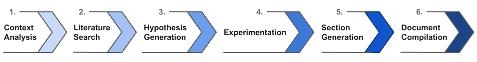
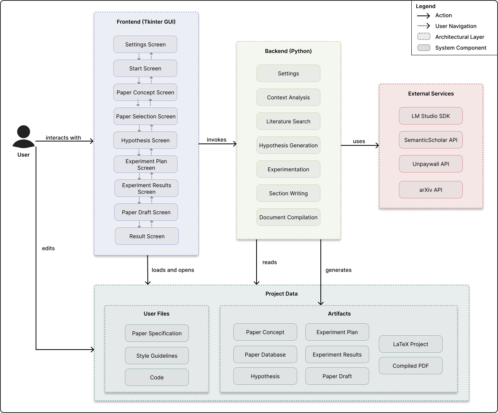
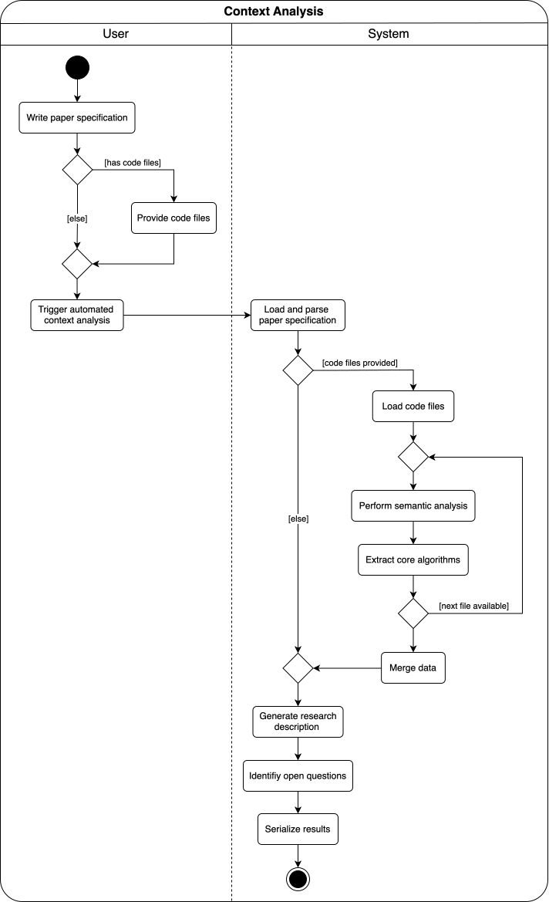
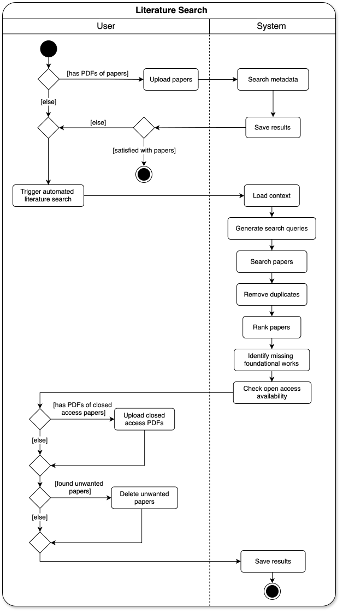
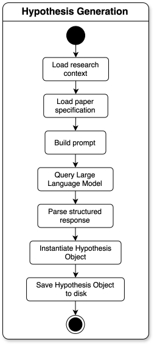

# A Human-in-the-Loop System for Research Paper Generation Using Local Large Language Models

## 1. Introduction
- Simple diagram of the entire workflow (the 6 phases), something like:

## 2. Foundations
Important concepts: Language Models, Embedding Models, RAG, (Local) Inference, Prompt Engineering...

## 3. Related Work
CycleResearcher, Agent Laboratory, AI-Researcher, The AI-Scientist, Meow, DORA AI...

## 4. System Design

### 4.1 Requirements
| ID | Category | Requirement Name | Description |
| :--- | :--- | :--- | :--- |
| FR1 | Functional | Literature Search | The system shall query external databases to retrieve and store metadata and full-text documents of research papers. |
| FR2 | Functional | Context Analysis | The system shall process user data as input to produce a structured research topic definition. |
| FR3 | Functional | Model Selection | The system shall provide a function to assign specific local models to different tasks (e.g., Coding vs. Writing). |
| FR4 | Functional | Experimentation | The system shall generate code, execute it, and save the execution artifacts (logs, plots, data). |
| FR5 | Functional | Section Generation | The system shall generate text sections that include citations referenced from the retrieved literature. |
| FR6 | Functional | Document Compilation | The system shall compile the generated content into a PDF document. |
 FR7 | Functional | Human-in-the-Loop |The system shall allow the user to view generated artifacts and optionally edit them. |
| NFR1 | Non-Functional | Privacy | The system shall process all inference data locally. |
| NFR2 | Non-Functional | Free Execution | The system shall perform all functions free of charge. |
| C1 | Constraint | Technology Stack | The system shall be implemented using Python (language), Tkinter (GUI), and LM Studio (inference engine). |

### 4.2 Overview
- Diagram from Human in the Loop Pattern (how does user interact with system)

- Component or Block Diagram of the system architecture, something like:

### 4.3 Generation Process (Process Specification)
- Activity Diagram for each phase

#### 4.3.1 Context Analysis

#### 4.3.2 Literature Search

#### 4.3.3 Hypothesis Generation

#### 4.3.4 Experimentation

#### 4.3.5 Section Writing

#### 4.3.6 Document Compilation

## 5. Implementation

## 6. Evaluation

### 6.1 Methodology

### 6.2 Requirements Verification
- Via simple unit tests, inspection, analysis, demonstration...

### 6.3 Proof of Concept (Case Study)
- Test entire workflow with a problem we know the answer to
- Did it generate a paper and does it come to the right conclusion?

## 7. Discussion

## 8. Conclusion + Future Work
